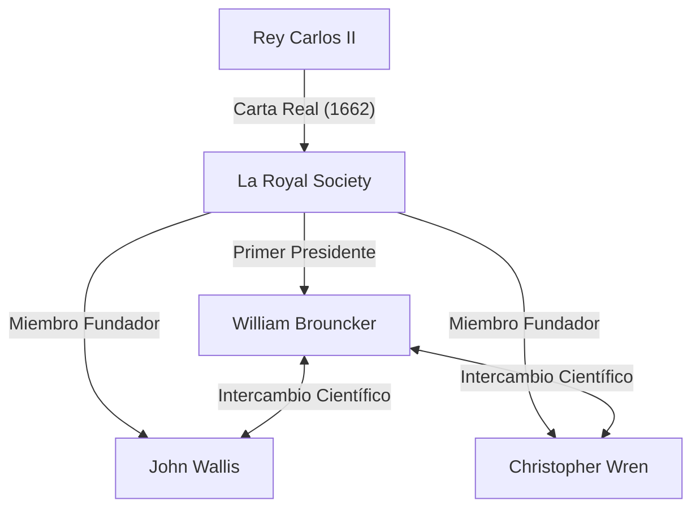
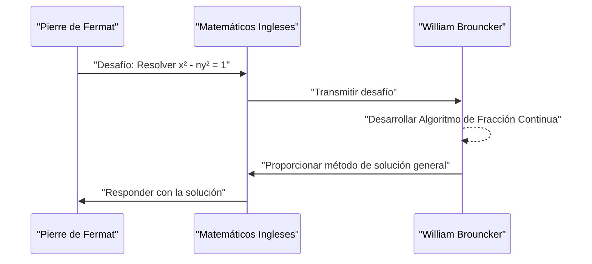

## 1. Introducción

La Europa del siglo XVII se encontraba en medio de una revolución científica. Fue una época en la que las matemáticas y la física dieron saltos espectaculares, como lo demuestra el descubrimiento del cálculo por [Isaac Newton](https://kenji.blog/es/p/newton/) y Gottfried Wilhelm Leibniz. En medio de esto, la institución que desempeñó un papel central en el desarrollo de la academia británica fue **The Royal Society** (La Real Sociedad de Londres).

Este artículo proporciona una explicación detallada de la vida y los notables logros matemáticos de **[William Brouncker](https://kenji.blog/es/p/brouncker/)**, quien se desempeñó como el primer presidente de la Royal Society y dejó su huella en la historia como matemático con su "representación en fracción continua de Pi" y su "solución a la ecuación de Pell". Brouncker interactuó con las mentes más brillantes de la Europa de la época y abordó numerosos problemas desafiantes. Sus logros contribuyeron significativamente a sentar las bases para un tratamiento matemáticamente riguroso del concepto de infinito.

## 2. Vida temprana y carrera

[William Brouncker](https://kenji.blog/es/p/brouncker/) (1620 - 5 de abril de 1684) nació como el hijo mayor de [William Brouncker](https://kenji.blog/es/p/brouncker/), primer vizconde de Brouncker, y Winifred Leigh. Si bien hay muchos detalles desconocidos sobre su lugar exacto de nacimiento y educación temprana, se cree que estudió en la Universidad de Oxford, cultivando excelentes habilidades lingüísticas y sentido matemático. En 1645, tras la muerte de su padre, se convirtió en el segundo vizconde Brouncker.

En ese momento, Inglaterra se encontraba en el período caótico de la Revolución Puritana (Guerra Civil Inglesa), pero Brouncker se dedicó más al mundo de la academia que a la política. Tenía un interés particularmente fuerte en las matemáticas y la música, comenzando a construir sus propias teorías. En 1647, obtuvo un doctorado en medicina de la Universidad de Oxford, pero su principal interés siempre permaneció en las ciencias exactas. También se sabe que su hermano menor, Henry Brouncker, estuvo activo en el mundo político y cortesano mientras mantenía un interés en el ajedrez y las matemáticas.

## 3. Actividades como primer presidente de la Royal Society

La Royal Society es una de las sociedades científicas más antiguas del mundo, dedicada a mejorar el conocimiento natural. Sus orígenes residen en una reunión formada después de una conferencia de Christopher Wren en Londres en 1660, y se lanzó oficialmente en 1662 tras recibir una Carta Real del rey Carlos II.

El elegido como **Primer Presidente** de esta histórica sociedad fue [William Brouncker](https://kenji.blog/es/p/brouncker/). En medio de la formación de la sociedad gracias a los esfuerzos de Robert Moray y otros, Brouncker se desempeñó como presidente durante un largo período de 15 años, desde 1662 hasta 1677, dedicándose a construir las bases de la sociedad.

Brouncker desempeñó un papel crucial al reunir a científicos destacados como Robert Boyle y Robert Hooke, y al establecer una nueva metodología científica que enfatizaba la verificación experimental. Él mismo participó activamente en experimentos sobre el movimiento de los péndulos y el peso de la atmósfera, presentando numerosos informes en las reuniones de la sociedad. También funcionó como conducto hacia la familia real, contribuyendo enormemente a la estabilidad financiera y social de la sociedad.

## 4. Logro matemático: Representación en fracción continua de Pi

El logro matemático más famoso de Brouncker es el descubrimiento de la fracción continua generalizada para la constante $\pi$. Esto se introdujo en el libro *Arithmetica Infinitorum* (1655) por el matemático contemporáneo [John Wallis](https://kenji.blog/es/p/wallis/), lo que lo hizo ampliamente conocido.

### Fórmula de Wallis y transformación de Brouncker

Wallis había descubierto el siguiente producto infinito (Fórmula de Wallis) con respecto a Pi:

$$
\frac{\pi}{2} = \frac{2}{1} \cdot \frac{2}{3} \cdot \frac{4}{3} \cdot \frac{4}{5} \cdot \frac{6}{5} \cdot \frac{6}{7} \cdot \frac{8}{7} \cdots
$$

Wallis mostró este resultado a Brouncker y le preguntó si podía expresarse de otra forma. En respuesta, Brouncker, utilizando manipulación algebraica y un concepto inteligente de límites, transformó magistralmente esta ecuación en una fracción continua. Esta es la siguiente **Fórmula de Brouncker**:

$$
\frac{4}{\pi} = 1 + \frac{1^2}{2 + \frac{3^2}{2 + \frac{5^2}{2 + \frac{7^2}{2 + \ddots}}}}
$$

### Importancia de la fórmula y resumen de la demostración

Esta fracción continua cautivó a muchos matemáticos por su belleza y regularidad. Posee una estructura notablemente elegante donde los cuadrados de los números impares aparecen continuamente en los numeradores, y la parte entera de los denominadores es siempre $2$. Este descubrimiento demostró que el número trascendental Pi está incrustado dentro de una simple regularidad de los números naturales.

Las fracciones continuas son herramientas muy poderosas para aproximar números irracionales. Aunque la fórmula de Brouncker converge muy lentamente y, por lo tanto, no era adecuada para el cálculo práctico de Pi, tuvo un impacto masivo en las matemáticas posteriores como un ejemplo pionero de expansión de fracciones continuas en el análisis matemático. Más tarde, Euler generalizaría aún más esta fórmula, desarrollando profundamente la teoría de las fracciones continuas.

## 5. Logro matemático: Resolución de la ecuación de Pell

Otro logro importante es la solución a la llamada **ecuación de Pell**. La ecuación de Pell es una ecuación diofántica (una ecuación polinómica con coeficientes enteros) de la siguiente forma para un entero positivo $n$ que no es un cuadrado perfecto:

$$
x^2 - n y^2 = 1 \quad (\text{donde } x, y \text{ son enteros})
$$

### El desafío de Fermat

En 1657, el gran matemático francés [Pierre de Fermat](https://kenji.blog/es/p/fermat/) envió un desafío a los matemáticos ingleses para encontrar soluciones enteras a esta ecuación. Fermat citó casos difíciles como $n=61$ a modo de ejemplo.

### El algoritmo de Brouncker

Fueron Wallis y Brouncker quienes hicieron frente a este desafío. Brouncker, en particular, desarrolló un método virtualmente equivalente al algoritmo conocido hoy como el "método de las fracciones continuas", estableciendo un procedimiento para encontrar la solución entera positiva mínima a la ecuación para cualquier número no cuadrado $n$.

El enfoque de Brouncker consiste en calcular la expansión en fracción continua de $\sqrt{n}$ y construir la solución utilizando sus fracciones convergentes. Por ejemplo, en el caso de $n=2$, la ecuación se convierte en $x^2 - 2y^2 = 1$. La expansión en fracción continua de $\sqrt{2}$ es $[1; 2, 2, 2, \dots]$, y al calcular sus convergentes, podemos obtener la solución mínima $x=3, y=2$. De hecho, $3^2 - 2 \cdot 2^2 = 9 - 8 = 1$ es cierto.

En el caso de $n=61$ presentado por Fermat, la solución mínima es extraordinariamente grande:

$$
x = 1766319049, \quad y = 226153980
$$

Brouncker demostró que incluso soluciones tan gigantescas podían derivarse sistemáticamente utilizando su método. Irónicamente, debido a un malentendido de [Leonhard Euler](https://kenji.blog/es/p/euler/), esta ecuación recibió más tarde el nombre del matemático inglés John Pell, pero la mayor contribución para establecer el método de solución pertenece indiscutiblemente a Brouncker.

## 6. Otros logros y años posteriores

### Contribuciones a la teoría musical

Brouncker estaba interesado no solo en las matemáticas sino también en la teoría musical. Tradujo el *Musicae Compendium* de [René Descartes](https://kenji.blog/es/p/descartes/) al inglés y lo publicó de forma anónima. Al hacerlo, no se limitó a traducirlo, sino que añadió un apéndice proponiendo su propio sistema de afinación (temperamento igual de 17 tonos) que dividía una octava en 17 intervalos iguales. Este fue un intento pionero de analizar las escalas musicales matemáticamente utilizando logaritmos.

### Cuadratura de la parábola y curva logarítmica

Además, llevó a cabo importantes investigaciones sobre la cuadratura (cálculo del área) de la hipérbola. Ideó un método para calcular el área de una hipérbola utilizando series infinitas, lo que condujo a la expansión en serie de la función logarítmica. Contemporáneo a Nicholas Mercator, reconoció la utilidad de las series infinitas en el cálculo de logaritmos naturales. Este fue un paso crucial en el desarrollo posterior del cálculo.

### Balística y mecánica

En el campo de la mecánica, realizó investigaciones sobre el retroceso de las armas de fuego y verificó la teoría de Christiaan Huygens sobre el isocronismo de los péndulos. Esto demuestra que tenía buen ojo no solo para la exploración teórica, sino también para las aplicaciones prácticas y militares.

En sus últimos años, incluso después de dejar el cargo de presidente de la Royal Society, Brouncker ocupó cargos públicos como comisionado de la Junta de la Armada. El nombre de Brouncker aparece con frecuencia en el famoso diario de Samuel Pepys como un colega capaz en la administración naval. Permaneció soltero toda su vida y falleció en su casa de Londres en 1684.

## 7. Conclusión

[William Brouncker](https://kenji.blog/es/p/brouncker/) fue un líder destacado y un matemático original que impulsó la comunidad científica británica del siglo XVII. Sus logros al sentar las bases de la ciencia moderna como primer presidente de la Royal Society son inconmensurables. Además, sus logros matemáticos, como la representación en fracción continua de Pi y la solución a la ecuación de Pell, se convirtieron en hitos importantes en el desarrollo del análisis matemático, que se ocupa del concepto de infinito, y de la teoría de números.

Su enfoque simboliza el período de transición de la geometría rigurosa al análisis utilizando el álgebra y las series infinitas. Si bien su nombre a menudo se ve ensombrecido por gigantes como Newton y Fermat, sin la existencia de **Brouncker**, no se puede discutir la riqueza de las matemáticas en la actualidad. Su curiosidad intelectual y espíritu de investigación continúan brillando ante nosotros como la belleza de las matemáticas, incluso cientos de años después.
