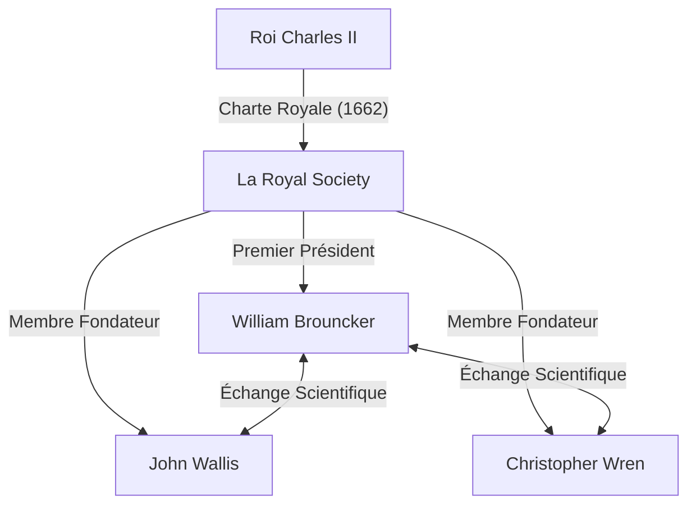
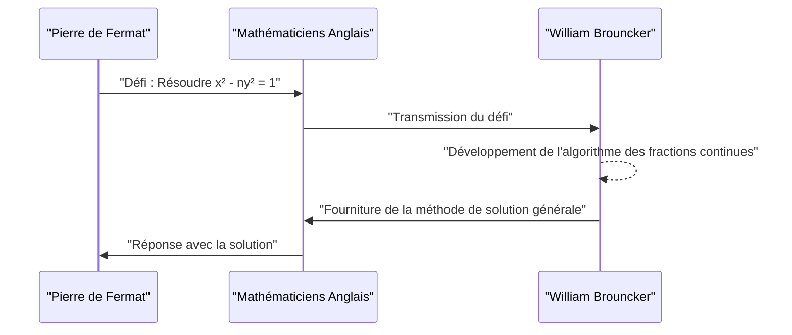

## 1. Introduction

L'Europe du 17ème siècle était au cœur d'une révolution scientifique. Ce fut une époque où les mathématiques et la physique firent des bonds spectaculaires en avant, comme l'illustre la découverte du calcul infinitésimal par [Isaac Newton](https://kenji.blog/fr/p/newton/) et Gottfried Wilhelm Leibniz. Dans ce contexte, l'institution qui a joué un rôle central dans le développement du monde universitaire britannique fut **La Royal Society**.

Cet article fournit une explication détaillée de la vie et des réalisations mathématiques remarquables de **[William Brouncker](https://kenji.blog/fr/p/brouncker/)**, qui fut le premier président de la Royal Society et qui a marqué l'histoire en tant que mathématicien grâce à sa « représentation en fraction continue de Pi » et sa « solution de l'équation de Pell ». [Brouncker](https://kenji.blog/fr/p/brouncker/) a interagi avec les plus grands esprits de l'Europe de l'époque et s'est attaqué à de nombreux problèmes ardus. Ses réalisations ont grandement contribué à jeter les bases d'un traitement mathématiquement rigoureux du concept d'infini.

## 2. Jeunesse et début de carrière

[William Brouncker](https://kenji.blog/fr/p/brouncker/) (1620 - 5 avril 1684) est né en tant que fils aîné de William Brouncker, 1er vicomte Brouncker, et de Winifred Leigh. Bien qu'il y ait beaucoup de détails inconnus concernant son lieu de naissance exact et son éducation précoce, on pense qu'il a étudié à l'Université d'Oxford, y cultivant d'excellentes compétences linguistiques et un sens mathématique. En 1645, suite au décès de son père, il devint le 2ème vicomte [Brouncker](https://kenji.blog/fr/p/brouncker/).

À l'époque, l'Angleterre traversait la période chaotique de la Révolution puritaine (Première révolution anglaise), mais [Brouncker](https://kenji.blog/fr/p/brouncker/) s'est davantage consacré au monde universitaire qu'à la scène politique. Il avait un intérêt particulièrement fort pour les mathématiques et la musique, commençant à construire ses propres théories. En 1647, il obtint un doctorat en médecine de l'Université d'Oxford, mais son intérêt principal a toujours résidé dans les sciences exactes. Son jeune frère, Henry [Brouncker](https://kenji.blog/fr/p/brouncker/), était également connu pour être actif dans le monde politique et à la cour, tout en maintenant un intérêt pour les échecs et les mathématiques.

## 3. Activités en tant que premier président de la Royal Society

La Royal Society est l'une des plus anciennes sociétés scientifiques au monde, dédiée à l'amélioration des connaissances naturelles. Ses origines remontent à un rassemblement formé après une conférence de Christopher Wren à Londres en 1660, et elle fut officiellement lancée en 1662 après avoir reçu une charte royale du roi Charles II.

Celui qui fut élu **Premier Président** de cette société historique fut [William Brouncker](https://kenji.blog/fr/p/brouncker/). Alors que la société prenait forme grâce aux efforts de Robert Moray et d'autres, [Brouncker](https://kenji.blog/fr/p/brouncker/) a occupé le poste de président pendant une longue période de 15 ans, de 1662 à 1677, se consacrant à la consolidation des fondations de la société.

[Brouncker](https://kenji.blog/fr/p/brouncker/) a joué un rôle crucial en réunissant des scientifiques exceptionnels comme Robert Boyle et Robert Hooke, et en établissant une nouvelle méthodologie scientifique qui mettait l'accent sur la vérification expérimentale. Il a lui-même participé activement à des expériences concernant le mouvement des pendules et le poids de l'atmosphère, présentant de nombreux rapports lors des réunions de la société. Il a également servi de relais avec la famille royale, contribuant grandement à la stabilité financière et sociale de la société.

## 4. Réalisation mathématique : Représentation en fraction continue de Pi

La réalisation mathématique la plus célèbre de [Brouncker](https://kenji.blog/fr/p/brouncker/) est la découverte de la fraction continue généralisée pour le rapport de circonférence $\pi$. Celle-ci a été introduite dans le livre *Arithmetica Infinitorum* (1655) du mathématicien contemporain [John Wallis](https://kenji.blog/fr/p/wallis/), ce qui l'a rendue largement connue.

### Formule de [Wallis](https://kenji.blog/fr/p/wallis/) et transformation de [Brouncker](https://kenji.blog/fr/p/brouncker/)

[Wallis](https://kenji.blog/fr/p/wallis/) avait découvert le produit infini suivant (Formule de [Wallis](https://kenji.blog/fr/p/wallis/)) concernant Pi :

$$
\frac{\pi}{2} = \frac{2}{1} \cdot \frac{2}{3} \cdot \frac{4}{3} \cdot \frac{4}{5} \cdot \frac{6}{5} \cdot \frac{6}{7} \cdot \frac{8}{7} \cdots
$$

[Wallis](https://kenji.blog/fr/p/wallis/) a montré ce résultat à Brouncker et lui a demandé s'il pouvait être exprimé sous une forme différente. En réponse, Brouncker, utilisant des manipulations algébriques et un concept ingénieux de limites, a magistralement transformé cette équation en une fraction continue. C'est la **formule de [Brouncker](https://kenji.blog/fr/p/brouncker/)** suivante :

$$
\frac{4}{\pi} = 1 + \frac{1^2}{2 + \frac{3^2}{2 + \frac{5^2}{2 + \frac{7^2}{2 + \ddots}}}}
$$

### Signification de la formule et aperçu de la démonstration

Cette fraction continue a captivé de nombreux mathématiciens par sa beauté et sa régularité. Elle possède une structure remarquablement élégante où les carrés des nombres impairs apparaissent continuellement aux numérateurs, et la partie entière des dénominateurs est toujours $2$. Cette découverte a démontré que le nombre transcendant Pi est imbriqué dans une simple régularité des nombres naturels.

Les fractions continues sont des outils très puissants pour approximer les nombres irrationnels. Bien que la formule de [Brouncker](https://kenji.blog/fr/p/brouncker/) converge très lentement et était donc inadaptée au calcul pratique de Pi, elle a eu un impact massif sur les mathématiques ultérieures en tant qu'exemple pionnier de développement en fraction continue dans l'analyse. Euler généralisera plus tard cette formule davantage, développant profondément la théorie des fractions continues.

## 5. Réalisation mathématique : Résolution de l'équation de Pell

Une autre réalisation importante est la solution de ce qu'on appelle **l'équation de Pell**. L'équation de Pell est une équation diophantienne (une équation polynomiale à coefficients entiers) de la forme suivante pour un entier positif $n$ qui n'est pas un carré parfait :

$$
x^2 - n y^2 = 1 \quad (\text{où } x, y \text{ sont des entiers})
$$

### Le défi de [Fermat](https://kenji.blog/fr/p/fermat/)

En 1657, le grand mathématicien français [Pierre de Fermat](https://kenji.blog/fr/p/fermat/) a lancé un défi aux mathématiciens anglais pour trouver des solutions entières à cette équation. [Fermat](https://kenji.blog/fr/p/fermat/) citait en exemple des cas difficiles comme $n=61$.

### L'algorithme de [Brouncker](https://kenji.blog/fr/p/brouncker/)

Ce sont [Wallis](https://kenji.blog/fr/p/wallis/) et Brouncker qui ont relevé ce défi. [Brouncker](https://kenji.blog/fr/p/brouncker/) en particulier a développé une méthode virtuellement équivalente à l'algorithme connu aujourd'hui sous le nom de « méthode des fractions continues », établissant une procédure pour trouver la solution entière positive minimale à l'équation pour tout nombre non carré $n$.

L'approche de [Brouncker](https://kenji.blog/fr/p/brouncker/) consiste à calculer le développement en fraction continue de $\sqrt{n}$ et à construire la solution en utilisant ses fractions convergentes (réduites). Par exemple, dans le cas de $n=2$, l'équation devient $x^2 - 2y^2 = 1$. Le développement en fraction continue de $\sqrt{2}$ est $[1; 2, 2, 2, \dots]$, et en calculant ses convergentes, on peut obtenir la solution minimale $x=3, y=2$. En effet, $3^2 - 2 \cdot 2^2 = 9 - 8 = 1$ est vrai.

Dans le cas de $n=61$ présenté par [Fermat](https://kenji.blog/fr/p/fermat/), la solution minimale est extraordinairement grande :

$$
x = 1766319049, \quad y = 226153980
$$

[Brouncker](https://kenji.blog/fr/p/brouncker/) a démontré que même des solutions aussi gigantesques pouvaient être dérivées de manière systématique en utilisant sa méthode. Ironiquement, en raison d'un malentendu de Leonhard Euler, cette équation a été nommée plus tard d'après le mathématicien anglais John Pell, mais la plus grande contribution à l'établissement de la méthode de résolution appartient indéniablement à [Brouncker](https://kenji.blog/fr/p/brouncker/).

## 6. Autres réalisations et dernières années

### Contributions à la théorie musicale

[Brouncker](https://kenji.blog/fr/p/brouncker/) s'intéressait non seulement aux mathématiques mais aussi à la théorie musicale. Il a traduit le *Musicae Compendium* de [René Descartes](https://kenji.blog/fr/p/descartes/) en anglais et l'a publié anonymement. Ce faisant, il ne s'est pas contenté de le traduire, mais a ajouté une annexe proposant son propre système d'accordage (tempérament égal à 17 tons) qui divisait une octave en 17 intervalles égaux. Il s'agissait d'une tentative pionnière d'analyser les gammes musicales mathématiquement en utilisant les logarithmes.

### Quadrature de la parabole et courbe logarithmique

En outre, il a mené des recherches importantes sur la quadrature (le calcul de l'aire) de l'hyperbole. Il a conçu une méthode pour calculer l'aire d'une hyperbole à l'aide de séries infinies, ce qui a conduit au développement en série de la fonction logarithmique. Contemporain de Nicholas Mercator, il a reconnu l'utilité des séries infinies dans le calcul des logarithmes naturels. Ce fut une étape cruciale dans le développement ultérieur du calcul infinitésimal.

### Balistique et mécanique

Dans le domaine de la mécanique, il a mené des recherches sur le recul des armes à feu et a vérifié la théorie de Christiaan Huygens sur l'isochronisme des pendules. Cela montre qu'il avait un œil non seulement pour l'exploration théorique, mais aussi pour les applications pratiques et militaires.

Dans ses dernières années, même après avoir quitté son poste de président de la Royal Society, [Brouncker](https://kenji.blog/fr/p/brouncker/) a occupé des fonctions publiques telles que commissaire du Conseil de la Marine. Le nom de [Brouncker](https://kenji.blog/fr/p/brouncker/) apparaît fréquemment dans le célèbre journal de Samuel Pepys en tant que collègue compétent dans l'administration navale. Il est resté célibataire toute sa vie et est décédé à son domicile de Londres en 1684.

## 7. Conclusion

[William Brouncker](https://kenji.blog/fr/p/brouncker/) était un leader exceptionnel et un mathématicien original qui a stimulé la communauté scientifique britannique du 17ème siècle. Ses réalisations dans l'établissement des fondations de la science moderne en tant que premier président de la Royal Society sont incommensurables. De plus, ses réalisations mathématiques, telles que la représentation en fraction continue de Pi et la solution de l'équation de Pell, sont devenues des jalons importants dans le développement de l'analyse, qui traite du concept d'infini, et de la théorie des nombres.

Son approche symbolise la période de transition de la géométrie rigoureuse à l'analyse utilisant l'algèbre et les séries infinies. Bien que son nom soit souvent éclipsé par des géants comme Newton et [Fermat](https://kenji.blog/fr/p/fermat/), sans l'existence de **[Brouncker](https://kenji.blog/fr/p/brouncker/)**, la richesse des mathématiques d'aujourd'hui ne peut être discutée. Sa curiosité intellectuelle et son esprit de recherche continuent de briller devant nous comme la beauté des mathématiques, même des centaines d'années plus tard.
