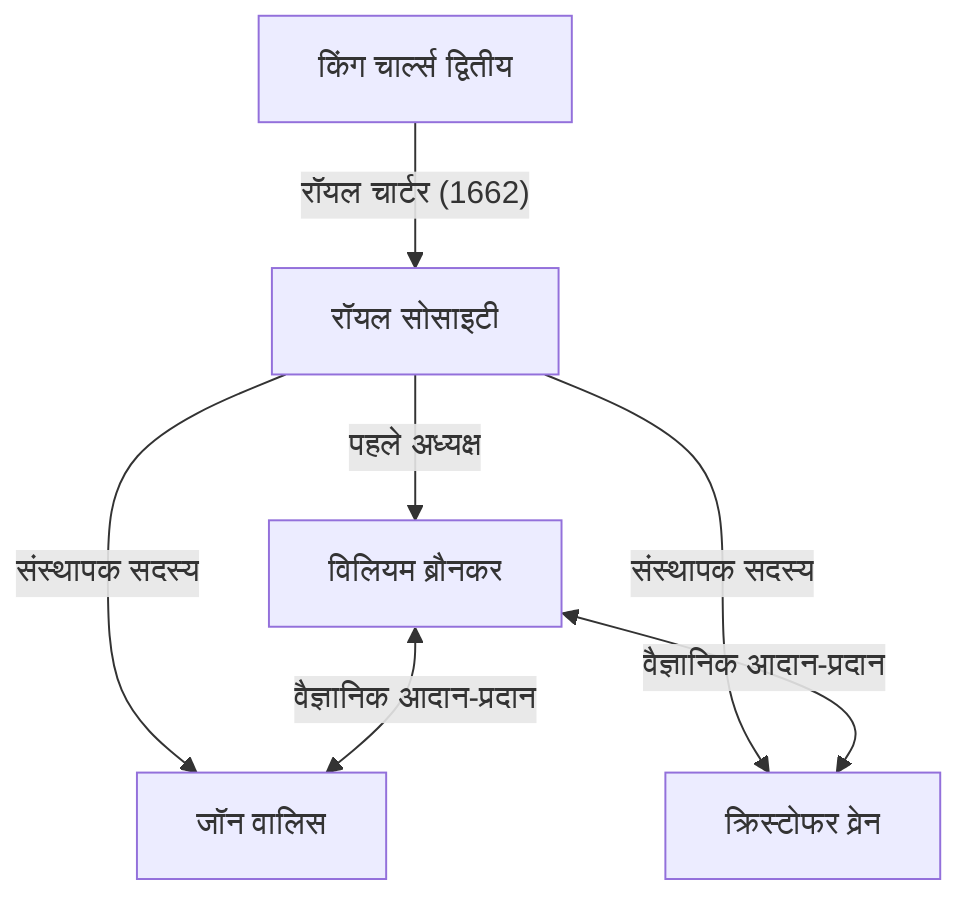
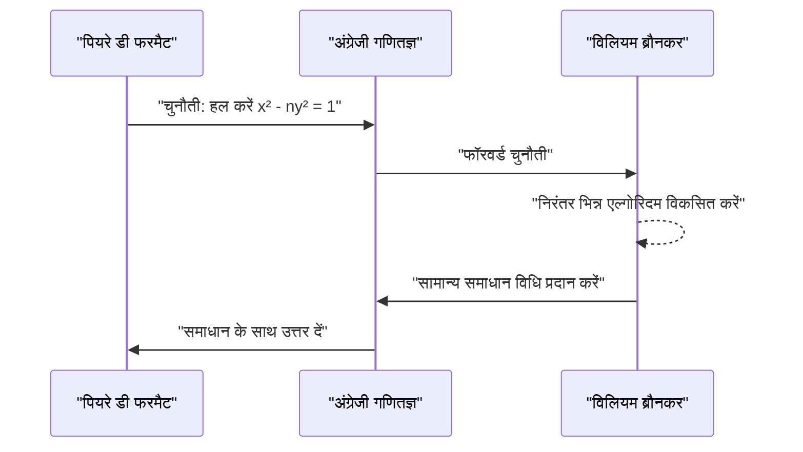

## 1. प्रस्तावना

17वीं शताब्दी का यूरोप वैज्ञानिक क्रांति के मध्य में था। यह वह युग था जब गणित और भौतिकी ने नाटकीय छलांग लगाई, जिसका उदाहरण [आइजैक न्यूटन](https://kenji.blog/p/newton/) और गॉटफ्राइड विल्हेम लीबनिज द्वारा कैलकुलस की खोज है। इसके बीच, ब्रिटिश शिक्षाविदों के विकास में केंद्रीय भूमिका निभाने वाली संस्था **द रॉयल सोसाइटी** थी।

यह लेख **[विलियम ब्रौनकर](https://kenji.blog/p/brouncker/)** के जीवन और उल्लेखनीय गणितीय उपलब्धियों का विस्तृत विवरण प्रदान करता है, जिन्होंने रॉयल सोसाइटी के पहले अध्यक्ष के रूप में कार्य किया और "पाई के निरंतर भिन्न प्रतिनिधित्व" और "पेल के समीकरण के समाधान" के साथ एक गणितज्ञ के रूप में इतिहास में अपनी छाप छोड़ी। ब्रौनकर ने उस समय यूरोप के शीर्ष दिमागों के साथ बातचीत की और कई चुनौतीपूर्ण समस्याओं का सामना किया। उनकी उपलब्धियों ने अनंत की अवधारणा के गणितीय रूप से कठोर उपचार के लिए आधार तैयार करने में महत्वपूर्ण योगदान दिया।

## 2. प्रारंभिक जीवन और करियर

[विलियम ब्रौनकर](https://kenji.blog/p/brouncker/) (1620 - 5 अप्रैल 1684) का जन्म [विलियम ब्रौनकर](https://kenji.blog/p/brouncker/), पहले विस्काउंट ब्रौनकर, और विनिफ्रेड ले के सबसे बड़े बेटे के रूप में हुआ था। हालाँकि उनके सटीक जन्मस्थान और प्रारंभिक शिक्षा के बारे में कई अज्ञात विवरण हैं, माना जाता है कि उन्होंने ऑक्सफोर्ड विश्वविद्यालय में अध्ययन किया, उत्कृष्ट भाषा कौशल और गणितीय समझ की खेती की। 1645 में, अपने पिता की मृत्यु के बाद, वे दूसरे विस्काउंट ब्रौनकर बन गए।

उस समय, इंग्लैंड प्यूरिटन क्रांति (अंग्रेजी गृह युद्ध) की अराजक अवधि में था, लेकिन ब्रौनकर ने राजनीतिक मंच की तुलना में अकादमिक दुनिया के लिए खुद को अधिक समर्पित कर दिया। उन्हें गणित और संगीत में विशेष रूप से गहरी रुचि थी, और उन्होंने अपने स्वयं के सिद्धांतों का निर्माण शुरू किया। 1647 में, उन्हें ऑक्सफोर्ड विश्वविद्यालय से डॉक्टर ऑफ मेडिसिन की डिग्री से सम्मानित किया गया, लेकिन उनकी प्राथमिक रुचि हमेशा सटीक विज्ञान में बनी रही। उनके छोटे भाई, हेनरी ब्रौनकर को शतरंज और गणित में रुचि बनाए रखते हुए राजनीतिक और दरबारी दुनिया में सक्रिय रहने के लिए भी जाना जाता था।

## 3. रॉयल सोसाइटी के पहले अध्यक्ष के रूप में गतिविधियाँ

रॉयल सोसाइटी दुनिया की सबसे पुरानी वैज्ञानिक समाजों में से एक है, जो प्राकृतिक ज्ञान में सुधार के लिए समर्पित है। इसकी उत्पत्ति 1660 में लंदन में क्रिस्टोफर व्रेन के व्याख्यान के बाद गठित एक सभा में निहित है, और किंग चार्ल्स द्वितीय से रॉयल चार्टर प्राप्त करने के बाद इसे आधिकारिक तौर पर 1662 में लॉन्च किया गया था।

इस ऐतिहासिक समाज के **पहले अध्यक्ष** के रूप में [विलियम ब्रौनकर](https://kenji.blog/p/brouncker/) चुने गए थे। रॉबर्ट मोरे और अन्य के प्रयासों के माध्यम से समाज को आकार देने के बीच, ब्रौनकर ने 1662 से 1677 तक 15 वर्षों की लंबी अवधि के लिए अध्यक्ष के रूप में कार्य किया, समाज की नींव के निर्माण के लिए खुद को समर्पित कर दिया।

ब्रौनकर ने रॉबर्ट बॉयल और रॉबर्ट हुक जैसे उत्कृष्ट वैज्ञानिकों को एक साथ लाने और एक नई वैज्ञानिक पद्धति स्थापित करने में महत्वपूर्ण भूमिका निभाई जो प्रयोगात्मक सत्यापन पर जोर देती थी। उन्होंने स्वयं पेंडुलम की गति और वातावरण के वजन से संबंधित प्रयोगों में सक्रिय रूप से भाग लिया, और समाज की बैठकों में कई रिपोर्टें प्रस्तुत कीं। उन्होंने शाही परिवार के लिए एक नाली के रूप में भी काम किया, समाज की वित्तीय और सामाजिक स्थिरता में बहुत योगदान दिया।

## 4. गणितीय उपलब्धि: पाई का निरंतर भिन्न प्रतिनिधित्व

ब्रौनकर की सबसे प्रसिद्ध गणितीय उपलब्धि परिधि अनुपात $\pi$ के लिए सामान्यीकृत निरंतर भिन्न की खोज है। इसे समकालीन गणितज्ञ [जॉन वालिस](https://kenji.blog/p/wallis/) द्वारा पुस्तक *Arithmetica Infinitorum* (1655) में पेश किया गया था, जिसने इसे व्यापक रूप से जाना।

### वालिस का सूत्र और ब्रौनकर का परिवर्तन

वालिस ने पाई के संबंध में निम्नलिखित अनंत गुणनफल (वालिस का सूत्र) की खोज की थी:

$$
\frac{\pi}{2} = \frac{2}{1} \cdot \frac{2}{3} \cdot \frac{4}{3} \cdot \frac{4}{5} \cdot \frac{6}{5} \cdot \frac{6}{7} \cdot \frac{8}{7} \cdots
$$

वालिस ने इस परिणाम को ब्रौनकर को दिखाया और पूछा कि क्या इसे एक अलग रूप में व्यक्त किया जा सकता है। जवाब में, ब्रौनकर ने बीजीय हेरफेर और सीमा की एक चतुर अवधारणा का उपयोग करते हुए, इस समीकरण को निरंतर भिन्न में बदल दिया। यह निम्नलिखित **ब्रौनकर का सूत्र** है:

$$
\frac{4}{\pi} = 1 + \frac{1^2}{2 + \frac{3^2}{2 + \frac{5^2}{2 + \frac{7^2}{2 + \ddots}}}}
$$

### सूत्र का महत्व और प्रमाण का अवलोकन

इस निरंतर भिन्न ने अपनी सुंदरता और नियमितता से कई गणितज्ञों को मोहित कर लिया। इसमें एक उल्लेखनीय रूप से सुरुचिपूर्ण संरचना है जहां विषम संख्याओं के वर्ग अंशों में लगातार दिखाई देते हैं, और हर का पूर्णांक भाग हमेशा $2$ होता है। इस खोज ने प्रदर्शित किया कि पारलौकिक संख्या पाई प्राकृतिक संख्याओं की एक साधारण नियमितता के भीतर एम्बेडेड है।

निरंतर भिन्न अपरिमेय संख्याओं का अनुमान लगाने के लिए अत्यधिक शक्तिशाली उपकरण हैं। हालांकि ब्रौनकर का सूत्र बहुत धीमी गति से परिवर्तित होता है और इसलिए पाई की व्यावहारिक गणना के लिए अनुपयुक्त था, लेकिन विश्लेषण में निरंतर भिन्न विस्तार के एक अग्रणी उदाहरण के रूप में बाद के गणित पर इसका व्यापक प्रभाव पड़ा। यूलर बाद में इस सूत्र को और अधिक सामान्य करेगा, निरंतर भिन्नों के सिद्धांत को गहराई से विकसित करेगा।

## 5. गणितीय उपलब्धि: पेल के समीकरण को हल करना

एक और महत्वपूर्ण उपलब्धि तथाकथित **पेल के समीकरण** का समाधान है। पेल का समीकरण एक सकारात्मक पूर्णांक $n$ के लिए निम्नलिखित रूप का डायोफैंटाइन समीकरण (पूर्णांक गुणांक वाला एक बहुपद समीकरण) है जो एक पूर्ण वर्ग नहीं है:

$$
x^2 - n y^2 = 1 \quad (\text{जहाँ } x, y \text{ पूर्णांक हैं})
$$

### फरमैट की चुनौती

1657 में, महान फ्रांसीसी गणितज्ञ पियरे डी फरमैट ने इस समीकरण के पूर्णांक समाधान खोजने के लिए अंग्रेजी गणितज्ञों को एक चुनौती भेजी। फरमैट ने उदाहरण के रूप में $n=61$ जैसे कठिन मामलों का हवाला दिया।

### ब्रौनकर का एल्गोरिदम

यह वालिस और ब्रौनकर थे जो इस चुनौती के खिलाफ खड़े हुए। विशेष रूप से ब्रौनकर ने एक विधि विकसित की जो आज "निरंतर भिन्न विधि" के रूप में जाने जाने वाले एल्गोरिथ्म के लगभग बराबर है, जो किसी भी गैर-वर्ग संख्या $n$ के लिए समीकरण के न्यूनतम सकारात्मक पूर्णांक समाधान को खोजने के लिए एक प्रक्रिया स्थापित करता है।

ब्रौनकर के दृष्टिकोण में $\sqrt{n}$ के निरंतर भिन्न विस्तार की गणना करना और इसके अभिसरण भिन्नों का उपयोग करके समाधान का निर्माण करना शामिल है। उदाहरण के लिए, $n=2$ के मामले में, समीकरण $x^2 - 2y^2 = 1$ हो जाता है। $\sqrt{2}$ का निरंतर भिन्न विस्तार $[1; 2, 2, 2, \dots]$ है, और इसके अभिसरण की गणना करके, हम न्यूनतम समाधान $x=3, y=2$ प्राप्त कर सकते हैं। वास्तव में, $3^2 - 2 \cdot 2^2 = 9 - 8 = 1$ सत्य है।

फरमैट द्वारा प्रस्तुत $n=61$ के मामले में, न्यूनतम समाधान असाधारण रूप से बड़ा है:

$$
x = 1766319049, \quad y = 226153980
$$

ब्रौनकर ने प्रदर्शित किया कि उनकी पद्धति का उपयोग करके ऐसे विशाल समाधानों को व्यवस्थित रूप से प्राप्त किया जा सकता है। विडंबना यह है कि [लियोनहार्ड यूलर](https://kenji.blog/p/euler/) की गलतफहमी के कारण, बाद में इस समीकरण का नाम अंग्रेजी गणितज्ञ जॉन पेल के नाम पर रखा गया, लेकिन समाधान विधि स्थापित करने में सबसे बड़ा योगदान निर्विवाद रूप से ब्रौनकर का है।

## 6. अन्य उपलब्धियां और बाद के वर्ष

### संगीत सिद्धांत में योगदान

ब्रौनकर को न केवल गणित बल्कि संगीत सिद्धांत में भी रुचि थी। उन्होंने [रेने डेसकार्टेस](https://kenji.blog/p/descartes/) के *Musicae Compendium* का अंग्रेजी में अनुवाद किया और इसे गुमनाम रूप से प्रकाशित किया। ऐसा करते हुए, उन्होंने केवल अनुवाद नहीं किया, बल्कि अपनी खुद की ट्यूनिंग प्रणाली (17-टोन समान स्वभाव) का प्रस्ताव करते हुए एक परिशिष्ट जोड़ा, जिसने एक सप्तक को 17 समान अंतरालों में विभाजित किया। यह लॉगरिदम का उपयोग करके गणितीय रूप से संगीत के पैमाने का विश्लेषण करने का एक अग्रणी प्रयास था।

### परवलय और लघुगणक वक्र का वर्ग

इसके अलावा, उन्होंने हाइपरबोला के क्वाड्रचर (क्षेत्र ढूंढना) पर महत्वपूर्ण शोध किया। उन्होंने अनंत श्रृंखला का उपयोग करके एक हाइपरबोला के क्षेत्र की गणना करने के लिए एक विधि तैयार की, जिससे लघुगणक फलन का श्रृंखला विस्तार हुआ। निकोलस मर्केटर के समकालीन, उन्होंने प्राकृतिक लघुगणक की गणना में अनंत श्रृंखला की उपयोगिता को पहचाना। कैलकुलस के बाद के विकास में यह एक महत्वपूर्ण कदम था।

### बैलिस्टिक्स और मैकेनिक्स

यांत्रिकी के क्षेत्र में, उन्होंने तोपों की पुनरावृत्ति पर शोध किया और पेंडुलम के आइसोक्रोनिज्म पर क्रिस्टियान ह्यूजेंस के सिद्धांत को सत्यापित किया। यह दर्शाता है कि उनकी नज़र न केवल सैद्धांतिक अन्वेषण पर थी, बल्कि व्यावहारिक और सैन्य अनुप्रयोगों पर भी थी।

अपने बाद के वर्षों में, रॉयल सोसाइटी के अध्यक्ष के रूप में पद छोड़ने के बाद भी, ब्रौनकर ने नेवी बोर्ड के आयुक्त जैसे सार्वजनिक कार्यालयों में कार्य किया। ब्रौनकर का नाम अक्सर सैमुअल पेपिस की प्रसिद्ध डायरी में नौसेना प्रशासन में एक सक्षम सहयोगी के रूप में प्रकट होता है। वे जीवन भर अविवाहित रहे और 1684 में लंदन में अपने घर पर उनका निधन हो गया।

## 7. निष्कर्ष

[विलियम ब्रौनकर](https://kenji.blog/p/brouncker/) एक उत्कृष्ट नेता और एक मूल गणितज्ञ थे जिन्होंने 17वीं सदी के ब्रिटिश वैज्ञानिक समुदाय को प्रेरित किया। रॉयल सोसाइटी के पहले अध्यक्ष के रूप में आधुनिक विज्ञान की नींव रखने में उनकी उपलब्धियां अथाह हैं। इसके अलावा, पाई के निरंतर भिन्न प्रतिनिधित्व और पेल के समीकरण के समाधान जैसी उनकी गणितीय उपलब्धियां, अनंत की अवधारणा से निपटने वाले विश्लेषण और संख्या सिद्धांत के विकास में महत्वपूर्ण मील के पत्थर बन गईं।

उनका दृष्टिकोण बीजगणित और अनंत श्रृंखला का उपयोग करके कठोर ज्यामिति से विश्लेषण तक संक्रमण अवधि का प्रतीक है। हालांकि उनके नाम को अक्सर न्यूटन और फरमैट जैसे दिग्गजों द्वारा ढंक दिया जाता है, लेकिन **ब्रौनकर** के अस्तित्व के बिना, आज के गणित की समृद्धि पर चर्चा नहीं की जा सकती। उनकी बौद्धिक जिज्ञासा और पूछताछ की भावना सैकड़ों वर्षों बाद भी गणित की सुंदरता के रूप में हमारे सामने चमकती रहती है।
