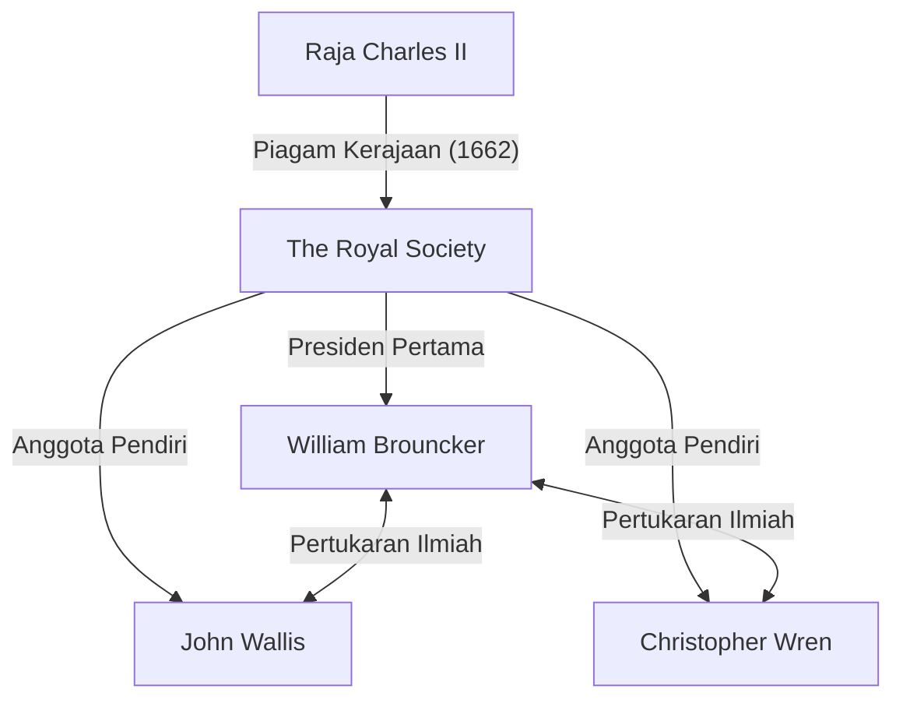
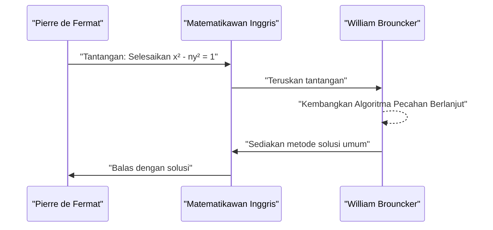

## 1. Pendahuluan

Eropa abad ke-17 berada di tengah-tengah revolusi ilmiah. Itu adalah era ketika matematika dan fisika membuat lompatan maju yang dramatis, seperti yang dicontohkan oleh penemuan kalkulus oleh [Isaac Newton](https://kenji.blog/id/p/newton/) dan Gottfried Wilhelm Leibniz. Di tengah-tengah ini, institusi yang memainkan peran sentral dalam pengembangan akademisi Inggris adalah **The Royal Society**.

Artikel ini memberikan penjelasan terperinci tentang kehidupan dan pencapaian matematika luar biasa dari **[William Brouncker](https://kenji.blog/id/p/brouncker/)**, yang menjabat sebagai Presiden pertama Royal Society dan meninggalkan jejaknya dalam sejarah sebagai matematikawan dengan "representasi pecahan berlanjut dari Pi" dan "solusi persamaan Pell". Brouncker berinteraksi dengan para pemikir top Eropa pada saat itu dan mengatasi banyak masalah yang menantang. Pencapaiannya berkontribusi secara signifikan dalam meletakkan dasar bagi perlakuan matematis yang ketat terhadap konsep ketakterhinggaan.

## 2. Kehidupan Awal dan Karier

[William Brouncker](https://kenji.blog/id/p/brouncker/) (1620 - 5 April 1684) lahir sebagai putra sulung [William Brouncker](https://kenji.blog/id/p/brouncker/), Viscount Brouncker ke-1, dan Winifred Leigh. Meskipun ada banyak detail yang tidak diketahui tentang tempat kelahiran dan pendidikan awalnya, diyakini bahwa ia belajar di Universitas Oxford, menumbuhkan keterampilan bahasa yang sangat baik dan bakat matematika. Pada tahun 1645, setelah kematian ayahnya, ia menjadi Viscount Brouncker ke-2.

Pada saat itu, Inggris berada dalam periode kacau Revolusi Puritan (Perang Saudara Inggris), tetapi Brouncker lebih mengabdikan dirinya pada dunia akademis daripada panggung politik. Dia memiliki minat yang sangat kuat pada matematika dan musik, mulai membangun teorinya sendiri. Pada tahun 1647, ia dianugerahi gelar Doctor of Medicine dari Universitas Oxford, tetapi minat utamanya selalu berada pada ilmu eksakta. Adik laki-lakinya, Henry Brouncker, juga dikenal aktif di dunia politik dan istana sambil mempertahankan minat pada catur dan matematika.

## 3. Aktivitas sebagai Presiden Pertama Royal Society

Royal Society adalah salah satu perkumpulan ilmiah tertua di dunia, yang didedikasikan untuk meningkatkan pengetahuan alam. Asal-usulnya terletak pada pertemuan yang dibentuk setelah kuliah oleh Christopher Wren di London pada tahun 1660, dan secara resmi diluncurkan pada tahun 1662 setelah menerima Piagam Kerajaan dari Raja Charles II.

Yang terpilih sebagai **Presiden Pertama** perkumpulan bersejarah ini adalah [William Brouncker](https://kenji.blog/id/p/brouncker/). Di tengah terbentuknya perkumpulan tersebut melalui upaya Robert Moray dan kawan-kawan, Brouncker menjabat sebagai presiden untuk periode yang panjang yaitu selama 15 tahun dari 1662 hingga 1677, mendedikasikan dirinya untuk membangun fondasi perkumpulan.

Brouncker memainkan peran penting dalam menyatukan ilmuwan terkemuka seperti Robert Boyle dan Robert Hooke, dan dalam menetapkan metodologi ilmiah baru yang menekankan verifikasi eksperimental. Dia sendiri secara aktif berpartisipasi dalam eksperimen mengenai gerakan pendulum dan berat atmosfer, menyajikan banyak laporan pada pertemuan-pertemuan perkumpulan. Dia juga berfungsi sebagai saluran ke keluarga kerajaan, memberikan kontribusi besar pada stabilitas keuangan dan sosial perkumpulan.

## 4. Pencapaian Matematika: Representasi Pecahan Berlanjut Pi

Pencapaian matematika paling terkenal dari Brouncker adalah penemuan pecahan berlanjut umum untuk rasio keliling $\pi$. Hal ini diperkenalkan dalam buku *Arithmetica Infinitorum* (1655) oleh matematikawan kontemporer [John Wallis](https://kenji.blog/id/p/wallis/), yang membuatnya dikenal luas.

### Rumus Wallis dan Transformasi Brouncker

Wallis telah menemukan produk tak terhingga berikut (rumus Wallis) mengenai Pi:

$$
\frac{\pi}{2} = \frac{2}{1} \cdot \frac{2}{3} \cdot \frac{4}{3} \cdot \frac{4}{5} \cdot \frac{6}{5} \cdot \frac{6}{7} \cdot \frac{8}{7} \cdots
$$

Wallis menunjukkan hasil ini kepada Brouncker dan bertanya apakah hal itu dapat diekspresikan dalam bentuk yang berbeda. Sebagai tanggapan, Brouncker, dengan menggunakan manipulasi aljabar dan konsep limit yang cerdas, dengan ahli mengubah persamaan ini menjadi pecahan berlanjut. Ini adalah **rumus Brouncker** berikut:

$$
\frac{4}{\pi} = 1 + \frac{1^2}{2 + \frac{3^2}{2 + \frac{5^2}{2 + \frac{7^2}{2 + \ddots}}}}
$$

### Signifikansi Rumus dan Ringkasan Pembuktian

Pecahan berlanjut ini memikat banyak matematikawan dengan keindahan dan keteraturannya. Ia memiliki struktur yang sangat elegan di mana kuadrat bilangan ganjil terus muncul di pembilang, dan bagian bilangan bulat dari penyebutnya selalu $2$. Penemuan ini menunjukkan bahwa bilangan transenden Pi tertanam dalam keteraturan sederhana bilangan asli.

Pecahan berlanjut adalah alat yang sangat ampuh untuk memperkirakan bilangan irasional. Meskipun rumus Brouncker konvergen dengan sangat lambat dan karenanya tidak cocok untuk perhitungan praktis Pi, rumus ini berdampak besar pada matematika selanjutnya sebagai contoh perintis ekspansi pecahan berlanjut dalam analisis. Euler nantinya akan menggeneralisasi rumus ini lebih jauh, mengembangkan teori pecahan berlanjut secara mendalam.

## 5. Pencapaian Matematika: Menyelesaikan [Persamaan Pell](https://kenji.blog/id/p/pell-equation/)

Pencapaian signifikan lainnya adalah penyelesaian untuk **persamaan Pell**. [Persamaan Pell](https://kenji.blog/id/p/pell-equation/) adalah persamaan Diophantine (persamaan polinomial dengan koefisien bilangan bulat) dengan bentuk berikut untuk bilangan bulat positif $n$ yang bukan merupakan kuadrat sempurna:

$$
x^2 - n y^2 = 1 \quad (\text{di mana } x, y \text{ adalah bilangan bulat})
$$

### Tantangan dari Fermat

Pada tahun 1657, matematikawan besar Prancis [Pierre de Fermat](https://kenji.blog/id/p/fermat/) mengirimkan tantangan kepada matematikawan Inggris untuk menemukan solusi bilangan bulat untuk persamaan ini. Fermat mengutip kasus-kasus sulit seperti $n=61$ sebagai contoh.

### Algoritma Brouncker

Wallis dan Brouncker-lah yang menghadapi tantangan ini. Brouncker khususnya mengembangkan sebuah metode yang hampir setara dengan algoritma yang sekarang dikenal sebagai "metode pecahan berlanjut," yang menetapkan prosedur untuk menemukan solusi bilangan bulat positif minimum untuk persamaan tersebut untuk sembarang bilangan non-kuadrat $n$.

Pendekatan Brouncker melibatkan perhitungan ekspansi pecahan berlanjut dari $\sqrt{n}$ dan menyusun solusi menggunakan pecahan konvergennya (konvergen utama). Misalnya, dalam kasus $n=2$, persamaannya menjadi $x^2 - 2y^2 = 1$. Ekspansi pecahan berlanjut dari $\sqrt{2}$ adalah $[1; 2, 2, 2, \dots]$, dan dengan menghitung konvergennya, kita bisa mendapatkan solusi minimal $x=3, y=2$. Memang, $3^2 - 2 \cdot 2^2 = 9 - 8 = 1$ berlaku.

Dalam kasus $n=61$ yang disajikan oleh Fermat, solusi minimalnya luar biasa besar:

$$
x = 1766319049, \quad y = 226153980
$$

Brouncker menunjukkan bahwa bahkan solusi raksasa seperti itu dapat diturunkan secara sistematis menggunakan metodenya. Ironisnya, karena kesalahpahaman oleh [Leonhard Euler](https://kenji.blog/id/p/euler/), persamaan ini kemudian dinamai dengan nama matematikawan Inggris John Pell, tetapi kontribusi terbesar dalam menetapkan metode penyelesaiannya tidak dapat disangkal adalah milik Brouncker.

## 6. Pencapaian Lainnya dan Tahun-Tahun Terakhir

### Kontribusi pada Teori Musik

Brouncker tertarik tidak hanya pada matematika tetapi juga pada teori musik. Dia menerjemahkan *Musicae Compendium* karya [René Descartes](https://kenji.blog/id/p/descartes/) ke dalam bahasa Inggris dan menerbitkannya secara anonim. Dalam melakukannya, ia tidak hanya menerjemahkannya tetapi juga menambahkan lampiran yang mengusulkan sistem penalaannya sendiri (temperamen setara 17 nada) yang membagi sebuah oktaf menjadi 17 interval yang sama. Ini adalah upaya perintis untuk menganalisis tangga nada musik secara matematis menggunakan logaritma.

### Kuadratur Parabola dan Kurva Logaritma

Selanjutnya, ia melakukan penelitian penting mengenai kuadratur (mencari luas) hiperbola. Dia merancang sebuah metode untuk menghitung luas hiperbola menggunakan deret tak terhingga, yang mengarah pada ekspansi deret fungsi logaritma. Sezaman dengan Nicholas Mercator, ia mengakui kegunaan deret tak terhingga dalam menghitung logaritma natural. Ini merupakan langkah krusial dalam perkembangan kalkulus selanjutnya.

### Balistik dan Mekanika

Di bidang mekanika, ia melakukan penelitian tentang daya tolak senapan dan memverifikasi teori Christiaan Huygens tentang isokronisme pendulum. Hal ini menunjukkan bahwa ia memiliki mata tidak hanya untuk eksplorasi teoretis tetapi juga untuk aplikasi praktis dan militer.

Di tahun-tahun terakhirnya, bahkan setelah mundur dari jabatan Presiden Royal Society, Brouncker bertugas di kantor publik seperti sebagai komisaris Navy Board (Dewan Angkatan Laut). Nama Brouncker sering muncul dalam buku harian terkenal Samuel Pepys sebagai rekan kerja yang cakap dalam administrasi angkatan laut. Ia tetap tidak menikah sepanjang hidupnya dan meninggal dunia di rumahnya di London pada tahun 1684.

## 7. Kesimpulan

[William Brouncker](https://kenji.blog/id/p/brouncker/) adalah seorang pemimpin luar biasa dan matematikawan orisinal yang mendorong komunitas ilmiah Inggris abad ke-17. Pencapaiannya dalam meletakkan dasar-dasar sains modern sebagai Presiden pertama Royal Society sangat besar. Selain itu, pencapaian matematikanya, seperti representasi pecahan berlanjut dari Pi dan penyelesaian persamaan Pell, menjadi tonggak penting dalam pengembangan analisis, yang berhubungan dengan konsep ketakterhinggaan, dan teori bilangan.

Pendekatannya melambangkan masa transisi dari geometri yang ketat menuju analisis yang menggunakan aljabar dan deret tak terhingga. Meskipun namanya sering kali dibayangi oleh raksasa seperti Newton dan Fermat, tanpa keberadaan **Brouncker**, kekayaan matematika saat ini tidak akan bisa dibahas. Keingintahuan intelektual dan semangat penyelidikannya terus bersinar di hadapan kita sebagai keindahan matematika, bahkan setelah ratusan tahun kemudian.
