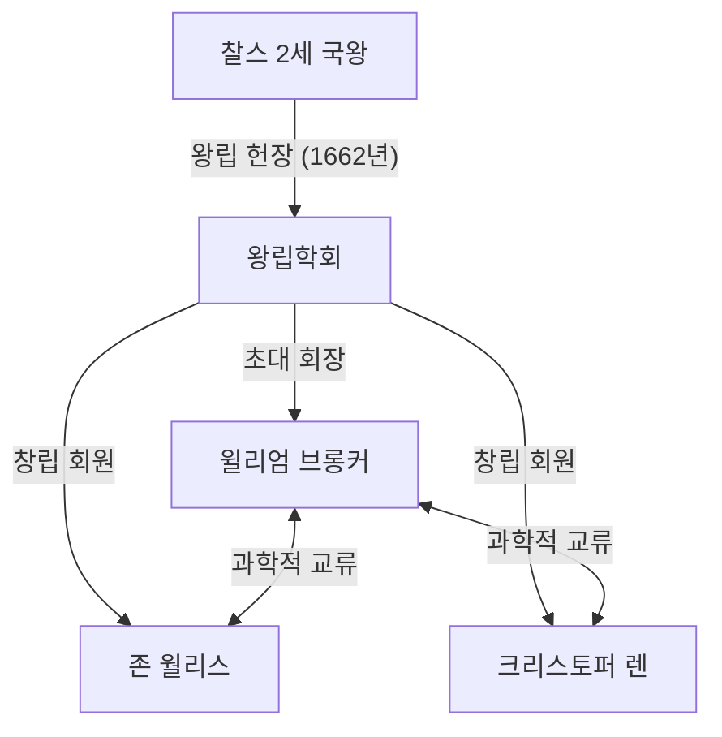
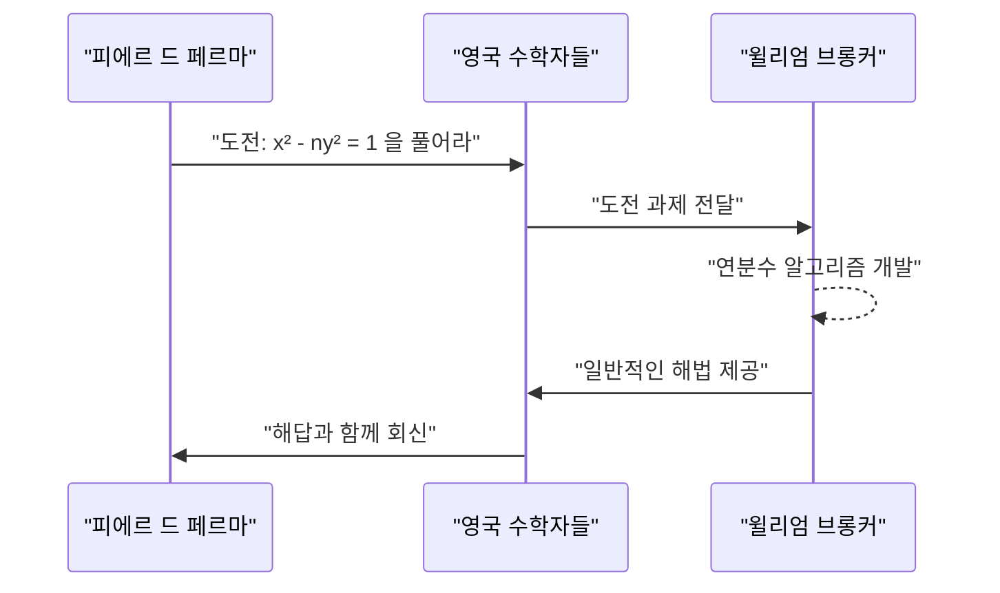

## 1. 서론

17세기 유럽은 과학 혁명의 한가운데에 있었습니다. [아이작 뉴턴](https://kenji.blog/p/newton/)과 고트프리트 빌헬름 라이프니츠의 미적분학 발견으로 대표되듯, 수학과 물리학이 극적인 도약을 이룬 시대였습니다. 그 중심에서 영국 학계의 발전에 핵심적인 역할을 한 기관이 바로 **왕립학회 (Royal Society)** 입니다.

이 글에서는 왕립학회의 초대 회장을 역임했으며 "원주율의 연분수 표현"과 "[펠 방정식](https://kenji.blog/p/pell-equation/)의 해법"으로 수학자로서 역사에 이름을 남긴 **[윌리엄 브롱커](https://kenji.blog/p/brouncker/) ([William Brouncker](https://kenji.blog/p/brouncker/))** 의 생애와 그의 놀라운 수학적 업적에 대해 자세히 설명합니다. 브롱커는 당시 유럽의 최고 지성들과 교류하며 수많은 난제에 도전했습니다. 그의 업적은 무한이라는 개념을 수학적으로 엄밀하게 다루기 위한 토대를 마련하는 데 크게 기여했습니다.

## 2. 어린 시절과 초기 경력

[윌리엄 브롱커](https://kenji.blog/p/brouncker/)(1620년 - 1684년 4월 5일)는 초대 브롱커 자작 [윌리엄 브롱커](https://kenji.blog/p/brouncker/)와 위니프레드 리의 장남으로 태어났습니다. 그의 정확한 출생지와 초기 교육에 대해서는 알려지지 않은 세부 사항이 많지만, 옥스퍼드 대학교에서 공부하며 뛰어난 언어 능력과 수학적 감각을 키웠을 것으로 여겨집니다. 1645년에 아버지가 사망함에 따라 그는 제2대 브롱커 자작이 되었습니다.

당시 잉글랜드는 청교도 혁명(잉글랜드 내전)이라는 혼란스러운 시기였으나, 브롱커는 정치 무대보다 학문의 세계에 더 몰두했습니다. 그는 특히 수학과 음악에 강한 흥미를 가졌고 자신만의 이론을 구축하기 시작했습니다. 1647년에는 옥스퍼드 대학교에서 의학 박사 학위를 받았지만, 그의 주된 관심사는 항상 정밀 과학에 있었습니다. 그의 남동생인 헨리 브롱커 역시 체스와 수학에 관심을 유지하면서 정치 및 궁정 세계에서 활동했던 것으로 알려져 있습니다.

## 3. 왕립학회 초대 회장으로서의 활동

왕립학회는 자연 지식의 향상을 목적으로 하는 세계에서 가장 오래된 과학 학회 중 하나입니다. 그 기원은 1660년 런던에서 열린 크리스토퍼 렌의 강연 이후 결성된 모임에 있으며, 1662년 찰스 2세 국왕으로부터 왕립 헌장(Royal Charter)을 받아 공식적으로 출범했습니다.

이 역사적인 학회의 **초대 회장** 으로 선출된 사람이 바로 [윌리엄 브롱커](https://kenji.blog/p/brouncker/)였습니다. 로버트 머레이 등의 노력으로 학회가 형태를 갖추어가는 가운데, 브롱커는 1662년부터 1677년까지 15년이라는 긴 기간 동안 회장직을 맡아 학회의 기반을 다지는 데 헌신했습니다.

브롱커는 로버트 보일과 로버트 훅과 같은 뛰어난 과학자들을 하나로 모으고, 실험적 검증을 중시하는 새로운 과학적 방법론을 확립하는 데 중요한 역할을 했습니다. 그는 직접 진자의 운동과 대기의 무게에 관한 실험에 적극적으로 참여하여 학회 회의에서 수많은 보고서를 발표했습니다. 또한 왕실과의 연결 고리 역할을 하며 학회의 재정적, 사회적 안정에 크게 기여했습니다.

## 4. 수학적 업적: 원주율의 연분수 표현

브롱커의 가장 유명한 수학적 업적은 원주율 $\pi$ 에 대한 일반화된 연분수를 발견한 것입니다. 이것은 동시대의 수학자 [존 월리스](https://kenji.blog/p/wallis/)의 저서 『무한의 산술』(Arithmetica Infinitorum, 1655년)에 소개되면서 널리 알려지게 되었습니다.

### 월리스의 공식과 브롱커의 변환

월리스는 원주율과 관련하여 다음과 같은 무한 곱(월리스의 공식)을 발견했었습니다:

$$
\frac{\pi}{2} = \frac{2}{1} \cdot \frac{2}{3} \cdot \frac{4}{3} \cdot \frac{4}{5} \cdot \frac{6}{5} \cdot \frac{6}{7} \cdot \frac{8}{7} \cdots
$$

월리스는 이 결과를 브롱커에게 보여주며 다른 형태로 표현할 수 있는지 물었습니다. 이에 대한 답으로 브롱커는 대수적 조작과 극한에 대한 기발한 개념을 사용하여 이 방정식을 훌륭하게 연분수로 변환했습니다. 이것이 바로 다음의 **브롱커의 공식** 입니다:

$$
\frac{4}{\pi} = 1 + \frac{1^2}{2 + \frac{3^2}{2 + \frac{5^2}{2 + \frac{7^2}{2 + \ddots}}}}
$$

### 공식의 의의와 증명 개요

이 연분수는 그 아름다움과 규칙성으로 많은 수학자들을 매료시켰습니다. 홀수의 제곱이 분자에 연속적으로 나타나고, 분모의 정수 부분은 항상 $2$ 인 놀랍도록 우아한 구조를 가지고 있습니다. 이 발견은 초월수인 원주율이 자연수의 단순한 규칙성 안에 내재되어 있음을 보여주었습니다.

연분수는 무리수를 근사하는 데 매우 강력한 도구입니다. 브롱커의 공식은 수렴 속도가 매우 느려 원주율의 실제 계산에는 적합하지 않았지만, 해석학에서 연분수 전개의 선구적인 예로서 후대 수학에 막대한 영향을 미쳤습니다. 오일러는 나중에 이 공식을 더욱 일반화하여 연분수 이론을 깊이 발전시키게 됩니다.

## 5. 수학적 업적: [펠 방정식](https://kenji.blog/p/pell-equation/) 해결

또 다른 중요한 업적은 소위 **[펠 방정식](https://kenji.blog/p/pell-equation/)** 에 대한 해법입니다. [펠 방정식](https://kenji.blog/p/pell-equation/)은 완전 제곱수가 아닌 양의 정수 $n$ 에 대하여 다음과 같은 형태의 [디오판토스](https://kenji.blog/p/diophantus/) 방정식(정수 계수를 갖는 다항 방정식)입니다:

$$
x^2 - n y^2 = 1 \quad (\text{단, } x, y \text{ 는 정수})
$$

### 페르마의 도전

1657년, 프랑스의 위대한 수학자 [피에르 드 페르마](https://kenji.blog/p/fermat/)는 영국의 수학자들에게 이 방정식의 정수해를 찾으라는 도전장을 보냈습니다. 페르마는 예시로 $n=61$ 과 같은 어려운 경우를 들었습니다.

### 브롱커의 알고리즘

이 도전에 맞서 일어선 것은 월리스와 브롱커였습니다. 특히 브롱커는 오늘날 "연분수법"으로 알려진 알고리즘과 사실상 동등한 방법을 개발하여, 제곱수가 아닌 모든 수 $n$ 에 대해 방정식의 최소 양의 정수해를 찾는 절차를 확립했습니다.

브롱커의 접근법은 $\sqrt{n}$ 의 연분수 전개를 계산하고 그 근사 분수(주 근사 분수)를 사용하여 해를 구성하는 것입니다. 예를 들어, $n=2$ 인 경우 방정식은 $x^2 - 2y^2 = 1$ 이 됩니다. $\sqrt{2}$ 의 연분수 전개는 $[1; 2, 2, 2, \dots]$ 이며, 근사 분수를 계산하여 최소해 $x=3, y=2$ 를 얻을 수 있습니다. 실제로 $3^2 - 2 \cdot 2^2 = 9 - 8 = 1$ 이 성립합니다.

페르마가 제시한 $n=61$ 의 경우, 최소해는 엄청나게 큽니다:

$$
x = 1766319049, \quad y = 226153980
$$

브롱커는 자신의 방법을 사용하면 이처럼 거대한 해조차도 체계적으로 도출할 수 있음을 보여주었습니다. 아이러니하게도 [레온하르트 오일러](https://kenji.blog/p/euler/)의 오해로 인해 나중에 이 방정식에는 영국 수학자 존 펠의 이름이 붙게 되었지만, 해법을 확립하는 데 가장 큰 기여를 한 사람은 의심할 여지없이 브롱커였습니다.

## 6. 기타 업적 및 말년

### 음악 이론에 대한 기여

브롱커는 수학뿐만 아니라 음악 이론에도 관심이 있었습니다. 그는 [르네 데카르트](https://kenji.blog/p/descartes/)의 『음악 제요』(Musicae Compendium)를 영어로 번역하여 익명으로 출판했습니다. 그러면서 단순히 번역만 한 것이 아니라, 옥타브를 17개의 동일한 간격으로 나누는 자신만의 조율 시스템(17 평균율)을 제안하는 부록을 추가했습니다. 이는 로그를 사용하여 음계를 수학적으로 분석하려는 선구적인 시도였습니다.

### 포물선의 구적법과 로그 곡선

게다가 그는 쌍곡선의 구적법(면적 구하기)에 대해서도 중요한 연구를 수행했습니다. 무한 급수를 사용하여 쌍곡선의 면적을 계산하는 방법을 고안했고, 이는 로그 함수의 급수 전개로 이어졌습니다. 니콜라스 메르카토르와 동시대 인물로서, 그는 자연로그 계산에서 무한 급수의 유용성을 인식하고 있었습니다. 이는 이후 미적분학의 발전에서 매우 중요한 단계였습니다.

### 탄도학과 역학

역학 분야에서는 총기의 반동에 대한 연구를 수행하고 크리스티안 하위헌스의 진자의 등시성에 대한 이론을 검증했습니다. 이는 그가 이론적 탐구뿐만 아니라 실용적이고 군사적인 응용에도 안목이 있었음을 보여줍니다.

말년에 브롱커는 왕립학회 회장직에서 물러난 후에도 해군 위원회(Navy Board) 위원 등 공직에서 봉사했습니다. 브롱커의 이름은 새뮤얼 피프스의 유명한 일기에서 해군 행정의 유능한 동료로 자주 등장합니다. 그는 평생 독신으로 살았으며 1684년 런던의 자택에서 세상을 떠났습니다.

## 7. 결론

[윌리엄 브롱커](https://kenji.blog/p/brouncker/)는 17세기 영국 과학계를 이끈 탁월한 지도자이자 독창적인 수학자였습니다. 왕립학회의 초대 회장으로서 근대 과학의 기초를 다진 그의 업적은 헤아릴 수 없습니다. 또한 원주율의 연분수 표현과 [펠 방정식](https://kenji.blog/p/pell-equation/)의 해법 등 그의 수학적 업적은 무한의 개념을 다루는 해석학과 정수론의 발전에서 중요한 이정표가 되었습니다.

그의 접근 방식은 엄밀한 기하학에서 대수학과 무한 급수를 활용하는 해석학으로의 과도기를 상징합니다. 그의 이름은 종종 뉴턴이나 페르마와 같은 거인들의 그늘에 가려지지만, **브롱커** 의 존재 없이는 오늘날 수학의 풍요로움을 논할 수 없습니다. 그의 지적 호기심과 탐구 정신은 수백 년이 지난 지금도 수학의 아름다움으로서 우리 앞에서 빛나고 있습니다.
