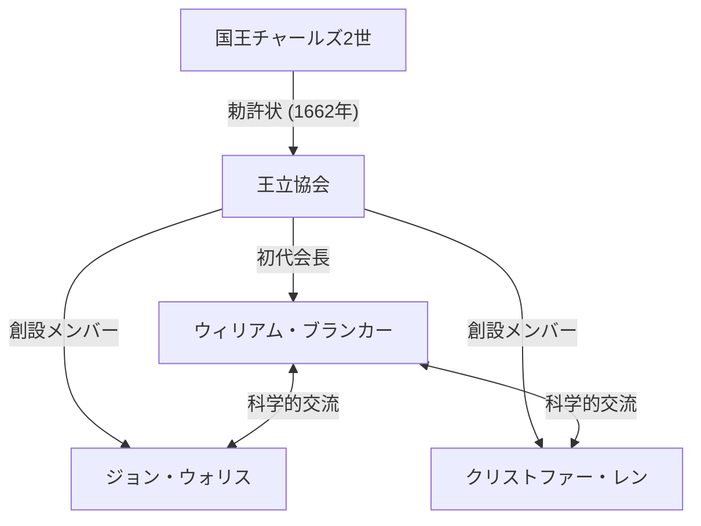
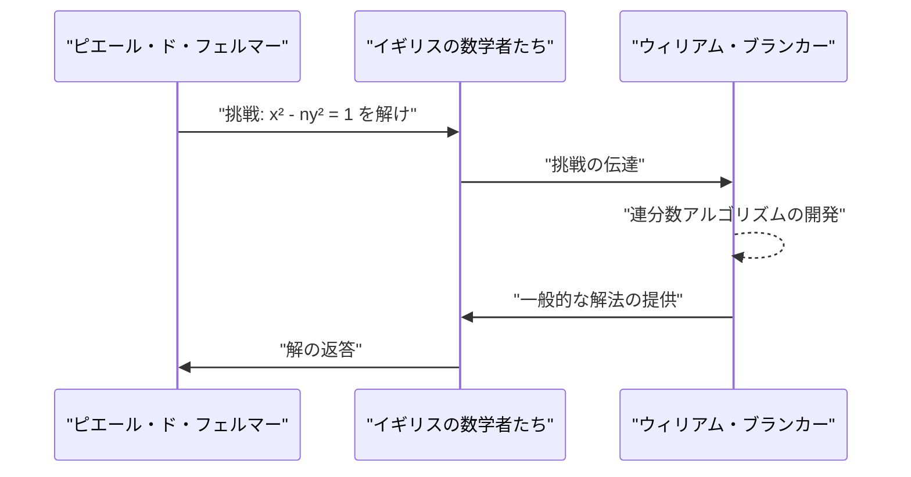

## 1. はじめに

17世紀のヨーロッパは、科学革命の真っ只中にありました。アイザック・[ニュートン](https://kenji.blog/p/newton/)やゴットフリート・[ライプニッツ](https://kenji.blog/p/leibniz/)による微積分学の発見に代表されるように、数学や物理学が飛躍的な進歩を遂げた時代です。その中で、イギリスの学術の発展において中心的な役割を果たした機関が **王立協会 (Royal Society)** です。

本記事では、この王立協会の初代会長を務め、数学者としても「円周率の連分数表示」や「[ペル方程式](https://kenji.blog/p/pell-equation/)の解法」などで歴史に名を残した **[ウィリアム・ブランカー](https://kenji.blog/p/brouncker/) ([William Brouncker](https://kenji.blog/p/brouncker/))** の生涯と、その驚くべき数学的業績について詳しく解説します。[ブランカー](https://kenji.blog/p/brouncker/)は、当時のヨーロッパにおける第一級の知性たちと交流し、数々の難問に挑みました。彼の業績は、無限という概念を数学的に厳密に扱うための基盤作りに大きく貢献しました。

## 2. 生い立ちと初期の経歴

[ウィリアム・ブランカー](https://kenji.blog/p/brouncker/)（1620年 - 1684年4月5日）は、初代[ブランカー](https://kenji.blog/p/brouncker/)子爵[ウィリアム・ブランカー](https://kenji.blog/p/brouncker/)とウィニフレッド・リーの長男として生まれました。彼の正確な出生地や幼少期の教育については不明な点が多いですが、オックスフォード大学で学び、優れた言語能力と数学的センスを培ったと考えられています。1645年には父親の死に伴い、第2代[ブランカー](https://kenji.blog/p/brouncker/)子爵となりました。

当時、イングランドは清教徒革命（イングランド内戦）の混乱期にありましたが、[ブランカー](https://kenji.blog/p/brouncker/)は政治的な表舞台よりも学問の世界に傾倒していきました。彼は特に数学と音楽に強い関心を持ち、独自の理論を構築し始めます。1647年にはオックスフォード大学から医学博士号を授与されましたが、彼の主な関心は常に精密科学にありました。彼の弟であるヘンリー・[ブランカー](https://kenji.blog/p/brouncker/)もまた、政治や宮廷の世界で活躍しつつ、チェスや数学に興味を持っていたことで知られています。

## 3. 王立協会の初代会長としての活躍

王立協会は、自然知識の改善を目的とする世界最古の科学学会の一つです。1660年、ロンドンで開かれたクリストファー・レンの講義の後に結成された集まりがその起源であり、1662年に国王チャールズ2世からの勅許状 (Royal Charter) を受けて正式に発足しました。

この歴史的な学会の **初代会長** に選出されたのが、[ウィリアム・ブランカー](https://kenji.blog/p/brouncker/)でした。ロバート・モレイなどの尽力により協会が形作られる中、[ブランカー](https://kenji.blog/p/brouncker/)は1662年から1677年までの15年間という長期にわたり会長職を務め、協会の基盤作りに尽力しました。

[ブランカー](https://kenji.blog/p/brouncker/)は、ロバート・ボイルやロバート・フックといった傑出した科学者たちを取りまとめ、実験的検証を重んじる新しい科学の方法論を確立する上で重要な役割を果たしました。彼自身も、振り子の運動や大気の重さに関する実験に積極的に参加し、協会の会合で数々の報告を行っています。また、王室とのパイプ役としても機能し、協会の財政的・社会的な安定に大きく貢献しました。

## 4. 数学的業績：円周率の連分数表示

[ブランカー](https://kenji.blog/p/brouncker/)の最も有名な数学的業績は、円周率 $\pi$ の一般化された連分数 (generalized continued fraction) を発見したことです。これは、同時代の数学者[ジョン・ウォリス](https://kenji.blog/p/wallis/)の著書『無限の算術』(Arithmetica Infinitorum, 1655年) の中で紹介され、広く知られるようになりました。

### [ウォリス](https://kenji.blog/p/wallis/)の公式と[ブランカー](https://kenji.blog/p/brouncker/)の変換

[ウォリス](https://kenji.blog/p/wallis/)は、円周率に関する以下の無限乗積（[ウォリス](https://kenji.blog/p/wallis/)の公式）を発見していました。

$$
\frac{\pi}{2} = \frac{2}{1} \cdot \frac{2}{3} \cdot \frac{4}{3} \cdot \frac{4}{5} \cdot \frac{6}{5} \cdot \frac{6}{7} \cdot \frac{8}{7} \cdots
$$

[ウォリス](https://kenji.blog/p/wallis/)はこの結果を[ブランカー](https://kenji.blog/p/brouncker/)に示し、これを別の形で表現できないかと持ちかけました。それに応えた[ブランカー](https://kenji.blog/p/brouncker/)は、代数的な操作と巧妙な極限の考え方を用いて、この式を見事な連分数へと変換しました。それが以下の **[ブランカー](https://kenji.blog/p/brouncker/)の公式** です。

$$
\frac{4}{\pi} = 1 + \frac{1^2}{2 + \frac{3^2}{2 + \frac{5^2}{2 + \frac{7^2}{2 + \ddots}}}}
$$

### 公式の意義と証明の概要

この連分数は、その美しさと規則性から多くの数学者を魅了しました。奇数の二乗が分子に連続して現れ、分母の整数部分には常に $2$ が現れるという、驚くほど洗練された構造を持っています。この発見により、円周率という超越数が、自然数の単純な法則性の中に組み込まれていることが示されました。

連分数は、無理数を近似するための非常に強力なツールです。[ブランカー](https://kenji.blog/p/brouncker/)の公式は収束が非常に遅いため、円周率の実際の計算には不向きでしたが、解析学における連分数展開の先駆的な例として、後の数学に大きな影響を与えました。[オイラー](https://kenji.blog/p/euler/)はこの公式をさらに一般化し、連分数の理論を深く発展させることになります。

## 5. 数学的業績：[ペル方程式](https://kenji.blog/p/pell-equation/)の解法

もう一つの重要な業績が、いわゆる **[ペル方程式](https://kenji.blog/p/pell-equation/)** の解法です。[ペル方程式](https://kenji.blog/p/pell-equation/)とは、平方数ではない正の整数 $n$ に対して、以下の形をした[ディオファントス](https://kenji.blog/p/diophantus/)方程式（整数係数の多項式方程式）のことです。

$$
x^2 - n y^2 = 1 \quad (\text{ただし、} x, y \text{ は整数})
$$

### [フェルマー](https://kenji.blog/p/fermat/)からの挑戦状

1657年、フランスの偉大な数学者[ピエール・ド・フェルマー](https://kenji.blog/p/fermat/)は、イギリスの数学者たちに対して、この方程式の整数解を求める挑戦状を送りました。[フェルマー](https://kenji.blog/p/fermat/)は例として $n=61$ などの難しいケースを挙げていました。

### [ブランカー](https://kenji.blog/p/brouncker/)のアルゴリズム

この挑戦を受けて立ったのが、[ウォリス](https://kenji.blog/p/wallis/)と[ブランカー](https://kenji.blog/p/brouncker/)でした。特に[ブランカー](https://kenji.blog/p/brouncker/)は、今日「連分数法」として知られるアルゴリズムと実質的に等価な方法を開発し、いかなる非平方数 $n$ に対しても方程式の最小の正の整数解を見つけ出す手順を確立しました。

[ブランカー](https://kenji.blog/p/brouncker/)の手法は、$\sqrt{n}$ の連分数展開を計算し、その近似分数（主近似分数）を用いて解を構成するというものです。例えば、$n=2$ の場合、方程式は $x^2 - 2y^2 = 1$ となります。$\sqrt{2}$ の連分数展開は $[1; 2, 2, 2, \dots]$ であり、その近似分数を計算することで最小解 $x=3, y=2$ を得ることができます。実際に $3^2 - 2 \cdot 2^2 = 9 - 8 = 1$ が成り立ちます。

[フェルマー](https://kenji.blog/p/fermat/)が提示した $n=61$ の場合、最小解は桁違いに大きくなります。

$$
x = 1766319049, \quad y = 226153980
$$

[ブランカー](https://kenji.blog/p/brouncker/)は自身の手法を用いて、このような巨大な解も系統的に導き出すことができることを示しました。皮肉なことに、この方程式は後にレオンハルト・[オイラー](https://kenji.blog/p/euler/)の誤解によりイギリスの数学者ジョン・ペルの名前が冠されることになりましたが、解法の確立において最大の貢献をしたのは間違いなく[ブランカー](https://kenji.blog/p/brouncker/)でした。

## 6. その他の業績と晩年

### 音楽理論への貢献

[ブランカー](https://kenji.blog/p/brouncker/)は数学だけでなく、音楽理論にも関心を持っていました。彼は[ルネ・デカルト](https://kenji.blog/p/descartes/)の『音楽提要』(Musicae Compendium) を英語に翻訳し、匿名で出版しました。その際、単なる翻訳にとどまらず、オクターブを17の等しい音程に分割する独自の調律システム（17平均律）を提案する付録を追加しました。これは対数を用いて音階を数学的に解析した先駆的な試みでした。

### 放物線の求積と対数曲線

さらに、彼は双曲線の求積（面積を求めること）についても重要な研究を行いました。彼は双曲線の面積を無限級数を用いて計算する方法を考案し、これが対数関数の級数展開へと繋がっていきました。ニコラス・メルカトルと同時代に、彼は自然対数の計算における無限級数の有用性を認識していました。これは後の微積分学の発展において非常に重要なステップでした。

### 弾道学と力学

力学の分野においては、銃砲の反動に関する研究や、振り子の等時性に関するクリスティアーン・ホイヘンスの理論の検証などを行いました。理論的な探求だけでなく、実社会や軍事的な応用にも目を向けていたことがわかります。

晩年の[ブランカー](https://kenji.blog/p/brouncker/)は、王立協会会長を退いた後も、海軍会議 (Navy Board) の委員などの公職を務めました。サミュエル・ピープスの有名な日記にも、海軍の実務における有能な同僚として[ブランカー](https://kenji.blog/p/brouncker/)の名前が頻繁に登場します。彼は生涯独身を貫き、1684年にロンドンの自宅で息を引き取りました。

## 7. まとめ

[ウィリアム・ブランカー](https://kenji.blog/p/brouncker/)は、17世紀のイギリス科学界を牽引した卓越したリーダーであり、独創的な数学者でした。王立協会の初代会長として近代科学の基礎を築いた功績は計り知れません。また、円周率の連分数表示や[ペル方程式](https://kenji.blog/p/pell-equation/)の解法といった数学的業績は、無限という概念を扱う解析学や、整数論の発展において重要なマイルストーンとなりました。

彼のアプローチは、厳密な幾何学から、代数や無限級数を駆使する解析学への移行期を象徴しています。彼の名は、[ニュートン](https://kenji.blog/p/newton/)や[フェルマー](https://kenji.blog/p/fermat/)といった巨星たちの影に隠れがちですが、 **[ブランカー](https://kenji.blog/p/brouncker/)** の存在なくして、今日の数学の豊かさは語れません。彼の知的好奇心と探求心は、数百年を経た今でも数学の美しさとして私たちの前に輝き続けています。
