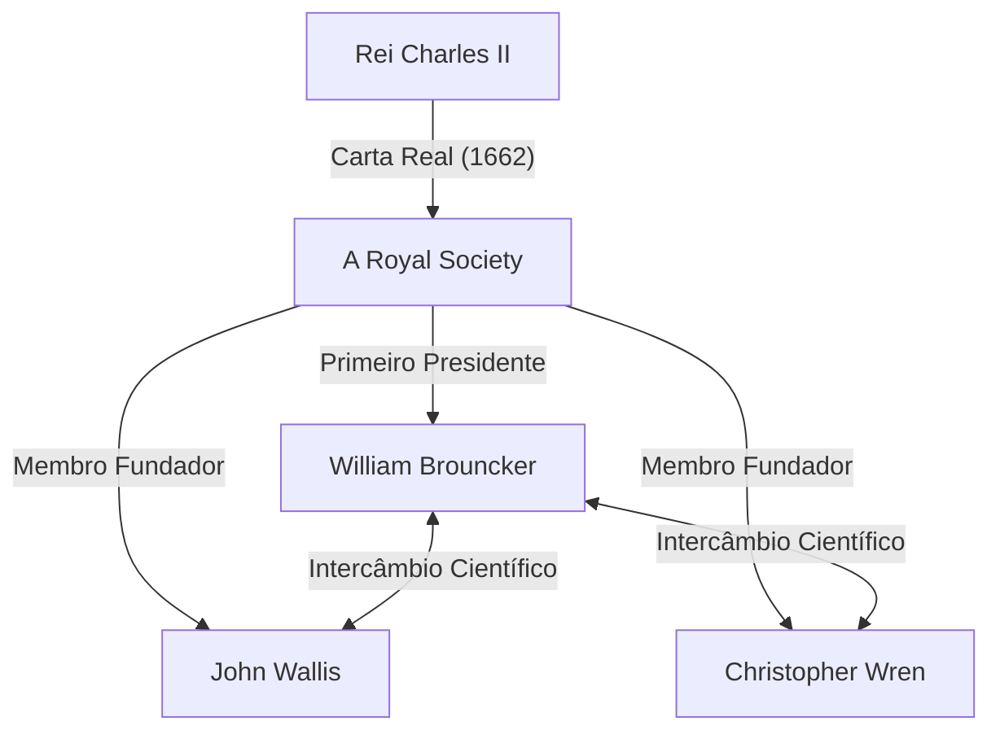
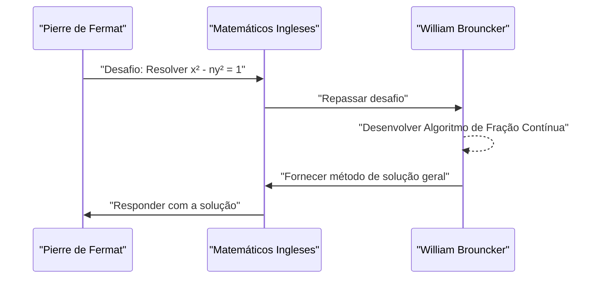

## 1. Introdução

A Europa do século XVII estava no meio de uma revolução científica. Foi uma era em que a matemática e a física deram saltos dramáticos, como resumido pela descoberta do cálculo por [Isaac Newton](https://kenji.blog/pt/p/newton/) e Gottfried Wilhelm Leibniz. Em meio a isso, a instituição que desempenhou um papel central no desenvolvimento do mundo acadêmico britânico foi **A Royal Society**.

Este artigo fornece uma explicação detalhada da vida e das notáveis conquistas matemáticas de **[William Brouncker](https://kenji.blog/pt/p/brouncker/)**, que serviu como o primeiro Presidente da Royal Society e deixou sua marca na história como um matemático com sua "representação em fração contínua de Pi" e "solução para a equação de Pell". [Brouncker](https://kenji.blog/pt/p/brouncker/) interagiu com as mentes mais brilhantes da Europa da época e abordou vários problemas desafiadores. Suas conquistas contribuíram significativamente para estabelecer as bases para um tratamento matematicamente rigoroso do conceito de infinito.

## 2. Início de Vida e Carreira

[William Brouncker](https://kenji.blog/pt/p/brouncker/) (1620 - 5 de abril de 1684) nasceu como o filho mais velho de William Brouncker, 1º Visconde Brouncker, e Winifred Leigh. Embora haja muitos detalhes desconhecidos sobre seu local de nascimento exato e educação infantil, acredita-se que ele tenha estudado na Universidade de Oxford, cultivando excelentes habilidades no idioma e um senso matemático. Em 1645, após a morte de seu pai, ele se tornou o 2º Visconde [Brouncker](https://kenji.blog/pt/p/brouncker/).

Na época, a Inglaterra estava no período caótico da Revolução Puritana (Guerra Civil Inglesa), mas [Brouncker](https://kenji.blog/pt/p/brouncker/) se dedicou mais ao mundo acadêmico do que ao palco político. Ele tinha um interesse particularmente forte em matemática e música, começando a construir suas próprias teorias. Em 1647, ele recebeu o título de Doutor em Medicina pela Universidade de Oxford, mas seu principal interesse sempre permaneceu nas ciências exatas. Seu irmão mais novo, Henry [Brouncker](https://kenji.blog/pt/p/brouncker/), também era conhecido por atuar no mundo político e cortês, mantendo o interesse por xadrez e matemática.

## 3. Atividades como Primeiro Presidente da Royal Society

A Royal Society é uma das mais antigas sociedades científicas do mundo, dedicada a melhorar o conhecimento natural. Suas origens residem em um encontro formado após uma palestra de Christopher Wren em Londres em 1660, e foi lançada oficialmente em 1662 após receber uma Carta Real do Rei Charles II.

Eleito como o **Primeiro Presidente** desta sociedade histórica estava [William Brouncker](https://kenji.blog/pt/p/brouncker/). Em meio à sociedade tomando forma por meio dos esforços de Robert Moray e outros, [Brouncker](https://kenji.blog/pt/p/brouncker/) serviu como presidente por um longo período de 15 anos, de 1662 a 1677, dedicando-se à construção dos alicerces da sociedade.

[Brouncker](https://kenji.blog/pt/p/brouncker/) desempenhou um papel crucial em reunir cientistas notáveis como Robert Boyle e Robert Hooke, e em estabelecer uma nova metodologia científica que enfatizava a verificação experimental. Ele próprio participou ativamente de experimentos relacionados ao movimento de pêndulos e o peso da atmosfera, apresentando diversos relatórios nas reuniões da sociedade. Ele também funcionou como um canal para a família real, contribuindo grandemente para a estabilidade financeira e social da sociedade.

## 4. Conquista Matemática: Representação em Fração Contínua de Pi

A conquista matemática mais famosa de [Brouncker](https://kenji.blog/pt/p/brouncker/) é a descoberta da fração contínua generalizada para a constante $\pi$. Isso foi introduzido no livro *Arithmetica Infinitorum* (1655) pelo matemático contemporâneo [John Wallis](https://kenji.blog/pt/p/wallis/), o que o tornou amplamente conhecido.

### Fórmula de [Wallis](https://kenji.blog/pt/p/wallis/) e Transformação de [Brouncker](https://kenji.blog/pt/p/brouncker/)

[Wallis](https://kenji.blog/pt/p/wallis/) havia descoberto o seguinte produto infinito (Fórmula de [Wallis](https://kenji.blog/pt/p/wallis/)) em relação a Pi:

$$
\frac{\pi}{2} = \frac{2}{1} \cdot \frac{2}{3} \cdot \frac{4}{3} \cdot \frac{4}{5} \cdot \frac{6}{5} \cdot \frac{6}{7} \cdot \frac{8}{7} \cdots
$$

[Wallis](https://kenji.blog/pt/p/wallis/) mostrou esse resultado a Brouncker e perguntou se ele poderia ser expresso de forma diferente. Em resposta, Brouncker, usando manipulação algébrica e um conceito inteligente de limites, transformou magistralmente esta equação em uma fração contínua. Esta é a seguinte **Fórmula de [Brouncker](https://kenji.blog/pt/p/brouncker/)**:

$$
\frac{4}{\pi} = 1 + \frac{1^2}{2 + \frac{3^2}{2 + \frac{5^2}{2 + \frac{7^2}{2 + \ddots}}}}
$$

### Significado da Fórmula e Resumo da Prova

Essa fração contínua cativou muitos matemáticos com sua beleza e regularidade. Ela possui uma estrutura notavelmente elegante onde os quadrados dos números ímpares aparecem continuamente nos numeradores, e a parte inteira dos denominadores é sempre $2$. Essa descoberta demonstrou que o número transcendental Pi está embutido dentro de uma simples regularidade dos números naturais.

As frações contínuas são ferramentas muito poderosas para aproximar números irracionais. Embora a fórmula de [Brouncker](https://kenji.blog/pt/p/brouncker/) convirja muito lentamente e fosse, portanto, inadequada para o cálculo prático de Pi, teve um impacto massivo na matemática posterior como um exemplo pioneiro de expansão de frações contínuas em análise. Euler posteriormente generalizaria esta fórmula ainda mais, desenvolvendo profundamente a teoria das frações contínuas.

## 5. Conquista Matemática: Resolvendo a [Equação de Pell](https://kenji.blog/pt/p/pell-equation/)

Outra conquista significativa é a solução para a chamada **equação de Pell**. A equação de Pell é uma equação diofantina (uma equação polinomial com coeficientes inteiros) da seguinte forma para um número inteiro positivo $n$ que não é um quadrado perfeito:

$$
x^2 - n y^2 = 1 \quad (\text{onde } x, y \text{ são inteiros})
$$

### O Desafio de [Fermat](https://kenji.blog/pt/p/fermat/)

Em 1657, o grande matemático francês [Pierre de Fermat](https://kenji.blog/pt/p/fermat/) enviou um desafio aos matemáticos ingleses para encontrar soluções inteiras para esta equação. [Fermat](https://kenji.blog/pt/p/fermat/) citou casos difíceis como $n=61$ como exemplos.

### O Algoritmo de [Brouncker](https://kenji.blog/pt/p/brouncker/)

Foram [Wallis](https://kenji.blog/pt/p/wallis/) e Brouncker que enfrentaram este desafio. [Brouncker](https://kenji.blog/pt/p/brouncker/), em particular, desenvolveu um método virtualmente equivalente ao algoritmo conhecido hoje como o "método das frações contínuas", estabelecendo um procedimento para encontrar a solução inteira positiva mínima para a equação para qualquer número não-quadrado $n$.

A abordagem de [Brouncker](https://kenji.blog/pt/p/brouncker/) envolve calcular a expansão em fração contínua de $\sqrt{n}$ e construir a solução usando suas frações convergentes. Por exemplo, no caso de $n=2$, a equação torna-se $x^2 - 2y^2 = 1$. A expansão em fração contínua de $\sqrt{2}$ é $[1; 2, 2, 2, \dots]$, e calculando seus convergentes, podemos obter a solução mínima $x=3, y=2$. De fato, $3^2 - 2 \cdot 2^2 = 9 - 8 = 1$ é verdadeiro.

No caso de $n=61$ apresentado por [Fermat](https://kenji.blog/pt/p/fermat/), a solução mínima é extraordinariamente grande:

$$
x = 1766319049, \quad y = 226153980
$$

[Brouncker](https://kenji.blog/pt/p/brouncker/) demonstrou que mesmo soluções tão gigantescas poderiam ser derivadas sistematicamente usando seu método. Ironicamente, devido a um mal-entendido de Leonhard Euler, esta equação foi mais tarde batizada com o nome do matemático inglês John Pell, mas a maior contribuição para estabelecer o método de solução pertence inegavelmente a [Brouncker](https://kenji.blog/pt/p/brouncker/).

## 6. Outras Conquistas e Anos Posteriores

### Contribuições para a Teoria Musical

[Brouncker](https://kenji.blog/pt/p/brouncker/) estava interessado não apenas em matemática, mas também em teoria musical. Ele traduziu o *Musicae Compendium* de [René Descartes](https://kenji.blog/pt/p/descartes/) para o inglês e o publicou anonimamente. Ao fazê-lo, não apenas traduziu, mas adicionou um apêndice propondo seu próprio sistema de afinação (temperamento igual de 17 tons) que dividia uma oitava em 17 intervalos iguais. Esta foi uma tentativa pioneira de analisar as escalas musicais matematicamente usando logaritmos.

### Quadratura da Parábola e Curva Logarítmica

Além disso, ele conduziu importantes pesquisas sobre a quadratura (cálculo da área) da hipérbole. Ele concebeu um método para calcular a área de uma hipérbole usando séries infinitas, o que levou à expansão em série da função logarítmica. Contemporâneo de Nicholas Mercator, ele reconheceu a utilidade das séries infinitas no cálculo de logaritmos naturais. Este foi um passo crucial no posterior desenvolvimento do cálculo.

### Balística e Mecânica

No campo da mecânica, ele conduziu pesquisas sobre o recuo das armas de fogo e verificou a teoria de Christiaan Huygens sobre o isocronismo dos pêndulos. Isso mostra que ele não tinha olhos apenas para a exploração teórica, mas também para aplicações práticas e militares.

Em seus anos posteriores, mesmo após deixar a Presidência da Royal Society, [Brouncker](https://kenji.blog/pt/p/brouncker/) serviu em cargos públicos, como comissário do Navy Board (Conselho da Marinha). O nome de [Brouncker](https://kenji.blog/pt/p/brouncker/) aparece frequentemente no famoso diário de Samuel Pepys como um colega capaz na administração naval. Ele permaneceu solteiro por toda a vida e faleceu em sua casa em Londres em 1684.

## 7. Conclusão

[William Brouncker](https://kenji.blog/pt/p/brouncker/) foi um líder notável e um matemático original que impulsionou a comunidade científica britânica do século XVII. Suas conquistas ao lançar as bases da ciência moderna como primeiro Presidente da Royal Society são imensuráveis. Além disso, suas conquistas matemáticas, como a representação em fração contínua de Pi e a solução da equação de Pell, tornaram-se marcos significativos no desenvolvimento da análise, que lida com o conceito do infinito, e da teoria dos números.

Sua abordagem simboliza o período de transição da rigorosa geometria para a análise utilizando álgebra e séries infinitas. Embora seu nome seja muitas vezes ofuscado por gigantes como Newton e [Fermat](https://kenji.blog/pt/p/fermat/), sem a existência de **[Brouncker](https://kenji.blog/pt/p/brouncker/)**, não se pode discutir a riqueza da matemática de hoje. Sua curiosidade intelectual e espírito de investigação continuam a brilhar diante de nós como a beleza da matemática, mesmo centenas de anos depois.
