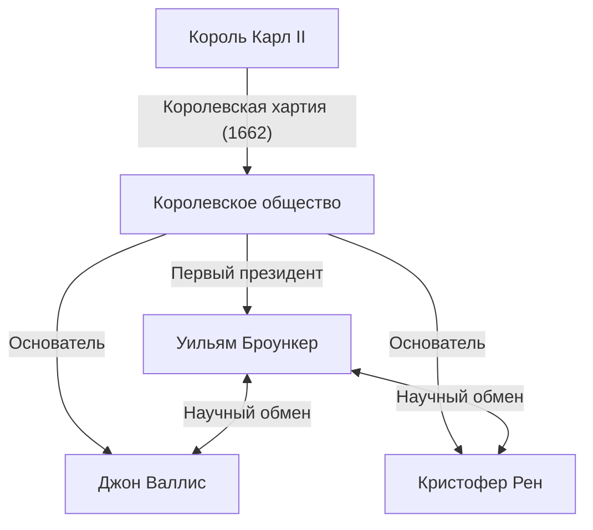
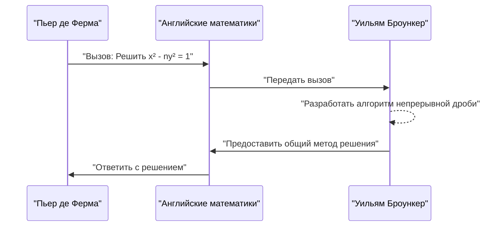

## 1. Введение

Европа 17 века находилась в самом разгаре научной революции. Это была эпоха, когда математика и физика совершили резкий скачок вперед, что наглядно подтверждается открытием дифференциального и интегрального исчисления Исааком Ньютоном и Готфридом Вильгельмом Лейбницем. В этот период институтом, сыгравшим центральную роль в развитии британской науки, стало **Королевское общество** (The Royal Society).

В этой статье подробно рассматривается жизнь и выдающиеся математические достижения **Уильяма Броункера**, который занимал пост первого президента Королевского общества и вошел в историю математики благодаря своему «представлению числа Пи в виде непрерывной дроби» и «решению уравнения Пелля». Броункер общался с величайшими умами Европы того времени и решал множество сложных задач. Его достижения внесли значительный вклад в закладку основ для математически строгого обращения с концепцией бесконечности.

## 2. Ранние годы и карьера

[Уильям Броункер](https://kenji.blog/ru/p/brouncker/) (1620 - 5 апреля 1684) родился старшим сыном Уильяма Броункера, 1-го виконта Броункера, и Уинифред Ли. Хотя точное место его рождения и детали раннего образования остаются неизвестными, считается, что он учился в Оксфордском университете, где развил превосходные языковые навыки и математическое чутье. В 1645 году, после смерти отца, он стал 2-м виконтом Броункером.

В то время Англия переживала хаотичный период Пуританской революции (Английской гражданской войны), но Броункер больше посвящал себя академическому миру, нежели политической сцене. Он питал особенно сильный интерес к математике и музыке, начав создавать собственные теории. В 1647 году он получил степень доктора медицины в Оксфордском университете, но его главный интерес всегда лежал в области точных наук. Его младший брат, Генри Броункер, также был известен своей активностью в политическом и придворном мире, сохраняя при этом интерес к шахматам и математике.

## 3. Деятельность на посту первого президента Королевского общества

Королевское общество является одним из старейших научных обществ в мире, посвященным улучшению знаний о природе. Его истоки лежат в собрании, образованном после лекции Кристофера Рена в Лондоне в 1660 году, и оно официально начало свою работу в 1662 году после получения Королевской хартии от короля Карла II.

**Первым президентом** этого исторического общества был избран [Уильям Броункер](https://kenji.blog/ru/p/brouncker/). В то время как общество формировалось благодаря усилиям Роберта Морея и других, Броункер занимал пост президента на протяжении долгих 15 лет, с 1662 по 1677 год, посвятив себя созданию фундамента общества.

Броункер сыграл ключевую роль в объединении выдающихся ученых, таких как Роберт Бойль и Роберт Гук, и в создании новой научной методологии, делавшей упор на экспериментальную проверку. Он сам активно участвовал в экспериментах, связанных с движением маятников и весом атмосферы, представляя многочисленные отчеты на собраниях общества. Он также служил связующим звеном с королевской семьей, внося большой вклад в финансовую и социальную стабильность общества.

## 4. Математическое достижение: Представление Пи в виде непрерывной дроби

Самым известным математическим достижением Броункера является открытие обобщенной непрерывной дроби для отношения длины окружности $\pi$. Оно было представлено в книге *Arithmetica Infinitorum* (1655) современного ему математика Джона Валлиса, что сделало его широко известным.

### Формула Валлиса и преобразование Броункера

Валлис открыл следующее бесконечное произведение (формулу Валлиса), касающееся Пи:

$$
\frac{\pi}{2} = \frac{2}{1} \cdot \frac{2}{3} \cdot \frac{4}{3} \cdot \frac{4}{5} \cdot \frac{6}{5} \cdot \frac{6}{7} \cdot \frac{8}{7} \cdots
$$

Валлис показал этот результат Броункеру и спросил, можно ли выразить его в другой форме. В ответ Броункер, используя алгебраические преобразования и остроумную концепцию пределов, мастерски преобразовал это уравнение в непрерывную дробь. Это и есть **формула Броункера**:

$$
\frac{4}{\pi} = 1 + \frac{1^2}{2 + \frac{3^2}{2 + \frac{5^2}{2 + \frac{7^2}{2 + \ddots}}}}
$$

### Значение формулы и краткое изложение доказательства

Эта непрерывная дробь пленила многих математиков своей красотой и закономерностью. Она обладает удивительно изящной структурой, где квадраты нечетных чисел непрерывно появляются в числителях, а целая часть знаменателей всегда равна $2$. Это открытие продемонстрировало, что трансцендентное число Пи встроено в простую закономерность натуральных чисел.

Непрерывные дроби являются очень мощным инструментом для аппроксимации иррациональных чисел. Хотя формула Броункера сходится очень медленно и поэтому была непригодна для практических вычислений Пи, она оказала огромное влияние на последующую математику как новаторский пример разложения в непрерывную дробь в анализе. Позднее Эйлер еще больше обобщил эту формулу, глубоко развив теорию непрерывных дробей.

## 5. Математическое достижение: Решение уравнения Пелля

Еще одним значительным достижением является решение так называемого **уравнения Пелля**. [Уравнение Пелля](https://kenji.blog/ru/p/pell-equation/) — это диофантово уравнение (полиномиальное уравнение с целыми коэффициентами) следующего вида для положительного целого числа $n$, которое не является полным квадратом:

$$
x^2 - n y^2 = 1 \quad (\text{где } x, y \text{ — целые числа})
$$

### Вызов от Ферма

В 1657 году великий французский математик [Пьер де Ферма](https://kenji.blog/ru/p/fermat/) бросил вызов английским математикам — найти целочисленные решения для этого уравнения. В качестве примеров Ферма приводил такие сложные случаи, как $n=61$.

### Алгоритм Броункера

Именно Валлис и Броункер приняли этот вызов. В частности, Броункер разработал метод, практически эквивалентный алгоритму, известному сегодня как «метод непрерывных дробей», установив процедуру нахождения минимального положительного целочисленного решения уравнения для любого числа $n$, не являющегося квадратом.

Подход Броункера включает вычисление разложения $\sqrt{n}$ в непрерывную дробь и построение решения с использованием подходящих дробей. Например, в случае $n=2$ уравнение принимает вид $x^2 - 2y^2 = 1$. Разложение $\sqrt{2}$ в непрерывную дробь — это $[1; 2, 2, 2, \dots]$, и вычисляя подходящие дроби, мы можем получить минимальное решение $x=3, y=2$. Действительно, $3^2 - 2 \cdot 2^2 = 9 - 8 = 1$ истинно.

В случае $n=61$, представленном Ферма, минимальное решение невероятно велико:

$$
x = 1766319049, \quad y = 226153980
$$

Броункер продемонстрировал, что даже такие гигантские решения могут быть систематически выведены с использованием его метода. По иронии судьбы, из-за недоразумения со стороны Леонарда Эйлера это уравнение позже было названо в честь английского математика Джона Пелля, но наибольший вклад в создание метода решения неоспоримо принадлежит Броункеру.

## 6. Другие достижения и поздние годы

### Вклад в теорию музыки

Броункер интересовался не только математикой, но и теорией музыки. Он перевел *Musicae Compendium* [Рене Декарт](https://kenji.blog/ru/p/descartes/)а на английский язык и опубликовал его анонимно. При этом он не просто перевел труд, но и добавил приложение с предложением собственной системы настройки (17-тоновая равномерная темперация), которая делила октаву на 17 равных интервалов. Это была новаторская попытка математического анализа музыкальных гамм с использованием логарифмов.

### Квадратура параболы и логарифмическая кривая

Кроме того, он провел важные исследования по квадратуре (нахождению площади) гиперболы. Он разработал метод вычисления площади гиперболы с использованием бесконечных рядов, что привело к разложению логарифмической функции в ряд. Будучи современником Николаса Меркатора, он признал полезность бесконечных рядов в вычислении натуральных логарифмов. Это был важнейший шаг в последующем развитии математического анализа.

### Баллистика и механика

В области механики он проводил исследования отдачи огнестрельного оружия и проверял теорию Христиана Гюйгенса об изохронности маятников. Это показывает, что его интересовали не только теоретические изыскания, но и практическое, и военное применение.

В свои поздние годы, даже после ухода с поста президента Королевского общества, Броункер служил на государственных должностях, например, в качестве комиссара Военно-морского совета (Navy Board). Имя Броункера часто появляется в знаменитом дневнике Сэмюэла Пипса как способного коллеги в военно-морской администрации. Он оставался холостым всю свою жизнь и скончался в своем доме в Лондоне в 1684 году.

## 7. Заключение

[Уильям Броункер](https://kenji.blog/ru/p/brouncker/) был выдающимся лидером и оригинальным математиком, который двигал вперед британское научное сообщество 17-го века. Его достижения в закладке основ современной науки в качестве первого президента Королевского общества неизмеримы. Кроме того, его математические достижения, такие как представление Пи в виде непрерывной дроби и решение уравнения Пелля, стали важными вехами в развитии математического анализа, который имеет дело с концепцией бесконечности, и теории чисел.

Его подход символизирует переходный период от строгой геометрии к анализу с использованием алгебры и бесконечных рядов. Хотя его имя часто находится в тени таких гигантов, как Ньютон и Ферма, без существования **Броункера** невозможно обсуждать богатство математики сегодня. Его интеллектуальное любопытство и дух исследователя продолжают сиять перед нами как красота математики даже сотни лет спустя.
