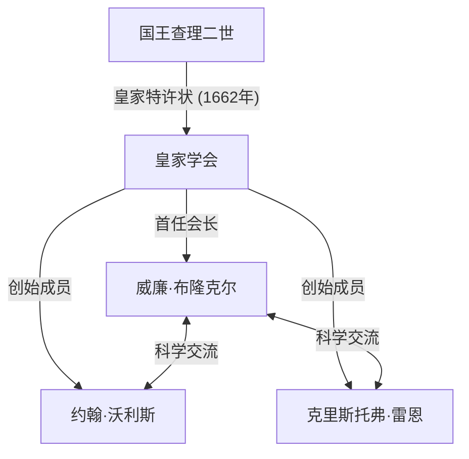
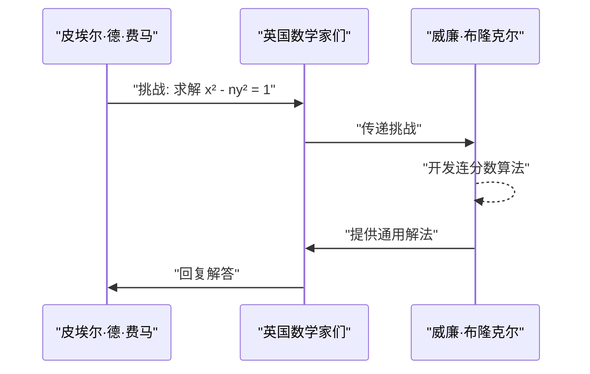

## 1. 引言

17世纪的欧洲正处于科学革命的中心。这是一个数学和物理学发生戏剧性飞跃的时代，以[艾萨克·牛顿](https://kenji.blog/zh-cn/p/newton/)和戈特弗里德·威廉·莱布尼茨发现微积分学为代表。在这一背景下，在英国学术界发展中发挥核心作用的机构是 **皇家学会 (Royal Society)**。

本文详细介绍了 **[威廉·布隆克尔](https://kenji.blog/zh-cn/p/brouncker/) (William Brouncker)** 的生平和卓越的数学成就。他曾担任皇家学会的首任会长，并以其“圆周率的连分数表示”和“[佩尔方程](https://kenji.blog/zh-cn/p/pell-equation/)的解法”作为数学家在历史上留下了印记。布隆克尔与当时欧洲最顶尖的思想家们交流，解决了一系列极具挑战性的问题。他的成就为严格通过数学处理无穷大概念奠定了重要基础。

## 2. 早年生活与职业生涯

[威廉·布隆克尔](https://kenji.blog/zh-cn/p/brouncker/)（1620年 - 1684年4月5日）出生为第一代布隆克尔子爵[威廉·布隆克尔](https://kenji.blog/zh-cn/p/brouncker/)和威妮弗雷德·李的长子。尽管关于他确切的出生地和早期教育还有许多未解之谜，但人们认为他在牛津大学学习，培养了出色的语言能力和数学天赋。1645年，随着父亲的去世，他成为了第二代布隆克尔子爵。

当时，英格兰正处于清教徒革命（英国内战）的混乱时期，但布隆克尔比起政治舞台，更倾心于学术世界。他对数学和音乐有着特别浓厚的兴趣，开始构建自己的理论。1647年，他被牛津大学授予医学博士学位，但他主要的兴趣始终在精密科学上。他的弟弟亨利·布隆克尔也以活跃于政治和宫廷世界而闻名，同时对国际象棋和数学保持着兴趣。

## 3. 作为皇家学会首任会长的活动

皇家学会是世界上最古老的科学学会之一，致力于改善对自然的认识。它的起源在于1660年克里斯托弗·雷恩在伦敦举行讲座后形成的一个聚会，并在1662年获得国王查理二世的皇家特许状后正式成立。

被选为这个历史性学会 **首任会长** 的正是[威廉·布隆克尔](https://kenji.blog/zh-cn/p/brouncker/)。在罗伯特·莫雷等人的努力下学会逐渐成型，布隆克尔在1662年至1677年间担任了长达15年的会长，致力于巩固学会的基础。

布隆克尔在将罗伯特·波义耳和罗伯特·胡克等杰出科学家聚集在一起，并确立强调实验验证的新科学方法论方面发挥了关键作用。他本人也积极参与有关钟摆运动和大气重量的实验，在学会会议上提交了大量报告。他还充当了与王室的沟通桥梁，为学会的财政和社会稳定做出了巨大贡献。

## 4. 数学成就：圆周率的连分数表示

布隆克尔最著名的数学成就是发现了圆周率 $\pi$ 的广义连分数表示。这在同时代数学家[约翰·沃利斯](https://kenji.blog/zh-cn/p/wallis/)的著作《无穷算术》(Arithmetica Infinitorum, 1655年) 中被介绍，从而广为人知。

### 沃利斯公式与布隆克尔变换

沃利斯曾发现关于圆周率的以下无穷乘积（沃利斯公式）：

$$
\frac{\pi}{2} = \frac{2}{1} \cdot \frac{2}{3} \cdot \frac{4}{3} \cdot \frac{4}{5} \cdot \frac{6}{5} \cdot \frac{6}{7} \cdot \frac{8}{7} \cdots
$$

沃利斯将这个结果展示给布隆克尔，并询问是否可以用另一种形式表达它。作为回应，布隆克尔利用代数操作和巧妙的极限概念，巧妙地将这个方程转换为了连分数。这就是以下的 **布隆克尔公式**：

$$
\frac{4}{\pi} = 1 + \frac{1^2}{2 + \frac{3^2}{2 + \frac{5^2}{2 + \frac{7^2}{2 + \ddots}}}}
$$

### 公式的意义及证明概述

这个连分数以其美丽和规律性令许多数学家着迷。它拥有非常优雅的结构，其中奇数的平方在分子中连续出现，而分母的整数部分始终是 $2$。这一发现证明了超越数圆周率被嵌入在自然数的简单规律性之中。

连分数是逼近无理数的极其强大的工具。尽管布隆克尔公式收敛速度非常慢，因此不适合圆周率的实际计算，但它作为分析中连分数展开的先驱范例，对后世的数学产生了巨大的影响。欧拉后来将进一步推广这个公式，深刻地发展了连分数理论。

## 5. 数学成就：求解[佩尔方程](https://kenji.blog/zh-cn/p/pell-equation/)

另一项重要成就是对所谓 **[佩尔方程](https://kenji.blog/zh-cn/p/pell-equation/)** 的求解。[佩尔方程](/zh-cn/p/pell-equation/)是针对非完全平方数的正整数 $n$ 的以下形式的[丢番图](https://kenji.blog/zh-cn/p/diophantus/)方程（具有整数系数的多项式方程）：

$$
x^2 - n y^2 = 1 \quad (\text{其中 } x, y \text{ 为整数})
$$

### 费马的挑战

1657年，伟大的法国数学家[皮埃尔·德·费马](https://kenji.blog/zh-cn/p/fermat/)向英国数学家发出挑战，要求找出该方程的整数解。费马举出了像 $n=61$ 这样困难的例子。

### 布隆克尔算法

正是沃利斯和布隆克尔迎接了这一挑战。尤其是布隆克尔，开发了一种实际上等同于今天被称为“连分数法”的算法，确立了为任何非平方数 $n$ 找到方程最小正整数解的程序。

布隆克尔的方法包括计算 $\sqrt{n}$ 的连分数展开式，并利用其渐近分数来构造解。例如，在 $n=2$ 的情况下，方程变为 $x^2 - 2y^2 = 1$。$\sqrt{2}$ 的连分数展开式是 $[1; 2, 2, 2, \dots]$，通过计算其渐近分数，我们可以得到最小解 $x=3, y=2$。实际上 $3^2 - 2 \cdot 2^2 = 9 - 8 = 1$ 是成立的。

在费马提出的 $n=61$ 的情况下，最小解异常庞大：

$$
x = 1766319049, \quad y = 226153980
$$

布隆克尔证明了，即使是如此庞大的解，也可以使用他的方法系统地推导出来。具有讽刺意味的是，由于[莱昂哈德·欧拉](https://kenji.blog/zh-cn/p/euler/)的误解，这个方程后来以英国数学家约翰·佩尔的名字命名，但确立解法的最大贡献者毫无疑问是布隆克尔。

## 6. 其他成就与晚年生活

### 对音乐理论的贡献

布隆克尔不仅对数学感兴趣，也对音乐理论感兴趣。他将[勒内·笛卡尔](https://kenji.blog/zh-cn/p/descartes/)的《音乐提要》(Musicae Compendium) 翻译成英文并匿名出版。在此过程中，他不仅仅是翻译，还增加了一个附录，提出了他自己的调音系统（17平均律），将一个八度等分为17个音程。这是利用对数对音阶进行数学分析的先驱尝试。

### 抛物线的求积和对数曲线

此外，他对双曲线的求积（求面积）进行了重要研究。他设计了一种利用无穷级数计算双曲线面积的方法，从而导致了对数函数的级数展开。作为尼古拉斯·墨卡托的同时代人，他认识到无穷级数在计算自然对数中的效用。这是微积分学后续发展中至关重要的一步。

### 弹道学与力学

在力学领域，他对枪炮的后坐力进行了研究，并验证了克里斯蒂安·惠更斯关于钟摆等时性的理论。这表明他不仅着眼于理论探索，还着眼于实际和军事应用。

在晚年，即使在卸任皇家学会会长后，布隆克尔也曾担任海军委员会专员等公职。布隆克尔的名字经常出现在塞缪尔·佩皮斯著名的日记中，被认为是海军行政管理中一位能干的同事。他终身未婚，于1684年在伦敦的家中去世。

## 7. 结论

[威廉·布隆克尔](https://kenji.blog/zh-cn/p/brouncker/)是一位杰出的领导者和极具独创性的数学家，推动了17世纪英国科学界的发展。他作为皇家学会首任会长在奠定现代科学基础方面的成就是不可估量的。此外，他的数学成就，如圆周率的连分数表示和[佩尔方程](https://kenji.blog/zh-cn/p/pell-equation/)的解法，成为处理无穷大概念的分析学和数论发展中的重要里程碑。

他的方法象征着从严格的几何学向利用代数和无穷级数的分析学过渡的时期。虽然他的名字常常被牛顿和费马这样的巨星所掩盖，但如果没有 **布隆克尔** 的存在，我们今天就无法讨论数学的丰富性。他那求知的好奇心和探索精神，即使在数百年后的今天，依然作为数学之美在我们面前闪耀。
