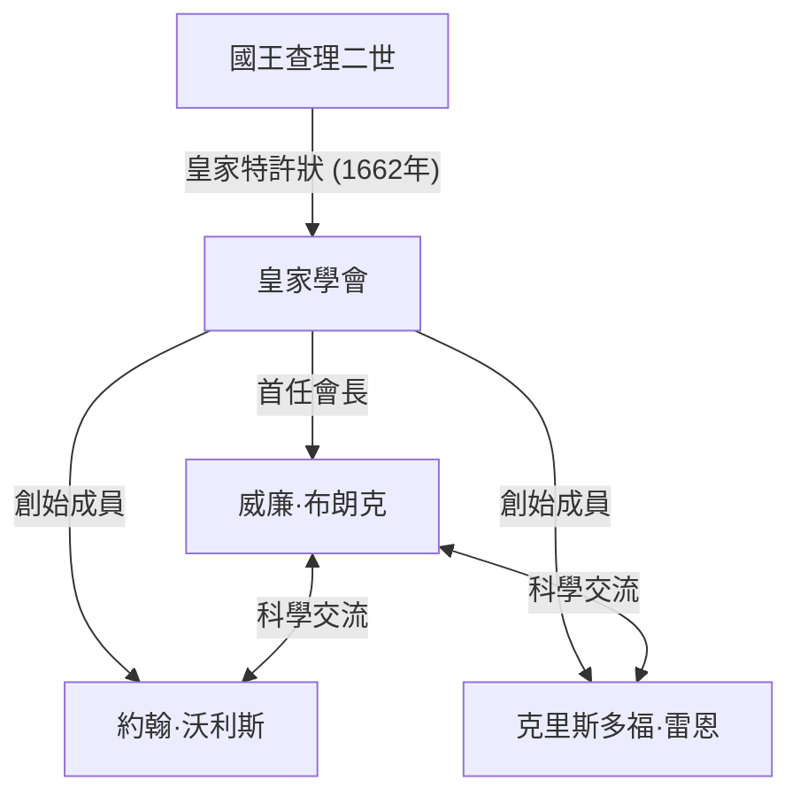
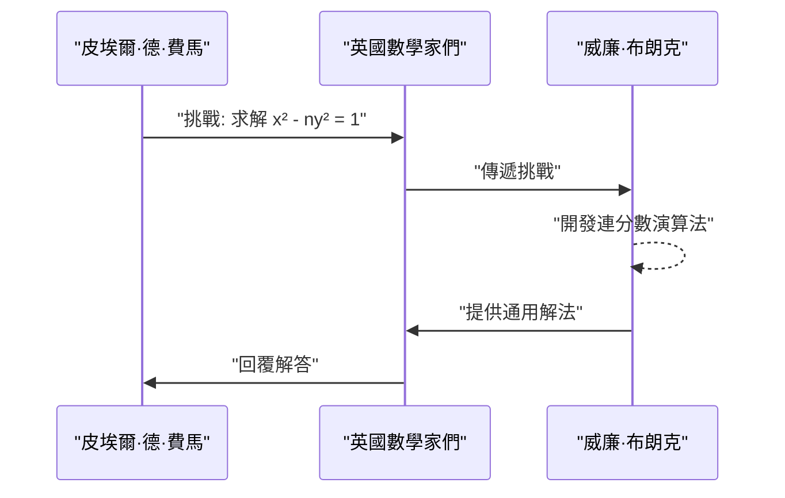

## 1. 引言

17世紀的歐洲正處於科學革命的中心。這是一個數學和物理學發生戲劇性飛躍的時代，以[艾薩克·牛頓](https://kenji.blog/p/newton/)和戈特弗里德·威廉·萊布尼茨發現微積分學為代表。在這一背景下，在英國學術界發展中發揮核心作用的機構是 **皇家學會 (Royal Society)**。

本文詳細介紹了 **[威廉·布朗克](https://kenji.blog/p/brouncker/) ([William Brouncker](https://kenji.blog/p/brouncker/))** 的生平和卓越的數學成就。他曾擔任皇家學會的首任會長，並以其「圓周率的連分數表示」和「[佩爾方程](https://kenji.blog/p/pell-equation/)的解法」作為數學家在歷史上留下了印記。布朗克與當時歐洲最頂尖的思想家們交流，解決了一系列極具挑戰性的問題。他的成就為嚴格透過數學處理無窮大概念奠定了重要基礎。

## 2. 早年生活與職業生涯

[威廉·布朗克](https://kenji.blog/p/brouncker/)（1620年 - 1684年4月5日）出生為第一代布朗克子爵[威廉·布朗克](https://kenji.blog/p/brouncker/)和威妮弗雷德·李的長子。儘管關於他確切的出生地和早期教育還有許多未解之謎，但人們認為他在牛津大學學習，培養了出色的語言能力和數學天賦。1645年，隨著父親的去世，他成為了第二代布朗克子爵。

當時，英格蘭正處於清教徒革命（英國內戰）的混亂時期，但布朗克比起政治舞台，更傾心於學術世界。他對數學和音樂有著特別濃厚的興趣，開始構建自己的理論。1647年，他被牛津大學授予醫學博士學位，但他主要的興趣始終在精密科學上。他的弟弟亨利·布朗克也以活躍於政治和宮廷世界而聞名，同時對西洋棋和數學保持著興趣。

## 3. 作為皇家學會首任會長的活動

皇家學會是世界上最古老的科學學會之一，致力於改善對自然的認識。它的起源在於1660年克里斯多福·雷恩在倫敦舉行講座後形成的一個聚會，並在1662年獲得國王查理二世的皇家特許狀後正式成立。

被選為這個歷史性學會 **首任會長** 的正是[威廉·布朗克](https://kenji.blog/p/brouncker/)。在羅伯特·莫雷等人的努力下學會逐漸成型，布朗克在1662年至1677年間擔任了長達15年的會長，致力於鞏固學會的基礎。

布朗克在將羅伯特·波以耳和羅伯特·虎克等傑出科學家聚集在一起，並確立強調實驗驗證的新科學方法論方面發揮了關鍵作用。他本人也積極參與有關鐘擺運動和大氣重量的實驗，在學會會議上提交了大量報告。他還充當了與王室的溝通橋樑，為學會的財政和社會穩定做出了巨大貢獻。

## 4. 數學成就：圓周率的連分數表示

布朗克最著名的數學成就是發現了圓周率 $\pi$ 的廣義連分數表示。這在同時代數學家[約翰·沃利斯](https://kenji.blog/p/wallis/)的著作《無窮算術》(Arithmetica Infinitorum, 1655年) 中被介紹，從而廣為人知。

### 沃利斯公式與布朗克變換

沃利斯曾發現關於圓周率的以下無窮乘積（沃利斯公式）：

$$
\frac{\pi}{2} = \frac{2}{1} \cdot \frac{2}{3} \cdot \frac{4}{3} \cdot \frac{4}{5} \cdot \frac{6}{5} \cdot \frac{6}{7} \cdot \frac{8}{7} \cdots
$$

沃利斯將這個結果展示給布朗克，並詢問是否可以用另一種形式表達它。作為回應，布朗克利用代數操作和巧妙的極限概念，巧妙地將這個方程式轉換為了連分數。這就是以下的 **布朗克公式**：

$$
\frac{4}{\pi} = 1 + \frac{1^2}{2 + \frac{3^2}{2 + \frac{5^2}{2 + \frac{7^2}{2 + \ddots}}}}
$$

### 公式的意義及證明概述

這個連分數以其美麗和規律性令許多數學家著迷。它擁有非常優雅的結構，其中奇數的平方在分子中連續出現，而分母的整數部分始終是 $2$。這一發現證明了超越數圓周率被嵌入在自然數的簡單規律性之中。

連分數是逼近無理數的極其強大的工具。儘管布朗克公式收斂速度非常慢，因此不適合圓周率的實際計算，但它作為分析中連分數展開的先驅範例，對後世的數學產生了巨大的影響。尤拉後來將進一步推廣這個公式，深刻地發展了連分數理論。

## 5. 數學成就：求解[佩爾方程](https://kenji.blog/p/pell-equation/)

另一項重要成就是對所謂 **[佩爾方程](https://kenji.blog/p/pell-equation/)** 的求解。[佩爾方程](https://kenji.blog/p/pell-equation/)是針對非完全平方數的正整數 $n$ 的以下形式的[丟番圖](https://kenji.blog/p/diophantus/)方程（具有整數係數的多項式方程）：

$$
x^2 - n y^2 = 1 \quad (\text{其中 } x, y \text{ 為整數})
$$

### 費馬的挑戰

1657年，偉大的法國數學家[皮埃爾·德·費馬](https://kenji.blog/p/fermat/)向英國數學家發出挑戰，要求找出該方程的整數解。費馬舉出了像 $n=61$ 這樣困難的例子。

### 布朗克演算法

正是沃利斯和布朗克迎接了這一挑戰。尤其是布朗克，開發了一種實際上等同於今天被稱為「連分數法」的演算法，確立了為任何非平方數 $n$ 找到方程最小正整數解的程序。

布朗克的方法包括計算 $\sqrt{n}$ 的連分數展開式，並利用其漸近分數來構造解。例如，在 $n=2$ 的情況下，方程變為 $x^2 - 2y^2 = 1$。$\sqrt{2}$ 的連分數展開式是 $[1; 2, 2, 2, \dots]$，透過計算其漸近分數，我們可以得到最小解 $x=3, y=2$。實際上 $3^2 - 2 \cdot 2^2 = 9 - 8 = 1$ 是成立的。

在費馬提出的 $n=61$ 的情況下，最小解異常龐大：

$$
x = 1766319049, \quad y = 226153980
$$

布朗克證明了，即使是如此龐大的解，也可以使用他的方法系統地推導出來。具有諷刺意味的是，由於李昂哈德·尤拉的誤解，這個方程後來以英國數學家約翰·佩爾的名字命名，但確立解法的最大貢獻者毫無疑問是布朗克。

## 6. 其他成就與晚年生活

### 對音樂理論的貢獻

布朗克不僅對數學感興趣，也對音樂理論感興趣。他將[勒內·笛卡兒](https://kenji.blog/p/descartes/)的《音樂提要》(Musicae Compendium) 翻譯成英文並匿名出版。在此過程中，他不僅僅是翻譯，還增加了一個附錄，提出了他自己的調音系統（17平均律），將一個八度等分為17個音程。這是利用對數對音階進行數學分析的先驅嘗試。

### 拋物線的求積和對數曲線

此外，他對雙曲線的求積（求面積）進行了重要研究。他設計了一種利用無窮級數計算雙曲線面積的方法，從而導致了對數函數的級數展開。作為尼古拉斯·墨卡托的同時代人，他認識到無窮級數在計算自然對數中的效用。這是微積分學後續發展中至關重要的一步。

### 彈道學與力學

在力學領域，他對槍砲的後座力進行了研究，並驗證了克里斯蒂安·惠更斯關於鐘擺等時性的理論。這表明他不僅著眼於理論探索，還著眼於實際和軍事應用。

在晚年，即使在卸任皇家學會會長後，布朗克也曾擔任海軍委員會專員等公職。布朗克的名字經常出現在塞繆爾·佩皮斯著名的日記中，被認為是海軍行政管理中一位能幹的同事。他終身未婚，於1684年在倫敦的家中去世。

## 7. 結論

[威廉·布朗克](https://kenji.blog/p/brouncker/)是一位傑出的領導者和極具獨創性的數學家，推動了17世紀英國科學界的發展。他作為皇家學會首任會長在奠定現代科學基礎方面的成就是不可估量的。此外，他的數學成就，如圓周率的連分數表示和[佩爾方程](https://kenji.blog/p/pell-equation/)的解法，成為處理無窮大概念的分析學和數論發展中的重要里程碑。

他的方法象徵著從嚴格的幾何學向利用代數和無窮級數的分析學過渡的時期。雖然他的名字常常被牛頓和費馬這樣的巨星所掩蓋，但如果沒有 **布朗克** 的存在，我們今天就無法討論數學的豐富性。他那求知的好奇心和探索精神，即使在數百年後的今天，依然作為數學之美在我們面前閃耀。
