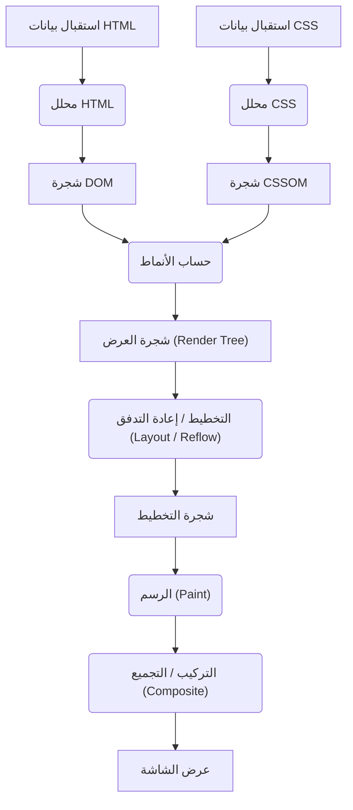
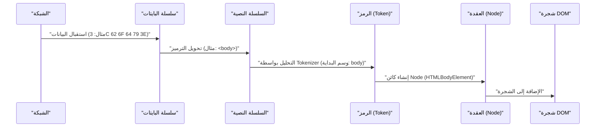
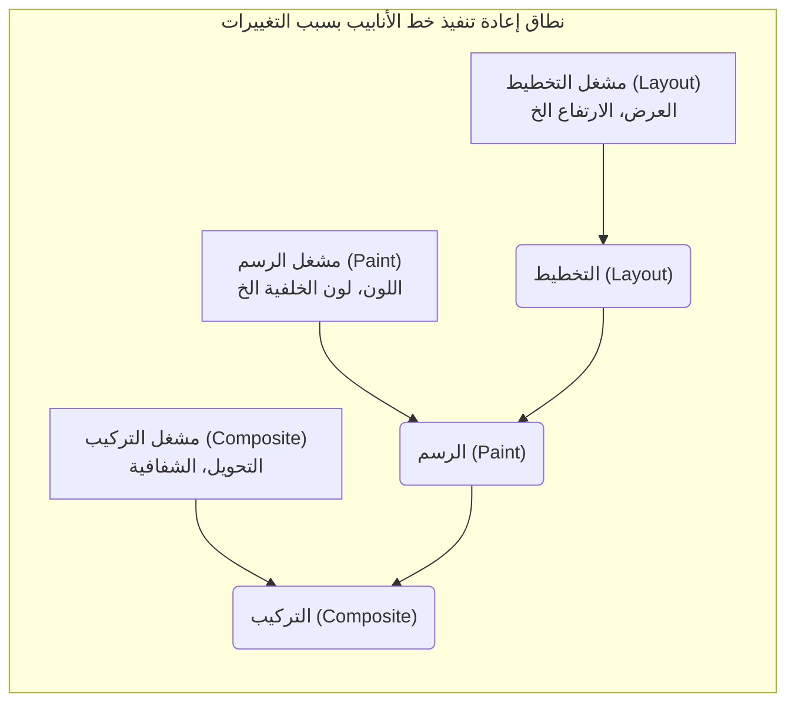

# آلية تصيير المتصفح: تحليل كامل من شجرة DOM إلى الرسم (Paint)

يعد متصفح الويب أحد أكثر البرامج المألوفة التي نستخدمها يوميًا، ولكنه في الوقت نفسه من أكثر البرامج تعقيدًا. منذ اللحظة التي تكتب فيها عنوان URL وحتى تظهر الصفحة على الشاشة، تجري عمليات حسابية ومعالجة هائلة في أجزاء من الثانية خلف الكواليس. يُطلق على هذا التسلسل من العمليات اسم **خط أنابيب التصيير (Rendering [Pipeline](https://kenji.blog/ar/p/cicd-pipeline-github-actions-best-practices/))** أو **مسار التصيير الحرج (Critical Rendering Path)** .

في هذا المقال، سنقوم بتحليل كامل للآلية التي يقوم من خلالها المتصفح (وخاصة محركات التصيير الحديثة مثل Blink و WebKit) بتفسير HTML و CSS و JavaScript، وفي النهاية رسمها (Paint) كبكسلات على الشاشة.

## 1. النظرة العامة على خط أنابيب التصيير

أولاً، دعونا نفهم النظرة العامة لعملية محرك التصيير. الخطوات الرئيسية منذ أن يتلقى المتصفح البيانات من الشبكة وحتى يتم رسمها على الشاشة هي كما يلي:



تُصنف خطوات المعالجة بشكل عام إلى المراحل التالية:

1. **التحليل (Parsing)** : تحليل HTML و CSS لبناء DOM (نموذج كائن المستند) و CSSOM (نموذج كائن CSS).
2. **الأنماط (Style)** : دمج DOM و CSSOM لحساب الأنماط النهائية المطبقة على كل عقدة.
3. **التخطيط (Layout / Reflow)** : حساب الموضع الدقيق والحجم (معلومات الهندسة) لكل عنصر على الشاشة.
4. **الرسم (Paint)** : إنشاء أوامر الرسم (Paint Records) لتحويل العناصر إلى بكسلات وتنقيتها (Rasterization).
5. **التركيب (Composite)** : تجميع طبقات متعددة مرسومة بالترتيب الصحيح لإنشاء الشاشة النهائية.

الآن، دعونا نلقي نظرة مفصلة على كل خطوة.

## 2. التحليل (Parsing): بناء شجرة DOM وشجرة CSSOM

عندما يتلقى المتصفح سلسلة من البايتات (بيانات HTML) من الخادم، يبدأ محرك التصيير في تحويلها إلى هيكل بيانات يمكن للبشر والبرامج فهمه.

### 2.1 تحليل HTML وبناء شجرة DOM

تتم عملية تحليل HTML وفقًا لخوارزمية تحليل HTML المحددة بواسطة W3C (حاليًا WHATWG). يمكن تقسيم هذه العملية إلى الخطوات الأربع التالية:

1. **التحويل (Conversion)** : تحويل سلسلة البايتات الخام المستقبلة من الشبكة إلى أحرف فردية بناءً على ترميز الأحرف المحدد (مثل UTF-8).
2. **الترميز (Tokenization)** : تحويل السلسلة النصية إلى "رموز (Tokens)" مختلفة محددة في معيار W3C HTML5. على سبيل المثال، وسوم البداية والنهاية مثل `<html>` و `<body>` ، وأسماء الخصائص وقيمها، وغيرها.
3. **التحليل النحوي (Lexing)** : تحويل الرموز الناتجة إلى "كائنات (Nodes)" تحتوي على خصائص وقواعد.
4. **بناء شجرة DOM (DOM [Tree](https://kenji.blog/ar/p/tree-graph-data-structures-search-dfs-bfs-dijkstra/) Construction)** : ربط الكائنات المنشأة في هيكل بيانات شجري بناءً على علاقات التداخل بين الوسوم. هذا هو **DOM (نموذج كائن المستند)** .



تُمثل شجرة DOM بنية المستند ومحتواه بالكامل. ومع ذلك، في هذه المرحلة، لا تحتوي على معلومات حول "كيف ستبدو العناصر".

### 2.2 تحليل CSS وبناء شجرة CSSOM

عندما يجد محلل HTML معلومات متعلقة بـ CSS، مثل وسوم `<link>` أو `<style>` ، تبدأ عملية تحليل CSS. يتبع تحليل CSS خطوات مشابهة جداً لـ HTML وينتج في النهاية بنية شجرية تُعرف باسم **CSSOM (نموذج كائن CSS)** .

سلسلة البايتات -> السلسلة النصية -> الرموز -> العقد -> CSSOM

يحتفظ CSSOM بكيفية تنسيق كل عقدة في شجرة DOM. من خصائص CSS **التتالي (Cascade)** . أي أن تعريف النمط لعنصر ما إما أن يورث من العنصر الأب أو يتم تجاوزه بقاعدة ذات خصوصية (Specificity) أعلى. لذلك، يصبح CSSOM حتمًا هيكلًا شجريًا.

إذا عبرنا عن الخصوصية باستخدام المعادلات الرياضية، فسيتم تمثيل أولوية النمط بالمتجه $ S = (a, b, c) $ (حيث a هو المعرف، b هي الفئة، و c هي عدد الوسوم).
عند المقارنة، يتم التقييم بدءًا من العناصر الأعلى:
$$
\text{الخصوصية}(S_1, S_2) = 
\begin{cases} 
S_1 & \text{إذا كان } S_1 > S_2 \\\\
S_2 & \text{خلاف ذلك}
\end{cases}
$$

#### بناء CSSOM يحظر التصيير

نقطة مهمة هي أن **تحليل CSS يُعامل كمورد يحظر التصيير (Render Blocking Resource)** .
بينما يمكن بناء DOM بشكل تدريجي دون انتظار الموارد الخارجية، فإن المتصفح ينتظر الخطوات اللاحقة (بناء شجرة العرض ورسم الشاشة) حتى يتم بناء CSSOM بالكامل.

ذلك لأنه إذا بدأ الرسم باستخدام CSSOM غير مكتمل، ستتم إعادة رسم الشاشة في كل مرة يتم فيها حساب نمط، مما يؤدي إلى حدوث وميض (FOUC: وميض المحتوى غير المنسق).

### 2.3 حظر التحليل بواسطة JavaScript

عندما يحتوي HTML على وسوم `<script>` ، يصبح سلوك المتصفح أكثر تعقيدًا.

عندما يصادف محلل المتصفح وسم `<script>` ، فإنه **يوقف (يحظر)** بناء DOM مؤقتًا. ثم ينتقل التحكم إلى محرك JavaScript، وينتظر حتى يكتمل تنزيل السكربت وتحليله وتنفيذه.
لماذا؟ لأن JavaScript قد يستخدم `document.write()` أو DOM API لتعديل شجرة DOM قيد التحليل أو HTML نفسه.

```html
<!-- مثال على حظر تحليل DOM -->
<p>هنا يتم التحليل فوراً</p>
<script src="heavy-script.js"></script>
<!-- حتى ينتهي تنفيذ heavy-script.js، لا يتم تحليل هذا الجزء -->
<p>يتأخر عرض هذا الجزء</p>
```

#### سمتا defer و async

لتجنب حظر التصيير هذا وتحسين الأداء، يتم توفير سمتين لوسم `<script>` : `defer` و `async` .

* **async** : يتم تنزيل السكربت بشكل غير متزامن في الخلفية. بمجرد اكتمال التنزيل، يتوقف تحليل HTML مؤقتًا ويتم تنفيذ السكربت. لا يتم ضمان ترتيب التنفيذ (يُنفذ بناءً على ما ينتهي تنزيله أولاً). يُعد مناسباً لسكربتات تحليل الزيارات التي لا تحتوي على تبعيات.
* **defer** : يتم تنزيل السكربت بشكل غير متزامن، ولكن يتم تأخير التنفيذ حتى **يكتمل تحليل HTML تماماً (مباشرة قبل حدث DOMContentLoaded)** . نظرًا لأنه يضمن تنفيذ السكربتات بالترتيب المكتوب في HTML، فهو مناسب للسكربتات التي تعتمد على DOM.

```mermaid
gantt
    title "تحميل وتنفيذ السكربت"
    dateFormat  s
    axisFormat %s

    section "السكربت العادي"
    "تحليل HTML"       :active, a1, 0, 2s
    "تنزيل JS" :crit, a2, 2s, 4s
    "تنفيذ JS"         :crit, a3, 4s, 6s
    "استئناف تحليل HTML"   :active, a4, 6s, 8s

    section "سمة async"
    "تحليل HTML"       :active, b1, 0, 5s
    "تنزيل JS" :crit, b2, 2s, 4s
    "تنفيذ JS"         :crit, b3, 5s, 7s
    "استئناف تحليل HTML"   :active, b4, 7s, 9s

    section "سمة defer"
    "تحليل HTML"       :active, c1, 0, 6s
    "تنزيل JS" :crit, c2, 1s, 4s
    "تنفيذ JS"         :crit, c3, 6s, 8s
```
*(※ نظراً لأن `async` الفعلي يُنفذ فور اكتمال التنزيل، فإنه يقاطع التحليل.)*

## 3. الأنماط (Style): بناء شجرة العرض (Render [Tree](https://kenji.blog/ar/p/tree-graph-data-structures-search-dfs-bfs-dijkstra/))

بمجرد اكتمال شجرة DOM وشجرة CSSOM، يقوم المتصفح بدمجهما لبناء **شجرة العرض (Render Tree)** أو **شجرة الأنماط (Style Tree)** .

في هذه المرحلة، بالنسبة لكل عقدة في شجرة DOM، يتم حساب قاعدة النمط في CSSOM التي سيتم تطبيقها، ويتم تحديد النمط المحسوب النهائي (Computed Style).

### 3.1 ما يتم تضمينه واستبعاده في شجرة العرض

شجرة العرض هي شجرة تحتوي على معلومات مرئية عن **جميع العناصر التي ستُعرض على الشاشة** . لذلك، فهي لا تتطابق تمامًا 1 لـ 1 مع شجرة DOM.

* **ما يتم استبعاده** :
    * العناصر غير المرئية مثل `<head>` ، `<meta>` ، و `<script>` .
    * العناصر (ونسلها) التي تم تعيينها بـ `display: none;` في CSS.
* **ما يتم تضمينه** :
    * عقد DOM المرئية.
    * العناصر الزائفة (مثل `::before` ، `::after` ). هذه غير موجودة في DOM، لكنها تُضاف إلى شجرة العرض.
    * العناصر المحددة بـ `visibility: hidden;` . رغم أنها غير مرئية، فإنها تشغل مساحة (وتؤثر على التخطيط) لذلك تُضمن في شجرة العرض.

### 3.2 تعقيد حساب النمط

عملية تحديد أي قواعد CSS سيتم تطبيقها على عنصر ما هي عملية مكلفة حسابياً جداً.
عندما يقوم المتصفح بمطابقة المحددات (Selector Matching)، فإنه يقيّمها **من اليمين إلى اليسار (Right-to-Left)** .

على سبيل المثال، افترض وجود قاعدة CSS التالية:

```css
.container div .item p {
    color: red;
}
```

يجد المتصفح أولاً جميع وسوم `<p>` (وهذا هو المحدد الرئيسي في أقصى اليمين). ثم ينتقل عبر شجرة العناصر الأصلية لهذا الـ `<p>` للتحقق مما إذا كان هناك عنصر له الفئة `.item` ، ثم يتحقق مما إذا كان أصله `div` ، ثم يتحقق مما إذا كان أصل ذلك هو `.container` .

لماذا من اليمين إلى اليسار؟ لأنه إذا أصبحت شجرة DOM ضخمة جداً، والبحث من اليسار إلى اليمين سيعني فحص عدد لا نهائي من "العناصر الفرعية غير المطابقة"، مما يقلل بشكل كبير من الأداء. بالبحث من اليمين إلى اليسار، يمكن تضييق نطاق العناصر المستهدفة بسرعة.

وبالتالي، فإن المحددات المفرطة التفصيل أو الزائدة عن الحاجة مثل ما يلي ستتسبب في انخفاض أداء حساب النمط.

```css
/* مثال سيء: يحتاج المتصفح إلى فحص جميع وسوم a وتتبع آبائها بالتسلسل للتحقق مما إذا كانوا span، li، ul، div */
div ul li span a { color: blue; }

/* مثال جيد: استخدام منهجيات تصميم مثل BEM لتحديد الفئات بشكل مسطح ومباشر */
.nav-link { color: blue; }
```

## 4. التخطيط (Layout / Reflow): حساب موضع العنصر وحجمه

بمجرد بناء شجرة العرض (مجموعة العقد ذات معلومات النمط)، ندخل في مرحلة **التخطيط (Layout)** . في متصفحات تعتمد على WebKit، يُطلق على هذا أيضًا اسم **إعادة التدفق (Reflow)** .

في هذه المرحلة، استنادًا إلى حجم منفذ العرض (Viewport) في المتصفح، يتم حساب **الموقع (Position)** و **الحجم (Size)** الدقيق لكل عقدة في شجرة العرض على الشاشة.

### 4.1 نموذج الصندوق وتخطيط التدفق

أساس تخطيط المتصفح هو **نموذج الصندوق (Box Model)** . يتم حساب جميع العناصر كصناديق مستطيلة تحتوي على محتوى (Content) وحشوة (Padding) وحدود (Border) وهوامش (Margin).

تبدأ حسابات التخطيط عادةً من جذر شجرة العرض (عنصر `<html>` ، الكتلة المحتوية الأولية) وتنتقل إلى أسفل بشكل متكرر إلى العناصر الفرعية.

1. **من الأب إلى الابن** : يحدد الصندوق الأب عرضه ويمرر العرض المتاح إلى الصندوق الابن.
2. **من الابن إلى الأب** : يحدد الصندوق الابن ارتفاعه (بناءً على محتواه) ويمرره إلى الصندوق الأب. يحدد الصندوق الأب ارتفاعه النهائي من إجمالي ارتفاع الصناديق الأبناء.

تُعرف هذه الآلية حيث يتم تحديد معظم التخطيطات بمرور واحد من أعلى إلى أسفل باسم **تخطيط التدفق (Flow Layout)** (※ الجداول و Flexbox/Grid قد تتطلب تمريرات متعددة أكثر تعقيداً).

### 4.2 التخطيط الشامل والتخطيط التزايدي

هناك نوعان من حساب التخطيط: **التخطيط الشامل (Global Layout)** الذي يعيد حساب الشاشة بأكملها، و **التخطيط التزايدي (Incremental Layout)** الذي يعيد حساب الأجزاء المتغيرة فقط.

* **التخطيط الشامل** : عندما يتم تغيير حجم النافذة (resize)، أو تغيير اتجاه الجهاز، أو تغيير حجم خط العنصر الجذر، يتم إعادة حساب التخطيط لشجرة العرض بأكملها. هذه عملية مكلفة للغاية.
* **التخطيط التزايدي** : عندما يتغير حجم بعض العناصر عبر JavaScript، أو تضاف/تحذف عقد DOM، فإن المتصفح يضع علامة "متسخة (Dirty)" على ذلك العنصر والعناصر التي قد تتأثر به (العناصر الشقيقة أو الأصلية)، ويعيد حساب هذا الجزء فقط بشكل غير متزامن. يُعرف هذا بنظام **البت المتسخ (Dirty bit system)** .

### 4.3 سحق التخطيط (Layout Thrashing) والأداء

إذا قمت بتغيير نمط DOM باستخدام JavaScript وحاولت قراءة النتيجة المحسوبة (مثل الارتفاع أو العرض) فورًا، سيضطر المتصفح إلى تنفيذ حساب التخطيط المؤجل من أجل التحسين **قسراً وعلى الفور (Synchronous Layout)** .

القيام بذلك بشكل مستمر في حلقة يُعرف باسم **سحق التخطيط (Layout Thrashing)** ويتسبب في مشاكل أداء خطيرة تؤدي إلى انخفاض معدل الإطارات بشكل كبير.

**【مثال سيء على كود يسبب سحق التخطيط】**

```javascript
const elements = document.querySelectorAll('.box');

// مثال سيء: قراءة DOM (offsetWidth) والكتابة (style.width) تحدث بالتناوب
for (let i = 0; i < elements.length; i++) {
    // لإجراء قراءة offsetWidth، يقوم المتصفح بإجبار تنفيذ حساب التخطيط
    const width = elements[i].offsetWidth;
    // من خلال كتابة النمط، يصبح DOM "متسخاً (Dirty)"
    elements[i].style.width = width + 10 + 'px';
    // في الحلقة التالية يتم قراءة offsetWidth مرة أخرى، مما يتسبب في تخطيط إجباري مرة أخرى... (الحلقة أدناه)
}
```

**【حل للتحسين: فصل القراءة والكتابة (Batching)】**

```javascript
const elements = document.querySelectorAll('.box');
const widths = [];

// مثال جيد: المرحلة 1 - قراءة جميع عروض العناصر معاً (التخطيط يحدث مرة واحدة فقط)
for (let i = 0; i < elements.length; i++) {
    widths.push(elements[i].offsetWidth);
}

// مثال جيد: المرحلة 2 - كتابة أنماط جميع العناصر معاً
for (let i = 0; i < elements.length; i++) {
    elements[i].style.width = widths[i] + 10 + 'px';
}
// في وقت رسم المتصفح اللاحق، يتم إعادة حساب التخطيط مرة واحدة فقط معاً
```

في الآونة الأخيرة، أصبح من الشائع استخدام مكتبات مثل `FastDOM` أو استخدام `requestAnimationFrame` بشكل مناسب لتجميع قراءة وكتابة DOM معاً.

## 5. الرسم (Paint): إنشاء البكسلات

عبر مرحلة التخطيط، تم تحديد موقع الصندوق (إحداثيات X، Y) وحجمه (العرض، الارتفاع) لكل عنصر. ومع ذلك، لم يتم رسم أي شيء على الشاشة حتى الآن. الخطوة التالية هي مرحلة **الرسم (Paint)** .

الهدف من مرحلة الرسم هو أخذ شجرة التخطيط (Layout [Tree](https://kenji.blog/ar/p/tree-graph-data-structures-search-dfs-bfs-dijkstra/)) كمدخل، وإنشاء إجراءات حول كيفية طلاء البكسلات على الشاشة (أوامر الرسم - Paint Records)، وأخيرًا إجراء التنقيط (Rasterization).

### 5.1 ترتيب الرسم (Stacking Context)

لا يمكنك ببساطة رسم العناصر بنفس الترتيب المكتوب به في HTML. في CSS توجد خصائص مثل `z-index` ، التموضع المطلق ( `position: absolute;` )، الشفافية ( `opacity` )، والتحويلات ثلاثية الأبعاد، وهذه تؤثر على الترتيب الذي تتداخل به العناصر (الترتيب على المحور Z).

الآلية التي تدير هذا تُعرف باسم **سياق التراص (Stacking Context)** .

يقوم المتصفح بإنشاء أوامر رسم متبعاً ترتيب رسم صارم محدد في مواصفات CSS 2.1. ترتيب الرسم الشائع لعنصر الكتل (block element) هو كما يلي:

1. background-color (لون الخلفية)
2. background-image (صورة الخلفية)
3. border (الحدود)
4. children (رسم العناصر الأبناء)
5. outline (المخطط الخارجي)

### 5.2 سجلات الرسم (Paint Records) وقائمة العرض (Display List)

في المتصفحات الحديثة (مثل Blink في Chrome)، تغيرت مرحلة الرسم من كتابة البكسلات مباشرة في الذاكرة إلى معالجة تنشئ قائمة (Display List) من **سجلات الرسم (Paint Records)** .

سجل الرسم هو قائمة بأوامر رسم محددة مثل "ارسم مستطيلاً بهذا اللون في هذه الإحداثيات" و "ارسم هذا النص بالخط المحدد".

```json
// فكرة مبدئية لسجل الرسم (Paint Record)
[
  { "action": "drawRect", "rect": [0, 0, 100, 100], "color": "blue" },
  { "action": "drawText", "text": "Hello", "pos": [10, 20], "font": "Arial" }
]
```

لماذا نجعلها قائمة؟ لأنه بدلاً من إعادة رسم كل شيء في كل مرة يحدث فيها تغيير بسيط، فمن الأفضل الاحتفاظ بقائمة أوامر الرسم، وتحديث وتنفيذ الأوامر الخاصة بالجزء المتغير فقط، مما يجعله أكثر كفاءة.

### 5.3 التنقيط (Rasterization) واستخدام خيوط متعددة

يجب تحويل سجلات الرسم (قائمة العرض) المنشأة إلى بكسلات فعلية (بيانات نقطية - Bitmap). تُعرف هذه العملية باسم **التنقيط (Rasterization)** .

إعادة تنقيط الصفحة بأكملها في كل مرة يتم فيها التمرير يُعد غير فعال. لذلك، يدير المتصفح الشاشة عن طريق تقسيمها إلى مناطق مستطيلة صغيرة متعددة (على سبيل المثال، 256x256 بكسل) تسمى **البلاطات (Tiles)** .

في المتصفحات مثل Chrome الحالية، لا يتم التنقيط في الخيط الرئيسي (الذي يعالج JavaScript والتخطيط)، ولكن تتم معالجته بشكل متوازٍ في **خيوط المنقط (Rasterizer Threads)** المخصصة. علاوة على ذلك، تستفيد العديد من مهام التنقيط من تسريع الأجهزة، ويتم تنفيذها بسرعة عالية على وحدة معالجة الرسومات **(GPU)** .

## 6. التركيب (Composite): تجميع الطبقات

بمجرد اكتمال التنقيط وإنشاء بيانات البكسلات لكل بلاطة (عادة يتم حفظها كمادة نسيج (Texture) على ذاكرة GPU)، ندخل الخطوة الأخيرة وهي مرحلة **التركيب (Composite)** .

في صفحات الويب المعقدة، تتداخل العناصر مع بعضها البعض، مثل الترويسات التي تحتوي على ظلال الإسقاط، النوافذ المنبثقة (Modals) المثبتة في المقدمة، وصور الخلفية التي تتمرر. إذا تم رسم جميع هذه العناصر على لوحة واحدة (Canvas) مستوية، سيتطلب الأمر إعادة رسم واسعة النطاق (Paint و Rasterization) في كل مرة يتم فيها التمرير أو تنفيذ حركة، مما يقلل الأداء.

لذلك، يدير المتصفح الصفحة من خلال تقسيمها إلى عدة **طبقات مستقلة (Graphics Layers)** .

### 6.1 آلية بناء الطبقات

داخل المتصفح، يتم تحويل هياكل شجرية متعددة:

1. **شجرة DOM (DOM [Tree](https://kenji.blog/ar/p/tree-graph-data-structures-search-dfs-bfs-dijkstra/))**
2. **شجرة التخطيط (Layout Tree / Render Tree)** : معلومات هندسية للعناصر المرئية
3. **شجرة الرسم (Paint Tree / Layer Tree)** : بنية الطبقة الهرمية استنادًا إلى سياقات التراص وغيرها
4. **شجرة طبقات الرسومات (Graphics Layer Tree)** : مجموعة الطبقات المستقلة التي يتم تجميعها فعلياً بواسطة GPU

يتم ترقية العناصر ذات خصائص CSS محددة (Promoted) بواسطة المتصفح إلى "طبقة رسومات (Graphics Layer)" مستقلة.

الشروط الرئيسية (المشغلات) التي تولد الطبقات هي كما يلي:

* التحويلات ثلاثية الأبعاد أو المنظور ( `transform: translateZ(0)` , `translate3d(...)` )
* عناصر `<video>` و `<canvas>`
* الرسوم المتحركة أو الانتقالات في CSS، لتغيير الشفافية ( `opacity` ) أو التحويل ( `transform` )
* العناصر التي تحدد الخاصية `will-change` (مثال: `will-change: transform;` )
* العناصر التي تقع فوق طبقة مستقلة أخرى (بسبب التداخل)

### 6.2 خيط المُركِّب وتسريع الأجهزة

يتم تركيب الطبقات في خيط مخصص يُسمى **خيط المُركِّب (Compositor Thread)** ، وهو مستقل عن الخيط الرئيسي.

يتم نقل الأنسجة النقطية المنقطة (Rasterized Bitmap Textures) لكل طبقة إلى GPU. يرسل خيط المُركِّب تعليمات التجميع (إطار المُركِّب - Compositor Frame) إلى GPU مثل "ضع الطبقة أ في الإحداثيات س 100 و ص 200، ثم ضع الطبقة ب فوقها بشفافية 0.5". يقوم GPU بتجميع هذه الصور بسرعة فائقة لإخراج الشاشة النهائية إلى الشاشة.

#### التمرير والحركة المستقلان عن الخيط الرئيسي

استقلالية خيط المُركِّب عن الخيط الرئيسي مهمة للغاية للأداء.

حتى إذا استغرق تنفيذ JavaScript وقتًا طويلاً وتم حظر (تجميد) الخيط الرئيسي، فإذا قام المستخدم بالتمرير بالماوس، يحتاج خيط المُركِّب فقط إلى إزاحة نسيج الطبقات الموجودة بالفعل في GPU وتركيبها. وهذا يتيح تمريرًا سلسًا (بدون تقطع) حتى في الصفحات ذات عمليات JavaScript الثقيلة.

يمكن الاستفادة من ذلك لأقصى حد مع الرسوم المتحركة باستخدام `transform` و `opacity` .

### 6.3 مشغلات CSS (CSS Trigger): تحسين أداء الحركة

أحد أهم المفاهيم في تحسين أداء الويب هو **مشغلات CSS (CSS Triggers)** .
عندما تغير نمط عنصر باستخدام JavaScript أو CSS، فإن الخاصية التي تغيرها تحدد المرحلة من خط أنابيب تصيير المتصفح التي ستحتاج إلى إعادتها (هل هي من التخطيط، أم من الرسم، أم من التركيب).

1. **الخصائص التي تُشغل التخطيط (Layout / Reflow)**
    * `width` , `height` , `margin` , `padding` , `top` , `left` , `font-size` إلخ.
    * نظرًا لتغير المعلومات الهندسية، سيتم إعادة تشغيل خط الأنابيب بأكمله: التخطيط -> الرسم -> التركيب. إنها عملية ثقيلة للغاية وغير مناسبة للرسوم المتحركة.
2. **الخصائص التي تُشغل الرسم (Paint / Repaint)**
    * `color` , `background-color` , `box-shadow` إلخ.
    * لن يتغير حجم العنصر أو موضعه، لكن المظهر سيتغير، لذلك سيتم إعادة التشغيل: الرسم -> التركيب. هي أخف من التخطيط، لكن يُعاد رسم البكسلات مما يضيف عبئاً.
3. **الخصائص التي تُشغل التركيب (Composite) فقط**
    * `transform` ( `translate` , `scale` , `rotate` )
    * `opacity`
    * هذه لا تغير هندسة العنصر أو لون البكسلات الفردية. نظراً لأن العنصر موجود بالفعل كطبقة (نسيج) مستقلة في GPU، يحتاج المتصفح فقط إلى إخبار GPU بـ "إزاحة النسيج وتركيبه (transform)" أو "تجميعه بشكل شبه شفاف (opacity)". يمكنه تخطي التخطيط والرسم تمامًا في الخيط الرئيسي، وهذا **أسلوب أساسي لتحقيق حركة سلسة بمعدل 60 إطاراً في الثانية (60fps)** .



#### الاستفادة من خاصية will-change

خاصية `will-change` هي خاصية CSS يخبر بها المطور المتصفح مسبقًا بأن "هذه الخاصية المحددة للعنصر ستتغير مستقبلاً".

```css
.animated-box {
    /* إخبار المتصفح مسبقاً بأن التحويل (transform) سيتغير، وجعله ينشئ طبقة مخصصة */
    will-change: transform;
    transition: transform 0.3s ease;
}
.animated-box:hover {
    transform: translateX(100px);
}
```

عندما يرى المتصفح `will-change: transform` ، فإنه يقوم بترقية العنصر إلى طبقة مستقلة "قبل" بدء الحركة، ويقوم بإعداد النسيج في GPU. يمنع هذا التقطعات (التأخير الناتج عن الرسم) في اللحظة التي يمرر فيها المستخدم الماوس وتبدأ الحركة.

ومع ذلك، ونظراً لأن إنشاء الطبقات يستهلك الذاكرة، فإن تحديد `will-change` لجميع العناصر الموجودة في الصفحة قد يؤدي إلى تعطل المتصفح أو انخفاض الأداء. من المهم استخدامه بشكل مناسب فقط للعناصر التي تتطلبه.

## 7. الخلاصة

لقد اطلعنا على "الآلية الكاملة من شجرة DOM إلى الرسم (ثم التركيب)" منذ أن يتلقى المتصفح ملف HTML وحتى يرسم البكسلات على الشاشة.

1. **التحليل (Parsing)** : تحليل HTML/CSS، وبناء DOM و CSSOM. تحظر JavaScript (خاصة السكربتات المتزامنة) هذا الإجراء.
2. **الأنماط (Style)** : دمج DOM و CSSOM، وبناء شجرة العرض (Render [Tree](https://kenji.blog/ar/p/tree-graph-data-structures-search-dfs-bfs-dijkstra/)) مع العناصر المرئية وأنماطها.
3. **التخطيط (Layout)** : حساب الموضع الدقيق (الإحداثيات) والحجم لكل عنصر على الشاشة.
4. **الرسم (Paint)** : إنشاء أوامر الرسم (Paint Records)، وتنقيطها إلى بكسلات في خيط مخصص.
5. **التركيب (Composite)** : تجميع الطبقات المستقلة على GPU لإخراج الشاشة النهائية.

يعد الفهم العميق لهذه الآلية أكثر من مجرد معرفة لمطوري الواجهة الأمامية.
"لماذا تتقطع الحركة عند عمل الرسوم المتحركة باستخدام `width` ؟"
"لماذا يجب وضع وسم `script` قبل إغلاق وسم `body` مباشرة، أو استخدام `defer` ؟"
"لماذا تعمل DOM الافتراضية في React أو Vue بهذه السرعة؟ (= تجميع وتقليل الوصول إلى DOM والتخطيط/الرسم)"

الإجابات على جميع هذه الأسئلة تكمن داخل خط أنابيب التصيير هذا. من خلال فهم هذه الآلية، ستتمكن من بناء تطبيقات ويب ذات أداء أعلى وتقديم تجربة مستخدم ممتازة.
