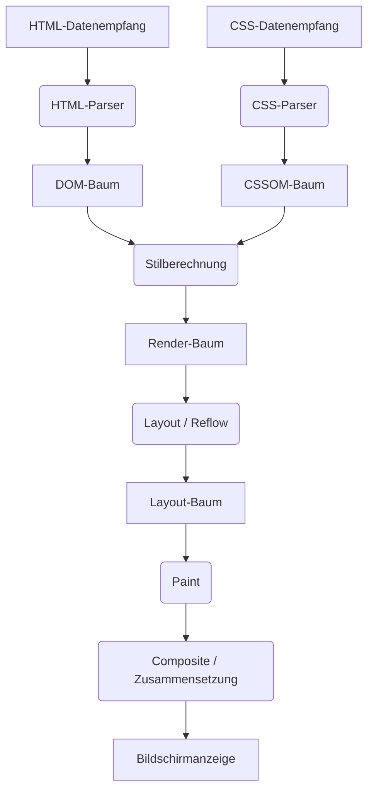
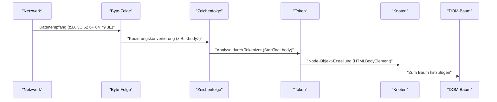
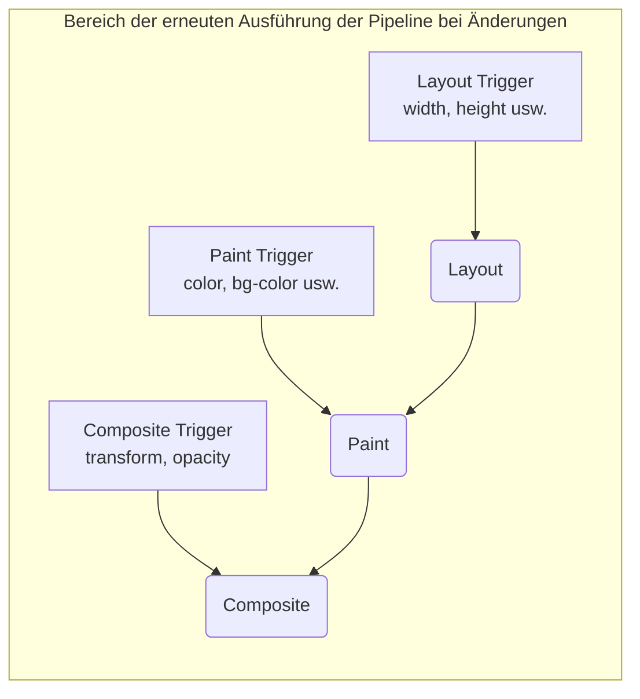

# Funktionsweise des Browser-Renderings: Vollständige Analyse vom DOM-Baum bis zum Paint

Webbrowser gehören zu der uns am nächsten stehenden und gleichzeitig komplexesten Software, die wir täglich nutzen. Von der Eingabe einer URL bis zur Anzeige der Seite auf dem Bildschirm finden intern innerhalb von Millisekunden enorme Berechnungen und Verarbeitungen statt. Dieser Verarbeitungsfluss wird als **Rendering [Pipeline](https://kenji.blog/de/p/cicd-pipeline-github-actions-best-practices/)** oder **Critical Rendering Path** bezeichnet.

In diesem Artikel analysieren wir den vollständigen Mechanismus, wie Browser (insbesondere moderne Rendering-Engines wie Blink und WebKit) HTML, CSS und JavaScript interpretieren und schließlich als Pixel auf dem Bildschirm zeichnen (Paint).

## 1. Gesamtbild der Rendering-Pipeline

Lassen Sie uns zunächst einen Überblick über die Verarbeitung der Rendering-Engine gewinnen. Die Hauptschritte von dem Moment an, in dem der Browser Daten aus dem Netzwerk empfängt, bis zum Zeichnen auf dem Bildschirm sind wie folgt:



Die Verarbeitungsschritte lassen sich grob in folgende Phasen einteilen:

1.  **Parsing (Parsen)** : HTML und CSS analysieren, um das DOM (Document Object Model) und CSSOM (CSS Object Model) aufzubauen.
2.  **Style (Stilberechnung)** : DOM und CSSOM kombinieren und den endgültigen Stil für jeden Knoten berechnen.
3.  **Layout (Layout / Reflow)** : Die genaue Position und Größe (Geometrieinformationen) jedes Elements auf dem Bildschirm berechnen.
4.  **Paint (Paint / Zeichnen)** : Zeichenbefehle (Paint Records) zur Umwandlung von Elementen in Pixel generieren und rastern.
5.  **Composite (Composite / Zusammensetzung)** : Die gezeichneten Ebenen in der richtigen Reihenfolge übereinanderlegen, um den endgültigen Bildschirm zu erzeugen.

Lassen Sie uns nun jeden Schritt im Detail betrachten.

## 2. Parsing (Analyse): Aufbau von DOM-Baum und CSSOM-Baum

Wenn der Browser eine Byte-Folge (HTML-Daten) vom Server erhält, beginnt die Rendering-Engine, diese in eine für Menschen und Programme verständliche Datenstruktur umzuwandeln.

### 2.1 HTML-Parsing und Aufbau des DOM-Baums

Die HTML-Analyse erfolgt gemäß dem vom W3C (heute WHATWG) definierten HTML-Parsing-Algorithmus. Dieser Prozess lässt sich in folgende vier Schritte unterteilen:

1.  **Conversion (Konvertierung)** : Die vom Netzwerk empfangene rohe Byte-Folge wird basierend auf der angegebenen Zeichenkodierung (z. B. UTF-8) in einzelne Zeichen (Characters) konvertiert.
2.  **Tokenization (Lexikalische Analyse)** : Die Zeichenfolge wird in verschiedene vom W3C-HTML5-Standard definierte „Tokens“ umgewandelt. Zum Beispiel Start-Tags wie `<html>`, `<body>`, End-Tags, Attributnamen und Attributwerte.
3.  **Lexing (Syntaxanalyse)** : Die generierten Tokens werden in „Objekte (Knoten)“ mit Eigenschaften und Regeln umgewandelt.
4.  **DOM [Tree](https://kenji.blog/de/p/tree-graph-data-structures-search-dfs-bfs-dijkstra/) Construction (Baumaufbau)** : Die erstellten Objekte werden basierend auf der Verschachtelung der Tags zu einer baumartigen Datenstruktur verknüpft. Das ist das **DOM (Document Object Model)**.



Der DOM-Baum repräsentiert die Struktur und den Inhalt des Dokuments vollständig. Zu diesem Zeitpunkt enthält er jedoch keine Informationen darüber, „wie die Elemente aussehen werden“.

### 2.2 CSS-Parsing und Aufbau des CSSOM-Baums

Sobald der HTML-Parser auf Informationen zu CSS stößt, wie etwa `<link>`- oder `<style>`-Tags, beginnt der CSS-Analyseprozess. Die CSS-Analyse durchläuft ähnliche Schritte wie bei HTML und erzeugt schließlich eine Baumstruktur namens **CSSOM (CSS Object Model)**.

Byte-Folge -> Zeichenfolge -> Token -> Knoten -> CSSOM

Das CSSOM ist eine Struktur, die speichert, wie jeder Knoten des DOM-Baums formatiert werden soll. Ein Merkmal von CSS ist die **Kaskade (Cascade)**. Das bedeutet, dass Stildefinitionen für ein Element von Elternelementen geerbt oder durch Regeln mit höherer Spezifität (Specificity) überschrieben werden. Daher ist das CSSOM zwangsläufig eine Baumstruktur.

Wenn wir die Spezifität mathematisch ausdrücken, lässt sich die Stilpriorität als Vektor $ S = (a, b, c) $ darstellen (wobei a die Anzahl der IDs, b die der Klassen und c die der Tags ist).
Beim Vergleich wird vom obersten Element an ausgewertet.
$$
\text{Specificity}(S_1, S_2) = 
\begin{cases} 
S_1 & \text{wenn } S_1 > S_2 \\\\
S_2 & \text{ansonsten}
\end{cases}
$$

#### Der Aufbau des CSSOM blockiert das Rendering

Ein wichtiger Punkt ist, dass **das Parsen von CSS als Rendering blockierende Ressource** behandelt wird.
Während der Aufbau des DOM schrittweise (inkrementell) erfolgen kann, ohne auf externe Ressourcen zu warten, wartet der Browser mit den nachfolgenden Schritten (Aufbau des Render-Baums und Zeichnen des Bildschirms), bis das CSSOM vollständig aufgebaut ist.

Der Grund dafür ist, dass das Starten des Zeichnens mit einem unvollständigen CSSOM zu Neuzeichnungen auf dem Bildschirm führen würde, sobald Stile berechnet werden, was ein Flackern (FOUC: Flash of Unstyled Content) verursachen würde.

### 2.3 Parsing-Blockierung durch JavaScript

Wenn HTML `<script>`-Tags enthält, wird das Verhalten des Browsers noch komplexer.

Sobald der Browser-Parser auf ein `<script>`-Tag trifft, **pausiert (blockiert)** er den Aufbau des DOM. Die Kontrolle geht dann an die JavaScript-Engine über, und er wartet, bis das Herunterladen, Parsen und Ausführen des Skripts abgeschlossen ist.
Warum? Weil JavaScript möglicherweise den gerade analysierten DOM-Baum oder das HTML selbst mit `document.write()` oder DOM-APIs umschreibt.

```html
<!-- Beispiel, bei dem das Parsen des DOM blockiert wird -->
<p>Dies wird sofort geparst</p>
<script src="heavy-script.js"></script>
<!-- Bis die Ausführung von heavy-script.js abgeschlossen ist, wird dies hier nicht geparst -->
<p>Dies wird mit Verzögerung angezeigt</p>
```

#### defer- und async-Attribute

Um diese Rendering-Blockierung zu vermeiden und die Leistung zu verbessern, stehen für das `<script>`-Tag zwei Attribute zur Verfügung: `defer` und `async`.

*   **async** : Das Skript wird asynchron im Hintergrund heruntergeladen. Sobald der Download abgeschlossen ist, wird das HTML-Parsing pausiert und das Skript ausgeführt. Die Ausführungsreihenfolge ist nicht garantiert (das Skript, das zuerst heruntergeladen wurde, wird zuerst ausgeführt). Geeignet für Analyse-Skripte ohne Abhängigkeiten.
*   **defer** : Das Skript wird asynchron heruntergeladen, aber die Ausführung wird **bis nach dem vollständigen Abschluss des HTML-Parsings (kurz vor dem DOMContentLoaded-Event)** verzögert. Es ist garantiert, dass sie in der Reihenfolge ausgeführt werden, in der sie im HTML stehen, weshalb dies für DOM-abhängige Skripte geeignet ist.

```mermaid
gantt
    title "Laden und Ausführen von Skripten"
    dateFormat  s
    axisFormat %s

    section "Normales Skript"
    "HTML-Analyse"         :active, a1, 0, 2s
    "JS-Download"          :crit, a2, 2s, 4s
    "JS-Ausführung"        :crit, a3, 4s, 6s
    "HTML-Analyse fortsetzen" :active, a4, 6s, 8s

    section "async-Attribut"
    "HTML-Analyse"         :active, b1, 0, 5s
    "JS-Download"          :crit, b2, 2s, 4s
    "JS-Ausführung"        :crit, b3, 5s, 7s
    "HTML-Analyse fortsetzen" :active, b4, 7s, 9s

    section "defer-Attribut"
    "HTML-Analyse"         :active, c1, 0, 6s
    "JS-Download"          :crit, c2, 1s, 4s
    "JS-Ausführung"        :crit, c3, 6s, 8s
```
*(※Da das tatsächliche `async` unmittelbar nach Abschluss des Downloads ausgeführt wird, unterbricht es das Parsen.)*

## 3. Style (Stilberechnung): Aufbau des Render-Baums

Sobald der DOM-Baum und der CSSOM-Baum fertiggestellt sind, kombiniert der Browser sie, um den **Render-Baum (Render [Tree](https://kenji.blog/de/p/tree-graph-data-structures-search-dfs-bfs-dijkstra/))** oder **Stil-Baum (Style Tree)** aufzubauen.

In dieser Phase berechnet er für jeden Knoten im DOM-Baum, welche Stilregeln aus dem CSSOM angewendet werden sollen, und bestimmt den endgültigen berechneten Stil (Computed Style).

### 3.1 Was im Render-Baum enthalten ist und was nicht

Der Render-Baum ist ein Baum, der visuelle Informationen über **alle Elemente enthält, die auf dem Bildschirm angezeigt werden**. Daher entspricht er nicht vollständig 1:1 dem DOM-Baum.

*   **Nicht enthalten**:
    *   Unsichtbare Elemente wie `<head>`, `<meta>`, `<script>`.
    *   Elemente (und deren Nachkommen), die in CSS mit `display: none;` versehen sind.
*   **Enthalten**:
    *   Sichtbare DOM-Knoten.
    *   Pseudo-Elemente (z. B. `::before`, `::after`). Diese existieren nicht im DOM, werden aber zum Render-Baum hinzugefügt.
    *   Elemente mit `visibility: hidden;`. Sie sind zwar nicht sichtbar, beanspruchen aber Platz (da sie das Layout beeinflussen) und sind daher im Render-Baum enthalten.

### 3.2 Komplexität der Stilberechnung

Der Prozess zur Bestimmung, welche CSS-Regeln auf ein Element angewendet werden, ist sehr rechenintensiv.
Beim Abgleichen von Selektoren (Selector Matching) wertet der Browser **von rechts nach links (Right-to-Left)** aus.

Angenommen, es gibt die folgende CSS-Regel:

```css
.container div .item p {
    color: red;
}
```

Der Browser findet zunächst alle `<p>`-Tags (dies ist der Schlüssel-Selektor ganz rechts). Dann verfolgt er den übergeordneten Elementbaum des `<p>` nach oben, prüft, ob es ein Element mit der Klasse `.item` gibt, prüft weiter, ob dessen Elternteil ein `div` ist, und prüft noch weiter, ob dessen Elternteil `.container` ist.

Warum von rechts nach links? Weil der Browser bei riesigen DOM-Bäumen bei einer Suche von links nach rechts unzählige „nicht übereinstimmende Nachkommenelemente“ durchsuchen müsste, was die Leistung drastisch verschlechtern würde. Durch die Suche von rechts nach links können die Zielelemente schnell eingegrenzt werden.

Daher führen zu spezifische oder redundante Selektoren wie der folgende zu einer Verschlechterung der Leistung bei der Stilberechnung.

```css
/* Schlechtes Beispiel: Der Browser muss alle a-Tags untersuchen und dann nacheinander prüfen, ob die übergeordneten Elemente span, li, ul, div sind */
div ul li span a { color: blue; }

/* Gutes Beispiel: Designmethoden wie BEM verwenden und flache, direkte Klassen zuweisen */
.nav-link { color: blue; }
```

## 4. Layout (Layout / Reflow): Berechnung von Elementplatzierung und -größe

Sobald der Render-Baum (die Menge an Knoten mit Stilinformationen) aufgebaut ist, beginnt als Nächstes die **Layout**-Phase. In WebKit-basierten Browsern wird dies manchmal auch **Reflow** genannt.

In dieser Phase berechnet der Browser basierend auf der Größe des Viewports (des Anzeigebereichs des Fensters) genau, **wo (Position)** und **in welcher Größe (Size)** jeder Knoten des Render-Baums auf dem Bildschirm platziert werden soll.

### 4.1 Box-Modell und Flow-Layout

Die Grundlage des Browser-Layouts ist das **Box-Modell (Box Model)**. Alle Elemente werden als rechteckige Boxen mit Inhalt (Content), Innenabstand (Padding), Rahmen (Border) und Außenabstand (Margin) berechnet.

Die Layoutberechnung beginnt normalerweise bei der Wurzel des Render-Baums (dem `<html>`-Element, dem anfänglichen umhüllenden Block) und steigt rekursiv zu den Kind-Elementen hinab.

1.  **Von Elternteil zu Kind**: Die Eltern-Box bestimmt ihre eigene Breite und gibt den Kind-Boxen die verfügbare Breite weiter.
2.  **Von Kind zu Elternteil**: Die Kind-Box bestimmt ihre eigene Höhe (basierend auf dem Inhalt) und gibt diese an die Eltern-Box weiter. Die Eltern-Box bestimmt ihre eigene endgültige Höhe aus der Summe der Höhen der Kind-Boxen.

Diesen Mechanismus, bei dem der Großteil des Layouts in einem einzigen Durchlauf von oben nach unten festgelegt wird, nennt man **Flow-Layout (Flow Layout)** (※ Tabellen, Flexbox/Grid usw. können komplexere, mehrfache Durchläufe erfordern).

### 4.2 Globales Layout und inkrementelles Layout

Es gibt zwei Arten von Layoutberechnungen: das **globale Layout**, das den gesamten Bildschirm neu berechnet, und das **inkrementelle Layout**, das nur die geänderten Teile neu berechnet.

*   **Globales Layout**: Wenn sich die Fenstergröße ändert (Resize), die Geräteausrichtung geändert wird oder die Schriftgröße des Wurzelelements geändert wird, wird die Layoutberechnung für den gesamten Render-Baum neu durchgeführt. Dies ist ein sehr aufwendiger Prozess.
*   **Inkrementelles Layout**: Wenn die Größe einiger Elemente per JavaScript geändert wird oder DOM-Knoten hinzugefügt/entfernt werden, markiert der Browser nur dieses Element und die möglicherweise betroffenen Elemente (Geschwister- oder Elternelemente) als „Dirty (Schmutzig)“ und berechnet nur diesen Teil asynchron neu. Dies nennt man das **Dirty bit system**.

### 4.3 Layout Thrashing und Leistung

Wenn Sie den Stil des DOM per JavaScript ändern und versuchen, das Berechnungsergebnis (wie Höhe oder Breite) sofort auszulesen, ist der Browser gezwungen, die zur Optimierung verzögerte Layoutberechnung **sofort und synchron (Synchronous Layout)** auszuführen.

Wenn dies kontinuierlich in einer Schleife geschieht, spricht man von **Layout Thrashing**, was ernsthafte Leistungsprobleme verursacht und die Bildrate drastisch reduziert.

**[Schlechtes Code-Beispiel, das Layout Thrashing verursacht]**

```javascript
const elements = document.querySelectorAll('.box');

// Schlechtes Beispiel: Lesen (offsetWidth) und Schreiben (style.width) des DOM erfolgen abwechselnd
for (let i = 0; i < elements.length; i++) {
    // Um die offsetWidth zu lesen, erzwingt der Browser die Layoutberechnung
    const width = elements[i].offsetWidth;
    // Durch das Schreiben des Stils wird das DOM "Dirty"
    elements[i].style.width = width + 10 + 'px';
    // Beim erneuten Lesen der offsetWidth im nächsten Schleifendurchlauf wird wieder ein erzwungenes Layout ausgelöst... (und so weiter)
}
```

**[Verbesserung: Trennung von Lesen und Schreiben (Batching)]**

```javascript
const elements = document.querySelectorAll('.box');
const widths = [];

// Gutes Beispiel: Phase 1 - Die Breiten aller Elemente gesammelt lesen (Layout findet nur einmal statt)
for (let i = 0; i < elements.length; i++) {
    widths.push(elements[i].offsetWidth);
}

// Gutes Beispiel: Phase 2 - Die Stile aller Elemente gesammelt schreiben
for (let i = 0; i < elements.length; i++) {
    elements[i].style.width = widths[i] + 10 + 'px';
}
// Beim nächsten Zeichentiming des Browsers wird das Layout gesammelt nur einmal neu berechnet
```

Heutzutage ist es üblich, Bibliotheken wie `FastDOM` zu verwenden oder Lese-/Schreibvorgänge des DOM mithilfe von `requestAnimationFrame` angemessen zu bündeln (Batching).

## 5. Paint (Zeichnen): Erzeugen von Pixeln

Durch die Layout-Phase wurden Position (X-, Y-Koordinaten) und Größe (Breite, Höhe) der Boxen jedes Elements festgelegt. Dennoch wurde noch nichts auf dem Bildschirm gezeichnet. Als Nächstes folgt die **Paint**-Phase.

Das Ziel der Paint-Phase ist es, den Layout-Baum (Layout [Tree](https://kenji.blog/de/p/tree-graph-data-structures-search-dfs-bfs-dijkstra/)) als Eingabe zu nehmen, eine Anleitung (Paint Records) zu erstellen, wie die Pixel auf dem Bildschirm gemalt werden sollen, und dies schließlich zu rastern (Rasterization).

### 5.1 Zeichnungsreihenfolge (Stacking Context)

Es reicht nicht aus, die Elemente einfach in der im HTML geschriebenen Reihenfolge zu zeichnen. CSS verfügt über Eigenschaften wie `z-index`, absolute Positionierung (`position: absolute;`), Deckkraft (`opacity`) und 3D-Transformationen, die die Stapelreihenfolge (Z-Achsen-Reihenfolge) der Elemente beeinflussen.

Der Mechanismus, der dies verwaltet, ist der **Stacking Context (Stapelkontext)**.

Der Browser generiert Zeichenbefehle nach einer strikten, in der CSS 2.1-Spezifikation festgelegten Zeichenreihenfolge. Die typische Paint-Reihenfolge eines Blockelements ist wie folgt:

1.  background-color (Hintergrundfarbe)
2.  background-image (Hintergrundbild)
3.  border (Rahmen)
4.  children (Zeichnen der Kind-Elemente)
5.  outline (Umriss)

### 5.2 Paint Records und Display List

In neueren modernen Browsern (wie Blink von Chrome) schreibt die Paint-Phase die Pixel nicht mehr direkt in den Speicher, sondern erstellt stattdessen eine Liste (Display List) von **Paint Records (Zeichen-Datensätzen)**.

Ein Paint Record ist eine Liste spezifischer Zeichenbefehle wie „Zeichne an diesen Koordinaten ein Rechteck in dieser Farbe“ oder „Zeichne diesen Text mit der angegebenen Schriftart“.

```json
// Konzeptuelles Bild eines Paint Records
[
  { "action": "drawRect", "rect": [0, 0, 100, 100], "color": "blue" },
  { "action": "drawText", "text": "Hello", "pos": [10, 20], "font": "Arial" }
]
```

Warum wird dies als Liste gespeichert? Weil es effizienter ist, eine Liste von Zeichenbefehlen zu behalten und nur die Befehle der geänderten Teile zu aktualisieren und neu auszuführen, anstatt bei jeder kleinen Änderung alles neu zu zeichnen.

### 5.3 Rasterung (Rasterization) und Multithreading

Die erstellten Paint Records (Display List) müssen tatsächlich in Pixel (Bitmap-Daten) umgewandelt werden. Dieser Prozess wird als **Rasterung (Rasterization)** bezeichnet.

Es ist ineffizient, beim Scrollen jedes Mal die gesamte Seite zu rastern. Daher unterteilt der Browser den Bildschirm in mehrere kleine rechteckige Bereiche (z. B. 256x256 Pixel), die als **Tiles (Kacheln)** bezeichnet und verwaltet werden.

In modernen Browsern wie Chrome erfolgt die Rasterung nicht auf dem Hauptthread (dem Thread, auf dem JavaScript ausgeführt wird und das Layout stattfindet), sondern parallel auf dedizierten **Rasterizer Threads** (Threaded Rasterization). Darüber hinaus nutzt ein Großteil der Rasterungsarbeit die Hardwarebeschleunigung und wird extrem schnell auf der **GPU** ausgeführt.

## 6. Composite (Zusammensetzung): Übereinanderlegen von Ebenen

Sobald die Rasterung abgeschlossen ist und die Pixeldaten für jede Kachel generiert wurden (normalerweise als Texturen im GPU-Speicher gespeichert), beginnt der letzte Schritt, die **Composite (Zusammensetzung)**-Phase.

Auf komplexen Webseiten überschneiden sich Elemente miteinander, wie z. B. Header mit Schlagschatten, fixierte modale Fenster im Vordergrund oder scrollende Hintergrundbilder. Würde man alle diese Elemente flach auf einen einzigen Canvas malen, wäre bei jedem Scrollen oder bei einigen Animationen ein umfangreiches Neuzeichnen (Paint und Rasterization) erforderlich, was die Leistung beeinträchtigen würde.

Daher teilt der Browser die Seite in mehrere unabhängige **Ebenen (Graphics Layers)** auf und verwaltet diese separat.

### 6.1 Mechanismus der Ebenenbildung

Im Inneren des Browsers werden mehrere Baumstrukturen transformiert.

1.  **DOM [Tree](https://kenji.blog/de/p/tree-graph-data-structures-search-dfs-bfs-dijkstra/)**
2.  **Layout Tree (Render Tree)** : Geometrieinformationen für visuelle Elemente
3.  **Paint Tree (Layer Tree)** : Hierarchische Ebenenstruktur basierend auf Stacking Contexts usw.
4.  **Graphics Layer Tree** : Unabhängige Ebenengruppen, die tatsächlich von der GPU zusammengesetzt werden

Elemente mit bestimmten CSS-Eigenschaften werden vom Browser in eine eigene unabhängige „Graphics Layer (Grafikebene)“ befördert (Promote).

Die wichtigsten Bedingungen (Trigger) zur Erstellung einer Ebene sind:

*   3D- oder perspektivische Transformationen (`transform: translateZ(0)`, `translate3d(...)`)
*   `<video>`- und `<canvas>`-Elemente
*   CSS-Animationen oder Transitions, die Deckkraft (`opacity`) oder Transformationen (`transform`) verändern
*   Elemente mit der Eigenschaft `will-change` (z. B. `will-change: transform;`)
*   Elemente, die über einer bereits unabhängigen Ebene liegen (aus Überschneidungsgründen)

### 6.2 Compositor-Thread und Hardwarebeschleunigung

Das Zusammensetzen der Ebenen erfolgt in einem dedizierten **Compositor-Thread**, der unabhängig vom Hauptthread ist.

Die gerasterten Bitmap-Texturen jeder Ebene werden an die GPU übertragen. Der Compositor-Thread sendet der GPU Zusammensetzungsanweisungen (Compositor Frame) wie „Platziere Ebene A auf den X- und Y-Koordinaten 100 und 200, und lege Ebene B mit einer Deckkraft von 0.5 darüber“. Die GPU setzt diese Bilder extrem schnell zusammen und gibt den endgültigen Bildschirm aus.

#### Vom Hauptthread unabhängiges Scrollen und Animationen

Dass der Compositor-Thread unabhängig vom Hauptthread ist, ist für die Leistung von entscheidender Bedeutung.

Selbst wenn die JavaScript-Ausführung lange dauert und der Hauptthread blockiert (einfriert), muss der Compositor-Thread beim Scrollen durch den Benutzer die Texturen der Ebenen, die sich bereits in der GPU befinden, nur leicht verschieben und zusammensetzen. Aus diesem Grund bleibt das Scrollen selbst auf JavaScript-lastigen Seiten reibungslos (Jank-free).

Dies lässt sich am besten bei Animationen mit `transform` und `opacity` nutzen.

### 6.3 CSS Trigger: Leistungsoptimierung bei Animationen

Eines der wichtigsten Konzepte der Web-Performance-Optimierung sind die **CSS Triggers**.
Wenn der Stil eines Elements mit JavaScript oder CSS geändert wird, hängt es von der geänderten Eigenschaft ab, an welcher Stelle der Rendering-[Pipeline](https://kenji.blog/de/p/cicd-pipeline-github-actions-best-practices/) des Browsers die Verarbeitung erneut beginnen muss (ab Layout, Paint oder Composite).

1.  **Eigenschaften, die Layout (Reflow) auslösen**
    *   `width`, `height`, `margin`, `padding`, `top`, `left`, `font-size` usw.
    *   Da sich die Geometrieinformationen ändern, wird die gesamte [Pipeline](https://kenji.blog/de/p/cicd-pipeline-github-actions-best-practices/) Layout → Paint → Composite erneut ausgeführt. Dies ist eine sehr ressourcenintensive Verarbeitung und ungeeignet für Animationen.
2.  **Eigenschaften, die Paint (Repaint) auslösen**
    *   `color`, `background-color`, `box-shadow` usw.
    *   Größe und Position des Elements ändern sich nicht, aber das Aussehen. Daher werden Paint → Composite erneut ausgeführt. Es ist leichter als das Layout, erfordert jedoch ein Neuzeichnen der Pixel und verursacht daher Last.
3.  **Eigenschaften, die nur Composite auslösen**
    *   `transform` (`translate`, `scale`, `rotate`)
    *   `opacity`
    *   Diese verändern nicht die Geometrie des Elements oder die Farben einzelner Pixel. Da das Element bereits als unabhängige Ebene (Textur) auf der GPU vorhanden ist, muss der Browser der GPU nur mitteilen: „Verschiebe die Position der Textur und setze sie zusammen (transform)“ oder „Setze sie halbtransparent zusammen (opacity)“. Da die Layout- und Paint-Phasen des Hauptthreads vollständig übersprungen werden können, ist dies **eine unerlässliche Technik für flüssige Animationen mit 60fps**.



#### Verwendung der will-change Eigenschaft

`will-change` ist eine CSS-Eigenschaft, mit der Entwickler dem Browser im Voraus mitteilen können: „Eine bestimmte Eigenschaft dieses Elements wird sich voraussichtlich in Zukunft ändern.“

```css
.animated-box {
    /* Dem Browser vorab mitteilen, dass sich transform ändern wird, damit er eine eigene Ebene erstellt */
    will-change: transform;
    transition: transform 0.3s ease;
}
.animated-box:hover {
    transform: translateX(100px);
}
```

Wenn der Browser `will-change: transform` sieht, befördert er das Element noch „bevor“ die Animation beginnt in eine unabhängige Ebene und bereitet die Textur in der GPU vor. Dadurch kann ein Ruckeln (Verzögerung durch Paint) in dem Moment, in dem der Mauszeiger darüber bewegt wird und die Animation beginnt, verhindert werden.

Die Erstellung von Ebenen verbraucht jedoch Speicherplatz. Wenn also `will-change` auf alle Elemente einer Seite angewendet wird, kann der Browser abstürzen oder die Leistung beeinträchtigt werden. Es ist wichtig, dies nur dort anzuwenden, wo es wirklich erforderlich ist.

## 7. Zusammenfassung

Wir haben uns den „vollständigen Mechanismus vom DOM-Baum bis zum Paint (und Composite)“ angesehen, der abläuft, wenn der Browser HTML empfängt, bis er Pixel auf den Bildschirm zeichnet.

1.  **Parsing** : HTML/CSS wird analysiert und das DOM und CSSOM werden aufgebaut. JavaScript (insbesondere synchrone Skripte) blockieren dies.
2.  **Style** : DOM und CSSOM werden kombiniert, um einen Render-Baum mit den anzuzeigenden Elementen und deren Stilen aufzubauen.
3.  **Layout** : Die genaue Position (Koordinaten) und Größe jedes Elements auf dem Bildschirm wird berechnet.
4.  **Paint** : Zeichenbefehle (Paint Records) werden erstellt und in einem speziellen Thread in Pixel gerastert.
5.  **Composite** : Unabhängige Ebenen werden auf der GPU zusammengesetzt und der endgültige Bildschirm wird ausgegeben.

Dieses tiefe Verständnis des Mechanismus ist für Frontend-Entwickler mehr als nur reines Wissen.
„Warum ruckelt die Animation, wenn ich sie mit `width` mache?“
„Warum sollte das `script`-Tag direkt vor dem schließenden `body`-Tag stehen oder `defer` verwendet werden?“
„Warum arbeiten virtuelle DOMs wie in React oder Vue so schnell? (= Batching und Minimierung von DOM-Zugriffen und Layout/Paint)“

Die Antworten auf all diese Fragen liegen innerhalb dieser Rendering-[Pipeline](https://kenji.blog/de/p/cicd-pipeline-github-actions-best-practices/). Wenn Sie diesen Mechanismus verstehen, können Sie leistungsstärkere Webanwendungen mit einem besseren Benutzererlebnis entwickeln.
