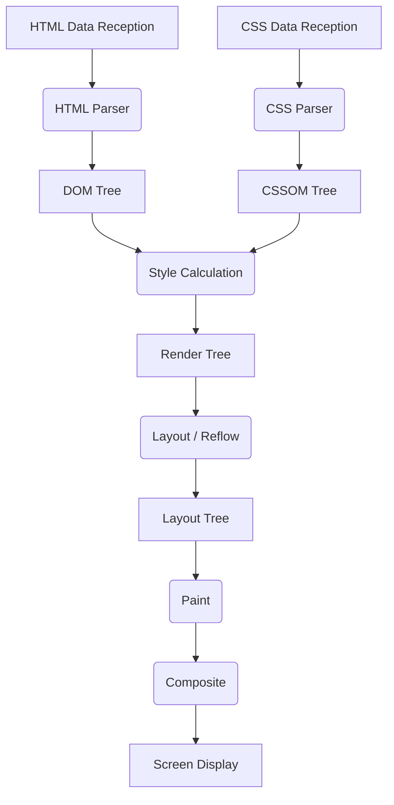
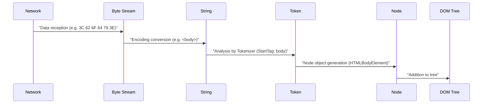
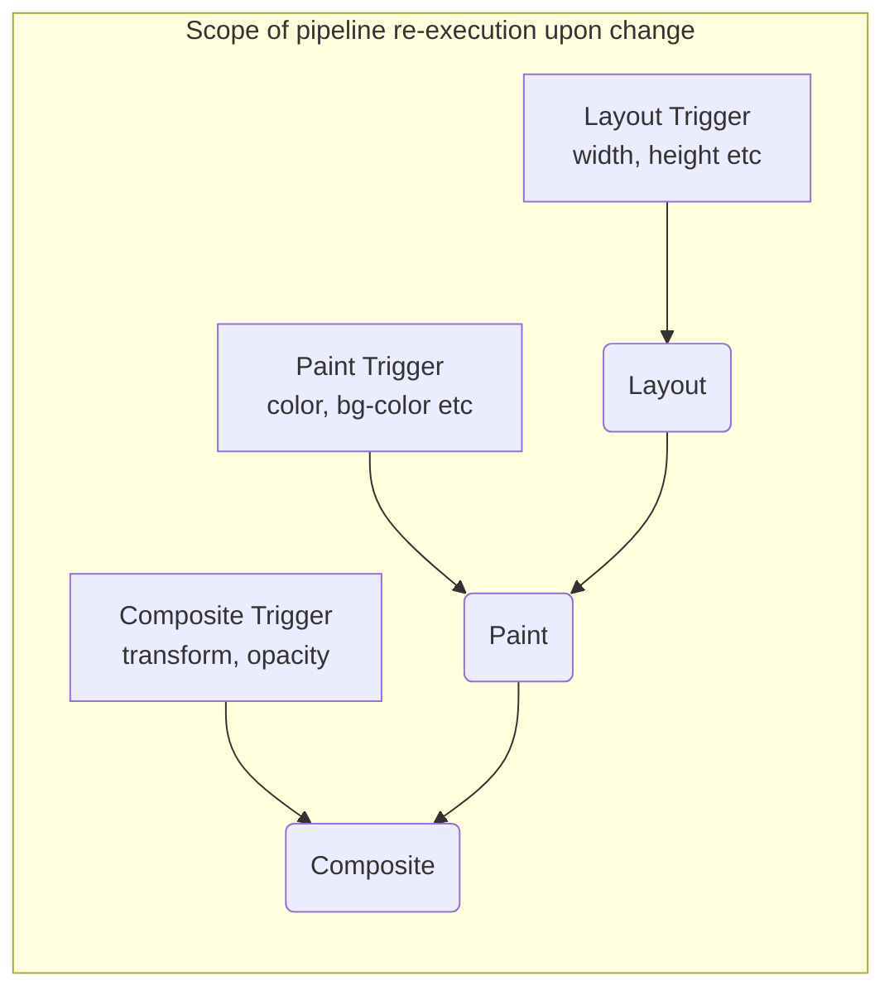

# Browser Rendering Mechanism: Complete Anatomy from DOM [Tree](https://kenji.blog/en/p/tree-graph-data-structures-search-dfs-bfs-dijkstra/) to Paint

Web browsers are one of the most familiar and complex software we use on a daily basis. From the moment a URL is entered until the page is displayed on the screen, a vast amount of calculations and processing take place internally in milliseconds. This sequence of processing is called the **Rendering [Pipeline](https://kenji.blog/en/p/cicd-pipeline-github-actions-best-practices/)** or **Critical Rendering Path**.

In this article, we will completely dissect the mechanism of how a browser (especially modern rendering engines like Blink and WebKit) interprets HTML, CSS, and JavaScript, and finally draws (Paint) them as pixels on the display.

## 1. Overview of the Rendering Pipeline

First, let's understand the overall picture of the rendering engine's processing. The main steps from when the browser receives data from the network to when it draws on the screen are as follows.



The processing steps are roughly classified into the following phases.

1. **Parsing**: Analyzes HTML and CSS to build the DOM (Document Object Model) and CSSOM (CSS Object Model).
2. **Style**: Combines the DOM and CSSOM to calculate the final styles applied to each node.
3. **Layout / Reflow**: Calculates the exact position and size (geometry information) of each element on the screen.
4. **Paint**: Generates painting instructions (Paint Records) to convert elements into pixels, and rasterizes them.
5. **Composite**: Overlays the drawn multiple layers in the correct order to generate the final screen.

Now, let's look at each step in detail.

## 2. Parsing: Construction of DOM [Tree](https://kenji.blog/en/p/tree-graph-data-structures-search-dfs-bfs-dijkstra/) and CSSOM Tree

When the browser receives a byte stream (HTML data) from the server, the rendering engine starts converting it into a data structure that humans and programs can understand.

### 2.1 HTML Parsing and DOM Tree Construction

HTML analysis is performed according to the HTML parsing algorithm defined by W3C (now WHATWG). This process can be broken down into the following four steps.

1. **Conversion**: Converts the raw data byte stream received from the network into individual characters based on the specified character encoding (e.g., UTF-8).
2. **Tokenization**: Converts strings into various "Tokens" specified by the W3C HTML5 standard. For example, start tags like `<html>` and `<body>`, end tags, attribute names, and attribute values.
3. **Lexing**: Converts the generated tokens into "Nodes" that have properties and rules.
4. **DOM [Tree](https://kenji.blog/en/p/tree-graph-data-structures-search-dfs-bfs-dijkstra/) Construction**: Links the created objects into a tree-like data structure based on the nesting relationship of the tags. This is the **DOM (Document Object Model)**.



The DOM tree completely represents the structure and content of the document. However, at this point, it does not have information on "how the elements should look".

### 2.2 CSS Parsing and CSSOM [Tree](https://kenji.blog/en/p/tree-graph-data-structures-search-dfs-bfs-dijkstra/) Construction

When the HTML parser encounters information about CSS, such as `<link>` or `<style>` tags, the CSS parsing process begins. CSS parsing also follows very similar steps to HTML, ultimately generating a tree structure called the **CSSOM (CSS Object Model)**.

Byte Stream -> String -> Token -> Node -> CSSOM

CSSOM is a structure that holds how each node in the DOM tree should be styled. A characteristic of CSS is the **Cascade**. In other words, style definitions for a certain element are inherited from parent elements or overwritten by rules with higher Specificity. Therefore, CSSOM inevitably becomes a tree structure.

If we express specificity using mathematical formulas, style priority is represented by the vector $ S = (a, b, c) $ (a is ID, b is class, c is number of tags).
When comparing, it is evaluated from the top element.
$$
\text{Specificity}(S_1, S_2) = 
\begin{cases} 
S_1 & \text{if } S_1 > S_2 \\\\
S_2 & \text{otherwise}
\end{cases}
$$

#### CSSOM Construction Blocks Rendering

An important point is that **CSS parsing is treated as a rendering-blocking resource**.
DOM construction can be done incrementally without waiting for external resources, but the browser waits for subsequent steps (Render tree construction and screen drawing) until the CSSOM is fully built.

This is because if drawing starts with an incomplete CSSOM, the screen will be redrawn every time a style is calculated, causing flickering (FOUC: Flash of Unstyled Content).

### 2.3 Parsing Blocked by JavaScript

When an HTML document contains `<script>` tags, browser behavior becomes even more complex.

When the browser's parser encounters a `<script>` tag, it **pauses (blocks)** DOM construction. Then, control shifts to the JavaScript engine, and it waits for the script to download, parse, and execute.
Why? Because JavaScript might rewrite the parsing DOM tree or the HTML itself using `document.write()` or DOM APIs.

```html
<!-- Example of DOM parsing being blocked -->
<p>This is parsed immediately</p>
<script src="heavy-script.js"></script>
<!-- This will not be parsed until heavy-script.js finishes executing -->
<p>The display of this is delayed</p>
```

#### defer and async Attributes

To avoid this rendering block and improve performance, two attributes, `defer` and `async`, are provided for the `<script>` tag.

* **async**: Downloads the script asynchronously in the background. As soon as the download is complete, it pauses HTML parsing to execute the script. Execution order is not guaranteed (executed in the order downloads finish). Suitable for independent access analytics scripts, etc.
* **defer**: Downloads the script asynchronously, but delays execution until **after HTML parsing is completely finished (just before the DOMContentLoaded event)**. Because it guarantees execution in the order they appear in the HTML, it is suitable for scripts that depend on the DOM.

```mermaid
gantt
    title Script Loading and Execution
    dateFormat  s
    axisFormat %s

    section Normal Script
    HTML Analysis       :active, a1, 0, 2s
    JS Download :crit, a2, 2s, 4s
    JS Execution         :crit, a3, 4s, 6s
    HTML Analysis Resume   :active, a4, 6s, 8s

    section async Attribute
    HTML Analysis       :active, b1, 0, 5s
    JS Download :crit, b2, 2s, 4s
    JS Execution         :crit, b3, 5s, 7s
    HTML Analysis Resume   :active, b4, 7s, 9s

    section defer Attribute
    HTML Analysis       :active, c1, 0, 6s
    JS Download :crit, c2, 1s, 4s
    JS Execution         :crit, c3, 6s, 8s
```
*(※ The actual `async` executes immediately after download completes, so it interrupts parsing.)*

## 3. Style: Construction of the Render [Tree](https://kenji.blog/en/p/tree-graph-data-structures-search-dfs-bfs-dijkstra/)

Once the DOM tree and CSSOM tree are completed, the browser combines them to build the **Render Tree** or **Style Tree**.

In this phase, it calculates which CSSOM style rules apply to each node of the DOM tree and determines the final Computed Style.

### 3.1 What is Included and Not Included in the Render Tree

The Render tree is a tree that holds visual information for **all elements to be displayed on the screen**. Therefore, it does not correspond completely one-to-one with the DOM tree.

* **Not included**:
    * Hidden elements like `<head>`, `<meta>`, `<script>`.
    * Elements (and their descendants) with `display: none;` set in CSS.
* **Included**:
    * Displayed DOM nodes.
    * Pseudo-elements (e.g., `::before`, `::after`). These do not exist in the DOM but are added to the Render tree.
    * Elements with `visibility: hidden;`. They are invisible but take up space (affecting layout), so they are included in the Render tree.

### 3.2 Complexity of Style Calculation

The process of determining which CSS rules apply to an element is a computationally expensive operation.
When the browser performs Selector Matching, it evaluates from **Right-to-Left**.

For example, suppose we have the following CSS rule:

```css
.container div .item p {
    color: red;
}
```

The browser first finds all `<p>` tags (this is the rightmost key selector). Next, it traces up the parent element tree of that `<p>` to check if an element with the class `.item` exists, then checks if there is a `div` as its parent, and further if there is a `.container` as its parent.

Why right-to-left? Because if the DOM tree becomes massive, exploring from left-to-right would force the browser to examine countless "non-matching descendant elements," causing significant performance degradation. By searching from right-to-left, target elements can be narrowed down quickly.

Therefore, overly specific or redundant selectors, as shown below, cause style calculation performance to degrade.

```css
/* Bad example: The browser needs to find all a tags and sequentially trace up to see if parents are span, li, ul, div */
div ul li span a { color: blue; }

/* Good example: Using design methodologies like BEM for flat, direct class targeting */
.nav-link { color: blue; }
```

## 4. Layout (Reflow): Element Positioning and Size Calculation

Once the Render tree (a collection of nodes with style information) is built, the next phase is **Layout**. In WebKit-based browsers, this is also called **Reflow**.

In this phase, based on the browser's Viewport (the visible area of the window), it accurately calculates **where (Position) and how large (Size)** each node in the Render tree should be placed on the screen.

### 4.1 Box Model and Flow Layout

The foundation of browser layout is the **Box Model**. Every element is calculated as a rectangular box consisting of Content, Padding, Border, and Margin.

Layout calculation typically starts from the root of the Render tree (the `<html>` element, the initial containing block) and recursively descends to child elements.

1. **Parent to Child**: The parent box determines its own width and informs child boxes of available width.
2. **Child to Parent**: The child box determines its own height (based on content) and informs the parent box. The parent box determines its final height from the sum of the child boxes' heights.

The mechanism where most of the layout is determined in a single top-to-bottom pass is called **Flow Layout** (※ tables, Flexbox/Grid, etc., may require more complex multiple passes).

### 4.2 Global Layout and Incremental Layout

There are two types of layout calculations: **Global Layout**, which recalculates the entire screen, and **Incremental Layout**, which recalculates only the modified parts.

* **Global Layout**: Triggered by resizing the window, changing device orientation, or changing the root element's font size, forcing the entire Render tree layout to be recalculated. This is a very expensive operation.
* **Incremental Layout**: When the size of some elements is changed by JavaScript, or DOM nodes are added/removed, the browser marks only those elements and potentially affected elements (siblings or parents) as "Dirty" and asynchronously recalculates only those parts. This is called the **Dirty bit system**.

### 4.3 Layout Thrashing and Performance

If you modify DOM styles via JavaScript and immediately try to read the calculated result (like height or width), the browser is forced to immediately execute the layout calculation that it was delaying for optimization (**Synchronous Layout**).

Doing this consecutively, such as in a loop, is called **Layout Thrashing**, which causes a severe performance issue that significantly degrades the frame rate.

**[Bad Code Example Causing Layout Thrashing]**

```javascript
const elements = document.querySelectorAll('.box');

// Bad example: Alternating DOM reads (offsetWidth) and writes (style.width)
for (let i = 0; i < elements.length; i++) {
    // Reading offsetWidth forces the browser to execute layout calculation
    const width = elements[i].offsetWidth;
    // Writing styles makes the DOM "Dirty"
    elements[i].style.width = width + 10 + 'px';
    // Reading offsetWidth again in the next loop causes forced layout again... (loop continues)
}
```

**[Improvement: Separating Reads and Writes (Batching)]**

```javascript
const elements = document.querySelectorAll('.box');
const widths = [];

// Good example: Phase 1 - Batch read widths of all elements (Layout happens only once)
for (let i = 0; i < elements.length; i++) {
    widths.push(elements[i].offsetWidth);
}

// Good example: Phase 2 - Batch write styles of all elements
for (let i = 0; i < elements.length; i++) {
    elements[i].style.width = widths[i] + 10 + 'px';
}
// Layout is recalculated only once together at the next browser rendering timing
```

Recently, it is common to use libraries like `FastDOM` or appropriately use `requestAnimationFrame` to batch DOM reads and writes.

## 5. Paint: Pixel Generation

Through the layout phase, the position (X, Y coordinates) and size (width, height) of each element's box have been determined. However, nothing has been drawn on the screen yet. The next step is the **Paint** phase.

The goal of the Paint phase is to take the Layout [Tree](https://kenji.blog/en/p/tree-graph-data-structures-search-dfs-bfs-dijkstra/) as input, create instructions (Paint Records) on how to paint the pixels on the screen, and finally Rasterize them.

### 5.1 Paint Order (Stacking Context)

Elements cannot simply be drawn in the order they are written in HTML. CSS has properties like `z-index`, absolute positioning (`position: absolute;`), opacity (`opacity`), and 3D transforms, which affect the overlapping order of elements (Z-axis order).

The mechanism that manages this is the **Stacking Context**.

The browser generates drawing instructions according to the strict paint order defined in the CSS 2.1 specifications. The general paint order for block elements is as follows:

1. background-color
2. background-image
3. border
4. children
5. outline

### 5.2 Paint Records and Display List

In recent modern browsers (like Chrome's Blink), the Paint phase no longer writes pixels directly to memory, but has changed to a process that generates a **Display List** of **Paint Records**.

A Paint Record is a list of specific drawing instructions such as "draw a rectangle at these coordinates with this color" or "draw this text with the specified font".

```json
// Conceptual image of a Paint Record
[
  { "action": "drawRect", "rect": [0, 0, 100, 100], "color": "blue" },
  { "action": "drawText", "text": "Hello", "pos": [10, 20], "font": "Arial" }
]
```

Why make a list? Because instead of redrawing everything every time there's a small change, it is more efficient to keep the list of drawing instructions and only update and re-execute the instructions for the parts that changed.

### 5.3 Rasterization and Multi-threading

The generated Paint Records (Display List) must be actually converted into pixels (bitmap data). This process is called **Rasterization**.

Rasterizing the entire page every time you scroll is inefficient. Therefore, the browser divides the screen into multiple small rectangular areas called **Tiles** (e.g., 256x256 pixels) to manage them.

In current versions of Chrome, rasterization is processed in parallel (Threaded Rasterization) on dedicated **Rasterizer Threads**, rather than on the main thread (where JavaScript execution and Layout occur). Furthermore, many rasterization tasks leverage hardware acceleration and run very quickly on the **GPU**.

## 6. Composite: Overlaying Layers

Once rasterization is complete and pixel data for each tile is generated (usually stored as textures in GPU memory), the final step, the **Composite** phase, begins.

In complex web pages, elements overlap each other, such as a header with a drop shadow, a fixed modal window in the foreground, or a scrolling background image. If all these elements were painted flatly onto a single canvas, every scroll or partial animation would require extensive redrawing (Paint and Rasterization), dropping performance.

Therefore, the browser divides the page into multiple independent **Graphics Layers** to manage them.

### 6.1 How Layering Works

Inside the browser, multiple tree structures are transformed:

1. **DOM [Tree](https://kenji.blog/en/p/tree-graph-data-structures-search-dfs-bfs-dijkstra/)**
2. **Layout Tree (Render Tree)**: Geometry information for visual elements
3. **Paint Tree (Layer Tree)**: Layer hierarchy based on stacking contexts, etc.
4. **Graphics Layer Tree**: Independent layers actually composited by the GPU

Elements with specific CSS properties are promoted by the browser to independent "Graphics Layers".

The main conditions (triggers) for layer generation are:

* 3D or perspective transforms (`transform: translateZ(0)`, `translate3d(...)`)
* `<video>` and `<canvas>` elements
* Elements whose opacity (`opacity`) or transform (`transform`) changes in CSS animations or transitions
* Elements with the `will-change` property specified (e.g., `will-change: transform;`)
* Elements positioned on top of an already independent layer (due to overlap)

### 6.2 Compositor Thread and Hardware Acceleration

Layer compositing takes place in a dedicated thread called the **Compositor Thread**, independent of the main thread.

The rasterized bitmap textures for each layer are transferred to the GPU. The Compositor Thread sends compositing instructions (Compositor Frame) to the GPU, like "place Layer A at X 100, Y 200, and overlay Layer B on top with 0.5 opacity". The GPU composites these images extremely fast and outputs the final screen to the display.

#### Scrolling and Animation Independent of the Main Thread

The independence of the Compositor Thread from the main thread is critical for performance.

Even if JavaScript execution takes a long time and blocks (freezes) the main thread, if the user scrolls with a mouse, the Compositor Thread only needs to slightly shift and composite the layer textures already on the GPU. This ensures that scrolling itself runs smoothly (Jank-free) even on pages with heavy JavaScript.

Animations using `transform` and `opacity` can maximize this benefit.

### 6.3 CSS Triggers: Optimizing Animation Performance

One of the most important concepts in web performance optimization is **CSS Triggers**.
When changing an element's style using JavaScript or CSS, the CSS property being changed determines from which step in the browser's rendering pipeline (Layout, Paint, or Composite) it needs to restart.

1. **Properties triggering Layout (Reflow)**
    * `width`, `height`, `margin`, `padding`, `top`, `left`, `font-size`, etc.
    * Because geometry information changes, the entire pipeline of Layout -> Paint -> Composite is re-executed. A very heavy process. Unsuitable for animations.
2. **Properties triggering Paint (Repaint)**
    * `color`, `background-color`, `box-shadow`, etc.
    * Element sizes and positions don't change, but appearance does, so Paint -> Composite is re-executed. Lighter than Layout, but still causes load due to pixel redrawing.
3. **Properties triggering only Composite**
    * `transform` (`translate`, `scale`, `rotate`)
    * `opacity`
    * These don't change element geometry or individual pixel colors. The element already exists on the GPU as an independent layer (texture), so the browser only needs to instruct the GPU to "shift the texture position and composite" (transform) or "composite semi-transparently" (opacity). Because it can completely skip the main thread's Layout and Paint, this is a **must-use technique to achieve smooth 60fps animations**.



#### Utilizing the will-change Property

`will-change` is a CSS property that allows developers to inform the browser in advance that "a specific property of this element is expected to change in the future."

```css
.animated-box {
    /* Tell the browser in advance that transform will change, forcing it to create a dedicated layer */
    will-change: transform;
    transition: transform 0.3s ease;
}
.animated-box:hover {
    transform: translateX(100px);
}
```

When the browser sees `will-change: transform`, it promotes the element to an independent layer "before" the animation starts and prepares the texture on the GPU. This prevents stutters (delays caused by Paint) exactly at the moment the animation starts upon hovering.

However, since layer creation consumes memory, applying `will-change` to all elements on a page can instead cause browser crashes or degrade performance. It is important to use it appropriately only on required elements.

## 7. Conclusion

We have taken a complete look at the "mechanism from DOM tree to Paint (and Composite)" from when a browser receives HTML to when it draws pixels on the screen.

1. **Parsing**: Parses HTML/CSS to build DOM and CSSOM. JavaScript (especially synchronous scripts) blocks this.
2. **Style**: Combines DOM and CSSOM to build a Render tree containing displayed elements and their styles.
3. **Layout**: Calculates the exact position (coordinates) and size of each element on the screen.
4. **Paint**: Creates drawing instructions (Paint Records) and rasterizes them into pixels on a dedicated thread.
5. **Composite**: Composites independent layers on the GPU and outputs the final screen.

Deeply understanding this mechanism is more than just knowledge for front-end developers.
"Why does animating `width` cause stuttering?"
"Why should `script` tags be placed right before the closing `body` tag, or use `defer`?"
"Why do Virtual DOMs like React and Vue run fast? (= Batching and minimizing DOM access and Layout/Paint)"

The answers to all of these lie within this rendering pipeline. By understanding how it works, you will be able to build web applications with higher performance and an excellent user experience.
