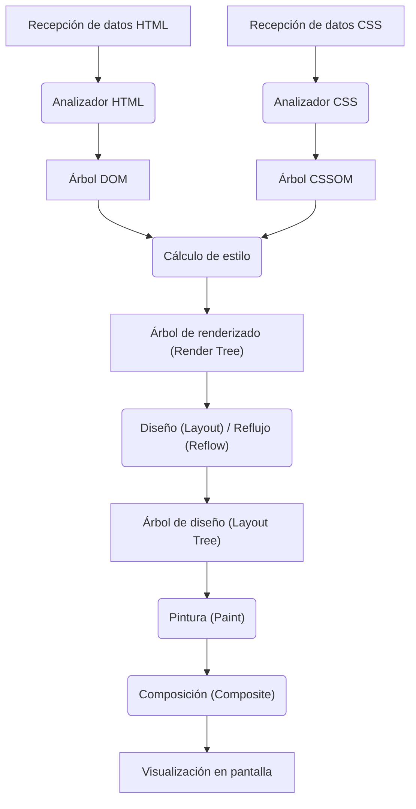
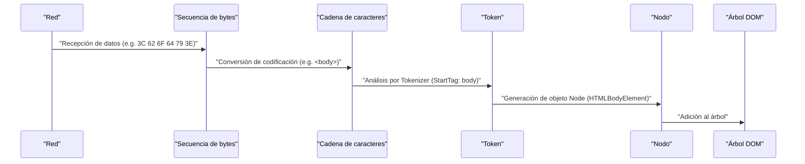
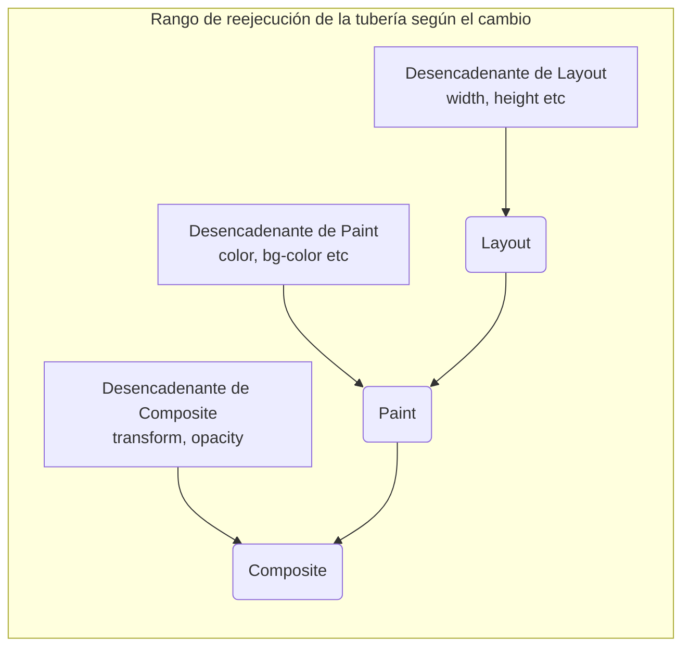

# Mecanismo de renderizado del navegador: Una anatomía completa desde el árbol DOM hasta Paint

El navegador web es uno de los programas de software más cercanos a nuestro uso diario y, al mismo tiempo, uno de los más complejos. Desde que introduces una URL hasta que la página aparece en la pantalla, internamente se llevan a cabo enormes cálculos y procesos en cuestión de milisegundos. A esta secuencia de procesamiento se le llama **Tubería de renderizado (Rendering [Pipeline](https://kenji.blog/es/p/cicd-pipeline-github-actions-best-practices/))** o **Ruta de renderizado crítica (Critical Rendering Path)**.

En este artículo, analizaremos el mecanismo completo de cómo los navegadores (especialmente los motores de renderizado modernos como Blink y WebKit) interpretan HTML, CSS y JavaScript, y finalmente los dibujan (Paint) como píxeles en la pantalla.

## 1. Visión general de la tubería de renderizado

Primero, comprendamos la visión general del procesamiento del motor de renderizado. Los pasos principales desde que el navegador recibe los datos de la red hasta que los dibuja en la pantalla son los siguientes:



Los pasos de procesamiento se clasifican a grandes rasgos en las siguientes fases:

1.  **Análisis (Parsing)** : Analiza HTML y CSS para construir el DOM (Document Object Model) y el CSSOM (CSS Object Model).
2.  **Estilo (Cálculo de estilo)** : Combina el DOM y el CSSOM, y calcula el estilo final aplicado a cada nodo.
3.  **Diseño (Layout / Reflow)** : Calcula la posición exacta y el tamaño (información geométrica) de cada elemento en la pantalla.
4.  **Pintura (Paint)** : Genera instrucciones de dibujo (Paint Records) para convertir los elementos en píxeles y los rasteriza.
5.  **Composición (Composite)** : Superpone las múltiples capas dibujadas en el orden correcto para generar la pantalla final.

Ahora, veamos cada paso en detalle.

## 2. Análisis (Parsing): Construcción del árbol DOM y el árbol CSSOM

Cuando el navegador recibe una secuencia de bytes (datos HTML) del servidor, el motor de renderizado comienza a convertirla en una estructura de datos que los humanos y los programas pueden entender.

### 2.1 Análisis de HTML y construcción del árbol DOM

El análisis de HTML se realiza de acuerdo con el algoritmo de análisis de HTML definido por el W3C (ahora WHATWG). Este proceso se puede desglosar en los siguientes 4 pasos:

1.  **Conversión (Conversion)** : Convierte la secuencia de bytes de datos sin procesar recibidos de la red en caracteres individuales (Characters) en función de la codificación de caracteres especificada (como UTF-8).
2.  **Tokenización (Tokenization)** : Convierte las cadenas de texto en varios "tokens" especificados por el estándar HTML5 del W3C. Por ejemplo, etiquetas de apertura como `<html>` , `<body>` , etiquetas de cierre, nombres y valores de atributos, etc.
3.  **Análisis léxico (Lexing)** : Convierte los tokens generados en "objetos (Nodes)" que tienen propiedades y reglas.
4.  **Construcción del árbol DOM (DOM [Tree](https://kenji.blog/es/p/tree-graph-data-structures-search-dfs-bfs-dijkstra/) Construction)** : Enlaza los objetos creados en una estructura de datos en forma de árbol basándose en la relación de anidamiento de las etiquetas. Esto es el **DOM (Modelo de Objetos del Documento)**.



El árbol DOM representa completamente la estructura y el contenido del documento. Sin embargo, en este punto, no tiene información sobre "cómo se verán los elementos".

### 2.2 Análisis de CSS y construcción del árbol CSSOM

Cuando el analizador HTML encuentra información relacionada con CSS, como las etiquetas `<link>` o `<style>`, comienza el proceso de análisis de CSS. El análisis de CSS sigue pasos muy similares a los de HTML y finalmente genera una estructura de árbol llamada **CSSOM (Modelo de Objetos de CSS)**.

Secuencia de bytes -> Cadena de caracteres -> Token -> Nodo -> CSSOM

El CSSOM es una estructura que contiene información sobre cómo debe estilizarse cada nodo del árbol DOM. Una característica de CSS es la **Cascada (Cascade)**. Es decir, las definiciones de estilo para un elemento determinado se heredan de los elementos principales o se sobrescriben por reglas con mayor especificidad (Specificity). Por lo tanto, el CSSOM es inevitablemente una estructura de árbol.

Si expresamos la especificidad usando una fórmula matemática, la prioridad del estilo se representa mediante un vector $ S = (a, b, c) $ (donde a es ID, b son clases y c es el número de etiquetas).
Al comparar, se evalúan desde el elemento superior.
$$
\text{Especificidad}(S_1, S_2) = 
\begin{cases} 
S_1 & \text{si } S_1 > S_2 \\\\
S_2 & \text{de lo contrario}
\end{cases}
$$

#### La construcción del CSSOM bloquea el renderizado

Es importante destacar que **el análisis de CSS se trata como un recurso que bloquea el renderizado**.
Mientras que la construcción del DOM se puede hacer de forma incremental (secuencial) sin esperar recursos externos, el navegador pausa los pasos siguientes (construcción del árbol de renderizado y dibujo de la pantalla) hasta que el CSSOM se construya por completo.

Esto se debe a que, si se comienza a dibujar con un CSSOM incompleto, la pantalla se volverá a dibujar cada vez que se calculen los estilos, lo que provocará parpadeos (FOUC: Flash of Unstyled Content).

### 2.3 Bloqueo del análisis por JavaScript

Si el HTML contiene etiquetas `<script>`, el comportamiento del navegador se vuelve aún más complejo.

Cuando el analizador del navegador encuentra una etiqueta `<script>`, **pausa (bloquea)** la construcción del DOM. Luego, transfiere el control al motor de JavaScript y espera a que se complete la descarga, el análisis y la ejecución del script.
¿Por qué? Porque JavaScript puede modificar el árbol DOM que se está analizando o el HTML mismo utilizando `document.write()` o la API del DOM.

```html
<!-- Ejemplo de bloqueo del análisis del DOM -->
<p>Esto se analiza de inmediato</p>
<script src="heavy-script.js"></script>
<!-- Hasta que termine la ejecución de heavy-script.js, esto no se analiza -->
<p>La visualización de esto se retrasará</p>
```

#### Atributos defer y async

Para evitar este bloqueo de renderizado y mejorar el rendimiento, la etiqueta `<script>` cuenta con dos atributos: `defer` y `async`.

*   **async** : Descarga el script de forma asíncrona en segundo plano. Una vez que se completa la descarga, pausa el análisis de HTML y ejecuta el script. No se garantiza el orden de ejecución (se ejecutan primero los que se descargan primero). Adecuado para scripts de análisis de acceso sin dependencias.
*   **defer** : Descarga el script de forma asíncrona, pero retrasa su ejecución **hasta después de que el análisis de HTML haya finalizado por completo (justo antes del evento DOMContentLoaded)**. Se garantiza que se ejecutarán en el orden escrito en el HTML, por lo que es adecuado para scripts que dependen del DOM.

```mermaid
gantt
    title "Carga y ejecución de scripts"
    dateFormat  s
    axisFormat %s

    section "Scripts normales"
    "Análisis HTML"       :active, a1, 0, 2s
    "Descarga JS"         :crit, a2, 2, 4s
    "Ejecución JS"        :crit, a3, 4, 6s
    "Reanudación de análisis HTML" :active, a4, 6, 8s

    section "Atributo async"
    "Análisis HTML"       :active, b1, 0, 5s
    "Descarga JS"         :crit, b2, 2, 4s
    "Ejecución JS"        :crit, b3, 5, 7s
    "Reanudación de análisis HTML" :active, b4, 7, 9s

    section "Atributo defer"
    "Análisis HTML"       :active, c1, 0, 6s
    "Descarga JS"         :crit, c2, 1, 4s
    "Ejecución JS"        :crit, c3, 6, 8s
```


*(※Dado que `async` se ejecuta inmediatamente después de que se completa la descarga en realidad, interrumpe el análisis.)*

## 3. Estilo (Cálculo de estilo): Construcción del árbol de renderizado

Una vez completados el árbol DOM y el árbol CSSOM, el navegador los combina para construir el **Árbol de renderizado (Render [Tree](https://kenji.blog/es/p/tree-graph-data-structures-search-dfs-bfs-dijkstra/))** o **Árbol de estilos (Style Tree)**.

En esta fase, se calcula qué reglas de estilo del CSSOM se aplicarán a cada nodo del árbol DOM, y se determinan los estilos calculados finales (Computed Style).

### 3.1 Qué se incluye y qué no en el árbol de renderizado

El árbol de renderizado es un árbol que contiene información visual sobre **todos los elementos que se mostrarán en la pantalla**. Por lo tanto, no se corresponde de forma estrictamente 1 a 1 con el árbol DOM.

*   **Lo que no se incluye** :
    *   Elementos ocultos como `<head>` , `<meta>` , `<script>`.
    *   Elementos a los que se les ha asignado `display: none;` en CSS (y sus elementos descendientes).
*   **Lo que se incluye** :
    *   Nodos del DOM visibles.
    *   Pseudoelementos (`::before` , `::after`, etc.). Estos no existen en el DOM, pero se añaden al árbol de renderizado.
    *   Elementos con `visibility: hidden;`. No son visibles, pero ocupan espacio (afectan al diseño), por lo que se incluyen en el árbol de renderizado.

### 3.2 La complejidad del cálculo de estilos

El proceso de determinar qué reglas CSS se aplican a un elemento es un procesamiento computacionalmente muy costoso.
Cuando el navegador compara los selectores (Selector Matching), evalúa **de derecha a izquierda (Right-to-Left)**.

Por ejemplo, supongamos que tenemos la siguiente regla CSS:

```css
.container div .item p {
    color: red;
}
```

El navegador primero encuentra todas las etiquetas `<p>` (este es el selector clave más a la derecha). Luego, recorre el árbol de elementos principales de cada `<p>`, verifica si existe un elemento con la clase `.item`, verifica si su elemento principal tiene un `div`, y verifica si su elemento principal tiene un `.container`.

¿Por qué de derecha a izquierda? Porque si el árbol DOM se vuelve enorme, buscar de izquierda a derecha resultaría en la exploración de innumerables "elementos descendientes que no coinciden", lo que degradaría significativamente el rendimiento. Al explorar de derecha a izquierda, se pueden acotar rápidamente los elementos objetivo.

Por lo tanto, los selectores demasiado específicos o redundantes como el siguiente son causas de la degradación del rendimiento del cálculo de estilos.

```css
/* Mal ejemplo: El navegador necesita verificar todas las etiquetas 'a' y recorrer sucesivamente si sus padres son span, li, ul y div */
div ul li span a { color: blue; }

/* Buen ejemplo: Usar metodologías de diseño como BEM y especificar las clases directamente y de forma plana */
.nav-link { color: blue; }
```

## 4. Diseño (Layout / Reflow): Posicionamiento y cálculo de tamaño de los elementos

Una vez construido el árbol de renderizado (un conjunto de nodos con información de estilo), la siguiente fase es el **Diseño (Layout)**. En los navegadores basados en WebKit, esto a veces se denomina **Reflujo (Reflow)**.

En esta fase, en función del tamaño del Viewport del navegador (el área de visualización de la ventana), se calcula con precisión **dónde (Position)** y con **qué tamaño (Size)** deben colocarse en la pantalla cada uno de los nodos del árbol de renderizado.

### 4.1 Modelo de caja (Box Model) y diseño de flujo (Flow Layout)

La base del diseño del navegador es el **Modelo de caja (Box Model)**. Todos los elementos se calculan como cajas rectangulares que tienen contenido (Content), relleno (Padding), borde (Border) y margen (Margin).

Los cálculos de diseño generalmente comienzan desde la raíz del árbol de renderizado (el elemento `<html>`, el bloque de contención inicial) y descienden recursivamente a los elementos secundarios.

1.  **De padre a hijo** : La caja padre determina su propio ancho e informa a las cajas hijas del ancho disponible.
2.  **De hijo a padre** : La caja hija determina su propia altura (basada en el contenido) y se la informa a la caja padre. La caja padre determina su altura final a partir de la suma de las alturas de las cajas hijas.

El mecanismo en el que la mayor parte del diseño se determina en un solo paso de arriba hacia abajo se denomina **Diseño de flujo (Flow Layout)** (※Las tablas, Flexbox/Grid, etc., pueden requerir múltiples pasos más complejos).

### 4.2 Diseño global y diseño incremental

Hay dos tipos de cálculos de diseño: **Diseño global**, que recalcula toda la pantalla, y **Diseño incremental**, que recalcula solo las partes que han cambiado.

*   **Diseño global** : Cuando se redimensiona la ventana, se cambia la orientación del dispositivo o se cambia el tamaño de fuente del elemento raíz, se vuelve a calcular el diseño de todo el árbol de renderizado. Este es un proceso muy costoso.
*   **Diseño incremental** : Cuando JavaScript cambia el tamaño de algunos elementos o se añaden/eliminan nodos del DOM, el navegador marca solo ese elemento y los elementos que pueden verse afectados (elementos hermanos o padres) como "Sucios (Dirty)" y recalcula solo esa parte de forma asíncrona. A esto se le llama **Sistema de bit sucio (Dirty bit system)**.

### 4.3 Sacudida de diseño (Layout Thrashing) y rendimiento

Si modificas el estilo del DOM con JavaScript e intentas leer inmediatamente el resultado de ese cálculo (como la altura o el ancho), el navegador se verá obligado a ejecutar **de forma forzada e inmediata (Synchronous Layout)** el cálculo de diseño que había retrasado para su optimización.

Hacer esto repetidamente dentro de un bucle se conoce como **Sacudida de diseño (Layout Thrashing)** y causa problemas de rendimiento graves que reducen drásticamente la velocidad de fotogramas.

**【Mal ejemplo de código que causa Layout Thrashing】**

```javascript
const elements = document.querySelectorAll('.box');

// Mal ejemplo: Se alternan la lectura del DOM (offsetWidth) y la escritura (style.width)
for (let i = 0; i < elements.length; i++) {
    // Para leer el offsetWidth, el navegador ejecuta un cálculo de diseño forzado
    const width = elements[i].offsetWidth;
    // Al escribir un estilo, el DOM se marca como "Sucio (Dirty)"
    elements[i].style.width = width + 10 + 'px';
    // Al volver a leer el offsetWidth en el siguiente ciclo, se vuelve a producir un diseño forzado... (y así sucesivamente)
}
```

**【Solución: Separación de lectura y escritura (Batching)】**

```javascript
const elements = document.querySelectorAll('.box');
const widths = [];

// Buen ejemplo: Fase 1 - Leer el ancho de todos los elementos a la vez (el diseño solo ocurre una vez)
for (let i = 0; i < elements.length; i++) {
    widths.push(elements[i].offsetWidth);
}

// Buen ejemplo: Fase 2 - Escribir los estilos de todos los elementos a la vez
for (let i = 0; i < elements.length; i++) {
    elements[i].style.width = widths[i] + 10 + 'px';
}
// En el próximo momento de dibujo del navegador, el diseño se recalculará una sola vez para todos.
```

Hoy en día, es común usar bibliotecas como `FastDOM` o utilizar `requestAnimationFrame` de manera adecuada para agrupar las operaciones de lectura y escritura del DOM en lotes.

## 5. Pintura (Paint): Generación de píxeles

Con la fase de diseño, se han determinado la posición (coordenadas X, Y) y el tamaño (ancho, altura) de la caja de cada elemento. Sin embargo, aún no se ha dibujado nada en la pantalla. A continuación tiene lugar la fase de **Pintura (Paint)**.

El objetivo de la fase de pintura es tomar el árbol de diseño (Layout [Tree](https://kenji.blog/es/p/tree-graph-data-structures-search-dfs-bfs-dijkstra/)) como entrada, crear instrucciones sobre cómo pintar los píxeles en la pantalla (Paint Records) y, finalmente, rasterizarlos (Rasterization).

### 5.1 Orden de pintura (Stacking Context)

No se trata simplemente de dibujar los elementos en el orden exacto en el que están escritos en el HTML. CSS tiene propiedades como `z-index`, posicionamiento absoluto (`position: absolute;`), opacidad (`opacity`), transformaciones 3D, etc., que afectan al orden en el que se superponen los elementos (el orden en el eje Z).

El mecanismo que gestiona esto es el **Contexto de apilamiento (Stacking Context)**.

El navegador genera instrucciones de dibujo siguiendo un orden de pintura estricto definido en la especificación de CSS 2.1. El orden de pintura de un elemento de bloque general es el siguiente:

1.  background-color (Color de fondo)
2.  background-image (Imagen de fondo)
3.  border (Borde)
4.  children (Dibujo de los elementos secundarios)
5.  outline (Contorno)

### 5.2 Registros de pintura (Paint Records) y Lista de visualización (Display List)

En los navegadores modernos recientes (como Blink de Chrome), la fase de pintura ya no escribe los píxeles directamente en la memoria, sino que ha cambiado a un proceso que genera una lista (Display List) de **Registros de pintura (Paint Records)**.

Un Paint Record es una lista de instrucciones de dibujo específicas, como "dibuja un rectángulo de este color en estas coordenadas" o "dibuja este texto con la fuente especificada".

```json
// Imagen conceptual de un Paint Record
[
  { "action": "drawRect", "rect": [0, 0, 100, 100], "color": "blue" },
  { "action": "drawText", "text": "Hello", "pos": [10, 20], "font": "Arial" }
]
```

¿Por qué se crea una lista? Porque es más eficiente mantener una lista de instrucciones de dibujo y actualizar/volver a ejecutar solo las instrucciones de las partes que han cambiado, en lugar de redibujar todo cada vez que hay un pequeño cambio.

### 5.3 Rasterización (Rasterization) y multiprocesamiento

Los Paint Records (Display List) generados deben convertirse realmente en píxeles (datos de mapa de bits). Este proceso se denomina **Rasterización (Rasterization)**.

Rasterizar toda la página cada vez que se hace scroll es ineficiente. Por lo tanto, el navegador divide y gestiona la pantalla en múltiples áreas rectangulares pequeñas llamadas **Teselas (Tiles)** (por ejemplo, de 256x256 píxeles).

En navegadores como el Chrome actual, la rasterización no se realiza en el hilo principal (el hilo donde se ejecutan JavaScript y el Layout), sino que se procesa en paralelo mediante **Hilos rasterizadores (Rasterizer Threads)** dedicados (Threaded Rasterization). Además, gran parte del trabajo de rasterización aprovecha la aceleración de hardware y se ejecuta a alta velocidad en la **GPU**.

## 6. Composición (Composite): Superposición de capas

Una vez completada la rasterización y generados los datos de píxeles de cada tesela (normalmente guardados como texturas en la memoria de la GPU), se entra en el último paso: la fase de **Composición (Composite)**.

En las páginas web complejas, los elementos se superponen entre sí, como encabezados con sombras paralelas, ventanas modales fijadas al frente o imágenes de fondo que se desplazan. Si todos estos elementos se pintaran planos en un solo lienzo, cada vez que se hiciera scroll o se ejecutara alguna animación se requeriría un redibujado de un área amplia (Paint y Rasterization), lo que degradaría el rendimiento.

Por ello, el navegador divide y gestiona la página en múltiples **Capas (Graphics Layers)** independientes.

### 6.1 Mecanismo de las capas

Dentro del navegador, se transforman múltiples estructuras de árbol.

1.  **DOM [Tree](https://kenji.blog/es/p/tree-graph-data-structures-search-dfs-bfs-dijkstra/)**
2.  **Layout Tree (Render Tree)** : Información geométrica de los elementos visuales.
3.  **Paint Tree (Layer Tree)** : Estructura jerárquica de las capas basada en el contexto de apilamiento, etc.
4.  **Graphics Layer Tree** : Grupo de capas independientes que se componen realmente en la GPU.

Los elementos con propiedades CSS específicas son promovidos (Promote) a "Capas Gráficas (Graphics Layers)" independientes por el navegador.

Las principales condiciones (desencadenantes) para la creación de una capa son las siguientes:

*   Transformaciones 3D o de perspectiva (`transform: translateZ(0)` , `translate3d(...)`)
*   Elementos `<video>` o `<canvas>`
*   Animaciones o transiciones CSS que cambian la opacidad (`opacity`) o la transformación (`transform`)
*   Elementos con la propiedad `will-change` (ej.: `will-change: transform;`)
*   Elementos que ya están superpuestos a una capa independiente (por motivos de superposición)

### 6.2 El hilo del compositor y la aceleración de hardware

La composición de capas se realiza en un hilo dedicado llamado **Hilo del compositor (Compositor Thread)**, que es independiente del hilo principal.

Las texturas de mapa de bits rasterizadas de cada capa se transfieren a la GPU. El hilo del compositor envía instrucciones de composición (Compositor Frame) a la GPU, como "Coloca la capa A en la coordenada X 100, Y 200, y superpón la capa B encima con una opacidad de 0.5". La GPU compone estas imágenes a una velocidad extrema y envía la pantalla final a la pantalla.

#### Scroll y animaciones independientes del hilo principal

El hecho de que el hilo del compositor sea independiente del hilo principal es sumamente importante para el rendimiento.

Incluso si la ejecución de JavaScript lleva mucho tiempo y el hilo principal se bloquea (se congela), si el usuario hace scroll con el ratón, el hilo del compositor solo necesita desplazar ligeramente las texturas de las capas que ya están en la GPU y combinarlas. Gracias a esto, incluso en páginas donde el JavaScript es pesado, el scroll en sí funciona con fluidez (sin saltos, Jank-free).

Donde mejor se aprovecha esto es en las animaciones con `transform` y `opacity`.

### 6.3 CSS Trigger: Optimización del rendimiento de las animaciones

Uno de los conceptos más importantes en la optimización del rendimiento web son los **CSS Triggers (Desencadenantes CSS)**.
Cuando cambias el estilo de un elemento mediante JavaScript o CSS, desde qué paso de la tubería de renderizado del navegador debes comenzar de nuevo (desde Layout, desde Paint o desde Composite) dependerá de la propiedad que estés modificando.

1.  **Propiedades que desencadenan Diseño (Layout / Reflow)**
    *   `width` , `height` , `margin` , `padding` , `top` , `left` , `font-size`, etc.
    *   Debido a que la información geométrica cambia, vuelve a ejecutar toda la tubería: Layout → Paint → Composite. Es un procesamiento muy pesado y no es adecuado para animaciones.
2.  **Propiedades que desencadenan Pintura (Paint / Repaint)**
    *   `color` , `background-color` , `box-shadow`, etc.
    *   El tamaño y la posición de los elementos no cambian, pero su apariencia sí, por lo que se vuelven a ejecutar Paint → Composite. Es más ligero que Layout, pero aún supone una carga porque implica repintar píxeles.
3.  **Propiedades que desencadenan SOLO Composición (Composite)**
    *   `transform` (`translate` , `scale` , `rotate`)
    *   `opacity`
    *   Estas no cambian la geometría del elemento ni el color de píxeles individuales. Dado que el elemento ya existe en la GPU como una capa independiente (textura), el navegador solo tiene que indicar a la GPU: "Desplaza la posición de la textura y combínala (transform)" o "Combínala con semitransparencia (opacity)". Puede omitir por completo el Layout y el Paint del hilo principal, por lo que es **una técnica indispensable para lograr animaciones fluidas a 60 fps**.



#### Uso de la propiedad will-change

`will-change` es una propiedad CSS que permite a los desarrolladores notificar al navegador con antelación: "Esta propiedad específica de este elemento cambiará en el futuro".

```css
.animated-box {
    /* Notifica al navegador con antelación que transform cambiará, forzando la creación de una capa dedicada */
    will-change: transform;
    transition: transform 0.3s ease;
}
.animated-box:hover {
    transform: translateX(100px);
}
```

Cuando el navegador ve `will-change: transform`, promueve ese elemento a una capa independiente "antes" de que comience la animación, y prepara la textura en la GPU. Esto previene los tirones (retrasos debidos a Paint) en el momento en que realmente se pasa el ratón y comienza la animación.

Sin embargo, crear capas consume memoria, por lo que si aplicas `will-change` a todos los elementos de la página, es probable que el navegador se bloquee o que el rendimiento se degrade. Es importante usarlo de forma adecuada solo en los elementos que lo necesitan.

## 7. Conclusión

Hemos repasado el "Mecanismo completo desde el árbol DOM hasta Paint (y Composite)", que abarca desde que el navegador recibe el HTML hasta que dibuja los píxeles en la pantalla.

1.  **Parsing** : Analiza HTML/CSS y construye el DOM y CSSOM. JavaScript (especialmente los scripts síncronos) bloquea este proceso.
2.  **Style** : Combina DOM y CSSOM, y construye el árbol de renderizado, que contiene los elementos a mostrar y sus estilos.
3.  **Layout** : Calcula la posición exacta (coordenadas) y el tamaño de cada elemento en la pantalla.
4.  **Paint** : Crea instrucciones de dibujo (Paint Records) y rasteriza a píxeles en un hilo dedicado.
5.  **Composite** : Compone las capas independientes en la GPU y produce la pantalla final.

Comprender este mecanismo a fondo va más allá de tener mero conocimiento para un desarrollador frontend.
"¿Por qué se traba la animación si uso `width`?"
"¿Por qué debo colocar las etiquetas `script` justo antes del cierre del `body` o usar `defer`?"
"¿Por qué son tan rápidos los DOM virtuales como React o Vue? (= Agrupamiento y minimización del acceso al DOM y Layout/Paint)"

Las respuestas a todas estas preguntas residen en esta tubería de renderizado. Al conocer su funcionamiento, serás capaz de construir aplicaciones web con un rendimiento mucho mayor y una experiencia de usuario excepcional.
