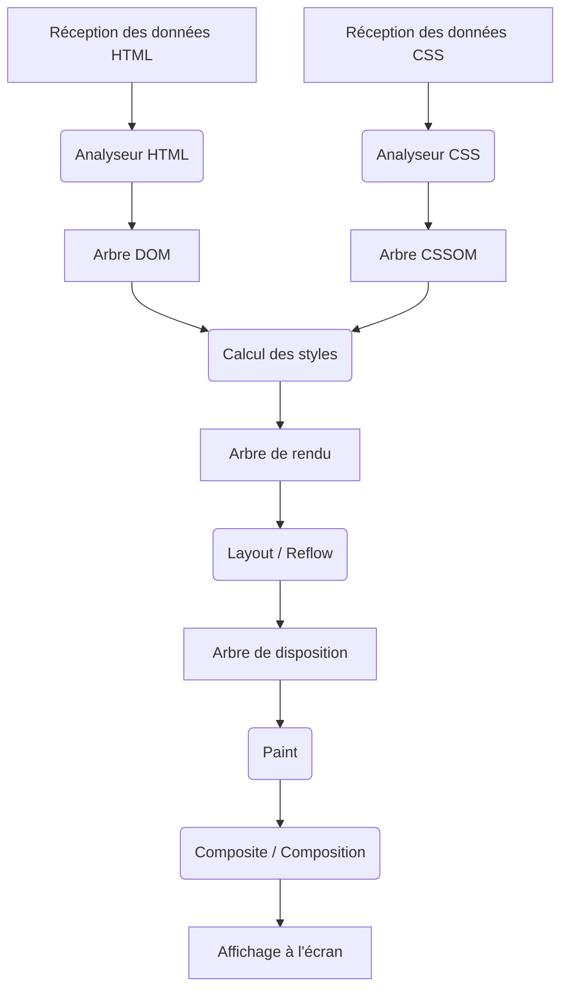
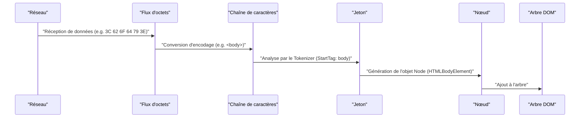
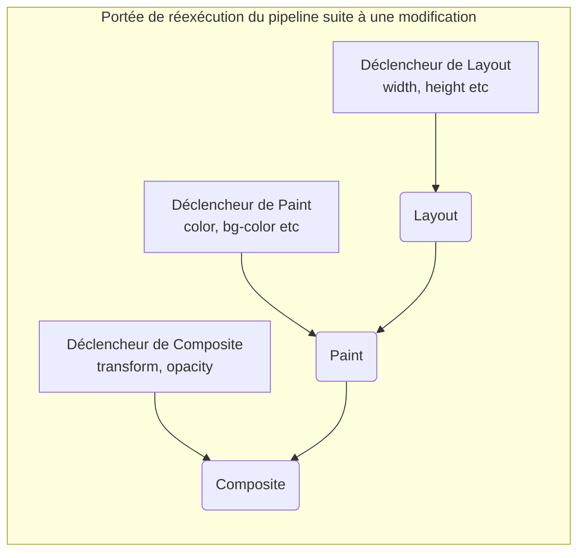

# Mécanisme de rendu du navigateur : Anatomie complète de l'arbre DOM jusqu'au Paint

Le navigateur web est l'un des logiciels les plus familiers et les plus complexes que nous utilisons quotidiennement. Depuis la saisie d'une URL jusqu'à l'affichage de la page à l'écran, une quantité massive de calculs et de traitements est effectuée en quelques millisecondes en interne. Cette série d'étapes de traitement est appelée le **[Pipeline](https://kenji.blog/fr/p/cicd-pipeline-github-actions-best-practices/) de rendu (Rendering Pipeline)** ou le **Chemin critique de rendu (Critical Rendering Path)**.

Dans cet article, nous allons disséquer le mécanisme complet de la façon dont le navigateur (en particulier les moteurs de rendu modernes tels que Blink et WebKit) interprète le HTML, CSS et JavaScript, pour finalement les dessiner (Paint) en tant que pixels sur l'écran.

## 1. Vue d'ensemble du pipeline de rendu

Commençons par saisir la vue d'ensemble du traitement du moteur de rendu. Les étapes principales, depuis le moment où le navigateur reçoit les données du réseau jusqu'à l'affichage à l'écran, sont les suivantes.



Les étapes du processus peuvent être globalement classées dans les phases suivantes :

1.  **Parsing (Analyse)** : Analyser le HTML et le CSS pour construire le DOM (Document Object Model) et le CSSOM (CSS Object Model).
2.  **Style (Calcul des styles)** : Combiner le DOM et le CSSOM pour calculer les styles finaux appliqués à chaque nœud.
3.  **Layout (Disposition / Reflow)** : Calculer la position et la taille exactes (informations géométriques) de chaque élément à l'écran.
4.  **Paint (Peinture / Dessin)** : Générer des instructions de dessin (Paint Records) pour convertir les éléments en pixels et les pixelliser (Rasterize).
5.  **Composite (Composition)** : Superposer les multiples calques dessinés dans le bon ordre pour générer l'écran final.

Examinons maintenant chaque étape en détail.

## 2. Parsing (Analyse) : Construction de l'arbre DOM et de l'arbre CSSOM

Lorsque le navigateur reçoit une séquence d'octets (données HTML) du serveur, le moteur de rendu commence à la convertir en une structure de données compréhensible par les humains et les programmes.

### 2.1 Analyse du HTML et construction de l'arbre DOM

L'analyse du HTML s'effectue selon l'algorithme d'analyse HTML défini par le W3C (actuellement WHATWG). Ce processus peut être décomposé en 4 étapes suivantes.

1.  **Conversion** : Convertit la séquence d'octets bruts reçue du réseau en caractères individuels en fonction de l'encodage de caractères spécifié (par exemple, UTF-8).
2.  **Tokenization (Analyse lexicale)** : Convertit la chaîne en divers "jetons (Tokens)" définis par la norme W3C HTML5. Par exemple, les balises de début telles que `<html>` , `<body>` , les balises de fin, les noms et les valeurs d'attributs.
3.  **Lexing (Analyse syntaxique)** : Convertit les jetons générés en "objets (Nodes)" ayant des propriétés et des règles.
4.  **DOM [Tree](https://kenji.blog/fr/p/tree-graph-data-structures-search-dfs-bfs-dijkstra/) Construction (Construction de l'arbre)** : Relie les objets créés dans une structure de données arborescente en fonction de la relation d'imbrication des balises. C'est le **DOM (Document Object Model)**.



L'arbre DOM représente entièrement la structure et le contenu du document. Cependant, à ce stade, il ne contient pas d'informations sur "l'apparence des éléments".

### 2.2 Analyse du CSS et construction de l'arbre CSSOM

Lorsque l'analyseur HTML trouve des informations relatives au CSS, telles qu'une balise `<link>` ou `<style>` , le processus d'analyse du CSS commence. L'analyse du CSS suit des étapes très similaires à celles du HTML et génère finalement une structure arborescente appelée **CSSOM (CSS Object Model)**.

[Flux](https://kenji.blog/fr/p/state-management-history-redux-context-recoil-zustand/) d'octets -> Chaîne de caractères -> Jeton -> Nœud -> CSSOM

Le CSSOM est une structure qui conserve la façon dont chaque nœud de l'arbre DOM doit être stylisé. Le CSS se caractérise par la **Cascade**. En d'autres termes, les définitions de style pour un élément sont héritées de l'élément parent, ou écrasées par des règles d'une spécificité plus élevée (Specificity). Par conséquent, le CSSOM devient naturellement une structure arborescente.

Si l'on exprime la spécificité à l'aide d'une formule, la priorité du style est représentée par le vecteur $ S = (a, b, c) $ (a est le nombre d'ID, b les classes, c les balises).
Lors de la comparaison, les éléments supérieurs sont évalués en premier.
$$
\text{Spécificité}(S_1, S_2) = 
\begin{cases} 
S_1 & \text{si } S_1 > S_2 \\\\
S_2 & \text{sinon}
\end{cases}
$$

#### La construction du CSSOM bloque le rendu

Un point important est que **l'analyse du CSS est traitée comme une ressource bloquant le rendu**.
La construction du DOM peut être effectuée de manière incrémentielle (séquentielle) sans attendre de ressources externes, mais le navigateur attend que le CSSOM soit complètement construit avant de passer aux étapes suivantes (construction de l'arbre de rendu et dessin de l'écran).

En effet, si le dessin commence avec un CSSOM incomplet, l'écran sera redessiné chaque fois que les styles seront calculés, ce qui provoquera un scintillement (FOUC: Flash of Unstyled Content).

### 2.3 Blocage de l'analyse par JavaScript

Si le HTML contient une balise `<script>` , le comportement du navigateur devient encore plus complexe.

Lorsque l'analyseur du navigateur rencontre une balise `<script>` , il **met en pause (bloque)** la construction du DOM. Le contrôle passe ensuite au moteur JavaScript, qui attend que le script soit téléchargé, analysé et exécuté.
Pourquoi cela ? Parce que JavaScript peut réécrire l'arbre DOM en cours d'analyse ou le HTML lui-même en utilisant `document.write()` ou l'API DOM.

```html
<!-- Exemple de blocage de l'analyse du DOM -->
<p>Ceci est analysé immédiatement</p>
<script src="heavy-script.js"></script>
<!-- Jusqu'à ce que heavy-script.js ait fini de s'exécuter, ceci ne sera pas analysé -->
<p>L'affichage de ceci sera retardé</p>
```

#### Attributs defer et async

Pour éviter ce blocage de rendu et améliorer les performances, deux attributs, `defer` et `async` , sont fournis pour la balise `<script>` .

*   **async** : Télécharge le script de manière asynchrone en arrière-plan. Une fois le téléchargement terminé, l'analyse HTML est mise en pause et le script est exécuté. L'ordre d'exécution n'est pas garanti (celui qui a terminé le téléchargement en premier est exécuté). Convient pour les scripts d'analyse d'accès sans dépendances.
*   **defer** : Télécharge le script de manière asynchrone, mais retarde son exécution **jusqu'à ce que l'analyse HTML soit complètement terminée (juste avant l'événement DOMContentLoaded)**. Étant donné qu'il est garanti qu'ils s'exécutent dans l'ordre de leur description dans le HTML, cela convient pour les scripts qui dépendent du DOM.

```mermaid
gantt
    title "Chargement et exécution des scripts"
    dateFormat  s
    axisFormat %s

    section "Scripts normaux"
    "Analyse HTML"       :active, a1, 0, 2s
    "Téléchargement JS" :crit, a2, 2s, 4s
    "Exécution JS"         :crit, a3, 4s, 6s
    "Reprise de l'analyse HTML"   :active, a4, 6s, 8s

    section "Attribut async"
    "Analyse HTML"       :active, b1, 0, 5s
    "Téléchargement JS" :crit, b2, 2s, 4s
    "Exécution JS"         :crit, b3, 5s, 7s
    "Reprise de l'analyse HTML"   :active, b4, 7s, 9s

    section "Attribut defer"
    "Analyse HTML"       :active, c1, 0, 6s
    "Téléchargement JS" :crit, c2, 1s, 4s
    "Exécution JS"         :crit, c3, 6s, 8s
```
*(※ L'`async` réel interrompt l'analyse, car il s'exécute immédiatement après la fin du téléchargement.)*

## 3. Style (Calcul des styles) : Construction de l'arbre de rendu

Une fois l'arbre DOM et l'arbre CSSOM terminés, le navigateur les combine pour construire **l'arbre de rendu (Render [Tree](https://kenji.blog/fr/p/tree-graph-data-structures-search-dfs-bfs-dijkstra/))** ou **l'arbre de styles (Style Tree)**.

Dans cette phase, il calcule quelles règles de style du CSSOM s'appliquent à chaque nœud de l'arbre DOM et détermine le style calculé final (Computed Style).

### 3.1 Ce qui est inclus et ce qui ne l'est pas dans l'arbre de rendu

L'arbre de rendu est un arbre qui contient les informations visuelles de **tous les éléments affichés à l'écran**. Par conséquent, il ne correspond pas toujours de 1 à 1 avec l'arbre DOM.

*   **Ce qui n'est pas inclus** :
    *   Éléments non affichés tels que `<head>` , `<meta>` , `<script>` .
    *   Éléments (et leurs descendants) ayant `display: none;` défini dans le CSS.
*   **Ce qui est inclus** :
    *   Nœuds DOM affichés.
    *   Pseudo-éléments ( `::before` , `::after` , etc.). Bien qu'ils n'existent pas dans le DOM, ils sont ajoutés à l'arbre de rendu.
    *   Éléments avec `visibility: hidden;` . Ils sont invisibles mais sont inclus dans l'arbre de rendu car ils occupent de l'espace (et affectent donc la disposition).

### 3.2 Complexité du calcul des styles

Le processus pour déterminer quelles règles CSS s'appliquent à un élément est très coûteux en calcul.
Lorsque le navigateur fait correspondre les sélecteurs (Selector Matching), il évalue **de droite à gauche (Right-to-Left)**.

Par exemple, supposons la règle CSS suivante.

```css
.container div .item p {
    color: red;
}
```

Le navigateur trouve d'abord toutes les balises `<p>` (c'est le sélecteur clé le plus à droite). Ensuite, il remonte l'arbre parent de ces `<p>` et vérifie s'il existe un élément dont la classe est `.item` , et ainsi de suite pour vérifier si son parent est un `div` , et son parent un `.container` .

Pourquoi de droite à gauche ? Si l'arbre DOM devient énorme, l'exploration de gauche à droite amènerait à explorer d'innombrables "éléments descendants qui ne correspondent pas", ce qui réduirait considérablement les performances. En explorant de droite à gauche, on peut rapidement réduire les éléments cibles.

Par conséquent, les sélecteurs trop spécifiques ou redondants comme ci-dessous réduiront les performances de calcul des styles.

```css
/* Mauvais exemple : le navigateur doit examiner toutes les balises a et vérifier leurs parents span, li, ul, div un par un */
div ul li span a { color: blue; }

/* Bon exemple : utiliser des méthodes de conception comme BEM pour spécifier directement les classes d'une manière plate */
.nav-link { color: blue; }
```

## 4. Layout (Disposition / Reflow) : Calcul de la position et de la taille des éléments

Une fois l'arbre de rendu (un ensemble de nœuds ayant des informations de style) construit, la phase suivante est **le Layout (Disposition)**. Dans les navigateurs de type WebKit, on l'appelle parfois **Reflow**.

Dans cette phase, le navigateur calcule précisément **où (Position)** et avec **quelle taille (Size)** chaque nœud de l'arbre de rendu doit être placé à l'écran par rapport à la taille du Viewport (la zone d'affichage de la fenêtre) du navigateur.

### 4.1 Modèle de boîte et [Flux](https://kenji.blog/fr/p/state-management-history-redux-context-recoil-zustand/) de disposition

La base de la disposition du navigateur est le **modèle de boîte (Box Model)**. Tous les éléments sont calculés comme des boîtes rectangulaires ayant un contenu (Content), un remplissage (Padding), une bordure (Border) et une marge (Margin).

Le calcul de la disposition commence généralement par la racine de l'arbre de rendu (élément `<html>` , le bloc englobant initial) et descend de manière récursive vers les éléments enfants.

1.  **De parent à enfant** : La boîte parente détermine sa propre largeur et communique la largeur disponible aux boîtes enfants.
2.  **D'enfant à parent** : La boîte enfant détermine sa propre hauteur (en fonction du contenu) et la communique à la boîte parente. La boîte parente détermine sa hauteur finale à partir du total des hauteurs de ses boîtes enfants.

Le mécanisme selon lequel la plupart des dispositions sont déterminées par un seul passage de haut en bas est appelé **[Flux](https://kenji.blog/fr/p/state-management-history-redux-context-recoil-zustand/) de disposition (Flow Layout)** (※ Les tableaux, Flexbox / Grid, etc., peuvent nécessiter des passages multiples plus complexes).

### 4.2 Disposition globale et disposition incrémentielle

Il existe deux types de calculs de disposition : la **disposition globale**, qui recalcule l'écran entier, et la **disposition incrémentielle**, qui ne recalcule que les parties qui ont changé.

*   **Disposition globale** : Lorsque la taille de la fenêtre change (redimensionnement), l'orientation de l'appareil, ou la taille de la police de l'élément racine, le calcul de la disposition de l'arbre de rendu entier est refait. C'est un traitement très coûteux.
*   **Disposition incrémentielle** : Si JavaScript modifie la taille de certains éléments ou ajoute / supprime des nœuds DOM, le navigateur marque cet élément et les éléments potentiellement affectés (éléments frères ou éléments parents) comme "Sale (Dirty)" et recalcule de manière asynchrone uniquement cette partie. C'est ce qu'on appelle le **système de bit sale (Dirty bit system)**.

### 4.3 Layout Thrashing et Performance

Si vous modifiez le style du DOM avec JavaScript et essayez immédiatement de lire le résultat calculé (hauteur, largeur, etc.), le navigateur devra exécuter **de force et immédiatement (Synchronous Layout)** le calcul de disposition qu'il avait retardé pour l'optimisation.

Faire cela de manière répétitive dans une boucle est appelé **Layout Thrashing**, et cela provoque un problème grave de performance en réduisant considérablement la fréquence d'images (frame rate).

**【Mauvais exemple de code causant le Layout Thrashing】**

```javascript
const elements = document.querySelectorAll('.box');

// Mauvais exemple : La lecture du DOM (offsetWidth) et l'écriture (style.width) s'alternent
for (let i = 0; i < elements.length; i++) {
    // Pour lire offsetWidth, le navigateur exécute de force le calcul de la disposition
    const width = elements[i].offsetWidth;
    // L'écriture d'un style rend le DOM "Sale" (Dirty)
    elements[i].style.width = width + 10 + 'px';
    // Dans la boucle suivante, offsetWidth est lu de nouveau, forçant à nouveau la disposition... (boucle suivante)
}
```

**【Amélioration : Séparation de la lecture et de l'écriture (Batching)】**

```javascript
const elements = document.querySelectorAll('.box');
const widths = [];

// Bon exemple : Phase 1 - Lire la largeur de tous les éléments ensemble (la disposition n'est déclenchée qu'une fois)
for (let i = 0; i < elements.length; i++) {
    widths.push(elements[i].offsetWidth);
}

// Bon exemple : Phase 2 - Écrire les styles de tous les éléments ensemble
for (let i = 0; i < elements.length; i++) {
    elements[i].style.width = widths[i] + 10 + 'px';
}
// Lors du prochain cycle de dessin du navigateur, la disposition sera recalculée une seule fois ensemble
```

Récemment, l'utilisation de bibliothèques telles que `FastDOM` ou l'utilisation appropriée de `requestAnimationFrame` pour traiter les lectures/écritures DOM par lots est devenue courante.

## 5. Paint (Peinture / Dessin) : Génération de pixels

La phase de Layout a défini la position (coordonnées X, Y) et la taille (largeur, hauteur) de la boîte de chaque élément. Cependant, rien n'est encore dessiné à l'écran. L'étape suivante est la phase de **Paint (Peinture / Dessin)**.

L'objectif de la phase Paint est de prendre l'arbre de disposition (Layout [Tree](https://kenji.blog/fr/p/tree-graph-data-structures-search-dfs-bfs-dijkstra/)) comme entrée, de créer un ensemble d'instructions sur la manière de peindre les pixels à l'écran (Paint Records), et enfin de pixelliser (Rasterization).

### 5.1 Ordre de dessin (Stacking Context)

Il ne s'agit pas simplement de dessiner les éléments dans l'ordre où ils sont écrits dans le HTML. Le CSS possède des propriétés telles que `z-index` , le positionnement absolu ( `position: absolute;` ), l'opacité ( `opacity` ) et les transformations 3D, qui affectent l'ordre dans lequel les éléments se superposent (l'ordre sur l'axe Z).

Le mécanisme qui gère cela est le **Contexte d'empilement (Stacking Context)**.

Le navigateur génère des instructions de dessin selon l'ordre strict défini par la spécification CSS 2.1. L'ordre de dessin d'un élément bloc général est le suivant :

1.  background-color (Couleur d'arrière-plan)
2.  background-image (Image d'arrière-plan)
3.  border (Bordure)
4.  children (Dessin des éléments enfants)
5.  outline (Contour)

### 5.2 Paint Records et Display List

Dans les navigateurs modernes récents (comme Blink de Chrome), la phase de Paint n'écrit plus directement les pixels dans la mémoire, mais génère une liste d'**instructions de dessin (Paint Records)** (Display List).

Un Paint Record est une liste d'instructions de dessin concrètes, telles que "Dessiner un rectangle de cette couleur à ces coordonnées" ou "Dessiner ce texte avec la police spécifiée".

```json
// Concept d'un Paint Record
[
  { "action": "drawRect", "rect": [0, 0, 100, 100], "color": "blue" },
  { "action": "drawText", "text": "Hello", "pos": [10, 20], "font": "Arial" }
]
```

Pourquoi créer une liste ? Parce qu'au lieu de tout redessiner à chaque petite modification, il est plus efficace de conserver la liste des commandes de dessin et de ne mettre à jour et réexécuter que les commandes de la partie modifiée.

### 5.3 Pixellisation (Rasterization) et Multithreading

Les Paint Records (Display List) générés doivent finalement être convertis en pixels (données bitmap). Ce processus s'appelle la **Pixellisation (Rasterization)**.

Pixelliser toute la page à chaque défilement est inefficace. C'est pourquoi le navigateur divise et gère l'écran en plusieurs petites zones rectangulaires appelées **Tuiles (Tiles)** (par exemple, 256x256 pixels).

Dans le Chrome actuel et d'autres navigateurs, la pixellisation n'est pas traitée sur le thread principal (le thread où JavaScript s'exécute et où se fait le Layout), mais est effectuée en parallèle (Threaded Rasterization) sur des **threads de pixellisation (Rasterizer Threads)** dédiés. De plus, beaucoup de tâches de pixellisation utilisent l'accélération matérielle et sont exécutées très rapidement sur le **GPU**.

## 6. Composite (Composition) : Superposition des calques

Une fois la pixellisation terminée et les données de pixels pour chaque tuile générées (généralement stockées sous forme de textures dans la mémoire GPU), on entre dans la phase finale : la **Composition (Composite)**.

Dans les pages web complexes, des éléments tels que des en-têtes avec des ombres portées, des fenêtres modales fixées à l'avant, et des images d'arrière-plan défilantes se superposent les uns aux autres. Si tous ces éléments étaient peints à plat sur un seul canevas, de vastes redessins (Paint et Rasterization) seraient nécessaires à chaque défilement ou animation, ce qui dégraderait les performances.

Pour résoudre cela, le navigateur divise la page en plusieurs **calques (Graphics Layers)** indépendants qu'il gère séparément.

### 6.1 Mécanisme des calques

Au sein du navigateur, plusieurs structures arborescentes sont converties :

1.  **DOM [Tree](https://kenji.blog/fr/p/tree-graph-data-structures-search-dfs-bfs-dijkstra/)**
2.  **Layout Tree (Render Tree)** : Informations géométriques des éléments visuels.
3.  **Paint Tree (Layer Tree)** : Structure hiérarchique des calques basée sur les contextes d'empilement, etc.
4.  **Graphics Layer Tree** : Ensemble de calques indépendants qui seront finalement composés par le GPU.

Les éléments ayant certaines propriétés CSS sont promus (Promote) par le navigateur en un "Graphics Layer (Calque graphique)" indépendant.

Les principales conditions (déclencheurs) pour générer un calque sont les suivantes :

*   Transformations 3D ou perspective ( `transform: translateZ(0)` , `translate3d(...)` )
*   Éléments `<video>` ou `<canvas>`
*   Animations ou transitions CSS modifiant l'opacité ( `opacity` ) ou la transformation ( `transform` ) d'un élément
*   Éléments avec la propriété `will-change` spécifiée (ex : `will-change: transform;` )
*   Éléments qui chevauchent déjà un calque indépendant (pour des raisons de superposition)

### 6.2 Thread compositeur et accélération matérielle

La composition des calques s'effectue sur un thread dédié appelé le **Thread compositeur (Compositor Thread)**, indépendant du thread principal.

Les textures bitmap pixellisées de chaque calque sont transférées au GPU. Le thread compositeur envoie au GPU des instructions de composition (Compositor Frame) telles que "Placer le calque A aux coordonnées X: 100, Y: 200, et superposer le calque B par-dessus avec une opacité de 0.5". Le GPU compose ces images extrêmement rapidement pour produire l'écran final sur l'écran.

#### Défilement et animation indépendants du thread principal

Le fait que le thread compositeur soit indépendant du thread principal est crucial pour les performances.

Même si l'exécution de JavaScript prend beaucoup de temps et que le thread principal est bloqué (gelé), si l'utilisateur fait défiler avec la souris, le thread compositeur n'a qu'à décaler légèrement les textures des calques qui sont déjà dans le GPU. Cela garantit un défilement fluide (Jank-free) même sur des pages où JavaScript est lourd.

Ceci est utilisé au maximum avec les animations utilisant `transform` et `opacity` .

### 6.3 Déclencheurs CSS (CSS Triggers) : Optimisation des performances des animations

L'un des concepts les plus importants dans l'optimisation des performances web est celui des **Déclencheurs CSS (CSS Triggers)**.
Lorsque le style d'un élément est modifié par JavaScript ou CSS, les propriétés modifiées déterminent de quelle étape du pipeline de rendu le navigateur devra redémarrer (Layout, Paint, ou Composite).

1.  **Propriétés déclenchant le Layout (Reflow)**
    *   `width` , `height` , `margin` , `padding` , `top` , `left` , `font-size` , etc.
    *   Étant donné que les informations géométriques changent, tout le pipeline (Layout → Paint → Composite) est réexécuté. C'est un traitement très lourd, non adapté aux animations.
2.  **Propriétés déclenchant le Paint (Repaint)**
    *   `color` , `background-color` , `box-shadow` , etc.
    *   La taille et la position de l'élément ne changent pas, mais l'apparence change, de sorte que Paint → Composite est réexécuté. C'est plus léger que le Layout, mais le redessin des pixels entraîne une charge.
3.  **Propriétés déclenchant uniquement Composite**
    *   `transform` ( `translate` , `scale` , `rotate` )
    *   `opacity`
    *   Celles-ci ne modifient pas la géométrie de l'élément ni la couleur des pixels individuels. L'élément existant déjà dans le GPU en tant que calque (texture) indépendant, le navigateur n'a qu'à indiquer au GPU de "décaler la texture et composer (transform)" ou de "composer avec translucidité (opacity)". Étant donné que le Layout et le Paint du thread principal peuvent être complètement ignorés, c'est **une méthode indispensable pour obtenir des animations fluides à 60 fps**.



#### Utilisation de la propriété will-change

`will-change` est une propriété CSS qui permet aux développeurs de dire à l'avance au navigateur : "Une propriété spécifique de cet élément changera à l'avenir".

```css
.animated-box {
    /* Indique au navigateur à l'avance que transform va changer et le force à créer un calque dédié */
    will-change: transform;
    transition: transform 0.3s ease;
}
.animated-box:hover {
    transform: translateX(100px);
}
```

Lorsque le navigateur voit `will-change: transform` , il promeut l'élément en un calque indépendant "avant" que l'animation ne commence et prépare la texture dans le GPU. Cela empêche les saccades (retards dus au Paint) au moment même où le survol déclenche l'animation.

Cependant, comme la création de calques consomme de la mémoire, si vous spécifiez `will-change` sur tous les éléments d'une page, le navigateur pourrait planter ou les performances pourraient chuter. Il est important de l'utiliser de manière appropriée, uniquement sur les éléments qui en ont besoin.

## 7. Conclusion

Nous avons vu "l'anatomie complète de l'arbre DOM jusqu'au Paint (et au Composite)" du moment où le navigateur reçoit le HTML jusqu'au dessin des pixels à l'écran.

1.  **Parsing** : Analyser le HTML/CSS et construire le DOM et le CSSOM. JavaScript (surtout les scripts synchrones) le bloque.
2.  **Style** : Combiner le DOM et le CSSOM et construire l'arbre de rendu avec les éléments affichés et leurs styles.
3.  **Layout** : Calculer la position (coordonnées) exacte et la taille de chaque élément à l'écran.
4.  **Paint** : Créer des instructions de dessin (Paint Records) et pixelliser dans un thread dédié.
5.  **Composite** : Composer les calques indépendants sur le GPU et afficher l'écran final.

Une compréhension profonde de ce mécanisme va au-delà des simples connaissances pour les développeurs front-end.
"Pourquoi une animation avec `width` saccade-t-elle ?"
"Pourquoi les balises `script` doivent-elles être placées juste avant la balise de fermeture `body` , ou pourquoi devrait-on utiliser `defer` ?"
"Pourquoi le DOM virtuel comme React et Vue fonctionne-t-il si rapidement ? (= regroupement en lots et minimisation des accès au DOM et Layout/Paint)"

La réponse à toutes ces questions se trouve à l'intérieur de ce pipeline de rendu. En connaissant ce mécanisme, vous pourrez construire des applications web plus performantes et avec une excellente expérience utilisateur.
