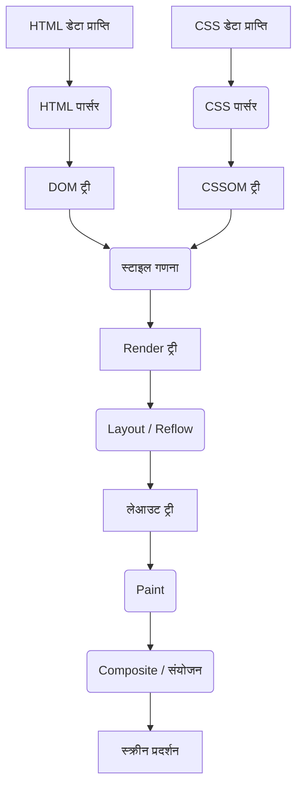
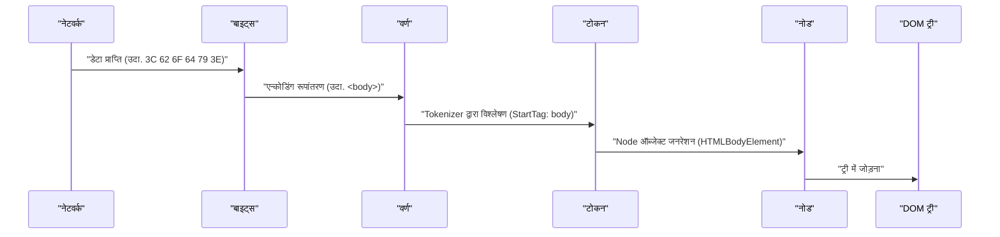
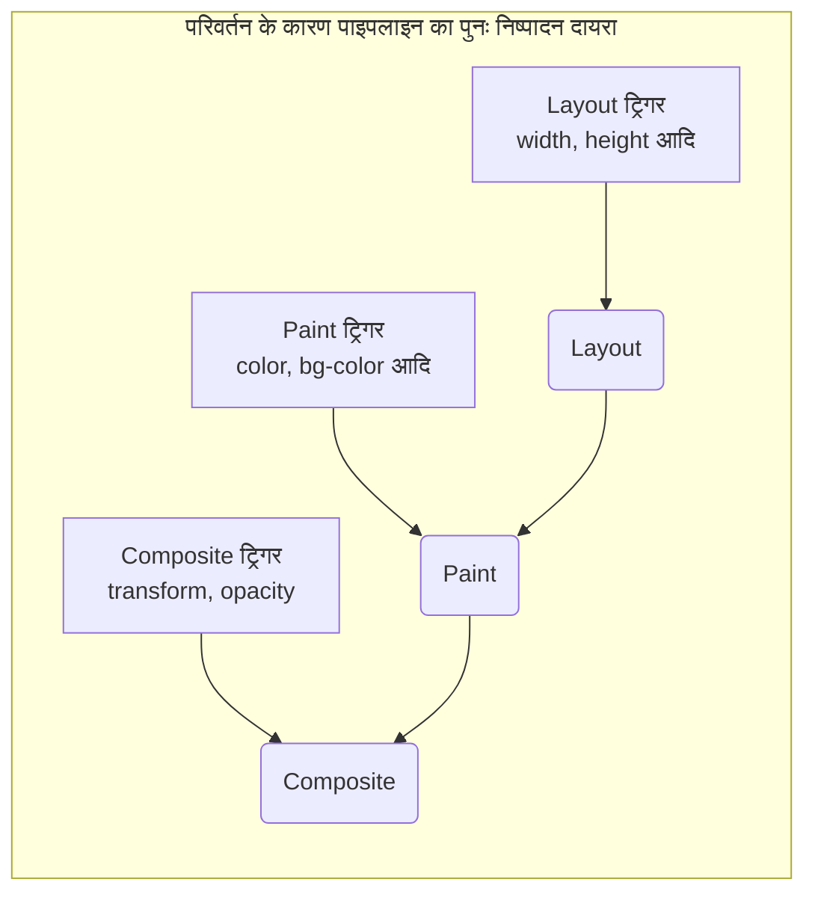

# ब्राउज़र रेंडरिंग तंत्र: DOM ट्री से Paint तक का पूरा विश्लेषण

वेब ब्राउज़र हमारे द्वारा प्रतिदिन उपयोग किए जाने वाले सबसे परिचित और सबसे जटिल सॉफ़्टवेयरों में से एक हैं। URL दर्ज करने से लेकर स्क्रीन पर पेज प्रदर्शित होने तक, इसके अंदर मिलीसेकंड में भारी मात्रा में गणना और प्रोसेसिंग होती है। प्रोसेसिंग के इस क्रम को **रेंडरिंग पाइपलाइन (Rendering [Pipeline](https://kenji.blog/hi/p/cicd-pipeline-github-actions-best-practices/))** या **क्रिटिकल रेंडरिंग पाथ (Critical Rendering Path)** कहा जाता है।

इस लेख में, हम यह विश्लेषण करेंगे कि ब्राउज़र (विशेष रूप से Blink और WebKit जैसे आधुनिक रेंडरिंग इंजन) HTML, CSS और JavaScript को कैसे पार्स करते हैं और अंततः उन्हें डिस्प्ले पर पिक्सेल के रूप में कैसे बनाते (Paint) हैं।

## 1. रेंडरिंग पाइपलाइन का अवलोकन

सबसे पहले, आइए रेंडरिंग इंजन की प्रोसेसिंग का अवलोकन करें। नेटवर्क से डेटा प्राप्त होने से लेकर स्क्रीन पर रेंडर होने तक मुख्य चरण निम्नलिखित हैं।



प्रोसेसिंग के चरणों को मुख्य रूप से निम्नलिखित चरणों में वर्गीकृत किया जा सकता है।

1. **Parsing (पार्सिंग)** : HTML और CSS का विश्लेषण करके DOM (Document Object Model) और CSSOM (CSS Object Model) बनाना।
2. **Style (स्टाइल गणना)** : DOM और CSSOM को मिलाकर प्रत्येक नोड पर लागू होने वाली अंतिम स्टाइल की गणना करना।
3. **Layout (लेआउट / रिफ़्लो)** : स्क्रीन पर प्रत्येक तत्व के सटीक स्थान और आकार (ज्यामिति जानकारी) की गणना करना।
4. **Paint (पेंट / चित्रकारी)** : तत्वों को पिक्सेल में बदलने के लिए पेंट कमांड (Paint Records) उत्पन्न करना और रेखापुंज (rasterize) करना।
5. **Composite (कम्पोजिट / संयोजन)** : सही क्रम में कई रेंडर की गई लेयर्स को ओवरले करके अंतिम स्क्रीन उत्पन्न करना।

आइए प्रत्येक चरण पर विस्तार से नज़र डालें।

## 2. Parsing (विश्लेषण): DOM ट्री और CSSOM ट्री का निर्माण

जब ब्राउज़र सर्वर से बाइट्स की एक श्रृंखला (HTML डेटा) प्राप्त करता है, तो रेंडरिंग इंजन इसे एक डेटा संरचना में बदलना शुरू कर देता है जिसे मनुष्य और प्रोग्राम समझ सकते हैं।

### 2.1 HTML की पार्सिंग और DOM ट्री का निर्माण

HTML का विश्लेषण W3C (अब WHATWG) द्वारा परिभाषित HTML पार्सिंग एल्गोरिदम के अनुसार किया जाता है। इस प्रक्रिया को 4 चरणों में विभाजित किया जा सकता है।

1. **Conversion (रूपांतरण)** : नेटवर्क से प्राप्त कच्चे डेटा बाइट्स को निर्दिष्ट वर्ण एन्कोडिंग (जैसे UTF-8) के आधार पर अलग-अलग वर्णों (Characters) में परिवर्तित किया जाता है।
2. **Tokenization (टोकनाइजेशन)** : स्ट्रिंग को W3C HTML5 मानक द्वारा निर्दिष्ट विभिन्न "टोकन (Tokens)" में परिवर्तित किया जाता है। उदाहरण के लिए, `<html>` , `<body>` जैसे प्रारंभ टैग, अंत टैग, विशेषता नाम और विशेषता मान आदि।
3. **Lexing (लेक्सिंग)** : जनरेट किए गए टोकन को "ऑब्जेक्ट्स (Nodes)" में परिवर्तित किया जाता है जिनमें गुण और नियम होते हैं।
4. **DOM [Tree](https://kenji.blog/hi/p/tree-graph-data-structures-search-dfs-bfs-dijkstra/) Construction (ट्री निर्माण)** : बनाए गए ऑब्जेक्ट्स को टैग की नेस्टिंग संरचना के आधार पर एक ट्री जैसे डेटा संरचना में जोड़ा जाता है। यही **DOM (Document Object Model)** है।



DOM ट्री दस्तावेज़ की संरचना और सामग्री का पूरी तरह से प्रतिनिधित्व करता है। हालाँकि, इस बिंदु पर, इसमें "तत्व कैसा दिखता है" के बारे में जानकारी नहीं होती है।

### 2.2 CSS की पार्सिंग और CSSOM ट्री का निर्माण

जब HTML पार्सर को `<link>` या `<style>` टैग जैसी CSS संबंधी जानकारी मिलती है, तो CSS पार्सिंग प्रक्रिया शुरू हो जाती है। CSS पार्सिंग भी HTML के समान चरणों का पालन करती है और अंततः **CSSOM (CSS Object Model)** नामक एक ट्री संरचना उत्पन्न करती है।

बाइट्स -> वर्ण -> टोकन -> नोड -> CSSOM

CSSOM एक संरचना है जो इस बात को रखती है कि DOM ट्री में प्रत्येक नोड को कैसे स्टाइल किया जाना चाहिए। CSS की एक विशेषता **कैस्केड (Cascade)** है। दूसरे शब्दों में, किसी तत्व के लिए स्टाइल परिभाषाएं मूल तत्व से विरासत में मिल सकती हैं या उच्च विशिष्टता (Specificity) वाले नियमों द्वारा ओवरराइट की जा सकती हैं। इसलिए, CSSOM अनिवार्य रूप से एक ट्री संरचना बन जाता है।

यदि हम गणितीय सूत्र का उपयोग करके विशिष्टता व्यक्त करते हैं, तो स्टाइल की प्राथमिकता को वेक्टर $ S = (a, b, c) $ द्वारा दर्शाया जाता है (a ID है, b क्लास है, c टैग की संख्या है)।
तुलना के दौरान, उच्च तत्वों का पहले मूल्यांकन किया जाता है।
$$
\text{विशिष्टता}(S_1, S_2) = 
\begin{cases} 
S_1 & \text{यदि } S_1 > S_2 \\\\
S_2 & \text{अन्यथा}
\end{cases}
$$

#### CSSOM का निर्माण रेंडरिंग को ब्लॉक करता है

महत्वपूर्ण बात यह है कि, **CSS पार्सिंग को रेंडरिंग ब्लॉकिंग संसाधन** के रूप में माना जाता है।
DOM निर्माण बाहरी संसाधनों की प्रतीक्षा किए बिना वृद्धिशील (लगातार) किया जा सकता है, लेकिन CSSOM पूरी तरह से बनने तक, ब्राउज़र अगले चरणों (Render ट्री निर्माण या स्क्रीन रेंडरिंग) की प्रतीक्षा करता है।

ऐसा इसलिए है, क्योंकि यदि ब्राउज़र अधूरे CSSOM के साथ रेंडरिंग शुरू करता है, तो हर बार स्टाइल की गणना होने पर स्क्रीन को फिर से रेंडर किया जाएगा, जिससे फ़्लिकरिंग (FOUC: Flash of Unstyled Content) उत्पन्न होगी।

### 2.3 JavaScript द्वारा पार्सिंग का अवरोधन

यदि HTML में `<script>` टैग शामिल है, तो ब्राउज़र का व्यवहार और भी जटिल हो जाता है।

जब ब्राउज़र पार्सर `<script>` टैग का सामना करता है, तो यह DOM के निर्माण को **रोक देता है (ब्लॉक कर देता है)**। फिर, यह JavaScript इंजन को नियंत्रण सौंपता है और स्क्रिप्ट के डाउनलोड, पार्सिंग और निष्पादन के पूरा होने की प्रतीक्षा करता है।
ऐसा क्यों है? ऐसा इसलिए है क्योंकि JavaScript `document.write()` या DOM API का उपयोग करके पार्स किए जा रहे DOM ट्री या स्वयं HTML को बदल सकता है।

```html
<!-- DOM पार्सिंग को ब्लॉक किए जाने का उदाहरण -->
<p>इसे तुरंत पार्स किया जाएगा</p>
<script src="heavy-script.js"></script>
<!-- heavy-script.js का निष्पादन पूरा होने तक, इसे पार्स नहीं किया जाएगा -->
<p>यह प्रदर्शित होने में देरी होगी</p>
```

#### defer और async विशेषताएं

इस रेंडरिंग ब्लॉकिंग से बचने और प्रदर्शन को बेहतर बनाने के लिए, `<script>` टैग में दो विशेषताएं हैं: `defer` और `async` ।

*   **async** : स्क्रिप्ट पृष्ठभूमि में एसिंक्रोनस रूप से डाउनलोड होती है। जैसे ही डाउनलोड पूरा होता है, HTML पार्सिंग को रोककर स्क्रिप्ट निष्पादित की जाती है। निष्पादन क्रम की गारंटी नहीं है (जो पहले डाउनलोड होता है वह पहले निष्पादित होता है)। बिना निर्भरता वाली एनालिटिक्स स्क्रिप्ट आदि के लिए उपयुक्त है।
*   **defer** : स्क्रिप्ट एसिंक्रोनस रूप से डाउनलोड होती है, लेकिन निष्पादन **HTML पार्सिंग पूरी तरह समाप्त होने के बाद (DOMContentLoaded इवेंट से ठीक पहले)** तक टाल दिया जाता है। चूँकि निष्पादन HTML में लिखे गए क्रम में होने की गारंटी है, यह DOM पर निर्भर स्क्रिप्ट के लिए उपयुक्त है।

```mermaid
gantt
    title "स्क्रिप्ट लोडिंग और निष्पादन"
    dateFormat  s
    axisFormat %s

    section "सामान्य स्क्रिप्ट"
    "HTML विश्लेषण"       :active, a1, 0, 2s
    "JS डाउनलोड" :crit, a2, 2s, 4s
    "JS निष्पादन"         :crit, a3, 4s, 6s
    "HTML विश्लेषण फिर से शुरू"   :active, a4, 6s, 8s

    section "async विशेषता"
    "HTML विश्लेषण"       :active, b1, 0, 5s
    "JS डाउनलोड" :crit, b2, 2s, 4s
    "JS निष्पादन"         :crit, b3, 5s, 7s
    "HTML विश्लेषण फिर से शुरू"   :active, b4, 7s, 9s

    section "defer विशेषता"
    "HTML विश्लेषण"       :active, c1, 0, 6s
    "JS डाउनलोड" :crit, c2, 1s, 4s
    "JS निष्पादन"         :crit, c3, 6s, 8s
```
*(※ वास्तविक `async` डाउनलोड पूरा होने के तुरंत बाद निष्पादित होता है, जो पार्सिंग को बाधित करता है।)*

## 3. Style (स्टाइल गणना): Render ट्री का निर्माण

जब DOM ट्री और CSSOM ट्री पूरे हो जाते हैं, तो ब्राउज़र उन्हें मिलाकर **Render ट्री (Render [Tree](https://kenji.blog/hi/p/tree-graph-data-structures-search-dfs-bfs-dijkstra/))** या **स्टाइल ट्री (Style Tree)** बनाता है।

इस चरण में, DOM ट्री के प्रत्येक नोड के लिए कौन से CSSOM स्टाइल नियम लागू होते हैं, इसकी गणना की जाती है, और अंतिम परिकलित स्टाइल (Computed Style) निर्धारित की जाती है।

### 3.1 Render ट्री में क्या शामिल है और क्या नहीं

Render ट्री एक ट्री है जिसमें **स्क्रीन पर प्रदर्शित सभी तत्वों** की दृश्य जानकारी होती है। इसलिए, यह DOM ट्री के साथ पूरी तरह से 1:1 मेल नहीं खाता है।

*   **क्या शामिल नहीं है** :
    *   `<head>` , `<meta>` , `<script>` जैसे अदृश्य तत्व।
    *   तत्व (और उनके वंशज) जिनके पास CSS में `display: none;` है।
*   **क्या शामिल है** :
    *   प्रदर्शित DOM नोड्स।
    *   छद्म-तत्व (Pseudo-elements) ( `::before` , `::after` आदि)। ये DOM में मौजूद नहीं हैं, लेकिन Render ट्री में जोड़े जाते हैं।
    *   वे तत्व जिन पर `visibility: hidden;` लागू है। वे अदृश्य हैं, लेकिन स्थान लेते हैं (क्योंकि वे लेआउट को प्रभावित करते हैं) इसलिए Render ट्री में शामिल होते हैं।

### 3.2 स्टाइल गणना की जटिलता

तत्वों पर कौन से CSS नियम लागू होते हैं, यह निर्धारित करने की प्रक्रिया अत्यधिक गणनात्मक रूप से महंगी है।
चयनकर्ताओं (Selectors) का मिलान करते समय ब्राउज़र **दाएं से बाएं (Right-to-Left)** मूल्यांकन करते हैं।

उदाहरण के लिए, मान लें कि हमारे पास निम्नलिखित CSS नियम है:

```css
.container div .item p {
    color: red;
}
```

ब्राउज़र सबसे पहले सभी `<p>` टैग ढूंढता है (यह सबसे दाईं ओर का कुंजी चयनकर्ता है)। फिर यह `<p>` के मूल तत्व ट्री को पार करता है ताकि जांच सके कि क्या `.item` क्लास वाला कोई तत्व है, फिर जांचता है कि क्या उसके पैरेंट में `div` है, और फिर जांचता है कि क्या उसके पैरेंट में `.container` है।

दाएं से बाएं क्यों? ऐसा इसलिए है क्योंकि यदि DOM ट्री विशाल हो जाता है, तो बाएं से दाएं खोजने के परिणामस्वरूप अनगिनत "अमेल वंशज तत्वों" की खोज की जाएगी, जो प्रदर्शन को महत्वपूर्ण रूप से कम कर देगा। दाएं से बाएं खोज कर, आप लक्ष्य तत्वों को तेज़ी से संकीर्ण कर सकते हैं।

इसलिए, निम्नलिखित की तरह अत्यधिक विस्तृत या अनावश्यक चयनकर्ता स्टाइल गणना प्रदर्शन को धीमा कर देते हैं।

```css
/* बुरा उदाहरण: ब्राउज़र को सभी a टैग की जांच करनी होगी और क्रमशः यह देखना होगा कि क्या उनका मूल span, li, ul, div है */
div ul li span a { color: blue; }

/* अच्छा उदाहरण: BEM जैसे डिज़ाइन दृष्टिकोणों का उपयोग करें और उन्हें फ्लैट और प्रत्यक्ष वर्ग पदनाम बनाएं */
.nav-link { color: blue; }
```

## 4. Layout (लेआउट / रिफ़्लो): तत्व स्थिति और आकार की गणना

एक बार Render ट्री (स्टाइल जानकारी वाले नोड्स का संग्रह) बन जाने के बाद, अगला चरण **Layout (लेआउट)** चरण है। WebKit आधारित ब्राउज़र इसे कभी-कभी **Reflow (रिफ़्लो)** भी कहते हैं।

इस चरण में, ब्राउज़र के व्यूपोर्ट (विंडो के प्रदर्शन क्षेत्र) के आकार के आधार पर, यह सटीक रूप से गणना की जाती है कि Render ट्री में प्रत्येक नोड को स्क्रीन पर **कहाँ (Position) और कितना बड़ा (Size)** रखा जाना चाहिए।

### 4.1 बॉक्स मॉडल और फ़्लो लेआउट

ब्राउज़र लेआउट का आधार **बॉक्स मॉडल (Box Model)** है। सभी तत्वों की गणना सामग्री (Content), पैडिंग (Padding), बॉर्डर (Border), और मार्जिन (Margin) के साथ एक आयताकार बॉक्स के रूप में की जाती है।

लेआउट गणना आम तौर पर Render ट्री के मूल (`<html>` तत्व, प्रारंभिक युक्त ब्लॉक) से शुरू होती है, और पुनरावर्ती रूप से बाल तत्वों में जाती है।

1. **माता-पिता से बच्चे तक** : मूल बॉक्स अपनी चौड़ाई निर्धारित करता है और बच्चे के बॉक्स को उपलब्ध चौड़ाई बताता है।
2. **बच्चे से माता-पिता तक** : बाल बॉक्स अपनी ऊंचाई (सामग्री के आधार पर) निर्धारित करता है और इसे मूल बॉक्स को बताता है। मूल बॉक्स बाल बक्से की कुल ऊंचाई के आधार पर अपनी अंतिम ऊंचाई निर्धारित करता है।

जिस तंत्र के माध्यम से लेआउट का अधिकांश भाग इस एकल ऊपर-नीचे पास में निर्धारित किया जाता है उसे **फ़्लो लेआउट (Flow Layout)** कहा जाता है (※ तालिकाओं और Flexbox/Grid आदि को अधिक जटिल एकाधिक पास की आवश्यकता हो सकती है)।

### 4.2 ग्लोबल लेआउट और इंक्रीमेंटल लेआउट

दो प्रकार की लेआउट गणनाएं हैं: **ग्लोबल लेआउट**, जो पूरी स्क्रीन की पुनर्गणना करता है, और **इंक्रीमेंटल लेआउट**, जो केवल परिवर्तित भागों की पुनर्गणना करता है।

*   **ग्लोबल लेआउट** : यदि विंडो का आकार बदलता है (रीसाइज़ होता है), डिवाइस का ओरिएंटेशन बदलता है, या रूट तत्व का फ़ॉन्ट आकार बदलता है, तो पूरे Render ट्री की लेआउट गणना फिर से की जाती है। यह एक बहुत ही महंगी प्रक्रिया है।
*   **इंक्रीमेंटल लेआउट** : यदि JavaScript द्वारा कुछ तत्वों का आकार बदल दिया जाता है, या DOM नोड्स जोड़े/हटाए जाते हैं, तो ब्राउज़र उस तत्व और संभावित रूप से प्रभावित तत्वों (भाई-बहन और माता-पिता) को "डर्टी (Dirty)" के रूप में चिह्नित करता है, और केवल उस हिस्से को एसिंक्रोनस रूप से पुनर्गणना करता है। इसे **Dirty bit system** कहा जाता है।

### 4.3 लेआउट थ्रैशिंग (Layout Thrashing) और प्रदर्शन

यदि आप JavaScript से DOM की शैली बदलते हैं और तुरंत गणना परिणाम (जैसे ऊंचाई या चौड़ाई) पढ़ने का प्रयास करते हैं, तो ब्राउज़र को विलंबित लेआउट गणना को **बलपूर्वक और तुरंत (Synchronous Layout)** निष्पादित करना होगा, जिसे अनुकूलन के लिए रखा गया था।

लूप आदि में इसे लगातार करने को **लेआउट थ्रैशिंग (Layout Thrashing)** कहा जाता है, जो एक गंभीर प्रदर्शन समस्या का कारण बनता है और फ्रेम दर को महत्वपूर्ण रूप से कम करता है।

**【खराब कोड उदाहरण जो लेआउट थ्रैशिंग का कारण बनता है】**

```javascript
const elements = document.querySelectorAll('.box');

// बुरा उदाहरण: DOM पढ़ना (offsetWidth) और लिखना (style.width) बारी-बारी से होता है
for (let i = 0; i < elements.length; i++) {
    // offsetWidth पढ़ने के लिए, ब्राउज़र जबरन लेआउट गणना निष्पादित करता है
    const width = elements[i].offsetWidth;
    // स्टाइल लिखने से DOM "Dirty" हो जाता है
    elements[i].style.width = width + 10 + 'px';
    // चूंकि offsetWidth को अगले लूप में फिर से पढ़ा जाता है, इसलिए फिर से एक मजबूर लेआउट होता है... (लूप जारी रहता है)
}
```

**【सुधार: पढ़ने और लिखने का पृथक्करण (Batching)】**

```javascript
const elements = document.querySelectorAll('.box');
const widths = [];

// अच्छा उदाहरण: चरण 1 - सभी तत्वों की चौड़ाई को एक साथ पढ़ें (लेआउट केवल एक बार होता है)
for (let i = 0; i < elements.length; i++) {
    widths.push(elements[i].offsetWidth);
}

// अच्छा उदाहरण: चरण 2 - सभी तत्वों की शैलियों को एक साथ लिखें
for (let i = 0; i < elements.length; i++) {
    elements[i].style.width = widths[i] + 10 + 'px';
}
// इसके बाद के ब्राउज़र रेंडरिंग समय पर लेआउट को एक साथ केवल एक बार पुनर्गणना किया जाता है
```

हाल ही में, `FastDOM` जैसी लाइब्रेरी का उपयोग करना या DOM पढ़ने और लिखने को बैच करने के लिए `requestAnimationFrame` का उचित रूप से उपयोग करना आम हो गया है।

## 5. Paint (पेंट / चित्रकारी): पिक्सेल जनरेशन

लेआउट चरण द्वारा प्रत्येक तत्व के बॉक्स की स्थिति (X, Y निर्देशांक) और आकार (चौड़ाई, ऊंचाई) निर्धारित की गई है। हालाँकि, अभी तक स्क्रीन पर कुछ भी रेंडर नहीं किया गया है। अगला कदम **Paint (पेंट)** चरण है।

पेंट चरण का उद्देश्य इनपुट के रूप में लेआउट ट्री को लेना है, स्क्रीन पर पिक्सेल को पेंट करने के तरीके (Paint Records) पर निर्देश बनाना है, और अंत में उन्हें रैस्टराइज़ (Rasterization) करना है।

### 5.1 पेंट का क्रम (Stacking Context)

तत्वों को उसी क्रम में खींचना पर्याप्त नहीं है जिस क्रम में वे HTML में लिखे गए हैं। CSS में `z-index`, पूर्ण स्थिति (`position: absolute;`), अपारदर्शिता (`opacity`), 3D रूपांतरण आदि जैसे गुण हैं जो तत्वों के ओवरलैप होने (Z-अक्ष क्रम) के क्रम को प्रभावित करते हैं।

इसे प्रबंधित करने वाले तंत्र को **स्टैकिंग संदर्भ (Stacking Context)** कहा जाता है।

ब्राउज़र CSS 2.1 विनिर्देश में परिभाषित सख्त पेंट क्रम के अनुसार ड्रा निर्देश उत्पन्न करते हैं। सामान्य ब्लॉक तत्वों के लिए पेंट क्रम इस प्रकार है:

1. background-color (पृष्ठभूमि का रंग)
2. background-image (पृष्ठभूमि की छवि)
3. border (सीमा)
4. children (बाल तत्वों की रेंडरिंग)
5. outline (रूपरेखा)

### 5.2 Paint Records और Display List

आधुनिक ब्राउज़रों (जैसे क्रोम का Blink) में, पेंट चरण अब सीधे मेमोरी में पिक्सेल नहीं लिखता है, बल्कि **Paint Records (पेंट रिकॉर्ड)** की एक सूची (Display List) बनाता है।

Paint Record एक विशिष्ट ड्राइंग कमांड की सूची है, जैसे "इस निर्देशांक पर इस रंग में एक आयत बनाएं" या "इस पाठ को निर्दिष्ट फ़ॉन्ट के साथ ड्रा करें"।

```json
// Paint Record की वैचारिक छवि
[
  { "action": "drawRect", "rect": [0, 0, 100, 100], "color": "blue" },
  { "action": "drawText", "text": "Hello", "pos": [10, 20], "font": "Arial" }
]
```

हम इसे सूची में क्यों बनाते हैं? ऐसा इसलिए है क्योंकि जब भी थोड़ा बदलाव होता है तो सब कुछ दोबारा पेंट करने के बजाय ड्राइंग निर्देशों की सूची रखना और केवल उन निर्देशों को अपडेट और पुनः निष्पादित करना अधिक कुशल है जहां परिवर्तन हुए हैं।

### 5.3 रैस्टराइज़ेशन (Rasterization) और मल्टी-थ्रेडिंग

उत्पन्न Paint Records (Display List) को वास्तव में पिक्सेल (बिटमैप डेटा) में परिवर्तित करने की आवश्यकता है। इस प्रक्रिया को **रैस्टराइज़ेशन (Rasterization)** कहा जाता है।

जब भी आप स्क्रॉल करते हैं तो पूरे पृष्ठ को रैस्टराइज़ करना अक्षम है। इसलिए, ब्राउज़र स्क्रीन को कई छोटे आयताकार क्षेत्रों (उदा. 256x256 पिक्सेल) में विभाजित करता है जिन्हें **टाइल्स (Tiles)** कहा जाता है।

वर्तमान क्रोम में, रैस्टराइज़ेशन मुख्य थ्रेड (वह थ्रेड जहां JavaScript निष्पादित होता है और लेआउट होता है) पर नहीं किया जाता है, बल्कि समर्पित **रैस्टराइज़र थ्रेड्स (Rasterizer Threads)** पर समानांतर रूप से संसाधित (Threaded Rasterization) किया जाता है। इसके अतिरिक्त, कई रैस्टराइज़ेशन कार्य हार्डवेयर त्वरण का उपयोग करते हैं और **GPU** पर बहुत तेज़ी से चलते हैं।

## 6. Composite (कम्पोजिट / संयोजन): लेयर्स का ओवरले

एक बार रैस्टराइज़ेशन पूरा हो जाने और प्रत्येक टाइल के लिए पिक्सेल डेटा उत्पन्न हो जाने (आमतौर पर GPU मेमोरी में बनावट के रूप में संग्रहीत) के बाद, अंतिम चरण दर्ज किया जाता है: **Composite (संयोजन)** चरण।

जटिल वेब पृष्ठों पर, तत्व एक दूसरे पर ओवरलैप होते हैं, जैसे कि ड्रॉप शैडो वाले हेडर, सामने की ओर फिक्स्ड मोडल विंडो, और स्क्रॉलिंग बैकग्राउंड इमेज। यदि आप इन सभी तत्वों को एक ही कैनवास पर रंग देते हैं, तो आपको हर बार स्क्रॉल करने या कुछ एनिमेशन चलाने पर एक बड़े क्षेत्र (Paint और Rasterization) को फिर से रंगना होगा, जो प्रदर्शन को खराब कर देगा।

इसलिए, ब्राउज़र पृष्ठ को कई स्वतंत्र **लेयर्स (Graphics Layers)** में विभाजित करके प्रबंधित करता है।

### 6.1 लेयरिंग तंत्र

ब्राउज़र के अंदर कई ट्री संरचनाओं को रूपांतरित किया जाता है।

1. **DOM [Tree](https://kenji.blog/hi/p/tree-graph-data-structures-search-dfs-bfs-dijkstra/)**
2. **Layout Tree (Render Tree)** : दृश्य तत्वों की ज्यामिति जानकारी
3. **Paint Tree (Layer Tree)** : स्टैकिंग संदर्भ आदि के आधार पर पदानुक्रमित लेयर संरचना
4. **Graphics Layer Tree** : स्वतंत्र लेयर्स जो वास्तव में GPU पर संयोजित की जाती हैं

विशिष्ट CSS गुणों वाले तत्वों को ब्राउज़र द्वारा स्वतंत्र "Graphics Layer (ग्राफ़िक्स लेयर)" में प्रचारित (Promote) किया जाता है।

मुख्य शर्तें (ट्रिगर्स) जिनके तहत लेयर्स बनाई जाती हैं वे इस प्रकार हैं:

*   3D या परिप्रेक्ष्य रूपांतरण ( `transform: translateZ(0)` , `translate3d(...)` )
*   `<video>` या `<canvas>` तत्व
*   तत्व जो CSS एनिमेशन या ट्रांज़िशन के माध्यम से अपारदर्शिता ( `opacity` ) या रूपांतरण ( `transform` ) बदलते हैं
*   `will-change` प्रॉपर्टी वाले तत्व (उदा: `will-change: transform;`)
*   तत्व जो पहले से ही स्वतंत्र लेयर्स पर निर्भर हैं (ओवरलैप कारणों से)

### 6.2 कम्पोजिटर थ्रेड और हार्डवेयर एक्सेलेरेशन

लेयर कंपोज़िशन एक समर्पित थ्रेड पर किया जाता है जिसे **कम्पोजिटर थ्रेड (Compositor Thread)** कहा जाता है, जो मुख्य थ्रेड से स्वतंत्र है।

प्रत्येक लेयर की रैस्टराइज़्ड बिटमैप बनावट GPU में स्थानांतरित की जाती है। कम्पोजिटर थ्रेड GPU को "लेयर A को X निर्देशांक 100 और Y निर्देशांक 200 पर रखें, और उस पर 0.5 की अपारदर्शिता के साथ लेयर B को ओवरले करें" जैसे कंपोज़िटिंग निर्देश (Compositor Frame) भेजता है। GPU इन छवियों को बहुत तेज़ी से मिश्रित करता है और अंतिम स्क्रीन को डिस्प्ले पर आउटपुट करता है।

#### मुख्य थ्रेड से स्वतंत्र स्क्रॉलिंग और एनिमेशन

कम्पोजिटर थ्रेड का मुख्य थ्रेड से स्वतंत्र होना प्रदर्शन के लिए महत्वपूर्ण है।

भले ही JavaScript को निष्पादित होने में लंबा समय लगता है और मुख्य थ्रेड ब्लॉक हो जाता है (फ़्रीज़ हो जाता है), यदि उपयोगकर्ता माउस के साथ स्क्रॉल करता है, तो कम्पोजिटर थ्रेड को केवल GPU में पहले से मौजूद लेयर बनावट को थोड़ा सा खिसका कर संयोजित करना होगा। यह उन पृष्ठों पर भी स्क्रॉलिंग को सुचारू (Jank-free) बनाता है जिनमें भारी JavaScript है।

`transform` और `opacity` एनिमेशन का उपयोग करके इसका अधिकतम लाभ उठाया जा सकता है।

### 6.3 CSS ट्रिगर: एनिमेशन प्रदर्शन अनुकूलन

वेब प्रदर्शन अनुकूलन में सबसे महत्वपूर्ण अवधारणाओं में से एक **CSS Triggers** है।
जब आप JavaScript या CSS के साथ किसी तत्व की स्टाइल बदलते हैं, तो ब्राउज़र के रेंडरिंग पाइपलाइन का कौन सा चरण पुनः आरंभ करना है (चाहे वह Layout से हो, Paint से हो, या Composite से हो) यह उस संपत्ति पर निर्भर करता है जिसे बदला जा रहा है।

1. **Layout (Reflow) को ट्रिगर करने वाले गुण**
    *   `width` , `height` , `margin` , `padding` , `top` , `left` , `font-size` आदि।
    *   चूंकि ज्यामिति की जानकारी बदलती है, यह Layout → Paint → Composite की संपूर्ण पाइपलाइन को फिर से निष्पादित करता है। यह एक बहुत भारी प्रक्रिया है और एनिमेशन के लिए उपयुक्त नहीं है।
2. **Paint (Repaint) को ट्रिगर करने वाले गुण**
    *   `color` , `background-color` , `box-shadow` आदि।
    *   तत्व का आकार या स्थिति नहीं बदलती है, लेकिन स्वरूप बदल जाता है, इसलिए Paint → Composite को फिर से निष्पादित किया जाता है। यद्यपि यह Layout से हल्का है, यह अभी भी पिक्सेल को फिर से खींचने के कारण लोड का कारण बनता है।
3. **केवल Composite को ट्रिगर करने वाले गुण**
    *   `transform` ( `translate` , `scale` , `rotate` )
    *   `opacity`
    *   ये तत्वों की ज्यामिति या अलग-अलग पिक्सेल का रंग नहीं बदलते हैं। चूँकि तत्व पहले से ही GPU में एक स्वतंत्र लेयर (बनावट) के रूप में मौजूद है, ब्राउज़र को केवल GPU को "बनावट को स्थानांतरित और संयोजित करें (transform)" और "इसे पारभासी (opacity) बनाएं" का निर्देश देना होगा। चूंकि मुख्य थ्रेड पर Layout और Paint को पूरी तरह से छोड़ दिया जा सकता है, **60fps के सुचारू एनिमेशन प्राप्त करने के लिए यह एक आवश्यक तरीका है**।



#### will-change प्रॉपर्टी का लाभ उठाना

`will-change` एक CSS प्रॉपर्टी है जिसका उपयोग डेवलपर्स द्वारा ब्राउज़र को यह बताने के लिए किया जाता है कि "इस तत्व की विशिष्ट संपत्तियों को भविष्य में बदल दिया जाएगा।"

```css
.animated-box {
    /* ब्राउज़र को पहले से बताएं कि transform बदल जाएगा ताकि वह एक समर्पित लेयर बना सके */
    will-change: transform;
    transition: transform 0.3s ease;
}
.animated-box:hover {
    transform: translateX(100px);
}
```

जब ब्राउज़र `will-change: transform` देखता है, तो यह एनिमेशन शुरू होने से "पहले" तत्व को एक स्वतंत्र लेयर में बढ़ावा देता है और GPU पर बनावट तैयार करता है। यह वास्तव में होवर होने और एनिमेशन शुरू होने के क्षण में हकलाना (Paint के कारण देरी) को रोकता है।

हालाँकि, लेयर्स बनाने में मेमोरी खर्च होती है, इसलिए यदि आप किसी पेज के सभी तत्वों के लिए `will-change` निर्दिष्ट करते हैं, तो ब्राउज़र क्रैश हो सकता है या प्रदर्शन खराब हो सकता है। केवल आवश्यक तत्वों के लिए उचित रूप से इसका उपयोग करना महत्वपूर्ण है।

## 7. निष्कर्ष

हमने "DOM ट्री से Paint (और Composite) तक का पूरा तंत्र" देखा है, जो HTML प्राप्त करने से लेकर स्क्रीन पर पिक्सेल बनाने तक ब्राउज़र का काम है।

1. **Parsing** : HTML/CSS का विश्लेषण करें और DOM और CSSOM बनाएँ। JavaScript (विशेषकर सिंक्रोनस स्क्रिप्ट) इसे ब्लॉक करता है।
2. **Style** : प्रदर्शित तत्वों और उनकी स्टाइल्स के साथ एक Render ट्री बनाने के लिए DOM और CSSOM को मिलाएँ।
3. **Layout** : स्क्रीन पर प्रत्येक तत्व की सटीक स्थिति (निर्देशांक) और आकार की गणना करें।
4. **Paint** : ड्राइंग कमांड (Paint Records) बनाएँ और उन्हें एक समर्पित थ्रेड में पिक्सेल में रैस्टराइज़ करें।
5. **Composite** : GPU पर स्वतंत्र लेयर्स को संयोजित करें और अंतिम स्क्रीन को आउटपुट करें।

इस तंत्र की गहरी समझ होना फ्रंट-एंड डेवलपर्स के लिए सिर्फ ज्ञान से कहीं अधिक है।
" `width` का उपयोग करके एनिमेट करने पर हकलाना क्यों होता है?"
" `script` टैग को क्लोजिंग `body` टैग से ठीक पहले क्यों रखा जाना चाहिए, या `defer` का उपयोग क्यों किया जाना चाहिए?"
"React और Vue जैसे वर्चुअल DOM तेज़ी से क्यों चलते हैं? (= DOM एक्सेस और Layout/Paint का बैचिंग और न्यूनीकरण)"

इन सभी सवालों के जवाब इसी रेंडरिंग पाइपलाइन में मौजूद हैं। यह जानकर कि यह कैसे काम करता है, आप बेहतर प्रदर्शन और बेहतर उपयोगकर्ता अनुभव के साथ वेब एप्लिकेशन बनाने में सक्षम होंगे।
