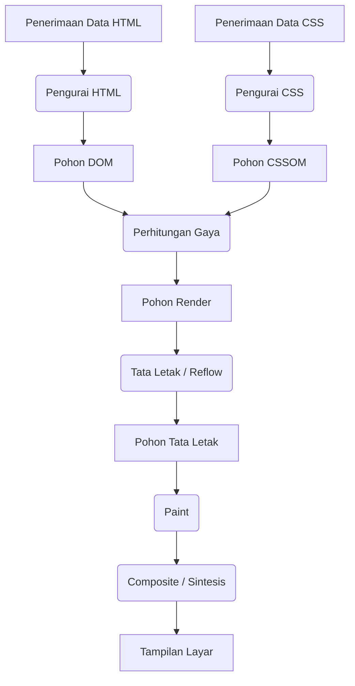
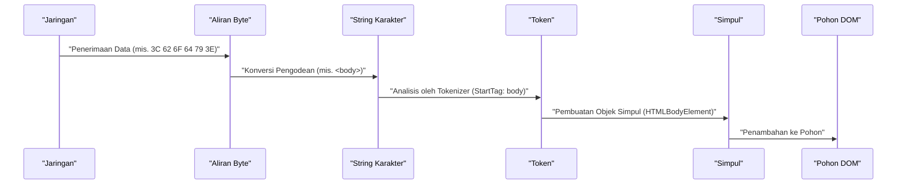
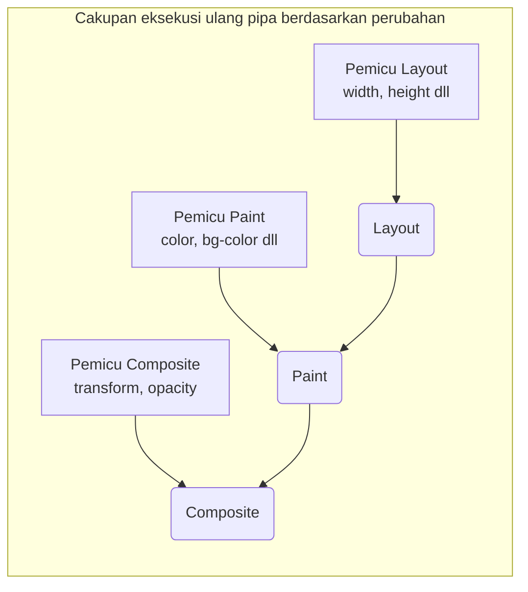

# Mekanisme Perenderan Peramban: Anatomi Lengkap dari Pohon DOM hingga Paint

Peramban web adalah salah satu perangkat lunak paling umum dan paling kompleks yang kita gunakan setiap hari. Dari saat Anda memasukkan URL hingga halaman ditampilkan di layar, komputasi dan pemrosesan dalam jumlah besar terjadi di dalamnya dalam hitungan milidetik. Rangkaian aliran pemrosesan ini disebut **Pipa Perenderan (Rendering [Pipeline](https://kenji.blog/id/p/cicd-pipeline-github-actions-best-practices/))** atau **Jalur Perenderan Kritis (Critical Rendering Path)**.

Dalam artikel ini, kita akan membedah mekanisme lengkap tentang bagaimana peramban (terutama mesin perenderan modern seperti Blink dan WebKit) menafsirkan HTML, CSS, dan JavaScript, dan pada akhirnya menggambarnya (Paint) sebagai piksel pada layar.

## 1. Gambaran Umum Pipa Perenderan

Pertama-tama, mari kita pahami gambaran umum pemrosesan oleh mesin perenderan. Langkah-langkah utama dari saat peramban menerima data dari jaringan hingga menggambar di layar adalah sebagai berikut.



Langkah-langkah pemrosesan secara garis besar diklasifikasikan ke dalam fase-fase berikut.

1.  **Parsing (Penguraian)** : Mengurai HTML dan CSS, serta membangun DOM (Document Object Model) dan CSSOM (CSS Object Model).
2.  **Style (Perhitungan Gaya)** : Menggabungkan DOM dan CSSOM untuk menghitung gaya akhir yang diterapkan pada setiap simpul.
3.  **Layout (Tata Letak / Reflow)** : Menghitung posisi dan ukuran yang tepat (informasi geometri) dari setiap elemen di layar.
4.  **Paint (Pengecatan / Penggambaran)** : Menghasilkan instruksi penggambaran (Paint Records) untuk mengubah elemen menjadi piksel, dan merasterisasinya.
5.  **Composite (Komposit / Sintesis)** : Melapisi beberapa lapisan yang telah digambar dalam urutan yang benar untuk menghasilkan layar akhir.

Mari kita lihat masing-masing langkah secara mendetail.

## 2. Parsing (Analisis): Membangun Pohon DOM dan Pohon CSSOM

Ketika peramban menerima aliran byte (data HTML) dari server, mesin perenderan mulai mengubahnya menjadi struktur data yang dapat dipahami oleh manusia dan program.

### 2.1 Penguraian HTML dan Pembangunan Pohon DOM

Analisis HTML dilakukan mengikuti algoritma penguraian HTML yang didefinisikan oleh W3C (sekarang WHATWG). Proses ini dapat dipecah menjadi 4 langkah berikut.

1.  **Conversion (Konversi)** : Mengubah aliran byte data mentah yang diterima dari jaringan menjadi karakter individual (Characters) berdasarkan pengodean karakter yang ditentukan (seperti UTF-8).
2.  **Tokenization (Analisis Leksikal)** : Mengubah string menjadi berbagai "token (Tokens)" yang ditentukan oleh standar HTML5 W3C. Contohnya termasuk tag pembuka seperti `<html>`, `<body>`, tag penutup, nama atribut, dan nilai atribut.
3.  **Lexing (Analisis Sintaksis)** : Mengubah token yang dihasilkan menjadi "objek (Nodes)" yang memiliki properti dan aturan.
4.  **DOM Tree Construction (Pembangunan Pohon)** : Menautkan objek yang dibuat ke dalam struktur data seperti pohon berdasarkan hubungan bersarang dari tag. Inilah yang disebut **DOM (Document Object Model)**.



Pohon DOM sepenuhnya merepresentasikan struktur dan konten dari dokumen. Namun, pada titik ini, pohon DOM belum memiliki informasi tentang "bagaimana elemen-elemen tersebut akan terlihat".

### 2.2 Penguraian CSS dan Pembangunan Pohon CSSOM

Ketika pengurai HTML menemukan informasi terkait CSS, seperti tag `<link>` atau `<style>`, proses analisis CSS akan dimulai. Analisis CSS juga mengikuti langkah-langkah yang sangat mirip dengan HTML, dan akhirnya menghasilkan struktur pohon yang disebut **CSSOM (CSS Object Model)**.

Aliran byte -> String Karakter -> Token -> Simpul -> CSSOM

CSSOM adalah struktur yang menyimpan bagaimana setiap simpul dalam pohon DOM harus diberi gaya. Ciri khas CSS adalah **Kaskade (Cascade)**. Artinya, definisi gaya untuk suatu elemen dapat diwarisi dari elemen induknya atau ditimpa oleh aturan dengan spesifisitas (Specificity) yang lebih tinggi. Oleh karena itu, CSSOM secara alami menjadi struktur pohon.

Jika spesifisitas dinyatakan menggunakan rumus matematika, prioritas gaya direpresentasikan oleh vektor $ S = (a, b, c) $ (a adalah jumlah ID, b adalah jumlah kelas, dan c adalah jumlah tag).
Saat membandingkan, evaluasi dilakukan dari elemen yang paling atas.
$$
\text{Spesifisitas}(S_1, S_2) = 
\begin{cases} 
S_1 & \text{jika } S_1 > S_2 \\\\
S_2 & \text{sebaliknya}
\end{cases}
$$

#### Pembangunan CSSOM Memblokir Perenderan

Hal penting yang perlu diperhatikan adalah bahwa **penguraian CSS diperlakukan sebagai sumber daya yang memblokir perenderan**.
Sementara pembangunan DOM dapat dilakukan secara bertahap (inkremental) tanpa menunggu sumber daya eksternal, peramban akan menunggu langkah-langkah selanjutnya (seperti pembangunan Pohon Render dan penggambaran layar) sampai CSSOM sepenuhnya terbangun.

Alasannya adalah, jika penggambaran dimulai dengan CSSOM yang tidak lengkap, layar akan digambar ulang setiap kali gaya dihitung, menyebabkan kedipan (FOUC: Flash of Unstyled Content).

### 2.3 Pemblokiran Penguraian oleh JavaScript

Perilaku peramban menjadi lebih kompleks jika HTML mengandung tag `<script>`.

Ketika pengurai peramban menemukan tag `<script>`, ia akan **menjeda (memblokir)** pembangunan DOM. Kontrol kemudian beralih ke mesin JavaScript, dan peramban menunggu hingga skrip diunduh, diurai, dan selesai dieksekusi.
Mengapa demikian? Hal ini karena JavaScript dapat menggunakan `document.write()` atau API DOM untuk memodifikasi pohon DOM yang sedang diurai atau HTML itu sendiri.

```html
<!-- Contoh di mana penguraian DOM diblokir -->
<p>Bagian ini akan segera diurai</p>
<script src="heavy-script.js"></script>
<!-- Bagian ini tidak akan diurai sampai eksekusi heavy-script.js selesai -->
<p>Bagian ini akan terlambat ditampilkan</p>
```

#### Atribut defer dan async

Untuk menghindari pemblokiran perenderan ini dan meningkatkan kinerja, ada dua atribut yang disediakan untuk tag `<script>`: `defer` dan `async`.

*   **async** : Mengunduh skrip di latar belakang secara asinkron. Segera setelah unduhan selesai, penguraian HTML akan dijeda dan skrip akan dieksekusi. Urutan eksekusi tidak dijamin (dieksekusi sesuai dengan yang selesai diunduh lebih dulu). Cocok untuk skrip analitik yang tidak memiliki dependensi.
*   **defer** : Mengunduh skrip secara asinkron, tetapi menunda eksekusinya **sampai penguraian HTML sepenuhnya selesai (tepat sebelum peristiwa DOMContentLoaded)**. Karena dijamin akan dieksekusi sesuai urutan penulisannya dalam HTML, atribut ini cocok untuk skrip yang bergantung pada DOM.

```mermaid
gantt
    title "Pemuatan dan Eksekusi Skrip"
    dateFormat  s
    axisFormat %s

    section "Skrip Normal"
    "Analisis HTML"       :active, a1, 0, 2s
    "Unduhan JS"          :crit, a2, 2s, 4s
    "Eksekusi JS"         :crit, a3, 4s, 6s
    "Lanjut Analisis HTML":active, a4, 6s, 8s

    section "Atribut async"
    "Analisis HTML"       :active, b1, 0, 5s
    "Unduhan JS"          :crit, b2, 2s, 4s
    "Eksekusi JS"         :crit, b3, 5s, 7s
    "Lanjut Analisis HTML":active, b4, 7s, 9s

    section "Atribut defer"
    "Analisis HTML"       :active, c1, 0, 6s
    "Unduhan JS"          :crit, c2, 1s, 4s
    "Eksekusi JS"         :crit, c3, 6s, 8s
```
*(※ `async` yang sebenarnya akan segera dieksekusi setelah pengunduhan selesai, yang akan menyela penguraian.)*

## 3. Style (Perhitungan Gaya): Pembangunan Pohon Render

Setelah pohon DOM dan pohon CSSOM selesai, peramban menggabungkan keduanya untuk membangun **Pohon Render (Render Tree)** atau **Pohon Gaya (Style Tree)**.

Dalam fase ini, peramban menghitung aturan gaya CSSOM mana yang berlaku untuk setiap simpul di pohon DOM, dan menentukan gaya yang telah dihitung (Computed Style) secara akhir.

### 3.1 Apa yang Termasuk dan Tidak Termasuk dalam Pohon Render

Pohon Render adalah pohon yang berisi informasi visual dari **semua elemen yang ditampilkan di layar**. Oleh karena itu, pohon ini tidak berkorespondensi persis 1 banding 1 dengan pohon DOM.

*   **Yang tidak termasuk** :
    *   Elemen tersembunyi seperti `<head>`, `<meta>`, dan `<script>`.
    *   Elemen dengan properti CSS `display: none;` (serta elemen turunannya).
*   **Yang termasuk** :
    *   Simpul DOM yang ditampilkan.
    *   Elemen semu (seperti `::before`, `::after`). Ini tidak ada di DOM, tetapi ditambahkan ke Pohon Render.
    *   Elemen dengan `visibility: hidden;`. Meskipun tidak terlihat, mereka masih menempati ruang (mempengaruhi tata letak), sehingga mereka disertakan dalam Pohon Render.

### 3.2 Kompleksitas Perhitungan Gaya

Proses menentukan aturan CSS mana yang berlaku pada suatu elemen adalah operasi komputasi yang sangat mahal.
Saat mencocokkan pemilih (Selector Matching), peramban mengevaluasinya **dari kanan ke kiri (Right-to-Left)**.

Misalnya, jika terdapat aturan CSS sebagai berikut.

```css
.container div .item p {
    color: red;
}
```

Peramban pertama-tama menemukan semua tag `<p>` (ini adalah pemilih kunci paling kanan). Selanjutnya, peramban menelusuri pohon elemen induk dari `<p>` tersebut, memeriksa apakah ada elemen dengan kelas `.item`, lalu memeriksa apakah induk dari elemen tersebut adalah `div`, dan memeriksa apakah induknya lagi adalah `.container`.

Mengapa dari kanan ke kiri? Karena jika pohon DOM menjadi sangat besar, pencarian dari kiri ke kanan akan memaksa peramban untuk menelusuri elemen keturunan yang tak terhitung jumlahnya yang tidak cocok, sehingga menurunkan kinerja secara signifikan. Dengan mencari dari kanan ke kiri, peramban dapat dengan cepat mempersempit elemen yang ditargetkan.

Oleh karena itu, pemilih yang terlalu detail atau berlebihan seperti di bawah ini dapat menyebabkan penurunan performa perhitungan gaya.

```css
/* Contoh buruk: Peramban harus memeriksa semua tag a, lalu secara berurutan memeriksa apakah induknya adalah span, li, ul, dan div */
div ul li span a { color: blue; }

/* Contoh baik: Menggunakan metode desain seperti BEM untuk membuat spesifikasi kelas langsung yang datar */
.nav-link { color: blue; }
```

## 4. Layout (Tata Letak / Reflow): Perhitungan Penempatan dan Ukuran Elemen

Setelah Pohon Render (kumpulan simpul dengan informasi gaya) dibangun, fase selanjutnya adalah **Layout (Tata Letak)**. Di peramban berbasis WebKit, fase ini juga sering disebut **Reflow**.

Pada fase ini, peramban secara akurat menghitung **di mana (Posisi)** dan **seberapa besar (Ukuran)** setiap simpul dari Pohon Render harus ditempatkan di layar, berdasarkan ukuran Viewport peramban (area tampilan jendela).

### 4.1 Model Kotak dan Tata Letak Aliran

Dasar tata letak peramban adalah **Model Kotak (Box Model)**. Semua elemen dihitung sebagai kotak persegi panjang yang memiliki konten (Content), bantalan (Padding), garis tepi (Border), dan margin (Margin).

Perhitungan tata letak biasanya dimulai dari akar Pohon Render (elemen `<html>`, blok pembungkus awal) dan menelusuri ke bawah ke elemen turunan secara rekursif.

1.  **Dari induk ke anak** : Kotak induk menentukan lebarnya sendiri dan memberitahukan lebar yang tersedia kepada kotak anak.
2.  **Dari anak ke induk** : Kotak anak menentukan tingginya sendiri (berdasarkan konten) dan mengomunikasikannya kepada kotak induk. Kotak induk menentukan tinggi akhirnya sendiri dari jumlah total tinggi kotak-kotak anak.

Mekanisme di mana sebagian besar tata letak ditentukan dalam satu lintasan dari atas ke bawah ini disebut **Tata Letak Aliran (Flow Layout)** (※tabel, Flexbox/Grid, dll. mungkin memerlukan lintasan ganda yang lebih kompleks).

### 4.2 Tata Letak Global dan Tata Letak Inkremental

Ada dua jenis perhitungan tata letak: **tata letak global** yang menghitung ulang seluruh layar, dan **tata letak inkremental** yang hanya menghitung ulang bagian yang mengalami perubahan.

*   **Tata Letak Global** : Jika ada perubahan pada ukuran jendela (resize), perubahan orientasi perangkat, atau perubahan ukuran font elemen root, seluruh perhitungan tata letak Pohon Render akan diulangi. Ini adalah proses yang sangat memakan biaya.
*   **Tata Letak Inkremental** : Saat JavaScript mengubah ukuran beberapa elemen, atau saat simpul DOM ditambah/dihapus, peramban menandai elemen tersebut beserta elemen yang berpotensi terdampak (seperti elemen saudara dan elemen induk) sebagai "Dirty" (kotor), dan secara asinkron menghitung ulang bagian itu saja. Sistem ini disebut **Sistem Dirty bit**.

### 4.3 Layout Thrashing (Pengeksploitasian Tata Letak) dan Kinerja

Jika Anda mengubah gaya DOM menggunakan JavaScript dan langsung mencoba membaca hasil perhitungan tersebut (seperti tinggi atau lebar), peramban akan dipaksa untuk menjalankan perhitungan tata letak secara **sinkron dan instan (Synchronous Layout)**, yang seharusnya ditunda untuk pengoptimalan.

Melakukan hal ini berulang kali secara berurutan, misalnya dalam sebuah perulangan, disebut **Layout Thrashing**, dan ini merupakan masalah kinerja serius yang dapat secara drastis menurunkan kecepatan bingkai.

**【Contoh kode buruk yang menyebabkan Layout Thrashing】**

```javascript
const elements = document.querySelectorAll('.box');

// Contoh buruk: Pembacaan DOM (offsetWidth) dan penulisan (style.width) terjadi secara bergantian
for (let i = 0; i < elements.length; i++) {
    // Untuk membaca offsetWidth, peramban dipaksa untuk menjalankan perhitungan tata letak
    const width = elements[i].offsetWidth;
    // Dengan menulis gaya, DOM menjadi "Dirty"
    elements[i].style.width = width + 10 + 'px';
    // Di perulangan berikutnya, peramban kembali dipaksa membaca offsetWidth, memicu tata letak paksa lagi... (dan seterusnya di dalam perulangan)
}
```

**【Solusi: Pemisahan Pembacaan dan Penulisan (Batching)】**

```javascript
const elements = document.querySelectorAll('.box');
const widths = [];

// Contoh baik: Fase 1 - Membaca lebar semua elemen secara sekaligus (tata letak hanya terjadi 1 kali)
for (let i = 0; i < elements.length; i++) {
    widths.push(elements[i].offsetWidth);
}

// Contoh baik: Fase 2 - Menulis gaya ke semua elemen secara sekaligus
for (let i = 0; i < elements.length; i++) {
    elements[i].style.width = widths[i] + 10 + 'px';
}
// Pada waktu penggambaran peramban selanjutnya, tata letak akan dihitung ulang secara massal hanya 1 kali
```

Baru-baru ini, pendekatan umum adalah menggunakan pustaka seperti `FastDOM` atau menggunakan `requestAnimationFrame` secara tepat untuk mem-batch pembacaan/penulisan DOM.

## 5. Paint (Pengecatan / Penggambaran): Pembuatan Piksel

Melalui fase Layout, posisi kotak (koordinat X, Y) dan ukuran (lebar, tinggi) setiap elemen telah ditentukan. Namun, belum ada yang digambar di layar. Proses selanjutnya adalah fase **Paint (Pengecatan)**.

Tujuan dari fase Paint adalah mengambil pohon tata letak (Layout Tree) sebagai input, membuat instruksi (Paint Records) tentang cara mengecat piksel di layar, dan akhirnya merasterisasinya (Rasterization).

### 5.1 Urutan Pengecatan (Stacking Context)

Anda tidak bisa sekadar menggambar elemen sesuai urutan penulisannya di HTML. CSS memiliki properti seperti `z-index`, pemosisian absolut (`position: absolute;`), opasitas (`opacity`), dan transformasi 3D, yang memengaruhi urutan penumpukan elemen (urutan pada sumbu Z).

Mekanisme untuk mengelola ini disebut **Konteks Penumpukan (Stacking Context)**.

Peramban menghasilkan instruksi pengecatan sesuai dengan urutan pengecatan ketat yang didefinisikan oleh spesifikasi CSS 2.1. Urutan pengecatan elemen blok secara umum adalah sebagai berikut:

1.  background-color (warna latar belakang)
2.  background-image (gambar latar belakang)
3.  border (garis tepi)
4.  children (penggambaran elemen turunan)
5.  outline (garis luar)

### 5.2 Paint Records dan Display List

Di peramban modern masa kini (seperti Blink dari Chrome), fase Paint tidak lagi menulis piksel secara langsung ke dalam memori, melainkan berubah menjadi proses pembuatan daftar (Display List) dari **Paint Records (Rekaman Pengecatan)**.

Paint Record adalah sekumpulan instruksi penggambaran spesifik seperti "gambar persegi panjang dengan warna ini di koordinat ini" atau "gambar teks ini dengan font yang ditentukan".

```json
// Gambar konseptual dari Paint Record
[
  { "action": "drawRect", "rect": [0, 0, 100, 100], "color": "blue" },
  { "action": "drawText", "text": "Hello", "pos": [10, 20], "font": "Arial" }
]
```

Mengapa menggunakan daftar? Karena jauh lebih efisien untuk menyimpan daftar instruksi penggambaran dan hanya memperbarui serta mengeksekusi ulang instruksi untuk bagian yang telah berubah, daripada menggambar ulang segalanya setiap kali ada perubahan kecil.

### 5.3 Rasterisasi (Rasterization) dan Multithreading

Paint Records (Display List) yang dihasilkan harus benar-benar diubah menjadi piksel (data bitmap). Proses ini disebut **Rasterisasi (Rasterization)**.

Merasterisasi seluruh halaman setiap kali Anda menggulir tidaklah efisien. Karenanya, peramban mengelola layar dengan membaginya menjadi beberapa wilayah persegi kecil yang disebut **Ubin (Tiles)** (misalnya, 256x256 piksel).

Di peramban modern seperti Chrome, rasterisasi tidak lagi ditangani di thread utama (thread tempat eksekusi JavaScript dan Layout berlangsung), melainkan diproses secara paralel oleh **Thread Rasterizer (Rasterizer Threads)** khusus (Threaded Rasterization). Selain itu, banyak tugas rasterisasi memanfaatkan akselerasi perangkat keras dan dieksekusi dengan kecepatan tinggi di **GPU**.

## 6. Composite (Komposit / Sintesis): Melapisi Lapisan

Setelah rasterisasi selesai dan data piksel (biasanya disimpan sebagai tekstur di memori GPU) untuk setiap ubin telah dihasilkan, kita memasuki langkah terakhir, yaitu fase **Composite (Sintesis)**.

Pada halaman web yang kompleks, terdapat berbagai elemen yang tumpang tindih, seperti tajuk dengan bayangan kotak, jendela modal yang terpaku di depan, atau gambar latar belakang yang digulir. Jika semua elemen ini dilukis di satu kanvas secara bersamaan, setiap penggulingan atau animasi sebagian akan memerlukan penggambaran ulang pada area yang luas (Paint dan Rasterisasi), yang berujung pada penurunan performa.

Untuk mengatasinya, peramban membagi halaman menjadi beberapa **Lapisan (Graphics Layers)** independen dan mengelolanya secara terpisah.

### 6.1 Mekanisme Pelapisan

Di dalam peramban, ada beberapa struktur pohon yang terus dikonversi.

1.  **DOM Tree**
2.  **Layout Tree (Render Tree)** : Informasi geometri elemen visual
3.  **Paint Tree (Layer Tree)** : Struktur hierarkis lapisan berdasarkan konteks penumpukan dan lain-lain
4.  **Graphics Layer Tree** : Grup lapisan independen yang sebenarnya akan disintesis oleh GPU

Elemen yang memiliki properti CSS tertentu akan dipromosikan (Promote) oleh peramban menjadi "Graphics Layer" independen.

Kondisi (pemicu) utama terjadinya pembuatan lapisan adalah sebagai berikut.

*   Transformasi 3D atau perspektif (`transform: translateZ(0)`, `translate3d(...)`)
*   Elemen `<video>` dan `<canvas>`
*   Animasi atau transisi CSS yang mengubah opasitas (`opacity`) atau transformasi (`transform`)
*   Elemen dengan properti `will-change` (misalnya: `will-change: transform;`)
*   Elemen yang berada di atas lapisan independen lain (karena tumpang tindih)

### 6.2 Thread Compositor dan Akselerasi Perangkat Keras

Sintesis lapisan dilakukan di thread terpisah dari thread utama yang disebut **Thread Kompositor (Compositor Thread)**.

Tekstur bitmap terasterisasi dari masing-masing lapisan dikirim ke GPU. Thread kompositor mengirimkan instruksi sintesis (Compositor Frame) ke GPU, seperti "Tempatkan lapisan A di koordinat X 100, koordinat Y 200, dan letakkan lapisan B di atasnya dengan opasitas 0,5". GPU memproses penyusunan gambar ini dengan kecepatan tinggi lalu menampilkan layar akhir ke layar.

#### Pengguliran dan Animasi Independen dari Thread Utama

Fakta bahwa thread kompositor independen dari thread utama sangatlah penting untuk kinerja.

Jika eksekusi JavaScript memakan waktu terlalu lama dan memblokir (membekukan) thread utama, dan pengguna menggulir dengan tetikus, thread kompositor dapat dengan mudah menggeser tekstur lapisan yang sudah ada di GPU dan mensintesisnya. Hal ini memungkinkan pengguliran tetap berjalan mulus (Jank-free), bahkan pada halaman dengan eksekusi JavaScript yang berat.

Hal ini dapat dimanfaatkan secara maksimal dengan animasi yang menggunakan `transform` dan `opacity`.

### 6.3 CSS Trigger: Optimalisasi Kinerja Animasi

Salah satu konsep terpenting dalam optimasi kinerja Web adalah **Pemicu CSS (CSS Triggers)**.
Saat Anda mengubah gaya suatu elemen dengan JavaScript atau CSS, langkah mana dalam pipa perenderan peramban yang harus dimulai ulang (dari Layout, Paint, atau Composite) bergantung pada properti yang diubah.

1.  **Properti yang memicu Layout (Reflow)**
    *   `width`, `height`, `margin`, `padding`, `top`, `left`, `font-size`, dll.
    *   Karena informasi geometri berubah, seluruh pipa (Layout → Paint → Composite) akan dieksekusi ulang. Ini adalah proses yang sangat berat. Tidak disarankan untuk animasi.
2.  **Properti yang memicu Paint (Repaint)**
    *   `color`, `background-color`, `box-shadow`, dll.
    *   Ukuran dan posisi elemen tidak berubah, tetapi tampilannya berubah, sehingga memicu proses Paint → Composite. Meskipun lebih ringan dari Layout, ini tetap menimbulkan beban karena memerlukan penggambaran ulang piksel.
3.  **Properti yang hanya memicu Composite**
    *   `transform` (`translate`, `scale`, `rotate`)
    *   `opacity`
    *   Properti ini tidak mengubah geometri elemen atau warna piksel individual. Karena elemen sudah tersedia sebagai lapisan (tekstur) independen di GPU, peramban hanya perlu menginstruksikan GPU untuk "geser posisi tekstur dan komposisikan (transform)" atau "komposisikan dengan opasitas parsial (opacity)". Proses ini sepenuhnya dapat melewati Layout dan Paint di thread utama, sehingga ini **wajib digunakan untuk mencapai animasi 60fps yang mulus**.



#### Pemanfaatan Properti will-change

`will-change` adalah properti CSS yang digunakan pengembang untuk memberitahu peramban sebelumnya, "Properti khusus dari elemen ini akan berubah di masa mendatang".

```css
.animated-box {
    /* Memberitahu peramban sebelumnya bahwa transform akan berubah, sehingga membuat lapisan khusus */
    will-change: transform;
    transition: transform 0.3s ease;
}
.animated-box:hover {
    transform: translateX(100px);
}
```

Ketika peramban melihat `will-change: transform`, ia akan mempromosikan elemen tersebut ke lapisan independen "sebelum" animasi dimulai dan menyiapkan teksturnya di GPU. Hal ini mencegah kegagapan (keterlambatan karena Paint) saat pengguna menyorot elemen dan animasi benar-benar dimulai.

Namun, pembuatan lapisan menghabiskan memori, sehingga penggunaan `will-change` pada semua elemen di suatu halaman justru dapat menyebabkan peramban macet atau kinerjanya menurun. Penting untuk menggunakannya secara tepat hanya pada elemen yang membutuhkannya.

## 7. Kesimpulan

Kita telah melihat secara menyeluruh "mekanisme lengkap dari Pohon DOM hingga Paint (dan Composite)" yang terjadi dari saat peramban menerima HTML hingga menggambar piksel di layar.

1.  **Parsing** : Mengurai HTML/CSS dan membangun DOM serta CSSOM. JavaScript (terutama skrip sinkron) memblokir proses ini.
2.  **Style** : Menggabungkan DOM dan CSSOM untuk membangun Pohon Render yang berisi elemen-elemen yang akan ditampilkan beserta gayanya.
3.  **Layout** : Menghitung posisi yang tepat (koordinat) dan ukuran dari setiap elemen di layar.
4.  **Paint** : Membuat instruksi penggambaran (Paint Records) dan merasterisasi elemen menjadi piksel di thread khusus.
5.  **Composite** : Mensintesis lapisan-lapisan independen di GPU dan menghasilkan keluaran layar akhir.

Pemahaman mendalam terhadap mekanisme ini bukanlah sekadar pengetahuan bagi seorang pengembang antarmuka (frontend).
"Mengapa penganimasian `width` menyebabkan patah-patah?"
"Mengapa tag `script` sebaiknya ditempatkan tepat sebelum tag penutup `body`, atau menggunakan atribut `defer`?"
"Mengapa DOM Virtual seperti React dan Vue bisa bekerja begitu cepat? (= karena menggabungkan (batching) dan meminimalkan akses DOM serta eksekusi Layout/Paint)"

Jawaban dari semua pertanyaan ini ada di dalam pipa perenderan ini. Dengan memahami cara kerjanya, Anda akan mampu membangun aplikasi web yang berkinerja lebih tinggi dengan pengalaman pengguna yang luar biasa.
