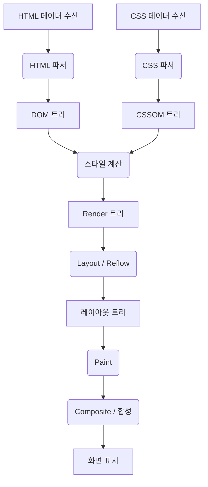
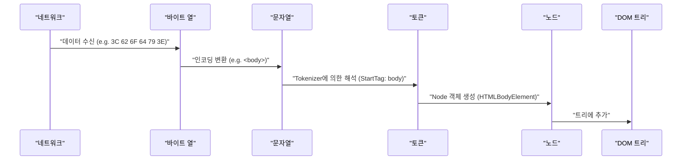
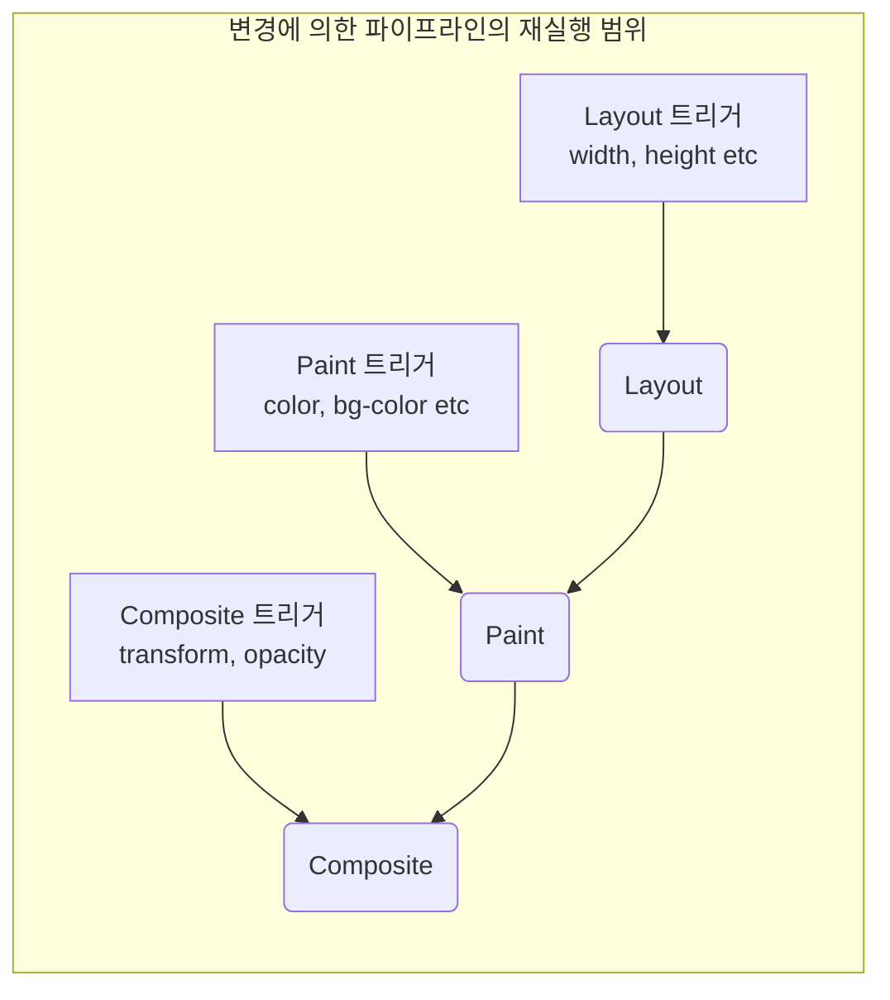

# 브라우저 렌더링의 원리: DOM 트리부터 Paint까지의 완전 해부

Web브라우저는 우리가 일상적으로 이용하는 가장 친숙하고, 또한 가장 복잡한 소프트웨어 중 하나입니다. URL을 입력한 후 화면에 페이지가 표시될 때까지, 그 내부에서는 방대한 계산과 처리가 밀리초 단위로 이루어지고 있습니다. 이 일련의 처리 흐름을 **렌더링 파이프라인 (Rendering [Pipeline](https://kenji.blog/ko/p/cicd-pipeline-github-actions-best-practices/))** 또는 **크리티컬 렌더링 패스 (Critical Rendering Path)** 라고 부릅니다.

본 문서에서는 브라우저(특히 Blink나 WebKit 등의 모던 렌더링 엔진)가 HTML, CSS, JavaScript를 어떻게 해석하고, 최종적으로 디스플레이 상의 픽셀로서 그리기(Paint)를 하는지, 그 완전한 메커니즘을 해부합니다.

## 1. 렌더링 파이프라인의 전체상

우선은 렌더링 엔진의 처리 전체상을 파악합시다. 브라우저가 네트워크에서 데이터를 받아 화면에 그리기까지의 주요 단계는 다음과 같습니다.



처리의 단계는 크게 나누어 이하의 페이즈로 분류됩니다.

1. **Parsing (파싱)** : HTML과 CSS를 해석하고, DOM (Document Object Model) 과 CSSOM (CSS Object Model) 을 구축한다.
2. **Style (스타일 계산)** : DOM과 CSSOM을 결합하여, 각 노드에 적용되는 최종적인 스타일을 계산한다.
3. **Layout (레이아웃 / 리플로우)** : 화면상의 각 요소의 정확한 위치와 크기(지오메트리 정보)를 계산한다.
4. **Paint (페인트 / 그리기)** : 요소를 픽셀로 변환하기 위한 그리기 명령(Paint Records)을 생성하고, 래스터화한다.
5. **Composite (컴포지트 / 합성)** : 그려진 여러 레이어를 올바른 순서로 겹쳐서 최종적인 화면을 생성한다.

그러면, 각 단계에 대해 상세히 살펴봅시다.

## 2. Parsing (해석): DOM 트리와 CSSOM 트리의 구축

브라우저가 서버로부터 바이트 열(HTML 데이터)을 받으면, 렌더링 엔진은 그것을 인간이나 프로그램이 이해할 수 있는 데이터 구조로 변환하기 시작합니다.

### 2.1 HTML의 파싱과 DOM 트리의 구축

HTML의 해석은 W3C(현재는 WHATWG)에서 정의된 HTML 파싱 알고리즘에 따라 수행됩니다. 이 프로세스는 다음 4개의 단계로 분해할 수 있습니다.

1. **Conversion (변환)** : 네트워크에서 받은 원시 데이터의 바이트 열을 지정된 문자 인코딩(UTF-8 등)에 기반하여 개별 문자(Characters)로 변환합니다.
2. **Tokenization (어휘 분석)** : 문자열을 W3C HTML5 표준에서 규정된 다양한 "토큰(Tokens)"으로 변환합니다. 예를 들어, `<html>` , `<body>` 등의 시작 태그, 종료 태그, 속성명과 속성값 등입니다.
3. **Lexing (구문 분석)** : 생성된 토큰을 프로퍼티와 규칙을 가진 "객체(Nodes)"로 변환합니다.
4. **DOM [Tree](https://kenji.blog/ko/p/tree-graph-data-structures-search-dfs-bfs-dijkstra/) Construction (트리 구축)** : 생성된 객체를 태그의 중첩 관계에 기반하여 트리 구조의 데이터 구조로 연결합니다. 이것이 **DOM (Document Object Model)** 입니다.



DOM 트리는 문서의 구조와 콘텐츠를 완전히 표현하고 있습니다. 그러나 이 시점에서는 "요소가 어떻게 보일지"에 대한 정보는 가지고 있지 않습니다.

### 2.2 CSS의 파싱과 CSSOM 트리의 구축

HTML 파서가 `<link>` 태그나 `<style>` 태그 등 CSS에 관한 정보를 발견하면, CSS의 해석 프로세스가 시작됩니다. CSS의 해석도 HTML과 매우 비슷한 단계를 거쳐, 최종적으로 **CSSOM (CSS Object Model)** 이라고 불리는 트리 구조를 생성합니다.

바이트 열 -> 문자열 -> 토큰 -> 노드 -> CSSOM

CSSOM은 DOM 트리의 각 노드가 어떻게 스타일링되어야 하는지를 유지하는 구조입니다. CSS의 특징으로 **캐스케이드 (Cascade)** 가 있습니다. 즉, 어떤 요소에 대한 스타일 정의는 부모 요소로부터 상속되거나, 더 상세도(Specificity)가 높은 규칙에 의해 덮어쓰여집니다. 그 때문에 CSSOM은 필연적으로 트리 구조가 됩니다.

수식을 사용하여 상세도를 표현하자면, 스타일의 우선순위는 벡터 $ S = (a, b, c) $ 로 나타납니다(a는 ID, b는 클래스, c는 태그의 수).
비교 시에는 상위 요소부터 평가됩니다.
$$
\text{상세도}(S_1, S_2) = 
\begin{cases} 
S_1 & \text{조건 } S_1 > S_2 \\\\
S_2 & \text{그 외}
\end{cases}
$$

#### CSSOM의 구축은 렌더링을 차단한다

중요한 점으로서, **CSS의 파싱은 렌더링 차단 리소스** 로 취급됩니다.
DOM의 구축은 외부 리소스를 기다리지 않고 점진적(순차적)으로 수행할 수 있지만, CSSOM은 완전히 구축될 때까지 브라우저는 후속 단계(Render 트리의 구축이나 화면 그리기)를 대기합니다.

왜냐하면 불완전한 CSSOM으로 그리기를 시작해버리면, 스타일이 계산될 때마다 화면이 다시 그려져, 깜박임(FOUC: Flash of Unstyled Content)이 발생해버리기 때문입니다.

### 2.3 JavaScript에 의한 파싱 차단

HTML에 `<script>` 태그가 포함되어 있는 경우, 브라우저의 동작은 더욱 복잡해집니다.

브라우저의 파서는 `<script>` 태그를 만나면, DOM의 구축을 **일시 정지(차단)** 합니다. 그리고 JavaScript 엔진의 제어로 넘어가 스크립트의 다운로드, 파싱, 실행이 완료되기를 기다립니다.
왜 그럴까요? 그것은 JavaScript가 `document.write()` 나 DOM API를 사용하여 파싱 중인 DOM 트리나 HTML 자체를 다시 작성할 가능성이 있기 때문입니다.

```html
<!-- DOM의 파싱이 차단되는 예 -->
<p>여기는 바로 파싱된다</p>
<script src="heavy-script.js"></script>
<!-- heavy-script.js 의 실행이 끝날 때까지, 여기는 파싱되지 않는다 -->
<p>여기가 표시되는 것은 지연된다</p>
```

#### defer 와 async 속성

이 렌더링 차단을 회피하고 성능을 향상시키기 위해, `<script>` 태그에는 `defer` 와 `async` 라는 두 가지 속성이 준비되어 있습니다.

* **async** : 스크립트 다운로드를 백그라운드에서 비동기적으로 수행합니다. 다운로드가 완료되는 즉시 HTML의 파싱을 일시 정지하고 스크립트를 실행합니다. 실행 순서는 보장되지 않습니다(먼저 다운로드가 끝난 것부터 실행). 의존 관계가 없는 액세스 해석 스크립트 등에 적합합니다.
* **defer** : 스크립트 다운로드를 비동기적으로 수행하지만, 실행은 **HTML 파싱이 완전히 끝난 후(DOMContentLoaded 이벤트 직전)** 까지 지연시킵니다. HTML상의 기술 순서대로 실행되는 것이 보장되기 때문에 DOM에 의존하는 스크립트에 적합합니다.

```mermaid
gantt
    title "스크립트 로딩 및 실행"
    dateFormat  s
    axisFormat %s

    section "일반 스크립트"
    "HTML 해석"       :active, a1, 0, 2s
    "JS 다운로드" :crit, a2, 2s, 4s
    "JS 실행"         :crit, a3, 4s, 6s
    "HTML 해석 재개"   :active, a4, 6s, 8s

    section "async 속성"
    "HTML 해석"       :active, b1, 0, 5s
    "JS 다운로드" :crit, b2, 2s, 4s
    "JS 실행"         :crit, b3, 5s, 7s
    "HTML 해석 재개"   :active, b4, 7s, 9s

    section "defer 속성"
    "HTML 해석"       :active, c1, 0, 6s
    "JS 다운로드" :crit, c2, 1s, 4s
    "JS 실행"         :crit, c3, 6s, 8s
```
*(※실제 `async` 는 다운로드 완료 후 바로 실행하기 때문에 파싱을 중단시킵니다.)*

## 3. Style (스타일 계산): Render 트리의 구축

DOM 트리와 CSSOM 트리가 완성되면, 브라우저는 이들을 조합하여 **Render 트리 (Render [Tree](https://kenji.blog/ko/p/tree-graph-data-structures-search-dfs-bfs-dijkstra/))** 또는 **스타일 트리 (Style Tree)** 를 구축합니다.

이 페이즈에서는 DOM 트리의 각 노드에 대해 CSSOM의 어느 스타일 규칙이 적용될지를 계산하고, 최종적인 계산된 스타일(Computed Style)을 결정합니다.

### 3.1 Render 트리에 포함되는 것, 포함되지 않는 것

Render 트리는 **화면에 표시되는 모든 요소** 의 시각적인 정보를 가지는 트리입니다. 따라서 DOM 트리와 완전히 1대1로 대응하는 것은 아닙니다.

* **포함되지 않는 것** :
    * `<head>` , `<meta>` , `<script>` 등의 비표시 요소.
    * CSS에서 `display: none;` 이 설정되어 있는 요소(및 그 자손 요소).
* **포함되는 것** :
    * 표시되는 DOM 노드.
    * 의사 요소( `::before` , `::after` 등). 이들은 DOM에는 존재하지 않지만 Render 트리에는 추가됩니다.
    * `visibility: hidden;` 이 설정된 요소. 보이지 않지만 공간을 점유하기 때문에(레이아웃에 영향을 미치기 때문에) Render 트리에 포함됩니다.

### 3.2 스타일 계산의 복잡성

요소에 대해 어느 CSS 규칙이 적용될지를 결정하는 프로세스는 매우 계산 비용이 높은 처리입니다.
브라우저는 셀렉터 매칭(Selector Matching)을 수행할 때 **오른쪽에서 왼쪽으로 (Right-to-Left)** 평가를 수행합니다.

예를 들어, 다음과 같은 CSS 규칙이 있다고 가정해 봅시다.

```css
.container div .item p {
    color: red;
}
```

브라우저는 먼저 모든 `<p>` 태그를 찾습니다(이것이 가장 오른쪽의 키 셀렉터입니다). 다음으로, 그 `<p>` 의 부모 요소 트리를 따라가며 클래스가 `.item` 인 요소가 존재하는지 확인하고, 다시 그 부모에 `div` 가 있는지, 다시 그 부모에 `.container` 가 있는지를 확인합니다.

왜 오른쪽에서 왼쪽일까요? 그것은 DOM 트리가 거대해졌을 때 왼쪽에서 오른쪽으로 탐색하면 "일치하지 않는 자손 요소"를 무수히 탐색하게 되어 현저하게 성능이 저하되기 때문입니다. 오른쪽에서 왼쪽으로 탐색함으로써 대상이 되는 요소를 빠르게 좁힐 수 있습니다.

따라서 다음과 같이 너무 상세하거나 장황한 셀렉터는 스타일 계산 성능을 저하시키는 원인이 됩니다.

```css
/* 나쁜 예: 브라우저는 모든 a태그를 조사하고 그 부모가 span, li, ul, div인지를 순서대로 따라가야 한다 */
div ul li span a { color: blue; }

/* 좋은 예: BEM 등의 설계 수법을 이용하여 플랫하게 클래스를 직접 지정한다 */
.nav-link { color: blue; }
```

## 4. Layout (레이아웃 / 리플로우): 요소의 배치와 크기 계산

Render 트리(스타일 정보를 가진 노드의 집합)가 구축되면 다음은 **Layout (레이아웃)** 페이즈로 들어갑니다. WebKit 계열의 브라우저에서는 이를 **Reflow (리플로우)** 라고 부르기도 합니다.

이 페이즈에서는 브라우저의 Viewport(창의 표시 영역) 크기를 기준으로 하여 Render 트리의 각 노드가 화면상의 **어디에 (Position)** , **얼마나 큰 크기로 (Size)** 배치되어야 하는지를 정확하게 계산합니다.

### 4.1 박스 모델과 플로우 레이아웃

브라우저 레이아웃의 기본은 **박스 모델 (Box Model)** 입니다. 모든 요소는 콘텐츠 (Content) , 패딩 (Padding) , 테두리 (Border) , 마진 (Margin) 을 가지는 직사각형 박스로 계산됩니다.

레이아웃 계산은 보통 Render 트리의 루트( `<html>` 요소, 초기 포함 블록)에서 시작하여 재귀적으로 자식 요소로 내려갑니다.

1. **부모에서 자식으로** : 부모 박스는 자신의 너비를 결정하고, 자식 박스에 이용 가능한 너비를 전달합니다.
2. **자식에서 부모로** : 자식 박스는 자신의 높이를 결정하고(콘텐츠 기반), 부모 박스에 전달합니다. 부모 박스는 자식 박스의 높이 합계로부터 자신의 최종적인 높이를 결정합니다.

이 위에서 아래로의 한 번의 패스로 대부분의 레이아웃이 결정되는 구조를 **플로우 레이아웃 (Flow Layout)** 이라고 부릅니다(※테이블이나 Flexbox/Grid 등은 더 복잡한 여러 패스가 필요한 경우가 있습니다).

### 4.2 글로벌 레이아웃과 인크리멘탈 레이아웃

레이아웃 계산에는 화면 전체를 재계산하는 **글로벌 레이아웃** 과 변경이 있었던 부분만 재계산하는 **인크리멘탈 레이아웃** 의 2종류가 있습니다.

* **글로벌 레이아웃** : 창의 크기 변경(리사이즈), 디바이스의 방향 변경, 루트 요소의 폰트 크기 변경 등이 수행된 경우, Render 트리 전체의 레이아웃 계산을 다시 합니다. 이것은 매우 비용이 높은 처리입니다.
* **인크리멘탈 레이아웃** : JavaScript에 의해 일부 요소의 크기가 변경되거나, DOM 노드가 추가/삭제된 경우, 브라우저는 해당 요소와 영향을 받을 가능성이 있는 요소(형제 요소나 부모 요소)만을 "Dirty(더러워진)"로 표시하고, 비동기적으로 그 부분만을 다시 계산합니다. 이것을 **Dirty bit system** 이라고 부릅니다.

### 4.3 레이아웃 스래싱 (Layout Thrashing) 과 성능

JavaScript로 DOM의 스타일을 변경하고 바로 그 계산 결과(높이나 너비 등)를 읽으려고 하면, 브라우저는 최적화를 위해 지연시켰던 레이아웃 계산을 **강제적으로, 즉시 (Synchronous Layout)** 실행해야만 합니다.

이것을 루프 안 등에서 연속하여 수행하는 것을 **레이아웃 스래싱 (Layout Thrashing)** 이라고 부르며, 프레임 속도를 현저하게 저하시키는 심각한 성능 문제를 야기합니다.

**【레이아웃 스래싱을 일으키는 나쁜 코드 예】**

```javascript
const elements = document.querySelectorAll('.box');

// 나쁜 예: DOM의 읽기(offsetWidth)와 쓰기(style.width)가 번갈아 발생
for (let i = 0; i < elements.length; i++) {
    // offsetWidth를 읽기 위해 브라우저는 강제로 레이아웃 계산을 실행
    const width = elements[i].offsetWidth;
    // 스타일을 씀으로써 DOM이 "Dirty"해진다
    elements[i].style.width = width + 10 + 'px';
    // 다음 루프에서 다시 offsetWidth를 읽기 위해, 다시 강제 레이아웃이 발생... (이하 루프)
}
```

**【개선책: 읽기와 쓰기의 분리 (Batching)】**

```javascript
const elements = document.querySelectorAll('.box');
const widths = [];

// 좋은 예: 페이즈 1 - 모든 요소의 너비를 한꺼번에 읽는다(레이아웃은 1회만 발생)
for (let i = 0; i < elements.length; i++) {
    widths.push(elements[i].offsetWidth);
}

// 좋은 예: 페이즈 2 - 모든 요소의 스타일을 한꺼번에 쓴다
for (let i = 0; i < elements.length; i++) {
    elements[i].style.width = widths[i] + 10 + 'px';
}
// 이 후 브라우저의 그리기 타이밍에 한꺼번에 1회만 레이아웃이 다시 계산된다
```

최근에는 `FastDOM` 과 같은 라이브러리를 이용하거나 `requestAnimationFrame` 을 적절히 사용하여 DOM의 읽기 쓰기를 일괄 처리하는 방법이 일반적입니다.

## 5. Paint (페인트 / 그리기): 픽셀의 생성

레이아웃 페이즈에 의해 각 요소의 박스 위치(X, Y 좌표)와 크기(너비, 높이)가 확정되었습니다. 그러나 아직 화면에는 아무것도 그려지지 않았습니다. 다음에 수행되는 것이 **Paint (페인트)** 페이즈입니다.

Paint 페이즈의 목적은 레이아웃 트리(Layout [Tree](https://kenji.blog/ko/p/tree-graph-data-structures-search-dfs-bfs-dijkstra/))를 입력으로 받아, 화면상의 픽셀을 어떻게 칠할지에 대한 절차(Paint Records)를 생성하고, 최종적으로 래스터화(Rasterization)하는 것입니다.

### 5.1 페인트의 순서 (Stacking Context)

단순히 요소를 HTML에 작성된 순서대로 그리기만 하면 되는 것은 아닙니다. CSS에는 `z-index` , 절대 위치( `position: absolute;` ), 불투명도( `opacity` ), 3D 트랜스폼 등의 속성이 있으며, 이들은 요소가 겹치는 순서(Z축 순서)에 영향을 미칩니다.

이것을 관리하는 메커니즘이 **쌓임 문맥 (Stacking Context: 겹침 컨텍스트)** 입니다.

브라우저는 CSS 2.1 사양에 정해진 엄격한 페인트 순서에 따라 그리기 명령을 생성합니다. 일반적인 블록 요소의 페인트 순서는 다음과 같습니다.

1. background-color (배경색)
2. background-image (배경 이미지)
3. border (테두리)
4. children (자식 요소 그리기)
5. outline (아웃라인)

### 5.2 Paint Records 와 Display List

최근의 모던 브라우저(Chrome의 Blink 등)에서는 Paint 페이즈가 직접 픽셀을 메모리에 쓰는 것이 아니라, **Paint Records (그리기 레코드)** 의 목록(Display List)을 생성하는 처리로 바뀌고 있습니다.

Paint Record는 "이 좌표에 이 색으로 사각형을 그린다", "이 텍스트를 지정된 폰트로 그린다"와 같은 구체적인 그리기 명령의 목록입니다.

```json
// Paint Record의 개념적인 이미지
[
  { "action": "drawRect", "rect": [0, 0, 100, 100], "color": "blue" },
  { "action": "drawText", "text": "Hello", "pos": [10, 20], "font": "Arial" }
]
```

왜 목록화할까요? 그것은 약간의 변경이 있을 때마다 모든 것을 다시 그리는 것이 아니라, 그리기 명령 목록을 유지해두고 변경된 부분의 명령만을 갱신 및 재실행하는 것이 더 효율적이기 때문입니다.

### 5.3 래스터화 (Rasterization) 와 멀티스레드화

생성된 Paint Records (Display List)는 실제로 픽셀(비트맵 데이터)로 변환되어야 합니다. 이 프로세스를 **래스터화 (Rasterization)** 라고 부릅니다.

스크롤할 때마다 페이지 전체를 래스터화하는 것은 비효율적입니다. 그 때문에 브라우저는 화면을 **타일 (Tiles)** 이라고 불리는 여러 작은 직사각형 영역(예: 256x256 픽셀 등)으로 나누어 관리합니다.

현재의 Chrome 등에서는 래스터화가 메인 스레드(JavaScript의 실행이나 Layout이 수행되는 스레드)가 아니라 전용 **래스터라이저 스레드 (Rasterizer Threads)** 에서 병렬 처리(Threaded Rasterization)됩니다. 나아가 많은 래스터화 작업은 하드웨어 가속을 활용하여 **GPU** 상에서 고속으로 실행됩니다.

## 6. Composite (컴포지트 / 합성): 레이어의 겹침

래스터화가 완료되고 각 타일의 픽셀 데이터가 생성(보통은 GPU 메모리 상에 텍스처로서 저장)되면, 마지막 단계인 **Composite (합성)** 페이즈로 들어갑니다.

복잡한 Web 페이지에서는 드롭 섀도우가 적용된 헤더, 앞쪽에 고정된 모달 창, 스크롤되는 배경 이미지 등 요소들이 서로 겹쳐 있습니다. 이 요소들을 모두 하나의 캔버스에 덧칠해버리면 스크롤이나 일부 애니메이션마다 광범위한 다시 그리기(Paint 및 Rasterization)가 필요하게 되어 성능이 저하됩니다.

그래서 브라우저는 페이지를 여러 개의 독립된 **레이어 (Graphics Layers)** 로 나누어 관리합니다.

### 6.1 레이어화의 원리

브라우저의 내부에서는 여러 트리 구조가 변환되어 갑니다.

1. **DOM [Tree](https://kenji.blog/ko/p/tree-graph-data-structures-search-dfs-bfs-dijkstra/)**
2. **Layout Tree (Render Tree)** : 시각 요소의 지오메트리 정보
3. **Paint Tree (Layer Tree)** : 쌓임 문맥 등에 기반한 레이어의 계층 구조
4. **Graphics Layer Tree** : 실제로 GPU에서 합성되는 독립적인 레이어군

특정한 CSS 속성을 가지는 요소는 브라우저에 의해 독립된 "Graphics Layer(그래픽스 레이어)"로 승격(Promote)됩니다.

레이어가 생성되는 주요 조건(트리거)은 다음과 같습니다.

* 3D 또는 투시 트랜스폼( `transform: translateZ(0)` , `translate3d(...)` )
* `<video>` 나 `<canvas>` 요소
* CSS 애니메이션이나 트랜지션에서 불투명도( `opacity` )나 트랜스폼( `transform` )을 변화시키는 요소
* `will-change` 속성이 지정된 요소(예: `will-change: transform;` )
* 이미 독립된 레이어 위에 올려져 있는 요소(오버랩의 사정상)

### 6.2 컴포지터 스레드와 하드웨어 가속

레이어의 합성은 메인 스레드와는 독립된 **컴포지터 스레드 (Compositor Thread)** 라고 불리는 전용 스레드에서 수행됩니다.

각 레이어의 래스터화된 비트맵 텍스처는 GPU로 전송됩니다. 컴포지터 스레드는 "레이어 A를 X좌표 100, Y좌표 200에 배치하고, 레이어 B를 그 위에 불투명도 0.5로 겹쳐라"와 같은 합성 지시(Compositor Frame)를 GPU에 보냅니다. GPU는 이 이미지들을 매우 빠르게 합성하여 최종적인 화면을 디스플레이에 출력합니다.

#### 메인 스레드에서 독립된 스크롤과 애니메이션

컴포지터 스레드가 메인 스레드로부터 독립되어 있는 것은 성능상 매우 중요합니다.

만약 JavaScript의 실행에 시간이 걸려 메인 스레드가 차단(프리즈)되어 버리더라도, 사용자가 마우스로 스크롤한 경우 컴포지터 스레드는 이미 GPU에 있는 레이어 텍스처를 조금 이동시켜 합성하기만 하면 됩니다. 이로 인해 JavaScript가 무거운 페이지라도 스크롤 자체는 부드럽게(Jank-free) 움직이게 되어 있습니다.

이것을 최대한 살릴 수 있는 것이 `transform` 과 `opacity` 에 의한 애니메이션입니다.

### 6.3 CSS Trigger: 애니메이션의 성능 최적화

Web 성능 최적화에 있어서 가장 중요한 개념 중 하나가 **CSS Triggers** 입니다.
JavaScript나 CSS로 요소의 스타일을 변경했을 때, 브라우저 렌더링 파이프라인의 어느 단계부터 다시 시작해야 하는지(Layout부터인지, Paint부터인지, Composite부터인지)는 변경하는 속성에 따라 결정됩니다.

1. **Layout (Reflow) 을 트리거하는 속성**
    * `width` , `height` , `margin` , `padding` , `top` , `left` , `font-size` 등.
    * 지오메트리 정보가 변경되기 때문에 Layout → Paint → Composite의 모든 파이프라인을 재실행합니다. 매우 무거운 처리입니다. 애니메이션에는 부적합합니다.
2. **Paint (Repaint) 를 트리거하는 속성**
    * `color` , `background-color` , `box-shadow` 등.
    * 요소의 크기나 위치는 변하지 않지만 겉모습이 변하기 때문에 Paint → Composite를 재실행합니다. Layout보다는 가볍지만 픽셀을 다시 그리는 작업이 발생하므로 부하가 걸립니다.
3. **Composite 만을 트리거하는 속성**
    * `transform` ( `translate` , `scale` , `rotate` )
    * `opacity`
    * 이들은 요소의 지오메트리나 개별 픽셀의 색을 변경하지 않습니다. 요소는 이미 독립된 레이어(텍스처)로서 GPU에 존재하기 때문에, 브라우저는 GPU에 "텍스처의 위치를 옮겨서 합성해(transform)", "반투명으로 합성해(opacity)"라고 지시를 내리기만 하면 됩니다. 메인 스레드의 Layout이나 Paint를 완전히 생략할 수 있으므로, **60fps의 부드러운 애니메이션을 구현하기 위해서는 필수** 인 기법입니다.



#### will-change 속성의 활용

`will-change` 는 개발자가 브라우저에게 "이 요소의 특정 속성은 미래에 변경될 예정이다"라고 미리 알리기 위한 CSS 속성입니다.

```css
.animated-box {
    /* 브라우저에 transform이 변경될 것을 미리 알리고 전용 레이어를 생성하게 한다 */
    will-change: transform;
    transition: transform 0.3s ease;
}
.animated-box:hover {
    transform: translateX(100px);
}
```

브라우저는 `will-change: transform` 을 보면 애니메이션이 시작되기 "전"에 그 요소를 독립된 레이어로 승격시키고, GPU에 텍스처를 준비해 둡니다. 이로 인해 실제로 호버하여 애니메이션이 시작되는 순간의 끊김(Paint에 의한 지연)을 방지할 수 있습니다.

단, 레이어 생성에는 메모리를 소비하기 때문에 페이지 내의 모든 요소에 `will-change` 를 지정하면 오히려 브라우저가 크래시되거나 성능이 저하됩니다. 필요한 요소에만 적절하게 사용하는 것이 중요합니다.

## 7. 요약

브라우저가 HTML을 받아서 화면에 픽셀을 그리기까지의 "DOM 트리부터 Paint(그리고 Composite)까지의 완전한 원리"를 살펴보았습니다.

1. **Parsing** : HTML/CSS를 해석하고 DOM과 CSSOM을 구축한다. JavaScript(특히 동기 스크립트)는 이를 차단한다.
2. **Style** : DOM과 CSSOM을 결합하여 표시되는 요소와 그 스타일을 가진 Render 트리를 구축한다.
3. **Layout** : 화면상 각 요소의 정확한 위치(좌표)와 크기를 계산한다.
4. **Paint** : 그리기 명령(Paint Records)을 생성하고 전용 스레드에서 픽셀로 래스터화한다.
5. **Composite** : 독립된 레이어를 GPU 상에서 합성하여 최종적인 화면을 출력한다.

이 메커니즘을 깊이 이해하는 것은 프런트엔드 개발자에게 단순한 지식에 그치지 않습니다.
"왜 `width` 로 애니메이션시키면 끊기는가?"
"왜 `script` 태그는 `body` 닫는 태그 직전에 두거나 `defer` 를 사용해야 하는가?"
"React나 Vue 등의 가상 DOM이 왜 고속으로 동작하는가? (= DOM 액세스와 Layout/Paint의 일괄 처리 및 최소화)"

이 모든 것에 대한 답이 이 렌더링 파이프라인 안에 존재합니다. 원리를 아는 것으로, 더 성능이 높고 사용자 경험이 뛰어난 Web 애플리케이션을 구축할 수 있게 될 것입니다.
