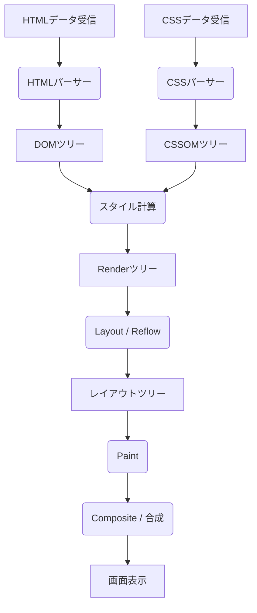
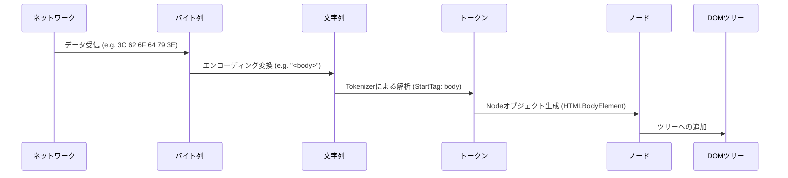
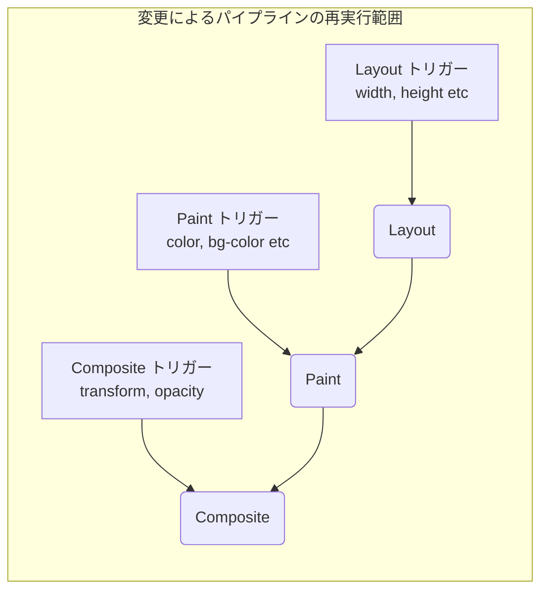

# ブラウザレンダリングの仕組み：DOMツリーからPaintまでの完全解剖

Webブラウザは、私たちが日常的に利用する最も身近で、かつ最も複雑なソフトウェアの一つです。URLを入力してから画面にページが表示されるまで、その内部では膨大な計算と処理がミリ秒単位で行われています。この一連の処理の流れを **レンダリング[パイプライン](https://kenji.blog/p/cicd-pipeline-github-actions-best-practices/) (Rendering [Pipeline](https://kenji.blog/p/cicd-pipeline-github-actions-best-practices/))** または **クリティカルレンダリングパス (Critical Rendering Path)** と呼びます。

本記事では、ブラウザ（特にBlinkやWebKitなどのモダンなレンダリングエンジン）がHTML、CSS、JavaScriptをどのように解釈し、最終的にディスプレイ上のピクセルとして描画（Paint）するのか、その完全なメカニズムを解剖します。

## 1. レンダリングパイプラインの全体像

まずは、レンダリングエンジンの処理の全体像を把握しましょう。ブラウザがネットワークからデータを受け取ってから画面に描画するまでの主要なステップは以下のようになります。



処理のステップは大きく分けて以下のフェーズに分類されます。

1.  **Parsing (パース)** : HTMLとCSSを解析し、DOM (Document Object Model) と CSSOM (CSS Object Model) を構築する。
2.  **Style (スタイル計算)** : DOMとCSSOMを結合し、各ノードに適用される最終的なスタイルを計算する。
3.  **Layout (レイアウト / リフロー)** : 画面上の各要素の正確な位置とサイズ（ジオメトリ情報）を計算する。
4.  **Paint (ペイント / 描画)** : 要素をピクセルに変換するための描画命令（Paint Records）を生成し、ラスタライズする。
5.  **Composite (コンポジット / 合成)** : 描画された複数のレイヤーを正しい順序で重ね合わせて最終的な画面を生成する。

それでは、各ステップについて詳細に見ていきましょう。

## 2. Parsing（解析）：DOMツリーとCSSOMツリーの構築

ブラウザがサーバーからバイト列（HTMLデータ）を受け取ると、レンダリングエンジンはそれを人間やプログラムが理解できるデータ構造に変換し始めます。

### 2.1 HTMLのパースとDOMツリーの構築

HTMLの解析は、W3C（現在はWHATWG）で定義されているHTMLパージングアルゴリズムに従って行われます。このプロセスは以下の4つのステップに分解できます。

1.  **Conversion (変換)** : ネットワークから受け取った生データのバイト列を、指定された文字エンコーディング（UTF-8など）に基づいて個々の文字（Characters）に変換します。
2.  **Tokenization (字句解析)** : 文字列をW3C HTML5標準で規定された様々な「トークン（Tokens）」に変換します。例えば、 `<html>` 、 `<body>` などの開始タグ、終了タグ、属性名と属性値などです。
3.  **Lexing (構文解析)** : 生成されたトークンを、プロパティとルールを持つ「オブジェクト（Nodes）」に変換します。
4.  **DOM Tree Construction (ツリー構築)** : 作成されたオブジェクトを、タグのネスト関係に基づいてツリー状のデータ構造にリンクさせます。これが **DOM (Document Object Model)** です。



DOMツリーは、ドキュメントの構造とコンテンツを完全に表現しています。しかし、この時点では「要素がどのように見えるか」という情報は持っていません。

### 2.2 CSSのパースとCSSOMツリーの構築

HTMLパーサーが `<link>` タグや `<style>` タグなど、CSSに関する情報を見つけると、CSSの解析プロセスが開始されます。CSSの解析もHTMLと非常に似たステップを辿り、最終的に **CSSOM (CSS Object Model)** と呼ばれるツリー構造を生成します。

バイト列 -> 文字列 -> トークン -> ノード -> CSSOM

CSSOMは、DOMツリーの各ノードがどのようにスタイリングされるべきかを保持する構造です。CSSの特徴として **カスケード（Cascade）** があります。つまり、ある要素に対するスタイル定義は、親要素から継承されたり、より詳細度（Specificity）の高いルールによって上書きされたりします。そのため、CSSOMは必然的にツリー構造になります。

数式を用いて詳細度を表現するならば、スタイルの優先度はベクトル $ S = (a, b, c) $ で表されます（aはID、bはクラス、cはタグの数）。
比較の際には上位の要素から評価されます。
$$
\text{Specificity}(S_1, S_2) = 
\begin{cases} 
S_1 & \text{if } S_1 > S_2 \\\\
S_2 & \text{otherwise}
\end{cases}
$$

#### CSSOMの構築はレンダリングをブロックする

重要な点として、 **CSSのパースはレンダリングブロックリソース** として扱われます。
DOMの構築は、外部リソースを待たずにインクリメンタル（逐次的）に行うことができますが、CSSOMは完全に構築されるまで、ブラウザは後続のステップ（Renderツリーの構築や画面描画）を待機します。

なぜなら、不完全なCSSOMで描画を始めてしまうと、スタイルが計算されるたびに画面が再描画され、チラつき（FOUC: Flash of Unstyled Content）が発生してしまうからです。

### 2.3 JavaScriptによるパースのブロック

HTMLに `<script>` タグが含まれている場合、ブラウザの挙動はさらに複雑になります。

ブラウザのパーサーは `<script>` タグに遭遇すると、DOMの構築を **一時停止（ブロック）** します。そして、JavaScriptエンジンの制御に移り、スクリプトのダウンロード、パース、実行が完了するのを待ちます。
なぜでしょうか？それは、JavaScriptが `document.write()` や DOM API を使って、パース中のDOMツリーやHTML自体を書き換える可能性があるためです。

```html
<!-- DOMのパースがブロックされる例 -->
<p>ここはすぐにパースされる</p>
<script src="heavy-script.js"></script>
<!-- heavy-script.js の実行が終わるまで、ここはパースされない -->
<p>ここが表示されるのは遅れる</p>
```

#### defer と async 属性

このレンダリングブロックを回避し、パフォーマンスを向上させるために、 `<script>` タグには `defer` と `async` という2つの属性が用意されています。

*   **async** : スクリプトのダウンロードをバックグラウンドで非同期に行います。ダウンロードが完了次第、HTMLのパースを一時停止してスクリプトを実行します。実行順序は保証されません（先にダウンロードが終わったものから実行）。依存関係のないアクセス解析スクリプトなどに適しています。
*   **defer** : スクリプトのダウンロードを非同期で行いますが、実行は **HTMLのパースが完全に終わった後（DOMContentLoadedイベントの直前）** まで遅延させます。HTML上の記述順に実行されることが保証されるため、DOMに依存するスクリプトに適しています。

```mermaid
gantt
    title スクリプトの読み込みと実行
    dateFormat  s
    axisFormat %s

    section 通常のスクリプト
    HTML解析       :active, a1, 0, 2s
    JSダウンロード :crit, a2, 2s, 4s
    JS実行         :crit, a3, 4s, 6s
    HTML解析再開   :active, a4, 6s, 8s

    section async属性
    HTML解析       :active, b1, 0, 5s
    JSダウンロード :crit, b2, 2s, 4s
    JS実行         :crit, b3, 5s, 7s
    HTML解析再開   :active, b4, 7s, 9s

    section defer属性
    HTML解析       :active, c1, 0, 6s
    JSダウンロード :crit, c2, 1s, 4s
    JS実行         :crit, c3, 6s, 8s
```
*(※実際の `async` はダウンロード完了後すぐに実行するため、パースを中断させます。)*

## 3. Style（スタイル計算）：Renderツリーの構築

DOMツリーとCSSOMツリーが完成すると、ブラウザはそれらを組み合わせて **Renderツリー (Render Tree)** または **スタイルツリー (Style Tree)** を構築します。

このフェーズでは、DOMツリーの各ノードに対して、CSSOMのどのスタイルルールが適用されるかを計算し、最終的な計算済みスタイル（Computed Style）を決定します。

### 3.1 Renderツリーに含まれるもの、含まれないもの

Renderツリーは、 **画面に表示されるすべての要素** の視覚的な情報を持つツリーです。そのため、DOMツリーと完全に1対1で対応するわけではありません。

*   **含まれないもの** :
    *   `<head>` 、 `<meta>` 、 `<script>` などの非表示要素。
    *   CSSで `display: none;` が設定されている要素（およびその子孫要素）。
*   **含まれるもの** :
    *   表示されるDOMノード。
    *   疑似要素（ `::before` , `::after` など）。これらはDOMには存在しませんが、Renderツリーには追加されます。
    *   `visibility: hidden;` が設定された要素。見えませんが、空間を占有するため（レイアウトに影響するため）Renderツリーには含まれます。

### 3.2 スタイル計算の複雑さ

要素に対してどのCSSルールが適用されるかを決定するプロセスは、非常に計算コストが高い処理です。
ブラウザはセレクタの照合（Selector Matching）を行う際、 **右から左へ（Right-to-Left）** 評価を行います。

例えば、以下のようなCSSルールがあったとします。

```css
.container div .item p {
    color: red;
}
```

ブラウザはまず、すべての `<p>` タグを見つけます（これが一番右のキーセレクタです）。次に、その `<p>` の親要素ツリーを辿り、クラスが `.item` である要素が存在するかチェックし、さらにその親に `div` があるか、さらにその親に `.container` があるかをチェックします。

なぜ右から左なのか？それはDOMツリーが巨大になった場合、左から右へ探索すると「一致しない子孫要素」を無数に探索する羽目になり、著しくパフォーマンスが低下するからです。右から左へ探索することで、対象となる要素をいち早く絞り込むことができます。

したがって、以下のように詳細すぎる、あるいは冗長なセレクタは、スタイル計算のパフォーマンスを低下させる原因となります。

```css
/* 悪い例：ブラウザはすべてのaタグを調べ、その親がspan, li, ul, divであるかを順に辿る必要がある */
div ul li span a { color: blue; }

/* 良い例：BEMなどの設計手法を用い、フラットでクラス直接指定にする */
.nav-link { color: blue; }
```

## 4. Layout（レイアウト / リフロー）：要素の配置とサイズ計算

Renderツリー（スタイル情報を持ったノードの集合）が構築されると、次は **Layout (レイアウト)** フェーズに入ります。WebKit系のブラウザではこれを **Reflow (リフロー)** と呼ぶこともあります。

このフェーズでは、ブラウザのViewport（ウィンドウの表示領域）のサイズを基準にして、Renderツリーの各ノードが画面上の **どこに (Position) 、どれくらいの大きさで (Size)** 配置されるべきかを正確に計算します。

### 4.1 ボックスモデルとフロー・レイアウト

ブラウザのレイアウトの基本は **ボックスモデル (Box Model)** です。すべての要素は、コンテンツ (Content) 、パディング (Padding) 、境界線 (Border) 、マージン (Margin) を持つ矩形のボックスとして計算されます。

レイアウトの計算は、通常Renderツリーのルート（ `<html>` 要素、初期包含ブロック）から始まり、再帰的に子要素へと降りていきます。

1.  **親から子へ** : 親ボックスは自身の幅を決定し、子ボックスに利用可能な幅を伝えます。
2.  **子から親へ** : 子ボックスは自身の高さを決定し（コンテンツに基づく）、親ボックスに伝えます。親ボックスは子ボックスの高さの合計から自身の最終的な高さを決定します。

この上から下への一度のパスで大部分のレイアウトが決定される仕組みを **フロー・レイアウト (Flow Layout)** と呼びます（※テーブルやFlexbox/Gridなどはより複雑な複数パスを必要とする場合があります）。

### 4.2 グローバルレイアウトとインクリメンタルレイアウト

レイアウト計算には、画面全体を再計算する **グローバルレイアウト** と、変更があった部分のみを再計算する **インクリメンタルレイアウト** の2種類があります。

*   **グローバルレイアウト** : ウィンドウのサイズ変更（リサイズ）、デバイスの向きの変更、ルート要素のフォントサイズ変更などが行われた場合、Renderツリー全体のレイアウト計算がやり直されます。これは非常にコストが高い処理です。
*   **インクリメンタルレイアウト** : JavaScriptによって一部の要素のサイズが変更されたり、DOMノードが追加/削除された場合、ブラウザはその要素と、影響を受ける可能性のある要素（兄弟要素や親要素）のみを「Dirty (汚れた)」とマークし、非同期にその部分だけを再計算します。これを **Dirty bit system** と呼びます。

### 4.3 レイアウトスラッシング (Layout Thrashing) とパフォーマンス

JavaScriptでDOMのスタイルを変更し、すぐにその計算結果（高さや幅など）を読み取ろうとすると、ブラウザは最適化のために遅延させていたレイアウト計算を **強制的に、即座に (Synchronous Layout)** 実行しなければならなくなります。

これをループ内などで連続して行ってしまうことを **レイアウトスラッシング (Layout Thrashing)** と呼び、フレームレートを著しく低下させる深刻なパフォーマンス問題を引き起こします。

**【レイアウトスラッシングを引き起こす悪いコード例】**

```javascript
const elements = document.querySelectorAll('.box');

// 悪い例：DOMの読み取り（offsetWidth）と書き込み（style.width）が交互に発生
for (let i = 0; i < elements.length; i++) {
    // offsetWidthを読み取るため、ブラウザは強制的にレイアウト計算を実行
    const width = elements[i].offsetWidth;
    // スタイルを書き込むことで、DOMが「Dirty」になる
    elements[i].style.width = width + 10 + 'px';
    // 次のループで再びoffsetWidthを読み取るため、再度強制レイアウトが発生...（以下ループ）
}
```

**【改善策：読み取りと書き込みの分離 (Batching)】**

```javascript
const elements = document.querySelectorAll('.box');
const widths = [];

// 良い例：フェーズ1 - 全ての要素の幅をまとめて読み取る（レイアウトは1回のみ発生）
for (let i = 0; i < elements.length; i++) {
    widths.push(elements[i].offsetWidth);
}

// 良い例：フェーズ2 - 全ての要素のスタイルをまとめて書き込む
for (let i = 0; i < elements.length; i++) {
    elements[i].style.width = widths[i] + 10 + 'px';
}
// この後のブラウザの描画タイミングで、まとめて1回だけレイアウトが再計算される
```

最近では `FastDOM` のようなライブラリを利用したり、 `requestAnimationFrame` を適切に用いてDOMの読み書きをバッチ化する手法が一般的です。

## 5. Paint（ペイント / 描画）：ピクセルの生成

レイアウトフェーズによって、各要素のボックスの位置（X, Y座標）とサイズ（幅、高さ）が確定しました。しかし、まだ画面には何も描画されていません。次に行われるのが **Paint (ペイント)** フェーズです。

Paintフェーズの目的は、レイアウトツリー（Layout Tree）を入力として受け取り、画面上のピクセルをどのように塗るかの手順（Paint Records）を作成し、最終的にラスタライズ（Rasterization）することです。

### 5.1 ペイントの順序 (Stacking Context)

単純に要素をHTMLに書かれた順番通りに描画すれば良いというわけではありません。CSSには `z-index` 、絶対配置（ `position: absolute;` ）、不透明度（ `opacity` ）、3Dトランスフォームなどのプロパティがあり、これらは要素が重なり合う順序（Z軸の順序）に影響を与えます。

これを管理する仕組みが **スタッキングコンテキスト (Stacking Context: 重ね合わせコンテキスト)** です。

ブラウザはCSS 2.1仕様で定められた厳密なペイント順序に従って描画命令を生成します。一般的なブロック要素のペイント順序は以下の通りです。

1.  background-color（背景色）
2.  background-image（背景画像）
3.  border（境界線）
4.  children（子要素の描画）
5.  outline（アウトライン）

### 5.2 Paint Records と Display List

最近のモダンブラウザ（ChromeのBlinkなど）では、Paintフェーズは直接ピクセルをメモリに書き込むのではなく、 **Paint Records (描画レコード)** のリスト（Display List）を生成する処理に変わっています。

Paint Record は、「この座標に、この色で四角形を描く」「このテキストを指定のフォントで描画する」といった具体的な描画命令のリストです。

```json
// Paint Recordの概念的なイメージ
[
  { "action": "drawRect", "rect": [0, 0, 100, 100], "color": "blue" },
  { "action": "drawText", "text": "Hello", "pos": [10, 20], "font": "Arial" }
]
```

なぜリスト化するのでしょうか？それは、少しの変更があるたびにすべてを再描画するのではなく、描画命令のリストを保持しておき、変更があった部分の命令だけを更新・再実行する方が効率的だからです。

### 5.3 ラスタライズ (Rasterization) とマルチスレッド化

生成された Paint Records（Display List）は、実際にピクセル（ビットマップデータ）に変換される必要があります。このプロセスを **ラスタライズ (Rasterization)** と呼びます。

スクロールするたびにページ全体をラスタライズするのは非効率です。そのため、ブラウザは画面を **タイル (Tiles)** と呼ばれる複数の小さな矩形領域（例えば 256x256 ピクセルなど）に分割して管理します。

現在のChromeなどでは、ラスタライズはメインスレッド（JavaScriptの実行やLayoutが行われるスレッド）ではなく、専用の **ラスタライザースレッド (Rasterizer Threads)** で並列処理（Threaded Rasterization）されます。さらに、多くのラスタライズ作業はハードウェアアクセラレーションを活用し、 **GPU** 上で高速に実行されます。

## 6. Composite（コンポジット / 合成）：レイヤーの重ね合わせ

ラスタライズが完了し、各タイルのピクセルデータが生成（通常はGPUメモリ上にテクスチャとして保存）されると、最後のステップである **Composite (合成)** フェーズに入ります。

複雑なWebページでは、ドロップシャドウが適用されたヘッダー、手前に固定されたモーダルウィンドウ、スクロールする背景画像など、要素が互いに重なり合っています。これらの要素をすべて1つのキャンバスにベタ塗りしてしまうと、スクロールや一部のアニメーションのたびに広範囲の再描画（PaintとRasterization）が必要になり、パフォーマンスが低下します。

そこでブラウザは、ページを複数の独立した **レイヤー (Graphics Layers)** に分割して管理します。

### 6.1 レイヤー化の仕組み

ブラウザの内部では、複数のツリー構造が変換されていきます。

1.  **DOM Tree**
2.  **Layout Tree (Render Tree)** : 視覚要素のジオメトリ情報
3.  **Paint Tree (Layer Tree)** : スタッキングコンテキストなどに基づくレイヤーの階層構造
4.  **Graphics Layer Tree** : 実際にGPUで合成される独立したレイヤー群

特定のCSSプロパティを持つ要素は、ブラウザによって独立した「Graphics Layer（グラフィックスレイヤー）」に昇格（Promote）されます。

レイヤーが生成される主な条件（トリガー）は以下の通りです。

*   3Dまたは透視トランスフォーム（ `transform: translateZ(0)` , `translate3d(...)` ）
*   `<video>` や `<canvas>` 要素
*   CSSアニメーションやトランジションで、不透明度（ `opacity` ）やトランスフォーム（ `transform` ）を変化させる要素
*   `will-change` プロパティが指定された要素（例: `will-change: transform;` ）
*   すでに独立したレイヤーの上に乗っている要素（オーバーラップの都合上）

### 6.2 コンポジタースレッドとハードウェアアクセラレーション

レイヤーの合成は、メインスレッドとは独立した **コンポジタースレッド (Compositor Thread)** と呼ばれる専用のスレッドで行われます。

各レイヤーのラスタライズされたビットマップテクスチャはGPUに転送されます。コンポジタースレッドは、「レイヤーAをX座標100、Y座標200に配置し、レイヤーBをその上に不透明度0.5で重ねる」といった合成の指示（Compositor Frame）をGPUに送ります。GPUはこれらの画像を非常に高速に合成して、最終的な画面をディスプレイに出力します。

#### メインスレッドから独立したスクロールとアニメーション

コンポジタースレッドがメインスレッドから独立していることは、パフォーマンス上極めて重要です。

もしJavaScriptの実行に時間がかかりメインスレッドがブロックされて（フリーズして）しまったとしても、ユーザーがマウスでスクロールした場合、コンポジタースレッドはすでにGPUにあるレイヤーのテクスチャを少しずらして合成するだけで済みます。これにより、JavaScriptが重いページでも、スクロール自体はスムーズ（Jank-free）に動くようになっています。

これを最大限に活かせるのが `transform` と `opacity` によるアニメーションです。

### 6.3 CSS Trigger：アニメーションのパフォーマンス最適化

Webパフォーマンス最適化において最も重要な概念の一つが **CSS Triggers** です。
JavaScriptやCSSで要素のスタイルを変更したとき、ブラウザのレンダリング[パイプライン](https://kenji.blog/p/cicd-pipeline-github-actions-best-practices/)のどのステップからやり直す必要があるか（Layoutからか、Paintからか、Compositeからか）は、変更するプロパティによって決まります。

1.  **Layout (Reflow) をトリガーするプロパティ**
    *   `width` , `height` , `margin` , `padding` , `top` , `left` , `font-size` など。
    *   ジオメトリ情報が変わるため、Layout → Paint → Composite の全ての[パイプライン](https://kenji.blog/p/cicd-pipeline-github-actions-best-practices/)を再実行します。非常に重い処理です。アニメーションには不向きです。
2.  **Paint (Repaint) をトリガーするプロパティ**
    *   `color` , `background-color` , `box-shadow` など。
    *   要素のサイズや位置は変わりませんが、見た目が変わるため、Paint → Composite を再実行します。Layoutよりは軽いですが、ピクセルの再描画が発生するため負荷はかかります。
3.  **Composite のみをトリガーするプロパティ**
    *   `transform` ( `translate` , `scale` , `rotate` )
    *   `opacity`
    *   これらは要素のジオメトリや個々のピクセルの色を変更しません。要素はすでに独立したレイヤー（テクスチャ）としてGPUに存在しているため、ブラウザはGPUに対して「テクスチャの位置をずらして合成して（transform）」「半透明で合成して（opacity）」と指示を出すだけで済みます。メインスレッドのLayoutやPaintを完全にスキップできるため、 **60fpsのスムーズなアニメーションを実現するには必須** の手法です。



#### will-change プロパティの活用

`will-change` は、開発者がブラウザに対して「この要素の特定のプロパティは将来変更される予定である」と事前に伝えるためのCSSプロパティです。

```css
.animated-box {
    /* ブラウザに transform が変わることを事前に伝え、専用のレイヤーを作成させる */
    will-change: transform;
    transition: transform 0.3s ease;
}
.animated-box:hover {
    transform: translateX(100px);
}
```

ブラウザは `will-change: transform` を見ると、アニメーションが始まる「前」にその要素を独立したレイヤーに昇格させ、GPUにテクスチャを準備しておきます。これにより、実際にホバーしてアニメーションが開始される瞬間のカクつき（Paintによる遅延）を防ぐことができます。

ただし、レイヤーの作成にはメモリを消費するため、ページ内のすべての要素に `will-change` を指定するとかえってブラウザがクラッシュしたりパフォーマンスが低下します。必要な要素にのみ適切に使用することが重要です。

## 7. まとめ

ブラウザがHTMLを受け取ってから画面にピクセルを描画するまでの「DOMツリーからPaint（そしてComposite）までの完全な仕組み」を見てきました。

1.  **Parsing** : HTML/CSSを解析し、DOMとCSSOMを構築する。JavaScript（特に同期スクリプト）はこれをブロックする。
2.  **Style** : DOMとCSSOMを結合し、表示される要素とそのスタイルを持つRenderツリーを構築する。
3.  **Layout** : 画面上の各要素の正確な位置（座標）とサイズを計算する。
4.  **Paint** : 描画命令（Paint Records）を作成し、専用スレッドでピクセルにラスタライズする。
5.  **Composite** : 独立したレイヤーをGPU上で合成し、最終的な画面を出力する。

このメカニズムを深く理解することは、フロントエンド開発者にとって単なる知識にとどまりません。
「なぜ `width` でアニメーションさせるとカクつくのか？」
「なぜ `script` タグは `body` の閉じタグの直前に置く、あるいは `defer` を使うべきなのか？」
「ReactやVueなどの仮想DOMがなぜ高速に動作するのか？（= DOMアクセスとLayout/Paintのバッチ化・最小化）」

これらすべてに対する答えが、このレンダリング[パイプライン](https://kenji.blog/p/cicd-pipeline-github-actions-best-practices/)の中に存在しています。仕組みを知ることで、よりパフォーマンスが高く、ユーザー体験の優れたWebアプリケーションを構築することができるようになるでしょう。
