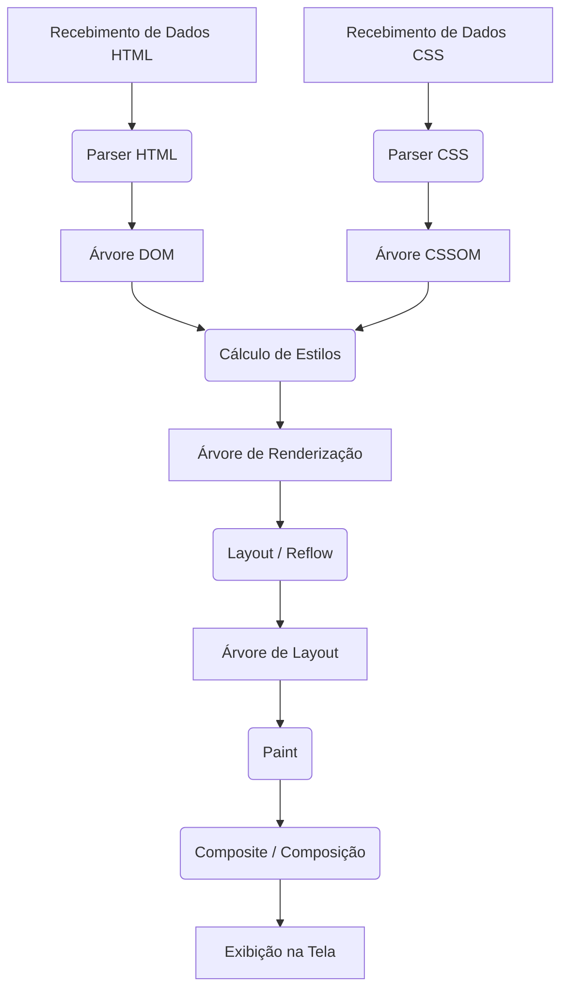
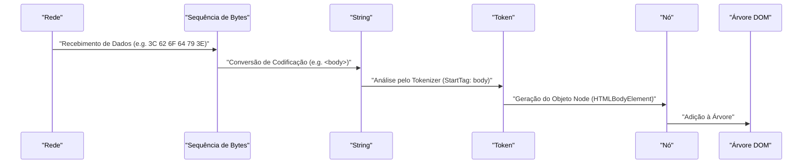
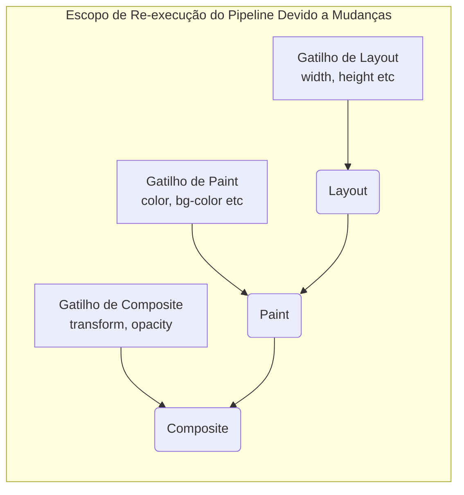

# Mecanismo de Renderização do Navegador: Uma Dissecação Completa do DOM até o Paint

O navegador web é um dos softwares mais próximos e complexos que usamos diariamente. Desde a inserção de uma URL até a exibição de uma página na tela, uma quantidade enorme de cálculos e processamentos ocorre internamente em milissegundos. Esse fluxo de processamento é chamado de **[Pipeline](https://kenji.blog/pt/p/cicd-pipeline-github-actions-best-practices/) de Renderização (Rendering Pipeline)** ou **Caminho Crítico de Renderização (Critical Rendering Path)**.

Neste artigo, dissecaremos o mecanismo completo de como os navegadores (especialmente motores de renderização modernos como Blink e WebKit) interpretam HTML, CSS e JavaScript, e, por fim, os desenham (Paint) como pixels no display.

## 1. Visão Geral do Pipeline de Renderização

Primeiro, vamos entender o quadro geral do processamento do motor de renderização. Os principais passos desde que o navegador recebe dados da rede até desenhar na tela são os seguintes:



Os passos de processamento são amplamente classificados nas seguintes fases:

1.  **Parsing (Análise)**: Analisa HTML e CSS, e constrói o DOM (Document Object Model) e o CSSOM (CSS Object Model).
2.  **Style (Cálculo de Estilos)**: Combina o DOM e o CSSOM para calcular os estilos finais aplicados a cada nó.
3.  **Layout (Layout / Reflow)**: Calcula a posição exata e o tamanho (informações de geometria) de cada elemento na tela.
4.  **Paint (Pintura / Desenho)**: Gera instruções de desenho (Paint Records) para converter elementos em pixels e rasterizá-los.
5.  **Composite (Composição)**: Sobrepõe várias camadas desenhadas na ordem correta para gerar a tela final.

Agora, vamos analisar cada passo em detalhes.

## 2. Parsing (Análise): Construção da Árvore DOM e da Árvore CSSOM

Quando o navegador recebe uma sequência de bytes (dados HTML) de um servidor, o motor de renderização começa a convertê-la em uma estrutura de dados compreensível para humanos e programas.

### 2.1 Análise de HTML e Construção da Árvore DOM

A análise do HTML é feita de acordo com o algoritmo de análise HTML definido pela W3C (atualmente WHATWG). Esse processo pode ser dividido em 4 etapas:

1.  **Conversion (Conversão)**: Converte os bytes brutos recebidos da rede em caracteres individuais (Characters) com base na codificação de caracteres especificada (como UTF-8).
2.  **Tokenization (Tokenização)**: Converte a string em vários "tokens" especificados pelo padrão HTML5 da W3C. Por exemplo, tags de abertura como `<html>`, `<body>`, tags de fechamento, nomes de atributos e valores de atributos.
3.  **Lexing (Análise Léxica)**: Converte os tokens gerados em "objetos" com propriedades e regras.
4.  **DOM [Tree](https://kenji.blog/pt/p/tree-graph-data-structures-search-dfs-bfs-dijkstra/) Construction (Construção da Árvore)**: Vincula os objetos criados em uma estrutura de dados em forma de árvore com base nas relações de aninhamento das tags. Esse é o **DOM (Document Object Model)**.



A árvore DOM representa completamente a estrutura e o conteúdo do documento. No entanto, neste momento, não possui informações sobre "como os elementos devem parecer".

### 2.2 Análise de CSS e Construção da Árvore CSSOM

Quando o parser HTML encontra informações sobre CSS, como tags `<link>` ou `<style>`, o processo de análise de CSS é iniciado. A análise de CSS também segue etapas muito semelhantes ao HTML, e, no final, gera uma estrutura em árvore chamada **CSSOM (CSS Object Model)**.

Sequência de Bytes -> String -> Token -> Nó -> CSSOM

O CSSOM é uma estrutura que mantém como cada nó na árvore DOM deve ser estilizado. Uma característica do CSS é o **Cascade (Cascata)**. Isso significa que as definições de estilo para um elemento são herdadas de um elemento pai ou sobrescritas por regras com maior Especificidade (Specificity). Por essa razão, o CSSOM é necessariamente uma estrutura em árvore.

Para expressar a especificidade usando fórmulas, a prioridade do estilo é representada pelo vetor $ S = (a, b, c) $ (onde a é ID, b é classe e c é número de tags).
Ao comparar, a avaliação é feita a partir dos elementos superiores.
$$
\text{Especificidade}(S_1, S_2) = 
\begin{cases} 
S_1 & \text{se } S_1 > S_2 \\\\
S_2 & \text{caso contrário}
\end{cases}
$$

#### A Construção do CSSOM Bloqueia a Renderização

Um ponto importante é que a **análise do CSS é tratada como um recurso que bloqueia a renderização**.
A construção do DOM pode ser feita de forma incremental sem esperar por recursos externos, mas até que o CSSOM seja completamente construído, o navegador aguardará os passos subsequentes (construção da Árvore de Renderização e desenho da tela).

Isso ocorre porque, se o desenho iniciar com um CSSOM incompleto, a tela será redesenhada cada vez que os estilos forem calculados, causando um efeito de cintilação (FOUC: Flash of Unstyled Content).

### 2.3 Bloqueio de Análise pelo JavaScript

Quando o HTML inclui tags `<script>`, o comportamento do navegador se torna ainda mais complexo.

Quando o parser do navegador encontra uma tag `<script>`, ele **pausa (bloqueia)** a construção do DOM. Em seguida, transfere o controle para o motor de JavaScript e espera que o download, a análise e a execução do script sejam concluídos.
Por que isso acontece? Porque o JavaScript pode alterar a própria árvore DOM sendo analisada ou o HTML usando `document.write()` ou APIs do DOM.

```html
<!-- Exemplo onde a análise do DOM é bloqueada -->
<p>Isto é analisado imediatamente</p>
<script src="heavy-script.js"></script>
<!-- Até que a execução de heavy-script.js termine, isto não é analisado -->
<p>Isto sofre atraso para ser exibido</p>
```

#### Atributos defer e async

Para evitar esse bloqueio de renderização e melhorar o desempenho, a tag `<script>` possui dois atributos: `defer` e `async`.

*   **async**: O download do script ocorre de forma assíncrona em segundo plano. Assim que o download termina, a análise do HTML é pausada para executar o script. A ordem de execução não é garantida (executa primeiro os que terminam o download). Ideal para scripts de análise sem dependências.
*   **defer**: O download do script ocorre de forma assíncrona, mas a execução é adiada até **depois que a análise do HTML estiver totalmente completa (logo antes do evento DOMContentLoaded)**. A execução é garantida na ordem escrita no HTML, tornando-se ideal para scripts dependentes do DOM.

```mermaid
gantt
    title "Carregamento e Execução de Scripts"
    dateFormat  s
    axisFormat %s

    section "Script Normal"
    "Análise HTML"       :active, a1, 0, 2s
    "Download JS" :crit, a2, 2, 4s
    "Execução JS"         :crit, a3, 4, 6s
    "Retoma Análise HTML"   :active, a4, 6, 8s

    section "Atributo async"
    "Análise HTML"       :active, b1, 0, 5s
    "Download JS" :crit, b2, 2, 4s
    "Execução JS"         :crit, b3, 5, 7s
    "Retoma Análise HTML"   :active, b4, 7, 9s

    section "Atributo defer"
    "Análise HTML"       :active, c1, 0, 6s
    "Download JS" :crit, c2, 1, 4s
    "Execução JS"         :crit, c3, 6, 8s
```


*(※ O `async` real pausa a análise porque é executado imediatamente após a conclusão do download.)*

## 3. Style (Cálculo de Estilos): Construção da Árvore de Renderização

Quando a árvore DOM e a árvore CSSOM são concluídas, o navegador as combina para construir a **Render [Tree](https://kenji.blog/pt/p/tree-graph-data-structures-search-dfs-bfs-dijkstra/) (Árvore de Renderização)** ou **Style Tree (Árvore de Estilos)**.

Nessa fase, para cada nó da árvore DOM, o navegador calcula quais regras de estilo do CSSOM se aplicam, determinando os estilos calculados finais (Computed Style).

### 3.1 O Que Está Incluído e Excluído da Árvore de Renderização

A Árvore de Renderização é uma árvore que contém informações visuais de **todos os elementos que serão exibidos na tela**. Assim, não há uma correspondência exata de 1 para 1 com a árvore DOM.

*   **Excluídos**:
    *   Elementos ocultos como `<head>`, `<meta>`, `<script>`.
    *   Elementos (e seus descendentes) com `display: none;` definido no CSS.
*   **Incluídos**:
    *   Nós do DOM exibidos.
    *   Pseudoelementos (como `::before`, `::after`). Eles não existem no DOM, mas são adicionados à Árvore de Renderização.
    *   Elementos com `visibility: hidden;`. Não são visíveis, mas ocupam espaço (afetam o layout), logo, são incluídos.

### 3.2 Complexidade no Cálculo de Estilos

O processo de determinar quais regras de CSS se aplicam aos elementos é muito custoso em termos de processamento.
Ao fazer a correspondência de seletores (Selector Matching), o navegador avalia **da direita para a esquerda (Right-to-Left)**.

Por exemplo, considere a seguinte regra de CSS:

```css
.container div .item p {
    color: red;
}
```

O navegador primeiro encontra todas as tags `<p>` (este é o seletor chave mais à direita). Em seguida, sobe pela árvore de pais desse `<p>`, verificando se existe um elemento com a classe `.item`, depois se o seu pai é uma `div`, e se há um `.container` acima.

Por que da direita para a esquerda? Porque, caso a árvore DOM seja enorme, procurar da esquerda para a direita resultaria na exploração de incontáveis "elementos descendentes que não correspondem", diminuindo drasticamente o desempenho. Procurar da direita para a esquerda permite afunilar rapidamente os elementos visados.

Portanto, seletores excessivamente detalhados ou redundantes, como mostrado abaixo, reduzem o desempenho no cálculo de estilos.

```css
/* Mau exemplo: O navegador precisa verificar todas as tags 'a', depois rastrear seus pais para ver se são span, li, ul, div em ordem */
div ul li span a { color: blue; }

/* Bom exemplo: Usar métodos de design como BEM e aplicar classes planas diretas */
.nav-link { color: blue; }
```

## 4. Layout (Layout / Reflow): Posição de Elementos e Cálculo de Tamanho

Quando a Árvore de Renderização (uma coleção de nós com informações de estilo) é construída, o próximo passo é a fase de **Layout**. Navegadores baseados no WebKit também chamam isso de **Reflow**.

Nessa fase, com base no tamanho da Viewport do navegador (área de exibição da janela), calcula-se precisamente **onde (Posição) e quão grande (Tamanho)** cada nó da Árvore de Renderização deve ser colocado na tela.

### 4.1 Modelo de Caixa (Box Model) e Layout de Fluxo (Flow Layout)

A base do layout de navegador é o **Modelo de Caixa (Box Model)**. Todos os elementos são calculados como caixas retangulares, com conteúdo (Content), preenchimento (Padding), borda (Border) e margem (Margin).

Os cálculos de layout normalmente começam na raiz da Árvore de Renderização (o elemento `<html>`, o bloco contêiner inicial) e descem recursivamente até os elementos filhos.

1.  **Do pai para o filho**: A caixa pai determina sua própria largura e passa a largura disponível para as caixas filhas.
2.  **Do filho para o pai**: A caixa filha determina sua própria altura (baseado no conteúdo) e repassa para a caixa pai. A caixa pai determina sua altura final a partir da soma das alturas das caixas filhas.

Esse sistema onde a maior parte do layout é decidida de cima para baixo em uma única passagem é chamado de **Flow Layout** (※ Tabelas ou Flexbox/Grid podem requerer passagens múltiplas mais complexas).

### 4.2 Layout Global e Layout Incremental

Existem dois tipos de cálculos de layout: o **layout global**, onde toda a tela é recalculada, e o **layout incremental**, onde apenas a parte alterada é recalculada.

*   **Layout Global**: Se a janela for redimensionada, a orientação do dispositivo for alterada ou o tamanho da fonte raiz mudar, o cálculo de layout de toda a Árvore de Renderização será refeito. Isso é um processo de custo altíssimo.
*   **Layout Incremental**: Se o JavaScript alterar o tamanho de alguns elementos ou os nós do DOM forem adicionados/removidos, o navegador marca esse elemento e quaisquer elementos possivelmente afetados (irmãos ou pais) como "Dirty (Sujos)" e recalcula assepticamente apenas essa porção de forma assíncrona. Isso é chamado de sistema **Dirty bit**.

### 4.3 Layout Thrashing (Ataque ao Layout) e Desempenho

Se você alterar estilos do DOM com JavaScript e tentar ler os resultados imediatamente (como altura ou largura), o navegador será forçado a executar o cálculo de layout atrasado de maneira **imediata e forçada (Synchronous Layout)** para otimização.

Fazer isso continuamente em um loop é chamado de **Layout Thrashing**, um problema severo de desempenho que reduz drasticamente a taxa de quadros (frame rate).

**【Exemplo de código ruim que causa Layout Thrashing】**

```javascript
const elements = document.querySelectorAll('.box');

// Mau exemplo: Leitura do DOM (offsetWidth) e gravação (style.width) ocorrem alternadamente
for (let i = 0; i < elements.length; i++) {
    // Para ler offsetWidth, o navegador é forçado a calcular o layout
    const width = elements[i].offsetWidth;
    // Escrever o estilo torna o DOM "Sujo (Dirty)"
    elements[i].style.width = width + 10 + 'px';
    // Na próxima iteração, ler offsetWidth novamente forçará outro layout... (loop em diante)
}
```

**【Solução: Separar leitura e gravação (Batching)】**

```javascript
const elements = document.querySelectorAll('.box');
const widths = [];

// Bom exemplo: Fase 1 - Ler todas as larguras dos elementos juntos (Layout acontece apenas uma vez)
for (let i = 0; i < elements.length; i++) {
    widths.push(elements[i].offsetWidth);
}

// Bom exemplo: Fase 2 - Gravar todos os estilos dos elementos juntos
for (let i = 0; i < elements.length; i++) {
    elements[i].style.width = widths[i] + 10 + 'px';
}
// No próximo tempo de desenho do navegador, o layout será recalculado apenas uma vez juntos
```

Ultimamente, usar bibliotecas como `FastDOM` ou utilizar apropriadamente o `requestAnimationFrame` para fazer o processamento em lote da leitura/escrita no DOM se tornou comum.

## 5. Paint (Pintura / Desenho): Geração de Pixels

Devido à fase de layout, a posição (coordenadas X, Y) e tamanho (largura, altura) da caixa de cada elemento foram definidos. No entanto, ainda não há nada desenhado na tela. O que ocorre em seguida é a fase de **Paint (Pintura)**.

O propósito da fase de Paint é receber a Árvore de Layout (Layout [Tree](https://kenji.blog/pt/p/tree-graph-data-structures-search-dfs-bfs-dijkstra/)) como entrada, criar instruções sobre como pintar os pixels na tela (Paint Records) e, por fim, rasterizar (Rasterization).

### 5.1 Ordem de Pintura (Stacking Context)

Você não pode simplesmente desenhar elementos na mesma ordem em que estão escritos no HTML. O CSS tem propriedades como `z-index`, posicionamento absoluto (`position: absolute;`), opacidade (`opacity`) e transformações 3D; essas afetam a ordem em que os elementos se sobrepõem (a ordem do eixo Z).

O mecanismo que gerencia isso é o **Contexto de Empilhamento (Stacking Context)**.

O navegador gera instruções de desenho de acordo com uma ordem estrita de pintura definida nas especificações CSS 2.1. A ordem geral de pintura de um elemento em bloco é a seguinte:

1.  background-color (cor de fundo)
2.  background-image (imagem de fundo)
3.  border (borda)
4.  children (desenho de elementos filhos)
5.  outline (contorno)

### 5.2 Paint Records e Display List

Nos navegadores modernos recentes (como o Blink no Chrome), a fase de Paint mudou de escrever diretamente os pixels na memória para um processo que gera uma lista (Display List) de **Paint Records (Registros de Pintura)**.

O Paint Record é uma lista de comandos de desenho concretos, como "desenhe um retângulo azul nestas coordenadas" ou "desenhe este texto na fonte especificada".

```json
// Imagem conceitual de um Paint Record
[
  { "action": "drawRect", "rect": [0, 0, 100, 100], "color": "blue" },
  { "action": "drawText", "text": "Hello", "pos": [10, 20], "font": "Arial" }
]
```

Por que isso é colocado em uma lista? Porque, em vez de repintar tudo com cada pequena alteração, é mais eficiente manter uma lista de comandos de pintura e atualizar/re-executar apenas os comandos para a porção que mudou.

### 5.3 Rasterização (Rasterization) e Multithreading

Os Paint Records gerados (Display List) precisam de fato ser convertidos em pixels (dados de bitmap). Esse processo é chamado de **Rasterização (Rasterization)**.

Rasterizar a página inteira a cada vez que ela rola é ineficiente. Por essa razão, os navegadores gerenciam a tela dividindo-a em pequenas áreas retangulares (por exemplo, 256x256 pixels) chamadas **Tiles (Blocos)**.

Em navegadores como o Chrome atualmente, a rasterização não é feita na thread principal (a thread onde ocorre a execução do JavaScript e o Layout), mas processada em paralelo (Threaded Rasterization) por threads dedicadas chamadas **Rasterizer Threads (Threads de Rasterização)**. Além disso, muitos trabalhos de rasterização aproveitam a aceleração de hardware e são executados rapidamente na **GPU**.

## 6. Composite (Composição): Sobreposição de Camadas

Assim que a rasterização é concluída e os dados de pixel para cada bloco são gerados (normalmente armazenados como texturas na memória da GPU), entramos na etapa final, a fase de **Composite (Composição)**.

Em páginas da web complexas, os elementos se sobrepõem, como um cabeçalho com sombra, uma janela modal fixa à frente ou uma imagem de fundo que rola. Se todos esses elementos fossem pintados juntos em uma única tela (canvas), toda rolagem ou certas animações exigiriam extensos redesenhos (Paint e Rasterization), reduzindo o desempenho.

Portanto, o navegador gerencia a página dividindo-a em várias **Camadas Gráficas (Graphics Layers)** independentes.

### 6.1 O Mecanismo das Camadas

Várias estruturas em árvore são transformadas dentro do navegador.

1.  **DOM [Tree](https://kenji.blog/pt/p/tree-graph-data-structures-search-dfs-bfs-dijkstra/)**
2.  **Layout Tree (Render Tree)**: Informação da geometria visual dos elementos
3.  **Paint Tree (Layer Tree)**: A estrutura hierárquica das camadas baseada em coisas como contexto de empilhamento
4.  **Graphics Layer Tree**: Um grupo de camadas independentes que são de fato compostas na GPU

Elementos com propriedades CSS específicas são promovidos (Promote) para "Graphics Layers" independentes pelo navegador.

As principais condições (gatilhos) em que uma camada é gerada são as seguintes:

*   Transformações em 3D ou perspectiva (`transform: translateZ(0)`, `translate3d(...)`)
*   Elementos `<video>` ou `<canvas>`
*   Animações CSS ou transições que alteram a opacidade (`opacity`) ou transformações (`transform`)
*   Elementos com a propriedade `will-change` especificada (ex: `will-change: transform;`)
*   Elementos já no topo de uma camada independente (devido a sobreposição)

### 6.2 A Thread do Compositor e a Aceleração de Hardware

A composição das camadas é feita por uma thread dedicada chamada **Thread do Compositor (Compositor Thread)**, que é independente da thread principal.

A textura do bitmap rasterizado de cada camada é transferida para a GPU. A thread do compositor envia instruções de composição (Compositor Frame) para a GPU, como "Coloque a camada A nas coordenadas X 100, Y 200, e sobreponha a camada B no topo com 0.5 de opacidade". A GPU compõe essas imagens de forma extremamente rápida para exibir a tela final no monitor.

#### Rolagem e Animação Independentes da Thread Principal

Ter a thread do compositor separada da thread principal é vitalmente importante para o desempenho.

Mesmo se o JavaScript demorar muito e bloquear (congelar) a thread principal, quando o usuário rolar com o mouse, a thread do compositor só precisa mudar ligeiramente e compor as texturas da camada já na GPU. Graças a isso, até em páginas com alto peso de JavaScript, a rolagem se move suavemente (Jank-free).

A melhor forma de aproveitar isso são as animações que usam `transform` e `opacity`.

### 6.3 CSS Triggers: Otimização do Desempenho de Animações

Um dos conceitos mais importantes na otimização de desempenho da Web são os **CSS Triggers (Gatilhos de CSS)**.
Quando você altera os estilos de um elemento via JavaScript ou CSS, a fase do pipeline de renderização do navegador que precisa ser refeita (se começa do Layout, do Paint, ou do Composite) depende de qual propriedade você muda.

1.  **Propriedades que disparam Layout (Reflow)**
    *   `width`, `height`, `margin`, `padding`, `top`, `left`, `font-size`, etc.
    *   Visto que a informação geométrica muda, isso re-executa todo o pipeline de Layout → Paint → Composite. É um processo muito pesado e inadequado para animações.
2.  **Propriedades que disparam Paint (Repaint)**
    *   `color`, `background-color`, `box-shadow`, etc.
    *   O tamanho e posição do elemento não mudam, mas sua aparência sim, então Paint → Composite é re-executado. É mais leve que o Layout, mas ainda gera carga devido ao redesenho de pixels.
3.  **Propriedades que disparam apenas o Composite**
    *   `transform` (`translate`, `scale`, `rotate`)
    *   `opacity`
    *   Eles não mudam a geometria do elemento ou as cores de pixels individuais. Como o elemento já existe na GPU como uma camada independente (textura), o navegador só tem que instruir a GPU para "Mudar a textura e compô-la (transform)" ou "Compô-la de forma semitransparente (opacity)". Já que pula completamente o Layout e o Paint da thread principal, este é um **método indispensável para atingir animações suaves a 60fps**.



#### O Uso da Propriedade will-change

`will-change` é uma propriedade CSS onde os desenvolvedores dizem ao navegador antecipadamente "uma propriedade particular neste elemento está programada para mudar no futuro".

```css
.animated-box {
    /* Informa antecipadamente ao navegador que o 'transform' vai mudar e força criar uma camada dedicada */
    will-change: transform;
    transition: transform 0.3s ease;
}
.animated-box:hover {
    transform: translateX(100px);
}
```

Quando o navegador vê `will-change: transform`, ele eleva o elemento a uma camada independente "antes" da animação iniciar, e prepara a textura na GPU. Isso previne o congelamento momentâneo (atraso pelo Paint) quando você realmente passa o mouse e a animação inicia.

No entanto, como criar camadas consome memória, usar `will-change` em todos os elementos da página vai travar o navegador e, ao contrário, degradar o desempenho. É importante usá-lo de modo apropriado e apenas em elementos necessários.

## 7. Conclusão

Nós analisamos o "mecanismo completo do DOM ao Paint (e ao Composite)" de como o navegador recebe HTML até o instante em que desenha pixels na tela.

1.  **Parsing (Análise)**: Analisa o HTML/CSS e constrói o DOM e o CSSOM. JavaScript (especialmente os síncronos) bloqueia isso.
2.  **Style (Estilo)**: Combina DOM e CSSOM para construir a Árvore de Renderização, que guarda os elementos de visualização e seus estilos.
3.  **Layout**: Calcula a posição exata (coordenadas) e tamanho de cada elemento na tela.
4.  **Paint (Pintura)**: Cria instruções de desenho (Paint Records) e rasteriza para pixels numa thread dedicada.
5.  **Composite (Composição)**: Compõe camadas independentes na GPU e produz a tela final.

O entendimento profundo desse mecanismo não é apenas conhecimento geral para desenvolvedores front-end.
"Por que as animações ficam travando quando se usa `width`?"
"Por que as tags `script` devem ser postas logo antes da tag de fechar do `body`, ou se deve usar `defer`?"
"Por que um DOM virtual no React ou Vue roda tão rapidamente? (= Otimização de lote e redução de acessos DOM e Layout/Paint)"

As respostas para todas essas coisas estão localizadas dentro deste pipeline de renderização. Ao entender o mecanismo, você se tornará capaz de construir aplicações web de maior desempenho com uma experiência de usuário superior.
