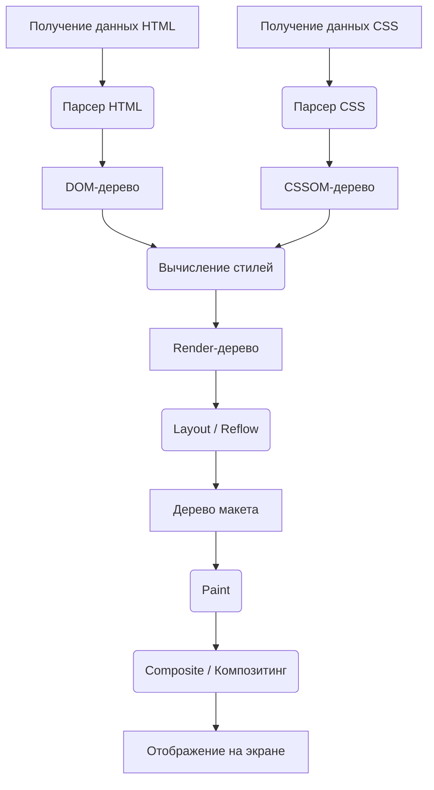
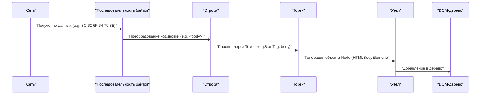
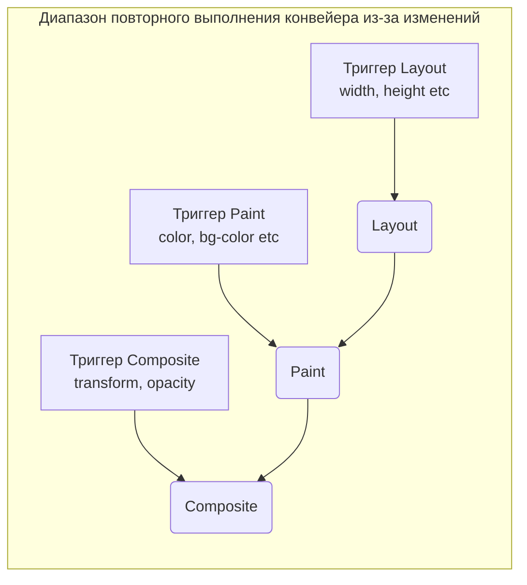

# Механизм рендеринга браузера: полный разбор от DOM-дерева до Paint

Веб-браузер — это одно из самых привычных и в то же время самых сложных программных обеспечений, которыми мы пользуемся каждый день. С момента ввода URL и до отображения страницы на экране внутри него происходят огромные вычисления и процессы за миллисекунды. Эту последовательность процессов называют **конвейером рендеринга (Rendering [Pipeline](https://kenji.blog/ru/p/cicd-pipeline-github-actions-best-practices/))** или **критическим путем рендеринга (Critical Rendering Path)**.

В этой статье мы полностью разберем механизм того, как браузер (в частности, современные движки рендеринга, такие как Blink и WebKit) интерпретирует HTML, CSS и JavaScript и в конечном итоге отрисовывает (Paint) их в виде пикселей на дисплее.

## 1. Общая картина конвейера рендеринга

Сначала давайте поймем общую картину процесса движка рендеринга. Основные шаги с момента получения данных браузером по сети до отрисовки на экране выглядят следующим образом.



Шаги процесса можно условно разделить на следующие фазы:

1.  **Parsing (Парсинг)** : Анализ HTML и CSS для построения DOM (Document Object Model) и CSSOM (CSS Object Model).
2.  **Style (Вычисление стилей)** : Объединение DOM и CSSOM для вычисления итоговых стилей, применяемых к каждому узлу.
3.  **Layout (Макет / Рефлоу)** : Вычисление точного положения и размера (геометрической информации) каждого элемента на экране.
4.  **Paint (Отрисовка)** : Генерация команд отрисовки (Paint Records) для преобразования элементов в пиксели и их растеризация.
5.  **Composite (Композитинг / Синтез)** : Наложение нескольких отрисованных слоев в правильном порядке для создания итогового экрана.

Теперь давайте рассмотрим каждый шаг более подробно.

## 2. Parsing (Парсинг): Построение DOM- и CSSOM-деревьев

Когда браузер получает последовательность байтов (данные HTML) от сервера, движок рендеринга начинает преобразовывать их в структуру данных, понятную человеку или программе.

### 2.1 Парсинг HTML и построение DOM-дерева

Парсинг HTML выполняется в соответствии с алгоритмом парсинга HTML, определенным W3C (сейчас WHATWG). Этот процесс можно разбить на 4 следующих шага.

1.  **Conversion (Преобразование)** : Преобразует последовательность байтов необработанных данных, полученных из сети, в отдельные символы (Characters) на основе указанной кодировки символов (например, UTF-8).
2.  **Tokenization (Лексический анализ)** : Преобразует строку в различные «токены (Tokens)», определенные стандартом W3C HTML5. Например, начальные теги, такие как `<html>`, `<body>`, конечные теги, имена и значения атрибутов.
3.  **Lexing (Синтаксический анализ)** : Преобразует сгенерированные токены в «объекты (Nodes)», имеющие свойства и правила.
4.  **DOM [Tree](https://kenji.blog/ru/p/tree-graph-data-structures-search-dfs-bfs-dijkstra/) Construction (Построение дерева)** : Связывает созданные объекты в древовидную структуру данных на основе отношений вложенности тегов. Это и есть **DOM (Document Object Model)**.



DOM-дерево полностью описывает структуру и содержимое документа. Однако на этом этапе у него нет информации о том, «как будут выглядеть элементы».

### 2.2 Парсинг CSS и построение CSSOM-дерева

Когда парсер HTML находит информацию, относящуюся к CSS, такую как теги `<link>` или `<style>`, запускается процесс парсинга CSS. Парсинг CSS также проходит шаги, очень похожие на HTML, и в конечном итоге создает древовидную структуру, называемую **CSSOM (CSS Object Model)**.

Последовательность байтов -> Строка -> Токен -> Узел -> CSSOM

CSSOM — это структура, которая хранит информацию о том, как должен быть стилизован каждый узел DOM-дерева. Одной из особенностей CSS является **каскадирование (Cascade)**. Это означает, что определения стилей для элемента наследуются от родительских элементов или переопределяются правилами с более высокой специфичностью (Specificity). Поэтому CSSOM неизбежно имеет древовидную форму.

Если выразить специфичность с помощью математической формулы, приоритет стиля представляется вектором $ S = (a, b, c) $ (a — ID, b — класс, c — количество тегов).
При сравнении элементы оцениваются сверху вниз.
$$
\text{Specificity}(S_1, S_2) = 
\begin{cases} 
S_1 & \text{если } S_1 > S_2 \\\\
S_2 & \text{иначе}
\end{cases}
$$

#### Построение CSSOM блокирует рендеринг

Важно отметить, что **парсинг CSS рассматривается как ресурс, блокирующий рендеринг**.
Построение DOM может выполняться инкрементно (последовательно), не дожидаясь внешних ресурсов, но браузер будет ждать завершения построения CSSOM, прежде чем переходить к последующим шагам (построению Render-дерева и отрисовке экрана).

Это связано с тем, что если начать отрисовку с неполным CSSOM, экран будет перерисовываться при каждом вычислении стилей, что приведет к мерцанию (FOUC: Flash of Unstyled Content).

### 2.3 Блокировка парсинга из-за JavaScript

Если HTML содержит теги `<script>`, поведение браузера становится еще более сложным.

Когда парсер браузера встречает тег `<script>`, он **приостанавливает (блокирует)** построение DOM. Затем он передает управление движку JavaScript и ждет завершения загрузки, парсинга и выполнения скрипта.
Почему? Потому что JavaScript может изменять парсируемое DOM-дерево или сам HTML с помощью `document.write()` или DOM API.

```html
<!-- Пример блокировки парсинга DOM -->
<p>Это будет распарсено немедленно</p>
<script src="heavy-script.js"></script>
<!-- Это не будет распарсено, пока не завершится выполнение heavy-script.js -->
<p>Отображение этого будет задержано</p>
```

#### Атрибуты defer и async

Чтобы избежать этой блокировки рендеринга и улучшить производительность, для тега `<script>` предусмотрены два атрибута: `defer` и `async`.

*   **async** : Выполняет загрузку скрипта асинхронно в фоновом режиме. Как только загрузка завершается, парсинг HTML приостанавливается, и скрипт выполняется. Порядок выполнения не гарантируется (выполняются по мере завершения загрузки). Подходит для скриптов веб-аналитики, не имеющих зависимостей.
*   **defer** : Выполняет загрузку скрипта асинхронно, но откладывает выполнение **до полного завершения парсинга HTML (непосредственно перед событием DOMContentLoaded)**. Гарантируется выполнение в порядке их появления в HTML, что делает его подходящим для скриптов, зависящих от DOM.

```mermaid
gantt
    title "Загрузка и выполнение скриптов"
    dateFormat  s
    axisFormat %s

    section "Обычный скрипт"
    "Анализ HTML"       :active, a1, 0, 2s
    "Загрузка JS" :crit, a2, 2s, 4s
    "Выполнение JS"         :crit, a3, 4s, 6s
    "Возобновление анализа HTML"   :active, a4, 6s, 8s

    section "Атрибут async"
    "Анализ HTML"       :active, b1, 0, 5s
    "Загрузка JS" :crit, b2, 2s, 4s
    "Выполнение JS"         :crit, b3, 5s, 7s
    "Возобновление анализа HTML"   :active, b4, 7s, 9s

    section "Атрибут defer"
    "Анализ HTML"       :active, c1, 0, 6s
    "Загрузка JS" :crit, c2, 1s, 4s
    "Выполнение JS"         :crit, c3, 6s, 8s
```
*(※Фактический `async` выполняется сразу после завершения загрузки, поэтому он прерывает парсинг.)*

## 3. Style (Вычисление стилей): Построение Render-дерева

После завершения построения DOM- и CSSOM-деревьев браузер объединяет их для построения **Render-дерева (Render [Tree](https://kenji.blog/ru/p/tree-graph-data-structures-search-dfs-bfs-dijkstra/))** или **дерева стилей (Style Tree)**.

На этом этапе для каждого узла DOM-дерева вычисляется, какие правила стилей CSSOM применяются, и определяются итоговые вычисленные стили (Computed Style).

### 3.1 Что входит в Render-дерево, а что нет

Render-дерево — это дерево, содержащее визуальную информацию **обо всех элементах, отображаемых на экране**. Поэтому оно не имеет идеального соотношения 1:1 с DOM-деревом.

*   **Не включаются** :
    *   Скрытые элементы, такие как `<head>`, `<meta>`, `<script>`.
    *   Элементы, для которых в CSS задано `display: none;` (и их потомки).
*   **Включаются** :
    *   Отображаемые узлы DOM.
    *   Псевдоэлементы (например, `::before`, `::after`). Они не существуют в DOM, но добавляются в Render-дерево.
    *   Элементы с заданным `visibility: hidden;`. Они невидимы, но поскольку занимают пространство (влияют на макет), они включаются в Render-дерево.

### 3.2 Сложность вычисления стилей

Процесс определения того, какие CSS-правила применяются к элементу, требует очень больших вычислительных затрат.
При сопоставлении селекторов (Selector Matching) браузер выполняет оценку **справа налево (Right-to-Left)**.

Например, допустим, есть следующее CSS-правило:

```css
.container div .item p {
    color: red;
}
```

Браузер сначала находит все теги `<p>` (это самый правый ключевой селектор). Затем он поднимается по дереву родительских элементов этого `<p>`, проверяет, существует ли элемент с классом `.item`, затем проверяет, есть ли у его родителя `div`, и наконец проверяет, есть ли у его родителя `.container`.

Почему справа налево? Потому что, если DOM-дерево становится огромным, поиск слева направо приведет к исследованию бесчисленных «несовпадающих потомков», что значительно снизит производительность. Поиск справа налево позволяет быстрее сузить круг целевых элементов.

Таким образом, слишком специфичные или избыточные селекторы, как показано ниже, приводят к снижению производительности при вычислении стилей.

```css
/* Плохой пример: браузеру нужно проверить все теги a и последовательно пройтись вверх, чтобы узнать, являются ли родительскими тегами span, li, ul, div */
div ul li span a { color: blue; }

/* Хороший пример: использовать методологии вроде BEM, создавая плоскую структуру и напрямую назначая классы */
.nav-link { color: blue; }
```

## 4. Layout (Макет / Рефлоу): Позиционирование и вычисление размеров элементов

После построения Render-дерева (набора узлов с информацией о стилях) начинается фаза **Layout (Макетирование)**. В браузерах на базе WebKit это также называют **Reflow (Рефлоу)**.

На этом этапе рассчитывается, **где (Position) и какого размера (Size)** должен быть каждый узел Render-дерева на экране, относительно области просмотра (Viewport) браузера (области отображения окна).

### 4.1 Блочная модель и потоковый макет

Основой макетирования в браузере является **блочная модель (Box Model)**. Все элементы рассчитываются как прямоугольные блоки, имеющие содержимое (Content), отступы (Padding), границы (Border) и поля (Margin).

Вычисление макета обычно начинается с корня Render-дерева (элемент `<html>`, начальный содержащий блок) и рекурсивно спускается к дочерним элементам.

1.  **От родителя к потомку** : Родительский блок определяет свою ширину и передает доступную ширину дочернему блоку.
2.  **От потомка к родителю** : Дочерний блок определяет свою высоту (на основе содержимого) и передает её родительскому блоку. Родительский блок определяет свою итоговую высоту на основе суммы высот дочерних блоков.

Этот механизм, при котором большая часть макета определяется за один проход сверху вниз, называется **потоковым макетом (Flow Layout)** (※ таблицы и Flexbox/Grid могут требовать более сложных многократных проходов).

### 4.2 Глобальный макет и инкрементный макет

Существует два типа вычисления макета: **глобальный макет**, при котором пересчитывается весь экран, и **инкрементный макет**, при котором пересчитываются только те части, которые изменились.

*   **Глобальный макет** : Если изменяется размер окна (изменение размера), ориентация устройства или размер шрифта корневого элемента, вычисление макета всего Render-дерева выполняется заново. Это очень ресурсоемкий процесс.
*   **Инкрементный макет** : Если размер некоторых элементов изменяется с помощью JavaScript или добавляются/удаляются узлы DOM, браузер помечает этот элемент и элементы, на которые он может повлиять (соседние и родительские элементы), как «Грязные (Dirty)» и асинхронно пересчитывает только эту часть. Эта система называется **Dirty bit system**.

### 4.3 Трэшинг макета (Layout Thrashing) и производительность

Если изменить стили DOM с помощью JavaScript и немедленно попытаться прочитать результат вычислений (высоту, ширину и т. д.), браузер будет вынужден **принудительно и немедленно (Synchronous Layout)** выполнить отложенные для оптимизации вычисления макета.

Если делать это неоднократно, например, в цикле, это называется **трэшингом макета (Layout Thrashing)** и вызывает серьезные проблемы с производительностью, значительно снижая частоту кадров.

**【Пример плохого кода, вызывающего трэшинг макета】**

```javascript
const elements = document.querySelectorAll('.box');

// Плохой пример: чтение DOM (offsetWidth) и запись (style.width) происходят поочередно
for (let i = 0; i < elements.length; i++) {
    // Для чтения offsetWidth браузер принудительно выполняет вычисление макета
    const width = elements[i].offsetWidth;
    // Из-за записи стиля DOM становится "Грязным" (Dirty)
    elements[i].style.width = width + 10 + 'px';
    // На следующей итерации цикла при очередном чтении offsetWidth снова происходит принудительный макет... (цикл продолжается)
}
```

**【Решение: Разделение чтения и записи (Batching)】**

```javascript
const elements = document.querySelectorAll('.box');
const widths = [];

// Хороший пример: Фаза 1 - считываем ширину всех элементов вместе (макетирование происходит только 1 раз)
for (let i = 0; i < elements.length; i++) {
    widths.push(elements[i].offsetWidth);
}

// Хороший пример: Фаза 2 - записываем стили всех элементов вместе
for (let i = 0; i < elements.length; i++) {
    elements[i].style.width = widths[i] + 10 + 'px';
}
// При следующем времени отрисовки браузера макет будет пересчитан только один раз для всех элементов
```

В настоящее время распространенной практикой является использование таких библиотек, как `FastDOM`, или правильное использование `requestAnimationFrame` для пакетного чтения/записи DOM.

## 5. Paint (Отрисовка): Генерация пикселей

На этапе Layout было определено положение (координаты X, Y) и размер (ширина, высота) блока каждого элемента. Однако на экране по-прежнему ничего не нарисовано. Следующий этап — фаза **Paint (Отрисовка)**.

Цель этапа Paint — принять дерево макета (Layout [Tree](https://kenji.blog/ru/p/tree-graph-data-structures-search-dfs-bfs-dijkstra/)) в качестве входных данных, создать инструкции по раскраске пикселей на экране (Paint Records) и в конечном итоге выполнить растеризацию (Rasterization).

### 5.1 Порядок отрисовки (Stacking Context)

Нельзя просто рисовать элементы в том порядке, в котором они написаны в HTML. CSS содержит такие свойства, как `z-index`, абсолютное позиционирование (`position: absolute;`), непрозрачность (`opacity`) и 3D-трансформации, которые влияют на порядок перекрытия элементов (порядок по оси Z).

Механизм, управляющий этим, называется **контекстом наложения (Stacking Context)**.

Браузер генерирует команды отрисовки в соответствии со строгим порядком отрисовки, определенным в спецификации CSS 2.1. Обычный порядок отрисовки блочных элементов выглядит следующим образом:

1.  background-color (цвет фона)
2.  background-image (фоновое изображение)
3.  border (граница)
4.  children (отрисовка дочерних элементов)
5.  outline (контур)

### 5.2 Paint Records и Display List

В современных браузерах (таких как Blink в Chrome) фаза Paint не записывает пиксели напрямую в память, а преобразуется в процесс генерации списка **Paint Records (записей отрисовки)** (Display List).

Paint Record — это список конкретных команд отрисовки, таких как «нарисовать прямоугольник этого цвета по этим координатам» или «отрисовать этот текст указанным шрифтом».

```json
// Концептуальный образ Paint Record
[
  { "action": "drawRect", "rect": [0, 0, 100, 100], "color": "blue" },
  { "action": "drawText", "text": "Hello", "pos": [10, 20], "font": "Arial" }
]
```

Почему создается список? Потому что при небольших изменениях гораздо эффективнее не перерисовывать все заново, а сохранять список команд отрисовки, обновляя и перезапуская только команды для тех частей, которые изменились.

### 5.3 Растеризация (Rasterization) и многопоточность

Сгенерированные Paint Records (Display List) должны быть преобразованы в фактические пиксели (растровые данные). Этот процесс называется **растеризацией (Rasterization)**.

Растеризация всей страницы при каждой прокрутке неэффективна. Поэтому браузер делит экран на несколько небольших прямоугольных областей, называемых **тайлами (Tiles)** (например, 256x256 пикселей), и управляет ими.

В современном Chrome растеризация выполняется не в главном потоке (потоке, в котором выполняется JavaScript и Layout), а параллельно в выделенных **потоках растеризатора (Rasterizer Threads)** (Threaded Rasterization). Кроме того, большая часть работы по растеризации использует аппаратное ускорение и быстро выполняется на **GPU**.

## 6. Composite (Композитинг / Синтез): Наложение слоев

После завершения растеризации и генерации данных пикселей для каждого тайла (обычно сохраняемых в виде текстур в памяти GPU) начинается последний этап — фаза **Composite (Синтез)**.

На сложной веб-странице элементы перекрывают друг друга: заголовки с падающими тенями, фиксированные модальные окна на переднем плане, прокручивающиеся фоновые изображения и т. д. Если бы все эти элементы были нарисованы на одном холсте, каждое прокручивание или анимация требовали бы обширной перерисовки (Paint и Rasterization), что снизило бы производительность.

Поэтому браузер делит страницу на несколько независимых **слоев (Graphics Layers)**.

### 6.1 Механизм создания слоев

Внутри браузера преобразуются несколько древовидных структур.

1.  **DOM [Tree](https://kenji.blog/ru/p/tree-graph-data-structures-search-dfs-bfs-dijkstra/)**
2.  **Layout Tree (Render Tree)** : геометрическая информация визуальных элементов
3.  **Paint Tree (Layer Tree)** : иерархическая структура слоев на основе контекста наложения и т. д.
4.  **Graphics Layer Tree** : независимые группы слоев, которые фактически синтезируются на GPU

Элементы с определенными свойствами CSS продвигаются (Promote) браузером в независимые "Graphics Layer (Графические слои)".

Основные условия (триггеры) создания слоев:

*   3D- или перспективные трансформации (`transform: translateZ(0)`, `translate3d(...)`)
*   Элементы `<video>` и `<canvas>`
*   Элементы, которые изменяют непрозрачность (`opacity`) или трансформации (`transform`) с помощью CSS-анимаций или переходов
*   Элементы с заданным свойством `will-change` (например: `will-change: transform;`)
*   Элементы, расположенные поверх уже существующего независимого слоя (из-за перекрытия)

### 6.2 Поток композитора и аппаратное ускорение

Синтез слоев выполняется в выделенном потоке, независимом от главного потока, называемом **потоком композитора (Compositor Thread)**.

Растеризованная растровая текстура каждого слоя передается на GPU. Поток композитора отправляет GPU инструкции по синтезу (Compositor Frame), такие как «поместить слой A на X-координату 100 и Y-координату 200, и наложить слой B поверх него с непрозрачностью 0.5». GPU синтезирует эти изображения на очень высокой скорости и выводит итоговый экран на дисплей.

#### Прокрутка и анимация, независимые от главного потока

Независимость потока композитора от главного потока имеет решающее значение для производительности.

Даже если выполнение JavaScript занимает много времени и главный поток блокируется (зависает), когда пользователь прокручивает страницу мышью, потоку композитора нужно только слегка сместить и синтезировать текстуры слоев, которые уже находятся на GPU. Это позволяет прокрутке работать плавно (Jank-free), даже на страницах с тяжелым JavaScript.

Анимации с использованием `transform` и `opacity` могут в полной мере использовать это преимущество.

### 6.3 CSS Trigger: Оптимизация производительности анимации

Одной из самых важных концепций в оптимизации производительности интернета является **CSS Triggers**.
Когда вы изменяете стили элемента с помощью JavaScript или CSS, то, с какого шага конвейера рендеринга браузера нужно начать заново (начиная с Layout, Paint или Composite), зависит от изменяемого свойства.

1.  **Свойства, запускающие Layout (Reflow)**
    *   `width`, `height`, `margin`, `padding`, `top`, `left`, `font-size` и др.
    *   Поскольку геометрическая информация изменяется, выполняется повторный запуск всего конвейера Layout → Paint → Composite. Это очень тяжелый процесс. Не подходит для анимации.
2.  **Свойства, запускающие Paint (Repaint)**
    *   `color`, `background-color`, `box-shadow` и др.
    *   Размер и положение элемента не изменяются, но меняется его внешний вид, поэтому выполняется повторный запуск Paint → Composite. Легче, чем Layout, но нагрузка есть, так как происходит перерисовка пикселей.
3.  **Свойства, запускающие только Composite**
    *   `transform` (`translate`, `scale`, `rotate`)
    *   `opacity`
    *   Они не изменяют геометрию элемента или цвета отдельных пикселей. Поскольку элемент уже существует на GPU в виде независимого слоя (текстуры), браузеру нужно только указать GPU «сдвинуть и синтезировать текстуру (transform)» или «сделать ее полупрозрачной (opacity)». Поскольку Layout и Paint главного потока могут быть полностью пропущены, это **необходимый метод для достижения плавной анимации 60 кадров в секунду**.



#### Использование свойства will-change

`will-change` — это CSS-свойство, позволяющее разработчикам заранее сообщать браузеру: «определенные свойства этого элемента будут изменены в будущем».

```css
.animated-box {
    /* Заранее сообщаем браузеру об изменении transform, чтобы он создал выделенный слой */
    will-change: transform;
    transition: transform 0.3s ease;
}
.animated-box:hover {
    transform: translateX(100px);
}
```

Когда браузер видит `will-change: transform`, он продвигает элемент в независимый слой «до» начала анимации и подготавливает текстуру на GPU. Это предотвращает задержки (вызванные Paint) в момент начала анимации при наведении.

Однако, поскольку создание слоев потребляет память, применение `will-change` ко всем элементам на странице может привести к сбою браузера или снижению производительности. Важно использовать его только для необходимых элементов.

## 7. Заключение

Мы рассмотрели «полный механизм от DOM-дерева до Paint (и Composite)» с момента получения браузером HTML до отрисовки пикселей на экране.

1.  **Parsing** : Анализирует HTML/CSS и строит DOM и CSSOM. JavaScript (особенно синхронные скрипты) блокирует этот процесс.
2.  **Style** : Объединяет DOM и CSSOM для построения Render-дерева, содержащего отображаемые элементы и их стили.
3.  **Layout** : Вычисляет точное положение (координаты) и размер каждого элемента на экране.
4.  **Paint** : Создает команды отрисовки (Paint Records) и растеризует их в пиксели в выделенном потоке.
5.  **Composite** : Синтезирует независимые слои на GPU и выводит итоговый экран.

Глубокое понимание этого механизма для фронтенд-разработчика выходит за рамки простых знаний.
«Почему анимация через `width` дергается?»
«Почему тег `script` следует помещать перед закрывающим тегом `body` или использовать `defer`?»
«Почему виртуальный DOM в React или Vue работает быстро? (= Пакетная обработка и минимизация доступа к DOM и Layout/Paint)»

Ответы на все эти вопросы лежат внутри этого конвейера рендеринга. Понимая механизм, вы сможете создавать веб-приложения с более высокой производительностью и лучшим пользовательским опытом.
