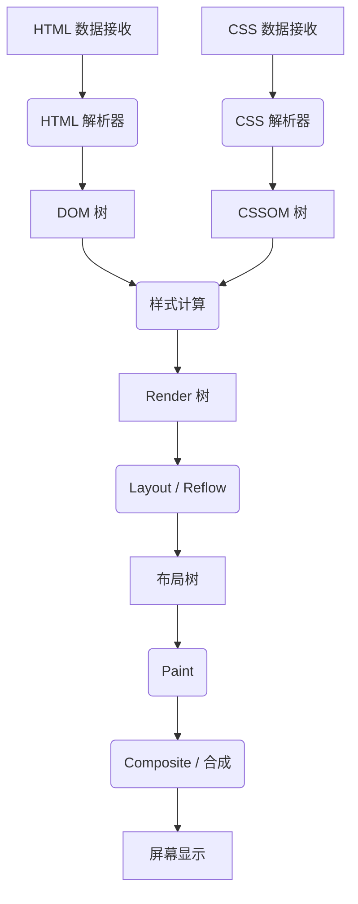
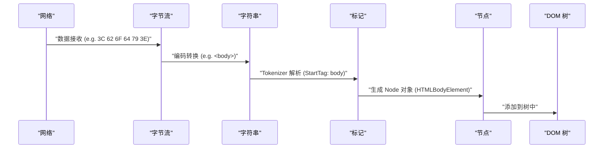
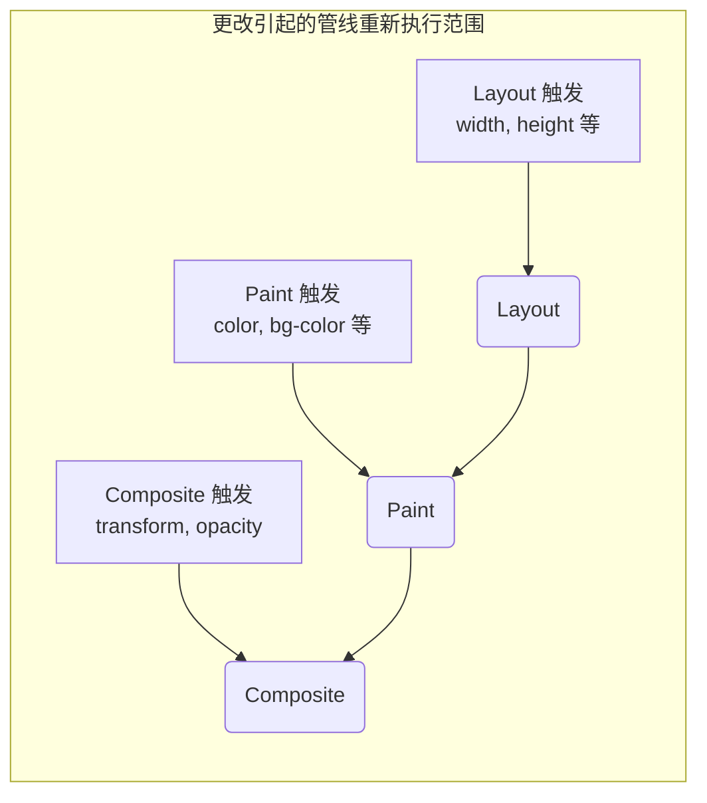

# 浏览器渲染机制：从 DOM 树到 Paint 的完全解剖

Web 浏览器是我们日常使用中最贴近也是最复杂的软件之一。从输入 URL 到页面在屏幕上显示，其内部在毫秒级内进行了海量的计算和处理。这一系列的处理流程被称为 **渲染管线 (Rendering [Pipeline](https://kenji.blog/zh-cn/p/cicd-pipeline-github-actions-best-practices/))** 或 **关键渲染路径 (Critical Rendering Path)** 。

本文将完全解剖浏览器（尤其是 Blink 和 WebKit 等现代渲染引擎）如何解析 HTML、CSS 和 JavaScript，并最终作为显示器上的像素进行绘制（Paint）的机制。

## 1. 渲染管线的整体架构

首先，让我们把握渲染引擎处理的整体架构。浏览器从网络接收数据到在屏幕上绘制的主要步骤如下。



处理的步骤大致可分为以下几个阶段。

1.  **Parsing (解析)** ：解析 HTML 和 CSS，构建 DOM (Document Object Model) 和 CSSOM (CSS Object Model)。
2.  **Style (样式计算)** ：结合 DOM 和 CSSOM，计算应用于每个节点的最终样式。
3.  **Layout (布局 / 重排)** ：计算屏幕上每个元素的准确位置和大小（几何信息）。
4.  **Paint (绘制 / 涂色)** ：生成将元素转换为像素的绘制指令（Paint Records），并进行光栅化。
5.  **Composite (合成 / 组合)** ：按照正确的顺序叠加绘制的多个图层，生成最终的画面。

接下来，我们将详细了解各个步骤。

## 2. Parsing（解析）：构建 DOM 树和 CSSOM 树

当浏览器从服务器接收到字节流（HTML 数据）时，渲染引擎开始将其转换为人类和程序可以理解的数据结构。

### 2.1 解析 HTML 和构建 DOM 树

HTML 的解析遵循 W3C（现在是 WHATWG）定义的 HTML 解析算法。这个过程可以分解为以下 4 个步骤。

1.  **Conversion (转换)** ：根据指定的字符编码（如 UTF-8），将从网络接收的原始数据字节流转换为单个字符（Characters）。
2.  **Tokenization (词法解析)** ：将字符串转换为 W3C HTML5 标准规定的各种“标记（Tokens）”。例如 `<html>` 、 `<body>` 等起始标签、结束标签、属性名和属性值等。
3.  **Lexing (语法解析)** ：将生成的标记转换为具有属性和规则的“对象（Nodes）”。
4.  **DOM Tree Construction (树构建)** ：根据标签的嵌套关系，将创建的对象链接为树状数据结构。这就是 **DOM (Document Object Model)** 。



DOM 树完全表示了文档的结构和内容。然而，此时它还没有关于“元素外观如何”的信息。

### 2.2 解析 CSS 和构建 CSSOM 树

当 HTML 解析器遇到 `<link>` 标签或 `<style>` 标签等有关 CSS 的信息时，CSS 解析过程便开始了。CSS 的解析也遵循与 HTML 非常相似的步骤，最终生成被称为 **CSSOM (CSS Object Model)** 的树结构。

字节流 -> 字符串 -> 标记 -> 节点 -> CSSOM

CSSOM 是一种保持 DOM 树每个节点应该如何进行样式设置的结构。CSS 的一个特征是 **层叠（Cascade）** 。换句话说，针对某个元素的样式定义，可能会从父元素继承，或者被特定度（Specificity）更高的规则覆盖。因此，CSSOM 必然会变成树结构。

如果用数学公式来表示特定度，样式的优先级可以表示为向量 $ S = (a, b, c) $ （a 是 ID 的数量，b 是类的数量，c 是标签的数量）。
比较时从最高级的元素开始评估。
$$
\text{Specificity}(S_1, S_2) = 
\begin{cases} 
S_1 & \text{如果 } S_1 > S_2 \\\\
S_2 & \text{其他情况}
\end{cases}
$$

#### CSSOM 的构建会阻塞渲染

关键点是， **CSS 的解析被视为渲染阻塞资源** 。
DOM 的构建可以在不等待外部资源的情况下增量（逐步）进行，但是直到 CSSOM 完全构建，浏览器会等待后续步骤（构建 Render 树和画面绘制）。

因为如果在不完整的 CSSOM 下开始绘制，每次计算样式时画面都会重新绘制，从而发生闪烁（FOUC: Flash of Unstyled Content）。

### 2.3 JavaScript 阻塞解析

如果 HTML 包含 `<script>` 标签，浏览器的行为会变得更加复杂。

当浏览器的解析器遇到 `<script>` 标签时，它会 **暂停（阻塞）** DOM 的构建。然后，控制权转移到 JavaScript 引擎，等待脚本的下载、解析和执行完成。
为什么呢？这是因为 JavaScript 可能会使用 `document.write()` 或 DOM API 来重写正在解析的 DOM 树或 HTML 本身。

```html
<!-- DOM 解析被阻塞的例子 -->
<p>这里会立即被解析</p>
<script src="heavy-script.js"></script>
<!-- 在 heavy-script.js 执行结束前，这里不会被解析 -->
<p>这里的显示会被延迟</p>
```

#### defer 和 async 属性

为了避免这种渲染阻塞并提升性能， `<script>` 标签提供了 `defer` 和 `async` 两个属性。

*   **async** : 在后台异步下载脚本。下载完成后，立即暂停 HTML 解析并执行脚本。执行顺序无法保证（先下载完的先执行）。适合没有依赖关系的访问分析脚本等。
*   **defer** : 异步下载脚本，但执行会推迟到 **HTML 解析完全结束之后（DOMContentLoaded 事件触发之前）** 。保证按照 HTML 中的编写顺序执行，适合依赖 DOM 的脚本。

```mermaid
gantt
    title "脚本的加载与执行"
    dateFormat  s
    axisFormat %s

    section "普通脚本"
    "HTML 解析"       :active, a1, 0, 2s
    "JS 下载" :crit, a2, 2s, 4s
    "JS 执行"         :crit, a3, 4s, 6s
    "HTML 解析恢复"   :active, a4, 6s, 8s

    section "async 属性"
    "HTML 解析"       :active, b1, 0, 5s
    "JS 下载" :crit, b2, 2s, 4s
    "JS 执行"         :crit, b3, 5s, 7s
    "HTML 解析恢复"   :active, b4, 7s, 9s

    section "defer 属性"
    "HTML 解析"       :active, c1, 0, 6s
    "JS 下载" :crit, c2, 1s, 4s
    "JS 执行"         :crit, c3, 6s, 8s
```
*(※实际的 `async` 会在下载完成后立即执行，因此会中断解析。)*

## 3. Style（样式计算）：构建 Render 树

当 DOM 树和 CSSOM 树完成后，浏览器将它们组合起来构建 **Render 树 (Render Tree)** 或 **样式树 (Style Tree)** 。

在这个阶段，会针对 DOM 树的每个节点，计算应该应用 CSSOM 中的哪些样式规则，并决定最终的计算样式（Computed Style）。

### 3.1 Render 树包含与不包含的内容

Render 树是一个包含 **屏幕上显示的所有元素** 的视觉信息的树。因此，它并不完全与 DOM 树一一对应。

*   **不包含的内容** :
    *   `<head>` 、 `<meta>` 、 `<script>` 等隐藏元素。
    *   在 CSS 中设置了 `display: none;` 的元素（及其子孙元素）。
*   **包含的内容** :
    *   可见的 DOM 节点。
    *   伪元素（如 `::before` , `::after` ）。这些在 DOM 中不存在，但会被添加到 Render 树中。
    *   设置了 `visibility: hidden;` 的元素。虽然不可见，但因为占据空间（影响布局），所以包含在 Render 树中。

### 3.2 样式计算的复杂性

决定应用哪些 CSS 规则到元素的过程是一个计算成本非常高的处理。
浏览器在进行选择器匹配（Selector Matching）时，会 **从右到左（Right-to-Left）** 进行评估。

例如，假设有如下 CSS 规则。

```css
.container div .item p {
    color: red;
}
```

浏览器首先找到所有的 `<p>` 标签（这是最右边的关键选择器）。然后，沿着这个 `<p>` 的父元素树往上追溯，检查是否存在类为 `.item` 的元素，接着检查其父元素是否是 `div` ，再检查其父元素是否是 `.container` 。

为什么是从右到左？因为如果 DOM 树非常庞大，从左到右搜索会导致探索无数个“不匹配的子孙元素”，从而显著降低性能。通过从右到左搜索，可以更快地筛选出目标元素。

因此，像下面这样过于详细或冗余的选择器，会导致样式计算的性能下降。

```css
/* 糟糕的例子：浏览器需要检查所有的 a 标签，并依次追溯其父元素是否为 span、li、ul、div */
div ul li span a { color: blue; }

/* 好的例子：使用 BEM 等设计方法，采用扁平化、直接指定类名的方式 */
.nav-link { color: blue; }
```

## 4. Layout（布局 / 重排）：元素位置与大小计算

Render 树（带有样式信息的节点集合）构建完成后，接下来进入 **Layout (布局)** 阶段。在基于 WebKit 的浏览器中，这有时被称为 **Reflow (重排)** 。

在这个阶段，浏览器以视口（窗口的显示区域）的大小为基准，准确地计算出 Render 树的每个节点在屏幕上的 **位置 (Position) 以及大小 (Size)** 。

### 4.1 盒模型和流式布局

浏览器布局的基础是 **盒模型 (Box Model)** 。所有的元素都被计算为包含内容 (Content)、内边距 (Padding)、边框 (Border) 和外边距 (Margin) 的矩形盒子。

布局计算通常从 Render 树的根节点（ `<html>` 元素，初始包含块）开始，递归地向下遍历子元素。

1.  **从父到子** : 父盒子决定自身的宽度，并告知子盒子可用的宽度。
2.  **从子到父** : 子盒子决定自身的高度（基于内容），并告知父盒子。父盒子根据子盒子的高度的总和决定自身的最终高度。

这种自上而下的一次遍历中确定大部分布局的机制被称为 **流式布局 (Flow Layout)** （※表格和 Flexbox/Grid 等可能需要更复杂的多次遍历）。

### 4.2 全局布局和增量布局

布局计算分为重新计算整个画面的 **全局布局** 和仅重新计算更改部分的 **增量布局** 两种。

*   **全局布局** : 当更改窗口大小（调整大小）、更改设备方向、更改根元素的字体大小等情况发生时，会重新进行整个 Render 树的布局计算。这是非常耗费成本的处理。
*   **增量布局** : 如果通过 JavaScript 更改了部分元素的大小，或者添加/删除了 DOM 节点，浏览器会将该元素以及可能受到影响的元素（兄弟元素或父元素）标记为“Dirty（脏）”，并异步地仅重新计算那部分。这被称为 **Dirty bit system** 。

### 4.3 布局抖动 (Layout Thrashing) 与性能

如果在 JavaScript 中更改了 DOM 的样式，并试图立即读取其计算结果（如高度或宽度等），浏览器为了优化而推迟的布局计算就会被 **强制立即 (Synchronous Layout)** 执行。

在循环中连续进行这种操作被称为 **布局抖动 (Layout Thrashing)** ，会导致帧率显著下降等严重的性能问题。

**【导致布局抖动的糟糕代码示例】**

```javascript
const elements = document.querySelectorAll('.box');

// 糟糕的例子：交替读取（offsetWidth）和写入（style.width）DOM
for (let i = 0; i < elements.length; i++) {
    // 为了读取 offsetWidth，浏览器会强制执行布局计算
    const width = elements[i].offsetWidth;
    // 写入样式使 DOM 变“脏”
    elements[i].style.width = width + 10 + 'px';
    // 在下一次循环中因为再次读取 offsetWidth，所以再次发生强制布局...（以此类推）
}
```

**【改善方案：读写分离 (Batching)】**

```javascript
const elements = document.querySelectorAll('.box');
const widths = [];

// 好的例子：阶段 1 - 集中读取所有元素的宽度（只发生 1 次布局）
for (let i = 0; i < elements.length; i++) {
    widths.push(elements[i].offsetWidth);
}

// 好的例子：阶段 2 - 集中写入所有元素的样式
for (let i = 0; i < elements.length; i++) {
    elements[i].style.width = widths[i] + 10 + 'px';
}
// 在之后的浏览器绘制时机中，仅会集中重新计算 1 次布局
```

最近，利用 `FastDOM` 等库或妥善运用 `requestAnimationFrame` 将 DOM 读写批量化的手法很普遍。

## 5. Paint（绘制）：生成像素

通过布局阶段，确定了每个元素的盒子的位置（X、Y 坐标）标记和大小（宽度、高度）。然而，此时屏幕上还没有绘制任何东西。接下来进行的就是 **Paint (绘制)** 阶段。

Paint 阶段的目的是接收布局树（Layout Tree）作为输入，创建如何在屏幕上涂绘像素的步骤（Paint Records），并最终进行光栅化（Rasterization）。

### 5.1 绘制顺序 (Stacking Context)

并不是简单地按照元素在 HTML 中编写的顺序进行绘制即可。CSS 中存在 `z-index` 、绝对定位（ `position: absolute;` ）、不透明度（ `opacity` ）、3D 变换等属性，这些都会影响元素重叠的顺序（Z 轴的顺序）。

管理这个机制的是 **层叠上下文 (Stacking Context)** 。

浏览器会根据 CSS 2.1 规范中定义的严格绘制顺序生成绘制指令。普通块级元素的绘制顺序如下：

1.  background-color（背景颜色）
2.  background-image（背景图片）
3.  border（边框）
4.  children（子元素的绘制）
5.  outline（轮廓）

### 5.2 Paint Records 与 Display List

在近期的现代浏览器（如 Chrome 的 Blink）中，Paint 阶段不再是直接将像素写入内存，而是转变为生成 **Paint Records (绘制记录)** 列表（Display List）的处理。

Paint Record 是具体绘制指令的列表，比如“在这个坐标上用这种颜色画一个矩形”、“以指定的字体绘制这个文本”。

```json
// Paint Record 的概念示意图
[
  { "action": "drawRect", "rect": [0, 0, 100, 100], "color": "blue" },
  { "action": "drawText", "text": "Hello", "pos": [10, 20], "font": "Arial" }
]
```

为什么要列表化呢？因为如果稍微有一点变化就重绘所有的内容效率极低，而保留绘制指令的列表，只更新和重新执行发生变化的指令会更高效。

### 5.3 光栅化 (Rasterization) 与多线程化

生成的 Paint Records（Display List）必须实际转换为像素（位图数据）。这个过程被称为 **光栅化 (Rasterization)** 。

每次滚动时都对整个页面进行光栅化效率很低。因此，浏览器将画面划分为多个被称为 **图块 (Tiles)** 的小矩形区域（例如 256x256 像素等）来管理。

在当前的 Chrome 等浏览器中，光栅化不是在主线程（执行 JavaScript 和 Layout 的线程）中进行，而是通过专用的 **光栅化线程 (Rasterizer Threads)** 并行处理（Threaded Rasterization）。此外，许多光栅化工作会利用硬件加速，在 **GPU** 上高速执行。

## 6. Composite（合成）：图层的叠加

光栅化完成且生成了各个图块的像素数据（通常作为纹理保存在 GPU 内存中）后，就进入了最后的 **Composite (合成)** 阶段。

在复杂的 Web 页面中，应用了阴影的头部、固定在前面的模态窗口、滚动的背景图片等，元素常常会互相重叠。如果将这些元素全部平涂在一个画布上，每次滚动或运行某些动画时都会导致大范围的重绘（Paint 和 Rasterization），从而降低性能。

因此，浏览器会将页面划分为多个独立的 **图层 (Graphics Layers)** 来进行管理。

### 6.1 图层化机制

在浏览器内部，多个树结构会不断转换。

1.  **DOM Tree**
2.  **Layout Tree (Render Tree)** : 视觉元素的几何信息
3.  **Paint Tree (Layer Tree)** : 基于层叠上下文等的图层层次结构
4.  **Graphics Layer Tree** : 实际上由 GPU 合成的独立图层组

具有特定 CSS 属性的元素会被浏览器提升（Promote）为独立的“Graphics Layer（图形图层）”。

生成图层的主要条件（触发器）如下：

*   3D 或透视变换（ `transform: translateZ(0)` , `translate3d(...)` ）
*   `<video>` 或 `<canvas>` 元素
*   在 CSS 动画或过渡中，改变不透明度（ `opacity` ）或变换（ `transform` ）的元素
*   指定了 `will-change` 属性的元素（例如: `will-change: transform;` ）
*   已经位于独立图层上的元素（出于重叠的需要）

### 6.2 合成线程与硬件加速

图层的合成在独立于主线程的称为 **合成线程 (Compositor Thread)** 的专用线程中进行。

每个图层经过光栅化的位图纹理会被传送到 GPU。合成线程会向 GPU 发送合成指令（Compositor Frame），例如“将图层 A 放置在 X 坐标 100，Y 坐标 200 的位置，并将图层 B 以 0.5 的不透明度叠加在上面”。GPU 会以非常高的速度合成这些图像，并将最终的画面输出到显示器上。

#### 独立于主线程的滚动与动画

合成线程独立于主线程，在性能上具有极其重要的意义。

即使 JavaScript 执行耗时导致主线程被阻塞（卡顿），当用户使用鼠标滚动时，合成线程只需要稍微移动并合成 GPU 中已有的图层纹理即可。因此，即使是 JavaScript 繁重的页面，滚动本身也能保持流畅（Jank-free）。

而能最大限度发挥这一优势的正是使用 `transform` 和 `opacity` 实现的动画。

### 6.3 CSS Trigger：动画性能优化

Web 性能优化中最重要的概念之一就是 **CSS Triggers** 。
当你用 JavaScript 或 CSS 改变元素的样式时，浏览器需要从渲染管线的哪一步开始重新执行（从 Layout 开始，还是从 Paint，或 Composite 开始），这取决于你更改的属性。

1.  **触发 Layout (Reflow) 的属性**
    *   `width` , `height` , `margin` , `padding` , `top` , `left` , `font-size` 等。
    *   由于几何信息发生改变，会重新执行 Layout → Paint → Composite 的全部管线。这是非常繁重的处理，不适合用于动画。
2.  **触发 Paint (Repaint) 的属性**
    *   `color` , `background-color` , `box-shadow` 等。
    *   元素的大小和位置没有改变，但外观发生了改变，因此会重新执行 Paint → Composite。虽然比 Layout 轻量，但由于需要重新绘制像素，还是会产生负载。
3.  **仅触发 Composite 的属性**
    *   `transform` ( `translate` , `scale` , `rotate` )
    *   `opacity`
    *   这些属性不会改变元素的几何特征或单个像素的颜色。由于元素已经作为独立的图层（纹理）存在于 GPU 中，浏览器只需向 GPU 发出“偏移纹理位置并合成（transform）”或“半透明合成（opacity）”的指令即可。因为能够完全跳过主线程的 Layout 和 Paint，所以这是 **实现 60fps 流畅动画的必备** 手法。



#### 活用 will-change 属性

`will-change` 是开发者用来向浏览器事先传达“这个元素的特定属性在未来将会被改变”的 CSS 属性。

```css
.animated-box {
    /* 预先告知浏览器 transform 会改变，让其创建专用的图层 */
    will-change: transform;
    transition: transform 0.3s ease;
}
.animated-box:hover {
    transform: translateX(100px);
}
```

当浏览器看到 `will-change: transform` 时，会在动画开始“之前”将该元素提升到独立的图层中，并在 GPU 中准备好纹理。这能防止鼠标悬停且动画实际开始瞬间的卡顿（由 Paint 引起的延迟）。

但是，创建图层会消耗内存，如果给页面上的所有元素都指定 `will-change` ，反而会导致浏览器崩溃或性能下降。仅在必要的元素上合理使用是很重要的。

## 7. 总结

我们了解了浏览器从接收 HTML 到在屏幕上绘制像素的“从 DOM 树到 Paint（以及 Composite）的完全机制”。

1.  **Parsing** : 解析 HTML/CSS，构建 DOM 和 CSSOM。JavaScript（特别是同步脚本）会阻塞这一过程。
2.  **Style** : 结合 DOM 和 CSSOM，构建包含显示元素及其样式的 Render 树。
3.  **Layout** : 准确计算每个元素在屏幕上的位置（坐标）和大小。
4.  **Paint** : 创建绘制指令（Paint Records），并在专用线程中光栅化为像素。
5.  **Composite** : 在 GPU 上合成独立的图层，输出最终的屏幕画面。

深入理解这个机制对于前端开发者来说，不仅仅停留在知识层面。
“为什么用 `width` 做动画会卡顿？”
“为什么 `script` 标签应该放在 `body` 的闭合标签之前，或者使用 `defer` ？”
“为什么像 React 和 Vue 这样的虚拟 DOM 会运行得那么快？（= DOM 访问和 Layout/Paint 的批量化与最小化）”

所有这些问题的答案都存在于这个渲染管线之中。通过了解它的机制，你将能够构建出性能更高、用户体验更出色的 Web 应用程序。
