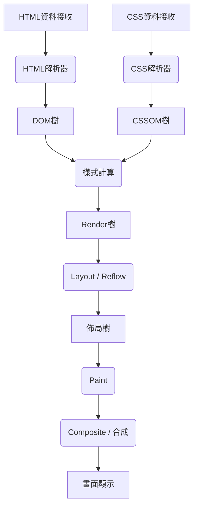
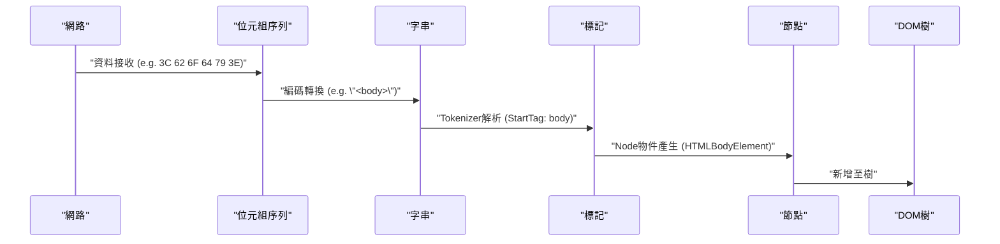
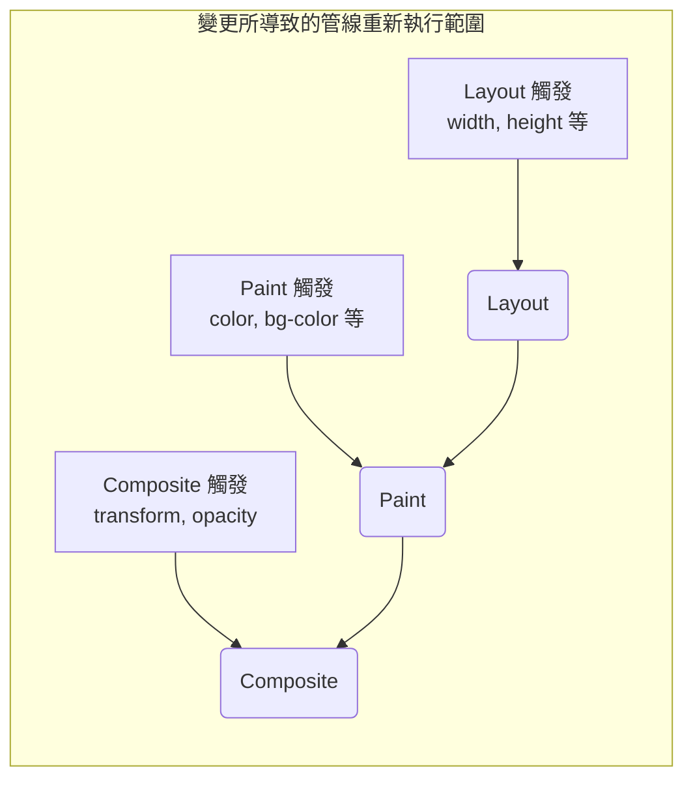

# 瀏覽器渲染機制：從 DOM 樹到 Paint 的完全解剖

Web 瀏覽器是我們日常使用中最熟悉且最複雜的軟體之一。從輸入 URL 到頁面顯示在畫面上，其內部以毫秒為單位進行著龐大的運算與處理。這整個處理流程被稱為 **渲染管線 (Rendering Pipeline)** 或 **關鍵渲染路徑 (Critical Rendering Path)** 。

本文將徹底解剖瀏覽器（尤其是 Blink 和 WebKit 等現代渲染引擎）如何解析 HTML、CSS、JavaScript，並最終將其作為顯示器上的像素繪製（Paint）出來的完整機制。

## 1. 渲染管線全貌

首先，讓我們來了解渲染引擎處理的全貌。瀏覽器從網路接收資料到在畫面上繪製為止的主要步驟如下：



處理步驟大致可分為以下階段：

1.  **Parsing (解析)** ：解析 HTML 與 CSS，建構 DOM (Document Object Model) 與 CSSOM (CSS Object Model)。
2.  **Style (樣式計算)** ：結合 DOM 與 CSSOM，計算套用於各節點的最終樣式。
3.  **Layout (佈局 / 重排)** ：計算畫面上各元素的準確位置與大小（幾何資訊）。
4.  **Paint (繪製)** ：產生將元素轉換為像素的繪製指令（Paint Records）並進行光柵化。
5.  **Composite (合成)** ：將繪製好的多個圖層以正確的順序疊加，產生最終畫面。

接下來，我們將詳細了解每個步驟。

## 2. Parsing（解析）：建構 DOM 樹與 CSSOM 樹

當瀏覽器從伺服器接收到位元組序列（HTML 資料）時，渲染引擎就會開始將其轉換為人類或程式能夠理解的資料結構。

### 2.1 HTML 的解析與 DOM 樹的建構

HTML 的解析是依照 W3C（現在是 WHATWG）定義的 HTML 解析演算法來進行的。這個過程可以分解為以下 4 個步驟：

1.  **Conversion (轉換)** ：將從網路接收到的原始資料位元組序列，根據指定的字元編碼（如 UTF-8）轉換為個別的字元（Characters）。
2.  **Tokenization (詞法解析)** ：將字串轉換為 W3C HTML5 標準中規定的各種「標記（Tokens）」。例如 `<html>` 、 `<body>` 等開始標籤、結束標籤、屬性名稱與屬性值等。
3.  **Lexing (語法解析)** ：將產生的標記轉換為具有屬性與規則的「物件（Nodes）」。
4.  **DOM Tree Construction (樹狀建構)** ：將建立的物件，根據標籤的巢狀關係連結成樹狀資料結構。這就是 **DOM (Document Object Model)** 。



DOM 樹完整地呈現了文件的結構與內容。然而，此時它並不具備「元素看起來如何」的資訊。

### 2.2 CSS 的解析與 CSSOM 樹的建構

當 HTML 解析器遇到 `<link>` 標籤或 `<style>` 標籤等與 CSS 相關的資訊時，就會開始 CSS 的解析流程。CSS 的解析也遵循與 HTML 非常相似的步驟，最終產生稱為 **CSSOM (CSS Object Model)** 的樹狀結構。

位元組序列 -> 字串 -> 標記 -> 節點 -> CSSOM

CSSOM 是保存 DOM 樹各個節點應如何套用樣式的結構。CSS 的特點之一是 **層疊（Cascade）** 。也就是說，對某個元素的樣式定義，可能會從父元素繼承，或者被特異度（Specificity）較高的規則覆蓋。因此，CSSOM 必然會成為樹狀結構。

如果用數學式來表示特異度，樣式的優先級可以表示為向量 $ S = (a, b, c) $ （a為ID，b為類別，c為標籤數量）。
比較時會從高位元素開始評估。
$$
\text{Specificity}(S_1, S_2) = 
\begin{cases} 
S_1 & \text{if } S_1 > S_2 \\\\
S_2 & \text{otherwise}
\end{cases}
$$

#### CSSOM 的建構會阻塞渲染

重要的一點是， **CSS 的解析被視為阻塞渲染的資源** 。
DOM 的建構可以不等待外部資源，採用增量（漸進式）方式進行，但瀏覽器必須等待 CSSOM 完全建構完成，才會繼續後續步驟（建構 Render 樹或畫面繪製）。

這是因為，如果以不完整的 CSSOM 開始繪製，每次樣式計算完畢都會導致畫面重新繪製，進而產生畫面閃爍（FOUC: Flash of Unstyled Content）。

### 2.3 JavaScript 造成的解析阻塞

如果 HTML 中包含 `<script>` 標籤，瀏覽器的行為會變得更加複雜。

當瀏覽器的解析器遇到 `<script>` 標籤時，會 **暫停（阻塞）** DOM 的建構。接著控制權會移交給 JavaScript 引擎，等待腳本下載、解析及執行完成。
為什麼呢？這是因為 JavaScript 可能會使用 `document.write()` 或 DOM API，來修改正在解析的 DOM 樹或 HTML 本身。

```html
<!-- DOM解析被阻塞的範例 -->
<p>這裡會立刻被解析</p>
<script src="heavy-script.js"></script>
<!-- 在 heavy-script.js 執行完畢前，這裡不會被解析 -->
<p>這裡的顯示會延遲</p>
```

#### defer 與 async 屬性

為避免這種渲染阻塞並提升效能， `<script>` 標籤提供了 `defer` 與 `async` 兩個屬性。

*   **async** : 在背景非同步下載腳本。下載完成後，會暫停 HTML 解析並執行腳本。執行順序不保證（先下載完的先執行）。適合用於沒有依賴關係的分析腳本等。
*   **defer** : 非同步下載腳本，但會將執行延遲到 **HTML 解析完全結束後（DOMContentLoaded 事件觸發前）** 。保證會依照 HTML 中的撰寫順序執行，適合依賴 DOM 的腳本。

```mermaid
gantt
    title "腳本的載入與執行"
    dateFormat  s
    axisFormat %s

    section "一般腳本"
    "HTML解析"       :active, a1, 0, 2s
    "JS下載" :crit, a2, 2s, 4s
    "JS執行"         :crit, a3, 4s, 6s
    "HTML解析恢復"   :active, a4, 6s, 8s

    section "async屬性"
    "HTML解析"       :active, b1, 0, 5s
    "JS下載" :crit, b2, 2s, 4s
    "JS執行"         :crit, b3, 5s, 7s
    "HTML解析恢復"   :active, b4, 7s, 9s

    section "defer屬性"
    "HTML解析"       :active, c1, 0, 6s
    "JS下載" :crit, c2, 1s, 4s
    "JS執行"         :crit, c3, 6s, 8s
```
*(※實際的 `async` 會在下載完成後立刻執行，因此會中斷解析。)*

## 3. Style（樣式計算）：建構 Render 樹

當 DOM 樹和 CSSOM 樹都完成後，瀏覽器會將它們結合起來建構 **Render 樹 (Render Tree)** 或 **樣式樹 (Style Tree)** 。

在這個階段，會計算 DOM 樹中的各個節點套用了哪些 CSSOM 的樣式規則，並決定最終的計算後樣式（Computed Style）。

### 3.1 Render 樹包含與不包含的內容

Render 樹是一個包含 **畫面上顯示的所有元素** 之視覺資訊的樹狀結構。因此，它與 DOM 樹並非完全一對一對應。

*   **不包含的內容** :
    *   `<head>` 、 `<meta>` 、 `<script>` 等隱藏元素。
    *   CSS 設定為 `display: none;` 的元素（及其子孫元素）。
*   **包含的內容** :
    *   顯示的 DOM 節點。
    *   偽元素（ `::before` 、 `::after` 等）。這些不存在於 DOM 中，但會被加入到 Render 樹中。
    *   設定為 `visibility: hidden;` 的元素。雖然看不見，但因為會佔用空間（影響佈局），所以會包含在 Render 樹中。

### 3.2 樣式計算的複雜度

決定元素該套用哪些 CSS 規則的過程，是非常耗費運算資源的。
瀏覽器在進行選擇器比對（Selector Matching）時，是採 **由右至左（Right-to-Left）** 的方式評估。

例如，假設有以下 CSS 規則：

```css
.container div .item p {
    color: red;
}
```

瀏覽器會先找出所有的 `<p>` 標籤（這也是最右邊的關鍵選擇器）。接著，往上追溯該 `<p>` 的父元素樹，檢查是否存在類別為 `.item` 的元素，然後檢查其父元素是否為 `div` ，再檢查更上一層的父元素是否為 `.container` 。

為什麼是由右至左呢？這是因為當 DOM 樹變得非常龐大時，如果由左至右搜尋，將會探索無數個「不符合的子孫元素」，導致效能大幅下降。由右至左搜尋可以更快縮小目標元素的範圍。

因此，像以下這樣過度詳細或冗長的選擇器，將會成為降低樣式計算效能的原因。

```css
/* 錯誤範例：瀏覽器必須檢查所有a標籤，並依序往上追溯其父元素是否為span, li, ul, div */
div ul li span a { color: blue; }

/* 良好範例：使用BEM等設計方法，採用扁平且直接指定類別的方式 */
.nav-link { color: blue; }
```

## 4. Layout（佈局 / 重排）：元素位置與大小計算

建構出 Render 樹（帶有樣式資訊的節點集合）後，接下來進入 **Layout (佈局)** 階段。在 WebKit 核心的瀏覽器中，這有時被稱為 **Reflow (重排)** 。

在這個階段，瀏覽器會以 Viewport（視窗的顯示區域）大小為基準，準確計算 Render 樹中的各個節點在畫面上 **應該放置在哪裡 (Position) ，以及多大 (Size)** 。

### 4.1 盒模型與流動佈局

瀏覽器佈局的基礎是 **盒模型 (Box Model)** 。所有的元素都會被計算為具有內容 (Content)、內距 (Padding)、邊框 (Border)、外距 (Margin) 的矩形盒子。

佈局的計算通常是從 Render 樹的根節點（ `<html>` 元素，初始包含區塊）開始，遞迴地向下遍歷子元素。

1.  **由父到子** : 父盒子決定自身的寬度，並將可用的寬度告知子盒子。
2.  **由子到父** : 子盒子決定自身的高度（根據內容），並告知父盒子。父盒子根據子盒子高度的總和來決定自身的最終高度。

這種由上而下單次遍歷就能決定大部分佈局的機制被稱為 **流動佈局 (Flow Layout)** （※表格或 Flexbox/Grid 等有時需要更複雜的多次遍歷）。

### 4.2 全域佈局與增量佈局

佈局計算分為重新計算整個畫面的 **全域佈局** ，以及只重新計算變更部分的 **增量佈局** 兩種。

*   **全域佈局** : 當視窗大小改變（調整大小）、裝置方向改變、根元素的字體大小改變等情況發生時，就會重新計算整個 Render 樹的佈局。這是非常耗費成本的處理。
*   **增量佈局** : 當 JavaScript 改變了部分元素的大小，或是新增/刪除 DOM 節點時，瀏覽器只會將該元素及其可能受到影響的元素（兄弟元素或父元素）標記為「Dirty (髒亂)」，並非同步地只針對該部分重新計算。這稱為 **Dirty bit system** 。

### 4.3 佈局抖動 (Layout Thrashing) 與效能

如果使用 JavaScript 改變 DOM 的樣式，並立刻讀取其計算結果（例如高度或寬度），為了確保取得最新資訊，瀏覽器必須將為了最佳化而延遲的佈局計算 **強制且立即地 (Synchronous Layout)** 執行。

如果在迴圈中連續進行這種操作，就被稱為 **佈局抖動 (Layout Thrashing)** ，會引起嚴重的效能問題，導致幀率大幅下降。

**【引發佈局抖動的錯誤程式碼範例】**

```javascript
const elements = document.querySelectorAll('.box');

// 錯誤範例：交替發生讀取 DOM（offsetWidth）與寫入（style.width）
for (let i = 0; i < elements.length; i++) {
    // 為了讀取 offsetWidth，瀏覽器會強制執行佈局計算
    const width = elements[i].offsetWidth;
    // 寫入樣式會使 DOM 變成「Dirty」狀態
    elements[i].style.width = width + 10 + 'px';
    // 下一次迴圈再次讀取 offsetWidth 時，又會發生強制佈局...（以下迴圈重複）
}
```

**【改善方案：分離讀取與寫入 (Batching)】**

```javascript
const elements = document.querySelectorAll('.box');
const widths = [];

// 良好範例：階段 1 - 批次讀取所有元素的寬度（佈局只會發生 1 次）
for (let i = 0; i < elements.length; i++) {
    widths.push(elements[i].offsetWidth);
}

// 良好範例：階段 2 - 批次寫入所有元素的樣式
for (let i = 0; i < elements.length; i++) {
    elements[i].style.width = widths[i] + 10 + 'px';
}
// 在這之後的瀏覽器繪製時機，會將這些變更合併，只重新計算 1 次佈局
```

現今，利用如 `FastDOM` 這類的函式庫，或是適當地使用 `requestAnimationFrame` 將 DOM 的讀寫進行批次處理，是相當普遍的手法。

## 5. Paint（繪製）：產生像素

透過佈局階段，各個元素盒子的位置（X、Y 座標）與大小（寬、高）已經確定。然而，畫面上仍然沒有繪製任何東西。接下來進行的就是 **Paint (繪製)** 階段。

Paint 階段的目的是接收佈局樹（Layout Tree）作為輸入，建立如何將畫面上的像素塗色的步驟（Paint Records），並最終進行光柵化（Rasterization）。

### 5.1 繪製順序 (Stacking Context)

並不能單純地依照元素在 HTML 中撰寫的順序來繪製。CSS 具有 `z-index` 、絕對定位（ `position: absolute;` ）、不透明度（ `opacity` ）、3D 變形等屬性，這些都會影響元素重疊的順序（Z 軸的順序）。

管理這個機制的稱為 **堆疊上下文 (Stacking Context: 重疊上下文)** 。

瀏覽器會依照 CSS 2.1 規範中定義的嚴格繪製順序來產生繪製指令。一般區塊元素的繪製順序如下：

1.  background-color（背景顏色）
2.  background-image（背景圖片）
3.  border（邊框）
4.  children（子元素的繪製）
5.  outline（外框線）

### 5.2 Paint Records 與 Display List

在近期的現代瀏覽器（如 Chrome 的 Blink）中，Paint 階段並非直接將像素寫入記憶體，而是改為產生 **Paint Records (繪製紀錄)** 列表（Display List）的處理方式。

Paint Record 是如「在這個座標上，用這個顏色畫一個矩形」、「用指定的字體繪製這段文字」等具體的繪製指令列表。

```json
// Paint Record 的概念示意
[
  { "action": "drawRect", "rect": [0, 0, 100, 100], "color": "blue" },
  { "action": "drawText", "text": "Hello", "pos": [10, 20], "font": "Arial" }
]
```

為什麼要製作成列表呢？這是因為與其每次有微小變更就重新繪製全部，不如保留繪製指令的列表，只針對有變更的部分更新並重新執行指令，這樣會更有效率。

### 5.3 光柵化 (Rasterization) 與多執行緒化

產生的 Paint Records（Display List）必須實際轉換為像素（點陣圖資料）。這個過程稱為 **光柵化 (Rasterization)** 。

每次捲動時重新對整個頁面進行光柵化是很沒效率的。因此，瀏覽器會將畫面分割為稱為 **圖塊 (Tiles)** 的多個小矩形區域（例如 256x256 像素等）來進行管理。

在現在的 Chrome 等瀏覽器中，光柵化並非在主執行緒（執行 JavaScript 或進行 Layout 的執行緒）上進行，而是在專用的 **光柵化執行緒 (Rasterizer Threads)** 中平行處理（Threaded Rasterization）。此外，許多光柵化工作會利用硬體加速，在 **GPU** 上高速執行。

## 6. Composite（合成）：圖層疊加

當光柵化完成，各圖塊的像素資料產生後（通常作為紋理儲存在 GPU 記憶體中），就會進入最後一個步驟： **Composite (合成)** 階段。

在複雜的 Web 頁面中，可能會套用陰影的標頭、固定在最上層的對話方塊、會捲動的背景圖片等，元素會互相重疊。如果將這些元素全部塗在同一個畫布上，每次捲動或執行部分動畫時，就需要大範圍地重新繪製（Paint 與 Rasterization），導致效能下降。

因此，瀏覽器會將頁面分割為多個獨立的 **圖層 (Graphics Layers)** 來進行管理。

### 6.1 圖層化的機制

在瀏覽器內部，多個樹狀結構會進行轉換。

1.  **DOM Tree**
2.  **Layout Tree (Render Tree)** : 視覺元素的幾何資訊
3.  **Paint Tree (Layer Tree)** : 基於堆疊上下文等資訊的圖層階層結構
4.  **Graphics Layer Tree** : 實際在 GPU 進行合成的獨立圖層群

具有特定 CSS 屬性的元素，會被瀏覽器提升（Promote）為獨立的「Graphics Layer（圖形圖層）」。

產生圖層的主要條件（觸發器）如下：

*   3D 或透視變形（ `transform: translateZ(0)` 、 `translate3d(...)` ）
*   `<video>` 或 `<canvas>` 元素
*   透過 CSS 動畫或轉場，改變不透明度（ `opacity` ）或變形（ `transform` ）的元素
*   指定了 `will-change` 屬性的元素（例: `will-change: transform;` ）
*   基於重疊的考量，位在已經成為獨立圖層元素上方的元素

### 6.2 合成執行緒與硬體加速

圖層的合成會在與主執行緒獨立的專用執行緒—— **合成執行緒 (Compositor Thread)** 中進行。

每個圖層被光柵化後的點陣圖紋理會傳送給 GPU。合成執行緒會將如「把圖層 A 放在 X 座標 100、Y 座標 200，並把圖層 B 以 0.5 的不透明度疊加在上面」等合成指令（Compositor Frame）傳送給 GPU。GPU 會非常高速地合成這些圖片，並將最終畫面輸出到顯示器。

#### 獨立於主執行緒的捲動與動畫

合成執行緒獨立於主執行緒這件事，在效能上極為重要。

如果 JavaScript 執行時間過長導致主執行緒被阻塞（卡住），當使用者用滑鼠捲動時，合成執行緒只需要將已經在 GPU 上的圖層紋理稍微平移並合成即可。因此，即使在 JavaScript 負擔很重的頁面上，捲動本身仍然能保持流暢（Jank-free）。

最能發揮這點優勢的就是使用 `transform` 與 `opacity` 的動畫。

### 6.3 CSS Trigger：動畫效能最佳化

在 Web 效能最佳化中，最重要的概念之一就是 **CSS Triggers** 。
當透過 JavaScript 或 CSS 改變元素的樣式時，瀏覽器的渲染管線必須從哪個步驟重新執行（從 Layout 開始、從 Paint 開始，還是從 Composite 開始），取決於所改變的屬性。

1.  **觸發 Layout (Reflow) 的屬性**
    *   `width` 、 `height` 、 `margin` 、 `padding` 、 `top` 、 `left` 、 `font-size` 等。
    *   因為幾何資訊改變了，所以會重新執行 Layout → Paint → Composite 所有管線。這非常耗費資源，不適合用於動畫。
2.  **觸發 Paint (Repaint) 的屬性**
    *   `color` 、 `background-color` 、 `box-shadow` 等。
    *   元素的大小與位置沒有改變，但外觀改變了，因此會重新執行 Paint → Composite。雖然比 Layout 輕量，但因為發生像素的重新繪製，仍會造成負擔。
3.  **僅觸發 Composite 的屬性**
    *   `transform` ( `translate` , `scale` , `rotate` )
    *   `opacity`
    *   這些屬性不會改變元素的幾何資訊或個別像素的顏色。元素作為獨立的圖層（紋理）已經存在於 GPU 中，所以瀏覽器只需要對 GPU 發出「平移紋理位置並合成（transform）」或「半透明合成（opacity）」的指令即可。由於可以完全跳過主執行緒的 Layout 與 Paint，這成了 **實現 60fps 流暢動畫不可或缺** 的手法。



#### will-change 屬性的運用

`will-change` 是一個讓開發者預先向瀏覽器告知「這個元素的特定屬性將來會改變」的 CSS 屬性。

```css
.animated-box {
    /* 事先告知瀏覽器 transform 將會改變，促使其建立專屬圖層 */
    will-change: transform;
    transition: transform 0.3s ease;
}
.animated-box:hover {
    transform: translateX(100px);
}
```

當瀏覽器看到 `will-change: transform` 時，會在動畫開始「之前」將該元素提升為獨立圖層，並在 GPU 中準備好紋理。這樣可以避免在滑鼠懸停動畫開始的瞬間發生卡頓（由 Paint 引起的延遲）。

不過，建立圖層會消耗記憶體，如果對頁面內所有元素都指定 `will-change` ，反而會導致瀏覽器崩潰或效能下降。只在必要元素上適當使用是非常重要的。

## 7. 總結

我們探討了從瀏覽器接收 HTML 到在畫面上繪製像素為止的「從 DOM 樹到 Paint（以及 Composite）的完整機制」。

1.  **Parsing** : 解析 HTML/CSS，建構 DOM 與 CSSOM。JavaScript（特別是同步腳本）會阻塞此過程。
2.  **Style** : 結合 DOM 與 CSSOM，建構出擁有顯示元素及其樣式的 Render 樹。
3.  **Layout** : 計算畫面上各個元素的準確位置（座標）與大小。
4.  **Paint** : 建立繪製指令（Paint Records），並在專用執行緒中光柵化為像素。
5.  **Composite** : 在 GPU 上合成獨立圖層，並輸出最終畫面。

對前端開發者而言，深入理解這個機制不僅僅是知識的累積。
「為什麼用 `width` 做動畫會卡頓？」
「為什麼 `script` 標籤要放在 `body` 結尾標籤之前，或者要使用 `defer` ？」
「React 或 Vue 等虛擬 DOM 為什麼能高速運作？（= DOM 存取與 Layout/Paint 的批次化・最小化）」

所有這些問題的答案，都存在於這個渲染管線中。了解其運作機制，將能幫助你打造出效能更好、使用者體驗更佳的 Web 應用程式。
