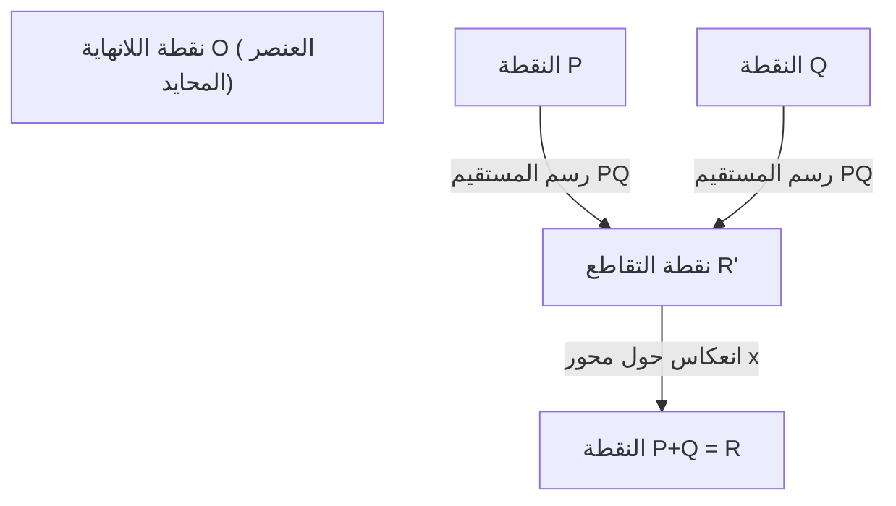
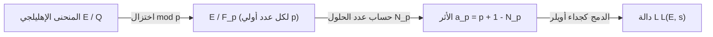

## 1. مقدمة: مسائل جائزة الألفية والمسائل غير المحلولة في نظرية الأعداد

يعد أحد أهم الألغاز في الرياضيات الحديثة، وأكثرها جمالاً وعمقًا، هو **حدسية بيرتش وسوينيرتون-داير** (Birch and Swinnerton-Dyer Conjecture، والمشار إليها فيما يلي باسم **حدسية BSD**). وقد تم اختيارها كواحدة من "مسائل جائزة الألفية" السبع التي أعلن عنها معهد كلاي للرياضيات في عام 2000، ويُمنح من يحلها جائزة قدرها مليون دولار.

تنتمي حدسية BSD إلى مجال يسمى "الهندسة الحسابية"، حيث تتقاطع الهندسة الجبرية مع نظرية الأعداد. بشكل عام، تدعي هذه الحدسية ادعاءً مذهلاً مفاده "ما إذا كان عدد النقاط الجذرية على منحنى إهليلجي لا نهائيًا يمكن معرفته من خلال النظر في سلوك الدالة المركبة (دالة L) المحددة من ذلك المنحنى الإهليلجي عند $s=1$". إنها حدسية تجسد الرومانسية في الرياضيات، حيث يحدد جمع المعلومات المحلية (عدد الحلول لمقياس الأعداد الأولية) المعلومات العامة (بنية الحلول الجذرية) بشكل كامل.

في هذا المقال، من أجل فهم ما تعنيه حدسية BSD، سنبدأ من أساسيات المنحنيات الإهليلجية، ونشرح بالتفصيل وبشكل دقيق مبرهنة مورديل، وتعريف دالة L، والادعاء الدقيق لحدسية BSD (الحدسية الضعيفة والحدسية القوية). علاوة على ذلك، سنتعمق في موضوعات متقدمة مثل ارتباطها بمسألة الأعداد المتطابقة والخلفية المعتمدة على كوهومولوجيا جالوا.

## 2. ما هو المنحنى الإهليلجي: جوهرة الهندسة الجبرية

البطل الرئيسي في حدسية BSD هو **المنحنى الإهليلجي** (Elliptic Curve). على الرغم من تسميته بـ "الإهليلجي"، إلا أنه لا علاقة مباشرة له بالشكل الهندسي للإهليلج (القطع الناقص). سُمي بهذا الاسم لأنه تم اكتشافه أثناء دراسة الدالة العكسية لـ "التكامل الإهليلجي" التي تظهر عند حساب طول قوس المنحنى الإهليلجي.

### 2.1. الشكل القياسي لفايرشتراس

بشكل عام، يمكن التعبير عن المنحنى الإهليلجي $E$ على حقل الأعداد الكسرية $\mathbb{Q}$ كمنحنى جبري إسقاطي غير شاذ (غير مفرد) يُعرّف بالمعادلة التكعيبية التالية (الشكل القياسي لفايرشتراس).

$$
E: y^2 = x^3 + ax + b \quad (a, b \in \mathbb{Q})
$$

هنا، "غير شاذ" (non-singular) تعني عدم وجود نقاط حادة (cusp) أو نقاط تقاطع ذاتي (node) على المنحنى. يتم التعبير عن هذا الشرط باستخدام المميز $\Delta$ على النحو التالي.

$$
\Delta = -16(4a^3 + 27b^2) \neq 0
$$

هندسيًا، إذا اعتبرنا هذا المنحنى على حقل الأعداد المركبة $\mathbb{C}$، فإنه يتخذ شكل طارة (شكل دونات). يظهر هذا من خلال التوافق التماثلي مع الطارة المركبة $\mathbb{C}/\Lambda$ ($\Lambda$ هي شبكة) باستخدام دالة $\wp$ لفايرشتراس.

### 2.2. النقاط الجذرية وبنية الزمرة

واحدة من أكثر الخصائص إثارة للدهشة في المنحنيات الإهليلجية هي أنه يمكن تعريف "عملية الجمع" للنقاط الموجودة عليها. يُعرف هذا باسم طريقة الوتر والمماس (chord and tangent method).

بالنسبة لنقطتين $P, Q$ على المنحنى، يُعرَّف الجمع $P + Q$ على النحو التالي:
1. نرسم مستقيمًا $L$ يمر بالنقطتين $P$ و $Q$ (إذا كان $P=Q$، نرسم المماس عند تلك النقطة).
2. وفقًا لمبرهنة بيزو، فإن المنحنى التكعيبي $E$ والمستقيم $L$ يتقاطعان بالضرورة في ثلاث نقاط (بما في ذلك التعددية). لنسم نقطة التقاطع الثالثة $R'$.
3. لنعكس النقطة $R'$ حول محور $x$ لنحصل على النقطة $R$، ونُعرّف هذا بأنه $P + Q$.

باعتبار نقطة اللانهاية $\mathcal{O}$ كعنصر صفري (عنصر محايد)، تشكل النقاط على المنحنى الإهليلجي $E$ زمرة أبيلية. وبشكل خاص، فإن مجموعة جميع النقاط الجذرية (النقاط التي تكون إحداثياتها $x, y$ أعدادًا كسرية) $E(\mathbb{Q})$ للمنحنى الإهليلجي المُعرّف على حقل الأعداد الكسرية $\mathbb{Q}$ تشكل زمرة جزئية بالنسبة لهذه العملية الجمعية.

لطالما تم دراسة مسألة إيجاد النقاط الجذرية كمسألة رئيسية في معادلات ديوفانتوس منذ العصور القديمة. الهدف الأكبر هو توضيح الصورة الكاملة لبنية مجموعة النقاط الجذرية.

## 3. مبرهنة مورديل والرتبة

في عام 1922، أثبت لويس مورديل (Louis Mordell) مبرهنة حاسمة حول بنية زمرة النقاط الجذرية $E(\mathbb{Q})$. لاحقًا، قام أندريه فايل (André Weil) بتوسيعها لتشمل حقول الأعداد العادية والتنويعات الأبيلية، وتُعرف الآن باسم مبرهنة مورديل-فايل.

### 3.1. مبرهنة مورديل (Mordell's Theorem)

**مبرهنة (مورديل، 1922)**
زمرة النقاط الجذرية $E(\mathbb{Q})$ للمنحنى الإهليلجي $E$ هي زمرة أبيلية مولدة نهائيًا.

وفقًا للمبرهنة الأساسية للزمر الأبيلية المولدة نهائيًا في الجبر، فإن $E(\mathbb{Q})$ لها التماثل التالي.

$$
E(\mathbb{Q}) \cong E(\mathbb{Q})_{\text{tors}} \oplus \mathbb{Z}^r
$$

حيث:
- $E(\mathbb{Q})_{\text{tors}}$ تُسمى **الزمرة الجزئية الالتوائية** (torsion subgroup)، وهي زمرة منتهية تتكون من جميع النقاط ذات الرتبة المنتهية (النقاط التي تؤدي إضافتها عدة مرات إلى نقطة اللانهاية $\mathcal{O}$). وفقًا لمبرهنة باري مازور (Barry Mazur) (1977)، تم تصنيف الهياكل المحتملة للزمرة الجزئية الالتوائية في المنحنيات الإهليلجية على حقل الأعداد الكسرية إلى 15 نوعًا فقط. تحديدًا، إما $\mathbb{Z}/N\mathbb{Z}$ ($1 \le N \le 10, N=12$) أو $\mathbb{Z}/2\mathbb{Z} \oplus \mathbb{Z}/2N\mathbb{Z}$ ($1 \le N \le 4$).
- $r$ هو عدد صحيح غير سالب ويُسمى **الرتبة** (rank).
- $\mathbb{Z}^r$ هي زمرة أبيلية حرة مُولدة من نقاط ذات رتبة لانهائية (نقاط لا تؤدي أبدًا إلى $\mathcal{O}$ بغض النظر عن عدد مرات إضافتها).

### 3.2. معنى الرتبة $r$ وصعوبتها

الرتبة $r$ هي ثابت مهم يشير إلى "عدد النقاط المستقلة عمليًا ذات الرتبة اللانهائية".
- إذا كان $r = 0$، فإن $E(\mathbb{Q})$ تصبح زمرة منتهية، ويوجد عدد منتهٍ فقط من النقاط الجذرية.
- إذا كان $r \ge 1$، فإن $E(\mathbb{Q})$ تحتوي على عدد لانهائي من النقاط الجذرية.

يمكن حساب وتحديد الزمرة الجزئية الالتوائية بسهولة خوارزميًا باستخدام مبرهنات مثل مبرهنة ناجل-لوتز. ومع ذلك، **لا توجد خوارزمية عامة لتحديد الرتبة $r$ معروفة حتى يومنا هذا.**

من الممكن حساب الرتبة لمعادلات معينة باستخدام تقنية تُعرف باسم طريقة النزول (descent)، ولكن العناصر غير التافهة في زمرة تيت-شافاريفيتش تشكل عقبة، ولا يوجد ضمان بأن الخوارزمية ستتوقف دائمًا. حتى لو كان من الممكن حساب الرتبة لمنحنى إهليلجي معين، فإن مسألة ما إذا كان هناك إجراء يتوقف بشكل مؤكد ويُخرج الرتبة لجميع المنحنيات الإهليلجية (القدرة على اتخاذ القرار) لا تزال غير محلولة.

حدسية BSD هي بالضبط الحدسية التي تربط هذه "الرتبة $r$، وهي معلومة عالمية صعبة الحساب للغاية"، بـ "كائن تحليلي يمكن حسابه من معلومات محلية".

## 4. من المحلي إلى العالمي: دالة هاس-فايل L

عندما يكون من الصعب إيجاد حلول للمعادلة على مجموعة الأعداد الكسرية بأكملها، فغالبًا ما تفكر نظرية الأعداد في عدد الحلول على الحقل المنتهي $\mathbb{F}_p$ "بمقياس العدد الأولي $p$" (modulo $p$). ويسمى هذا المعلومات المحلية.

### 4.1. عدد الحلول على الحقول المنتهية

نقلل المنحنى الإهليلجي $E: y^2 = x^3 + ax + b$ بواسطة العدد الأولي $p$، ونعتبر عدد الحلول (بما في ذلك نقطة اللانهاية) للتطابق
$$ y^2 \equiv x^3 + ax + b \pmod p $$
ليكون $N_p$.

حدسيًا، يأخذ $x \pmod p$ قيمًا يبلغ عددها $p$، واحتمال مساواته لـ $y^2$ هو حوالي $1/2$ (جذران إذا كان باقٍ تربيعي، 0 إذا لم يكن كذلك)، لذا من المتوقع أن يكون عدد الحلول $N_p$ حوالي $p$ (أو $p+1$ بما في ذلك نقطة اللانهاية). نُعرّف "الانحراف" عن هذه القيمة المتوقعة بـ $a_p$.

$$
a_p = p + 1 - N_p
$$

وفقًا لحد هاس (Hasse's bound)، من المعروف أن هذا الانحراف محدود بـ $|a_p| \le 2\sqrt{p}$. وهذا نوع من نظير فرضية ريمان للمنحنيات الإهليلجية على الحقول المنتهية.

### 4.2. تعريف دالة L

نجمع هذه المعلومات المحلية $a_p$ لجميع الأعداد الأولية $p$ ونبني دالة تحليلية واحدة. هذه هي **دالة هاس-فايل L** (Hasse-Weil L-function) $L(E, s)$.
بالنسبة لعدد مركب $s$، يتم تعريفه باستخدام جداء أويلر على النحو التالي.

$$
L(E, s) = \prod_{p \mid \Delta} (1 - a_p p^{-s})^{-1} \prod_{p \nmid \Delta} (1 - a_p p^{-s} + p^{1-2s})^{-1}
$$
(هنا الجداء الأول يشمل الأعداد الأولية ذات "الاختزال السيئ" (bad reduction)، والجداء الثاني يشمل الأعداد الأولية ذات "الاختزال الجيد" (good reduction). في حالة الاختزال السيئ، يأخذ $a_p$ إحدى القيم $1, -1, 0$ اعتمادًا على نوع الاختزال).

يمكن إثبات أن هذا الجداء اللانهائي يتقارب تقاربًا مطلقًا في المنطقة $\mathrm{Re}(s) > \frac{3}{2}$ باستخدام حد هاس.

### 4.3. الامتداد التحليلي ومبرهنة النمطية

من الأهمية بمكان في ذكر حدسية BSD هو مسألة ما إذا كان من الممكن تمديد $L(E, s)$ تحليليًا إلى المستوي المركب بأكمله. على وجه الخصوص، كما سنشرح لاحقًا، نريد معرفة سلوكها عند $s=1$، لكن جداء صيغة التعريف لا يتقارب عند $s=1$.

تم حل هذه المسألة بواسطة **مبرهنة النمطية** (Modularity Theorem) (المعروفة سابقًا باسم حدسية تانياما-شيمورا) التي تم إثباتها بالكامل في عام 2001. من خلال الإنجازات العظيمة لأندرو وايلز، وريتشارد تايلور، وكريستوف برويل، وبريان كونراد، وفريد دايموند، اتضح أن "جميع المنحنيات الإهليلجية على حقل الأعداد الكسرية نمطية".

يعني كونها نمطية أن $L(E, s)$ تتطابق تمامًا مع دالة L $L(f, s)$ لشكل نمطي معين $f$ ذي الوزن 2. يمكن تمديد دالة L للأشكال النمطية تحليليًا إلى المستوي المركب بأكمله بواسطة نظرية هيكي، وتفي بالمعادلة الدالية التالية.

$$
\Lambda(E, s) = (2\pi)^{-s} N^{s/2} \Gamma(s) L(E, s)
$$
$$
\Lambda(E, 2-s) = w \Lambda(E, s)
$$

هنا $N$ عدد صحيح يسمى الموصّل (conductor)، و $w \in \{1, -1\}$ هي الإشارة (رقم الجذر).
هذا الامتداد التحليلي يبرر رياضيًا مناقشة قيمة وتمديد تايلور لـ $L(E, s)$ عند $s=1$.

## 5. حدسية بيرتش وسوينيرتون-داير

في أوائل الستينيات، استخدم بريان بيرتش وبيتر سوينيرتون-داير كمبيوتر جامعة كامبريدج المبكر (EDSAC 2) لحساب $N_p$ لعدد كبير من المنحنيات الإهليلجية، ودرسوا تجريبيًا سلوك الجداء اللانهائي المقابل لـ $L(E, 1)$.

إذا كان هناك العديد من النقاط الجذرية (الرتبة $r$ كبيرة)، فمن المفترض أن يميل عدد الحلول $N_p$ إلى أن يكون كبيرًا حتى بعد أخذ المقياس لكل عدد أولي $p$. بعد ذلك، سيصبح $a_p = p + 1 - N_p$ كبيرًا في الاتجاه السالب، وسيصبح مصطلح جداء أويلر $(1 - a_p p^{-1} + p^{-1})^{-1}$ صغيرًا، لذا يجب أن تقترب قيمة دالة L عند $s=1$ من $0$.

انطلاقًا من هذه الرؤية المبنية على التجارب الحاسوبية، ولدت حدسية تتألق في تاريخ الرياضيات.

### 5.1. حدسية BSD (الحدسية الضعيفة)

**حدسية بيرتش وسوينيرتون-داير (ضعيفة)**
الرتبة $r$ للمنحنى الإهليلجي $E$ على حقل الأعداد الكسرية $\mathbb{Q}$ تساوي رتبة صفر دالتها L $L(E, s)$ عند $s=1$.

أي، عند النظر في تمديد تايلور، فإن الادعاء هو:
$$
L(E, s) = c(s-1)^r + \text{higher order terms} \quad (c \neq 0)
$$
وتسمى رتبة الصفر هذه **الرتبة التحليلية**.

هذه الحدسية مذهلة. "رتبة الصفر" في الجانب الأيسر (أو الأيمن) هي قيمة يتم تحديدها بحتة من معلومات تحليلية ومحلية. من ناحية أخرى، "الرتبة $r$" في الجانب الأيمن (أو الأيسر) هي قيمة تمثل البنية الجبرية والعالمية للنقاط الجذرية. تدعي الحدسية أن كميتين تنتميان إلى عوالم مختلفة تمامًا تتطابقان تمامًا.

على وجه الخصوص، عند التفكير في الحالتين $r=0$ و $r \ge 1$:
- $L(E, 1) \neq 0 \iff$ عدد النقاط الجذرية لـ $E(\mathbb{Q})$ منتهٍ
- $L(E, 1) = 0 \iff$ عدد النقاط الجذرية لـ $E(\mathbb{Q})$ غير منتهٍ

### 5.2. حدسية BSD (الحدسية القوية)

علاوة على ذلك، فقد توقعوا أن المعامل الأول غير الصفري $c$ في تمديد تايلور المذكور أعلاه (أي $L^{(r)}(E, 1) / r!$) يمكن وصفه بصيغة جميلة للغاية باستخدام الثوابت العددية المختلفة للمنحنى الإهليلجي. هذه هي **حدسية BSD القوية**.

$$
\lim_{s \to 1} \frac{L(E, s)}{(s-1)^r} = \frac{\Omega_E \cdot \mathrm{Reg}(E) \cdot |\text{Sha}(E)| \cdot \prod_{p} c_p}{|E(\mathbb{Q})_{\text{tors}}|^2}
$$

الثوابت التي تظهر في هذه الصيغة هي كما يلي:
1. **$\Omega_E$ (الدورة الحقيقية)**: عدد متسامٍ يُحدد من التكامل $\int_{E(\mathbb{R})} \frac{dx}{|2y + a_1x + a_3|}$ على حقل الأعداد الحقيقية للمنحنى الإهليلجي.
2. **$\mathrm{Reg}(E)$ (المنظم)**: محدد مصفوفة $r \times r$ تُرتب اقتران الارتفاع لنيرون-تيت (Néron-Tate height pairing) $\langle P_i, P_j \rangle$ للمولدات $P_1, \dots, P_r$ للنقاط الجذرية ذات الرتبة اللانهائية $r$. وهو مؤشر لقياس "حجم" النقاط.
3. **$|E(\mathbb{Q})_{\text{tors}}|$**: رتبة الزمرة الجزئية الالتوائية.
4. **$c_p$ (أرقام تاماغاوا)**: عامل تصحيح محلي للأعداد الأولية $p$ ذات الاختزال السيئ. يُحسب من تأثير زمرة جالوا للحقول المحلية.
5. **$\text{Sha}(E)$ (زمرة تيت-شافاريفيتش، $\text{\textcyrillic{Sh}}$)**: كيان بالغ الأهمية سنشرحه لاحقًا.

يمكن اعتبار هذه الصيغة امتدادًا نهائيًا لصيغة عدد الفئات لدركليه (Dirichlet's class number formula) في القرن التاسع عشر:
$$
\lim_{s \to 1} (s-1)\zeta_K(s) = \frac{2^{r_1} (2\pi)^{r_2} h_K R_K}{w_K \sqrt{|D_K|}}
$$
إلى المنحنيات الإهليلجية. يتوافق عدد الفئات $h_K$ في دالة زيتا لديدكايند مع $\text{Sha}(E)$، ويتوافق منظم زمرة الوحدات $R_K$ مع منظم المنحنى الإهليلجي $\mathrm{Reg}(E)$.

### 5.3. الزمرة الغامضة "Sha (Ш)" وكوهومولوجيا جالوا

الكيان الأكثر غموضًا وصعوبة في الصيغة هو زمرة تيت-شافاريفيتش $\text{Sha}(E)$ (التي يرمز لها بالحرف السيريلي $\text{\textcyrillic{Sh}}$).

المبدأ المحلي-العالمي (مبدأ هاس) ينص على أن "الشرط الضروري والكافي لكي يكون لجميع المعادلات حل في حقل الأعداد الكسرية (عالمي) هو أن يكون لها حل في حقل الأعداد $p$-adic (محلي) لكل عدد أولي $p$، وأن يكون لها حل في حقل الأعداد الحقيقية أيضًا". يسري هذا المبدأ على الأشكال التربيعية (مبرهنة هاس-مينكوفسكي).
ومع ذلك، لا يسري هذا المبدأ على المنحنيات الإهليلجية (المنحنيات التكعيبية). يمكن أن تحدث ظاهرة حيث "يوجد حل دائمًا محليًا، ولكن لا يوجد حل عالميًا".

تُعد $\text{Sha}(E)$ زمرة تقيس "فشل المبدأ المحلي-العالمي" باستخدام كوهومولوجيا جالوا. بشكل صارم، يتم تعريفها على النحو التالي.

$$
\text{Sha}(E) = \ker \left( H^1(G_{\mathbb{Q}}, E) \to \prod_{v} H^1(G_{\mathbb{Q}_v}, E) \right)
$$

هنا $G_{\mathbb{Q}}$ هي زمرة جالوا المطلقة، والجداء يمتد على جميع الأماكن (الأعداد الأولية الكسرية والأماكن اللانهائية).
تتضمن حدسية BSD القوية افتراضًا ضمنيًا بأن "$\text{Sha}(E)$ زمرة منتهية لأي منحنى إهليلجي". ومع ذلك، حتى يومنا هذا، لم يتم إثبات حتى أن $\text{Sha}(E)$ منتهية بالنسبة للمنحنيات الإهليلجية العامة. باستثناء النتائج المتعلقة بالمنحنيات ذات الضرب المركب من قبل كارل روبين (Karl Rubin) وآخرين، يظل الفهم الأساسي لـ $\text{Sha}(E)$ أحد أكبر التحديات في نظرية الأعداد الحديثة.

## 6. العلاقة بمسألة الأعداد المتطابقة

كأحد التطبيقات الشهيرة لحدسية BSD نجد **مسألة الأعداد المتطابقة (Congruent number problem)**. وهي مسألة تسأل: "هل يمكن أن يكون العدد الطبيعي $n$ مساحة لمثلث قائم الزاوية جميع أطوال أضلاعه أعداد كسرية؟". العدد $n$ الذي يمكن أن يكون مساحة يُسمى عددًا متطابقًا. على سبيل المثال، $n=5, 6, 7$ هي أعداد متطابقة، لكن $n=1, 2, 3$ ليست كذلك.

في الواقع، يُعرف أن كون $n$ عددًا متطابقًا يعادل أن المنحنى الإهليلجي المعين:
$$ E_n: y^2 = x^3 - n^2 x $$
يحتوي على عدد لانهائي من النقاط الجذرية (أي أن الرتبة $r \ge 1$).

إذا افترضنا أن حدسية BSD الضعيفة صحيحة، فإنه وبفضل مبرهنة تونيل (Tunnell) (1983)، يتم تقليص الشرط ليكون $n$ عددًا متطابقًا إلى شرط اختبار ابتدائي بسيط يتعلق بعدد حلول الأشكال التربيعية. وهكذا، تمتلك حدسية BSD القدرة على تقديم إجابة كاملة للمسائل الكلاسيكية في نظرية الأعداد التي يعود تاريخها إلى آلاف السنين.

## 7. التقدم الحالي والعوائق غير المحلولة

كما هو واضح من اختيارها كواحدة من مسائل جائزة الألفية، لم يتم التوصل إلى إثبات كامل لحدسية BSD. ومع ذلك، تم الحصول على بعض النتائج الجزئية المهمة.

### 7.1. حالة الرتبة $r \le 1$

بشكل مثير للدهشة، تم إثبات أن جزءًا كبيرًا من حدسية BSD صحيح في الحالات التي تكون فيها الرتبة التحليلية (رتبة الصفر لـ $L(E,s)$ عند $s=1$) تساوي 0 أو 1.

- **مبرهنة جروس-زاجير (Gross-Zagier, 1986)**:
  أظهرت أنه عندما تكون الرتبة التحليلية 1، فإن المشتق الأول لـ $L(E,s)$ عند $s=1$ يتناسب مع ارتفاع نيرون-تيت لـ "نقطة هيجنر (Heegner point)" المكونة من نقاط خاصة على المنحنى النمطي. وبما أن ارتفاع نقطة هيجنر غير صفري، فقد أثبتوا أن الرتبة الجبرية هي 1 أو أكثر.
- **مبرهنة كوليفاجين (Kolyvagin, 1989)**:
  بنى طريقة قوية في كوهومولوجيا جالوا تُسمى "نظام أويلر (Euler system)"، وأثبت أنه إذا كانت الرتبة التحليلية 0 أو 1، فإنها تتطابق مع الرتبة الجبرية، وأكثر من ذلك، أثبت أن زمرة تيت-شافاريفيتش $\text{Sha}(E)$ تكون زمرة منتهية فقط في هذه الحالات.

بفضل هذه الإنجازات، تأكد أن "حدسية BSD الضعيفة صحيحة للمنحنيات الإهليلجية ذات الرتبة التحليلية 0 أو 1".

### 7.2. الجدار العالي للرتبة $r \ge 2$

من ناحية أخرى، لا يُعرف أي شيء تقريبًا بالنسبة للمنحنيات الإهليلجية ذات الرتبة التحليلية 2 أو أكثر.
حتى بالنسبة لبعض المنحنيات المحددة التي يُعرف أن رتبتها الجبرية هي 2، لم يتم إثبات بصرامة أن রتبتها التحليلية هي 2 (بدون الاعتماد على التقريب الحاسوبي).
كما لم يتم العثور على آلية منهجية لبناء النقاط الجذرية مثل نظام أويلر في حالات الرتبة 2 فما فوق، وهذا يقف كجدار كبير في الرياضيات الحديثة.

منذ العقد الأول من القرن الحادي والعشرين، أسفرت أبحاث مانجول بارجافا (Manjul Bhargava) وأرول شانكار (Arul Shankar) وآخرين عن نتيجة إحصائية مذهلة مفادها أن **"ما لا يقل عن 66% من جميع المنحنيات الإهليلجية تفي بحدسية BSD"**. يعود ذلك إلى أنهم أظهروا أن المنحنيات ذات الرتبة 0 والرتبة 1 تشكل الغالبية العظمى (متوسط الرتبة محدود). ونتيجة لذلك، أصبحت حدسية BSD تبدو منطقية للغاية، على الأقل من منظور احتمالي وإحصائي.

## 8. الخاتمة

حدسية بيرتش وسوينيرتون-داير هي حدسية عظيمة تربط المنحنى الإهليلجي ككيان هندسي جبري، بدالة L ككيان تحليلي، بشكل رائع من خلال نظرية الأعداد.

- **دمج الجبر والهندسة**: البنية الزمرية للحلول الكسرية للمعادلات (الرتبة والالتواء).
- **عالم التحليل**: أصفار دالة L المبنية من عدد الحلول مقياس الأعداد الأولية.
- **السر العميق**: تطابقهما التام، ووصف معاملاتهما بثوابت في نظرية الأعداد (وخاصة $\text{Sha}(E)$ المليئة بالألغاز).

بمجرد حل حدسية BSD بالكامل، فلن يُحدث ذلك اختراقًا جذريًا في فهم الحلول الكسرية لمعادلات ديوفانتوس فحسب، بل سيشكل أساسًا صلبًا يدعم نظرية دوال موتيڤيك L الأوسع، مثل النظائر على حقول الدوال (حدسية أرتين-تيت) و"برنامج لانجلاندز" الذي يوحد فروعًا متعددة في الرياضيات.

ننتظر بفارغ الصبر اليوم الذي يجتاز فيه العقل البشري هذه الغابة العميقة تمامًا ويكتسب "عيونًا" جديدة للرؤية في عالم الرتبة العالمية 2 فما فوق.

---
*تم إنشاء هذا المقال لشرح مواضيع رياضية متقدمة. على الرغم من احتوائه على العديد من المعادلات، نتمنى أن تشعروا ولو قليلاً بجمال الهندسة الحسابية. نرحب بأسئلتكم ومناقشاتكم في قسم التعليقات.*
