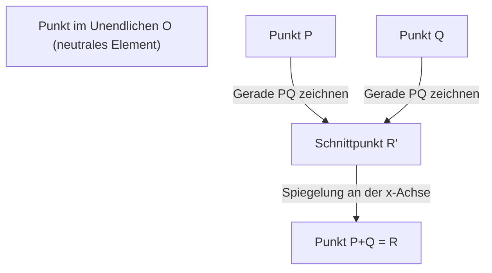
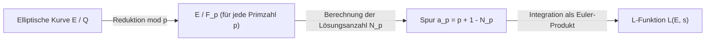

## 1. Einleitung: Die Millennium-Probleme und ungelöste Rätsel der Zahlentheorie

In der modernen Mathematik ist eines der wichtigsten und zugleich schönsten und tiefsten Rätsel die **Birch-Swinnerton-Dyer-Vermutung** (im Folgenden **BSD-Vermutung**). Sie wurde im Jahr 2000 vom Clay Mathematics Institute als eines der sieben "Millennium-Probleme" ausgewählt, und für ihre Lösung ist ein Preisgeld von 1 Million Dollar ausgesetzt.

Die BSD-Vermutung gehört zum Gebiet der "arithmetischen Geometrie", in dem sich algebraische Geometrie und Zahlentheorie überschneiden. Grob gesagt stellt diese Vermutung die erstaunliche Behauptung auf, dass "die Frage, ob die Anzahl der rationalen Punkte einer elliptischen Kurve unendlich ist, durch das Verhalten der aus dieser elliptischen Kurve bestimmten komplexen Funktion (L-Funktion) bei $s=1$ verstanden werden kann". Es ist eine Vermutung, die die Romantik der Mathematik verkörpert: Durch das Sammeln lokaler Informationen (die Anzahl der Lösungen modulo von Primzahlen) wird die globale Information (die Struktur der rationalen Lösungen) vollständig bestimmt.

In diesem Artikel werden wir im Detail und streng erklären, was die BSD-Vermutung bedeutet. Wir beginnen mit den Grundlagen elliptischer Kurven und gehen über den Satz von Mordell und die Definition der L-Funktion bis hin zur genauen Aussage der BSD-Vermutung (schwache und starke Vermutung). Darüber hinaus werden wir uns auch mit fortgeschrittenen Themen wie der Beziehung zum Problem der kongruenten Zahlen und dem Hintergrund in der Galois-Kohomologie befassen.

## 2. Was ist eine elliptische Kurve: Ein Juwel der algebraischen Geometrie

Der Hauptakteur der BSD-Vermutung ist die **elliptische Kurve** (Elliptic Curve). Obwohl sie den Namen "elliptisch" trägt, hat sie keine direkte Beziehung zur Ellipse als geometrische Figur. Der Name entstand, weil sie im Prozess der Untersuchung der Umkehrfunktion des "elliptischen Integrals" entdeckt wurde, das bei der Berechnung der Bogenlänge einer elliptischen Kurve auftritt.

### 2.1. Weierstraß-Normalform

Eine elliptische Kurve $E$ über dem Körper der rationalen Zahlen $\mathbb{Q}$ kann allgemein als nicht-singuläre projektive algebraische Kurve dargestellt werden, die durch eine kubische Gleichung (Weierstraß-Normalform) der folgenden Form definiert ist:

$$
E: y^2 = x^3 + ax + b \quad (a, b \in \mathbb{Q})
$$

Hier bedeutet "nicht-singulär" (non-singular), dass es auf der Kurve keine Spitzen (Cusps) oder Selbstüberschneidungen (Nodes) gibt. Diese Bedingung wird mithilfe der Diskriminante $\Delta$ wie folgt ausgedrückt:

$$
\Delta = -16(4a^3 + 27b^2) \neq 0
$$

Geometrisch betrachtet hat diese Kurve, wenn man sie über dem Körper der komplexen Zahlen $\mathbb{C}$ betrachtet, die Form eines Torus (Donut-Form). Dies wird durch den Isomorphismus zum komplexen Torus $\mathbb{C}/\Lambda$ ($\Lambda$ ist ein Gitter) unter Verwendung der Weierstraßschen $\wp$-Funktion gezeigt.

### 2.2. Rationale Punkte und Gruppenstruktur

Eine der erstaunlichsten Eigenschaften elliptischer Kurven ist, dass eine "Addition" für die Punkte darauf definiert werden kann. Dies wird als Sekanten-Tangenten-Konstruktion (chord and tangent method) bezeichnet.

Für zwei Punkte $P, Q$ auf der Kurve definieren wir die Addition $P + Q$ wie folgt:
1. Zeichne eine Gerade $L$ durch $P$ und $Q$ (wenn $P=Q$, zeichne die Tangente an diesem Punkt).
2. Nach dem Satz von Bézout haben die kubische Kurve $E$ und die Gerade $L$ (unter Berücksichtigung der Multiplizität) immer genau 3 Schnittpunkte. Wir nennen den dritten Schnittpunkt $R'$.
3. Wir spiegeln $R'$ an der $x$-Achse und nennen diesen Punkt $R$, den wir als $P + Q$ definieren.

Indem wir den Punkt im Unendlichen $\mathcal{O}$ als Nullelement (neutrales Element) festlegen, bilden die Punkte auf der elliptischen Kurve $E$ eine abelsche Gruppe. Insbesondere bildet die Menge aller rationalen Punkte (Punkte, deren Koordinaten $x, y$ beide rationale Zahlen sind) $E(\mathbb{Q})$ einer über dem Körper der rationalen Zahlen $\mathbb{Q}$ definierten elliptischen Kurve eine Untergruppe bezüglich dieser Addition.

Das Problem, rationale Punkte zu finden, wird seit langem als Hauptproblem von diophantischen Gleichungen untersucht. Das größte Ziel ist es, das Gesamtbild der Struktur der Menge der rationalen Punkte zu klären.

## 3. Der Satz von Mordell und der Rang

Im Jahr 1922 bewies Louis Mordell einen entscheidenden Satz über die Struktur der Gruppe der rationalen Punkte $E(\mathbb{Q})$. Dieser wurde später von André Weil auf allgemeinere algebraische Zahlkörper und abelsche Varietäten erweitert und ist als Satz von Mordell-Weil bekannt.

### 3.1. Der Satz von Mordell (Mordell's Theorem)

**Satz (Mordell, 1922)**
Die Gruppe der rationalen Punkte $E(\mathbb{Q})$ einer elliptischen Kurve $E$ ist eine endlich erzeugte abelsche Gruppe.

Nach dem Hauptsatz über endlich erzeugte abelsche Gruppen hat $E(\mathbb{Q})$ den folgenden Isomorphismus:

$$
E(\mathbb{Q}) \cong E(\mathbb{Q})_{\text{tors}} \oplus \mathbb{Z}^r
$$

Wobei:
- $E(\mathbb{Q})_{\text{tors}}$ die **Torsionsuntergruppe** genannt wird. Es ist eine endliche Gruppe, die aus allen Punkten endlicher Ordnung (Punkte, die nach mehrmaliger Addition den Punkt im Unendlichen $\mathcal{O}$ ergeben) besteht. Nach dem Satz von Barry Mazur (1977) ist vollständig klassifiziert, dass es nur 15 mögliche Strukturen für Torsionsuntergruppen von elliptischen Kurven über dem Körper der rationalen Zahlen gibt. Konkret sind dies entweder $\mathbb{Z}/N\mathbb{Z}$ ($1 \le N \le 10, N=12$) oder $\mathbb{Z}/2\mathbb{Z} \oplus \mathbb{Z}/2N\mathbb{Z}$ ($1 \le N \le 4$).
- $r$ ist eine nichtnegative ganze Zahl und wird **Rang** genannt.
- $\mathbb{Z}^r$ ist eine freie abelsche Gruppe, die von Punkten unendlicher Ordnung (Punkte, die niemals $\mathcal{O}$ werden, egal wie oft sie addiert werden) erzeugt wird.

### 3.2. Die Bedeutung und Schwierigkeit des Rangs $r$

Der Rang $r$ ist eine wichtige Invariante, die angibt, "wie viele im Wesentlichen unabhängige Punkte unendlicher Ordnung es gibt".
- Wenn $r = 0$, dann ist $E(\mathbb{Q})$ eine endliche Gruppe und es gibt nur endlich viele rationale Punkte.
- Wenn $r \ge 1$, dann hat $E(\mathbb{Q})$ unendlich viele rationale Punkte.

Die Torsionsuntergruppe kann mithilfe von Sätzen wie dem von Nagell-Lutz algorithmisch leicht berechnet und bestimmt werden. **Es ist jedoch bis heute kein allgemeiner Algorithmus bekannt, um den Rang $r$ zu bestimmen.**

Es ist zwar möglich, den Rang bestimmter Gleichungen mit einer Methode namens Abstieg (descent) zu berechnen, aber nicht-triviale Elemente der Tate-Shafarevich-Gruppe stellen ein Hindernis dar, sodass es keine Garantie gibt, dass der Algorithmus immer anhält. Selbst wenn es möglich ist, den Rang für eine bestimmte elliptische Kurve zu berechnen, ist noch nicht einmal gelöst, ob es überhaupt ein Verfahren gibt, das für alle elliptischen Kurven garantiert anhält und den Rang ausgibt (Entscheidbarkeit).

Die BSD-Vermutung ist genau die Vermutung, die diese "globale Information, deren Berechnung extrem schwierig ist, den Rang $r$", mit einem "aus lokalen Informationen berechenbaren analytischen Objekt" verknüpft.

## 4. Vom Lokalen zum Globalen: Hasse-Weil-L-Funktion

Wenn es schwierig ist, Lösungen einer Gleichung in allen rationalen Zahlen zu finden, betrachtet man in der Zahlentheorie oft die Anzahl der Lösungen über einem endlichen Körper $\mathbb{F}_p$ "modulo der Primzahl $p$". Dies wird als lokale Information bezeichnet.

### 4.1. Anzahl der Lösungen über endlichen Körpern

Wir reduzieren die elliptische Kurve $E: y^2 = x^3 + ax + b$ mit der Primzahl $p$ und bezeichnen die Anzahl der Lösungen (einschließlich des Punktes im Unendlichen) der Kongruenz
$$ y^2 \equiv x^3 + ax + b \pmod p $$
als $N_p$.

Intuitiv nimmt $x \pmod p$ $p$ verschiedene Werte an, und die Wahrscheinlichkeit, dass es gleich $y^2$ wird, liegt bei etwa $1/2$ (2, wenn es ein quadratischer Rest ist, 0, wenn es ein Nichtrest ist). Daher erwartet man, dass die Anzahl der Lösungen $N_p$ ungefähr $p$ (bzw. $p+1$ einschließlich des Punktes im Unendlichen) beträgt. Die "Abweichung" von diesem erwarteten Wert definieren wir als $a_p$:

$$
a_p = p + 1 - N_p
$$

Nach dem Satz von Hasse (Hasse's bound) ist bekannt, dass diese Abweichung durch $|a_p| \le 2\sqrt{p}$ beschränkt ist. Dies ist eine Art Analogon der Riemannschen Vermutung für elliptische Kurven über endlichen Körpern.

### 4.2. Definition der L-Funktion

Wir sammeln diese lokalen Informationen $a_p$ für alle Primzahlen $p$ und konstruieren eine einzige analytische Funktion. Dies ist die **Hasse-Weil-L-Funktion** $L(E, s)$.
Für eine komplexe Zahl $s$ ist sie unter Verwendung eines Euler-Produkts wie folgt definiert:

$$
L(E, s) = \prod_{p \mid \Delta} (1 - a_p p^{-s})^{-1} \prod_{p \nmid \Delta} (1 - a_p p^{-s} + p^{1-2s})^{-1}
$$
(Hierbei ist das erste Produkt über Primzahlen mit "schlechter Reduktion" (bad reduction) und das zweite über Primzahlen mit "guter Reduktion" (good reduction). Bei schlechter Reduktion nimmt $a_p$ je nach Art der Reduktion einen der Werte $1, -1, 0$ an.)

Mit der Hasse-Schranke kann gezeigt werden, dass dieses unendliche Produkt im Bereich $\mathrm{Re}(s) > \frac{3}{2}$ absolut konvergiert.

### 4.3. Analytische Fortsetzung und Modularitätssatz

Entscheidend für die Formulierung der BSD-Vermutung ist die Frage, ob $L(E, s)$ auf die gesamte komplexe Ebene analytisch fortgesetzt werden kann. Insbesondere wollen wir das Verhalten bei $s=1$ wissen, wie später beschrieben wird, aber das Produkt der Definitionsgleichung konvergiert bei $s=1$ nicht.

Dieses Problem wurde durch den **Modularitätssatz** (ehemals Taniyama-Shimura-Vermutung) gelöst, der 2001 vollständig bewiesen wurde. Durch die großartige Arbeit von Andrew Wiles, Richard Taylor, Christophe Breuil, Brian Conrad und Fred Diamond wurde gezeigt, dass "alle elliptischen Kurven über dem Körper der rationalen Zahlen modular sind".

Modular zu sein bedeutet, dass $L(E, s)$ vollständig mit der L-Funktion $L(f, s)$ einer Modulform $f$ vom Gewicht 2 übereinstimmt. Die L-Funktion der Modulform wird durch die Hecke-Theorie auf die gesamte komplexe Ebene analytisch fortgesetzt und erfüllt die folgende Funktionalgleichung:

$$
\Lambda(E, s) = (2\pi)^{-s} N^{s/2} \Gamma(s) L(E, s)
$$
$$
\Lambda(E, 2-s) = w \Lambda(E, s)
$$

Hier ist $N$ eine ganze Zahl, die Führer (conductor) genannt wird, und $w \in \{1, -1\}$ ist das Vorzeichen (Wurzelzahl).
Diese analytische Fortsetzung rechtfertigt mathematisch die Diskussion des Wertes und der Taylor-Entwicklung von $L(E, s)$ bei $s=1$.

## 5. Die Birch-Swinnerton-Dyer-Vermutung

In den frühen 1960er Jahren nutzten Bryan Birch und Peter Swinnerton-Dyer den frühen Computer der Universität Cambridge (EDSAC 2), um $N_p$ für eine große Anzahl elliptischer Kurven zu berechnen und das Verhalten des unendlichen Produkts, das $L(E, 1)$ entspricht, experimentell zu untersuchen.

Wenn es viele rationale Punkte gibt (der Rang $r$ groß ist), sollte die Anzahl der Lösungen $N_p$ tendenziell auch groß sein, wenn man modulo jeder Primzahl $p$ rechnet. Dann wird $a_p = p + 1 - N_p$ in negativer Richtung größer, und der Term des Euler-Produkts $(1 - a_p p^{-1} + p^{-1})^{-1}$ wird kleiner, sodass der Wert der L-Funktion bei $s=1$ sich $0$ nähern sollte.

Aus dieser auf Computerexperimenten basierenden Erkenntnis entstand eine Vermutung, die hell in der Geschichte der Mathematik erstrahlt.

### 5.1. BSD-Vermutung (schwache Vermutung)

**Birch-Swinnerton-Dyer-Vermutung (schwach)**
Der Rang $r$ einer elliptischen Kurve $E$ über dem Körper der rationalen Zahlen $\mathbb{Q}$ ist gleich der Ordnung der Nullstelle ihrer L-Funktion $L(E, s)$ bei $s=1$.

Das heißt, wenn man die Taylor-Entwicklung betrachtet, lautet die Behauptung:
$$
L(E, s) = c(s-1)^r + \text{Terme höherer Ordnung} \quad (c \neq 0)
$$
Diese Ordnung der Nullstelle wird als **analytischer Rang** bezeichnet.

Diese Vermutung ist erderschütternd. Die "Ordnung der Nullstelle" auf der linken (oder rechten) Seite ist ein Wert, der rein aus analytischen, lokalen Informationen bestimmt wird. Andererseits ist der "Rang $r$" auf der rechten (oder linken) Seite ein Wert, der die algebraische, globale Struktur der rationalen Punkte darstellt. Zwei Größen, die zu völlig unterschiedlichen Welten gehören, sollen vollständig übereinstimmen.

Wenn wir insbesondere die Fälle $r=0$ und $r \ge 1$ betrachten, gilt:
- $L(E, 1) \neq 0 \iff$ Die Anzahl der rationalen Punkte von $E(\mathbb{Q})$ ist endlich.
- $L(E, 1) = 0 \iff$ Die Anzahl der rationalen Punkte von $E(\mathbb{Q})$ ist unendlich.

### 5.2. BSD-Vermutung (starke Vermutung)

Darüber hinaus vermuteten sie, dass der erste Nicht-Null-Koeffizient $c$ (also $L^{(r)}(E, 1) / r!$) in der obigen Taylor-Entwicklung durch eine äußerst schöne Formel beschrieben werden kann, die verschiedene zahlentheoretische Invarianten der elliptischen Kurve verwendet. Dies ist die **starke BSD-Vermutung**.

$$
\lim_{s \to 1} \frac{L(E, s)}{(s-1)^r} = \frac{\Omega_E \cdot \mathrm{Reg}(E) \cdot |\text{Sha}(E)| \cdot \prod_{p} c_p}{|E(\mathbb{Q})_{\text{tors}}|^2}
$$

Die Invarianten, die in dieser Formel vorkommen, sind:
1. **$\Omega_E$ (reelle Periode)**: Eine transzendente Zahl, die aus dem Integral $\int_{E(\mathbb{R})} \frac{dx}{|2y + a_1x + a_3|}$ über dem reellen Körper der elliptischen Kurve bestimmt wird.
2. **$\mathrm{Reg}(E)$ (Regulator)**: Die Determinante der $r \times r$-Matrix, deren Einträge die Néron-Tate-Höhenpaarungen (Néron-Tate height pairing) $\langle P_i, P_j \rangle$ der Erzeuger $P_1, \dots, P_r$ der rationalen Punkte unendlicher Ordnung vom Rang $r$ sind. Es ist ein Indikator, der die "Größe" der Punkte misst.
3. **$|E(\mathbb{Q})_{\text{tors}}|$**: Die Ordnung der Torsionsuntergruppe.
4. **$c_p$ (Tamagawa-Zahl)**: Ein lokaler Korrekturfaktor für die Primzahl $p$ mit schlechter Reduktion. Er wird aus der Wirkung der Galoisgruppe des lokalen Körpers berechnet.
5. **$\text{Sha}(E)$ (Tate-Shafarevich-Gruppe, $\text{\textcyrillic{Sh}}$)**: Ein extrem wichtiges Objekt, das später erklärt wird.

Diese Formel kann als ultimative Verallgemeinerung der Dirichletschen Klassenzahlformel (Dirichlet's class number formula) aus dem 19. Jahrhundert angesehen werden:
$$
\lim_{s \to 1} (s-1)\zeta_K(s) = \frac{2^{r_1} (2\pi)^{r_2} h_K R_K}{w_K \sqrt{|D_K|}}
$$
auf elliptische Kurven. Die Klassenzahl $h_K$ in der Dedekindschen Zeta-Funktion entspricht $\text{Sha}(E)$, und der Regulator der Einheitengruppe $R_K$ entspricht dem Regulator der elliptischen Kurve $\mathrm{Reg}(E)$.

### 5.3. Die mysteriöse Gruppe "Sha (Ш)" und Galois-Kohomologie

Das mystischste und am schwersten verständliche Objekt in der Formel ist die Tate-Shafarevich-Gruppe $\text{Sha}(E)$ (dargestellt durch den kyrillischen Buchstaben $\text{\textcyrillic{Sh}}$).

Das Lokal-Global-Prinzip (Hasse-Prinzip) besagt: "Die notwendige und hinreichende Bedingung dafür, dass alle Gleichungen Lösungen im Körper der rationalen Zahlen (global) haben, ist, dass sie für alle Primzahlen $p$ Lösungen im Körper der $p$-adischen Zahlen (lokal) und auch im reellen Körper haben." Für quadratische Formen gilt dieses Prinzip (Satz von Hasse-Minkowski).
Für elliptische Kurven (kubische Kurven) gilt dieses Prinzip jedoch nicht. Es kann das Phänomen auftreten, dass "es lokal überall Lösungen gibt, aber global keine Lösungen existieren".

$\text{Sha}(E)$ ist die Gruppe, die dieses "Scheitern des Lokal-Global-Prinzips" mithilfe der Galois-Kohomologie misst. Streng definiert sie sich wie folgt:

$$
\text{Sha}(E) = \ker \left( H^1(G_{\mathbb{Q}}, E) \to \prod_{v} H^1(G_{\mathbb{Q}_v}, E) \right)
$$

Hierbei ist $G_{\mathbb{Q}}$ die absolute Galoisgruppe und das Produkt erstreckt sich über alle Stellen (rationale Primzahlen und unendliche Stellen).
Die starke BSD-Vermutung beinhaltet die implizite Annahme, dass "$\text{Sha}(E)$ für jede elliptische Kurve eine endliche Gruppe ist". Bis heute ist jedoch noch nicht einmal bewiesen, dass $\text{Sha}(E)$ für allgemeine elliptische Kurven endlich ist. Abgesehen von Ergebnissen wie denen von Karl Rubin zu Kurven mit komplexer Multiplikation, ist das grundlegende Verständnis von $\text{Sha}(E)$ eines der größten Probleme der modernen Zahlentheorie.

## 6. Beziehung zum Problem der kongruenten Zahlen

Eine sehr berühmte Anwendung der BSD-Vermutung ist das **Problem der kongruenten Zahlen (Congruent number problem)**. Es ist die Frage: "Kann eine natürliche Zahl $n$ die Fläche eines rechtwinkligen Dreiecks sein, dessen Seitenlängen alle rationale Zahlen sind?". Ein $n$, das eine solche Fläche sein kann, wird kongruente Zahl genannt. Zum Beispiel sind $n=5, 6, 7$ kongruente Zahlen, aber $n=1, 2, 3$ sind keine kongruenten Zahlen.

Tatsächlich ist bekannt, dass die Eigenschaft von $n$, eine kongruente Zahl zu sein, äquivalent dazu ist, dass die bestimmte elliptische Kurve
$$ E_n: y^2 = x^3 - n^2 x $$
unendlich viele rationale Punkte hat (also einen Rang $r \ge 1$ aufweist).

Wenn wir annehmen, dass die schwache BSD-Vermutung richtig ist, wird nach dem Satz von Tunnell (1983) die Bedingung, dass $n$ eine kongruente Zahl ist, auf elementare Kriterien bezüglich der Anzahl der Lösungen einfacher quadratischer Formen reduziert. Auf diese Weise hat die BSD-Vermutung die Kraft, eine vollständige Antwort selbst auf klassische Probleme der Zahlentheorie zu geben, die seit Tausenden von Jahren existieren.

## 7. Aktueller Fortschritt und ungelöste Barrieren

Wie bei den Millennium-Problemen üblich, wurde die BSD-Vermutung noch nicht vollständig bewiesen. Es wurden jedoch einige wichtige Teilergebnisse erzielt.

### 7.1. Der Fall von Rang $r \le 1$

Erstaunlicherweise ist der Großteil der BSD-Vermutung bewiesen, wenn der analytische Rang (die Ordnung der Nullstelle von $L(E,s)$ bei $s=1$) 0 oder 1 beträgt.

- **Satz von Gross-Zagier (Gross-Zagier, 1986)**:
  Sie zeigten, dass bei einem analytischen Rang von 1 die erste Ableitung von $L(E,s)$ bei $s=1$ proportional zur Néron-Tate-Höhe eines "Heegner-Punktes (Heegner point)" ist, der aus speziellen Punkten auf der Modulkurve konstruiert wird. Aus der Tatsache, dass die Höhe des Heegner-Punktes ungleich null ist, bewiesen sie, dass der algebraische Rang mindestens 1 ist.
- **Satz von Kolyvagin (Kolyvagin, 1989)**:
  Er konstruierte eine mächtige Methode der Galois-Kohomologie namens Euler-System (Euler system) und bewies, dass bei einem analytischen Rang von 0 oder 1 dieser mit dem algebraischen Rang übereinstimmt, und dass nur dann die Tate-Shafarevich-Gruppe $\text{Sha}(E)$ eine endliche Gruppe wird.

Durch diese Errungenschaften steht fest, dass "die schwache BSD-Vermutung für elliptische Kurven mit einem analytischen Rang von 0 oder 1 wahr ist".

### 7.2. Die hohe Barriere von Rang $r \ge 2$

Andererseits ist für elliptische Kurven mit einem analytischen Rang von 2 oder höher erstaunlich wenig bekannt.
Selbst für bestimmte Kurven, von denen bekannt ist, dass ihr algebraischer Rang 2 ist, gibt es kein einziges Beispiel, bei dem streng bewiesen werden konnte, dass der analytische Rang 2 ist (und nicht nur durch numerische Näherung mit Computern berechnet).
Darüber hinaus wurde kein systematischer Mechanismus zur Konstruktion von rationalen Punkten wie das Euler-System für den Fall eines Rangs von 2 oder höher gefunden, was als große Barriere in der modernen Mathematik im Weg steht.

Seit den 2010er Jahren haben Forschungen von Manjul Bhargava und Arul Shankar ein erstaunliches statistisches Ergebnis geliefert: **"Von allen elliptischen Kurven erfüllen mindestens 66% die BSD-Vermutung"**. Dies liegt daran, dass sie zeigten, dass Kurven mit Rang 0 und Rang 1 die überwiegende Mehrheit ausmachen (der durchschnittliche Rang ist beschränkt). Dadurch wurde bestätigt, dass die BSD-Vermutung zumindest aus probabilistischer und statistischer Sicht äußerst plausibel ist.

## 8. Zusammenfassung

Die Birch-Swinnerton-Dyer-Vermutung ist eine großartige Vermutung, die das Objekt der algebraischen Geometrie, die elliptische Kurve, auf brillante Weise durch die Zahlentheorie mit dem Objekt der Analysis, der L-Funktion, verknüpft.

- **Verschmelzung von Algebra und Geometrie**: Die Gruppenstruktur der rationalen Lösungen von Gleichungen (Rang und Torsion).
- **Die Welt der Analysis**: Die Nullstellen der L-Funktion, die aus der Anzahl der Lösungen modulo von Primzahlen gebildet wird.
- **Ein tiefes Rätsel**: Sie stimmen vollständig überein, und darüber hinaus werden ihre Koeffizienten durch zahlentheoretische Invarianten (insbesondere das mysteriöse $\text{Sha}(E)$) beschrieben.

Wenn die BSD-Vermutung vollständig gelöst ist, wird dies nicht nur einen ultimativen Durchbruch im Verständnis der rationalen Lösungen von diophantischen Gleichungen bringen, sondern auch ein solides Fundament für umfassendere Theorien der motivischen L-Funktionen bilden, wie das Analogon über Funktionenkörpern (Artin-Tate-Vermutung) und das "Langlands-Programm", das verschiedene Bereiche der Mathematik integriert.

Es wird der Tag erwartet, an dem der menschliche Verstand diesen tiefen Wald vollständig durchquert und ein neues "Auge" für die Welt des globalen Rangs 2 und höher erlangt.

---
*Dieser Artikel wurde erstellt, um fortgeschrittene mathematische Themen zu erklären. Er enthält viele mathematische Formeln, aber wir hoffen, dass Sie die Schönheit der arithmetischen Geometrie zumindest ein wenig spüren können. Wir freuen uns auf Ihre Fragen und Diskussionen in den Kommentaren.*
