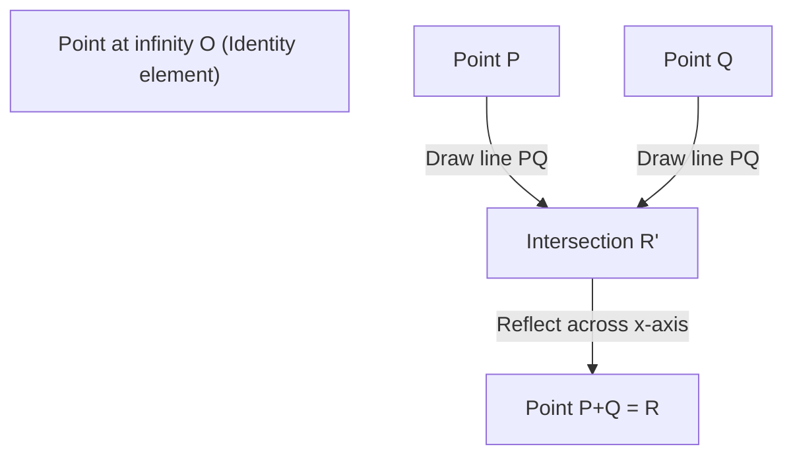

## 1. Introduction: Millennium Prize Problems and Unsolved Problems in Number Theory

One of the most important, beautiful, and profound mysteries in modern mathematics is the **Birch and Swinnerton-Dyer Conjecture** (hereafter **BSD Conjecture**). It was selected as one of the seven "Millennium Prize Problems" announced by the Clay Mathematics Institute in 2000, and a prize of one million dollars will be awarded to whoever solves it.

The BSD Conjecture belongs to the field of "arithmetic geometry," where algebraic geometry and number theory intersect. Roughly speaking, this conjecture makes the astonishing claim that "whether an elliptic curve has an infinite number of rational points can be determined by looking at the behavior of the complex function (L-function) determined by the elliptic curve at $s=1$." By gathering local information (the number of solutions modulo prime numbers), the global information (the structure of rational solutions) is completely determined. It is a conjecture that embodies the romance of mathematics.

In this article, to understand what the BSD Conjecture means, we will start from the basics of elliptic curves, and explain in detail and rigorously Mordell's theorem, the definition of L-functions, and the precise statements of the BSD Conjecture (weak conjecture and strong conjecture). Furthermore, we will delve into advanced topics such as the connection with the congruent number problem and the background of [Galois](https://kenji.blog/en/p/galois/) cohomology.

## 2. What is an Elliptic Curve: A Jewel of Algebraic Geometry

The main character of the BSD Conjecture is the **Elliptic Curve**. Although it has the name "elliptic," it has no direct relationship with the ellipse as a geometric figure. The name comes from the fact that it was discovered in the process of studying the inverse functions of the "elliptic integrals" that appear when calculating the arc length of an ellipse.

### 2.1. Weierstrass Standard Form

An elliptic curve $E$ over the field of rational numbers $\mathbb{Q}$ can generally be represented as a non-singular projective algebraic curve defined by a cubic equation of the following form (Weierstrass standard form):

$$
E: y^2 = x^3 + ax + b \quad (a, b \in \mathbb{Q})
$$

Here, "non-singular" means that there are no cusps or self-intersections (nodes) on the curve. This condition is expressed using the discriminant $\Delta$ as follows:

$$
\Delta = -16(4a^3 + 27b^2) \neq 0
$$

Geometrically, when considered over the field of complex numbers $\mathbb{C}$, this curve has the shape of a torus (doughnut). This is shown from the isomorphic correspondence with the complex torus $\mathbb{C}/\[Lambda](https://kenji.blog/en/p/serverless-architecture-aws-lambda-cold-start/)$ ($\Lambda$ is a lattice) using the Weierstrass $\wp$-function.

### 2.2. Rational Points and Group Structure

One of the most surprising properties of elliptic curves is that "addition" can be defined for the points on them. This is called the chord and tangent method.

For two points $P, Q$ on the curve, the addition $P + Q$ is defined as follows:
1. Draw a line $L$ passing through $P$ and $Q$ (if $P=Q$, draw the tangent line at that point).
2. According to Bézout's theorem, the cubic curve $E$ and the line $L$ always have exactly 3 intersection points (including multiplicity). Let the third intersection point be $R'$.
3. Let $R$ be the point obtained by reflecting $R'$ symmetrically with respect to the $x$-axis, and define this as $P + Q$.

By making the point at infinity $\mathcal{O}$ the zero element (identity element), the points on the elliptic curve $E$ form an abelian group. In particular, the set $E(\mathbb{Q})$ of all rational points (points whose coordinates $x, y$ are both rational numbers) on an elliptic curve defined over the rational number field $\mathbb{Q}$ is a subgroup with respect to this addition.

The problem of finding rational points has long been studied as a major problem in Diophantine equations. The ultimate goal is to clarify the entire structure of the set of rational points.

## 3. Mordell's Theorem and the Rank

In 1922, [Louis Mordell](https://kenji.blog/en/p/mordell/) proved a decisive theorem regarding the structure of the rational point group $E(\mathbb{Q})$. Later, [André Weil](https://kenji.blog/en/p/weil/) extended this to more general number fields and abelian varieties, and it is known as the Mordell-Weil theorem.

### 3.1. Mordell's Theorem (Mordell's Theorem)

**Theorem (Mordell, 1922)**
The rational point group $E(\mathbb{Q})$ of an elliptic curve $E$ is a finitely generated abelian group.

According to the fundamental theorem of finitely generated abelian groups in algebra, $E(\mathbb{Q})$ has the following isomorphism:

$$
E(\mathbb{Q}) \cong E(\mathbb{Q})_{\text{tors}} \oplus \mathbb{Z}^r
$$

Here,
- $E(\mathbb{Q})_{\text{tors}}$ is called the **torsion subgroup**, and is a finite group consisting of all points of finite order (points that become the point at infinity $\mathcal{O}$ after being added several times). By Barry Mazur's theorem (1977), it is completely classified that there are only 15 possible structures for the torsion subgroup of an elliptic curve over the rational number field. Specifically, it is either $\mathbb{Z}/N\mathbb{Z}$ ($1 \le N \le 10, N=12$) or $\mathbb{Z}/2\mathbb{Z} \oplus \mathbb{Z}/2N\mathbb{Z}$ ($1 \le N \le 4$).
- $r$ is a non-negative integer, called the **rank**.
- $\mathbb{Z}^r$ is a free abelian group generated by points of infinite order (points that never become $\mathcal{O}$ no matter how many times they are added).

### 3.2. Meaning and Difficulty of the Rank $r$

The rank $r$ is an important invariant that represents "how many essentially independent points of infinite order there are."
- If $r = 0$, $E(\mathbb{Q})$ becomes a finite group, and there are only a finite number of rational points.
- If $r \ge 1$, $E(\mathbb{Q})$ has an infinite number of rational points.

The torsion subgroup can be easily calculated and determined algorithmically using Nagell-Lutz's theorem, etc. However, **a general algorithm to determine the rank $r$ is unknown to this day.**

Although it is possible to calculate the rank of a specific equation using a method called descent, non-trivial elements of the Tate-Shafarevich group act as obstacles, and there is no guarantee that the algorithm will always halt. Even if it is possible to calculate the rank for a certain specific elliptic curve, it is still an unsolved problem whether there exists a procedure that definitely halts and outputs the rank for all elliptic curves (decidability).

The BSD Conjecture is precisely a conjecture that connects this "global information, the rank $r$, which is extremely difficult to compute" to an "analytical object computable from local information."

## 4. From Local to Global: Hasse-Weil L-function

When it is difficult to find solutions to an equation over the rational numbers, number theory often considers the number of solutions over the finite field $\mathbb{F}_p$ "modulo a prime number $p$". This is called local information.

### 4.1. Number of Solutions over Finite Fields

We reduce the elliptic curve $E: y^2 = x^3 + ax + b$ modulo a prime $p$, and let $N_p$ be the number of solutions to the congruence
$$ y^2 \equiv x^3 + ax + b \pmod p $$
(including the point at infinity).

Intuitively, $x \pmod p$ takes $p$ values, and the probability of being equal to $y^2$ is about $1/2$ (2 if it's a quadratic residue, 0 if non-residue), so the number of solutions $N_p$ is expected to be about $p$ (or $p+1$ including the point at infinity). We define the "deviation" from this expected value as $a_p$:

$$
a_p = p + 1 - N_p
$$

According to Hasse's theorem (Hasse's bound), this deviation is known to be bounded by $|a_p| \le 2\sqrt{p}$. This is a kind of analogue to the [Riemann](https://kenji.blog/en/p/riemann/) Hypothesis for elliptic curves over finite fields.

### 4.2. Definition of the L-function

We gather these local information $a_p$ for all prime numbers $p$ and construct a single analytical function. This is the **Hasse-Weil L-function** $L(E, s)$.
For a complex number $s$, it is defined using an Euler product as follows:

$$
L(E, s) = \prod_{p \mid \Delta} (1 - a_p p^{-s})^{-1} \prod_{p \nmid \Delta} (1 - a_p p^{-s} + p^{1-2s})^{-1}
$$
(Here, the first product is over primes with "bad reduction," and the second is over primes with "good reduction." In the case of bad reduction, $a_p$ takes one of $1, -1, 0$ depending on the type of reduction.)

By using Hasse's bound, it is shown that this infinite product converges absolutely in the region $\mathrm{Re}(s) > \frac{3}{2}$.

### 4.3. Analytic Continuation and Modularity Theorem

What is decisively important in stating the BSD Conjecture is whether $L(E, s)$ can be analytically continued to the entire complex plane. In particular, we want to know its behavior at $s=1$ as described later, but the product in the definition does not converge at $s=1$.

This problem was completely solved by the **Modularity Theorem** (formerly the Taniyama-Shimura Conjecture), which was fully proved in 2001. Through the monumental work of [Andrew Wiles](https://kenji.blog/en/p/wiles/), Richard Taylor, Christophe Breuil, Brian Conrad, and Fred Diamond, it was shown that "all elliptic curves over the field of rational numbers are modular."

Being modular means that $L(E, s)$ completely matches the L-function $L(f, s)$ of a certain modular form $f$ of weight 2. The L-function of a modular form is analytically continued to the entire complex plane by Hecke's theory, and satisfies the following functional equations:

$$
\[Lambda](https://kenji.blog/en/p/serverless-architecture-aws-lambda-cold-start/)(E, s) = (2\pi)^{-s} N^{s/2} \Gamma(s) L(E, s)
$$
$$
\Lambda(E, 2-s) = w \Lambda(E, s)
$$

Here, $N$ is an integer called the conductor, and $w \in \{1, -1\}$ is the sign (root number).
This analytic continuation mathematically justifies the discussion of the value of $L(E, s)$ and its Taylor expansion at $s=1$.

## 5. Birch and Swinnerton-Dyer Conjecture

In the early 1960s, Brian Birch and Peter Swinnerton-Dyer used an early computer at Cambridge University (EDSAC 2) to calculate $N_p$ for many elliptic curves and experimentally investigated the behavior of the infinite product corresponding to $L(E, 1)$.

If there are many rational points (the rank $r$ is large), the number of solutions $N_p$ modulo each prime $p$ should tend to be large. Then $a_p = p + 1 - N_p$ will become large in the negative direction, and the term $(1 - a_p p^{-1} + p^{-1})^{-1}$ in the Euler product will become small, so the value of the L-function at $s=1$ should approach $0$.

From the insights based on this computer experiment, a conjecture that shines brilliantly in the history of mathematics was born.

### 5.1. BSD Conjecture (Weak Conjecture)

**Birch and Swinnerton-Dyer Conjecture (Weak)**
The rank $r$ of an elliptic curve $E$ over the field of rational numbers $\mathbb{Q}$ is equal to the order of vanishing of its L-function $L(E, s)$ at $s=1$.

That is, when considering the Taylor expansion,
$$
L(E, s) = c(s-1)^r + \text{higher order terms} \quad (c \neq 0)
$$
is claimed. The order of vanishing here is called the **analytic rank**.

This conjecture is earth-shattering. The "order of vanishing" on the left side (or right side) is a value determined purely by analytic and local information. On the other hand, the "rank $r$" on the right side (or left side) is a value representing the algebraic and global structure of rational points. Two quantities belonging to completely different worlds are said to perfectly coincide.

In particular, considering the cases $r=0$ and $r \ge 1$:
- $L(E, 1) \neq 0 \iff E(\mathbb{Q})$ has a finite number of rational points
- $L(E, 1) = 0 \iff E(\mathbb{Q})$ has an infinite number of rational points

### 5.2. BSD Conjecture (Strong Conjecture)

Furthermore, they conjectured that the first non-zero coefficient $c$ in the Taylor expansion mentioned earlier (i.e., $L^{(r)}(E, 1) / r!$) can be described by an extremely beautiful formula using various number-theoretic invariants of the elliptic curve. This is the **Strong BSD Conjecture**.

$$
\lim_{s \to 1} \frac{L(E, s)}{(s-1)^r} = \frac{\Omega_E \cdot \mathrm{Reg}(E) \cdot |\text{Sha}(E)| \cdot \prod_{p} c_p}{|E(\mathbb{Q})_{\text{tors}}|^2}
$$

The invariants appearing in this formula are as follows:
1. **$\Omega_E$ (Real period)**: A transcendental number determined from the integral $\int_{E(\mathbb{R})} \frac{dx}{|2y + a_1x + a_3|}$ over the field of real numbers of the elliptic curve.
2. **$\mathrm{Reg}(E)$ (Regulator)**: The determinant of an $r \times r$ matrix whose entries are the Néron-Tate height pairings $\langle P_i, P_j \rangle$ for generators $P_1, \dots, P_r$ of the rational points of infinite order with rank $r$. It is an indicator measuring the "size" of the points.
3. **$|E(\mathbb{Q})_{\text{tors}}|$**: The order of the torsion subgroup.
4. **$c_p$ (Tamagawa number)**: A local correction factor for primes $p$ with bad reduction. It is calculated from the action of the [Galois](https://kenji.blog/en/p/galois/) group of the local field.
5. **$\text{Sha}(E)$ (Tate-Shafarevich group, $\text{\textcyrillic{Sh}}$)**: An extremely important object, which will be discussed later.

This formula can be viewed as the ultimate generalized form of Dirichlet's class number formula from the 19th century:
$$
\lim_{s \to 1} (s-1)\zeta_K(s) = \frac{2^{r_1} (2\pi)^{r_2} h_K R_K}{w_K \sqrt{|D_K|}}
$$
applied to elliptic curves. The class number $h_K$ in Dedekind's zeta function corresponds to $\text{Sha}(E)$, and the regulator of the unit group $R_K$ corresponds to the regulator of the elliptic curve $\mathrm{Reg}(E)$.

### 5.3. The Mysterious Group "Sha (Ш)" and [Galois](https://kenji.blog/en/p/galois/) Cohomology

The most mysterious and difficult object in the formula is the Tate-Shafarevich group $\text{Sha}(E)$ (represented by the Cyrillic letter $\text{\textcyrillic{Sh}}$).

The local-global principle (Hasse principle) states that "a necessary and sufficient condition for all equations to have solutions in the rational number field (global) is that they have solutions in the $p$-adic number fields (local) for all primes $p$, and also have solutions in the real number field." This principle holds for quadratic forms (Hasse-Minkowski theorem).
However, this principle does not hold for elliptic curves (cubic curves). A phenomenon can occur where "solutions exist locally everywhere, but no solutions exist globally."

$\text{Sha}(E)$ is a group that measures this "failure of the local-global principle" using [Galois](https://kenji.blog/en/p/galois/) cohomology. Strictly speaking, it is defined as follows:

$$
\text{Sha}(E) = \ker \left( H^1(G_{\mathbb{Q}}, E) \to \prod_{v} H^1(G_{\mathbb{Q}_v}, E) \right)
$$

Here, $G_{\mathbb{Q}}$ is the absolute [Galois](https://kenji.blog/en/p/galois/) group, and the product is taken over all places (rational primes and infinite places).
The Strong BSD Conjecture includes the implicit assumption that "for any elliptic curve, $\text{Sha}(E)$ is a finite group." However, to this day, it has not even been proven that $\text{Sha}(E)$ is finite for a general elliptic curve. Except for results on curves with complex multiplication by Karl Rubin and others, a fundamental understanding of $\text{Sha}(E)$ is one of the biggest challenges in modern number theory.

## 6. Relationship with the Congruent Number Problem

A very famous application of the BSD Conjecture is the **Congruent number problem**. It is the question: "Can a certain natural number $n$ be the area of a right triangle whose side lengths are all rational numbers?" An $n$ that can be the area is called a congruent number. For example, $n=5, 6, 7$ are congruent numbers, but $n=1, 2, 3$ are not congruent numbers.

In fact, it is known that $n$ being a congruent number is equivalent to the specific elliptic curve
$$ E_n: y^2 = x^3 - n^2 x $$
having an infinite number of rational points (that is, its rank $r \ge 1$).

If we assume the Weak BSD Conjecture is true, by Tunnell's theorem (1983), the condition for $n$ to be a congruent number is reduced to an elementary decision condition concerning the number of solutions to a simple quadratic form. In this way, the BSD Conjecture has the power to provide a complete answer even to a classical number theory problem that has been around for thousands of years.

## 7. Current Progress and Unsolved Barriers

As the BSD Conjecture is selected as a Millennium Prize Problem, a complete proof has not yet been achieved. However, several important partial results have been obtained.

### 7.1. The Case of Rank $r \le 1$

Surprisingly, when the analytic rank (the order of vanishing of $L(E,s)$ at $s=1$) is 0 or 1, a large part of the BSD Conjecture has been proven to be true.

- **Gross-Zagier Theorem (1986)**:
  They showed that when the analytic rank is 1, the first derivative of $L(E,s)$ at $s=1$ is proportional to the Néron-Tate height of a "Heegner point" constructed from special points on a modular curve. From the fact that the height of the Heegner point is non-zero, they proved that the algebraic rank is at least 1.
- **Kolyvagin's Theorem (1989)**:
  He constructed a powerful [Galois](https://kenji.blog/en/p/galois/) cohomology method called an "Euler system," and proved that when the analytic rank is 0 or 1, it coincides with the algebraic rank, and furthermore, only in that case is the Tate-Shafarevich group $\text{Sha}(E)$ a finite group.

Due to these achievements, it has been established that "for elliptic curves with an analytic rank of 0 or 1, the Weak BSD Conjecture is true."

### 7.2. The High Barrier of Rank $r \ge 2$

On the other hand, for elliptic curves with an analytic rank of 2 or more, surprisingly little is known.
Even for specific curves where the algebraic rank is known to be 2, there has been no case where it has been rigorously proven (not by computer approximation) that the analytic rank is 2.
Moreover, a systematic mechanism for constructing rational points like the Euler system in the case of rank 2 or more has not been found, and it stands as a great barrier in modern mathematics.

Since the 2010s, through the research of Manjul Bhargava and Arul Shankar, an astonishing statistical result has been obtained: **"At least 66% of all elliptic curves satisfy the BSD Conjecture."** This is because they showed that curves of rank 0 and rank 1 make up the vast majority of all curves (the average rank is bounded). This confirms that the BSD Conjecture is highly plausible, at least from a probabilistic and statistical point of view.

## 8. Conclusion

The Birch and Swinnerton-Dyer Conjecture is a magnificent conjecture that beautifully connects an object of algebraic geometry, the elliptic curve, and an object of analysis, the L-function, through number theory.

- **Fusion of Algebra and Geometry**: The group structure of rational solutions to an equation (rank and torsion).
- **The World of Analysis**: The zeroes of the L-function constructed from the number of solutions modulo primes.
- **Deep Mystery**: They match perfectly, and furthermore, its coefficient is described by number-theoretic invariants (especially the mysterious $\text{Sha}(E)$).

When the BSD Conjecture is completely resolved, it will not only bring an ultimate breakthrough in understanding the rational solutions of Diophantine equations but will also become a solid foundation supporting the core of more extensive motivic L-function theories, such as analogies over function fields (the Artin-Tate conjecture) and the "Langlands program" that unifies various fields of mathematics.

The day is eagerly awaited when human intellect completely traverses this deep forest and acquires a new "eye" for the world of global ranks of 2 or more.

---
*This article was created for the purpose of explaining advanced mathematical topics. Although it contains many mathematical formulas, we hope you can feel even a little of the beauty of arithmetic geometry. We welcome your questions and discussions in the comment section.*
