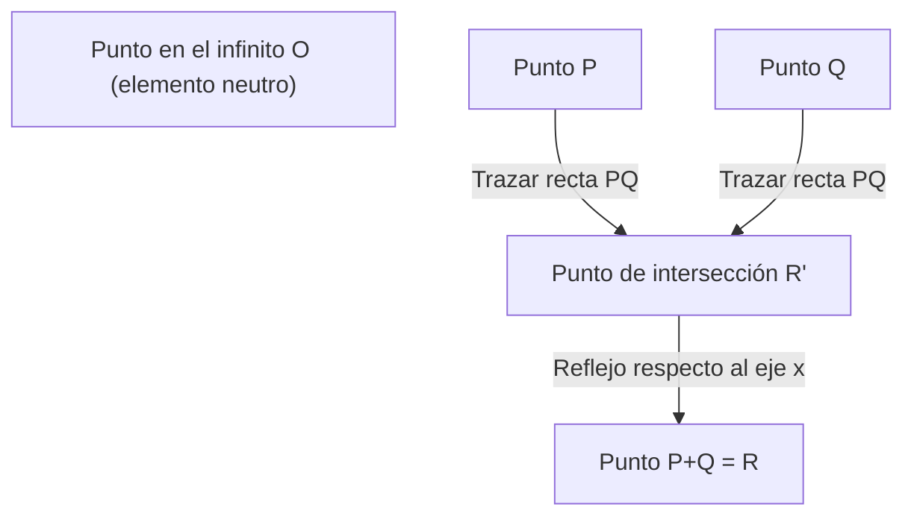
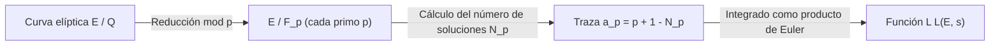

## 1. Introducción: Los Problemas del Milenio y los misterios sin resolver de la teoría de números

En la matemática moderna, uno de los misterios más importantes, bellos y profundos es la **Conjetura de Birch y Swinnerton-Dyer** (en adelante, **Conjetura BSD**). Fue seleccionada en el año 2000 por el Instituto Clay de Matemáticas como uno de los siete "Problemas del Milenio", y quien logre resolverla recibirá un premio de un millón de dólares.

La conjetura BSD pertenece al campo de la "geometría aritmética", donde se cruzan la geometría algebraica y la teoría de números. En términos generales, esta conjetura hace una afirmación asombrosa: "Si una curva elíptica tiene o no un número infinito de puntos racionales, se puede saber observando el comportamiento de una función compleja (función L) determinada a partir de esa curva elíptica, evaluada en $s=1$". Es una conjetura que encarna el romanticismo de las matemáticas, afirmando que mediante la recopilación de información local (el número de soluciones módulo números primos), la información global (la estructura de las soluciones de los números racionales) puede determinarse por completo.

En este artículo, para entender qué significa la conjetura BSD, partiremos de los fundamentos de las curvas elípticas y explicaremos detallada y rigurosamente el teorema de Mordell, la definición de las funciones L y la afirmación exacta de la conjetura BSD (conjeturas débil y fuerte). Además, nos adentraremos en temas avanzados como la relación con el problema de los números congruentes y el trasfondo de la cohomología de Galois.

## 2. ¿Qué es una curva elíptica?: La joya de la geometría algebraica

El protagonista de la conjetura BSD es la **curva elíptica** (Elliptic Curve). Aunque lleva el nombre de "elíptica", no tiene una relación directa con la elipse como figura geométrica. Recibe este nombre porque fue descubierta durante el estudio de las funciones inversas de las "integrales elípticas" que aparecen al calcular la longitud de arco de una elipse.

### 2.1. Forma estándar de Weierstrass

Una curva elíptica $E$ sobre el cuerpo de los números racionales $\mathbb{Q}$ puede expresarse generalmente como una curva algebraica proyectiva no singular definida por una ecuación cúbica de la siguiente forma (forma estándar de Weierstrass):

$$
E: y^2 = x^3 + ax + b \quad (a, b \in \mathbb{Q})
$$

Aquí, "no singular" (non-singular) significa que no hay puntos de retroceso (cúspides) ni puntos de autointersección (nodos) en la curva. Esta condición se expresa usando el discriminante $\Delta$ de la siguiente manera:

$$
\Delta = -16(4a^3 + 27b^2) \neq 0
$$

Geométricamente, si consideramos esta curva sobre el cuerpo de los números complejos $\mathbb{C}$, tiene la forma de un toro (una rosquilla). Esto se demuestra por su isomorfismo con el toro complejo $\mathbb{C}/\Lambda$ ($\Lambda$ es una red) utilizando la función $\wp$ de Weierstrass.

### 2.2. Puntos racionales y estructura de grupo

Una de las propiedades más sorprendentes de las curvas elípticas es que se puede definir la "suma" de sus puntos. Esto se conoce como el método de la cuerda y la tangente (chord and tangent method).

Para dos puntos $P, Q$ en la curva, la suma $P + Q$ se define de la siguiente manera:
1. Trazar una recta $L$ que pase por $P$ y $Q$ (si $P=Q$, trazar la recta tangente en ese punto).
2. Según el teorema de Bézout, la curva cúbica $E$ y la recta $L$ siempre tendrán 3 puntos de intersección (contando la multiplicidad). Llamamos a este tercer punto de intersección $R'$.
3. Reflejamos el punto $R'$ con respecto al eje $x$ para obtener un punto $R$, y definimos esto como $P + Q$.

Tomando el punto en el infinito $\mathcal{O}$ como el elemento cero (elemento neutro), los puntos de la curva elíptica $E$ forman un grupo abeliano. En particular, el conjunto de todos los puntos racionales (aquellos cuyas coordenadas $x, y$ son ambas números racionales) de una curva elíptica definida sobre el cuerpo de los números racionales $\mathbb{Q}$, denotado como $E(\mathbb{Q})$, forma un subgrupo con respecto a esta adición.

El problema de encontrar puntos racionales ha sido estudiado desde la antigüedad como un problema central de las ecuaciones diofánticas. El mayor objetivo es revelar completamente la estructura general que tiene el conjunto de puntos racionales.

## 3. Teorema de Mordell y el rango

En 1922, [Louis Mordell](https://kenji.blog/p/mordell/) demostró un teorema decisivo sobre la estructura del grupo de puntos racionales $E(\mathbb{Q})$. Posteriormente, [André Weil](https://kenji.blog/p/weil/) lo generalizó a cuerpos de números algebraicos y variedades abelianas, y hoy se conoce como el teorema de Mordell-Weil.

### 3.1. Teorema de Mordell

**Teorema (Mordell, 1922)**
El grupo de puntos racionales $E(\mathbb{Q})$ de una curva elíptica $E$ es un grupo abeliano finitamente generado.

Según el teorema fundamental de los grupos abelianos finitamente generados, $E(\mathbb{Q})$ tiene el siguiente isomorfismo:

$$
E(\mathbb{Q}) \cong E(\mathbb{Q})_{\text{tors}} \oplus \mathbb{Z}^r
$$

Donde:
- $E(\mathbb{Q})_{\text{tors}}$ se llama el **subgrupo de torsión** y es un grupo finito formado por todos los puntos de orden finito (puntos que, al sumarse varias veces, resultan en el punto en el infinito $\mathcal{O}$). Según el teorema de Barry Mazur (1977), se han clasificado completamente las posibles estructuras del subgrupo de torsión en curvas elípticas sobre el cuerpo de los números racionales, existiendo solo 15 tipos. Específicamente, son de la forma $\mathbb{Z}/N\mathbb{Z}$ ($1 \le N \le 10, N=12$) o $\mathbb{Z}/2\mathbb{Z} \oplus \mathbb{Z}/2N\mathbb{Z}$ ($1 \le N \le 4$).
- $r$ es un número entero no negativo, llamado el **rango** (rank).
- $\mathbb{Z}^r$ es el grupo abeliano libre generado por puntos de orden infinito (puntos que, sin importar cuántas veces se sumen, nunca llegan a ser $\mathcal{O}$).

### 3.2. Significado y dificultad del rango $r$

El rango $r$ es un invariante importante que indica "cuántos puntos de orden infinito y fundamentalmente independientes existen".
- Si $r = 0$, $E(\mathbb{Q})$ será un grupo finito, lo que significa que solo hay un número finito de puntos racionales.
- Si $r \ge 1$, $E(\mathbb{Q})$ tendrá un número infinito de puntos racionales.

El subgrupo de torsión se puede calcular y determinar algorítmicamente de forma fácil utilizando el teorema de Nagell-Lutz. Sin embargo, **hasta el día de hoy, no se conoce ningún algoritmo general para determinar el rango $r$.**

Aunque es posible calcular el rango de ecuaciones específicas utilizando un método llamado método de descenso (descent), los elementos no triviales del grupo de Tate-Shafarevich suponen un obstáculo, lo que significa que no hay garantía de que el algoritmo se detenga en algún momento. Incluso si es posible calcular el rango para una curva elíptica particular, todavía es un problema no resuelto si existe un procedimiento que asegure detenerse y proporcionar el rango para todas las curvas elípticas (decidibilidad).

La conjetura BSD relaciona precisamente este "rango $r$, que es una información global extremadamente difícil de calcular", con un "objeto analítico calculable a partir de información local".

## 4. De lo local a lo global: La función L de Hasse-Weil

Cuando resulta difícil encontrar las soluciones de una ecuación en el conjunto de todos los números racionales, en teoría de números a menudo consideramos el número de soluciones sobre un cuerpo finito $\mathbb{F}_p$, "módulo un número primo $p$". A esto lo llamamos información local.

### 4.1. Número de soluciones en un cuerpo finito

Al reducir una curva elíptica $E: y^2 = x^3 + ax + b$ usando un número primo $p$, consideramos la congruencia
$$ y^2 \equiv x^3 + ax + b \pmod p $$
y definimos el número de soluciones (incluyendo el punto en el infinito) como $N_p$.

Intuitivamente, dado que $x \pmod p$ puede tomar $p$ valores diferentes, y la probabilidad de que sea igual a un $y^2$ es de aproximadamente $1/2$ (2 si es un residuo cuadrático, 0 si no lo es), se espera que el número de soluciones $N_p$ sea aproximadamente de $p$ (y de $p+1$ si incluimos el punto en el infinito). Definimos la "desviación" de este valor esperado como $a_p$:

$$
a_p = p + 1 - N_p
$$

Según la cota de Hasse (Hasse's bound), se sabe que esta desviación está limitada por $|a_p| \le 2\sqrt{p}$. Esto es una especie de analogía a la Hipótesis de Riemann para curvas elípticas sobre cuerpos finitos.

### 4.2. Definición de la función L

Reuniendo esta información local $a_p$ para todos los números primos $p$, construimos una única función analítica. Esta es la **función L de Hasse-Weil** (Hasse-Weil L-function) $L(E, s)$.
Para un número complejo $s$, se define mediante un producto de Euler de la siguiente manera:

$$
L(E, s) = \prod_{p \mid \Delta} (1 - a_p p^{-s})^{-1} \prod_{p \nmid \Delta} (1 - a_p p^{-s} + p^{1-2s})^{-1}
$$
(Aquí, el primer producto es sobre los números primos con "mala reducción" (bad reduction), y el segundo sobre los números primos con "buena reducción" (good reduction). En el caso de mala reducción, $a_p$ toma uno de los valores $1, -1, 0$ dependiendo del tipo de reducción).

Usando la cota de Hasse, se demuestra que este producto infinito converge absolutamente en la región $\mathrm{Re}(s) > \frac{3}{2}$.

### 4.3. Continuación analítica y el teorema de la modularidad

Para plantear la conjetura BSD, el aspecto críticamente importante es si $L(E, s)$ se puede extender mediante continuación analítica a todo el plano complejo. En particular, como veremos más adelante, queremos conocer su comportamiento en $s=1$, pero el producto que la define no converge en $s=1$.

Este problema fue resuelto mediante el **teorema de la modularidad** (anteriormente conocido como conjetura de Taniyama-Shimura), completamente demostrado en 2001. Gracias al monumental trabajo de [Andrew Wiles](https://kenji.blog/p/wiles/), Richard Taylor, Christophe Breuil, Brian Conrad y Fred Diamond, se demostró que "todas las curvas elípticas sobre el cuerpo de los números racionales son modulares".

Ser modular significa que $L(E, s)$ coincide exactamente con la función L $L(f, s)$ de cierta forma modular $f$ de peso 2. Por la teoría de Hecke, la función L de una forma modular se extiende analíticamente a todo el plano complejo y satisface una ecuación funcional del siguiente tipo:

$$
\Lambda(E, s) = (2\pi)^{-s} N^{s/2} \Gamma(s) L(E, s)
$$
$$
\Lambda(E, 2-s) = w \Lambda(E, s)
$$

Aquí, $N$ es un número entero llamado el conductor (conductor), y $w \in \{1, -1\}$ es el signo (número de raíz o root number).
Gracias a esta continuación analítica, el debate sobre el valor de $L(E, s)$ en $s=1$ o su expansión de Taylor queda matemáticamente justificado.

## 5. La Conjetura de Birch y Swinnerton-Dyer

A principios de la década de 1960, Bryan Birch y Peter Swinnerton-Dyer utilizaron una de las primeras computadoras de la Universidad de Cambridge (la EDSAC 2) para calcular $N_p$ en un gran número de curvas elípticas e investigar experimentalmente el comportamiento del producto infinito correspondiente a $L(E, 1)$.

Si hay muchos puntos racionales (es decir, el rango $r$ es grande), el número de soluciones $N_p$ módulo cada número primo $p$ debería tender a ser grande. Entonces, $a_p = p + 1 - N_p$ se volvería grande en dirección negativa, y el término del producto de Euler $(1 - a_p p^{-1} + p^{-1})^{-1}$ se haría más pequeño, de modo que el valor de la función L en $s=1$ debería acercarse a $0$.

A partir de esta intuición basada en experimentos informáticos, nació una de las conjeturas más brillantes de la historia de las matemáticas.

### 5.1. Conjetura BSD (Conjetura débil)

**Conjetura de Birch y Swinnerton-Dyer (Débil)**
El rango $r$ de una curva elíptica $E$ sobre el cuerpo de los números racionales $\mathbb{Q}$ es igual al orden del cero de su función L $L(E, s)$ en $s=1$.

Es decir, si consideramos la expansión de Taylor, la conjetura afirma que:
$$
L(E, s) = c(s-1)^r + \text{términos de orden superior} \quad (c \neq 0)
$$
El orden de este cero se denomina **rango analítico**.

Esta conjetura es revolucionaria. El "orden del cero" del lado izquierdo (o derecho) es un valor que se determina a partir de información puramente analítica y local. Por otro lado, el "rango $r$" del lado derecho (izquierdo) es un valor que representa la estructura algebraica y global de los puntos racionales. ¡La conjetura afirma que dos cantidades que pertenecen a mundos completamente diferentes coinciden a la perfección!

Especialmente, si consideramos los casos donde $r=0$ y $r \ge 1$:
- $L(E, 1) \neq 0 \iff$ El número de puntos racionales en $E(\mathbb{Q})$ es finito
- $L(E, 1) = 0 \iff$ El número de puntos racionales en $E(\mathbb{Q})$ es infinito

### 5.2. Conjetura BSD (Conjetura fuerte)

Además, conjeturaron que el primer coeficiente no nulo $c$ en la expansión de Taylor anterior (es decir, $L^{(r)}(E, 1) / r!$) se puede describir con una fórmula extremadamente hermosa utilizando diversos invariantes aritméticos de la curva elíptica. Esta es la **Conjetura BSD fuerte**.

$$
\lim_{s \to 1} \frac{L(E, s)}{(s-1)^r} = \frac{\Omega_E \cdot \mathrm{Reg}(E) \cdot |\text{Sha}(E)| \cdot \prod_{p} c_p}{|E(\mathbb{Q})_{\text{tors}}|^2}
$$

Los invariantes que aparecen en esta fórmula son los siguientes:
1. **$\Omega_E$ (Período real)**: Un número trascendente que resulta de la integral sobre el cuerpo de los números reales $\int_{E(\mathbb{R})} \frac{dx}{|2y + a_1x + a_3|}$ de la curva elíptica.
2. **$\mathrm{Reg}(E)$ (Regulador)**: Para los generadores $P_1, \dots, P_r$ de puntos racionales de orden infinito de rango $r$, es el determinante de la matriz $r \times r$ formada por los emparejamientos de alturas de Néron-Tate (Néron-Tate height pairing) $\langle P_i, P_j \rangle$. Es una medida del "tamaño" de los puntos.
3. **$|E(\mathbb{Q})_{\text{tors}}|$**: El orden del subgrupo de torsión.
4. **$c_p$ (Números de Tamagawa)**: Factores de corrección local para los números primos $p$ con mala reducción. Se calculan a partir de la acción del grupo de Galois del cuerpo local.
5. **$\text{Sha}(E)$ (Grupo de Tate-Shafarevich, $\text{\textcyrillic{Sh}}$)**: Se describirá más adelante por ser un objeto sumamente importante.

Esta fórmula puede considerarse como la forma definitiva y generalizada para curvas elípticas de la fórmula del número de clases de Dirichlet (Dirichlet's class number formula) del siglo XIX:
$$
\lim_{s \to 1} (s-1)\zeta_K(s) = \frac{2^{r_1} (2\pi)^{r_2} h_K R_K}{w_K \sqrt{|D_K|}}
$$
El número de clases $h_K$ en la función zeta de Dedekind corresponde a $\text{Sha}(E)$, y el regulador $R_K$ del grupo de unidades corresponde al regulador $\mathrm{Reg}(E)$ de la curva elíptica.

### 5.3. El misterioso grupo "Sha (Ш)" y la cohomología de Galois

El objeto más místico e inescrutable de la fórmula es el grupo de Tate-Shafarevich $\text{Sha}(E)$ (representado por la letra cirílica $\text{\textcyrillic{Sh}}$).

El principio local-global (principio de Hasse) establece que "una condición necesaria y suficiente para que toda ecuación tenga solución en el cuerpo de los números racionales (global) es que tenga solución en el cuerpo de los números $p$-ádicos (local) para todos los números primos $p$, así como en el cuerpo de los números reales". Este principio se cumple para las formas cuadráticas (teorema de Hasse-Minkowski).
Sin embargo, este principio no se cumple para las curvas elípticas (curvas cúbicas). Puede ocurrir el fenómeno de que "existan soluciones localmente en todas partes, pero no globalmente".

$\text{Sha}(E)$ es un grupo que mide este "fracaso del principio local-global" mediante el uso de la cohomología de Galois. Estrictamente, se define de la siguiente manera:

$$
\text{Sha}(E) = \ker \left( H^1(G_{\mathbb{Q}}, E) \to \prod_{v} H^1(G_{\mathbb{Q}_v}, E) \right)
$$

Aquí, $G_{\mathbb{Q}}$ es el grupo de Galois absoluto, y el producto es sobre todos los lugares (números primos racionales y el lugar en el infinito).
La conjetura BSD fuerte incluye la premisa implícita de que "el grupo $\text{Sha}(E)$ es finito para cualquier curva elíptica". Sin embargo, hasta el día de hoy, ni siquiera se ha demostrado que $\text{Sha}(E)$ sea finito para una curva elíptica general. Salvo resultados para curvas con multiplicación compleja obtenidos por Karl Rubin, entre otros, comprender verdaderamente el grupo $\text{Sha}(E)$ es uno de los mayores desafíos de la teoría de números moderna.

## 6. Relación con el problema de los números congruentes

Una aplicación sumamente famosa de la conjetura BSD es el **problema de los números congruentes** (Congruent number problem). Consiste en la pregunta: "¿Puede un número natural $n$ ser el área de un triángulo rectángulo en el cual todas las longitudes de sus lados son números racionales?". El número $n$ que puede ser área se llama número congruente. Por ejemplo, $n=5, 6, 7$ son números congruentes, pero $n=1, 2, 3$ no lo son.

En realidad, se sabe que $n$ es un número congruente si y solo si la curva elíptica específica
$$ E_n: y^2 = x^3 - n^2 x $$
tiene infinitos puntos racionales (es decir, el rango es $r \ge 1$).

Si suponemos que la conjetura BSD débil es cierta, por el teorema de Tunnell (1983), las condiciones para que $n$ sea un número congruente se reducen a criterios de evaluación elementales sobre el número de soluciones de ciertas formas cuadráticas simples. Así, la conjetura BSD tiene el poder de proporcionar una respuesta completa a problemas clásicos de teoría de números que datan de hace miles de años.

## 7. Avances actuales y el muro de lo no resuelto

Como era de esperar para uno de los Problemas del Milenio, la conjetura BSD todavía carece de una demostración completa. Sin embargo, se han obtenido algunos resultados parciales muy importantes.

### 7.1. Casos de rango $r \le 1$

Sorprendentemente, para los casos en los que el rango analítico (el orden del cero de $L(E,s)$ en $s=1$) es 0 o 1, se ha demostrado que gran parte de la conjetura BSD es correcta.

- **Teorema de Gross-Zagier (1986)**:
  Demostraron que cuando el rango analítico es 1, la primera derivada de $L(E,s)$ en $s=1$ es proporcional a la altura de Néron-Tate del "punto de Heegner", construido a partir de puntos especiales en curvas modulares. Al demostrar que la altura del punto de Heegner no es cero, comprobaron que el rango algebraico es al menos 1.
- **Teorema de Kolyvagin (1989)**:
  Construyó un método muy poderoso en la cohomología de Galois llamado sistema de Euler (Euler system). Demostró que cuando el rango analítico es 0 o 1, coincide con el rango algebraico, y además, solo en esos casos, el grupo de Tate-Shafarevich $\text{Sha}(E)$ es un grupo finito.

Gracias a estos logros, se ha establecido que "la conjetura BSD débil es verdadera para las curvas elípticas con rango analítico 0 o 1".

### 7.2. La gran barrera del rango $r \ge 2$

Por el contrario, sabemos asombrosamente poco sobre curvas elípticas cuyo rango analítico sea 2 o superior.
Ni siquiera existe un caso en el que se haya demostrado de manera rigurosa (sin aproximaciones computacionales) que el rango analítico de una curva específica sea 2, incluso sabiendo que su rango algebraico lo es.
Además, no se ha encontrado un mecanismo sistemático, como los sistemas de Euler, para construir puntos racionales en casos donde el rango es 2 o superior, lo que supone un enorme obstáculo en las matemáticas modernas.

Desde la década de 2010, gracias a la investigación de Manjul Bhargava y Arul Shankar, se ha obtenido un resultado estadístico sorprendente: **"Al menos el 66% de todas las curvas elípticas cumplen con la conjetura BSD"**. Esto se debe a que demostraron que las curvas con rango 0 y 1 representan a la abrumadora mayoría (el rango promedio está acotado). Esto respalda la idea de que la conjetura BSD es, al menos desde una perspectiva probabilística y estadística, altamente verosímil.

## 8. Resumen

La Conjetura de Birch y Swinnerton-Dyer es una conjetura monumental que relaciona magistralmente objetos de la geometría algebraica (las curvas elípticas) con objetos del análisis (las funciones L) a través de la teoría de números.

- **La fusión del álgebra y la geometría**: La estructura de grupo de las soluciones racionales de las ecuaciones (rango y torsión).
- **El mundo del análisis**: Los ceros de la función L, construida a partir del número de soluciones módulo números primos.
- **Un profundo misterio**: Ambos mundos concuerdan perfectamente, y los coeficientes de esa expansión se describen mediante invariantes aritméticos (especialmente el enigmático $\text{Sha}(E)$).

El día en que la conjetura BSD se resuelva por completo, no solo se producirá un avance definitivo en la comprensión de las soluciones racionales a las ecuaciones diofánticas; también sentará bases sólidas para teorías más amplias de funciones L motívicas, como sus contrapartes en cuerpos de funciones (la conjetura de Artin-Tate) y el "Programa de Langlands", que busca unificar múltiples ramas de la matemática.

Anhelamos el día en que el intelecto humano pueda atravesar este profundo bosque por completo y consiga una nueva "visión" hacia el mundo global del rango 2 o superior.

---
*Este artículo ha sido elaborado con el propósito de explicar temas matemáticos avanzados. Aunque contiene múltiples fórmulas matemáticas, esperamos que pueda sentir al menos un poco de la belleza de la geometría aritmética. Esperamos sus preguntas o debates en la sección de comentarios.*
