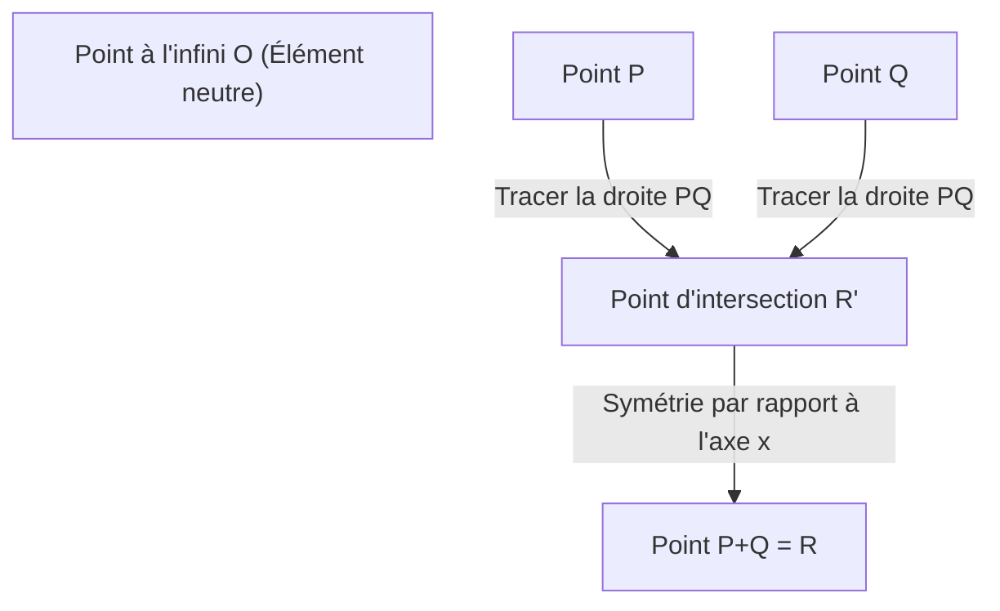
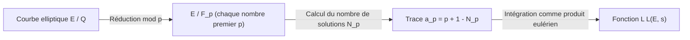

## 1. Introduction : Les problèmes du prix du millénaire et les problèmes non résolus de la théorie des nombres

L'un des mystères les plus importants, et aussi les plus beaux et les plus profonds des mathématiques modernes est la **conjecture de Birch et Swinnerton-Dyer** (Birch and Swinnerton-Dyer Conjecture, ci-après **conjecture BSD**). Elle a été choisie comme l'un des sept « problèmes du prix du millénaire » annoncés par l'Institut de mathématiques Clay en 2000, et un prix d'un million de dollars sera décerné à la personne qui la résoudra.

La conjecture BSD appartient au domaine de la « géométrie arithmétique », où la géométrie algébrique croise la théorie des nombres. En gros, cette conjecture fait la déclaration étonnante selon laquelle « on peut savoir s'il y a un nombre infini de points rationnels sur une courbe elliptique en observant le comportement de la fonction complexe (fonction L) déterminée par cette courbe elliptique en $s=1$ ». C'est une conjecture qui incarne le romantisme des mathématiques, dans laquelle la collecte d'informations locales (le nombre de solutions modulo un nombre premier) détermine complètement l'information globale (la structure des solutions rationnelles).

Dans cet article, afin de comprendre ce que signifie la conjecture BSD, nous partirons des bases des courbes elliptiques, et nous expliquerons en détail et rigoureusement le théorème de Mordell, la définition des fonctions L, et l'énoncé exact de la conjecture BSD (conjecture faible et conjecture forte). De plus, nous aborderons des sujets avancés tels que la relation avec le problème des nombres congruents et le contexte par la cohomologie galoisienne.

## 2. Qu'est-ce qu'une courbe elliptique : Le joyau de la géométrie algébrique

Le protagoniste de la conjecture BSD est la **courbe elliptique** (Elliptic Curve). Bien qu'elle porte le nom « elliptique », elle n'a pas de relation directe avec l'ellipse en tant que figure géométrique. Ce nom a été donné parce qu'elle a été découverte au cours de l'étude des fonctions inverses des « intégrales elliptiques » qui apparaissent lors du calcul de la longueur de l'arc d'une ellipse.

### 2.1. Forme normale de Weierstrass

Une courbe elliptique $E$ sur le corps des nombres rationnels $\mathbb{Q}$ peut généralement être exprimée comme une courbe algébrique projective non singulière définie par une équation cubique de la forme suivante (forme normale de Weierstrass) :

$$
E: y^2 = x^3 + ax + b \quad (a, b \in \mathbb{Q})
$$

Ici, « non singulière » (non-singular) signifie qu'il n'y a pas de points de rebroussement (cusps) ou de points d'intersection avec elle-même (nœuds) sur la courbe. Cette condition est exprimée à l'aide du discriminant $\Delta$ comme suit :

$$
\Delta = -16(4a^3 + 27b^2) \neq 0
$$

Géométriquement, si l'on considère cette courbe sur le corps des nombres complexes $\mathbb{C}$, elle a la forme d'un tore (en forme de beignet). Cela est démontré par la correspondance isomorphique avec le tore complexe $\mathbb{C}/\Lambda$ ($\Lambda$ étant un réseau) à l'aide de la fonction $\wp$ de Weierstrass.

### 2.2. Points rationnels et structure de groupe

L'une des propriétés les plus surprenantes des courbes elliptiques est que l'on peut définir une « addition » pour les points sur celles-ci. C'est ce qu'on appelle la méthode de la sécante et de la tangente (chord and tangent method).

Pour deux points $P, Q$ sur la courbe, l'addition $P + Q$ est définie comme suit :
1. Tracez la droite $L$ passant par $P$ et $Q$ (si $P=Q$, tracez la tangente à ce point).
2. D'après le théorème de Bézout, la courbe cubique $E$ et la droite $L$ ont toujours (en tenant compte de la multiplicité) trois points d'intersection. Soit $R'$ ce troisième point d'intersection.
3. Soit $R$ le point obtenu en effectuant une symétrie de $R'$ par rapport à l'axe des $x$, et définissons-le comme $P + Q$.

En prenant le point à l'infini $\mathcal{O}$ comme élément neutre (zéro), les points sur la courbe elliptique $E$ forment un groupe abélien. En particulier, l'ensemble $E(\mathbb{Q})$ de tous les points rationnels (les points dont les coordonnées $x, y$ sont toutes deux des nombres rationnels) de la courbe elliptique définie sur le corps des nombres rationnels $\mathbb{Q}$ forme un sous-groupe pour cette addition.

Le problème de trouver des points rationnels a longtemps été étudié comme un problème majeur des équations diophantiennes. L'objectif principal est de révéler l'ensemble de la structure de l'ensemble des points rationnels.

## 3. Le théorème de Mordell et le rang

En 1922, Louis Mordell a prouvé un théorème décisif sur la structure du groupe des points rationnels $E(\mathbb{Q})$. Il a ensuite été étendu à des corps de nombres algébriques et des variétés abéliennes plus généraux par André Weil, et est connu sous le nom de théorème de Mordell-Weil.

### 3.1. Théorème de Mordell (Mordell's Theorem)

**Théorème (Mordell, 1922)**
Le groupe des points rationnels $E(\mathbb{Q})$ d'une courbe elliptique $E$ est un groupe abélien de type fini.

Selon le théorème fondamental des groupes abéliens de type fini en algèbre, $E(\mathbb{Q})$ a l'isomorphisme suivant :

$$
E(\mathbb{Q}) \cong E(\mathbb{Q})_{\text{tors}} \oplus \mathbb{Z}^r
$$

Ici,
- $E(\mathbb{Q})_{\text{tors}}$ est appelé le **sous-groupe de torsion** (torsion subgroup), et est un groupe fini composé de tous les points d'ordre fini (points qui, additionnés plusieurs fois, donnent le point à l'infini $\mathcal{O}$). D'après le théorème de Barry Mazur (1977), il a été complètement classifié qu'il n'y a que 15 structures possibles pour le sous-groupe de torsion dans les courbes elliptiques sur le corps des nombres rationnels. Plus précisément, c'est l'un des $\mathbb{Z}/N\mathbb{Z}$ ($1 \le N \le 10, N=12$) ou $\mathbb{Z}/2\mathbb{Z} \oplus \mathbb{Z}/2N\mathbb{Z}$ ($1 \le N \le 4$).
- $r$ est un entier non négatif appelé **rang** (rank).
- $\mathbb{Z}^r$ est un groupe abélien libre engendré par des points d'ordre infini (points qui ne deviennent jamais $\mathcal{O}$ peu importe combien de fois on les additionne).

### 3.2. Signification et difficulté du rang $r$

Le rang $r$ est un invariant important qui exprime « combien il y a de points d'ordre infini substantiellement indépendants ».
- Si $r = 0$, $E(\mathbb{Q})$ est un groupe fini, et il n'y a qu'un nombre fini de points rationnels.
- Si $r \ge 1$, $E(\mathbb{Q})$ a un nombre infini de points rationnels.

Le sous-groupe de torsion peut être facilement calculé et déterminé algorithmiquement en utilisant des théorèmes comme celui de Nagell-Lutz. Cependant, **aucun algorithme général pour déterminer le rang $r$ n'est connu à ce jour.**

Bien qu'il soit possible de calculer le rang d'une équation spécifique en utilisant une méthode appelée méthode de descente (descent), les éléments non triviaux du groupe de Tate-Shafarevich constituent un obstacle, et il n'y a aucune garantie que l'algorithme s'arrêtera. Même s'il est possible de calculer le rang d'une courbe elliptique spécifique, il n'est même pas résolu s'il existe une procédure qui s'arrêtera à coup sûr et produira le rang pour toutes les courbes elliptiques (décidabilité).

La conjecture BSD est précisément une conjecture qui relie cette « information globale dont le calcul est extrêmement difficile, le rang $r$ » à « un objet analytique calculable à partir d'informations locales ».

## 4. Du local au global : La fonction L de Hasse-Weil

Lorsqu'il est difficile de trouver des solutions à une équation sur l'ensemble des nombres rationnels, en théorie des nombres on considère souvent le nombre de solutions sur un corps fini $\mathbb{F}_p$ « modulo le nombre premier $p$ » (modulo $p$). On appelle cela l'information locale.

### 4.1. Nombre de solutions sur un corps fini

On réduit la courbe elliptique $E: y^2 = x^3 + ax + b$ par un nombre premier $p$, et soit $N_p$ le nombre de solutions (y compris le point à l'infini) de la congruence :
$$ y^2 \equiv x^3 + ax + b \pmod p $$

Intuitivement, puisque $x \pmod p$ prend $p$ valeurs et que la probabilité qu'il soit égal à $y^2$ est d'environ $1/2$ (2 s'il s'agit d'un résidu quadratique, 0 sinon), on s'attend à ce que le nombre de solutions $N_p$ soit d'environ $p$ (soit $p+1$ y compris le point à l'infini). L'« écart » par rapport à cette valeur attendue est défini comme $a_p$ :

$$
a_p = p + 1 - N_p
$$

Selon le théorème de Hasse (Hasse's bound), on sait que cet écart est borné par $|a_p| \le 2\sqrt{p}$. C'est une sorte d'analogue de l'hypothèse de Riemann pour les courbes elliptiques sur les corps finis.

### 4.2. Définition de la fonction L

On rassemble ces informations locales $a_p$ pour tous les nombres premiers $p$ afin de construire une fonction analytique. Il s'agit de la **fonction L de Hasse-Weil** (Hasse-Weil L-function) $L(E, s)$.
Pour un nombre complexe $s$, elle est définie à l'aide d'un produit eulérien comme suit :

$$
L(E, s) = \prod_{p \mid \Delta} (1 - a_p p^{-s})^{-1} \prod_{p \nmid \Delta} (1 - a_p p^{-s} + p^{1-2s})^{-1}
$$
(Ici, le premier produit porte sur les nombres premiers ayant une « mauvaise réduction » (bad reduction), et le second sur les nombres premiers ayant une « bonne réduction » (good reduction). Dans le cas d'une mauvaise réduction, $a_p$ prend l'une des valeurs $1, -1, 0$ selon le type de réduction.)

On peut montrer que ce produit infini converge absolument dans la région $\mathrm{Re}(s) > \frac{3}{2}$ en utilisant la borne de Hasse.

### 4.3. Prolongement analytique et théorème de modularité

Ce qui est crucial pour énoncer la conjecture BSD est la question de savoir si $L(E, s)$ peut être prolongée analytiquement à l'ensemble du plan complexe. En particulier, comme nous le verrons plus loin, nous voulons connaître son comportement en $s=1$, mais le produit dans la formule de définition ne converge pas pour $s=1$.

Ce problème a été résolu par le **théorème de modularité** (anciennement conjecture de Taniyama-Shimura), qui a été entièrement prouvé en 2001. Grâce au travail monumental d'Andrew Wiles, Richard Taylor, Christophe Breuil, Brian Conrad et Fred Diamond, il a été montré que « toutes les courbes elliptiques sur le corps des nombres rationnels sont modulaires ».

Être modulaire signifie que $L(E, s)$ correspond parfaitement à la fonction L $L(f, s)$ d'une forme modulaire $f$ de poids 2. La fonction L d'une forme modulaire est prolongée analytiquement à l'ensemble du plan complexe par la théorie de Hecke, et satisfait l'équation fonctionnelle suivante :

$$
\Lambda(E, s) = (2\pi)^{-s} N^{s/2} \Gamma(s) L(E, s)
$$
$$
\Lambda(E, 2-s) = w \Lambda(E, s)
$$

Ici, $N$ est un entier appelé le conducteur (conductor), et $w \in \{1, -1\}$ est le signe (root number).
Ce prolongement analytique justifie mathématiquement la discussion sur la valeur de $L(E, s)$ et son développement de Taylor en $s=1$.

## 5. La conjecture de Birch et Swinnerton-Dyer

Au début des années 1960, Brian Birch et Peter Swinnerton-Dyer ont utilisé les premiers ordinateurs de l'Université de Cambridge (EDSAC 2) pour calculer $N_p$ pour un grand nombre de courbes elliptiques, et ont étudié expérimentalement le comportement du produit infini correspondant à $L(E, 1)$.

S'il y a beaucoup de points rationnels (le rang $r$ est grand), le nombre de solutions $N_p$ devrait avoir tendance à être grand, même modulo chaque nombre premier $p$. Alors $a_p = p + 1 - N_p$ deviendra grand dans la direction négative, et le terme $(1 - a_p p^{-1} + p^{-1})^{-1}$ du produit eulérien deviendra petit, de sorte que la valeur de la fonction L en $s=1$ devrait s'approcher de $0$.

De cette intuition basée sur des expériences informatiques, est née une conjecture qui brille de mille feux dans l'histoire des mathématiques.

### 5.1. Conjecture BSD (conjecture faible)

**Conjecture de Birch et Swinnerton-Dyer (faible)**
Le rang $r$ d'une courbe elliptique $E$ sur le corps des nombres rationnels $\mathbb{Q}$ est égal à l'ordre du zéro de sa fonction L $L(E, s)$ en $s=1$.

C'est-à-dire que, si l'on considère le développement de Taylor,
$$
L(E, s) = c(s-1)^r + \text{termes d'ordre supérieur} \quad (c \neq 0)
$$
Telle est l'affirmation. Cet ordre du zéro est appelé **rang analytique**.

Cette conjecture est bouleversante. « L'ordre du zéro » du côté gauche (ou droit) est une valeur déterminée purement à partir d'informations analytiques et locales. En revanche, le « rang $r$ » du côté droit (gauche) est une valeur algébrique et globale qui représente la structure des points rationnels. Il affirme que deux quantités appartenant à des mondes complètement différents coïncident parfaitement.

En considérant particulièrement les cas $r=0$ et $r \ge 1$,
- $L(E, 1) \neq 0 \iff$ Il y a un nombre fini de points rationnels dans $E(\mathbb{Q})$
- $L(E, 1) = 0 \iff$ Il y a un nombre infini de points rationnels dans $E(\mathbb{Q})$
Cela devient ainsi.

### 5.2. Conjecture BSD (conjecture forte)

De plus, ils ont conjecturé que le premier coefficient non nul $c$ dans le développement de Taylor précédent (c'est-à-dire $L^{(r)}(E, 1) / r!$) pouvait être décrit par une formule extrêmement belle en utilisant divers invariants arithmétiques de la courbe elliptique. C'est la **conjecture BSD forte**.

$$
\lim_{s \to 1} \frac{L(E, s)}{(s-1)^r} = \frac{\Omega_E \cdot \mathrm{Reg}(E) \cdot |\text{Sha}(E)| \cdot \prod_{p} c_p}{|E(\mathbb{Q})_{\text{tors}}|^2}
$$

Les invariants apparaissant dans cette formule sont les suivants :
1. **$\Omega_E$ (Période réelle)** : Un nombre transcendant déterminé à partir de l'intégrale $\int_{E(\mathbb{R})} \frac{dx}{|2y + a_1x + a_3|}$ sur le corps des nombres réels de la courbe elliptique.
2. **$\mathrm{Reg}(E)$ (Régulateur)** : Le déterminant de la matrice $r \times r$ formée par les accouplements de hauteur de Néron-Tate (Néron-Tate height pairing) $\langle P_i, P_j \rangle$ pour les générateurs $P_1, \dots, P_r$ des points rationnels d'ordre infini de rang $r$. C'est un indicateur mesurant la « taille » des points.
3. **$|E(\mathbb{Q})_{\text{tors}}|$** : L'ordre du sous-groupe de torsion.
4. **$c_p$ (Nombres de Tamagawa)** : Facteurs de correction locaux pour les nombres premiers $p$ ayant une mauvaise réduction. Calculés à partir de l'action du groupe de Galois du corps local.
5. **$\text{Sha}(E)$ (Groupe de Tate-Shafarevich, $\text{\textcyrillic{Sh}}$)** : Un objet extrêmement important dont nous parlerons plus loin.

Cette formule peut être considérée comme la forme ultime généralisant aux courbes elliptiques la formule du nombre de classes de Dirichlet (Dirichlet's class number formula) du 19ème siècle :
$$
\lim_{s \to 1} (s-1)\zeta_K(s) = \frac{2^{r_1} (2\pi)^{r_2} h_K R_K}{w_K \sqrt{|D_K|}}
$$
Le nombre de classes $h_K$ dans la fonction zêta de Dedekind correspond à $\text{Sha}(E)$, et le régulateur du groupe des unités $R_K$ correspond au régulateur de la courbe elliptique $\mathrm{Reg}(E)$.

### 5.3. Le groupe mystérieux « Sha (Ш) » et la cohomologie galoisienne

L'objet le plus mystérieux et le plus difficile de la formule est le groupe de Tate-Shafarevich $\text{Sha}(E)$ (représenté par la lettre cyrillique $\text{\textcyrillic{Sh}}$).

Le principe local-global (principe de Hasse) affirme que « une condition nécessaire et suffisante pour que toute équation ait une solution dans le corps des nombres rationnels (global) est qu'elle ait une solution dans le corps des nombres $p$-adiques (local) pour tout nombre premier $p$, et qu'elle ait également une solution dans le corps des nombres réels ». Ce principe s'applique aux formes quadratiques (théorème de Hasse-Minkowski).
Cependant, pour les courbes elliptiques (courbes cubiques), ce principe ne s'applique pas. Le phénomène où « il y a une solution localement partout, mais aucune solution globalement » peut se produire.

$\text{Sha}(E)$ est un groupe qui mesure cet « échec du principe local-global » en utilisant la cohomologie galoisienne. Il est défini rigoureusement comme suit :

$$
\text{Sha}(E) = \ker \left( H^1(G_{\mathbb{Q}}, E) \to \prod_{v} H^1(G_{\mathbb{Q}_v}, E) \right)
$$

Ici, $G_{\mathbb{Q}}$ est le groupe de Galois absolu, et le produit porte sur toutes les places (nombres premiers finis et la place infinie).
La conjecture BSD forte contient la prémisse implicite que « pour toute courbe elliptique, $\text{Sha}(E)$ est un groupe fini ». Cependant, à ce jour, il n'a même pas été prouvé que $\text{Sha}(E)$ est fini pour les courbes elliptiques générales. À l'exception de résultats concernant les courbes à multiplication complexe obtenus par Karl Rubin et d'autres, la compréhension fondamentale de $\text{Sha}(E)$ reste l'un des plus grands défis de la théorie des nombres moderne.

## 6. Relation avec le problème des nombres congruents

L'une des applications très célèbres de la conjecture BSD est le **problème des nombres congruents (Congruent number problem)**. Il s'agit du problème suivant : « Un entier naturel $n$ peut-il être la surface d'un triangle rectangle dont les longueurs de tous les côtés sont des nombres rationnels ? ». Un tel $n$ qui peut être la surface est appelé un nombre congruent. Par exemple, $n=5, 6, 7$ sont des nombres congruents, mais $n=1, 2, 3$ ne le sont pas.

En réalité, il est connu que le fait que $n$ soit un nombre congruent équivaut au fait que la courbe elliptique spécifique
$$ E_n: y^2 = x^3 - n^2 x $$
possède un nombre infini de points rationnels (c'est-à-dire que le rang est $r \ge 1$).

Si l'on suppose que la conjecture BSD faible est correcte, d'après le théorème de Tunnell (1983), la condition pour que $n$ soit un nombre congruent se réduit à un critère de décision élémentaire concernant le nombre de solutions de formes quadratiques simples. De cette manière, la conjecture BSD a le pouvoir de fournir une réponse complète même à un problème classique de théorie des nombres vieux de plusieurs millénaires.

## 7. Avancées actuelles et murs non résolus

Comme la conjecture BSD a été sélectionnée comme l'un des problèmes du prix du millénaire, elle n'a pas encore fait l'objet d'une preuve complète. Cependant, des résultats partiels importants ont été obtenus.

### 7.1. Cas de rang $r \le 1$

Étonnamment, dans les cas où le rang analytique (l'ordre du zéro de $L(E,s)$ en $s=1$) est 0 ou 1, la majeure partie de la conjecture BSD s'est avérée correcte.

- **Théorème de Gross-Zagier (Gross-Zagier, 1986)** :
  Ils ont montré que si le rang analytique est 1, le dérivé premier de $L(E,s)$ en $s=1$ est proportionnel à la hauteur de Néron-Tate d'un « point de Heegner (Heegner point) » particulier construit à partir de courbes modulaires. Comme la hauteur du point de Heegner est non nulle, ils ont prouvé que le rang algébrique est au moins 1.
- **Théorème de Kolyvagin (Kolyvagin, 1989)** :
  En construisant une puissante méthode de cohomologie galoisienne appelée système d'Euler (Euler system), il a prouvé que si le rang analytique est 0 ou 1, il coïncide avec le rang algébrique, et que ce n'est que dans ce cas que le groupe de Tate-Shafarevich $\text{Sha}(E)$ est fini.

Grâce à ces réalisations, il est établi que « la conjecture BSD faible est vraie pour les courbes elliptiques dont le rang analytique est 0 ou 1 ».

### 7.2. Le haut mur du rang $r \ge 2$

D'un autre côté, concernant les courbes elliptiques dont le rang analytique est supérieur ou égal à 2, on ne sait étonnamment rien.
Même pour les courbes spécifiques dont on sait que le rang algébrique est 2, il n'y a pas d'exemple où l'on a pu prouver rigoureusement (et non par un calcul approximatif par ordinateur) que le rang analytique est 2.
De plus, on n'a pas trouvé de mécanisme systématique tel qu'un système d'Euler pour construire des points rationnels dans le cas du rang 2 ou plus, ce qui constitue un mur majeur dans les mathématiques modernes.

Depuis les années 2010, grâce aux recherches de Manjul Bhargava et d'Arul Shankar, le résultat statistique stupéfiant a été obtenu : **« parmi toutes les courbes elliptiques, au moins 66% satisfont la conjecture BSD »**. En effet, ils ont montré que les courbes de rang 0 et de rang 1 constituent la grande majorité (que le rang moyen est borné). Cela corrobore le fait que la conjecture BSD est extrêmement plausible, du moins d'un point de vue probabiliste et statistique.

## 8. Conclusion

La conjecture de Birch et Swinnerton-Dyer est une conjecture grandiose qui relie magnifiquement un objet de géométrie algébrique appelé courbe elliptique et un objet d'analyse mathématique appelé fonction L à travers la théorie des nombres.

- **Fusion de l'algèbre et de la géométrie** : La structure de groupe des solutions rationnelles d'une équation (rang et torsion).
- **Le monde de l'analyse** : Les zéros de la fonction L construits à partir du nombre de solutions modulo un nombre premier.
- **Le mystère profond** : Ils coïncident parfaitement, et de plus, ses coefficients sont décrits par des invariants arithmétiques (en particulier le très mystérieux $\text{Sha}(E)$).

Lorsque la conjecture BSD sera complètement élucidée, elle n'apportera pas seulement une percée ultime dans la compréhension des solutions rationnelles des équations diophantiennes, mais servira également de fondement solide soutenant les fondements de la théorie des fonctions L motiviques plus larges, comme son analogue sur les corps de fonctions (conjecture d'Artin-Tate) ou le « programme de Langlands » unifiant divers domaines des mathématiques.

On attend avec impatience le jour où l'intellect humain parcourra entièrement cette forêt profonde et acquerra un nouveau « regard » sur le monde de rang global 2 et plus.

---
*Cet article a été créé dans le but d'expliquer des sujets mathématiques avancés. Bien qu'il contienne de nombreuses formules mathématiques, nous espérons que vous pourrez ressentir un peu de la beauté de la géométrie arithmétique. Nous attendons vos questions et discussions dans la section des commentaires.*
