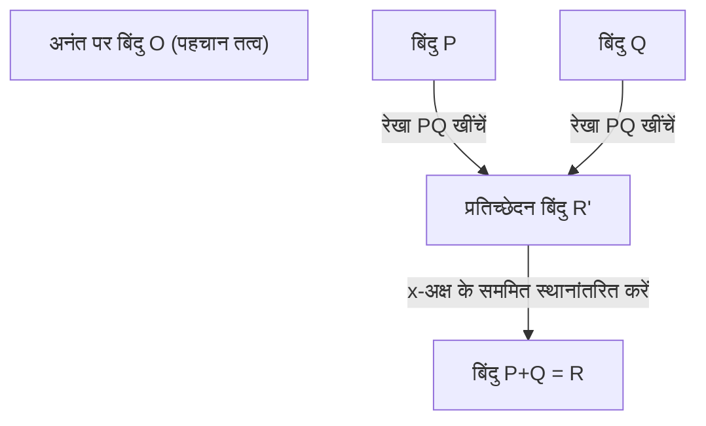
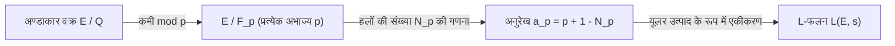

## 1. परिचय: मिलेनियम पुरस्कार समस्या और संख्या सिद्धांत की अनसुलझी समस्या

आधुनिक गणित में सबसे महत्वपूर्ण, और सबसे सुंदर और गहरे रहस्यों में से एक है **बर्च और स्विन्नर्टन-डायर अनुमान** (Birch and Swinnerton-Dyer Conjecture, इसके बाद **BSD अनुमान**)। इसे 2000 में क्ले गणित संस्थान द्वारा घोषित 7 "मिलेनियम पुरस्कार समस्याओं" में से एक के रूप में चुना गया है, और इसे हल करने वाले को 1 मिलियन डॉलर का पुरस्कार दिया जाएगा।

BSD अनुमान "अंकगणितीय ज्यामिति (Arithmetic Geometry)" नामक क्षेत्र से संबंधित है, जहां बीजगणितीय ज्यामिति और संख्या सिद्धांत प्रतिच्छेद करते हैं। मोटे तौर पर कहें तो, यह अनुमान एक आश्चर्यजनक दावा करता है कि "किसी अण्डाकार वक्र (Elliptic Curve) पर परिमेय बिंदुओं की संख्या अनंत है या नहीं, यह उस अण्डाकार वक्र द्वारा निर्धारित सम्मिश्र फलन (L-फलन) के $s=1$ पर व्यवहार को देखकर पता लगाया जा सकता है।" यह एक ऐसा अनुमान है जो गणित के रोमांस को मूर्त रूप देता है, जहां स्थानीय जानकारी (अभाज्य संख्याओं के मापांक में समाधानों की संख्या) एकत्र करके, वैश्विक जानकारी (परिमेय समाधानों की संरचना) पूरी तरह से निर्धारित की जाती है।

इस लेख में, BSD अनुमान का क्या अर्थ है, यह समझने के लिए हम अण्डाकार वक्रों के मूल सिद्धांतों से शुरू करेंगे, और मॉर्डेल के प्रमेय, L-फलन की परिभाषा और BSD अनुमान के सटीक दावों (कमजोर अनुमान और मजबूत अनुमान) के बारे में विस्तार से और कठोरता से स्पष्टीकरण देंगे। इसके अलावा, हम सर्वांगसम संख्या समस्या (Congruent number problem) के साथ संबंध और गैलवा कोहॉमोलॉजी ([Galois](https://kenji.blog/hi/p/galois/) cohomology) द्वारा पृष्ठभूमि जैसे उन्नत विषयों में भी कदम रखेंगे।

## 2. अण्डाकार वक्र क्या है: बीजगणितीय ज्यामिति का रत्न

BSD अनुमान का मुख्य पात्र **अण्डाकार वक्र** (Elliptic Curve) है। हालांकि इसके नाम में "अण्डाकार (Elliptic)" है, लेकिन ज्यामितीय आकृति के रूप में इसका अण्डाकार से कोई सीधा संबंध नहीं है। यह नाम इसलिए दिया गया है क्योंकि इसकी खोज "अण्डाकार समाकल (Elliptic integral)" के व्युत्क्रम फलन का अध्ययन करने की प्रक्रिया में हुई थी, जो अण्डाकार वक्रों की चाप की लंबाई की गणना करते समय प्रकट होता है।

### 2.1. वियरस्ट्रैस का मानक रूप (Weierstrass Normal Form)

परिमेय संख्या क्षेत्र $\mathbb{Q}$ पर अण्डाकार वक्र $E$ को आम तौर पर निम्नलिखित रूप के त्रिघातीय समीकरण (वियरस्ट्रैस का मानक रूप) द्वारा परिभाषित गैर-एकवचन (non-singular) प्रक्षेपीय बीजगणितीय वक्र के रूप में दर्शाया जा सकता है।

$$
E: y^2 = x^3 + ax + b \quad (a, b \in \mathbb{Q})
$$

यहाँ "गैर-एकवचन (non-singular)" होने का अर्थ है कि वक्र पर कोई कस्प (cusp) या आत्म-प्रतिच्छेदन बिंदु (node) नहीं है। यह स्थिति विविक्तकर (discriminant) $\Delta$ का उपयोग करके इस प्रकार व्यक्त की जाती है।

$$
\Delta = -16(4a^3 + 27b^2) \neq 0
$$

ज्यामितीय रूप से, यदि इस वक्र पर सम्मिश्र संख्या क्षेत्र $\mathbb{C}$ पर विचार किया जाए, तो इसका आकार टोरस (डोनट के आकार का) होता है। यह वियरस्ट्रैस के $\wp$ फलन का उपयोग करके सम्मिश्र टोरस $\mathbb{C}/\[Lambda](https://kenji.blog/hi/p/serverless-architecture-aws-lambda-cold-start/)$ (जहाँ $\Lambda$ एक जालक है) के साथ समरूपता पत्राचार से दिखाया जाता है।

### 2.2. परिमेय बिंदु और समूह संरचना

अण्डाकार वक्रों की सबसे आश्चर्यजनक संपत्तियों में से एक यह है कि उनके बिंदुओं के लिए "जोड़ (addition)" को परिभाषित किया जा सकता है। इसे जीवा और स्पर्शरेखा विधि (chord and tangent method) कहा जाता है।

वक्र पर 2 बिंदुओं $P, Q$ के लिए जोड़ $P + Q$ को निम्नानुसार परिभाषित किया गया है:
1. $P$ और $Q$ से गुजरने वाली एक रेखा $L$ खींचें (यदि $P=Q$ है, तो उस बिंदु पर एक स्पर्शरेखा खींचें)।
2. बेज़ौट के प्रमेय (Bézout's theorem) के अनुसार, त्रिघातीय वक्र $E$ और रेखा $L$ के हमेशा (बहुलता सहित) 3 प्रतिच्छेदन बिंदु होते हैं। उस तीसरे प्रतिच्छेदन बिंदु को $R'$ मान लें।
3. $R'$ को $x$-अक्ष के बारे में सममित रूप से ले जाकर प्राप्त बिंदु को $R$ मानें, और इसे $P + Q$ के रूप में परिभाषित करें।

अनंत पर बिंदु $\mathcal{O}$ को शून्य तत्व (पहचान तत्व) मानकर, अण्डाकार वक्र $E$ पर बिंदु एक एबेलियन समूह ([Abel](https://kenji.blog/hi/p/abel/)ian group) बनाते हैं। विशेष रूप से, परिमेय संख्या क्षेत्र $\mathbb{Q}$ पर परिभाषित अण्डाकार वक्र के परिमेय बिंदुओं (ऐसे बिंदु जिनके निर्देशांक $x, y$ दोनों परिमेय संख्याएँ हैं) के पूरे सेट $E(\mathbb{Q})$ इस जोड़ के संबंध में एक उपसमूह बन जाते हैं।

परिमेय बिंदुओं को खोजने की समस्या का अध्ययन प्राचीन काल से डायोफैंटाइन समीकरणों की एक प्रमुख समस्या के रूप में किया जाता रहा है। परिमेय बिंदुओं के सेट की संरचना कैसी है, इसकी पूरी तस्वीर को स्पष्ट करना सबसे बड़ा लक्ष्य है।

## 3. मॉर्डेल का प्रमेय और रैंक (Rank)

1922 में, लुइस मॉर्डेल ([Louis Mordell](https://kenji.blog/hi/p/mordell/)) ने परिमेय बिंदु समूह $E(\mathbb{Q})$ की संरचना पर एक निर्णायक प्रमेय सिद्ध किया। बाद में [आंद्रे वेइल](/hi/p/weil/) ([André Weil](https://kenji.blog/hi/p/weil/)) ने इसे अधिक सामान्य बीजगणितीय क्षेत्रों और एबेलियन किस्मों तक विस्तारित किया, और इसे मॉर्डेल-वेइल प्रमेय के रूप में जाना जाता है।

### 3.1. मॉर्डेल का प्रमेय (Mordell's Theorem)

**प्रमेय (मॉर्डेल, 1922)**
अण्डाकार वक्र $E$ का परिमेय बिंदु समूह $E(\mathbb{Q})$ एक परिमित रूप से उत्पन्न (finitely generated) एबेलियन समूह है।

बीजगणित के परिमित रूप से उत्पन्न एबेलियन समूहों के मौलिक प्रमेय के अनुसार, $E(\mathbb{Q})$ में निम्नलिखित समरूपता (isomorphism) है:

$$
E(\mathbb{Q}) \cong E(\mathbb{Q})_{\text{tors}} \oplus \mathbb{Z}^r
$$

जहाँ,
- $E(\mathbb{Q})_{\text{tors}}$ को **मरोड़ उपसमूह (Torsion subgroup)** कहा जाता है, और यह परिमित क्रम के बिंदुओं (वे बिंदु जिन्हें कई बार जोड़ने पर अनंत पर बिंदु $\mathcal{O}$ बन जाता है) का एक परिमित समूह है। बैरी मजूर (Barry Mazur) के प्रमेय (1977) के अनुसार, यह पूरी तरह से वर्गीकृत किया गया है कि परिमेय संख्या क्षेत्र पर अण्डाकार वक्रों में मरोड़ उपसमूहों द्वारा ली जा सकने वाली केवल 15 प्रकार की संरचनाएं हैं। विशेष रूप से, यह या तो $\mathbb{Z}/N\mathbb{Z}$ ($1 \le N \le 10, N=12$) या $\mathbb{Z}/2\mathbb{Z} \oplus \mathbb{Z}/2N\mathbb{Z}$ ($1 \le N \le 4$) है।
- $r$ एक गैर-नकारात्मक पूर्णांक है, और इसे **रैंक (Rank)** कहा जाता है।
- $\mathbb{Z}^r$ एक मुक्त एबेलियन समूह है जो अनंत क्रम के बिंदुओं (वे बिंदु जो कितनी भी बार जोड़ने पर $\mathcal{O}$ नहीं बनते) से उत्पन्न होता है।

### 3.2. रैंक $r$ का अर्थ और कठिनाई

रैंक $r$ एक महत्वपूर्ण निश्चर (invariant) है जो दर्शाता है कि "व्यावहारिक रूप से कितने स्वतंत्र अनंत क्रम के बिंदु हैं।"
- यदि $r = 0$ है, तो $E(\mathbb{Q})$ एक परिमित समूह बन जाता है, और केवल परिमित संख्या में परिमेय बिंदु मौजूद होते हैं।
- यदि $r \ge 1$ है, तो $E(\mathbb{Q})$ में अनंत परिमेय बिंदु होते हैं।

मरोड़ उपसमूहों की आसानी से नेगेल-लुट्ज़ प्रमेय (Nagell-Lutz theorem) आदि का उपयोग करके एल्गोरिथम द्वारा गणना और निर्धारण किया जा सकता है। हालाँकि, **रैंक $r$ निर्धारित करने के लिए कोई सामान्य एल्गोरिथम आज तक ज्ञात नहीं है।**

हालाँकि अवरोहण विधि (descent) नामक तकनीक के साथ विशिष्ट समीकरणों के रैंक की गणना करना संभव है, टेट-शफ़ारेविच समूह के गैर-तुच्छ तत्व एक बाधा बन जाते हैं, और इस बात की कोई गारंटी नहीं है कि एल्गोरिथम हमेशा रुक जाएगा। यहाँ तक कि अगर किसी विशिष्ट अण्डाकार वक्र के लिए रैंक की गणना करना संभव है, तो भी यह अनसुलझा है कि क्या सभी अण्डाकार वक्रों के लिए रैंक को निश्चित रूप से रोकने और आउटपुट करने की कोई प्रक्रिया मौजूद है या नहीं (decidability)।

BSD अनुमान ठीक इसी "गणनीय रूप से अत्यंत कठिन वैश्विक जानकारी, रैंक $r$" को "स्थानीय जानकारी से गणना योग्य विश्लेषणात्मक वस्तु" से जोड़ने वाला अनुमान है।

## 4. स्थानीय से वैश्विक तक: हासे-वेइल L-फलन

जब सभी परिमेय संख्याओं पर किसी समीकरण का हल खोजना मुश्किल होता है, तो संख्या सिद्धांत में हम अक्सर परिमित क्षेत्र $\mathbb{F}_p$ पर हलों की संख्या पर विचार करते हैं जो "अभाज्य संख्या $p$ के मापांक (modulo $p$)" में होती है। इसे स्थानीय जानकारी कहा जाता है।

### 4.1. परिमित क्षेत्रों पर हलों की संख्या

अण्डाकार वक्र $E: y^2 = x^3 + ax + b$ को अभाज्य संख्या $p$ से कम करें, और सर्वांगसमता (congruence)
$$ y^2 \equiv x^3 + ax + b \pmod p $$
के हलों की संख्या (अनंत पर बिंदु सहित) को $N_p$ मान लें।

सहज रूप से, $x \pmod p$ $p$ मान लेता है, और $y^2$ के बराबर होने की प्रायिकता लगभग $1/2$ (यदि द्विघात अवशेष है तो 2, यदि गैर-अवशेष है तो 0) है, इसलिए हलों की संख्या $N_p$ लगभग $p$ होने की उम्मीद है (अनंत पर बिंदु सहित $p+1$)। इस अपेक्षित मान से "विचलन" को $a_p$ के रूप में परिभाषित किया गया है।

$$
a_p = p + 1 - N_p
$$

हासे की सीमा (Hasse's bound) के अनुसार, यह ज्ञात है कि यह विचलन $|a_p| \le 2\sqrt{p}$ द्वारा सीमित है। यह परिमित क्षेत्रों पर अण्डाकार वक्रों के लिए रीमैन परिकल्पना के एक एनालॉग का एक प्रकार है।

### 4.2. L-फलन की परिभाषा

इन स्थानीय जानकारियों $a_p$ को सभी अभाज्य संख्याओं $p$ के लिए एकत्र करके, एक विश्लेषणात्मक फलन का निर्माण किया जाता है। यह **हासे-वेइल L-फलन** (Hasse-Weil L-function) $L(E, s)$ है।
सम्मिश्र संख्या $s$ के लिए, इसे यूलर उत्पाद का उपयोग करके निम्नानुसार परिभाषित किया गया है:

$$
L(E, s) = \prod_{p \mid \Delta} (1 - a_p p^{-s})^{-1} \prod_{p \nmid \Delta} (1 - a_p p^{-s} + p^{1-2s})^{-1}
$$
(यहाँ पूर्ववर्ती उत्पाद उन अभाज्य संख्याओं पर है जिनमें "खराब कमी (bad reduction)" होती है, और बाद वाला उन अभाज्य संख्याओं पर है जिनमें "अच्छी कमी (good reduction)" होती है। खराब कमी के मामले में, $a_p$ कमी के प्रकार के आधार पर $1, -1, 0$ में से कोई भी लेता है।)

यह अनंत उत्पाद हासे की सीमा का उपयोग करके $\mathrm{Re}(s) > \frac{3}{2}$ के क्षेत्र में पूर्ण रूप से अभिसरण (absolutely convergent) दिखाया गया है।

### 4.3. विश्लेषणात्मक निरंतरता और मॉड्यूलरिटी प्रमेय

BSD अनुमान को बताने में जो बात महत्वपूर्ण है वह यह है कि क्या $L(E, s)$ को संपूर्ण सम्मिश्र तल पर विश्लेषणात्मक रूप से जारी (analytic continuation) रखा जा सकता है। विशेष रूप से, जैसा कि बाद में वर्णित है, हम $s=1$ पर व्यवहार जानना चाहते हैं, लेकिन परिभाषा सूत्र का उत्पाद $s=1$ पर अभिसरण नहीं करता है।

इस समस्या को 2001 में पूरी तरह से सिद्ध किए गए **मॉड्यूलरिटी प्रमेय (Modularity Theorem)** (पूर्व में तानियामा-शिमुरा अनुमान) द्वारा हल किया गया था। [एंड्रयू विल्स](https://kenji.blog/hi/p/wiles/), रिचर्ड टेलर, क्रिस्टोफ ब्रूइल, ब्रायन कॉनराड और फ्रेड डायमंड के शानदार काम ने दिखाया कि "परिमेय संख्या क्षेत्र पर सभी अण्डाकार वक्र मॉड्यूलर हैं।"

मॉड्यूलर होने का अर्थ है कि $L(E, s)$ एक भार 2 के मॉड्यूलर रूप (modular form) $f$ के L-फलन $L(f, s)$ से पूरी तरह मेल खाता है। मॉड्यूलर रूपों के L-फलन हेके (Hecke) के सिद्धांत द्वारा पूरे सम्मिश्र तल पर विश्लेषणात्मक रूप से जारी रहते हैं, और निम्नलिखित कार्यात्मक समीकरण को संतुष्ट करते हैं:

$$
\[Lambda](https://kenji.blog/hi/p/serverless-architecture-aws-lambda-cold-start/)(E, s) = (2\pi)^{-s} N^{s/2} \Gamma(s) L(E, s)
$$
$$
\Lambda(E, 2-s) = w \Lambda(E, s)
$$

जहाँ $N$ एक पूर्णांक है जिसे चालक (conductor) कहा जाता है, और $w \in \{1, -1\}$ चिह्न (रूट नंबर) है।
इस विश्लेषणात्मक निरंतरता द्वारा, $s=1$ पर $L(E, s)$ के मूल्य और टेलर विस्तार पर चर्चा करना गणितीय रूप से उचित ठहराया जाता है।

## 5. बर्च और स्विन्नर्टन-डायर अनुमान

1960 के दशक की शुरुआत में, ब्रायन बर्च और पीटर स्विन्नर्टन-डायर ने कैम्ब्रिज विश्वविद्यालय के शुरुआती कंप्यूटरों (EDSAC 2) में से एक का उपयोग करके बड़ी संख्या में अण्डाकार वक्रों के लिए $N_p$ की गणना की और $L(E, 1)$ के अनुरूप अनंत उत्पाद के व्यवहार की प्रयोगात्मक रूप से जांच की।

यदि कई परिमेय बिंदु हैं (रैंक $r$ बड़ा है), तो हलों की संख्या $N_p$ भी प्रत्येक अभाज्य $p$ के मापांक में बड़ी होने की प्रवृत्ति होनी चाहिए। फिर $a_p = p + 1 - N_p$ नकारात्मक दिशा में बड़ा हो जाता है, और यूलर उत्पाद का पद $(1 - a_p p^{-1} + p^{-1})^{-1}$ छोटा हो जाता है, इसलिए $s=1$ पर L-फलन का मान $0$ के करीब पहुंचना चाहिए।

कंप्यूटर प्रयोगों पर आधारित इस अंतर्दृष्टि से, गणित के इतिहास में एक शानदार अनुमान का जन्म हुआ।

### 5.1. BSD अनुमान (कमजोर अनुमान)

**बर्च और स्विन्नर्टन-डायर अनुमान (कमजोर)**
परिमेय संख्या क्षेत्र $\mathbb{Q}$ पर अण्डाकार वक्र $E$ का रैंक (Rank) $r$, उसके L-फलन $L(E, s)$ के $s=1$ पर शून्य (zero) के क्रम के बराबर है।

अर्थात, जब हम टेलर विस्तार पर विचार करते हैं,
$$
L(E, s) = c(s-1)^r + \text{higher order terms} \quad (c \neq 0)
$$
होता है, यह दावा है। इस शून्य के क्रम को **विश्लेषणात्मक रैंक (analytic rank)** कहा जाता है।

यह अनुमान दुनिया को चौंका देने वाला है। बाईं ओर (या दाईं ओर) "शून्य का क्रम" विशुद्ध रूप से विश्लेषणात्मक और स्थानीय जानकारी द्वारा निर्धारित मान है। दूसरी ओर, दाईं ओर (बाईं ओर) "रैंक $r$" एक मान है जो परिमेय बिंदुओं की बीजगणितीय और वैश्विक संरचना का प्रतिनिधित्व करता है। पूरी तरह से अलग दुनिया से संबंधित दो मात्राएं पूरी तरह से मेल खाती हैं।

विशेष रूप से, $r=0$ और $r \ge 1$ के मामलों पर विचार करते हुए,
- $L(E, 1) \neq 0 \iff E(\mathbb{Q})$ के परिमेय बिंदु परिमित हैं
- $L(E, 1) = 0 \iff E(\mathbb{Q})$ के परिमेय बिंदु अनंत हैं
यह हो जाता है।

### 5.2. BSD अनुमान (मजबूत अनुमान)

इसके अलावा, उन्होंने अनुमान लगाया कि पूर्ववर्ती टेलर विस्तार में पहला गैर-शून्य गुणांक $c$ (यानी $L^{(r)}(E, 1) / r!$) अण्डाकार वक्रों के विभिन्न अंकगणितीय निश्चरों का उपयोग करके एक अत्यंत सुंदर सूत्र द्वारा वर्णित किया जा सकता है। यह **मजबूत BSD अनुमान** है।

$$
\lim_{s \to 1} \frac{L(E, s)}{(s-1)^r} = \frac{\Omega_E \cdot \mathrm{Reg}(E) \cdot |\text{Sha}(E)| \cdot \prod_{p} c_p}{|E(\mathbb{Q})_{\text{tors}}|^2}
$$

इस सूत्र में दिखाई देने वाले निश्चर इस प्रकार हैं:
1. **$\Omega_E$ (वास्तविक अवधि)** : वास्तविक संख्या क्षेत्र पर अण्डाकार वक्र के समाकल $\int_{E(\mathbb{R})} \frac{dx}{|2y + a_1x + a_3|}$ से निर्धारित एक पारलौकिक (transcendental) संख्या।
2. **$\mathrm{Reg}(E)$ (रेगुलेटर)** : रैंक $r$ के अनंत क्रम के परिमेय बिंदुओं के जनरेटर $P_1, \dots, P_r$ के लिए नेरोन-टेट ऊंचाई युग्मन (Néron-Tate height pairing) $\langle P_i, P_j \rangle$ की $r \times r$ मैट्रिक्स का निर्धारक ([determinant](/hi/p/geometric-meaning-of-determinant/))। यह बिंदुओं के "आकार" को मापने का एक संकेतक है।
3. **$|E(\mathbb{Q})_{\text{tors}}|$** : मरोड़ उपसमूह का क्रम।
4. **$c_p$ (तमागावा संख्या)** : खराब कमी वाले अभाज्य $p$ के लिए एक स्थानीय सुधार गुणांक। इसकी गणना स्थानीय क्षेत्र के गैलवा समूह की कार्रवाई से की जाती है।
5. **$\text{Sha}(E)$ (टेट-शफ़ारेविच समूह, $\text{\textcyrillic{Sh}}$)** : यह एक अत्यंत महत्वपूर्ण वस्तु है, इसलिए इसका वर्णन बाद में किया जाएगा।

इस सूत्र को 19वीं सदी के डिरिचलेट के वर्ग संख्या सूत्र (Dirichlet's class number formula)
$$
\lim_{s \to 1} (s-1)\zeta_K(s) = \frac{2^{r_1} (2\pi)^{r_2} h_K R_K}{w_K \sqrt{|D_K|}}
$$
का अण्डाकार वक्रों के लिए सामान्यीकृत अंतिम रूप माना जा सकता है। डेडेकाइंड ज़ेटा फलन में वर्ग संख्या $h_K$, $\text{Sha}(E)$ से मेल खाती है, और इकाई समूह का रेगुलेटर $R_K$ अण्डाकार वक्र के रेगुलेटर $\mathrm{Reg}(E)$ से मेल खाता है।

### 5.3. रहस्यमय समूह "Sha (Ш)" और गैलवा कोहॉमोलॉजी

सूत्र में सबसे रहस्यमय और गूढ़ वस्तु टेट-शफ़ारेविच समूह $\text{Sha}(E)$ (सिरिलिक अक्षर $\text{\textcyrillic{Sh}}$ द्वारा दर्शाया गया) है।

स्थानीय-वैश्विक सिद्धांत (हासे का सिद्धांत) एक सिद्धांत है जो कहता है कि "परिमेय संख्या क्षेत्र (वैश्विक) में किसी समीकरण के हल होने की आवश्यक और पर्याप्त शर्त यह है कि सभी अभाज्य संख्याओं $p$ के लिए $p$-एडिक संख्या क्षेत्र (स्थानीय) में और वास्तविक संख्या क्षेत्र में भी इसके हल हों।" द्विघात रूपों के लिए, यह सिद्धांत लागू होता है (हासे-मिन्कोवस्की का प्रमेय)।
हालाँकि, यह सिद्धांत अण्डाकार वक्रों (त्रिघातीय वक्रों) पर लागू नहीं होता है। ऐसी घटना घट सकती है जहाँ "स्थानीय रूप से सभी के हल होते हैं, लेकिन वैश्विक स्तर पर कोई हल नहीं होता है।"

$\text{Sha}(E)$ गैलवा कोहॉमोलॉजी का उपयोग करके "स्थानीय-वैश्विक सिद्धांत की विफलता" को मापने वाला एक समूह है। कड़ाई से कहें तो, इसे निम्नानुसार परिभाषित किया गया है:

$$
\text{Sha}(E) = \ker \left( H^1(G_{\mathbb{Q}}, E) \to \prod_{v} H^1(G_{\mathbb{Q}_v}, E) \right)
$$

जहाँ $G_{\mathbb{Q}}$ निरपेक्ष गैलवा समूह है, और उत्पाद सभी स्थानों (परिमेय अभाज्य और अनंत स्थानों) पर है।
मजबूत BSD अनुमान में यह निहित आधार शामिल है कि "किसी भी अण्डाकार वक्र के लिए $\text{Sha}(E)$ एक परिमित समूह है।" हालाँकि, आज तक, यह भी सिद्ध नहीं हुआ है कि $\text{Sha}(E)$ सामान्य अण्डाकार वक्रों के लिए परिमित है। कार्ल रुबिन (Karl Rubin) और अन्य लोगों द्वारा सम्मिश्र गुणन (complex multiplication) वाले वक्रों के परिणामों के अपवाद के साथ, $\text{Sha}(E)$ की आवश्यक समझ आधुनिक संख्या सिद्धांत की सबसे बड़ी चुनौतियों में से एक है।

## 6. सर्वांगसम संख्या समस्या (Congruent number problem) के साथ संबंध

BSD अनुमान का एक बहुत प्रसिद्ध अनुप्रयोग **सर्वांगसम संख्या समस्या (Congruent number problem)** है। समस्या यह है: "क्या कोई प्राकृत संख्या $n$ ऐसे समकोण त्रिभुज का क्षेत्रफल हो सकती है जिसकी सभी भुजाओं की लंबाई परिमेय संख्याएँ हों?" क्षेत्रफल होने वाली $n$ को सर्वांगसम संख्या कहा जाता है। उदाहरण के लिए, $n=5, 6, 7$ सर्वांगसम संख्याएँ हैं, लेकिन $n=1, 2, 3$ नहीं हैं।

वास्तव में, यह ज्ञात है कि $n$ का सर्वांगसम संख्या होना इस बात के समतुल्य है कि एक विशिष्ट अण्डाकार वक्र
$$ E_n: y^2 = x^3 - n^2 x $$
में अनंत परिमेय बिंदु हैं (अर्थात, रैंक $r \ge 1$ है)।

यदि हम मान लें कि कमजोर BSD अनुमान सही है, तो टनेल (Tunnell) के प्रमेय (1983) के अनुसार, $n$ के सर्वांगसम संख्या होने की शर्त एक साधारण द्विघात रूप के हलों की संख्या से संबंधित प्रारंभिक मानदंड तक कम हो जाती है। इस प्रकार, BSD अनुमान में हजारों वर्षों से चली आ रही शास्त्रीय संख्या सिद्धांत समस्याओं का पूर्ण उत्तर प्रदान करने की शक्ति है।

## 7. वर्तमान प्रगति और अनसुलझी दीवारें

चूंकि BSD अनुमान को मिलेनियम पुरस्कार समस्याओं में चुना गया है, इसलिए पूर्ण प्रमाण अभी तक नहीं मिला है। हालाँकि, कुछ महत्वपूर्ण आंशिक परिणाम प्राप्त हुए हैं।

### 7.1. रैंक $r \le 1$ का मामला

आश्चर्यजनक रूप से, यदि विश्लेषणात्मक रैंक ($s=1$ पर $L(E,s)$ के शून्य का क्रम) 0 या 1 है, तो यह सिद्ध हो चुका है कि BSD अनुमान का अधिकांश भाग सही है।

- **ग्रोस-ज़ैगियर प्रमेय (Gross-Zagier, 1986)** :
  उन्होंने दिखाया कि यदि विश्लेषणात्मक रैंक 1 है, तो $s=1$ पर $L(E,s)$ का पहला व्युत्पन्न गुणांक (first derivative coefficient) एक "हीगनर बिंदु (Heegner point)" की नेरोन-टेट ऊंचाई के समानुपाती है, जो मॉड्यूलर वक्र पर एक विशेष बिंदु से निर्मित होता है। चूँकि हीगनर बिंदु की ऊँचाई गैर-शून्य है, उन्होंने साबित किया कि बीजगणितीय रैंक 1 या अधिक है।
- **कोलीवागिन का प्रमेय (Kolyvagin, 1989)** :
  यूलर प्रणाली (Euler system) नामक एक शक्तिशाली गैलवा कोहॉमोलॉजी पद्धति का निर्माण करके, उन्होंने सिद्ध किया कि यदि विश्लेषणात्मक रैंक 0 या 1 है, तो यह बीजगणितीय रैंक से मेल खाता है, और यह कि टेट-शफ़ारेविच समूह $\text{Sha}(E)$ केवल तभी एक परिमित समूह होता है।

इन उपलब्धियों से, यह निश्चित है कि "विश्लेषणात्मक रैंक 0 या 1 वाले अण्डाकार वक्रों के लिए, कमजोर BSD अनुमान सत्य है।"

### 7.2. रैंक $r \ge 2$ की ऊंची दीवार

दूसरी ओर, 2 या उससे अधिक के विश्लेषणात्मक रैंक वाले अण्डाकार वक्रों के बारे में आश्चर्यजनक रूप से कुछ भी ज्ञात नहीं है।
यहाँ तक कि विशिष्ट वक्रों के लिए भी जिन्हें बीजगणितीय रैंक 2 माना जाता है, ऐसा कोई उदाहरण नहीं है जहाँ विश्लेषणात्मक रैंक को 2 (कंप्यूटर द्वारा अनुमानित गणना के बजाय) कड़ाई से सिद्ध किया गया हो।
इसके अलावा, रैंक 2 या उच्चतर के मामले में यूलर प्रणाली की तरह परिमेय बिंदुओं के निर्माण के लिए कोई व्यवस्थित तंत्र नहीं मिला है, और यह आधुनिक गणित की एक बड़ी दीवार के रूप में खड़ा है।

2010 के दशक से, मंजुल भार्गव (Manjul Bhargava) और अरुल शंकर (Arul Shankar) के शोध ने यह चौंकाने वाला सांख्यिकीय परिणाम दिया है कि **"सभी अण्डाकार वक्रों में से कम से कम 66% BSD अनुमान को संतुष्ट करते हैं।"** ऐसा इसलिए है क्योंकि उन्होंने दिखाया कि रैंक 0 और रैंक 1 के वक्रों का समग्र रूप से बहुमत है (औसत रैंक घिरा हुआ है)। यह इस बात की पुष्टि करता है कि कम से कम संभाव्य और सांख्यिकीय दृष्टिकोण से BSD अनुमान अत्यधिक प्रशंसनीय है।

## 8. निष्कर्ष

बर्च और स्विन्नर्टन-डायर अनुमान एक शानदार अनुमान है जो संख्या सिद्धांत के माध्यम से बीजगणितीय ज्यामिति की वस्तु, अण्डाकार वक्र, और विश्लेषण की वस्तु, L-फलन को खूबसूरती से जोड़ता है।

- **बीजगणित और ज्यामिति का संलयन**: समीकरणों के परिमेय समाधानों की समूह संरचना (रैंक और मरोड़)।
- **विश्लेषण की दुनिया**: L-फलन के शून्य, जो अभाज्य संख्याओं के मापांक में समाधानों की संख्या से बने होते हैं।
- **गहरा रहस्य**: वे पूरी तरह से मेल खाते हैं, और उनके गुणांक को अंकगणितीय निश्चरों (विशेष रूप से रहस्यमय $\text{Sha}(E)$) द्वारा वर्णित किया गया है।

जब BSD अनुमान पूरी तरह से हल हो जाएगा, तो नpower केवल डायोफैंटाइन समीकरणों के परिमेय समाधानों की समझ में एक परम सफलता मिलेगी, बल्कि यह फलन क्षेत्रों पर एनालॉग (आर्टिन-टेट अनुमान) और "लैंगलैंड्स प्रोग्राम (Langlands program)" जैसे गणित के विभिन्न क्षेत्रों को एकीकृत करने वाले व्यापक प्रेरक L-फलन (motivic L-function) सिद्धांत का समर्थन करने वाली एक ठोस नींव भी बन जाएगा।

उस दिन का बेसब्री से इंतजार है जब मानव बुद्धि इस गहरे जंगल को पूरी तरह से पार कर लेगी और 2 या अधिक के वैश्विक रैंक वाली दुनिया के लिए एक नई "आँख" प्राप्त कर लेगी।

---
*यह लेख उन्नत गणितीय विषयों को समझाने के उद्देश्य से बनाया गया था। इसमें कई गणितीय सूत्र हैं, लेकिन हमें खुशी होगी यदि आप अंकगणितीय ज्यामिति की सुंदरता को थोड़ा भी महसूस कर सकें। हम टिप्पणी अनुभाग में आपके प्रश्नों और चर्चाओं की प्रतीक्षा कर रहे हैं।*
