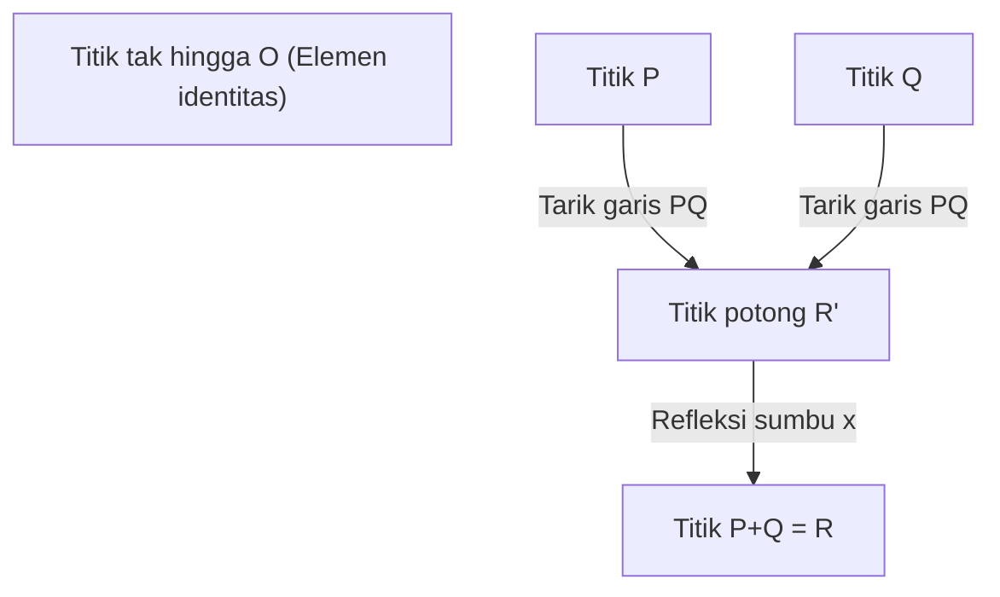
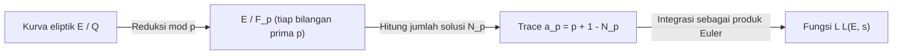

## 1. Pendahuluan: Soal Hadiah Milenium dan Masalah Tak Terpecahkan dalam Teori Bilangan

Di dalam matematika modern, salah satu misteri yang paling penting, indah, dan mendalam adalah **Konjektur Birch dan Swinnerton-Dyer** (Birch and Swinnerton-Dyer Conjecture, selanjutnya disebut **Konjektur BSD**). Konjektur ini dipilih sebagai salah satu dari tujuh "Soal Hadiah Milenium" (Millennium Prize Problems) yang diumumkan oleh Clay Mathematics Institute pada tahun 2000, dan bagi yang berhasil memecahkannya akan diberikan hadiah sebesar satu juta dolar.

Konjektur BSD berada dalam bidang "Geometri Aritmatika", yang merupakan persilangan antara geometri aljabar dan teori bilangan. Secara garis besar, konjektur ini membuat klaim yang menakjubkan: "Apakah jumlah titik rasional pada kurva eliptik itu tak terhingga atau tidak, dapat diketahui dari perilaku fungsi kompleks (fungsi L) yang ditentukan oleh kurva eliptik tersebut pada $s=1$." Dengan mengumpulkan informasi lokal (jumlah solusi modulo bilangan prima), informasi global (struktur dari solusi rasional) dapat ditentukan sepenuhnya, sebuah konjektur yang seolah mewujudkan romantisme matematika.

Dalam artikel ini, untuk memahami apa arti dari Konjektur BSD, kita akan memulai dari dasar kurva eliptik, lalu membahas secara rinci dan ketat mengenai Teorema Mordell, definisi fungsi L, dan klaim eksak dari Konjektur BSD (Konjektur Lemah dan Konjektur Kuat). Selain itu, kita juga akan menyelami topik-topik tingkat lanjut seperti hubungan dengan masalah bilangan kongruen dan latar belakang melalui kohomologi Galois.

## 2. Apa itu Kurva Eliptik: Permata Geometri Aljabar

Tokoh utama dalam Konjektur BSD adalah **Kurva Eliptik** (Elliptic Curve). Meskipun mengandung kata "eliptik", tidak ada hubungan langsung dengan bentuk geometri elips (oval). Nama ini diberikan karena kurva ini ditemukan selama proses meneliti fungsi invers dari "integral eliptik" yang muncul saat menghitung panjang busur elips.

### 2.1. Bentuk Standar Weierstrass

Kurva eliptik $E$ atas lapangan bilangan rasional $\mathbb{Q}$ secara umum dapat direpresentasikan sebagai kurva aljabar proyektif tak singular yang didefinisikan oleh persamaan kubik berikut (Bentuk Standar Weierstrass):

$$
E: y^2 = x^3 + ax + b \quad (a, b \in \mathbb{Q})
$$

Di sini, "tak singular (non-singular)" berarti tidak ada titik puncak (cusp) atau titik potong sendiri (node) pada kurva. Kondisi ini direpresentasikan menggunakan diskriminan $\Delta$ sebagai berikut:

$$
\Delta = -16(4a^3 + 27b^2) \neq 0
$$

Secara geometris, jika dipertimbangkan di atas lapangan bilangan kompleks $\mathbb{C}$, kurva ini berbentuk torus (seperti donat). Hal ini ditunjukkan oleh isomorfisme dengan torus kompleks $\mathbb{C}/\Lambda$ ($\Lambda$ adalah kisi) yang menggunakan fungsi $\wp$ dari Weierstrass.

### 2.2. Titik Rasional dan Struktur Grup

Salah satu sifat paling menakjubkan dari kurva eliptik adalah bahwa kita dapat mendefinisikan "penjumlahan" untuk titik-titik di atasnya. Metode ini disebut metode tali dan singgung (chord and tangent method).

Untuk dua titik $P, Q$ pada kurva, penjumlahan $P + Q$ didefinisikan sebagai berikut:
1. Tarik garis $L$ yang melalui $P$ dan $Q$ (jika $P=Q$, tarik garis singgung di titik tersebut).
2. Menurut Teorema Bézout, kurva kubik $E$ dan garis $L$ pasti memiliki 3 titik potong (termasuk multiplisitas). Misalkan titik potong ketiga adalah $R'$.
3. Titik $R$ didefinisikan dengan merefleksikan $R'$ terhadap sumbu $x$, dan ini didefinisikan sebagai $P + Q$.

Dengan menjadikan titik tak hingga $\mathcal{O}$ sebagai elemen nol (elemen identitas), titik-titik pada kurva eliptik $E$ membentuk grup abelian. Secara khusus, himpunan seluruh titik rasional (titik di mana koordinat $x, y$ keduanya adalah bilangan rasional) $E(\mathbb{Q})$ dari kurva eliptik yang didefinisikan pada lapangan rasional $\mathbb{Q}$ membentuk subgrup terhadap operasi penjumlahan ini.

Masalah mencari titik rasional telah diteliti sebagai masalah utama dalam persamaan Diophantine sejak zaman kuno. Tujuan terbesarnya adalah untuk mengungkap seluruh gambaran dari struktur yang dimiliki oleh himpunan titik rasional.

## 3. Teorema Mordell dan Rank (Pangkat)

Pada tahun 1922, Louis Mordell membuktikan sebuah teorema definitif mengenai struktur dari grup titik rasional $E(\mathbb{Q})$. Teorema ini kemudian diperluas ke lapangan aljabar dan varietas abelian yang lebih umum oleh André Weil, dan dikenal sebagai Teorema Mordell-Weil.

### 3.1. Teorema Mordell (Mordell's Theorem)

**Teorema (Mordell, 1922)**
Grup titik rasional $E(\mathbb{Q})$ dari sebuah kurva eliptik $E$ adalah grup abelian yang dibangun secara berhingga (finitely generated abelian group).

Berdasarkan teorema fundamental dari grup abelian yang dibangun secara berhingga dalam aljabar, $E(\mathbb{Q})$ isomorfik dengan bentuk berikut:

$$
E(\mathbb{Q}) \cong E(\mathbb{Q})_{\text{tors}} \oplus \mathbb{Z}^r
$$

Di mana:
- $E(\mathbb{Q})_{\text{tors}}$ disebut **subgrup torsi** (torsion subgroup), yaitu grup berhingga yang terdiri dari semua titik berorde berhingga (titik yang jika ditambahkan beberapa kali akan menjadi titik tak hingga $\mathcal{O}$). Menurut teorema Barry Mazur (1977), struktur subgrup torsi untuk kurva eliptik atas lapangan rasional telah diklasifikasikan sepenuhnya dan hanya ada 15 jenis yang mungkin. Secara spesifik, mereka adalah $\mathbb{Z}/N\mathbb{Z}$ ($1 \le N \le 10, N=12$) atau $\mathbb{Z}/2\mathbb{Z} \oplus \mathbb{Z}/2N\mathbb{Z}$ ($1 \le N \le 4$).
- $r$ adalah bilangan bulat non-negatif yang disebut **rank (pangkat)**.
- $\mathbb{Z}^r$ adalah grup abelian bebas yang dibangun oleh titik-titik berorde tak hingga (titik yang tidak akan pernah menjadi $\mathcal{O}$ meski ditambahkan berkali-kali).

### 3.2. Makna dari Rank $r$ dan Kesulitannya

Rank $r$ adalah invarian penting yang mewakili "berapa banyak titik berorde tak hingga yang pada dasarnya saling bebas".
- Jika $r = 0$, maka $E(\mathbb{Q})$ menjadi grup berhingga, dan hanya ada sejumlah berhingga titik rasional.
- Jika $r \ge 1$, maka $E(\mathbb{Q})$ memiliki titik rasional yang jumlahnya tak hingga.

Subgrup torsi dapat dengan mudah dihitung dan ditentukan secara algoritmik menggunakan teorema Nagell-Lutz. Akan tetapi, **algoritma umum untuk menentukan rank $r$ belum diketahui hingga saat ini.**

Memang memungkinkan untuk menghitung rank untuk persamaan tertentu menggunakan metode "descent" (penurunan), namun elemen non-trivial dari grup Tate-Shafarevich menjadi hambatan, sehingga tidak ada jaminan bahwa algoritmanya akan berhenti. Walaupun kita dapat menghitung rank untuk satu kurva eliptik tertentu, pertanyaan apakah ada prosedur yang menjamin akan berhenti dan menghasilkan rank untuk *semua* kurva eliptik (masalah "decidability") masih belum terpecahkan.

Konjektur BSD adalah konjektur yang menghubungkan "rank $r$, yaitu informasi global yang sangat sulit dihitung" dengan "objek analitik yang dapat dihitung dari informasi lokal".

## 4. Dari Lokal ke Global: Fungsi L Hasse-Weil

Ketika sulit mencari solusi dari sebuah persamaan atas bilangan rasional secara keseluruhan, teori bilangan sering kali mempertimbangkan jumlah solusi pada lapangan berhingga $\mathbb{F}_p$ "modulo bilangan prima $p$". Ini disebut informasi lokal.

### 4.1. Jumlah Solusi pada Lapangan Berhingga

Kurva eliptik $E: y^2 = x^3 + ax + b$ direduksi dengan bilangan prima $p$, dan misalkan jumlah solusi dari kongruensi
$$ y^2 \equiv x^3 + ax + b \pmod p $$
(termasuk titik tak hingga) adalah $N_p$.

Secara intuitif, $x \pmod p$ mengambil $p$ nilai, dan probabilitas nilainya sama dengan $y^2$ adalah sekitar $1/2$ (jika residu kuadrat maka 2, jika bukan maka 0), sehingga jumlah solusi $N_p$ diharapkan berada di sekitar $p$ (yaitu $p+1$ termasuk titik tak hingga). "Penyimpangan" dari nilai harapan ini didefinisikan sebagai $a_p$.

$$
a_p = p + 1 - N_p
$$

Menurut batas Hasse (Hasse's bound), diketahui bahwa penyimpangan ini dibatasi oleh $|a_p| \le 2\sqrt{p}$. Ini adalah sejenis analogi Hipotesis Riemann untuk kurva eliptik atas lapangan berhingga.

### 4.2. Definisi Fungsi L

Dengan mengumpulkan informasi-informasi lokal $a_p$ ini untuk semua bilangan prima $p$, kita membangun sebuah fungsi analitik tunggal. Ini adalah **Fungsi L Hasse-Weil** (Hasse-Weil L-function) $L(E, s)$.
Untuk bilangan kompleks $s$, fungsi ini didefinisikan menggunakan perkalian Euler sebagai berikut:

$$
L(E, s) = \prod_{p \mid \Delta} (1 - a_p p^{-s})^{-1} \prod_{p \nmid \Delta} (1 - a_p p^{-s} + p^{1-2s})^{-1}
$$
(Di sini, perkalian pertama berlaku untuk bilangan prima dengan "reduksi buruk (bad reduction)", sedangkan yang kedua untuk bilangan prima dengan "reduksi baik (good reduction)". Dalam kasus reduksi buruk, $a_p$ mengambil nilai $1, -1, \text{atau } 0$ tergantung pada jenis reduksinya.)

Dengan menggunakan batas Hasse, perkalian tak hingga ini ditunjukkan konvergen mutlak pada daerah $\mathrm{Re}(s) > \frac{3}{2}$.

### 4.3. Kelanjutan Analitik dan Teorema Modularitas

Hal yang sangat penting dalam merumuskan Konjektur BSD adalah pertanyaan: apakah $L(E, s)$ dapat diperluas secara analitik (analytic continuation) ke seluruh bidang kompleks? Secara khusus, seperti yang akan kita bahas nanti, kita ingin mengetahui perilakunya di $s=1$, tetapi rumus definisinya tidak konvergen pada $s=1$.

Masalah ini diselesaikan oleh **Teorema Modularitas** (sebelumnya Konjektur Taniyama-Shimura) yang dibuktikan sepenuhnya pada tahun 2001. Berkat pencapaian besar dari Andrew Wiles, Richard Taylor, Christophe Breuil, Brian Conrad, dan Fred Diamond, ditunjukkan bahwa "semua kurva eliptik atas lapangan rasional adalah modular".

Modular berarti bahwa $L(E, s)$ sepenuhnya setara dengan fungsi L $L(f, s)$ dari sebuah bentuk modular $f$ dengan bobot 2. Melalui teori Hecke, fungsi L dari bentuk modular dapat diperluas secara analitik ke seluruh bidang kompleks dan memenuhi persamaan fungsional berikut:

$$
\Lambda(E, s) = (2\pi)^{-s} N^{s/2} \Gamma(s) L(E, s)
$$
$$
\Lambda(E, 2-s) = w \Lambda(E, s)
$$

Di mana $N$ adalah sebuah bilangan bulat yang disebut konduktor (conductor), dan $w \in \{1, -1\}$ adalah tanda (root number).
Dengan adanya kelanjutan analitik ini, mendiskusikan nilai dan ekspansi Taylor dari $L(E, s)$ pada $s=1$ dapat dibenarkan secara matematis.

## 5. Konjektur Birch dan Swinnerton-Dyer

Pada awal tahun 1960-an, Bryan Birch dan Peter Swinnerton-Dyer menggunakan komputer awal di Universitas Cambridge (EDSAC 2) untuk menghitung $N_p$ pada banyak kurva eliptik dan menyelidiki perilaku produk tak hingga yang setara dengan $L(E, 1)$ secara eksperimental.

Jika jumlah titik rasionalnya banyak (rank $r$ besar), maka jumlah solusi $N_p$ modulo masing-masing bilangan prima $p$ seharusnya cenderung membesar. Jika demikian, $a_p = p + 1 - N_p$ akan menjadi sangat negatif, dan nilai suku produk Euler $(1 - a_p p^{-1} + p^{-1})^{-1}$ akan mengecil, sehingga nilai fungsi L pada $s=1$ seharusnya mendekati $0$.

Dari wawasan berbasis eksperimen komputer ini, lahirlah sebuah konjektur yang bersinar cemerlang dalam sejarah matematika.

### 5.1. Konjektur BSD (Konjektur Lemah)

**Konjektur Birch dan Swinnerton-Dyer (Lemah)**
Rank $r$ dari kurva eliptik $E$ atas lapangan rasional $\mathbb{Q}$ sama dengan orde nol dari fungsi L-nya $L(E, s)$ pada titik $s=1$.

Artinya, jika kita mempertimbangkan ekspansi Taylor:
$$
L(E, s) = c(s-1)^r + \text{suku orde lebih tinggi} \quad (c \neq 0)
$$
Orde nol ini disebut sebagai **rank analitik**.

Konjektur ini sangat mengejutkan. "Orde nol" di sisi kiri (atau kanan) adalah nilai yang murni ditentukan oleh informasi analitik/lokal. Sementara itu, "rank $r$" di sisi kanan (atau kiri) adalah nilai yang mewakili struktur titik rasional aljabar/global. Dua kuantitas yang berasal dari dunia yang sepenuhnya berbeda diklaim bernilai sama persis.

Secara khusus, jika kita membandingkan kasus $r=0$ dan $r \ge 1$:
- $L(E, 1) \neq 0 \iff$ Titik rasional pada $E(\mathbb{Q})$ berhingga
- $L(E, 1) = 0 \iff$ Titik rasional pada $E(\mathbb{Q})$ tak terhingga

### 5.2. Konjektur BSD (Konjektur Kuat)

Lebih jauh lagi, mereka juga menduga bahwa koefisien tak-nol pertama $c$ (yaitu $L^{(r)}(E, 1) / r!$) pada ekspansi Taylor sebelumnya dapat dideskripsikan dengan rumus yang sangat indah menggunakan berbagai invarian aritmatika dari kurva eliptik. Ini dikenal sebagai **Konjektur Kuat BSD**.

$$
\lim_{s \to 1} \frac{L(E, s)}{(s-1)^r} = \frac{\Omega_E \cdot \mathrm{Reg}(E) \cdot |\text{Sha}(E)| \cdot \prod_{p} c_p}{|E(\mathbb{Q})_{\text{tors}}|^2}
$$

Invarian-invarian yang muncul dalam rumus ini adalah:
1. **$\Omega_E$ (Periode riil)** : Bilangan transenden yang diperoleh dari integral $\int_{E(\mathbb{R})} \frac{dx}{|2y + a_1x + a_3|}$ atas lapangan bilangan riil dari kurva eliptik.
2. **$\mathrm{Reg}(E)$ (Regulator)** : Determinan matriks $r \times r$ yang disusun oleh pemasangan tinggi Néron-Tate (Néron-Tate height pairing) $\langle P_i, P_j \rangle$ dari pembangkit titik rasional berorde tak hingga $P_1, \dots, P_r$ yang berjumlah $r$. Ini adalah metrik untuk mengukur "ukuran" titik.
3. **$|E(\mathbb{Q})_{\text{tors}}|$** : Orde dari subgrup torsi.
4. **$c_p$ (Bilangan Tamagawa)** : Faktor koreksi lokal untuk bilangan prima $p$ yang memiliki reduksi buruk. Dihitung dari aksi grup Galois lapangan lokal.
5. **$\text{Sha}(E)$ (Grup Tate-Shafarevich, $\text{\textcyrillic{Sh}}$)** : Objek yang sangat penting, akan dijelaskan di bawah ini.

Rumus ini dapat dianggap sebagai wujud pamungkas yang menggeneralisasikan rumus class number Dirichlet (Dirichlet's class number formula) dari abad ke-19:
$$
\lim_{s \to 1} (s-1)\zeta_K(s) = \frac{2^{r_1} (2\pi)^{r_2} h_K R_K}{w_K \sqrt{|D_K|}}
$$
ke kurva eliptik. Class number $h_K$ pada fungsi zeta Dedekind berkorespondensi dengan $\text{Sha}(E)$, dan regulator $R_K$ dari grup unit berkorespondensi dengan regulator kurva eliptik $\mathrm{Reg}(E)$.

### 5.3. Grup Misterius "Sha (Ш)" dan Kohomologi Galois

Objek yang paling misterius dan rumit dalam rumus tersebut adalah grup Tate-Shafarevich $\text{Sha}(E)$ (direpresentasikan dengan huruf Sirilik $\text{\textcyrillic{Sh}}$).

Prinsip lokal-global (Prinsip Hasse) menyatakan, "Syarat perlu dan cukup agar suatu persamaan memiliki solusi pada lapangan rasional (global) adalah ia harus memiliki solusi pada lapangan bilangan p-adic (lokal) untuk semua bilangan prima $p$, dan juga pada lapangan riil." Untuk bentuk kuadrat, prinsip ini berlaku (Teorema Hasse-Minkowski).
Akan tetapi, prinsip ini tidak berlaku untuk kurva eliptik (kurva kubik). Fenomena "memiliki solusi lokal di mana-mana, namun tidak memiliki solusi secara global" dapat terjadi.

$\text{Sha}(E)$ adalah grup yang mengukur "kegagalan prinsip lokal-global" ini menggunakan kohomologi Galois. Secara ketat, didefinisikan sebagai berikut:

$$
\text{Sha}(E) = \ker \left( H^1(G_{\mathbb{Q}}, E) \to \prod_{v} H^1(G_{\mathbb{Q}_v}, E) \right)
$$

Di mana $G_{\mathbb{Q}}$ adalah grup Galois absolut, dan produknya adalah atas semua tempat (bilangan prima rasional dan bilangan prima tak hingga).
Konjektur Kuat BSD secara implisit menyertakan premis bahwa "pada setiap kurva eliptik, $\text{Sha}(E)$ adalah grup berhingga". Namun, sampai hari ini, belum ada bukti bahwa $\text{Sha}(E)$ itu berhingga untuk kurva eliptik umum. Kecuali untuk kurva dengan perkalian kompleks (complex multiplication) oleh Karl Rubin dkk., pemahaman esensial mengenai $\text{Sha}(E)$ adalah salah satu tantangan terbesar dalam teori bilangan modern.

## 6. Hubungan dengan Masalah Bilangan Kongruen

Salah satu aplikasi paling terkenal dari Konjektur BSD adalah **Masalah Bilangan Kongruen (Congruent number problem)**. Masalahnya berbunyi: "Dapatkah suatu bilangan asli $n$ menjadi luas segitiga siku-siku di mana panjang semua sisinya adalah bilangan rasional?" Bilangan $n$ yang bisa menjadi luas segitiga ini disebut bilangan kongruen. Sebagai contoh, $n=5, 6, 7$ adalah bilangan kongruen, namun $n=1, 2, 3$ bukan.

Ternyata, diketahui bahwa $n$ menjadi bilangan kongruen setara dengan kondisi bahwa kurva eliptik spesifik
$$ E_n: y^2 = x^3 - n^2 x $$
memiliki jumlah titik rasional tak hingga (dengan kata lain, rank $r \ge 1$).

Jika kita asumsikan Konjektur Lemah BSD benar, menurut Teorema Tunnell (1983), syarat $n$ agar menjadi bilangan kongruen dapat direduksi menjadi syarat elementer sederhana yang menyangkut jumlah solusi dari bentuk kuadrat tertentu. Dengan cara ini, Konjektur BSD memiliki kekuatan untuk memberikan jawaban yang lengkap atas masalah teori bilangan klasik yang telah ada sejak ribuan tahun lalu.

## 7. Perkembangan Saat Ini dan Tembok yang Belum Terpecahkan

Sesuai posisinya sebagai salah satu Soal Hadiah Milenium, Konjektur BSD belum mencapai pembuktian yang menyeluruh. Namun, beberapa hasil parsial yang penting telah berhasil diperoleh.

### 7.1. Kasus Rank $r \le 1$

Secara mengejutkan, ketika rank analitik (orde nol dari $L(E,s)$ pada $s=1$) bernilai 0 atau 1, sebagian besar Konjektur BSD terbukti benar.

- **Teorema Gross-Zagier (Gross-Zagier, 1986)** :
  Jika rank analitiknya 1, mereka menunjukkan bahwa turunan pertama dari $L(E,s)$ pada $s=1$ memiliki proporsi dengan tinggi Néron-Tate dari "titik Heegner", yaitu titik spesial pada kurva modular. Karena tinggi titik Heegner tersebut bukan nol, maka terbukti bahwa rank aljabarnya $1$ atau lebih.
- **Teorema Kolyvagin (Kolyvagin, 1989)** :
  Ia membangun metode kohomologi Galois yang kuat bernama "Sistem Euler (Euler system)", dan membuktikan bahwa jika rank analitiknya 0 atau 1, maka rank tersebut sama dengan rank aljabarnya, serta grup Tate-Shafarevich $\text{Sha}(E)$ dipastikan menjadi grup berhingga jika dan hanya jika dalam kasus tersebut.

Dari berbagai pencapaian ini, telah dipastikan bahwa "Untuk kurva eliptik dengan rank analitik 0 atau 1, Konjektur Lemah BSD bernilai benar".

### 7.2. Tembok Tinggi Rank $r \ge 2$

Di sisi lain, untuk kurva eliptik dengan rank analitik 2 atau lebih, hampir tidak ada yang diketahui.
Bahkan untuk kurva tertentu yang telah diketahui memiliki rank aljabar 2, belum ada satu pun kasus di mana rank analitik 2 berhasil dibuktikan secara rigor (bukan melalui aproksimasi kalkulasi komputer).
Selain itu, tidak ditemukan mekanisme yang sistematis untuk membentuk titik rasional (seperti Sistem Euler) pada kasus rank 2 atau lebih, sehingga hal ini menjadi tembok besar yang menghalangi matematika modern.

Mulai dari tahun 2010-an, riset dari Manjul Bhargava dan Arul Shankar dkk. menghasilkan statisik yang luar biasa bahwa **"Dari semua kurva eliptik, setidaknya 66% mematuhi Konjektur BSD"**. Hal ini karena mereka menunjukkan bahwa kurva dengan rank 0 dan rank 1 mendominasi mayoritas (artinya rata-rata rank bersifat terbatas/bounded). Karena itu, paling tidak dari sudut pandang probabilitas statistik, kebenaran Konjektur BSD menjadi sangat masuk akal.

## 8. Kesimpulan

Konjektur Birch dan Swinnerton-Dyer adalah konjektur megah yang mengikat geometri aljabar (kurva eliptik) dan analisis (fungsi L) dengan luar biasa melalui perantara teori bilangan.

- **Fusi Aljabar dan Geometri**: Struktur grup dari solusi bilangan rasional pada persamaan (rank dan torsi).
- **Dunia Analitik**: Nol dari fungsi L yang dibentuk dari jumlah solusi modulo bilangan prima.
- **Misteri Mendalam**: Keduanya sepenuhnya sama, dan lebih jauh koefisiennya dideskripsikan oleh invarian teoritis bilangan (khususnya $\text{Sha}(E)$ yang sarat akan misteri).

Pada saat Konjektur BSD akhirnya terpecahkan sepenuhnya, bukan saja akan terjadi terobosan fundamental (breakthrough) yang mutlak dalam pemahaman mengenai solusi rasional dari persamaan Diophantine, namun ini juga akan menjadi fondasi kokoh bagi teori fungsi L motivik (motivic L-function) yang lebih luas, seperti analogi di atas lapangan fungsi (Konjektur Artin-Tate) atau "Program Langlands" yang mengintegrasikan berbagai bidang dalam matematika.

Kecerdasan umat manusia sangat dinantikan untuk pada akhirnya mampu mengarungi hutan lebat ini dan mendapatkan "mata" baru guna memandang dunia global dengan rank 2 ke atas.

---
*Artikel ini dibuat dengan tujuan menjelaskan topik matematika tingkat lanjut. Meskipun mengandung banyak rumus, kami berharap pembaca dapat sedikit merasakan keindahan dari geometri aritmatika. Pertanyaan dan diskusi dinantikan di kolom komentar.*
