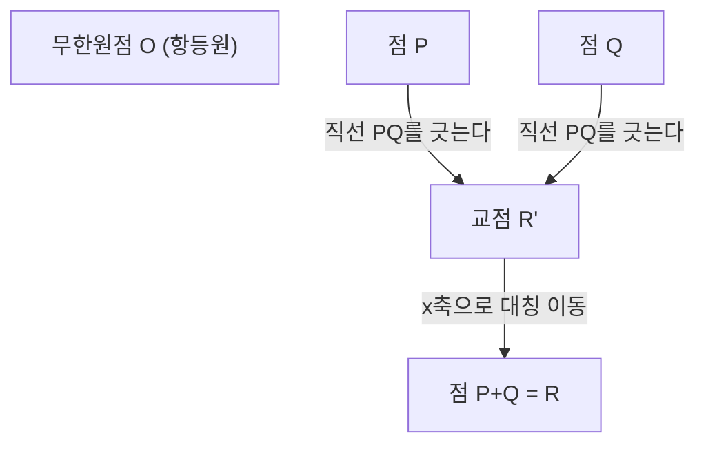
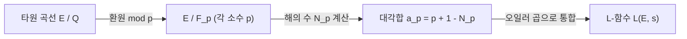

## 1. 서론: 밀레니엄 현상 문제와 정수론의 미해결 문제

현대 수학에서 가장 중요하고, 동시에 가장 아름답고 깊은 수수께끼 중 하나가 **버치-스위너턴다이어 추측**(Birch and Swinnerton-Dyer Conjecture, 이하 **BSD 추측**)입니다. 2000년 클레이 수학연구소가 발표한 7개의 '밀레니엄 현상 문제' 중 하나로도 선정되었으며, 해결자에게는 100만 달러의 상금이 주어집니다.

BSD 추측은 대수기하학과 정수론이 교차하는 '산술기하학'이라는 분야에 속해 있습니다. 대략적으로 말하자면, 이 추측은 "타원 곡선의 유리점의 개수가 무한개인지 여부는, 그 타원 곡선으로부터 결정되는 복소 함수(L-함수)의 $s=1$에서의 행동을 보면 알 수 있다"는 놀라운 주장을 하고 있습니다. 국소적인 정보(소수를 법으로 하는 해의 개수)를 모음으로써, 대역적인 정보(유리수 해의 구조)가 완전히 결정된다는, 수학의 로망을 구현한 듯한 추측입니다.

본 기사에서는 BSD 추측이 무엇을 의미하는지 이해하기 위해, 타원 곡선의 기초부터 출발하여 모델의 정리, L-함수의 정의, 그리고 BSD 추측의 정확한 주장(약한 추측과 강한 추측)까지 상세하고 엄밀하게 해설해 나갈 것입니다. 나아가 합동수 문제와의 연관성이나 갈루아 코호몰로지에 의한 배경 등 고도의 주제도 다룰 것입니다.

## 2. 타원 곡선이란 무엇인가: 대수기하학의 보석

BSD 추측의 주역은 **타원 곡선**(Elliptic Curve)입니다. '타원'이라는 이름이 붙어 있지만, 기하학적 도형으로서의 타원과는 직접적인 관계가 없습니다. 타원 곡선의 호의 길이를 계산할 때 등장하는 '타원 적분'의 역함수를 연구하는 과정에서 발견되었기 때문에 이런 이름이 붙었습니다.

### 2.1. 바이어슈트라스의 표준형

유리수체 $\mathbb{Q}$ 상의 타원 곡선 $E$는 일반적으로 다음 형태의 3차 방정식(바이어슈트라스의 표준형)으로 정의되는 비특이 사영 대수 곡선으로 나타낼 수 있습니다.

$$
E: y^2 = x^3 + ax + b \quad (a, b \in \mathbb{Q})
$$

여기서 '비특이(non-singular)'라는 것은 곡선 위에 첨점(cusp)이나 자기 교차점(node)이 없음을 의미합니다. 이 조건은 판별식 $\Delta$를 사용하여 다음과 같이 나타낼 수 있습니다.

$$
\Delta = -16(4a^3 + 27b^2) \neq 0
$$

기하학적으로 이 곡선은 복소수체 $\mathbb{C}$ 상에서 생각하면 토러스(도넛 모양) 형태를 띠고 있습니다. 이는 바이어슈트라스의 $\wp$ 함수를 사용한 복소 토러스 $\mathbb{C}/\[Lambda](https://kenji.blog/ko/p/serverless-architecture-aws-lambda-cold-start/)$($\Lambda$는 격자)와의 동형 대응으로부터 보여집니다.

### 2.2. 유리점과 군 구조

타원 곡선의 가장 놀라운 성질 중 하나는 그 위의 점들에 대해 '덧셈'을 정의할 수 있다는 것입니다. 이는 현과 접선 방법(chord and tangent method)이라고 불립니다.

곡선 상의 두 점 $P, Q$에 대해 덧셈 $P + Q$를 다음과 같이 정의합니다.
1. $P$와 $Q$를 지나는 직선 $L$을 긋습니다 ($P=Q$인 경우에는 그 점에서의 접선을 긋습니다).
2. 베주(Bézout)의 정리에 의해, 3차 곡선 $E$와 직선 $L$은 (중복도를 포함하여) 반드시 3개의 교점을 가집니다. 그 3번째 교점을 $R'$이라고 합니다.
3. $R'$을 $x$축에 대해 대칭 이동시킨 점을 $R$이라 하고, 이를 $P + Q$로 정의합니다.

무한원점 $\mathcal{O}$를 영원(항등원)으로 함으로써, 타원 곡선 $E$ 상의 점들은 아벨 군을 이룹니다. 특히, 유리수체 $\mathbb{Q}$ 상에서 정의된 타원 곡선의 유리점(좌표 $x, y$가 모두 유리수인 점) 전체의 집합 $E(\mathbb{Q})$는 이 덧셈에 대해 부분군이 됩니다.

유리점을 찾는 문제는 예로부터 [디오판토스](https://kenji.blog/ko/p/diophantus/) 방정식의 주요 문제로서 연구되어 왔습니다. 유리점의 집합이 어떤 구조를 가지고 있는지, 그 전모를 밝히는 것이 최대의 목표가 됩니다.

## 3. 모델의 정리와 랭크(계수)

1922년, [루이스 모델](https://kenji.blog/ko/p/mordell/)(Louis Mordell)은 유리점 군 $E(\mathbb{Q})$의 구조에 관한 결정적인 정리를 증명했습니다. 나중에 [앙드레 베유](/ko/p/weil/)([André Weil](https://kenji.blog/ko/p/weil/))가 더 일반적인 대수체와 아벨 다양체로 확장하여, 모델-베유의 정리로 알려져 있습니다.

### 3.1. 모델의 정리 (Mordell's Theorem)

**정리 (모델, 1922년)**
타원 곡선 $E$의 유리점 군 $E(\mathbb{Q})$는 유한 생성 아벨 군이다.

대수학의 유한 생성 아벨 군의 기본 정리에 따르면, $E(\mathbb{Q})$는 다음과 같은 동형을 가집니다.

$$
E(\mathbb{Q}) \cong E(\mathbb{Q})_{\text{tors}} \oplus \mathbb{Z}^r
$$

여기서,
- $E(\mathbb{Q})_{\text{tors}}$는 **꼬임 부분군**(torsion subgroup)이라고 불리며, 유한 위수의 점(여러 번 더하면 무한원점 $\mathcal{O}$가 되는 점) 전체로 이루어진 유한군입니다. 배리 메이저(Barry Mazur)의 정리(1977년)에 의해, 유리수체 상의 타원 곡선에서 꼬임 부분군이 가질 수 있는 구조는 단 15가지밖에 없다는 것이 완전히 분류되어 있습니다. 구체적으로는 $\mathbb{Z}/N\mathbb{Z}$ ($1 \le N \le 10, N=12$) 또는 $\mathbb{Z}/2\mathbb{Z} \oplus \mathbb{Z}/2N\mathbb{Z}$ ($1 \le N \le 4$) 중 하나입니다.
- $r$은 음이 아닌 정수이며, **랭크(계수)**라고 불립니다.
- $\mathbb{Z}^r$은 무한 위수의 점(아무리 많이 더해도 $\mathcal{O}$가 되지 않는 점)으로 생성되는 자유 아벨 군입니다.

### 3.2. 랭크 $r$의 의미와 어려움

랭크 $r$은 "실질적으로 독립적인 무한 위수의 점이 몇 개 있는가"를 나타내는 중요한 불변량입니다.
- $r = 0$이면, $E(\mathbb{Q})$는 유한군이 되며, 유리점은 유한개밖에 존재하지 않습니다.
- $r \ge 1$이면, $E(\mathbb{Q})$는 무한개의 유리점을 가집니다.

꼬임 부분군은 Nagell-Lutz 정리 등을 사용하여 알고리즘적으로 쉽게 계산하고 결정할 수 있습니다. 그러나, **랭크 $r$을 결정하는 일반적인 알고리즘은 현재까지 알려져 있지 않습니다.**

강하법(descent)이라고 불리는 기법으로 특정 방정식의 랭크를 계산하는 것은 가능하지만, 테이트-샤파레비치 군의 자명하지 않은 원소가 장애물이 되어 알고리즘이 반드시 정지한다는 보장이 없습니다. 특정 타원 곡선에 대해 랭크를 계산하는 것은 가능할지라도, 모든 타원 곡선에 대해 확실하게 정지하여 랭크를 출력하는 절차가 존재하는지 여부(결정 가능성)조차 미해결입니다.

BSD 추측은 바로 이 "계산이 극도로 어려운 대역적 정보인 랭크 $r$"을 "국소적인 정보로부터 계산 가능한 해석적 대상"과 연결짓는 추측인 것입니다.

## 4. 국소에서 대역으로: 하세-베유 L-함수

유리수 전체에서 방정식의 해를 찾는 것이 어려운 경우, 정수론에서는 종종 "소수 $p$를 법으로 하는(modulo $p$)" 유한체 $\mathbb{F}_p$ 상에서의 해의 개수를 생각합니다. 이를 국소적인 정보라고 부릅니다.

### 4.1. 유한체 상의 해의 개수

타원 곡선 $E: y^2 = x^3 + ax + b$를 소수 $p$로 환원하고, 합동식
$$ y^2 \equiv x^3 + ax + b \pmod p $$
의 해의 개수(무한원점도 포함)를 $N_p$라고 합니다.

직관적으로, $x \pmod p$는 $p$가지의 값을 취하고, $y^2$과 같아질 확률은 대략 $1/2$(이차 잉여이면 2개, 비잉여이면 0개)이므로, 해의 개수 $N_p$는 대략 $p$개(무한원점을 포함하여 $p+1$개)가 될 것으로 기대됩니다. 이 예상치와의 '차이'를 $a_p$로 정의합니다.

$$
a_p = p + 1 - N_p
$$

하세의 정리(Hasse's bound)에 따르면, 이 차이는 $|a_p| \le 2\sqrt{p}$로 억제된다는 것이 알려져 있습니다. 이는 유한체 상의 타원 곡선에 대한 리만 가설의 유사(analogue) 중 하나입니다.

### 4.2. L-함수의 정의

이러한 국소적인 정보 $a_p$를 모든 소수 $p$에 대해 모아, 하나의 해석적인 함수를 구성합니다. 이것이 **하세-베유 L-함수**(Hasse-Weil L-function) $L(E, s)$입니다.
복소수 $s$에 대해 오일러 곱을 사용하여 다음과 같이 정의됩니다.

$$
L(E, s) = \prod_{p \mid \Delta} (1 - a_p p^{-s})^{-1} \prod_{p \nmid \Delta} (1 - a_p p^{-s} + p^{1-2s})^{-1}
$$
(여기서 앞의 곱은 '나쁜 환원(bad reduction)'을 가지는 소수, 뒤의 곱은 '좋은 환원(good reduction)'을 가지는 소수에 대한 곱입니다. 나쁜 환원의 경우, $a_p$는 환원의 유형에 따라 $1, -1, 0$ 중 하나를 취합니다.)

이 무한 곱은 하세의 경계를 사용함으로써 $\mathrm{Re}(s) > \frac{3}{2}$인 영역에서 절대 수렴한다는 것이 보여집니다.

### 4.3. 해석적 연속과 모듈러성 정리

BSD 추측을 서술하는 데 있어서 결정적으로 중요한 것은, $L(E, s)$를 전체 복소평면으로 해석적 연속을 할 수 있는가 하는 문제입니다. 특히, 나중에 설명하듯이 $s=1$에서의 행동을 알고 싶은데, 정의식의 곱은 $s=1$에서 수렴하지 않습니다.

이 문제는 2001년에 완전히 증명된 **모듈러성 정리**(구 타니야마-시무라 추측)에 의해 해결되었습니다. 앤드루 와일스([Andrew Wiles](https://kenji.blog/ko/p/wiles/)), 리처드 테일러(Richard Taylor), 크리스토프 브뢰유(Christophe Breuil), 브라이언 콘래드(Brian Conrad), 프레드 다이아몬드(Fred Diamond) 등의 장대한 업적에 의해, "모든 유리수체 상의 타원 곡선은 모듈러이다"라는 것이 보여졌습니다.

모듈러라는 것은, $L(E, s)$가 어떤 무게(weight) 2의 모듈러 형식 $f$의 L-함수 $L(f, s)$와 완전히 일치함을 의미합니다. 모듈러 형식의 L-함수는 헤케(Hecke)의 이론에 의해 전체 복소평면으로 해석적 연속이 되며, 다음과 같은 함수 등식을 만족합니다.

$$
\[Lambda](https://kenji.blog/ko/p/serverless-architecture-aws-lambda-cold-start/)(E, s) = (2\pi)^{-s} N^{s/2} \Gamma(s) L(E, s)
$$
$$
\Lambda(E, 2-s) = w \Lambda(E, s)
$$

여기서 $N$은 도수(conductor)라고 불리는 정수이고, $w \in \{1, -1\}$은 부호(루트 넘버)입니다.
이 해석적 연속에 의해, $s=1$에서의 $L(E, s)$의 값이나 테일러 전개를 논의하는 것이 수학적으로 정당화됩니다.

## 5. 버치-스위너턴다이어 추측

1960년대 초반, 브라이언 버치와 피터 스위너턴다이어는 케임브리지 대학의 초기 컴퓨터(EDSAC 2)를 사용하여 수많은 타원 곡선의 $N_p$를 계산하고, $L(E, 1)$에 해당하는 무한 곱의 행동을 실험적으로 조사했습니다.

만약 유리점이 많다면(랭크 $r$이 크다면), 각 소수 $p$를 법으로 하여도 해의 개수 $N_p$가 커지는 경향이 있을 것입니다. 그러면 $a_p = p + 1 - N_p$는 음의 방향으로 커지고, 오일러 곱의 항 $(1 - a_p p^{-1} + p^{-1})^{-1}$은 작아지기 때문에, $s=1$에서의 L-함수 값은 $0$에 가까워질 것입니다.

이 컴퓨터 실험에 기반한 통찰로부터, 수학사에 찬란히 빛나는 추측이 탄생했습니다.

### 5.1. BSD 추측 (약한 추측)

**버치-스위너턴다이어 추측 (약)**
유리수체 $\mathbb{Q}$ 상의 타원 곡선 $E$의 랭크(계수) $r$은 그 L-함수 $L(E, s)$의 $s=1$에서의 영점의 위수(order)와 같다.

즉, 테일러 전개를 생각했을 때,
$$
L(E, s) = c(s-1)^r + \text{고차항(higher order terms)} \quad (c \neq 0)
$$
이 된다는 주장입니다. 이 영점의 위수를 **해석적 랭크**라고 부릅니다.

이 추측은 천지를 뒤흔들 만합니다. 좌변(혹은 우변)의 '영점의 위수'는 순수하게 해석적·국소적인 정보로부터 결정되는 값입니다. 반면 우변(좌변)의 '랭크 $r$'은 대수적·대역적인 유리점의 구조를 나타내는 값입니다. 완전히 다른 세계에 속하는 두 개의 양이 완전히 일치한다는 것입니다.

특히 $r=0$인 경우와 $r \ge 1$인 경우를 생각해보면,
- $L(E, 1) \neq 0 \iff E(\mathbb{Q})$의 유리점은 유한개
- $L(E, 1) = 0 \iff E(\mathbb{Q})$의 유리점은 무한개
가 됩니다.

### 5.2. BSD 추측 (강한 추측)

더 나아가 그들은 앞서 말한 테일러 전개에서의 첫 번째 0이 아닌 계수 $c$ (즉 $L^{(r)}(E, 1) / r!$)가 타원 곡선의 다양한 정수론적 불변량들을 사용하여 극히 아름다운 공식으로 기술될 수 있다고 추측했습니다. 이것이 **BSD 강한 추측**입니다.

$$
\lim_{s \to 1} \frac{L(E, s)}{(s-1)^r} = \frac{\Omega_E \cdot \mathrm{Reg}(E) \cdot |\text{Sha}(E)| \cdot \prod_{p} c_p}{|E(\mathbb{Q})_{\text{tors}}|^2}
$$

이 공식에 등장하는 불변량들은 다음과 같습니다.
1. **$\Omega_E$ (실주기)** : 타원 곡선의 실수체 상에서의 적분 $\int_{E(\mathbb{R})} \frac{dx}{|2y + a_1x + a_3|}$로부터 결정되는 초월수.
2. **$\mathrm{Reg}(E)$ (레귤레이터)** : 랭크 $r$인 무한 위수의 유리점의 생성원 $P_1, \dots, P_r$에 대해, 네롱-테이트 높이 짝지음(Néron-Tate height pairing) $\langle P_i, P_j \rangle$를 나열한 $r \times r$ 행렬의 [행렬식](/ko/p/geometric-meaning-of-determinant/). 점의 '크기'를 측정하는 지표입니다.
3. **$|E(\mathbb{Q})_{\text{tors}}|$** : 꼬임 부분군의 위수.
4. **$c_p$ (타마가와 수)** : 나쁜 환원을 가지는 소수 $p$에 대한 국소적인 보정 계수. 국소체의 갈루아 군의 작용으로부터 계산됩니다.
5. **$\text{Sha}(E)$ (테이트-샤파레비치 군, $\text{\textcyrillic{Sh}}$)** : 극도로 중요한 대상이므로 뒤에 서술합니다.

이 공식은 19세기 디리클레의 유수 공식(Dirichlet's class number formula)
$$
\lim_{s \to 1} (s-1)\zeta_K(s) = \frac{2^{r_1} (2\pi)^{r_2} h_K R_K}{w_K \sqrt{|D_K|}}
$$
를 타원 곡선으로 일반화한 궁극의 형태로 간주할 수 있습니다. 데데킨트 제타 함수에서의 유수 $h_K$가 $\text{Sha}(E)$에, 단수군의 레귤레이터 $R_K$가 타원 곡선의 레귤레이터 $\mathrm{Reg}(E)$에 대응하고 있습니다.

### 5.3. 수수께끼의 군 'Sha (Ш)'와 갈루아 코호몰로지

공식 속에서 가장 신비롭고 난해한 대상이 테이트-샤파레비치 군 $\text{Sha}(E)$(키릴 문자 $\text{\textcyrillic{Sh}}$로 표시됨)입니다.

국소-대역 원리(하세의 원리)란, "모든 방정식이 유리수체(대역)에서 해를 가지기 위한 필요충분조건은, 모든 소수 $p$에 대해 $p$진수체(국소)에서 해를 가지고, 또한 실수체에서도 해를 가지는 것이다"라는 원리입니다. 이차 형식에 대해서는 이 원리가 성립합니다(하세-민코프스키의 정리).
그러나 타원 곡선(3차 곡선)에 대해서는 이 원리가 성립하지 않습니다. "국소적으로는 모두 해를 가지는데, 대역적으로는 해를 가지지 않는" 현상이 일어날 수 있습니다.

$\text{Sha}(E)$는 이 '국소-대역 원리의 실패'를 갈루아 코호몰로지를 사용하여 측정하는 군입니다. 엄밀하게는 다음과 같이 정의됩니다.

$$
\text{Sha}(E) = \ker \left( H^1(G_{\mathbb{Q}}, E) \to \prod_{v} H^1(G_{\mathbb{Q}_v}, E) \right)
$$

여기서 $G_{\mathbb{Q}}$는 절대 갈루아 군, 곱은 모든 소점(유리 소수와 무한 소점)에 걸쳐집니다.
BSD 강한 추측은 "임의의 타원 곡선에 있어서 $\text{Sha}(E)$는 유한군이다"라는 암묵적인 전제를 포함하고 있습니다. 그러나 현재까지 일반적인 타원 곡선에 대해 $\text{Sha}(E)$가 유한하다는 것조차 증명되지 않았습니다. 칼 루빈(Karl Rubin) 등에 의한 허수 승법(complex multiplication)을 가지는 곡선에 관한 결과 등을 제외하면, $\text{Sha}(E)$의 본질적인 이해는 현대 정수론의 가장 큰 과제 중 하나입니다.

## 6. 합동수 문제와의 관계

BSD 추측의 응용으로서 매우 유명한 것이 **합동수 문제(Congruent number problem)**입니다. "어떤 자연수 $n$이, 모든 변의 길이가 유리수인 직각삼각형의 넓이가 될 수 있는가?"라는 문제입니다. 넓이가 될 수 있는 $n$을 합동수라고 부릅니다. 예를 들어 $n=5, 6, 7$은 합동수이지만, $n=1, 2, 3$은 합동수가 아닙니다.

사실, $n$이 합동수라는 것은 특정 타원 곡선
$$ E_n: y^2 = x^3 - n^2 x $$
이 무한개의 유리점을 가지는 것(즉 랭크 $r \ge 1$인 것)과 동치임이 알려져 있습니다.

만약 약한 BSD 추측이 옳다고 가정하면, 터널(Tunnell)의 정리(1983년)에 의해 $n$이 합동수이기 위한 조건이, 단순한 이차 형식의 해의 개수에 관한 초등적인 판정 조건으로 귀착됩니다. 이처럼, BSD 추측은 수천 년간의 고전적인 정수론 문제에도 완전한 해답을 줄 수 있는 힘을 가지고 있습니다.

## 7. 현재의 진전과 미해결의 장벽

BSD 추측은 밀레니엄 현상 문제로 선정된 것에서 알 수 있듯, 완전한 증명에는 이르지 못했습니다. 그러나 몇 가지 중요한 부분적인 결과들이 얻어졌습니다.

### 7.1. 랭크 $r \le 1$인 경우

놀랍게도, 해석적 랭크($L(E,s)$의 $s=1$에서의 영점의 위수)가 0 또는 1인 경우에는 BSD 추측의 대부분이 옳다는 것이 증명되어 있습니다.

- **그로스-자기어의 정리 (Gross-Zagier, 1986)** :
  해석적 랭크가 1인 경우, $L(E,s)$의 $s=1$에서의 1차 미분계수가, 모듈러 곡선 상의 특별한 점으로 구성되는 '헤그너 점(Heegner point)'의 네롱-테이트 높이와 비례 관계에 있음을 보여주었습니다. 헤그너 점의 높이가 0이 아님으로부터, 대수적 랭크가 1 이상임을 증명했습니다.
- **콜리바긴의 정리 (Kolyvagin, 1989)** :
  오일러 계(Euler system)라는 강력한 갈루아 코호몰로지 기법을 구축하여, 해석적 랭크가 0 또는 1인 경우, 대수적 랭크와 일치한다는 것, 나아가 그때에 한해 테이트-샤파레비치 군 $\text{Sha}(E)$가 유한군이 됨을 증명했습니다.

이러한 업적들에 의해, "해석적 랭크가 0 또는 1인 타원 곡선에 대해서는, 약한 BSD 추측은 참이다"라는 것이 확정되어 있습니다.

### 7.2. 랭크 $r \ge 2$의 높은 벽

한편, 해석적 랭크가 2 이상인 타원 곡선에 대해서는 놀라울 정도로 아무것도 알려져 있지 않습니다.
대수적 랭크가 2임이 알려져 있는 특정한 곡선에 대해서조차, 해석적 랭크가 2라는 것을 (컴퓨터에 의한 근사 계산이 아닌) 엄밀하게 증명해낸 예는 없습니다.
또한 랭크 2 이상인 경우에 있어서 오일러 계와 같이 유리점을 구성하기 위한 계통적인 메커니즘도 발견되지 않아, 현대 수학의 거대한 벽으로 가로막고 있습니다.

2010년대 이후 만줄 바르가바(Manjul Bhargava)와 아룰 샹카르(Arul Shankar) 등의 연구에 의해, **"모든 타원 곡선 중 적어도 66%는 BSD 추측을 만족한다"**는 경이로운 통계적 결과가 얻어졌습니다. 이는 그들이 랭크 0과 랭크 1인 곡선이 전체의 대다수를 차지한다는 것(평균 랭크가 유계라는 것)을 보였기 때문입니다. 이에 따라 BSD 추측은 적어도 확률론적·통계적 관점에서는 극히 그럴듯하다는 것이 뒷받침되었습니다.

## 8. 결론

버치-스위너턴다이어 추측은 타원 곡선이라는 대수기하학의 대상과 L-함수라는 해석학의 대상을, 정수론을 통해 훌륭하게 연결 짓는 장대한 추측입니다.

- **대수와 기하의 융합**: 방정식의 유리수 해의 군 구조(랭크와 꼬임).
- **해석의 세계**: 소수를 법으로 하는 해의 개수로부터 만들어지는 L-함수의 영점.
- **깊은 수수께끼**: 그것들이 완전히 일치하고, 나아가 그 계수가 정수론적인 불변량(특히 수수께끼에 싸인 $\text{Sha}(E)$)으로 기술된다.

BSD 추측이 완전히 해명되는 날에는, [디오판토스](https://kenji.blog/ko/p/diophantus/) 방정식의 유리수 해의 이해에 궁극적인 돌파구가 열릴 뿐만 아니라, 함수체 상의 유사(아르틴-테이트 추측)나 수학의 여러 분야를 통합하는 '랭글랜즈 프로그램(Langlands program)' 등 더 광범위한 모티브 L-함수 이론의 근간을 떠받치는 확고한 토대가 될 것입니다.

인류의 지성이 이 깊은 숲을 완전히 답파하여, 대역적 랭크 2 이상의 세계에 대한 새로운 '눈'을 획득할 날이 기다려집니다.

---
*본 기사는 고도의 수학적 주제를 해설할 목적으로 작성되었습니다. 수식이 많이 포함되어 있습니다만, 산술기하학의 아름다움을 조금이라도 느끼셨기를 바랍니다. 질문이나 토론은 댓글란에서 기다리고 있겠습니다.*
