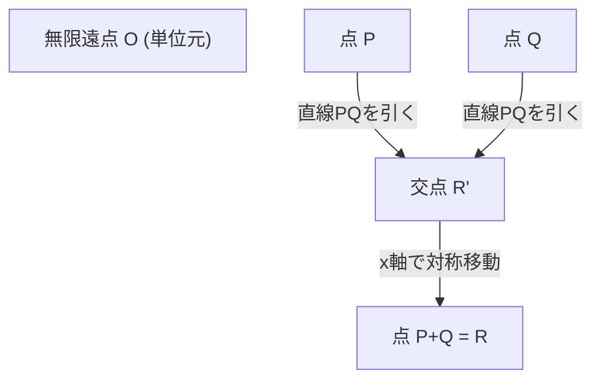
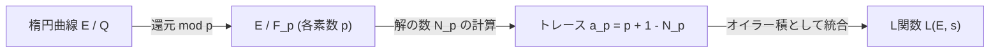

## 1. はじめに：ミレニアム懸賞問題と数論の未解決問題

現代数学において最も重要で、かつ最も美しく深い謎の一つが **バーチ・スウィンナートン＝ダイアー予想** （Birch and Swinnerton-Dyer Conjecture、以下 **BSD予想** ）です。2000年にクレイ数学研究所が発表した7つの「ミレニアム懸賞問題」の一つにも選ばれており、解決者には100万ドルの賞金が与えられます。

BSD予想は、代数幾何学と整数論が交差する「数論幾何学」という分野に属しています。大まかに言えば、この予想は「楕円曲線の有理点の数が無限個あるかどうかは、その楕円曲線から定まる複素関数（L関数）の $s=1$ における振る舞いを見ればわかる」という驚くべき主張をしています。局所的な情報（素数を法とする解の数）を集めることで、大域的な情報（有理数解の構造）が完全に決定されるという、数学のロマンを体現したような予想なのです。

本記事では、BSD予想が何を意味しているのかを理解するために、楕円曲線の基礎から出発し、[モーデル](https://kenji.blog/p/mordell/)の定理、L関数の定義、そしてBSD予想の正確な主張（弱予想と強予想）まで、詳細かつ厳密に解説していきます。さらに、合同数問題との関連や[ガロア](https://kenji.blog/p/galois/)コホモロジーによる背景など、高度なトピックにも踏み込んでいきます。

## 2. 楕円曲線とは何か：代数幾何学の宝石

BSD予想の主役は **楕円曲線** （Elliptic Curve）です。「楕円」という名前がついていますが、幾何学的な図形としての楕円とは直接の関係はありません。楕円曲線の弧長を計算する際に現れる「楕円積分」の逆関数を研究する過程で発見されたため、この名前がついています。

### 2.1. ワイエルシュトラスの標準形

有理数体 $\mathbb{Q}$ 上の楕円曲線 $E$ は、一般に次の形の三次方程式（ワイエルシュトラスの標準形）で定義される非特異な射影代数曲線として表すことができます。

$$
E: y^2 = x^3 + ax + b \quad (a, b \in \mathbb{Q})
$$

ここで「非特異（non-singular）」であるとは、曲線上に尖点（カスプ）や自己交差点（ノード）がないことを意味します。この条件は、判別式 $\Delta$ を用いて次のように表されます。

$$
\Delta = -16(4a^3 + 27b^2) \neq 0
$$

幾何学的には、この曲線は複素数体 $\mathbb{C}$ 上で考えると、トーラス（ドーナツ型）の形をしています。このことは、ワイエルシュトラスの $\wp$ 関数を用いた複素トーラス $\mathbb{C}/\[Lambda](https://kenji.blog/p/serverless-architecture-aws-lambda-cold-start/)$（$\Lambda$ は格子）との同型対応から示されます。

### 2.2. 有理点と群構造

楕円曲線の最も驚くべき性質の一つは、その上の点たちに対して「足し算」が定義できることです。これは弦接線法（chord and tangent method）と呼ばれます。

曲線上の2点 $P, Q$ に対して加法 $P + Q$ を次のように定義します。
1. $P$ と $Q$ を通る直線 $L$ を引きます（$P=Q$ の場合はその点での接線を引く）。
2. ベズーの定理により、三次曲線 $E$ と直線 $L$ は（重複度を込めて）必ず3つの交点を持ちます。その3つ目の交点を $R'$ とします。
3. $R'$ を $x$ 軸について対称移動させた点を $R$ とし、これを $P + Q$ と定義します。

無限遠点 $\mathcal{O}$ を零元（単位元）とすることで、楕円曲線 $E$ 上の点は[アーベル](https://kenji.blog/p/abel/)群をなします。特に、有理数体 $\mathbb{Q}$ 上で定義された楕円曲線の有理点（座標 $x, y$ がともに有理数である点）全体の集合 $E(\mathbb{Q})$ は、この加法について部分群となります。

有理点を見つける問題は、古くから[ディオファントス](https://kenji.blog/p/diophantus/)方程式の主要な問題として研究されてきました。有理点の集合がどのような構造を持っているのか、その全貌を明らかにすることが最大の目標となります。

## 3. [モーデル](https://kenji.blog/p/mordell/)の定理とランク（階数）

1922年、ルイス・[モーデル](https://kenji.blog/p/mordell/)（[Louis Mordell](https://kenji.blog/p/mordell/)）は有理点群 $E(\mathbb{Q})$ の構造に関する決定的な定理を証明しました。のちにアンドレ・[ヴェイユ](https://kenji.blog/p/weil/)（[André Weil](https://kenji.blog/p/weil/)）がより一般の代数体と[アーベル](https://kenji.blog/p/abel/)多様体へと拡張し、[モーデル](https://kenji.blog/p/mordell/)・[ヴェイユ](https://kenji.blog/p/weil/)の定理として知られています。

### 3.1. [モーデル](https://kenji.blog/p/mordell/)の定理 (Mordell's Theorem)

**定理（[モーデル](https://kenji.blog/p/mordell/)、1922年）**
楕円曲線 $E$ の有理点群 $E(\mathbb{Q})$ は有限生成[アーベル](https://kenji.blog/p/abel/)群である。

代数学の有限生成[アーベル](https://kenji.blog/p/abel/)群の基本定理によれば、$E(\mathbb{Q})$ は次のような同型を持ちます。

$$
E(\mathbb{Q}) \cong E(\mathbb{Q})_{\text{tors}} \oplus \mathbb{Z}^r
$$

ここで、
- $E(\mathbb{Q})_{\text{tors}}$ は **トーション部分群** （ねじれ部分群）と呼ばれ、有限位数の点（何回か足すと無限遠点 $\mathcal{O}$ になる点）全体からなる有限群です。バリー・メイザー（Barry Mazur）の定理（1977年）により、有理数体上の楕円曲線においてトーション部分群が取りうる構造はわずか15種類しかないことが完全に分類されています。具体的には、$\mathbb{Z}/N\mathbb{Z}$ ($1 \le N \le 10, N=12$) または $\mathbb{Z}/2\mathbb{Z} \oplus \mathbb{Z}/2N\mathbb{Z}$ ($1 \le N \le 4$) のいずれかです。
- $r$ は非負の整数であり、 **ランク（階数）** と呼ばれます。
- $\mathbb{Z}^r$ は無限位数の点（何度足しても $\mathcal{O}$ にならない点）から生成される自由[アーベル](https://kenji.blog/p/abel/)群です。

### 3.2. ランク $r$ の意味と困難さ

ランク $r$ は、「実質的に独立な無限位数の点がいくつあるか」を表す重要な不変量です。
- $r = 0$ ならば、$E(\mathbb{Q})$ は有限群となり、有理点は有限個しか存在しません。
- $r \ge 1$ ならば、$E(\mathbb{Q})$ は無限個の有理点を持ちます。

トーション部分群はNagell-Lutzの定理などを用いてアルゴリズム的に容易に計算・決定できます。しかし、**ランク $r$ を決定する一般的なアルゴリズムは現在に至るまで知られていません。**

降下法（descent）と呼ばれる手法で特定の方程式のランクを計算することは可能ですが、テイト・シャファレヴィッチ群の非自明な元が障害となり、アルゴリズムが必ず停止するという保証がないのです。ある特定の楕円曲線に対してランクを計算することは可能であっても、すべての楕円曲線に対して確実に停止してランクを出力する手順が存在するかどうか（決定可能性）すら未解決です。

BSD予想は、まさにこの「計算が極めて困難な大域的情報であるランク $r$ 」を、「局所的な情報から計算可能な解析的対象」に結びつける予想なのです。

## 4. 局所から大域へ：[ハッセ](https://kenji.blog/p/hasse/)・[ヴェイユ](https://kenji.blog/p/weil/) L関数

有理数全体で方程式の解を見つけるのが難しい場合、数論ではしばしば「素数 $p$ を法とする（modulo $p$）」有限体 $\mathbb{F}_p$ 上での解の数を考えます。これを局所的な情報と呼びます。

### 4.1. 有限体上の解の数

楕円曲線 $E: y^2 = x^3 + ax + b$ を素数 $p$ で還元し、合同式
$$ y^2 \equiv x^3 + ax + b \pmod p $$
の解の数（無限遠点も含める）を $N_p$ とします。

直感的には、$x \pmod p$ は $p$ 通りの値をとり、$y^2$ に等しくなる確率はおよそ $1/2$（平方剰余であれば2個、非剰余なら0個）であるため、解の数 $N_p$ はおよそ $p$ 個（無限遠点を含めて $p+1$ 個）になると期待されます。この予想値からの「ずれ」を $a_p$ と定義します。

$$
a_p = p + 1 - N_p
$$

[ハッセ](https://kenji.blog/p/hasse/)の定理（Hasse's bound）によれば、このずれは $|a_p| \le 2\sqrt{p}$ で抑えられることが知られています。これは、有限体上の楕円曲線に対する[リーマン予想](https://kenji.blog/p/riemann-hypothesis/)の類似の一種です。

### 4.2. L関数の定義

これらの局所的な情報 $a_p$ をすべての素数 $p$ について集め、一つの解析的な関数を構成します。これが **[ハッセ](https://kenji.blog/p/hasse/)・[ヴェイユ](https://kenji.blog/p/weil/) L関数** （Hasse-Weil L-function） $L(E, s)$ です。
複素数 $s$ に対して、[オイラー](https://kenji.blog/p/euler/)積を用いて次のように定義されます。

$$
L(E, s) = \prod_{p \mid \Delta} (1 - a_p p^{-s})^{-1} \prod_{p \nmid \Delta} (1 - a_p p^{-s} + p^{1-2s})^{-1}
$$
（ここで前者の積は「悪い還元（bad reduction）」をもつ素数、後者は「良い還元（good reduction）」をもつ素数にわたる積です。悪い還元の場合、$a_p$ は還元のタイプに応じて $1, -1, 0$ のいずれかを取ります。）

この無限積は[ハッセ](https://kenji.blog/p/hasse/)の境界を用いることで $\mathrm{Re}(s) > \frac{3}{2}$ の領域で絶対収束することが示されます。

### 4.3. 解析接続とモジュラリティ定理

BSD予想を述べる上で決定的に重要なのは、$L(E, s)$ を全複素平面へ解析接続できるか、という問題です。特に、後述するように $s=1$ における振る舞いが知りたいのですが、定義式の積は $s=1$ では収束しません。

この問題は、2001年に完全に証明された **モジュラリティ定理** （旧 谷山・志村予想）によって解決されました。[アンドリュー・ワイルズ](https://kenji.blog/p/wiles/)、リチャード・テイラー、クリストフ・ブロイル、ブライアン・コンラッド、フレッド・ダイアモンドらの壮大な業績により、「すべての有理数体上の楕円曲線はモジュラーである」ことが示されました。

モジュラーであるとは、$L(E, s)$ がある重さ2のモジュラー形式 $f$ のL関数 $L(f, s)$ と完全に一致することを意味します。モジュラー形式のL関数はヘッケの理論により全複素平面へ解析接続され、次のような関数等式を満たします。

$$
\[Lambda](https://kenji.blog/p/serverless-architecture-aws-lambda-cold-start/)(E, s) = (2\pi)^{-s} N^{s/2} \Gamma(s) L(E, s)
$$
$$
\Lambda(E, 2-s) = w \Lambda(E, s)
$$

ここで $N$ は導手（conductor）と呼ばれる整数で、$w \in \{1, -1\}$ は符号（ルートナンバー）です。
この解析接続により、$s=1$ における $L(E, s)$ の値やテイラー展開を議論することが数学的に正当化されます。

## 5. バーチ・スウィンナートン＝ダイアー予想

1960年代初頭、ブライアン・バーチとピーター・スウィンナートン＝ダイアーは、ケンブリッジ大学の初期のコンピュータ（EDSAC 2）を用いて、多数の楕円曲線の $N_p$ を計算し、$L(E, 1)$ に相当する無限積の振る舞いを実験的に調べました。

もし有理点が多い（ランク $r$ が大きい）ならば、各素数 $p$ を法としても解の数 $N_p$ が大きくなる傾向があるはずです。すると $a_p = p + 1 - N_p$ は負の方向に大きくなり、[オイラー](https://kenji.blog/p/euler/)積の項 $(1 - a_p p^{-1} + p^{-1})^{-1}$ は小さくなるため、$s=1$ における L関数の値は $0$ に近づくはずです。

このコンピュータ実験に基づく洞察から、数学史に燦然と輝く予想が誕生しました。

### 5.1. BSD予想（弱予想）

**バーチ・スウィンナートン＝ダイアー予想（弱）**
有理数体 $\mathbb{Q}$ 上の楕円曲線 $E$ のランク（階数） $r$ は、そのL関数 $L(E, s)$ の $s=1$ における零点の位数に等しい。

すなわち、テイラー展開を考えたとき、
$$
L(E, s) = c(s-1)^r + \text{higher order terms} \quad (c \neq 0)
$$
となる、という主張です。この零点の位数を **解析的ランク** と呼びます。

この予想は驚天動地です。左辺（あるいは右辺）の「零点の位数」は純粋に解析的・局所的な情報から定まる値です。一方、右辺（左辺）の「ランク $r$ 」は代数的・大域的な有理点の構造を表す値です。全く異なる世界に属する2つの量が完全に一致するというのです。

特に $r=0$ の場合と $r \ge 1$ の場合を考えると、
- $L(E, 1) \neq 0 \iff E(\mathbb{Q})$ の有理点は有限個
- $L(E, 1) = 0 \iff E(\mathbb{Q})$ の有理点は無限個
となります。

### 5.2. BSD予想（強予想）

さらに彼らは、先ほどのテイラー展開における最初の非零係数 $c$ （つまり $L^{(r)}(E, 1) / r!$）が、楕円曲線の様々な数論的不変量を用いて極めて美しい公式で記述できると予想しました。これが **BSD強予想** です。

$$
\lim_{s \to 1} \frac{L(E, s)}{(s-1)^r} = \frac{\Omega_E \cdot \mathrm{Reg}(E) \cdot |\text{Sha}(E)| \cdot \prod_{p} c_p}{|E(\mathbb{Q})_{\text{tors}}|^2}
$$

この公式に登場する不変量は以下の通りです。
1. **$\Omega_E$ (実周期)** : 楕円曲線の実数体上での積分 $\int_{E(\mathbb{R})} \frac{dx}{|2y + a_1x + a_3|}$ から定まる超越数。
2. **$\mathrm{Reg}(E)$ (レギュレータ)** : ランク $r$ の無限位数の有理点の生成元 $P_1, \dots, P_r$ に対し、ネロン・テイト高さペアリング（Néron-Tate height pairing） $\langle P_i, P_j \rangle$ を並べた $r \times r$ 行列の行列式。点の「大きさ」を測る指標です。
3. **$|E(\mathbb{Q})_{\text{tors}}|$** : トーション部分群の位数。
4. **$c_p$ (玉河数)** : 悪い還元をもつ素数 $p$ に対する局所的な補正係数。局所体の[ガロア](https://kenji.blog/p/galois/)群の作用から計算されます。
5. **$\text{Sha}(E)$ (テイト・シャファレヴィッチ群、$\text{\textcyrillic{Sh}}$)** : 極めて重要な対象なので後述します。

この公式は、19世紀のディリクレの類数公式（Dirichlet's class number formula）
$$
\lim_{s \to 1} (s-1)\zeta_K(s) = \frac{2^{r_1} (2\pi)^{r_2} h_K R_K}{w_K \sqrt{|D_K|}}
$$
を楕円曲線へと一般化した究極の形態とみなすことができます。デデキントのゼータ関数における類数 $h_K$ が $\text{Sha}(E)$ に、単数群のレギュレータ $R_K$ が楕円曲線のレギュレータ $\mathrm{Reg}(E)$ に対応しています。

### 5.3. 謎の群「Sha (Ш)」と[ガロア](https://kenji.blog/p/galois/)コホモロジー

公式の中で最も神秘的で難解な対象が、テイト・シャファレヴィッチ群 $\text{Sha}(E)$ （キリル文字の $\text{\textcyrillic{Sh}}$ で表される）です。

局所・大域原理（[ハッセ](https://kenji.blog/p/hasse/)の原理）とは、「すべての方程式が有理数体（大域）で解を持つための必要十分条件は、すべての素数 $p$ について $p$ 進数体（局所）で解を持ち、かつ実数体でも解を持つことである」という原理です。二次形式に対してはこの原理が成り立ちます（[ハッセ](https://kenji.blog/p/hasse/)・ミンコフスキーの定理）。
しかし、楕円曲線（三次曲線）に対してはこの原理は成り立ちません。「局所的にはすべて解を持つのに、大域的には解を持たない」という現象が起こり得ます。

$\text{Sha}(E)$ は、この「局所・大域原理の失敗」を[ガロア](https://kenji.blog/p/galois/)コホモロジーを用いて測る群です。厳密には以下のように定義されます。

$$
\text{Sha}(E) = \ker \left( H^1(G_{\mathbb{Q}}, E) \to \prod_{v} H^1(G_{\mathbb{Q}_v}, E) \right)
$$

ここで $G_{\mathbb{Q}}$ は絶対[ガロア](https://kenji.blog/p/galois/)群、積はすべての素点（有理素数と無限素点）にわたります。
BSD強予想は、「任意の楕円曲線において $\text{Sha}(E)$ は有限群である」という暗黙の前提を含んでいます。しかし、現在に至るまで、一般の楕円曲線に対して $\text{Sha}(E)$ が有限であることすら証明されていません。カール・ルービン（Karl Rubin）らによる虚数乗法を持つ曲線に関する結果などを除き、$\text{Sha}(E)$ の本質的な理解は現代数論の最大の課題の一つです。

## 6. 合同数問題との関係

BSD予想の応用として非常に有名なのが **合同数問題（Congruent number problem）** です。「ある自然数 $n$ が、すべての辺の長さが有理数であるような直角三角形の面積となり得るか？」という問題です。面積となり得る $n$ を合同数と呼びます。例えば $n=5, 6, 7$ は合同数ですが、$n=1, 2, 3$ は合同数ではありません。

実は、$n$ が合同数であることは、特定の楕円曲線
$$ E_n: y^2 = x^3 - n^2 x $$
が無限個の有理点を持つこと（つまりランク $r \ge 1$ であること）と同値であることが知られています。

もし弱BSD予想が正しいと仮定すると、トンネル（Tunnell）の定理（1983年）により、$n$ が合同数であるための条件が、単純な二次形式の解の個数に関する初等的な判定条件へと帰着されます。このように、BSD予想は数千年来の古典的な整数論の問題にも完全な解答を与え得る力を持っています。

## 7. 現在の進展と未解決の壁

BSD予想はミレニアム懸賞問題に選ばれている通り、完全な証明には至っていません。しかし、いくつかの重要な部分的な結果が得られています。

### 7.1. ランク $r \le 1$ の場合

驚くべきことに、解析的ランク（$L(E,s)$ の $s=1$ での零点の位数）が 0 または 1 の場合には、BSD予想の大部分が正しいことが証明されています。

- **グロス・ザギエの定理 (Gross-Zagier, 1986)** :
  解析的ランクが 1 の場合、$L(E,s)$ の $s=1$ における一次微分係数が、モジュラー曲線上の特別な点から構成される「ヒーグナー点（Heegner point）」のネロン・テイト高さと比例関係にあることを示しました。ヒーグナー点の高さが非ゼロであることから、代数的ランクが 1 以上であることを証明しました。
- **コリヴァギンの定理 (Kolyvagin, 1989)** :
  [オイラー](https://kenji.blog/p/euler/)系（Euler system）という強力な[ガロア](https://kenji.blog/p/galois/)コホモロジーの手法を構築し、解析的ランクが 0 または 1 の場合、代数的ランクと一致すること、さらにそのときに限りテイト・シャファレヴィッチ群 $\text{Sha}(E)$ が有限群になることを証明しました。

これらの業績により、「解析的ランクが 0 または 1 の楕円曲線に対しては、弱BSD予想は真である」ことが確定しています。

### 7.2. ランク $r \ge 2$ の高い壁

一方で、解析的ランクが 2 以上の楕円曲線に対しては、驚くほど何も分かっていません。
代数的ランクが 2 であることが分かっている特定の曲線についてすら、解析的ランクが 2 であることを（コンピュータによる近似計算ではなく）厳密に証明できた例はありません。
また、ランク 2 以上の場合における[オイラー](https://kenji.blog/p/euler/)系のような有理点を構成するための系統的なメカニズムも見つかっておらず、現代数学の大きな壁として立ちはだかっています。

2010年代以降、マンジュル・バルガヴァ（Manjul Bhargava）やアリル・シャンカル（Arul Shankar）らの研究により、**「すべての楕円曲線のうち、少なくとも66%はBSD予想を満たす」**という驚異的な統計結果が得られています。これは、彼らがランク0とランク1の曲線が全体の大多數を占めること（アベレージランクが有界であること）を示したためです。これにより、BSD予想は少なくとも確率論的・統計的観点からは極めて尤もらしいことが裏付けられました。

## 8. まとめ

バーチ・スウィンナートン＝ダイアー予想は、楕円曲線という代数幾何学の対象と、L関数という解析学の対象を、整数論を通じて見事に結びつける壮大な予想です。

- **代数と幾何の融合**: 方程式の有理数解の群構造（ランクとトーション）。
- **解析の世界**: 素数を法とする解の数から作られるL関数の零点。
- **深い謎**: それらが完全に一致し、さらにその係数が数論的な不変量（特に謎多き $\text{Sha}(E)$）で記述される。

BSD予想が完全に解明された暁には、[ディオファントス](https://kenji.blog/p/diophantus/)方程式の有理数解の理解に究極のブレイクスルーがもたらされるだけでなく、関数体上の類似（アルティン・テイト予想）や、数学の諸分野を統合する「ラングランズ・プログラム」などのより広範なモチヴィックL関数理論の根幹を支える確固たる土台となるでしょう。

人類の知性がこの深い森を完全に踏破し、大域的ランク2以上の世界に対する新たな「眼」を獲得する日が待ち望まれています。

---
*本記事は、高度な数学的トピックを解説する目的で作成されました。数式が多く含まれますが、数論幾何学の美しさを少しでも感じていただければ幸いです。ご質問や議論はコメント欄でお待ちしております。*
