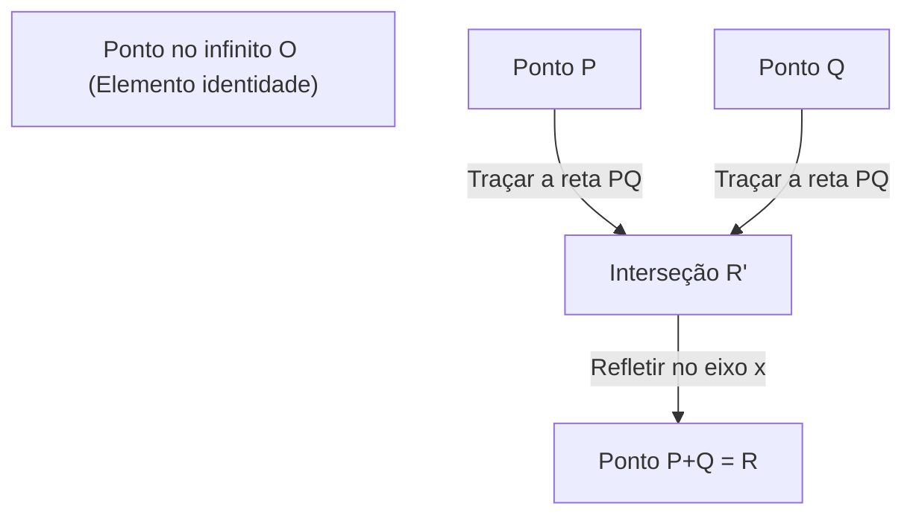
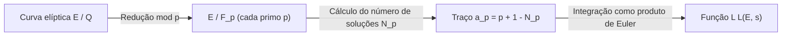

## 1. Introdução: Problemas do Prêmio Millennium e Problemas Não Resolvidos na Teoria dos Números

Na matemática moderna, um dos mistérios mais importantes, belos e profundos é a **Conjectura de Birch e Swinnerton-Dyer** (daqui em diante, **Conjectura de BSD**). Ela foi selecionada como um dos sete "Problemas do Prêmio Millennium" anunciados pelo Clay Mathematics Institute no ano 2000, com um prêmio de 1 milhão de dólares para quem a resolver.

A Conjectura de BSD pertence ao campo da "geometria aritmética", onde a geometria algébrica e a teoria dos números se cruzam. Grosso modo, a conjectura faz uma afirmação surpreendente de que "para saber se há um número infinito de pontos racionais em uma curva elíptica, basta observar o comportamento da função complexa (função L) determinada a partir dessa curva elíptica em $s=1$". Ao reunir informações locais (o número de soluções módulo números primos), a informação global (a estrutura das soluções racionais) é completamente determinada. É uma conjectura que encarna o romance da matemática.

Neste artigo, a fim de compreender o significado da Conjectura de BSD, partiremos dos fundamentos das curvas elípticas e explicaremos o Teorema de Mordell, a definição da função L, e a afirmação exata da Conjectura de BSD (a conjectura fraca e a conjectura forte) de forma detalhada e rigorosa. Além disso, aprofundaremos em tópicos avançados como sua relação com o problema dos números congruentes e o contexto envolvendo cohomologia de Galois.

## 2. O que é uma Curva Elíptica: A Joia da Geometria Algébrica

O protagonista da Conjectura de BSD é a **Curva Elíptica** (Elliptic Curve). Embora tenha "elíptica" no nome, não há uma relação direta com a elipse como figura geométrica. Esse nome se deve ao fato de que foram descobertas no processo de estudo das funções inversas das "integrais elípticas" que aparecem ao calcular o comprimento do arco de uma elipse.

### 2.1. Forma Padrão de Weierstrass

Uma curva elíptica $E$ sobre o corpo dos números racionais $\mathbb{Q}$ geralmente pode ser expressa como uma curva algébrica projetiva não-singular definida por uma equação cúbica (forma padrão de Weierstrass) da seguinte forma:

$$
E: y^2 = x^3 + ax + b \quad (a, b \in \mathbb{Q})
$$

Aqui, "não-singular" (non-singular) significa que não há cúspides (cusps) ou pontos de autointerseção (nodes) na curva. Esta condição é expressa usando o discriminante $\Delta$ da seguinte maneira:

$$
\Delta = -16(4a^3 + 27b^2) \neq 0
$$

Geometricamente, se considerarmos esta curva sobre o corpo dos números complexos $\mathbb{C}$, ela tem o formato de um toro (forma de rosquinha). Isso é demonstrado através do isomorfismo com o toro complexo $\mathbb{C}/\Lambda$ ($\Lambda$ é um reticulado) usando a função $\wp$ de Weierstrass.

### 2.2. Pontos Racionais e Estrutura de Grupo

Uma das propriedades mais surpreendentes das curvas elípticas é que a "adição" pode ser definida para os pontos sobre ela. Isso é chamado de método da corda e tangente (chord and tangent method).

Para dois pontos $P, Q$ na curva, a adição $P + Q$ é definida da seguinte forma:
1. Trace a reta $L$ que passa por $P$ e $Q$ (se $P=Q$, trace a tangente naquele ponto).
2. Pelo teorema de Bézout, a curva cúbica $E$ e a reta $L$ sempre terão (contando as multiplicidades) exatamente 3 pontos de interseção. Seja $R'$ esse terceiro ponto de interseção.
3. Seja $R$ o ponto refletido de $R'$ em relação ao eixo $x$, e defina isso como $P + Q$.

Ao assumir o ponto no infinito $\mathcal{O}$ como o elemento zero (elemento identidade), os pontos na curva elíptica $E$ formam um grupo abeliano. Em particular, o conjunto $E(\mathbb{Q})$ de todos os pontos racionais (pontos cujas coordenadas $x, y$ são ambas números racionais) da curva elíptica definida sobre o corpo dos números racionais $\mathbb{Q}$ torna-se um subgrupo sob esta adição.

O problema de encontrar pontos racionais tem sido estudado desde a antiguidade como o principal problema das equações diofantinas. Revelar o quadro completo de qual estrutura o conjunto de pontos racionais possui torna-se o maior objetivo.

## 3. Teorema de Mordell e o Posto (Rank)

Em 1922, Louis Mordell provou um teorema decisivo sobre a estrutura do grupo de pontos racionais $E(\mathbb{Q})$. Mais tarde, André Weil o estendeu para corpos de números e variedades abelianas mais gerais, ficando conhecido como o Teorema de Mordell-Weil.

### 3.1. Teorema de Mordell (Mordell's Theorem)

**Teorema (Mordell, 1922)**
O grupo de pontos racionais $E(\mathbb{Q})$ de uma curva elíptica $E$ é um grupo abeliano finitamente gerado.

De acordo com o teorema fundamental dos grupos abelianos finitamente gerados da álgebra, $E(\mathbb{Q})$ possui o seguinte isomorfismo:

$$
E(\mathbb{Q}) \cong E(\mathbb{Q})_{\text{tors}} \oplus \mathbb{Z}^r
$$

Aqui,
- $E(\mathbb{Q})_{\text{tors}}$ é chamado de **subgrupo de torção** (torsion subgroup), um grupo finito que consiste em todos os pontos de ordem finita (pontos que, se adicionados algumas vezes, resultam no ponto no infinito $\mathcal{O}$). Pelo teorema de Barry Mazur (1977), as estruturas possíveis que um subgrupo de torção pode assumir em uma curva elíptica sobre o corpo dos números racionais foram completamente classificadas em apenas 15 tipos. Especificamente, é $\mathbb{Z}/N\mathbb{Z}$ ($1 \le N \le 10, N=12$) ou $\mathbb{Z}/2\mathbb{Z} \oplus \mathbb{Z}/2N\mathbb{Z}$ ($1 \le N \le 4$).
- $r$ é um número inteiro não negativo e é chamado de **posto** (rank).
- $\mathbb{Z}^r$ é um grupo abeliano livre gerado a partir de pontos de ordem infinita (pontos que nunca se tornam $\mathcal{O}$ não importa quantas vezes sejam somados).

### 3.2. O Significado e a Dificuldade do Posto $r$

O posto $r$ é um importante invariante que expressa "quantos pontos de ordem infinita independentes existem efetivamente".
- Se $r = 0$, então $E(\mathbb{Q})$ é um grupo finito, e há apenas um número finito de pontos racionais.
- Se $r \ge 1$, então $E(\mathbb{Q})$ tem um número infinito de pontos racionais.

O subgrupo de torção pode ser facilmente calculado e determinado algoritmicamente utilizando o teorema de Nagell-Lutz. No entanto, **não se conhece nenhum algoritmo geral para determinar o posto $r$ até hoje.**

É possível calcular o posto de equações específicas pelo método chamado de descida (descent), mas os elementos não triviais do grupo de Tate-Shafarevich tornam-se obstáculos, de modo que não há garantia de que o algoritmo vá sempre parar. Mesmo se for possível calcular o posto para uma curva elíptica específica, ainda está em aberto se existe (decidibilidade) um procedimento que garantidamente pare e retorne o posto para todas as curvas elípticas.

A Conjectura de BSD conecta exatamente esta "informação global extremamente difícil de calcular, o posto $r$" a um "objeto analítico calculável a partir de informações locais".

## 4. Do Local para o Global: A Função L de Hasse-Weil

Quando é difícil encontrar soluções de equações sobre todos os números racionais, a teoria dos números muitas vezes considera o número de soluções em um corpo finito $\mathbb{F}_p$ "módulo o número primo $p$" (modulo $p$). Isso é chamado de informação local.

### 4.1. O Número de Soluções em um Corpo Finito

Reduzindo a curva elíptica $E: y^2 = x^3 + ax + b$ por um número primo $p$, seja $N_p$ o número de soluções (incluindo o ponto no infinito) da congruência:
$$ y^2 \equiv x^3 + ax + b \pmod p $$

Intuitivamente, $x \pmod p$ toma $p$ valores, e a probabilidade de ser igual a $y^2$ é cerca de $1/2$ (2 se for um resíduo quadrático, 0 se não for), portanto espera-se que o número de soluções $N_p$ seja cerca de $p$ (com o ponto no infinito, $p+1$). O "desvio" desse valor esperado é definido como $a_p$.

$$
a_p = p + 1 - N_p
$$

De acordo com o limite de Hasse (Hasse's bound), sabe-se que este desvio é limitado por $|a_p| \le 2\sqrt{p}$. Isso é uma espécie de análogo à hipótese de Riemann para curvas elípticas sobre corpos finitos.

### 4.2. Definição da Função L

Essas informações locais $a_p$ são reunidas para todos os números primos $p$ para compor uma única função analítica. Esta é a **Função L de Hasse-Weil** (Hasse-Weil L-function) $L(E, s)$.
Para o número complexo $s$, ela é definida utilizando o produto de Euler da seguinte forma:

$$
L(E, s) = \prod_{p \mid \Delta} (1 - a_p p^{-s})^{-1} \prod_{p \nmid \Delta} (1 - a_p p^{-s} + p^{1-2s})^{-1}
$$
(Aqui, o primeiro produto abrange os números primos com "má redução" (bad reduction), e o segundo abrange os números primos com "boa redução" (good reduction). Em caso de má redução, $a_p$ assume um dos valores $1, -1, 0$, dependendo do tipo de redução.)

Usando o limite de Hasse, mostra-se que este produto infinito converge absolutamente na região $\mathrm{Re}(s) > \frac{3}{2}$.

### 4.3. Continuação Analítica e o Teorema de Modularidade

Crucial para enunciar a Conjectura de BSD é a questão de se $L(E, s)$ pode ser analiticamente continuada para todo o plano complexo. Em particular, como veremos depois, queremos saber seu comportamento em $s=1$, mas o produto na sua fórmula de definição não converge em $s=1$.

Esse problema foi resolvido pelo **Teorema da Modularidade** (antiga Conjectura de Taniyama-Shimura), completamente provado em 2001. Através do trabalho monumental de Andrew Wiles, Richard Taylor, Christophe Breuil, Brian Conrad e Fred Diamond, foi demonstrado que "todas as curvas elípticas sobre o corpo dos números racionais são modulares".

Ser modular significa que $L(E, s)$ coincide perfeitamente com a função L $L(f, s)$ de uma forma modular $f$ de peso 2. A função L de uma forma modular é analiticamente continuada para todo o plano complexo pela teoria de Hecke, e satisfaz a seguinte equação funcional:

$$
\Lambda(E, s) = (2\pi)^{-s} N^{s/2} \Gamma(s) L(E, s)
$$
$$
\Lambda(E, 2-s) = w \Lambda(E, s)
$$

Aqui, $N$ é um número inteiro chamado de condutor (conductor), e $w \in \{1, -1\}$ é o sinal (root number).
Essa continuação analítica justifica matematicamente discutir o valor de $L(E, s)$ ou a expansão de Taylor em $s=1$.

## 5. Conjectura de Birch e Swinnerton-Dyer

No início dos anos 1960, Brian Birch e Peter Swinnerton-Dyer usaram um dos primeiros computadores da Universidade de Cambridge (EDSAC 2) para calcular $N_p$ para muitas curvas elípticas e investigar experimentalmente o comportamento do produto infinito que corresponde a $L(E, 1)$.

Se houver muitos pontos racionais (se o posto $r$ for grande), o número de soluções $N_p$ módulo cada primo $p$ também deverá tender a ser grande. Assim, $a_p = p + 1 - N_p$ torna-se cada vez mais negativo, o termo do produto de Euler $(1 - a_p p^{-1} + p^{-1})^{-1}$ se torna pequeno, de forma que o valor da função L em $s=1$ deveria se aproximar de $0$.

Deste insight baseado em experimentos computacionais, nasceu uma conjectura que brilha na história da matemática.

### 5.1. Conjectura de BSD (Conjectura Fraca)

**Conjectura de Birch e Swinnerton-Dyer (Fraca)**
O posto $r$ de uma curva elíptica $E$ sobre o corpo dos números racionais $\mathbb{Q}$ é igual à ordem do zero de sua função L $L(E, s)$ em $s=1$.

Ou seja, quando consideramos a expansão de Taylor,
$$
L(E, s) = c(s-1)^r + \text{termos de ordem superior} \quad (c \neq 0)
$$
é o que é reivindicado. Esta ordem de zero é chamada de **posto analítico**.

Esta conjectura é de abalar a terra. A "ordem do zero" no lado esquerdo (ou direito) é um valor puramente determinado a partir de informações analíticas e locais. Por outro lado, o "posto $r$" do lado direito (esquerdo) é um valor que representa a estrutura algébrica global dos pontos racionais. Duas quantidades que pertencem a mundos completamente diferentes dizem ser perfeitamente idênticas.

Em particular, se considerarmos os casos em que $r=0$ e $r \ge 1$,
- $L(E, 1) \neq 0 \iff E(\mathbb{Q})$ tem um número finito de pontos racionais
- $L(E, 1) = 0 \iff E(\mathbb{Q})$ tem um número infinito de pontos racionais

### 5.2. Conjectura de BSD (Conjectura Forte)

Além disso, eles conjecturaram que o primeiro coeficiente não nulo $c$ (ou seja, $L^{(r)}(E, 1) / r!$) na expansão de Taylor mencionada poderia ser descrito em uma fórmula de beleza suprema usando vários invariantes aritméticos da curva elíptica. Esta é a **Conjectura de BSD Forte**.

$$
\lim_{s \to 1} \frac{L(E, s)}{(s-1)^r} = \frac{\Omega_E \cdot \mathrm{Reg}(E) \cdot |\text{Sha}(E)| \cdot \prod_{p} c_p}{|E(\mathbb{Q})_{\text{tors}}|^2}
$$

Os invariantes que aparecem nesta fórmula são os seguintes:
1. **$\Omega_E$ (Período real)**: Um número transcendental determinado pela integral $\int_{E(\mathbb{R})} \frac{dx}{|2y + a_1x + a_3|}$ da curva elíptica sobre o corpo dos números reais.
2. **$\mathrm{Reg}(E)$ (Regulador)**: O determinante da matriz $r \times r$ contendo os emparelhamentos de altura de Néron-Tate (Néron-Tate height pairing) $\langle P_i, P_j \rangle$ para os geradores $P_1, \dots, P_r$ de pontos racionais de ordem infinita de posto $r$. É um índice que mede o "tamanho" dos pontos.
3. **$|E(\mathbb{Q})_{\text{tors}}|$**: A ordem do subgrupo de torção.
4. **$c_p$ (Números de Tamagawa)**: Fatores de correção local para primos $p$ com má redução. São calculados a partir da ação do grupo de Galois sobre corpos locais.
5. **$\text{Sha}(E)$ (Grupo de Tate-Shafarevich, $\text{\textcyrillic{Sh}}$)**: Abordaremos mais tarde, pois é um objeto de extrema importância.

Esta fórmula pode ser vista como a forma fundamental da fórmula do número de classes de Dirichlet do século 19 (Dirichlet's class number formula)
$$
\lim_{s \to 1} (s-1)\zeta_K(s) = \frac{2^{r_1} (2\pi)^{r_2} h_K R_K}{w_K \sqrt{|D_K|}}
$$
generalizada para curvas elípticas. O número de classes $h_K$ na função zeta de Dedekind corresponde a $\text{Sha}(E)$, e o regulador $R_K$ do grupo de unidades corresponde ao regulador $\mathrm{Reg}(E)$ da curva elíptica.

### 5.3. O Grupo Misterioso "Sha (Ш)" e a Cohomologia de Galois

O objeto mais místico e difícil de entender na fórmula é o grupo de Tate-Shafarevich $\text{Sha}(E)$ (denotado pela letra cirílica $\text{\textcyrillic{Sh}}$).

O princípio local-global (Princípio de Hasse) postula que "a condição necessária e suficiente para que todas as equações tenham uma solução no corpo dos números racionais (global) é que elas tenham uma solução no corpo dos números $p$-ádicos (local) para todos os primos $p$, e que elas também tenham uma solução no corpo dos números reais". Esse princípio é válido para formas quadráticas (Teorema de Hasse-Minkowski).
No entanto, esse princípio não se sustenta para curvas elípticas (curvas cúbicas). O fenômeno de "possuir soluções em todos os lugares localmente, mas não possuir uma solução globalmente" pode ocorrer.

$\text{Sha}(E)$ é o grupo que mede essa "falha do princípio local-global" usando a cohomologia de Galois. A rigor, é definido da seguinte forma:

$$
\text{Sha}(E) = \ker \left( H^1(G_{\mathbb{Q}}, E) \to \prod_{v} H^1(G_{\mathbb{Q}_v}, E) \right)
$$

Aqui, $G_{\mathbb{Q}}$ é o grupo de Galois absoluto, e o produto abrange todos os lugares (primos racionais e o lugar infinito).
A Conjectura Forte de BSD contém a premissa implícita de que "$\text{Sha}(E)$ é um grupo finito para qualquer curva elíptica". No entanto, até os dias atuais, nem sequer foi provado que $\text{Sha}(E)$ é finito para curvas elípticas em geral. Excluindo os resultados relativos a curvas com multiplicação complexa de Karl Rubin e outros, a compreensão essencial de $\text{Sha}(E)$ é um dos maiores desafios da teoria dos números moderna.

## 6. Relação com o Problema dos Números Congruentes

Uma aplicação muito famosa da Conjectura de BSD é o **Problema dos números congruentes (Congruent number problem)**. O problema questiona: "Um número natural $n$ pode ser a área de um triângulo retângulo onde os comprimentos de todos os lados são números racionais?". Tal $n$ que pode ser a área é chamado de número congruente. Por exemplo, $n=5, 6, 7$ são números congruentes, mas $n=1, 2, 3$ não o são.

De fato, sabe-se que o fato de $n$ ser um número congruente é equivalente ao fato de que a curva elíptica específica
$$ E_n: y^2 = x^3 - n^2 x $$
tem um número infinito de pontos racionais (isto é, o posto $r \ge 1$).

Se assumirmos que a conjectura fraca de BSD está correta, através do teorema de Tunnell (1983), a condição para $n$ ser um número congruente se reduz a uma condição elementar de verificação em relação ao número de soluções de formas quadráticas simples. Dessa forma, a Conjectura de BSD tem o poder de fornecer respostas completas também para problemas clássicos da teoria dos números que datam de milhares de anos.

## 7. Progressos Atuais e Barreiras Não Resolvidas

Como foi selecionada para o Prêmio Millennium, a Conjectura de BSD ainda não tem uma prova completa. No entanto, foram alcançados vários resultados parciais importantes.

### 7.1. O Caso do Posto $r \le 1$

Surpreendentemente, no caso de o posto analítico (a ordem do zero de $L(E,s)$ em $s=1$) ser 0 ou 1, a maior parte da Conjectura de BSD foi provada estar correta.

- **Teorema de Gross-Zagier (1986)**:
  Eles mostraram que, quando o posto analítico é 1, a primeira derivada de $L(E,s)$ em $s=1$ é proporcional à altura de Néron-Tate do "Ponto de Heegner" (Heegner point) construído a partir de pontos especiais na curva modular. Devido à altura do ponto de Heegner ser não nula, eles provaram que o posto algébrico é de no mínimo 1.
- **Teorema de Kolyvagin (1989)**:
  Ele desenvolveu uma poderosa técnica de cohomologia de Galois chamada Sistema de Euler (Euler system) e demonstrou que se o posto analítico é 0 ou 1, o posto algébrico o igualará, e, além disso, provou que o grupo de Tate-Shafarevich $\text{Sha}(E)$ torna-se um grupo finito apenas nessas condições.

Devido a esses feitos, está confirmado que "a conjectura fraca de BSD é verdadeira para curvas elípticas cujo posto analítico seja 0 ou 1".

### 7.2. A Grande Barreira do Posto $r \ge 2$

Por outro lado, surpreendentemente quase nada se sabe sobre curvas elípticas onde o posto analítico é 2 ou superior.
Mesmo para curvas específicas que se sabe terem um posto algébrico 2, não há nenhum exemplo onde o fato de o posto analítico ser 2 foi rigorosamente provado (ao invés de ser estimado via computadores).
Além disso, nenhum mecanismo sistemático foi encontrado para construir pontos racionais nestes casos análogos ao Sistema de Euler para postos maiores ou iguais a 2, apresentando-se como uma grande barreira na matemática moderna.

A partir dos anos 2010, através da pesquisa de Manjul Bhargava, Arul Shankar e outros, obteve-se um incrível resultado estatístico de que **"pelo menos 66% de todas as curvas elípticas satisfazem a Conjectura de BSD"**. Isso ocorreu porque eles mostraram que curvas de posto 0 e posto 1 representam a vasta maioria de todas as curvas elípticas (mostrando que o posto médio é limitado). Assim, a Conjectura de BSD tem forte embasamento como altamente plausível, no mínimo, sob uma perspectiva probabilística e estatística.

## 8. Conclusão

A Conjectura de Birch e Swinnerton-Dyer é uma conjectura formidável que brilhantemente une o objeto da geometria algébrica chamado curva elíptica com o objeto da análise chamado função L através da teoria dos números.

- **Fusão entre Álgebra e Geometria**: A estrutura de grupo (posto e torção) de soluções racionais para equações.
- **O Mundo da Análise**: O zero da função L criado a partir do número de soluções módulo primos.
- **Mistério Profundo**: Estes aspectos coincidem perfeitamente, e os coeficientes correspondentes são descritos em termos de invariantes da teoria dos números (particularmente o misterioso $\text{Sha}(E)$).

Quando a Conjectura de BSD for totalmente esclarecida, trará o avanço decisivo não só na compreensão das soluções racionais para equações diofantinas, mas também atuará como uma base firme apoiando inteiramente os fundamentos da teoria da Função L motívica num contexto amplo, assim como suas analogias sobre corpos de funções (Conjectura de Artin-Tate) e o "Programa de Langlands" que visa unificar as diferentes áreas da matemática.

Espera-se o dia em que o intelecto humano explorará completamente este denso bosque e ganhará novos "olhos" para o universo dos postos globais maiores que ou iguais a 2.

---
*Este artigo foi escrito com o propósito de explicar tópicos matemáticos avançados. Contém uma grande quantidade de fórmulas, mas esperamos que você possa sentir a beleza da geometria aritmética. Dúvidas e discussões são sempre bem-vindas na seção de comentários.*
