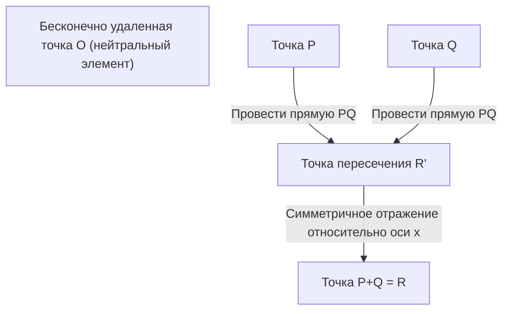

## 1. Введение: Задачи тысячелетия и нерешенные проблемы теории чисел

В современной математике одной из самых важных, красивых и глубоких загадок является **гипотеза Бёрча — Свиннертон-Дайера** (Birch and Swinnerton-Dyer Conjecture, далее **гипотеза BSD**). Она была выбрана Математическим институтом Клэя в 2000 году как одна из семи «Задач тысячелетия», за решение которой назначена награда в 1 миллион долларов.

Гипотеза BSD относится к «арифметической геометрии» — области, где пересекаются алгебраическая геометрия и теория чисел. Грубо говоря, гипотеза утверждает поразительную вещь: «Чтобы узнать, бесконечно ли количество рациональных точек на эллиптической кривой, достаточно посмотреть на поведение комплексной функции (L-функции), определяемой этой кривой, в точке $s=1$». Это гипотеза, воплощающая математическую романтику, в которой сбор локальной информации (количества решений по модулю простых чисел) полностью определяет глобальную информацию (структуру рациональных решений).

В этой статье мы подробно и строго объясним, что означает гипотеза BSD, начав с основ эллиптических кривых, теоремы Морделла, определения L-функции и точной формулировки самой гипотезы (слабой и сильной). Кроме того, мы затронем более сложные темы, такие как связь с проблемой конгруэнтных чисел и предпосылки, основанные на когомологиях Галуа.

## 2. Что такое эллиптическая кривая: жемчужина алгебраической геометрии

Главная героиня гипотезы BSD — **эллиптическая кривая** (Elliptic Curve). Хотя в названии присутствует слово «эллипс», она не имеет прямого отношения к эллипсу как геометрической фигуре. Название возникло потому, что кривые были открыты в процессе изучения функций, обратных «эллиптическим интегралам», возникающим при вычислении длины дуги эллипса.

### 2.1. Нормальная форма Вейерштрасса

Эллиптическая кривая $E$ над полем рациональных чисел $\mathbb{Q}$ в общем случае может быть представлена как неособая проективная алгебраическая кривая, заданная кубическим уравнением следующего вида (нормальная форма Вейерштрасса):

$$
E: y^2 = x^3 + ax + b \quad (a, b \in \mathbb{Q})
$$

Здесь «неособая» (non-singular) означает, что на кривой нет точек возврата (каспов) или точек самопересечения (узлов). Это условие выражается с помощью дискриминанта $\Delta$ следующим образом:

$$
\Delta = -16(4a^3 + 27b^2) \neq 0
$$

Геометрически, если рассматривать эту кривую над полем комплексных чисел $\mathbb{C}$, она имеет форму тора (бублика). Это показывается через изоморфизм с комплексным тором $\mathbb{C}/\Lambda$ ($\Lambda$ — решетка) с использованием $\wp$-функции Вейерштрасса.

### 2.2. Рациональные точки и структура группы

Одно из самых удивительных свойств эллиптических кривых заключается в том, что для точек на них можно определить «сложение». Этот метод называется методом секущих и касательных (chord and tangent method).

Для двух точек $P, Q$ на кривой сложение $P + Q$ определяется следующим образом:
1. Проводим прямую $L$, проходящую через $P$ и $Q$ (если $P=Q$, проводим касательную в этой точке).
2. Согласно теореме Безу, кубическая кривая $E$ и прямая $L$ (с учетом кратности) всегда имеют три точки пересечения. Обозначим третью точку пересечения как $R'$.
3. Точку, симметричную $R'$ относительно оси $x$, обозначим как $R$ и определим её как $P + Q$.

Принимая бесконечно удаленную точку $\mathcal{O}$ за нулевой (нейтральный) элемент, точки на эллиптической кривой $E$ образуют абелеву группу. В частности, множество всех рациональных точек (точек, обе координаты $x, y$ которых являются рациональными числами) эллиптической кривой, определенной над полем рациональных чисел $\mathbb{Q}$, обозначаемое $E(\mathbb{Q})$, образует подгруппу относительно этого сложения.

Проблема нахождения рациональных точек издавна изучалась как главная задача диофантовых уравнений. Выяснение всей картины структуры множества рациональных точек является величайшей целью.

## 3. Теорема Морделла и ранг

В 1922 году [Луис Морделл](https://kenji.blog/ru/p/mordell/) ([Louis Mordell](https://kenji.blog/ru/p/mordell/)) доказал решающую теорему о структуре группы рациональных точек $E(\mathbb{Q})$. Позже [Андре Вейль](https://kenji.blog/ru/p/weil/) ([André Weil](https://kenji.blog/ru/p/weil/)) обобщил её на более общие числовые поля и абелевы многообразия, и она стала известна как теорема Морделла-Вейля.

### 3.1. Теорема Морделла (Mordell's Theorem)

**Теорема (Морделл, 1922 г.)**
Группа рациональных точек $E(\mathbb{Q})$ эллиптической кривой $E$ является конечнопорожденной абелевой группой.

Согласно основной теореме алгебры о конечнопорожденных абелевых группах, $E(\mathbb{Q})$ имеет следующий изоморфизм:

$$
E(\mathbb{Q}) \cong E(\mathbb{Q})_{\text{tors}} \oplus \mathbb{Z}^r
$$

Где:
- $E(\mathbb{Q})_{\text{tors}}$ называется **подгруппой кручения** (torsion subgroup) и представляет собой конечную группу, состоящую из всех точек конечного порядка (точек, которые при сложении несколько раз дают бесконечно удаленную точку $\mathcal{O}$). Согласно теореме Барри Мазура (Barry Mazur, 1977), полностью классифицированы возможные структуры подгруппы кручения для эллиптических кривых над полем рациональных чисел — их всего 15. А именно, это либо $\mathbb{Z}/N\mathbb{Z}$ ($1 \le N \le 10, N=12$), либо $\mathbb{Z}/2\mathbb{Z} \oplus \mathbb{Z}/2N\mathbb{Z}$ ($1 \le N \le 4$).
- $r$ — неотрицательное целое число, называемое **рангом**.
- $\mathbb{Z}^r$ — свободная абелева группа, порожденная точками бесконечного порядка (точками, которые никогда не дадут $\mathcal{O}$, сколько бы их ни складывали).

### 3.2. Значение и сложность ранга $r$

Ранг $r$ — это важный инвариант, выражающий, «сколько существует существенно независимых точек бесконечного порядка».
- Если $r = 0$, то $E(\mathbb{Q})$ является конечной группой, и рациональных точек конечное число.
- Если $r \ge 1$, то $E(\mathbb{Q})$ имеет бесконечное число рациональных точек.

Подгруппу кручения можно легко вычислить алгоритмически, например, используя теорему Нагеля-Лютца. Однако **общего алгоритма для определения ранга $r$ не существует до сих пор.**

Хотя можно вычислить ранг конкретного уравнения с помощью метода спуска (descent), нетривиальные элементы группы Тейта-Шафаревича создают препятствия, и нет гарантии, что алгоритм обязательно остановится. Даже если для конкретной эллиптической кривой можно вычислить ранг, проблема разрешимости того, существует ли вообще процедура, которая гарантированно останавливается и выдает ранг для всех эллиптических кривых, остается нерешенной.

Гипотеза BSD — это именно та гипотеза, которая связывает этот «вычислительно чрезвычайно сложный глобальный параметр — ранг $r$» с «аналитическим объектом, который можно вычислить из локальной информации».

## 4. От локального к глобальному: L-функция Хассе-Вейля

Когда трудно найти решения уравнения во всем множестве рациональных чисел, в теории чисел часто рассматривают количество решений над конечным полем $\mathbb{F}_p$ «по модулю простого числа $p$» (modulo $p$). Это называется локальной информацией.

### 4.1. Количество решений над конечным полем

Приведем эллиптическую кривую $E: y^2 = x^3 + ax + b$ по простому модулю $p$ и пусть $N_p$ — количество решений (включая бесконечно удаленную точку) конгруэнции
$$ y^2 \equiv x^3 + ax + b \pmod p $$

Интуитивно, $x \pmod p$ принимает $p$ различных значений, и вероятность того, что оно равно $y^2$, составляет примерно $1/2$ (2 для квадратичного вычета, 0 для невычета), поэтому ожидается, что количество решений $N_p$ составит примерно $p$ штук (включая бесконечно удаленную точку $p+1$). «Отклонение» от этого ожидаемого значения определяется как $a_p$:

$$
a_p = p + 1 - N_p
$$

Согласно границе Хассе (Hasse's bound), это отклонение ограничено как $|a_p| \le 2\sqrt{p}$. Это своего рода аналог гипотезы Римана для эллиптических кривых над конечными полями.

### 4.2. Определение L-функции

Собрав эту локальную информацию $a_p$ для всех простых чисел $p$, мы строим одну аналитическую функцию. Это **L-функция Хассе-Вейля** (Hasse-Weil L-function) $L(E, s)$.
Для комплексного числа $s$ она определяется с использованием эйлерова произведения следующим образом:

$$
L(E, s) = \prod_{p \mid \Delta} (1 - a_p p^{-s})^{-1} \prod_{p \nmid \Delta} (1 - a_p p^{-s} + p^{1-2s})^{-1}
$$
(Здесь первое произведение берется по простым числам с «плохой редукцией» (bad reduction), а второе — по простым числам с «хорошей редукцией» (good reduction). В случае плохой редукции $a_p$ принимает одно из значений $1, -1, 0$ в зависимости от типа редукции.)

Используя границу Хассе, можно показать, что это бесконечное произведение абсолютно сходится в области $\mathrm{Re}(s) > \frac{3}{2}$.

### 4.3. Аналитическое продолжение и теорема о модулярности

Для формулировки гипотезы BSD критически важен вопрос о том, можно ли аналитически продолжить $L(E, s)$ на всю комплексную плоскость. В частности, как будет описано ниже, мы хотим знать поведение в точке $s=1$, но определяющее произведение не сходится при $s=1$.

Эта проблема была решена благодаря **теореме о модулярности** (ранее известной как гипотеза Таниямы-Симуры), которая была полностью доказана в 2001 году. Грандиозная работа [Эндрю Уайлс](https://kenji.blog/ru/p/wiles/)а, Ричарда Тейлора, Кристофа Брейля, Брайана Конрада и Фреда Даймонда показала, что «все эллиптические кривые над полем рациональных чисел являются модулярными».

Быть модулярной означает, что $L(E, s)$ полностью совпадает с L-функцией $L(f, s)$ некоторой модулярной формы $f$ веса 2. L-функция модулярной формы аналитически продолжается на всю комплексную плоскость согласно теории Гекке и удовлетворяет следующему функциональному уравнению:

$$
\Lambda(E, s) = (2\pi)^{-s} N^{s/2} \Gamma(s) L(E, s)
$$
$$
\Lambda(E, 2-s) = w \Lambda(E, s)
$$

Здесь $N$ — целое число, называемое кондуктором (conductor), а $w \in \{1, -1\}$ — знак (корневое число).
Благодаря этому аналитическому продолжению математически обосновано обсуждение значения и разложения Тейлора для $L(E, s)$ в точке $s=1$.

## 5. Гипотеза Бёрча — Свиннертон-Дайера

В начале 1960-х годов Брайан Бёрч и Питер Свиннертон-Дайер, используя один из первых компьютеров Кембриджского университета (EDSAC 2), вычислили $N_p$ для множества эллиптических кривых и экспериментально исследовали поведение бесконечного произведения, соответствующего $L(E, 1)$.

Если рациональных точек много (ранг $r$ велик), то количество решений $N_p$ по модулю каждого простого числа $p$ также должно иметь тенденцию к увеличению. Тогда $a_p = p + 1 - N_p$ будет становиться все более отрицательным, и член эйлерова произведения $(1 - a_p p^{-1} + p^{-1})^{-1}$ будет становиться меньше, поэтому значение L-функции при $s=1$ должно приближаться к $0$.

Из этой догадки, основанной на компьютерных экспериментах, родилась гипотеза, ярко сияющая в истории математики.

### 5.1. Гипотеза BSD (слабая гипотеза)

**Гипотеза Бёрча — Свиннертон-Дайера (слабая)**
Ранг $r$ эллиптической кривой $E$ над полем рациональных чисел $\mathbb{Q}$ равен порядку нуля ее L-функции $L(E, s)$ в точке $s=1$.

Иными словами, если рассмотреть разложение Тейлора:
$$
L(E, s) = c(s-1)^r + \text{higher order terms} \quad (c \neq 0)
$$
таково утверждение. Этот порядок нуля называется **аналитическим рангом**.

Эта гипотеза поразительна. «Порядок нуля» на левой (или правой) стороне — это значение, определяемое чисто аналитической/локальной информацией. С другой стороны, «ранг $r$» на правой (левой) стороне — это значение, выражающее алгебраическую/глобальную структуру рациональных точек. Две величины, принадлежащие совершенно разным мирам, полностью совпадают.

В частности, рассматривая случаи $r=0$ и $r \ge 1$:
- $L(E, 1) \neq 0 \iff$ число рациональных точек в $E(\mathbb{Q})$ конечно
- $L(E, 1) = 0 \iff$ число рациональных точек в $E(\mathbb{Q})$ бесконечно

### 5.2. Гипотеза BSD (сильная гипотеза)

Кроме того, они предположили, что первый ненулевой коэффициент $c$ (то есть $L^{(r)}(E, 1) / r!$) в вышеупомянутом разложении Тейлора может быть описан чрезвычайно красивой формулой с использованием различных теоретико-числовых инвариантов эллиптической кривой. Это **сильная гипотеза BSD**.

$$
\lim_{s \to 1} \frac{L(E, s)}{(s-1)^r} = \frac{\Omega_E \cdot \mathrm{Reg}(E) \cdot |\text{Sha}(E)| \cdot \prod_{p} c_p}{|E(\mathbb{Q})_{\text{tors}}|^2}
$$

Инварианты, появляющиеся в этой формуле, следующие:
1. **$\Omega_E$ (вещественный период)** : трансцендентное число, определяемое интегралом $\int_{E(\mathbb{R})} \frac{dx}{|2y + a_1x + a_3|}$ на поле вещественных чисел эллиптической кривой.
2. **$\mathrm{Reg}(E)$ (регулятор)** : определитель $r \times r$ матрицы, составленной из высот Нерона-Тейта (Néron-Tate height pairing) $\langle P_i, P_j \rangle$ для генераторов $P_1, \dots, P_r$ точек бесконечного порядка ранга $r$. Это показатель, измеряющий «размер» точек.
3. **$|E(\mathbb{Q})_{\text{tors}}|$** : порядок подгруппы кручения.
4. **$c_p$ (числа Тамагавы)** : локальные поправочные коэффициенты для простых чисел $p$ с плохой редукцией. Вычисляются из действия группы Галуа локального поля.
5. **$\text{Sha}(E)$ (группа Тейта-Шафаревича, $\text{\textcyrillic{Sh}}$)** : крайне важный объект, который будет описан ниже.

Эту формулу можно рассматривать как окончательную форму обобщения формулы числа классов Дирихле (Dirichlet's class number formula) 19 века на эллиптические кривые:
$$
\lim_{s \to 1} (s-1)\zeta_K(s) = \frac{2^{r_1} (2\pi)^{r_2} h_K R_K}{w_K \sqrt{|D_K|}}
$$
Число классов $h_K$ в дзета-функции Дедекинда соответствует $\text{Sha}(E)$, а регулятор группы единиц $R_K$ соответствует регулятору эллиптической кривой $\mathrm{Reg}(E)$.

### 5.3. Загадочная группа «Sha (Ш)» и когомологии Галуа

Самым таинственным и сложным объектом в формуле является группа Тейта-Шафаревича $\text{Sha}(E)$ (обозначаемая кириллической буквой $\text{\textcyrillic{Sh}}$).

Локально-глобальный принцип (принцип Хассе) гласит, что «необходимое и достаточное условие для того, чтобы уравнение имело решения в поле рациональных чисел (глобально) — это наличие решений в полях $p$-адических чисел (локально) для всех простых $p$ и в поле вещественных чисел». Для квадратичных форм этот принцип выполняется (теорема Хассе-Минковского).
Однако для эллиптических кривых (кубических кривых) этот принцип не выполняется. Может возникнуть ситуация, когда «решения существуют локально всюду, но глобально решений нет».

$\text{Sha}(E)$ — это группа, которая измеряет этот «провал локально-глобального принципа» с помощью когомологий Галуа. Строго она определяется следующим образом:

$$
\text{Sha}(E) = \ker \left( H^1(G_{\mathbb{Q}}, E) \to \prod_{v} H^1(G_{\mathbb{Q}_v}, E) \right)
$$

Здесь $G_{\mathbb{Q}}$ — абсолютная группа Галуа, а произведение берется по всем нормированиям (рациональным простым и бесконечным).
Сильная гипотеза BSD содержит неявное предположение, что «для любой эллиптической кривой $\text{Sha}(E)$ является конечной группой». Однако до сих пор не доказано даже, что $\text{Sha}(E)$ конечна для общих эллиптических кривых. За исключением результатов для кривых с комплексным умножением, полученных Карлом Рубином (Karl Rubin) и другими, фундаментальное понимание $\text{Sha}(E)$ является одной из величайших задач современной теории чисел.

## 6. Связь с проблемой конгруэнтных чисел

Очень известным приложением гипотезы BSD является **проблема конгруэнтных чисел (Congruent number problem)**. Это вопрос: «Может ли некоторое натуральное число $n$ быть площадью прямоугольного треугольника, все стороны которого являются рациональными числами?». Число $n$, которое может быть площадью, называется конгруэнтным числом. Например, $n=5, 6, 7$ — конгруэнтные числа, а $n=1, 2, 3$ — не конгруэнтные.

Фактически, тот факт, что $n$ является конгруэнтным числом, эквивалентен тому, что конкретная эллиптическая кривая
$$ E_n: y^2 = x^3 - n^2 x $$
имеет бесконечное число рациональных точек (то есть её ранг $r \ge 1$).

Если предположить, что слабая гипотеза BSD верна, теорема Таннелла (Tunnell, 1983) сводит условие того, что $n$ является конгруэнтным числом, к элементарному критерию, касающемуся количества решений простых квадратичных форм. Таким образом, гипотеза BSD обладает потенциалом дать полный ответ на классическую проблему теории чисел тысячелетней давности.

## 7. Текущий прогресс и нерешенные барьеры

Как видно из того, что гипотеза BSD выбрана Задачей тысячелетия, полное доказательство еще не достигнуто. Однако были получены некоторые важные частичные результаты.

### 7.1. Случай ранга $r \le 1$

Удивительно, но в случаях, когда аналитический ранг (порядок нуля $L(E,s)$ при $s=1$) равен 0 или 1, доказано, что большая часть гипотезы BSD верна.

- **Теорема Гросса-Цагира (Gross-Zagier, 1986)** :
  Они показали, что если аналитический ранг равен 1, то первая производная $L(E,s)$ при $s=1$ пропорциональна высоте Нерона-Тейта «точки Хигнера» (Heegner point), построенной из специальной точки на модулярной кривой. Поскольку высота точки Хигнера не равна нулю, они доказали, что алгебраический ранг не меньше 1.
- **Теорема Колывагина (Kolyvagin, 1989)** :
  Разработав мощный метод когомологий Галуа под названием система Эйлера (Euler system), он доказал, что если аналитический ранг равен 0 или 1, то он совпадает с алгебраическим рангом, и что только в этих случаях группа Тейта-Шафаревича $\text{Sha}(E)$ является конечной группой.

Благодаря этим достижениям точно установлено, что «для эллиптических кривых с аналитическим рангом 0 или 1 слабая гипотеза BSD истинна».

### 7.2. Высокая стена ранга $r \ge 2$

С другой стороны, для эллиптических кривых с аналитическим рангом 2 и выше удивительно ничего не известно.
Даже для конкретных кривых, алгебраический ранг которых известен и равен 2, нет ни одного примера строгого доказательства (а не приближенного компьютерного вычисления) того, что их аналитический ранг равен 2.
Кроме того, не найдено систематического механизма построения рациональных точек, подобного системе Эйлера, для случаев ранга 2 и выше, что остается большим барьером в современной математике.

С 2010-х годов исследования Манджула Бхаргавы (Manjul Bhargava) и Арула Шанкара (Arul Shankar) привели к поразительному статистическому результату: **«По меньшей мере 66% всех эллиптических кривых удовлетворяют гипотезе BSD»**. Это связано с тем, что они показали, что кривые ранга 0 и ранга 1 составляют подавляющее большинство (средний ранг ограничен). Это подтверждает, что гипотеза BSD является в высшей степени правдоподобной, по крайней мере, со стохастической и статистической точек зрения.

## 8. Заключение

Гипотеза Бёрча — Свиннертон-Дайера — это грандиозная гипотеза, которая блестяще связывает объект алгебраической геометрии, эллиптическую кривую, с объектом математического анализа, L-функцией, через теорию чисел.

- **Слияние алгебры и геометрии**: Групповая структура (ранг и кручение) рациональных решений уравнений.
- **Мир анализа**: Нули L-функции, построенной из количества решений по модулю простых чисел.
- **Глубокая загадка**: То, что они полностью совпадают, и более того, их коэффициенты описываются теоретико-числовыми инвариантами (особенно загадочной $\text{Sha}(E)$).

Когда гипотеза BSD будет полностью разрешена, это принесет не только окончательный прорыв в понимании рациональных решений диофантовых уравнений, но и станет прочной основой, поддерживающей более широкую мотивную теорию L-функций, такую как аналоги над функциональными полями (гипотеза Артина-Тейта) и «Программа Ленглендса», объединяющая различные области математики.

Ожидается день, когда человеческий разум полностью пройдет через этот густой лес и обретет новый «взгляд» на мир глобального ранга 2 и выше.

---
*Эта статья была создана с целью объяснения сложных математических тем. Хотя она содержит много формул, мы надеемся, что вы смогли хоть немного прочувствовать красоту арифметической геометрии. Мы ждем ваших вопросов и обсуждений в разделе комментариев.*
