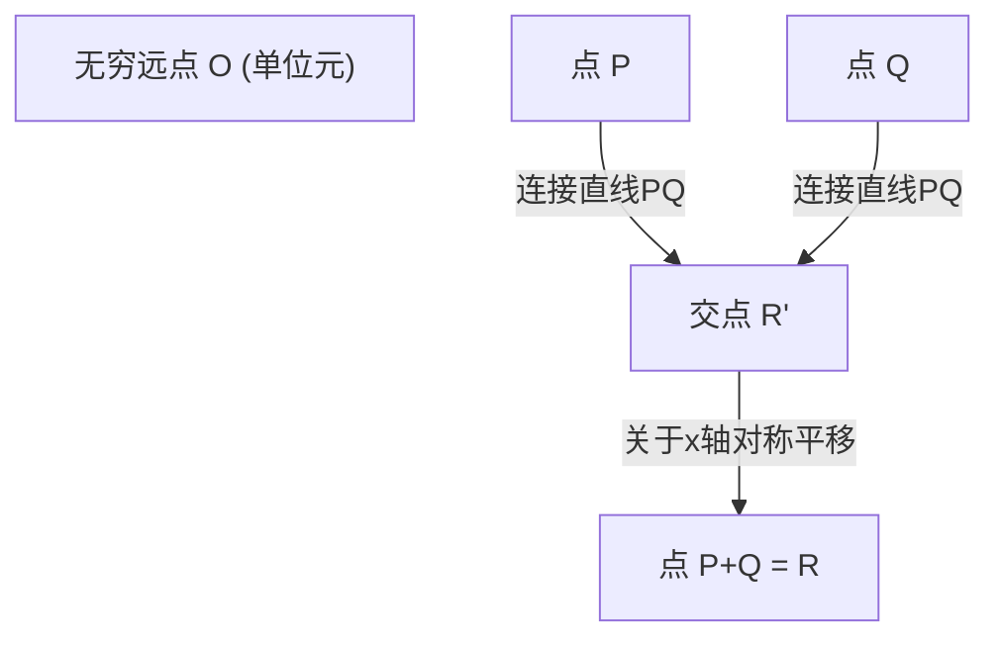
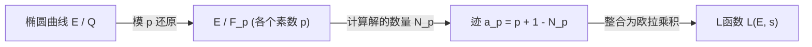

## 1. 引言：千禧年大奖难题与数论的未解之谜

在现代数学中，最重要、最美丽且最深奥的谜题之一就是 **贝赫和斯维讷通-戴尔猜想** （Birch and Swinnerton-Dyer Conjecture，以下简称 **BSD猜想** ）。它入选了2000年克雷数学研究所公布的七大“千禧年大奖难题”之一，解决者将获得100万美元的奖金。

BSD猜想属于代数几何与数论交汇的“算术几何学”领域。简而言之，这个猜想提出了一个令人惊叹的主张：“要知道椭圆曲线上是否有无限多个有理点，只需要观察由该椭圆曲线确定的复变函数（L函数）在 $s=1$ 处的行为即可。”通过收集局部信息（以素数为模的解的数量），可以完全决定全局信息（有理解的结构），这是一个体现了数学浪漫的猜想。

在本文中，为了理解BSD猜想的含义，我们将从椭圆曲线的基础出发，详细且严谨地讲解莫德尔定理、L函数的定义，以及BSD猜想的准确主张（弱猜想与强猜想）。此外，我们还将探讨同余数问题以及由伽罗瓦上同调引出的背景等高级主题。

## 2. 什么是椭圆曲线：代数几何的宝石

BSD猜想的主角是 **椭圆曲线** （Elliptic Curve）。虽然名字里有“椭圆”，但它与作为几何图形的椭圆没有直接关系。由于它是在研究计算椭圆弧长时出现的“椭圆积分”的反函数过程中被发现的，因此得名。

### 2.1. 魏尔斯特拉斯标准型

有理数域 $\mathbb{Q}$ 上的椭圆曲线 $E$ 通常可以表示为由以下形式的三次方程（魏尔斯特拉斯标准型）定义的非奇异射影代数曲线。

$$
E: y^2 = x^3 + ax + b \quad (a, b \in \mathbb{Q})
$$

这里的“非奇异（non-singular）”是指曲线上没有尖点（cusp）或自交点（node）。这个条件可以使用判别式 $\Delta$ 表示如下。

$$
\Delta = -16(4a^3 + 27b^2) \neq 0
$$

在几何上，如果将这条曲线置于复数域 $\mathbb{C}$ 上考虑，它呈现出环面（甜甜圈）的形状。这一点可以通过使用魏尔斯特拉斯 $\wp$ 函数与复环面 $\mathbb{C}/\[Lambda](https://kenji.blog/zh-cn/p/serverless-architecture-aws-lambda-cold-start/)$（$\Lambda$ 为格）的同构对应关系来证明。

### 2.2. 有理点与群结构

椭圆曲线最令人惊奇的性质之一是，可以对其上的点定义“加法”。这被称为弦切线法（chord and tangent method）。

对于曲线上的两点 $P, Q$，加法 $P + Q$ 定义如下：
1. 作过 $P$ 和 $Q$ 的直线 $L$（如果 $P=Q$ 则作该点处的切线）。
2. 根据贝祖定理，三次曲线 $E$ 与直线 $L$（计算重数在内）必定有三个交点。设第三个交点为 $R'$。
3. 将 $R'$ 关于 $x$ 轴作对称平移得到点 $R$，将其定义为 $P + Q$。

通过将无穷远点 $\mathcal{O}$ 作为零元（单位元），椭圆曲线 $E$ 上的点构成了一个阿贝尔群。特别地，定义在有理数域 $\mathbb{Q}$ 上的椭圆曲线的有理点（坐标 $x, y$ 均为有理数的点）的全体集合 $E(\mathbb{Q})$，关于这个加法构成一个子群。

寻找有理点的问题，自古以来就是[丢番图](https://kenji.blog/zh-cn/p/diophantus/)方程的主要研究课题。揭示有理点集合究竟具有怎样的结构，是其最大的目标。

## 3. 莫德尔定理与秩 (Rank)

1922年，[路易斯·莫德尔](https://kenji.blog/zh-cn/p/mordell/) (Louis Mordell) 证明了关于有理点群 $E(\mathbb{Q})$ 结构的一个决定性定理。后来安德烈·韦伊 ([André Weil](https://kenji.blog/zh-cn/p/weil/)) 将其扩展到更一般的代数数域和阿贝尔流形上，被称为莫德尔-韦伊定理。

### 3.1. 莫德尔定理 (Mordell's Theorem)

**定理 (莫德尔，1922年)**
椭圆曲线 $E$ 的有理点群 $E(\mathbb{Q})$ 是一个有限生成阿贝尔群。

根据代数中有限生成阿贝尔群的基本定理，$E(\mathbb{Q})$ 具有如下同构：

$$
E(\mathbb{Q}) \cong E(\mathbb{Q})_{\text{tors}} \oplus \mathbb{Z}^r
$$

这里：
- $E(\mathbb{Q})_{\text{tors}}$ 被称为 **挠子群** (torsion subgroup)，是由有限阶点（相加若干次后变为无穷远点 $\mathcal{O}$ 的点）组成的有限群。根据巴里·马祖尔 (Barry Mazur) 定理（1977年），有理数域上的椭圆曲线中，挠子群可能具有的结构已经被完全分类，只有15种。具体来说，是 $\mathbb{Z}/N\mathbb{Z}$ ($1 \le N \le 10, N=12$) 或 $\mathbb{Z}/2\mathbb{Z} \oplus \mathbb{Z}/2N\mathbb{Z}$ ($1 \le N \le 4$) 之一。
- $r$ 是非负整数，被称为 **秩 (rank)**。
- $\mathbb{Z}^r$ 是由无限阶点（无论相加多少次都不会变成 $\mathcal{O}$ 的点）生成的自由阿贝尔群。

### 3.2. 秩 $r$ 的意义与困难性

秩 $r$ 是一个重要的不变量，表示“实质上独立的无限阶点有多少个”。
- 如果 $r = 0$，则 $E(\mathbb{Q})$ 是一个有限群，有理点只有有限个。
- 如果 $r \ge 1$，则 $E(\mathbb{Q})$ 包含无限多个有理点。

利用 Nagell-Lutz 定理等，可以很容易地通过算法计算和确定挠子群。然而，**至今还没有发现能够确定秩 $r$ 的通用算法。**

虽然可以通过一种称为“下降法 (descent)”的方法来计算特定方程的秩，但由于泰特-沙法列维奇群 (Tate-Shafarevich group) 非平凡元的阻碍，无法保证算法一定能终止。即使能够计算某条特定椭圆曲线的秩，是否存在一个对所有椭圆曲线都必定能终止并输出秩的过程（可判定性），这本身也是一个未解之谜。

BSD猜想，正是将这个“极难计算的全局信息——秩 $r$ ”与“可以从局部信息计算的解析对象”联系起来的猜想。

## 4. 从局部到全局：哈塞-韦伊L函数

当在整个有理数域中难以找到方程的解时，在数论中我们经常考虑“以素数 $p$ 为模 (modulo $p$)”的有限域 $\mathbb{F}_p$ 上的解的数量。这被称为局部信息。

### 4.1. 有限域上的解的数量

将椭圆曲线 $E: y^2 = x^3 + ax + b$ 模素数 $p$ 进行还原，设同余式
$$ y^2 \equiv x^3 + ax + b \pmod p $$
的解的数量（包括无穷远点）为 $N_p$。

直观上看，$x \pmod p$ 有 $p$ 种取值，其等于 $y^2$ 的概率大约是 $1/2$（如果是二次剩余则为2个，非剩余则为0个），因此预期解的数量 $N_p$ 大约为 $p$ 个（包括无穷远点则为 $p+1$ 个）。我们把与这个预期值的“偏差”定义为 $a_p$。

$$
a_p = p + 1 - N_p
$$

根据哈塞界 (Hasse's bound)，已知这种偏差满足 $|a_p| \le 2\sqrt{p}$。这是有限域上椭圆曲线黎曼猜想类似物的一种。

### 4.2. L函数的定义

将所有素数 $p$ 的这些局部信息 $a_p$ 收集起来，构造出一个解析函数。这就是 **哈塞-韦伊L函数** (Hasse-Weil L-function) $L(E, s)$。
对于复数 $s$，利用欧拉乘积定义如下：

$$
L(E, s) = \prod_{p \mid \Delta} (1 - a_p p^{-s})^{-1} \prod_{p \nmid \Delta} (1 - a_p p^{-s} + p^{1-2s})^{-1}
$$
（这里前面的乘积是遍历具有“坏还原 (bad reduction)”的素数，后面是遍历具有“好还原 (good reduction)”的素数。在坏还原的情况下，$a_p$ 根据还原类型取 $1, -1, 0$ 之一。）

利用哈塞界可以证明，这个无穷乘积在 $\mathrm{Re}(s) > \frac{3}{2}$ 的区域内绝对收敛。

### 4.3. 解析延拓与模组化定理

在阐述BSD猜想时，决定性的重要问题是能否将 $L(E, s)$ 解析延拓到整个复平面。特别地，如后文所述，我们想知道其在 $s=1$ 处的行为，但定义式中的乘积在 $s=1$ 处并不收敛。

这个问题已被2001年完全证明的 **模组化定理** （Modularity theorem，原谷山-志村猜想）所解决。凭借[安德鲁·怀尔斯](https://kenji.blog/zh-cn/p/wiles/)、理查德·泰勒、克里斯托弗·布勒伊、布莱恩·康拉德和弗雷德·戴蒙德等人的伟大成就，证明了“所有有理数域上的椭圆曲线都是模曲线”。

“是模曲线”意味着 $L(E, s)$ 与某个权重为2的模形式 $f$ 的L函数 $L(f, s)$ 完全一致。模形式的L函数借由赫克理论 (Hecke theory) 可以解析延拓到整个复平面，并满足以下函数方程：

$$
\[Lambda](https://kenji.blog/zh-cn/p/serverless-architecture-aws-lambda-cold-start/)(E, s) = (2\pi)^{-s} N^{s/2} \Gamma(s) L(E, s)
$$
$$
\Lambda(E, 2-s) = w \Lambda(E, s)
$$

这里 $N$ 是称为导子 (conductor) 的整数，$w \in \{1, -1\}$ 是符号 (root number)。
通过这种解析延拓，讨论 $L(E, s)$ 在 $s=1$ 处的值以及泰勒展开，在数学上得到了正当化。

## 5. 贝赫和斯维讷通-戴尔猜想

在1960年代初，布莱恩·贝赫和彼得·斯维讷通-戴尔使用剑桥大学早期的计算机（EDSAC 2），计算了大量椭圆曲线的 $N_p$，并实验性地研究了相当于 $L(E, 1)$ 的无穷乘积的行为。

如果有理点较多（秩 $r$ 较大），那么模每个素数 $p$ 的解的数量 $N_p$ 也应该倾向于变大。这样 $a_p = p + 1 - N_p$ 就会在负方向变大，欧拉乘积中的项 $(1 - a_p p^{-1} + p^{-1})^{-1}$ 就会变小，因此L函数在 $s=1$ 处的值应该趋近于 $0$。

基于这种计算机实验的洞察，诞生了一个在数学史上闪耀的猜想。

### 5.1. BSD猜想（弱猜想）

**贝赫和斯维讷通-戴尔猜想（弱）**
有理数域 $\mathbb{Q}$ 上椭圆曲线 $E$ 的秩 $r$，等于其L函数 $L(E, s)$ 在 $s=1$ 处的零点阶数。

也就是说，当考虑泰勒展开时，
$$
L(E, s) = c(s-1)^r + \text{higher order terms} \quad (c \neq 0)
$$
这个零点阶数被称为 **解析秩**。

这个猜想是惊天动地的。左边（或右边）的“零点阶数”是完全由解析、局部信息决定的值。而右边（左边）的“秩 $r$”是表示代数、全局有理点结构的值。属于完全不同世界的两个量竟然完全一致。

特别是考虑 $r=0$ 和 $r \ge 1$ 的情况：
- $L(E, 1) \neq 0 \iff E(\mathbb{Q})$ 的有理点只有有限个
- $L(E, 1) = 0 \iff E(\mathbb{Q})$ 有无限多个有理点

### 5.2. BSD猜想（强猜想）

进一步，他们猜想刚才的泰勒展开中第一个非零系数 $c$（即 $L^{(r)}(E, 1) / r!$），可以使用椭圆曲线的各种数论不变量，通过一个极其优美的公式来描述。这就是 **BSD强猜想**。

$$
\lim_{s \to 1} \frac{L(E, s)}{(s-1)^r} = \frac{\Omega_E \cdot \mathrm{Reg}(E) \cdot |\text{Sha}(E)| \cdot \prod_{p} c_p}{|E(\mathbb{Q})_{\text{tors}}|^2}
$$

出现在这个公式中的不变量如下：
1. **$\Omega_E$ (实周期)** : 由椭圆曲线在实数域上的积分 $\int_{E(\mathbb{R})} \frac{dx}{|2y + a_1x + a_3|}$ 确定的超越数。
2. **$\mathrm{Reg}(E)$ (调节子)** : 对于秩为 $r$ 的无限阶有理点生成元 $P_1, \dots, P_r$，由它们之间的内伦-泰特高度配对 (Néron-Tate height pairing) $\langle P_i, P_j \rangle$ 构成的 $r \times r$ 矩阵的行列式。它是衡量点“大小”的指标。
3. **$|E(\mathbb{Q})_{\text{tors}}|$** : 挠子群的阶。
4. **$c_p$ (玉河数)** : 对于坏还原素数 $p$ 的局部修正系数。由局部域的伽罗瓦群作用计算得出。
5. **$\text{Sha}(E)$ (泰特-沙法列维奇群, $\text{\textcyrillic{Sh}}$)** : 极其重要的对象，稍后详述。

这个公式可以被看作是19世纪狄利克雷类数公式 (Dirichlet's class number formula)
$$
\lim_{s \to 1} (s-1)\zeta_K(s) = \frac{2^{r_1} (2\pi)^{r_2} h_K R_K}{w_K \sqrt{|D_K|}}
$$
推广到椭圆曲线的终极形态。戴德金zeta函数中的类数 $h_K$ 对应 $\text{Sha}(E)$，单位群的调节子 $R_K$ 对应椭圆曲线的调节子 $\mathrm{Reg}(E)$。

### 5.3. 神秘的群「Sha (Ш)」与伽罗瓦上同调

公式中最神秘和难懂的对象是泰特-沙法列维奇群 $\text{Sha}(E)$（用西里尔字母 $\text{\textcyrillic{Sh}}$ 表示）。

局部-全局原则（哈塞原则）是指，“所有方程在有理数域（全局）有解的充分必要条件是，它在所有素数 $p$ 对应的 $p$ 进数域（局部）有解，并且在实数域也有解”。这个原则对于二次形式是成立的（哈塞-闵可夫斯基定理）。
然而，对于椭圆曲线（三次曲线），这个原则并不成立。可能会出现“局部上都有解，但在全局上没有解”的现象。

$\text{Sha}(E)$ 是利用伽罗瓦上同调来衡量这种“局部-全局原则失效”程度的群。严格来说定义如下：

$$
\text{Sha}(E) = \ker \left( H^1(G_{\mathbb{Q}}, E) \to \prod_{v} H^1(G_{\mathbb{Q}_v}, E) \right)
$$

其中 $G_{\mathbb{Q}}$ 是绝对伽罗瓦群，乘积遍历所有的素点（有理素数和无穷素点）。
BSD强猜想包含了一个隐含的前提：“对于任意椭圆曲线，$\text{Sha}(E)$ 都是有限群”。但是，直到今天，甚至都没有证明对一般的椭圆曲线 $\text{Sha}(E)$ 是有限的。除了卡尔·鲁宾 (Karl Rubin) 等人关于具有复乘的曲线的结果等之外，对 $\text{Sha}(E)$ 的本质理解是现代数论最大的课题之一。

## 6. 与同余数问题的关系

BSD猜想的一个非常著名的应用是 **同余数问题 (Congruent number problem)**。这是一个关于“某个自然数 $n$ 是否能成为所有边长均为有理数的直角三角形的面积？”的问题。能够成为面积的 $n$ 称为同余数。例如 $n=5, 6, 7$ 是同余数，而 $n=1, 2, 3$ 不是同余数。

实际上，已知 $n$ 是同余数，等价于特定的椭圆曲线
$$ E_n: y^2 = x^3 - n^2 x $$
有无限多个有理点（也就是说秩 $r \ge 1$）。

如果假设弱BSD猜想是正确的，根据图内尔 (Tunnell) 定理（1983年），$n$ 为同余数的条件可以归结为一个关于简单二次形式解的个数的初等判定条件。由此可见，BSD猜想具有甚至能为几千年来的经典数论问题提供完美解答的力量。

## 7. 当前进展与未解的壁垒

正如它被选为千禧年大奖难题一样，BSD猜想至今尚未被完全证明。不过，已经获得了一些重要的部分结果。

### 7.1. 秩 $r \le 1$ 的情况

令人惊讶的是，当解析秩（$L(E,s)$ 在 $s=1$ 处的零点阶数）为 0 或 1 时，BSD猜想的大部分已被证明是正确的。

- **格罗斯-扎吉尔定理 (Gross-Zagier, 1986)** :
  证明了当解析秩为 1 时，$L(E,s)$ 在 $s=1$ 处的一阶导数值与由模曲线上特殊点构成的“黑格纳点 (Heegner point)”的内伦-泰特高度成正比关系。由于黑格纳点的高度非零，从而证明了代数秩大于等于 1。
- **科利瓦金定理 (Kolyvagin, 1989)** :
  构建了称为欧拉系 (Euler system) 的强大的伽罗瓦上同调方法，证明了在解析秩为 0 或 1 的情况下，代数秩与解析秩一致，并且当且仅当此时泰特-沙法列维奇群 $\text{Sha}(E)$ 是有限群。

通过这些成就，“对于解析秩为 0 或 1 的椭圆曲线，弱BSD猜想为真”这一点已成定局。

### 7.2. 秩 $r \ge 2$ 的高墙

另一方面，对于解析秩在 2 及以上的椭圆曲线，目前惊人地一无所知。
即便对于已知代数秩为 2 的特定曲线，也还没有严格证明（而不是通过计算机近似计算）解析秩为 2 的例子。
此外，对于秩 2 及以上的情况，也尚未发现像欧拉系那样能够系统地构造有理点的机制，这犹如一堵高墙横亘在现代数学面前。

2010年代之后，通过曼朱尔·巴尔加瓦 (Manjul Bhargava) 和阿鲁尔·香卡 (Arul Shankar) 等人的研究，得出了一个惊人的统计结果：**“在所有的椭圆曲线中，至少有 66% 满足 BSD 猜想”**。这是因为他们证明了秩 0 和秩 1 的曲线占了整体的绝大多数（平均秩是有界的）。由此，BSD猜想至少在概率论和统计学角度上被印证是极其合理的。

## 8. 总结

贝赫和斯维讷通-戴尔猜想是一个极其宏伟的猜想，它通过数论将椭圆曲线这个代数几何对象与L函数这个分析学对象完美地结合在一起。

- **代数与几何的融合**: 方程有理数解的群结构（秩与挠）。
- **分析的世界**: 由模素数的解的个数构造出的L函数的零点。
- **深奥的谜团**: 它们竟然完全一致，并且其系数由数论不变量（特别是充满谜团的 $\text{Sha}(E)$）所描述。

当BSD猜想被彻底解开的那一天，不仅会在理解[丢番图](https://kenji.blog/zh-cn/p/diophantus/)方程有理数解方面带来终极的突破，它也将成为支持诸如函数域上的类比（阿廷-泰特猜想）以及统合数学各领域的“朗兰兹纲领”等更广泛的动机L函数理论根基的坚实基础。

我们期待着人类智慧完全跨越这片幽深的森林，获得洞察全局秩为2及以上世界的新“眼睛”的那一天。

---
*本文旨在讲解高级数学主题。虽然包含很多数学公式，但希望能让大家稍微感受到算术几何学的魅力。欢迎在评论区提问和讨论。*
