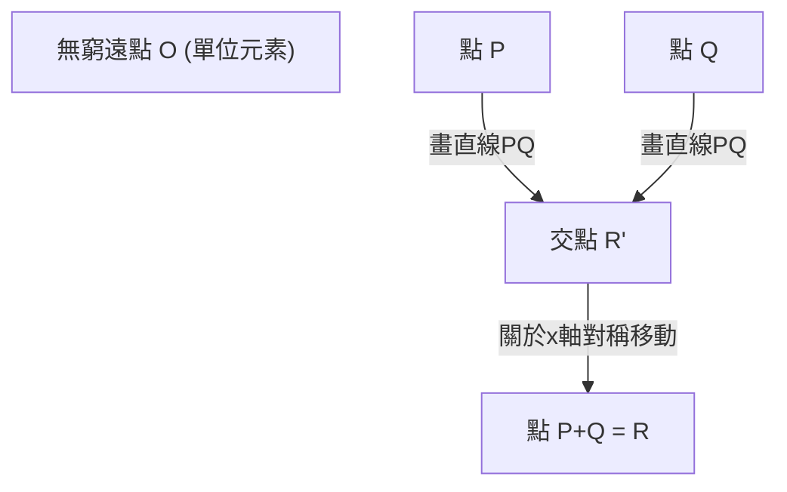
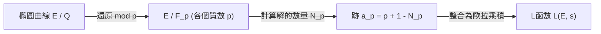

## 1. 簡介：千禧年大獎難題與數論的未解之謎

在現代數學中，最重要且最美麗深奧的謎題之一就是 **貝赫和斯維納通-戴爾猜想**（Birch and Swinnerton-Dyer Conjecture，以下簡稱 **BSD猜想**）。它被克雷數學研究所在2000年選為七個「千禧年大獎難題」之一，解決者將獲得100萬美元的獎金。

BSD猜想屬於代數幾何與整數論交會的「算術幾何」領域。粗略地說，這個猜想提出了一個令人驚訝的主張：「橢圓曲線上是否有無限多個有理點，只需看由該橢圓曲線決定的複變函數（L函數）在 $s=1$ 處的行為即可知道。」這是一個體現數學浪漫的猜想，透過收集局部資訊（以質數為模的解的數量），可以完全決定全局資訊（有理數解的結構）。

在本文中，為了理解BSD猜想的含義，我們將從橢圓曲線的基礎出發，詳細且嚴格地解說莫德爾定理、L函數的定義，以及BSD猜想的準確主張（弱猜想與強猜想）。此外，我們也將探討與同餘數問題的關聯，以及由伽羅瓦上同調提供的背景等進階主題。

## 2. 什麼是橢圓曲線：代數幾何的寶石

BSD猜想的主角是 **橢圓曲線**（Elliptic Curve）。雖然名字裡有「橢圓」，但它與作為幾何圖形的橢圓沒有直接關係。它之所以得名，是因為在研究計算橢圓弧長時出現的「橢圓積分」的反函數的過程中被發現。

### 2.1. 魏爾斯特拉斯標準型

有理數體 $\mathbb{Q}$ 上的橢圓曲線 $E$，一般可以表示為由以下形式的三次方程式（魏爾斯特拉斯標準型）所定義的非奇異射影代數曲線。

$$
E: y^2 = x^3 + ax + b \quad (a, b \in \mathbb{Q})
$$

這裡「非奇異（non-singular）」的意思是曲線上沒有尖點（cusp）或自交點（node）。這個條件可以使用判別式 $\Delta$ 來表示如下。

$$
\Delta = -16(4a^3 + 27b^2) \neq 0
$$

在幾何上，如果我們在複數體 $\mathbb{C}$ 上考慮這條曲線，它的形狀是一個環面（甜甜圈形狀）。這可以透過使用魏爾斯特拉斯 $\wp$ 函數與複環面 $\mathbb{C}/\[Lambda](https://kenji.blog/zh-tw/p/serverless-architecture-aws-lambda-cold-start/)$（$\Lambda$ 是格）的同構對應來證明。

### 2.2. 有理點與群結構

橢圓曲線最令人驚訝的性質之一是，可以在其上的點之間定義「加法」。這被稱為弦切法（chord and tangent method）。

對於曲線上的兩點 $P, Q$，我們如下定義加法 $P + Q$：
1. 畫一條穿過 $P$ 和 $Q$ 的直線 $L$（如果 $P=Q$，則畫在該點的切線）。
2. 根據貝祖定理，三次曲線 $E$ 和直線 $L$ 必定（計算重數在內）有3個交點。設第三個交點為 $R'$。
3. 將 $R'$ 關於 $x$ 軸對稱移動得到的點設為 $R$，並將其定義為 $P + Q$。

透過將無窮遠點 $\mathcal{O}$ 設為零元素（單位元素），橢圓曲線 $E$ 上的點構成一個阿貝爾群。特別是，在有理數體 $\mathbb{Q}$ 上定義的橢圓曲線的有理點（座標 $x, y$ 都是有理數的點）的整體集合 $E(\mathbb{Q})$，對於這個加法構成一個子群。

尋找有理點的問題，自古以來一直作為[丟番圖](https://kenji.blog/zh-tw/p/diophantus/)方程式的主要問題被研究。闡明有理點集合具有什麼樣的結構及其全貌，是最大的目標。

## 3. 莫德爾定理與秩（Rank）

1922年，[路易斯·莫德爾](https://kenji.blog/zh-tw/p/mordell/)（[Louis Mordell](https://kenji.blog/zh-tw/p/mordell/)）證明了關於有理點群 $E(\mathbb{Q})$ 結構的決定性定理。後來[安德烈·韋伊](https://kenji.blog/zh-tw/p/weil/)（[André Weil](https://kenji.blog/zh-tw/p/weil/)）將其推廣到更一般的代數體和阿貝爾簇，被稱為莫德爾-韋伊定理。

### 3.1. 莫德爾定理 (Mordell's Theorem)

**定理（莫德爾，1922年）**
橢圓曲線 $E$ 的有理點群 $E(\mathbb{Q})$ 是有限生成阿貝爾群。

根據代數學中有限生成阿貝爾群的基本定理，$E(\mathbb{Q})$ 具有如下的同構關係。

$$
E(\mathbb{Q}) \cong E(\mathbb{Q})_{\text{tors}} \oplus \mathbb{Z}^r
$$

這裡，
- $E(\mathbb{Q})_{\text{tors}}$ 被稱為 **扭子群**（torsion subgroup），是由有限階的點（相加若干次後會變成無窮遠點 $\mathcal{O}$ 的點）全體組成的有限群。根據巴里·梅休爾（Barry Mazur）的定理（1977年），有理數體上的橢圓曲線中，扭子群可能具有的結構只有15種，且已被完全分類。具體來說，是 $\mathbb{Z}/N\mathbb{Z}$ ($1 \le N \le 10, N=12$) 或 $\mathbb{Z}/2\mathbb{Z} \oplus \mathbb{Z}/2N\mathbb{Z}$ ($1 \le N \le 4$) 之一。
- $r$ 是一個非負整數，被稱為 **秩（階數）**。
- $\mathbb{Z}^r$ 是由無限階的點（無論加多少次都不會變成 $\mathcal{O}$ 的點）生成的自由阿貝爾群。

### 3.2. 秩 $r$ 的意義與困難度

秩 $r$ 是一個重要的不變量，表示「實質上獨立的無限階點有多少個」。
- 如果 $r = 0$，則 $E(\mathbb{Q})$ 成為有限群，有理點只有有限個。
- 如果 $r \ge 1$，則 $E(\mathbb{Q})$ 有無限多個有理點。

扭子群可以使用Nagell-Lutz定理等演算法輕鬆計算並決定。然而，**至今仍未找到決定秩 $r$ 的一般演算法。**

雖然可以使用稱為下降法（descent）的方法來計算特定方程式的秩，但由於泰特-沙法列維奇群的非平凡元素會成為障礙，因此無法保證演算法一定會停止。即使能夠計算某個特定橢圓曲線的秩，是否存能對所有橢圓曲線確實停止並輸出秩的程序（可判定性），至今仍是未解之謎。

BSD猜想正是一個將這個「計算極為困難的全局資訊——秩 $r$」與「可從局部資訊計算的解析對象」聯繫起來的猜想。

## 4. 從局部到全局：哈斯-韋伊 L函數

在整個有理數中尋找方程式的解很困難時，數論中經常會考慮在「以質數 $p$ 為模（modulo $p$）」的有限體 $\mathbb{F}_p$ 上的解的數量。這被稱為局部資訊。

### 4.1. 有限體上的解的數量

將橢圓曲線 $E: y^2 = x^3 + ax + b$ 對質數 $p$ 進行還原，設同餘式
$$ y^2 \equiv x^3 + ax + b \pmod p $$
的解的數量（包括無窮遠點）為 $N_p$。

直觀上，$x \pmod p$ 可以取 $p$ 種值，而等於 $y^2$ 的機率大約是 $1/2$（如果是二次剩餘則有2個，非剩餘則為0個），因此解的數量 $N_p$ 預計大約是 $p$ 個（包含無窮遠點為 $p+1$ 個）。我們將與這個預期值的「偏差」定義為 $a_p$。

$$
a_p = p + 1 - N_p
$$

根據哈斯定理（Hasse's bound）已知，這個偏差受到 $|a_p| \le 2\sqrt{p}$ 的限制。這是有限體上橢圓曲線的黎曼猜想的類似物之一。

### 4.2. L函數的定義

收集所有質數 $p$ 的這些局部資訊 $a_p$，來構造一個解析函數。這就是 **哈斯-韋伊 L函數**（Hasse-Weil L-function） $L(E, s)$。
對於複數 $s$，使用歐拉乘積定義如下。

$$
L(E, s) = \prod_{p \mid \Delta} (1 - a_p p^{-s})^{-1} \prod_{p \nmid \Delta} (1 - a_p p^{-s} + p^{1-2s})^{-1}
$$
（這裡前面的乘積是關於具有「壞還原（bad reduction）」的質數的乘積，後者是關於具有「好還原（good reduction）」的質數的乘積。在壞還原的情況下，取決於還原的類型，$a_p$ 的值為 $1, -1, 0$ 之一。）

使用哈斯邊界可以證明，這個無窮乘積在 $\mathrm{Re}(s) > \frac{3}{2}$ 的區域內絕對收斂。

### 4.3. 解析延拓與模組性定理

在陳述BSD猜想時，決定性的問題是能否將 $L(E, s)$ 解析延拓到整個複平面。特別是，如後文所述，我們想知道它在 $s=1$ 處的行為，但定義式中的乘積在 $s=1$ 處並不收斂。

這個問題已經由2001年完全證明的 **模組性定理**（舊稱谷山-志村猜想）解決了。[安德魯·懷爾斯](https://kenji.blog/zh-tw/p/wiles/)、理查德·泰勒、克里斯托夫·布勒伊、布萊恩·康拉德、弗雷德·戴蒙德等人的偉大成就是證明了「所有有理數體上的橢圓曲線都是模曲線」。

身為模曲線意味著 $L(E, s)$ 完美等同於某個權重為2的模形式 $f$ 的L函數 $L(f, s)$。模形式的L函數藉由赫克（Hecke）的理論可以解析延拓到整個複平面，並滿足以下函數方程式。

$$
\[Lambda](https://kenji.blog/zh-tw/p/serverless-architecture-aws-lambda-cold-start/)(E, s) = (2\pi)^{-s} N^{s/2} \Gamma(s) L(E, s)
$$
$$
\Lambda(E, 2-s) = w \Lambda(E, s)
$$

其中 $N$ 是一個被稱為導子（conductor）的整數，$w \in \{1, -1\}$ 是符號（根數）。
藉由這個解析延拓，討論 $s=1$ 處 $L(E, s)$ 的值和泰勒展開在數學上就具有正當性了。

## 5. 貝赫和斯維納通-戴爾猜想

1960年代初，布萊恩·貝赫（Bryan Birch）和彼得·斯維納通-戴爾（Peter Swinnerton-Dyer）使用劍橋大學早期的電腦（EDSAC 2），計算了大量橢圓曲線的 $N_p$，並透過實驗研究了相當於 $L(E, 1)$ 的無窮乘積的行為。

如果有理點很多（秩 $r$ 很大），那麼即使以各個質數 $p$ 為模，解的數量 $N_p$ 也應該有變大的趨勢。那麼 $a_p = p + 1 - N_p$ 就會朝負的方向變大，歐拉乘積的項 $(1 - a_p p^{-1} + p^{-1})^{-1}$ 就會變小，因此 $s=1$ 處的L函數的值應該會趨近於 $0$。

基於這項電腦實驗的洞察，誕生了在數學史上閃耀的猜想。

### 5.1. BSD猜想（弱猜想）

**貝赫和斯維納通-戴爾猜想（弱）**
有理數體 $\mathbb{Q}$ 上的橢圓曲線 $E$ 的秩（階數） $r$，等於其L函數 $L(E, s)$ 在 $s=1$ 處的零點階數。

也就是說，當考慮泰勒展開時，
$$
L(E, s) = c(s-1)^r + \text{高階項} \quad (c \neq 0)
$$
這就是其主張。這個零點的階數被稱為 **解析秩**。

這個猜想驚天動地。左邊（或右邊）的「零點的階數」是純粹由解析的、局部資訊決定的值。另一方面，右邊（左邊）的「秩 $r$」是表示代數的、全局的有理點結構的值。這意味著屬於完全不同世界的兩個量竟然完全一致。

特別是考慮 $r=0$ 和 $r \ge 1$ 的情況：
- $L(E, 1) \neq 0 \iff E(\mathbb{Q})$ 的有理點只有有限個
- $L(E, 1) = 0 \iff E(\mathbb{Q})$ 有無限多個有理點

### 5.2. BSD猜想（強猜想）

此外，他們還猜測前述泰勒展開中的第一個非零係數 $c$（即 $L^{(r)}(E, 1) / r!$），可以使用橢圓曲線的各種數論不變量，用一個極其優美的公式來描述。這就是 **BSD強猜想**。

$$
\lim_{s \to 1} \frac{L(E, s)}{(s-1)^r} = \frac{\Omega_E \cdot \mathrm{Reg}(E) \cdot |\text{Sha}(E)| \cdot \prod_{p} c_p}{|E(\mathbb{Q})_{\text{tors}}|^2}
$$

出現在這個公式中的不變量如下：
1. **$\Omega_E$ (實週期)** : 由橢圓曲線在實數體上的積分 $\int_{E(\mathbb{R})} \frac{dx}{|2y + a_1x + a_3|}$ 決定的超越數。
2. **$\mathrm{Reg}(E)$ (調節子)** : 對於秩為 $r$ 的無限階有理點生成元 $P_1, \dots, P_r$，將內龍-泰特高度配對（Néron-Tate height pairing） $\langle P_i, P_j \rangle$ 排列而成的 $r \times r$ 矩陣的行列式。這是衡量點的「大小」的指標。
3. **$|E(\mathbb{Q})_{\text{tors}}|$** : 扭子群的階。
4. **$c_p$ (玉河數)** : 針對具有壞還原的質數 $p$ 的局部修正係數。由局部體的伽羅瓦群作用計算得出。
5. **$\text{Sha}(E)$ (泰特-沙法列維奇群，$\text{\textcyrillic{Sh}}$)** : 由於這是一個極為重要的對象，稍後將詳細說明。

這個公式可以被視為19世紀狄利克雷類數公式（Dirichlet's class number formula）
$$
\lim_{s \to 1} (s-1)\zeta_K(s) = \frac{2^{r_1} (2\pi)^{r_2} h_K R_K}{w_K \sqrt{|D_K|}}
$$
推廣到橢圓曲線的終極形式。戴德金Zeta函數中的類數 $h_K$ 對應於 $\text{Sha}(E)$，單位群的調節子 $R_K$ 對應於橢圓曲線的調節子 $\mathrm{Reg}(E)$。

### 5.3. 神秘的群「Sha (Ш)」與伽羅瓦上同調

公式中最神秘且難解的對象是泰特-沙法列維奇群 $\text{Sha}(E)$（用西里爾字母 $\text{\textcyrillic{Sh}}$ 表示）。

局部-全局原則（哈斯原則）是指：「所有方程式在有理數體（全局）有解的充分必要條件是，對於所有質數 $p$ 都在 $p$ 進數體（局部）有解，且在實數體也有解」的原則。對於二次形式，這個原則成立（哈斯-閔可夫斯基定理）。
然而，對於橢圓曲線（三次曲線），這個原則並不成立。「局部皆有解，但全局卻無解」的現象是可能發生的。

$\text{Sha}(E)$ 是使用伽羅瓦上同調來衡量這種「局部-全局原則失敗」的群。嚴格定義如下：

$$
\text{Sha}(E) = \ker \left( H^1(G_{\mathbb{Q}}, E) \to \prod_{v} H^1(G_{\mathbb{Q}_v}, E) \right)
$$

這裡 $G_{\mathbb{Q}}$ 是絕對伽羅瓦群，乘積遍歷所有素位（有理質數和無窮素位）。
BSD強猜想包含一個隱含的前提：「對於任意橢圓曲線，$\text{Sha}(E)$ 是有限群」。然而，直到現在，甚至都還沒有證明對一般橢圓曲線而言 $\text{Sha}(E)$ 是有限的。除了卡爾·魯賓（Karl Rubin）等人關於具有複乘法的曲線的結果之外，對 $\text{Sha}(E)$ 實質上的理解仍是現代數論最大的課題之一。

## 6. 與同餘數問題的關係

BSD猜想非常有名的一個應用是 **同餘數問題（Congruent number problem）**。即「某個自然數 $n$ 是否能成為所有邊長均為有理數的直角三角形的面積？」的問題。能成為面積的 $n$ 被稱為同餘數。例如 $n=5, 6, 7$ 是同餘數，但 $n=1, 2, 3$ 不是同餘數。

事實上，已知 $n$ 是同餘數等價於特定的橢圓曲線
$$ E_n: y^2 = x^3 - n^2 x $$
擁有無限多個有理點（也就是秩 $r \ge 1$）。

如果假設弱BSD猜想成立，根據特內爾（Tunnell）定理（1983年），$n$ 為同餘數的條件將歸結為關於簡單二次形式解的數量的初等判定條件。就這樣，BSD猜想也擁有能為數千年來的古典整數論問題提供完全解答的力量。

## 7. 目前的進展與未解的障礙

正如BSD猜想被選為千禧年大獎難題所示，目前尚未獲得完全的證明。然而，已經取得了一些重要的部分結果。

### 7.1. 秩 $r \le 1$ 的情況

令人驚訝的是，在解析秩（$L(E,s)$ 在 $s=1$ 處的零點階數）為 0 或 1 的情況下，BSD猜想的大部分已被證明是正確的。

- **格羅斯-扎吉爾定理 (Gross-Zagier, 1986)** :
  證明了當解析秩為 1 時，$L(E,s)$ 在 $s=1$ 處的一階導數，與由模曲線上的特殊點構成的「黑格納點（Heegner point）」的內龍-泰特高度成正比關係。由於黑格納點的高度非零，證明了代數秩大於或等於 1。
- **科利瓦金定理 (Kolyvagin, 1989)** :
  建立了一種稱為歐拉系統（Euler system）的強大伽羅瓦上同調方法，證明了當解析秩為 0 或 1 時，與代數秩一致，並且唯有在這種情況下，泰特-沙法列維奇群 $\text{Sha}(E)$ 才會是有限群。

透過這些成就，已經確定了「對於解析秩為 0 或 1 的橢圓曲線，弱BSD猜想是正確的」。

### 7.2. 秩 $r \ge 2$ 的高牆

另一方面，對於解析秩大於或等於 2 的橢圓曲線，令人驚訝地幾乎一無所知。
即使是已知代數秩為 2 的特定曲線，也從未有嚴格證明（而非依賴電腦的近似計算）其解析秩為 2 的例子。
此外，在秩為 2 以上的情況中，也尚未找到像歐拉系統那樣可以構造有理點的系統性機制，這成為現代數學面前的一道高牆。

2010年代以後，曼紐·巴爾加瓦（Manjul Bhargava）和阿魯爾·尚卡爾（Arul Shankar）等人的研究得出了驚人的統計結果：**「在所有橢圓曲線中，至少有66%滿足BSD猜想」**。這是因為他們證明了秩0和秩1的曲線佔了整體的絕大多數（平均秩是有界的）。這證實了BSD猜想至少從機率和統計的角度來看是極其合理的。

## 8. 總結

貝赫和斯維納通-戴爾猜想是一個透過整數論，將代數幾何對象（橢圓曲線）和解析學對象（L函數）巧妙聯繫在一起的宏大猜想。

- **代數與幾何的融合**：方程式的有理數解的群結構（秩和扭子群）。
- **解析的世界**：由以質數為模的解的數量所建構的L函數的零點。
- **深奧的謎團**：兩者完全一致，而且其係數由數論的不變量（特別是謎團重重的 $\text{Sha}(E)$）所描述。

當BSD猜想被完全解開之時，不僅將對[丟番圖](https://kenji.blog/zh-tw/p/diophantus/)方程式有理數解的理解帶來終極的突破，還將成為支持函數體上的類似物（阿廷-泰特猜想）以及整合數學各領域的「朗蘭茲綱領」等更廣泛的動機L函數理論（Motivic L-function theory）根基的堅實基礎。

我們期待著人類智慧完全踏破這片深邃森林，對全局秩為2以上的世界獲得全新「視野」的那一天的到來。

---
*本文是為了說明高階數學主題而撰寫。雖然包含許多數學公式，但希望能讓您稍微感受到算術幾何學之美。如果您有任何問題或想進行討論，歡迎在留言區提出。*
