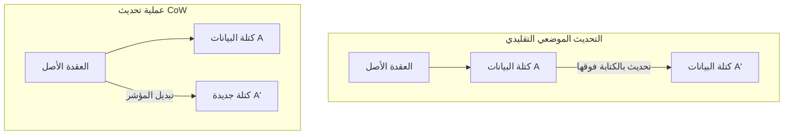
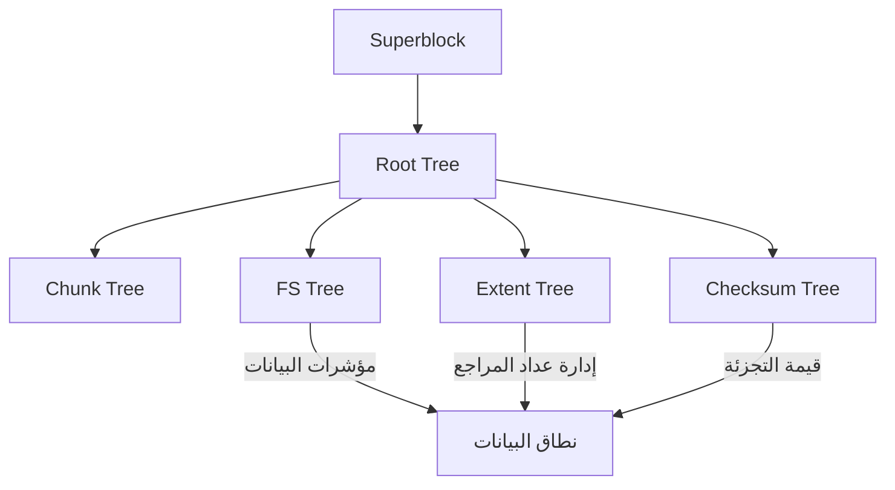

في بيئة الحوسبة الحديثة، تُعد "أنظمة الملفات" التي تضمن استمرارية البيانات واحدة من أهم المكونات الأساسية لنظام التشغيل. ومع ذلك، مع وصول سعة التخزين إلى نطاق البيتابايت والإكسابايت، وانتشار الذاكرة غير المتطايرة فائقة السرعة وذات السعة الكبيرة مثل SSD و NVMe، فإن أنظمة الملفات التقليدية التي ترث فلسفة التصميم منذ عقود مضت تقترب من حدودها المعمارية.

في هذا المقال، ومن منظور هندسة أنظمة الملفات وتخزين النواة والتخزين الموزع، سنقوم بتشريح مكثف للبنية الداخلية لاثنين من عمالقة أنظمة الملفات من الجيل التالي: **ZFS** و **Btrfs**. كيف يتحقق الاتساق في المعاملات الذي أحدثه تحول نموذج النسخ عند الكتابة (CoW)، ووسائل مكافحة فساد البيانات الصامت (Silent Data Corruption) باستخدام أشجار ميركل (أشجار التجزئة)، ومساحة التخزين ذات الإصلاح الذاتي بالمعنى الحقيقي للكلمة. سنكشف عن هذه الهياكل الرياضية العميقة وبراعة برمجة الأنظمة، متضمنةً مفاهيم على مستوى الكود المصدري.

---

## الفصل الأول: حدود أنظمة الملفات التقليدية (ext4/XFS) وفساد البيانات

تعتبر ext4، وهو نظام الملفات القياسي في نظام Linux الذي نستخدمه يوميًا، و XFS، الذي يتمتع بسجل حافل في بيئات المؤسسات، برمجيات ممتازة وناضجة للغاية. ومع ذلك، فإن أنظمة الملفات هذه تتبنى نموذج تحديث البيانات الكلاسيكي "التحديث الموضعي" (In-place update)، والذي يعاني من نقطة ضعف قاتلة في بيئات التخزين واسعة النطاق الحديثة.

### 1.1 حدود التحديث الموضعي ودفتر اليومية (Journaling)

التحديث الموضعي هو طريقة للكتابة فوق كتل البيانات الأصلية على وسيط التخزين مباشرة عند إجراء تغييرات على ملف. تسهّل هذه الطريقة الحفاظ على محلية الكتلة (Block Locality) وكانت مفيدة لتقليل وقت البحث في عصر الأقراص الصلبة (HDD).

المشكلة الأكبر في التحديث الموضعي هي انهيار "تناسق الأعطال" (Crash Consistency) عند حدوث انقطاع في التيار الكهربائي أو تعطل النظام أثناء التحديث. لمنع ذلك، تستخدم ext4 و XFS تقنية **تسجيل اليومية المسبق (Write-Ahead Logging; WAL)**. قبل تحديث البيانات، يتم أولاً كتابة التغييرات (البيانات الوصفية أو البيانات نفسها) بشكل متسلسل في منطقة دفتر اليومية، وبعد ذلك يتم تحديث شجرة نظام الملفات الفعلي.

ومع ذلك، تقوم أنظمة الملفات العامة بتمكين "يومية البيانات الوصفية" فقط لأسباب تتعلق بالأداء، ولا يتم تسجيل تحديث البيانات نفسها في دفتر اليومية. ونتيجة لذلك، في حالة حدوث عطل، يمكن استعادة اتساق البيانات الوصفية للملف (الحجم، الطابع الزمني، inode، إلخ)، ولكن يظل محتوى الملف نفسه معرضاً لخطر التواجد في حالة "الكتابة الممزقة" (Torn Write) حيث تختلط البيانات القديمة والجديدة.

### 1.2 فساد البيانات الصامت (Silent Data Corruption)

الأمر الأكثر رعباً هو **فساد البيانات الصامت (Silent Data Corruption)**. وهي ظاهرة تتغير فيها البيانات المخزنة بهدوء دون أن يلاحظها نظام التشغيل بسبب أخطاء في البرامج الثابتة لمراقب جهاز التخزين، أو انقلاب البتات (Bit Flip) في الذاكرة بسبب الأشعة الكونية، أو تدهور الكابلات، أو تضاؤل الشحنات والمغناطيسية بمرور الوقت.

أنظمة الملفات التقليدية لا تمتلك آلية للتحقق مما إذا كانت البيانات المقروءة "صحيحة". على الرغم من وجود رمز تصحيح الأخطاء (ECC) داخل وحدة تخزين الكتل (HDD و SSD)، إذا قرأ المراقب البيانات من الموقع الخطأ (Misdirected Read) أو إذا لم تتم الكتابة من الأساس (Phantom Write)، فإن وحدة التخزين نفسها ستبلغ بأنه "تمت قراءة البيانات بنجاح". يمرر نظام التشغيل البيانات الفاسدة كما هي إلى التطبيق، ويواصل التطبيق المعالجة دون أن يلاحظ الخلل، وفي النهاية يتم استبدال حتى النسخ الاحتياطية بالبيانات الفاسدة.

### 1.3 نهاية نظام RAID العتادي ومشكلة "ثقب الكتابة"

لطالما استخدم نظام RAID العتادي (مثل RAID 5 و RAID 6) لسنوات عديدة لزيادة توفر البيانات. ومع ذلك، نظرًا لأن RAID العتادي يتصرف أيضًا كـ "جهاز كتل بسيط" لا يفهم البنية الداخلية لنظام الملفات، فإنه لا يشكل حلاً جذرياً.

ما هو قاتل بشكل خاص هو **مشكلة ثقب الكتابة في نظام RAID (Write Hole)**. في RAID 5، في حالة انقطاع التيار الكهربائي أثناء تحديث كتل البيانات وكتل التكافؤ (Parity)، ينهار الاتساق بين البيانات والتكافؤ داخل الشريط (Stripe). عند القراءة في المرة القادمة، إذا تمت استعادة البيانات باستخدام هذا التكافؤ التالف، سيتم تدمير البيانات بصمت. علاوة على ذلك، نظرًا لعدم وجود مجاميع التحقق على جانب نظام الملفات، فإن متحكم RAID لا يملك أي وسيلة لتحديد منطقيًا "بيانات أي قرص هي الصحيحة".

لتجاوز حدود حزمة التخزين التقليدية هذه، حيث تنفصل الطبقات الفيزيائية، وطبقات الكتل، وطبقات أنظمة الملفات عن بعضها، وُلدت أنظمة الملفات من الجيل التالي التي تدير التخزين بأكمله بشكل متكامل.

---

## الفصل الثاني: التحول النموذجي للنسخ عند الكتابة (CoW)

النهج الثوري الذي تبنته ZFS و Btrfs هو **النسخ عند الكتابة (Copy-on-Write: CoW)**. لا يعد CoW مجرد ميزة، بل هو نقلة نوعية في هيكل البيانات وإدارة المعاملات لأنظمة الملفات.

### 2.1 التخلص من التحديثات الموضعية

في نظام ملفات CoW، لا يتم "مطلقاً" الكتابة فوق كتل البيانات الموجودة. عند تحديث البيانات، تُكتب البيانات دائماً في "مساحة فارغة جديدة" على التخزين. فقط بعد اكتمال الكتابة تماماً، يتم التبديل الآني لمؤشر العقدة الأصل (البيانات الوصفية) الذي يشير إلى تلك الكتلة من الكتلة القديمة إلى الكتلة الجديدة.

### 2.2 الاتساق المعاملي وسلسلة مؤشرات التخصيص

تدير أنظمة الملفات البيانات في هيكل شجري (Tree). عند كتابة كتلة بيانات، وهي عقدة ورقية (Leaf Node)، في موقع جديد، يتغير أيضاً محتوى العقدة الأصلية التي تحتوي على مؤشرها. لذلك يجب كتابة العقدة الأصلية في موقع جديد أيضًا. وتنتشر هذه العملية صعودًا حتى تصل إلى العقدة الجذرية.

في نهاية هذه السلسلة من التحديثات، يتم تحديث "الكتلة الفائقة" (Superblock، ويسمى Uberblock في ZFS) الموجودة في قمة الشجرة بأكملها بشكل ذري. في اللحظة التي تكتمل فيها هذه الكتابة الذرية الفردية، يتم تأكيد (Commit) المعاملة. في حالة حدوث انقطاع في التيار الكهربائي أثناء هذه العملية، فإن الكتلة الفائقة لا تزال تشير إلى الشجرة القديمة، لذلك سيبدأ النظام بحالة قديمة سليمة تماماً. وبالتالي، تصبح عمليات الإصلاح الطويلة بواسطة أداة التحقق من نظام الملفات (fsck) غير ضرورية مبدئيًا.

### 2.3 مبدأ إنشاء اللقطات (Snapshots) اللحظية

أكبر منتج ثانوي لـ CoW هو القدرة على إنشاء لقطات فائقة السرعة يمكن تنفيذها بتعقيد زمني $O(1)$.
عند نسخ دليل في نظام ملفات عادي، يجب استنساخ جميع البيانات ماديًا. لكن في CoW، تكتمل اللقطة بمجرد نسخ مؤشر العقدة الجذرية للشجرة وزيادة "عداد المراجع" (Reference Count) لكل عقدة.

عندما يتم تحديث البيانات، فإن الكتل التي يزيد عداد مراجعها عن 2 لا يتم استبدالها ويتم الاحتفاظ بها، ويتم كتابة التحديثات فقط في كتل جديدة. هذا يسمح بتجميد حالة نظام الملفات في أي وقت من الأوقات والاحتفاظ بها دون استهلاك مساحة التخزين.

---

## الفصل الثالث: البنية الداخلية لنظام ZFS

يتميز نظام ZFS (Zettabyte File System) الذي طورته Sun Microsystems (الآن Oracle) ببنية متكاملة يشار إليها بأنها "الكلمة الأخيرة في أنظمة الملفات". دمج ZFS بين مدير وحدات التخزين، ومراقب RAID، ونظام الملفات التقليدي في طبقة واحدة موحدة.

### 3.1 الهيكل ثلاثي الطبقات: SPA و DMU و ZPL

ينقسم الجزء الداخلي من ZFS بشكل أساسي إلى ثلاثة مكونات:

1. **SPA (Storage Pool Allocator)**
   يدير الأجهزة المادية (vdev: الأجهزة الافتراضية) في الطبقة السفلى. فهو يجرد أقراص HDD أو SSD في تجمع (Pool) ويوفر مساحة تخزين افتراضية واحدة ضخمة للطبقات العليا. تتولى هذه الطبقة عمليات الإدخال والإخراج لـ RAID-Z، وتجزئة البيانات (Striping)، والإصلاح الذاتي. يقع **Uberblock** في قمة SPA.
2. **DMU (Data Management Unit)**
   قلب ZFS. يدير جميع البيانات كـ "كائنات" ويتعامل مع معاملات CoW. إن DMU لا يهتم بنوع البيانات (دليل، ملف، سمات)، ولكنه مسؤول ببساطة عن التحديث الذري للعلاقة بين المفاتيح والقيم وكتل البيانات (dnode).
3. **ZPL (ZFS POSIX Layer)**
   مبني فوق نظام الكائنات في DMU، ويوفر واجهة نظام ملفات متوافقة مع POSIX (open، read، write، stat، إلخ) لنظام التشغيل.

### 3.2 Uberblock ومجموعة المعاملات (TXG)

في ZFS، لا يتم انعكاس عمليات الكتابة على القرص فورًا، بل يتم تجميعها في الذاكرة كـ "مجموعة معاملات (TXG)". يتم تفريغ TXGs على القرص في دفعات كل بضع ثوانٍ (وهذا ما يسمى بمزامنة المعاملات). في ذلك الوقت، يكتب SPA شجرة بيانات جديدة، وأخيراً يُحّدث عنصراً متكاملاً من مصفوفة Uberblock، وهو العنصر الذي يحمل أحدث رقم تسلسل.

### 3.3 سجل نوايا ZFS (ZIL) و SLOG

تتم معالجة عمليات الكتابة غير المتزامنة بكفاءة بواسطة TXG، ولكن بالنسبة للتطبيقات التي تتطلب "كتابة متزامنة" (Synchronous Write) من خلال `fsync()` مثل قواعد البيانات والأجهزة الافتراضية، فمن غير المقبول الانتظار بضع ثوانٍ لإتمام TXG.
وهنا يأتي دور **ZIL (ZFS Intent Log)**. بدلاً من إجراء تحديث كامل للشجرة (CoW)، يقوم ZIL بكتابة سجل تفاضلي للبيانات المتغيرة بسرعة على القرص. عند حدوث انهيار، تتم قراءة هذا الـ ZIL لإعادة بناء TXG في الذاكرة.

علاوة على ذلك، تعد وظيفة **SLOG (Separate Intent Log)** هي الميزة التي تتيح تخصيص جهاز معين، مثل NVDIMM أو NVMe SSD سريع كوجهة لكتابة ZIL. يؤدي ذلك إلى تحسين زمن وصول عمليات الكتابة المتزامنة بشكل كبير، حتى في تجمعات أقراص HDD البطيئة.

### 3.4 ARC و L2ARC: الخوارزمية القصوى لذاكرة التخزين المؤقت

يعتمد أداء القراءة في ZFS على **ARC (Adaptive Replacement Cache)**. على عكس ذاكرة التخزين المؤقت لصفحات نواة Linux التقليدية، والتي تعتمد في الغالب على LRU (الأقل استخداماً مؤخراً)، يستند ARC إلى خوارزمية ARC التي اقترحها Megiddo وآخرون من IBM.

يدير ARC ذاكرة التخزين المؤقت في القوائم الأربع التالية:
- **MRU (Most Recently Used)**: البيانات التي تم الوصول إليها مؤخراً.
- **MFU (Most Frequently Used)**: البيانات التي يتم الوصول إليها بشكل متكرر.
- **Ghost MRU**: قائمة تسجل البيانات الوصفية (المؤشرات) للبيانات التي تمت إزالتها من MRU.
- **Ghost MFU**: قائمة بالبيانات الوصفية للبيانات التي تمت إزالتها من MFU.

يراقب ARC عبء العمل، ويوسع MRU إذا تم تشغيل عملية مسح (مثل النسخ الاحتياطي)، ويوسع MFU إذا استمر الوصول المستمر إلى قاعدة البيانات. عند حدوث تطابق في قائمة Ghost، فإنه يحدد "لو تم الاحتفاظ بذاكرة التخزين المؤقت هذه، لكانت مطابقة"، ويقوم بضبط أحجام أقسام MRU و MFU ديناميكيًا.
علاوة على ذلك، من خلال تكوين **L2ARC (Level 2 ARC)** لتمرير البيانات المتدفقة من ARC إلى محركات SSD السريعة، يمكن بناء طبقة تخزين مؤقت على مستوى التيرابايت.

---

## الفصل الرابع: معمارية شجرة B في أنظمة Btrfs (B-tree of trees)

من ناحية أخرى، تم تصميم **Btrfs (B-tree file system)** كنظام ملفات من الجيل التالي أصلي في Linux من قبل Chris Mason وآخرين من Oracle. في حين يعكس ZFS بقوة فلسفة Solaris (الفصل الصارم للطبقات)، يتبنى Btrfs نهجًا يتكامل فيه بإحكام مع نظام ملفات Linux الافتراضي (VFS).

### 4.1 الهيكل الرياضي الذي يمثل كل شيء في شجرة B

السمة الأجمل والأكثر تعقيدًا في Btrfs هي أن "جميع البيانات الوصفية وهياكل إدارة البيانات في نظام الملفات تتكون من أشجار B نقية (أو بالأحرى نوع مشتق قريب من شجرة +B)". تم تصميم نموذج Btrfs كـ "شجرة من أشجار B" (B-tree of trees) عملاقة.

الأشجار الرئيسية هي كما يلي:
1. **Root tree (شجرة الجذر)**: تحتفظ بمؤشرات العقدة الجذرية وحالات جميع الأشجار الأخرى.
2. **Chunk tree**: تُعيّن كتل الجهاز المادي (العناوين المادية) إلى أجزاء (Chunks) في مساحة العنوان المنطقية. يتم حل ميزات RAID البرمجي (التجزئة والنسخ المتطابق) في طبقة هذه الشجرة.
3. **FS tree (شجرة نظام الملفات)**: تحتفظ بهيكل الدليل الفعلي، وأسماء الملفات، و inode، ومؤشرات بيانات الملفات.
4. **Extent tree**: تدير المساحة الفارغة في نظام الملفات بأكمله، والمراجع العكسية (Back-references) للنطاقات (Extents) المستخدمة (كتل متتالية من البيانات). هذا يعالج بكفاءة الزيادات والنقصان المعقدة في عدادات المراجع الناجمة عن CoW.
5. **Checksum tree**: شجرة تحتفظ بمجاميع التحقق لكتل البيانات فقط بشكل مستقل.

### 4.2 البحث والتحديث في CoW داخل شجرة B

عند تحديث البيانات في Btrfs، فإنه ينزل عبر الشجرة للعثور على الن النطاق الهدف. في حالة التحديث الموضعي، يتم فقط إعادة كتابة العقدة الورقية، ولكن في نظام CoW الخاص بـ Btrfs، يتم نسخ العقدة الورقية إلى منطقة فعلية جديدة وإعادة كتابتها. نتيجة لذلك، يصبح مؤشر العقدة الأصلية الذي كان يشير إلى تلك الورقة غير صالح، لذلك يتم أيضًا نسخ العقدة الأصلية وإعادة كتابتها. يصل هذا الأمر حتى Root tree.
خلال هذه العملية، تحتاج شجرة B إلى إعادة التوازن (تقسيم ودمج العقد). من أجل تعزيز أداء الوصول المتزامن في البيئات متعددة الخيوط، ينفذ Btrfs خوارزميات معالجة متقدمة لشجرة B تقلل من تعارضات القفل (Lock Contention).

### 4.3 وحدات التخزين الفرعية واللقطات (Subvolumes & Snapshots)

"وحدة التخزين الفرعية" (Subvolume) في Btrfs هي شجرة نظام ملفات مستقلة (FS tree) لها عقدتها الجذرية الخاصة بها. من وجهة نظر المستخدم، فهي تتصرف مثل الدليل، ولكن يتم التعامل معها كشجرة B مستقلة تمامًا داخل نظام الملفات.
اللقطة في Btrfs هي مجرد عملية نسخ العقدة الجذرية لوحدة تخزين فرعية معينة وتسجيلها كوحدة تخزين فرعية جديدة. لذلك، تمامًا كما في ZFS، يكتمل إنشاء اللقطة في لحظة.

---

## الفصل الخامس: مجاميع التحقق لشجرة ميركل وميزة الإصلاح الذاتي

الميزة التي تفصل بين ZFS و Btrfs بشكل حاسم عن أنظمة ملفات الجيل الأقدم هي "ضمان سلامة البيانات من خلال مجاميع التحقق المشفرة (أو غير المشفرة) القائمة على شجرة ميركل (شجرة التجزئة)"، و"الإصلاح الذاتي" (Self-Healing) باستخدامها.

### 5.1 التحقق من البيانات باستخدام معمارية شجرة ميركل

غالبًا ما تتضمن أنظمة الملفات القديمة وأنظمة RAID العتادية رمز اكتشاف أخطاء مضمنًا في كتلة البيانات نفسها. ومع ذلك، إذا تمت كتابة البيانات إلى موقع خاطئ على القرص (Misdirected Write)، سيتم الحكم على مجاميع التحقق للكتلة نفسها بأنها "متسقة"، ولن يتم اكتشاف الفساد.

لمنع حدوث ذلك، يتبنى ZFS و Btrfs **بنية شجرة ميركل**.
في حالة ZFS، لا يتم تخزين مجاميع التحقق لكتلة البيانات (مثل SHA-256 أو fletcher4) في الكتلة نفسها، بل في "العقدة الأصلية التي تشير إلى تلك الكتلة (أو بالأحرى، في بنية المؤشر الخاصة بها)". علاوة على ذلك، يتم تخزين مجاميع التحقق للعقدة الأصلية في الأصل الخاص بها، لتصل أخيرًا إلى Uberblock.

بفضل هذا، تعمل الشجرة بأكملها كسلسلة تجزئة عملاقة (Hash Chain). عند قراءة كتلة بيانات معينة، يحصل نظام التشغيل على مجاميع التحقق من العقدة الأصلية، ويحسب قيمة التجزئة للبيانات المقروءة، ويقارنهما. إذا لم تتطابق قيم التجزئة، فيمكن **الكشف بشكل مؤكد تمامًا** عما إذا كانت البيانات قد تضررت على القرص، أو إذا حدث انقلاب للبت في الذاكرة أو الكابلات على طول المسار.

### 5.2 التغلب على مشكلة ثقب الكتابة والإصلاح الذاتي في RAID-Z

يقوم RAID-Z الخاص بنظام ZFS (RAID-Z1/Z2/Z3) بالتخلص تمامًا من مشكلة ثقب الكتابة التي تعاني منها أقراص RAID 5/6 من خلال دمجها مع CoW.

في RAID 5، يكون عرض الشريط ثابتًا (على سبيل المثال، 3 كتل بيانات + 1 كتلة تكافؤ)، وكان هناك خطر حدوث تناقض عند تحديث كتل معينة فقط (عملية قراءة - تعديل - كتابة).
في RAID-Z، **يتغير عرض الشريط ديناميكيًا** وفقًا لحجم البيانات التي تتم كتابتها (عرض الشريط المتغير). نظرًا لأن جميع عمليات الكتابة تكون دائمًا بمثابة "كتابة شريط كامل إلى موقع جديد" (Full-Stripe Write)، فحتى لو حدث عطل أثناء عملية التحديث، فإن الشريط القديم يظل كما هو، بينما يتم فقط التخلص من الشريط الجديد، ومن المستحيل تمامًا حدوث تناقض في التكافؤ.

يتم حساب التكافؤ في RAID-Z2/Z3 بواسطة تشفير Reed-Solomon باستخدام رياضيات مبنية على الحقل المنتهي (Galois Field: GF(2^8)). من خلال عمليات مصفوفة معقدة، يمكن لـ Z3 استعادة البيانات من أي 3 أعطال في الأقراص.

عملية الإصلاح الذاتي تتم على النحو التالي:
1. يطلب التطبيق بيانات، ويقوم ZFS بقراءة الكتلة من القرص A.
2. التحقق من مجاميع التحقق واكتشاف عدم التطابق (الفساد).
3. يتجاهل ZFS بيانات القرص A، ويقوم بقراءة (أو حساب واستعادة) البيانات من تكافؤ RAID-Z أو من القرص B (في حالة النسخ المتطابق).
4. التحقق من مجاميع التحقق للبيانات المستعادة، وإذا كانت صحيحة، إعادتها إلى التطبيق.
5. **خلف الكواليس وتلقائيًا، يتم كتابة البيانات الصحيحة في كتلة جديدة على القرص A (عملية الإصلاح)، ويتم تحديث البيانات الوصفية.**

بدون تدخل مسؤول النظام، يكتشف التخزين فساده الذاتي ويقوم بالإصلاح بشكل مستقل.

### 5.3 العمليات الداخلية لإجراء التنظيف (Scrub)

إذا تم إجراء الإصلاحات فقط عند قراءة البيانات، فسيتم ترك البيانات الباردة التي يقل الوصول إليها لفترة طويلة، وسيكون هناك خطر عدم القدرة على الإصلاح إذا تعطلت أقراص متعددة في وقت واحد (تراكم Bit Rot).
ما يمنع ذلك هو عملية **التنظيف (Scrub)**. عند تشغيل أداة التنظيف، يمر نظام الملفات عبر بنية الشجرة من الجذر، ويقرأ جميع البيانات الوصفية وكتل البيانات الموجودة على القرص، ويعيد حساب مجاميع التحقق للتحقق منها. إذا تم العثور على شذوذ، يتم تنفيذ الإصلاح على الفور. يشبه هذا إجراء فحص التكافؤ (Patrol Read) في الأجهزة RAID، ولكنه يتحقق حتى من الهيكل المنطقي للبيانات الوصفية على مستوى نظام الملفات، مما يجعله أكثر موثوقية بكثير.

---

## الفصل السادس: مقارنة شاملة بين ZFS و Btrfs والتخزين المستقبلي

هناك اختلافات واضحة تستند إلى فلسفة التصميم والخلفية التاريخية بين ZFS و Btrfs اللذين يتنافسان على التفوق كأنظمة ملفات للجيل القادم. يتعين على مهندسي النظم اتخاذ الخيارات المناسبة بناءً على هذه الاختلافات.

### 6.1 استهلاك الذاكرة وخصائص الأداء

- **ZFS**: كما ذكرنا أعلاه، نظرًا لتطبيقه لـ ARC الفريد، فإنه يستهلك الذاكرة بقوة. فلسفة التصميم هي "استخدام أكبر قدر ممكن من الذاكرة"، ويوصى بتخصيص بضع جيجابايت على الأقل، وعشرات إلى مئات الجيجابايت من ذاكرة الوصول العشوائي (RAM) لاستخدامات المؤسسات لـ ARC. يتمتع بأداء لا يُقهر إذا كانت هناك ذاكرة كافية.
- **Btrfs**: مدمج بشكل وثيق مع ذاكرة التخزين المؤقت لصفحات نواة Linux القياسية (طبقة VFS). لذلك، يتم إبقاء بصمة الذاكرة عند نفس مستوى ext4 أو XFS، ويعمل بثبات حتى على أجهزة الحافة (Edge Devices)، والأنظمة المضمنة، والخوادم الافتراضية الصغيرة (VPS) ذات الموارد المحدودة.

### 6.2 مشكلة الترخيص: CDDL مقابل GPL

السبب الأكبر وراء عدم دمج ZFS في الفرع الرئيسي لنواة Linux (Mainline Tree) ليس فنيًا، بل يرجع إلى عدم التوافق في الترخيص. يعتبر ترخيص CDDL (ترخيص التطوير والتوزيع المشترك) الخاص بـ ZFS وترخيص GPLv2 الخاص بنواة Linux غير متوافقين قانونيًا. لذلك، لاستخدام ZFS على Linux، يجب تجميع وحدة النواة بشكل منفصل وتحميلها (OpenZFS).
في المقابل، تم تطوير Btrfs كـ GPL نقي، وهو مضمن بشكل افتراضي في نواة Linux. تم اعتماده كنظام الملفات الافتراضي في توزيعات Linux الرئيسية (مثل SUSE و Fedora).

### 6.3 حالات الاستخدام وأمثلة التبني

**مجال ZFS (OpenZFS)**:
يحظى بدعم هائل في أجهزة التخزين مثل TrueNAS، ومنصات Hypervisor مثل Proxmox VE و LXD، وخوادم النسخ الاحتياطي للمؤسسات حيث لا يُسمح أبدًا بفقدان البيانات. علاوة على ذلك، كان نظام الملفات القياسي في نظام التشغيل FreeBSD لسنوات عديدة.

**مجال Btrfs**:
يُستخدم كنظام ملفات الجذر للملايين من خوادم Linux في البنية التحتية لـ Facebook (Meta)، وأجهزة NAS الاستهلاكية والشركات الصغيرة والمتوسطة مثل Synology، وأنظمة تشغيل الألعاب مثل Steam Deck، وهو الافتراضي لـ Fedora Workstation، حيث يحظى بشعبية واسعة من خلال الاستفادة من إدارة وحدات التخزين المرنة وقدرات اللقطات الخاصة به.

### 6.4 نحو بنية تحتية للتخزين في عصر الحوسبة السحابية الأصلية

مع انتشار تقنية الحاويات (Docker / Kubernetes)، يُطلب من التخزين أن يكون قادراً على "إنشاء وتدمير اللقطات في ميلي ثانية" و "كفاءة طبقات صور الحاويات". وظائف CoW في ZFS و Btrfs مناسبة للغاية كبرامج تشغيل تخزين للحاويات (بدائل أو الواجهة الخلفية لـ overlayfs).

علاوة على ذلك، مع ظهور الأجهزة من الجيل التالي مثل الفصل والتشارك للتخزين (Storage Disaggregation) عبر CXL (Compute Express Link) و NVMe-oF، والتخزين الحسابي، يتطور نظام الملفات من مجرد "حاوية للبيانات" إلى "مستوى التحكم في البيانات" (Data Control Plane) الذي يدير التحكم وحماية البيانات، والتشفير، والضغط، وإزالة التكرار (Deduplication) بشكل متكامل.

إن نموذج "CoW والإصلاح الذاتي" الذي ابتكره كل من ZFS و Btrfs هو الدرع الأقوى لحماية الملكية الفكرية للبشرية من الانهيار المادي، في عصر تعتبر فيه البيانات مصدر كل قيمة. إننا نشهد الآن نهاية بنية التخزين التقليدية وفجر أنظمة الملفات الذكية والمستقلة من الجيل التالي.
