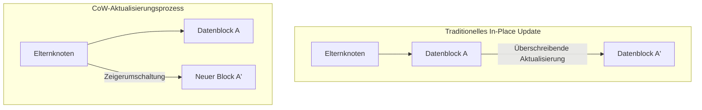
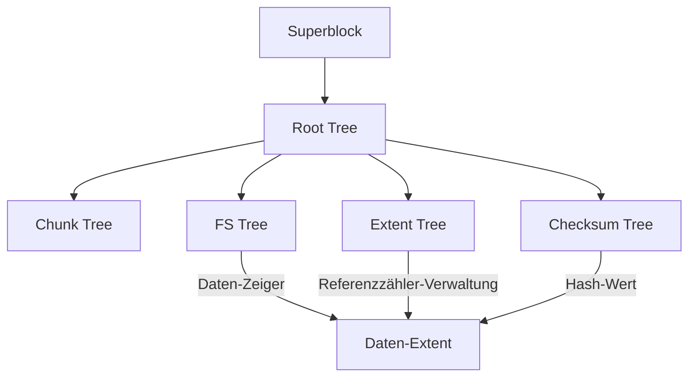

In der modernen Computerumgebung ist das "Dateisystem", welches die Dauerhaftigkeit von Daten gewährleistet, eine der wichtigsten Kernkomponenten eines Betriebssystems. Doch da die Speicherkapazitäten in den Petabyte- und Exabyte-Bereich vorstoßen und sich ultraschnelle, großvolumige nichtflüchtige Speicher wie SSDs und NVMe durchsetzen, stoßen traditionelle Dateisysteme, die auf jahrzehntealten Designphilosophien beruhen, an ihre architektonischen Grenzen.

In diesem Artikel werden wir die interne Architektur von **ZFS** und **Btrfs**, den beiden Giganten unter den Dateisystemen der nächsten Generation, aus der Perspektive des Dateisystem-Engineerings, der Kernel-Speicher und der verteilten Speichersysteme detailliert untersuchen. Wie werden die transaktionale Konsistenz, die durch den Paradigmenwechsel des Copy-on-Write (CoW) herbeigeführt wurde, die Abwehrmaßnahmen gegen stille Datenkorruption (Silent Data Corruption) mithilfe von Merkle-Bäumen (Hash-Bäumen) und echte selbstrearierende Speicher realisiert? Wir werden diese tiefe mathematische Struktur und die Meisterleistungen der Systemprogrammierung anhand von Konzepten auf Quellcode-Ebene entschlüsseln.

---

## Kapitel 1: Die Grenzen traditioneller Dateisysteme (ext4/XFS) und Datenkorruption

Das von uns im Alltag genutzte Linux-Standard-Dateisystem ext4 und XFS, das sich im Enterprise-Bereich bewährt hat, sind äußerst exzellente und ausgereifte Softwarelösungen. Diese Dateisysteme verwenden jedoch ein klassisches Datenaktualisierungsmodell namens "In-Place Update", welches in modernen großflächigen Speicherumgebungen fatale Schwächen aufweist.

### 1.1 In-Place-Updates und die Grenzen des Journaling

In-Place-Update ist eine Methode, bei der bei Änderungen an einer Datei der ursprüngliche Datenblock auf dem Speichermedium direkt überschrieben wird. Diese Methode erleichtert die Aufrechterhaltung der Block-Lokalität und war im HDD-Zeitalter vorteilhaft, um die Suchzeiten (Seek Time) zu minimieren.

Das größte Problem bei In-Place-Updates ist der Verlust der "Crash Consistency" (Konsistenz), wenn während einer Aktualisierung ein Stromausfall oder ein Systemabsturz auftritt. Um dies zu verhindern, verwenden ext4 und XFS **Journaling (Write-Ahead Logging; WAL)**. Vor der Datenaktualisierung werden die Änderungen (Metadaten oder die Daten selbst) sequenziell in einen Journalbereich geschrieben, bevor der tatsächliche Dateisystembaum aktualisiert wird.

Aus Leistungsgründen aktivieren allgemeine Dateisysteme jedoch nur das "Metadaten-Journaling", sodass die Aktualisierung der Daten selbst nicht im Journal aufgezeichnet wird. Folglich kann bei einem Absturz zwar die Konsistenz der Dateimetadaten (Größe, Zeitstempel, Inode usw.) wiederhergestellt werden, der Dateiinhalt selbst birgt jedoch das Risiko eines "Torn Write" (zerrissenen Schreibens), bei dem alte und neue Daten vermischt sind.

### 1.2 Silent Data Corruption (Stille Datenkorruption)

Noch beängstigender ist die **Silent Data Corruption (stille Datenkorruption)**. Dies ist ein Phänomen, bei dem sich gespeicherte Daten leise und vom Betriebssystem unbemerkt verändern, sei es durch Fehler in der Controller-Firmware des Speichergeräts, durch kosmische Strahlung verursachte Bitflips im Speicher, beschädigte Kabel oder durch den magnetischen bzw. elektrischen Verschleiß im Laufe der Zeit.

Traditionellen Dateisystemen fehlt ein Mechanismus, um zu überprüfen, ob gelesene Daten "korrekt" sind. Obwohl Block-Speicher (HDDs oder SSDs) intern über ECC (Fehlerkorrekturcode) verfügen, meldet die Speicher-Hardware selbst "erfolgreich gelesen", wenn der Controller Daten von einer falschen Stelle liest (Misdirected Read) oder wenn ein Schreibvorgang überhaupt nicht stattgefunden hat (Phantom Write). Das Betriebssystem übergibt die korrumpierten Daten unverändert an die Anwendung, die ihre Verarbeitung fortsetzt, ohne die Anomalie zu bemerken. Schließlich werden sogar Backups mit den korrumpierten Daten überschrieben.

### 1.3 Das Ende von Hardware-RAID und das "Write-Hole"-Problem

Hardware-RAID (RAID 5 oder RAID 6) wurde lange Zeit genutzt, um die Datenverfügbarkeit zu erhöhen. Da sich Hardware-RAID jedoch als "bloßes Blockgerät" verhält, das die interne Struktur des Dateisystems nicht versteht, bietet es keine grundlegende Lösung.

Besonders fatal ist das **RAID-Write-Hole-Problem**. Wenn bei RAID 5 während der Aktualisierung eines Datenblocks und eines Paritätsblocks ein Stromausfall auftritt, geht die Konsistenz zwischen Daten und Parität innerhalb des Stripes verloren. Wenn bei einem späteren Lesevorgang diese beschädigte Parität verwendet wird, um Daten wiederherzustellen, werden die Daten stillschweigend zerstört. Darüber hinaus hat der RAID-Controller keine Möglichkeit, logisch zu entscheiden, "welche Festplattendaten korrekt sind", da es auf Dateisystemebene keine Prüfsummen gibt.

Um diese Einschränkungen der traditionellen Speicher-Stacks zu überwinden, bei denen die physische Schicht, die Blockschicht und die Dateisystemschicht isoliert sind, wurden Dateisysteme der nächsten Generation entwickelt, die den gesamten Speicher als Einheit verwalten.

---

## Kapitel 2: Der Copy-on-Write (CoW) Paradigmenwechsel

Der revolutionäre Ansatz von ZFS und Btrfs ist **Copy-on-Write (CoW)**. CoW ist nicht nur eine Funktion, sondern ein Paradigmenwechsel in der Datenstruktur und Transaktionsverwaltung von Dateisystemen.

### 2.1 Abschaffung von In-Place-Updates

In CoW-Dateisystemen werden vorhandene Datenblöcke "niemals" überschrieben. Beim Aktualisieren von Daten werden diese immer in einen "neuen freien Bereich" auf dem Speicher geschrieben. Erst nachdem der Schreibvorgang vollständig abgeschlossen ist, wird der Zeiger des übergeordneten Knotens (Metadaten), der auf den Datenblock zeigt, atomar vom alten Block auf den neuen Block umgeschaltet.

### 2.2 Transaktionale Konsistenz und die Kette von Allokationszeigern

Das Dateisystem verwaltet Daten in einer Baumstruktur (Tree). Wenn ein Datenblock, der ein Blattknoten (Leaf) ist, an eine neue Position geschrieben wird, ändert sich auch der Inhalt des Elternknotens, der dessen Zeiger hält. Daher muss auch der Elternknoten an eine neue Position geschrieben werden. Dies pflanzt sich wie eine Kettenreaktion bis zum Wurzelknoten fort.

Am Ende dieser Serie von Aktualisierungen wird der "Superblock" (in ZFS als Uberblock bezeichnet) an der Spitze des gesamten Baums atomar aktualisiert. In dem Moment, in dem dieser einzige atomare Schreibvorgang abgeschlossen ist, wird die Transaktion bestätigt (Commit). Sollte mitten im Vorgang ein Stromausfall auftreten, zeigt der Superblock weiterhin auf den alten Baum, sodass das System im vollkommen intakten, alten Zustand bootet. Langwierige Reparaturarbeiten durch fsck (File System Check) sind prinzipiell unnötig.

### 2.3 Das Prinzip der sofortigen Snapshot-Erstellung

Das größte Nebenprodukt von CoW ist die Fähigkeit, extrem schnelle Snapshots mit einer Komplexität von $O(1)$ zu erstellen.
Wenn ein Verzeichnis in einem normalen Dateisystem kopiert wird, müssen alle Daten physisch dupliziert werden. Bei CoW hingegen wird ein Snapshot allein durch das Duplizieren des Zeigers des Wurzelknotens im Baum und das Inkrementieren des "Referenzzählers (Reference Count)" jedes Knotens abgeschlossen.

Wenn Daten aktualisiert werden, werden Blöcke mit einem Referenzzähler von 2 oder mehr nicht überschrieben, sondern beibehalten, und nur die Aktualisierung wird in einen neuen Block geschrieben. Dadurch ist es möglich, den Zustand des Dateisystems zu einem beliebigen Zeitpunkt sofort einzufrieren und beizubehalten, ohne Speicherplatz zu verbrauchen.

---

## Kapitel 3: Die interne Architektur von ZFS

ZFS (Zettabyte File System), entwickelt von Sun Microsystems (jetzt Oracle), verfügt über eine so ausgereifte Architektur, dass es oft als das "letzte Wort in Sachen Dateisysteme" bezeichnet wird. ZFS verschmilzt herkömmliche Volume-Manager, RAID-Controller und Dateisysteme zu einer einzigen, integrierten Ebene.

### 3.1 Die Drei-Schichten-Struktur: SPA, DMU, ZPL

Das Innere von ZFS ist grob in drei Komponenten unterteilt:

1. **SPA (Storage Pool Allocator)**
   Verwaltet physische Geräte (vdev: Virtual Device) auf der untersten Ebene. Er abstrahiert HDDs und SSDs als Pool und stellt den oberen Ebenen einen einzigen riesigen virtuellen Speicherraum zur Verfügung. Redundanz wie RAID-Z, Daten-Striping und I/O zur Selbstreparatur werden von dieser Ebene übernommen. An der Spitze des SPA befindet sich der **Uberblock**.
2. **DMU (Data Management Unit)**
   Das Herzstück von ZFS. Er verwaltet alle Daten als "Objekte" und verarbeitet CoW-Transaktionen. Der DMU kümmert sich nicht um den Datentyp (Verzeichnis, Datei, Attribut), sondern ist lediglich für die atomare Aktualisierung von Schlüsseln und Werten sowie für die Assoziation von Datenblöcken (dnode) verantwortlich.
3. **ZPL (ZFS POSIX Layer)**
   Baut auf dem Objektsystem des DMU auf und bietet dem Betriebssystem eine POSIX-kompatible Dateisystemschnittstelle (open, read, write, stat usw.).

### 3.2 Uberblock und Transaction Groups (TXG)

In ZFS werden Schreibvorgänge nicht sofort auf die Festplatte übertragen, sondern im Speicher gebündelt und als "Transaction Group (TXG)" zusammengefasst. TXGs werden alle paar Sekunden gebündelt auf die Festplatte gespült (dies wird als Transaktionssynchronisation bezeichnet). Zu diesem Zeitpunkt schreibt der SPA einen neuen Datenbaum und aktualisiert schließlich atomar denjenigen Uberblock im Array, der die neueste Sequenznummer aufweist.

### 3.3 ZFS Intent Log (ZIL) und SLOG

Während asynchrone Schreibvorgänge von TXG effizient verarbeitet werden, können Anwendungen wie Datenbanken oder virtuelle Maschinen, die "synchrone Schreibvorgänge (Synchronous Writes)" via `fsync()` erfordern, nicht auf einen mehrsekündigen TXG-Commit warten.
Hier kommt das **ZIL (ZFS Intent Log)** ins Spiel. Anstatt eine vollständige Baumaktualisierung (CoW) durchzuführen, schreibt das ZIL ein Differenzprotokoll der geänderten Daten mit hoher Geschwindigkeit auf die Festplatte. Bei einem Absturz wird dieses ZIL gelesen, um die TXG im Speicher wiederherzustellen.

Darüber hinaus gibt es das **SLOG (Separate Intent Log)**, eine Funktion, die dedizierte Geräte wie NVDIMMs oder schnelle NVMe-SSDs als Ziel für ZIL-Schreibvorgänge zuweist. Dadurch kann die Latenz für synchrone Schreibvorgänge drastisch verbessert werden, selbst wenn langsame HDD-Pools verwendet werden.

### 3.4 ARC und L2ARC: Ultimative Cache-Algorithmen

Die Leseleistung von ZFS wird durch den **ARC (Adaptive Replacement Cache)** untermauert. Während der traditionelle Page-Cache des Linux-Kernels hauptsächlich LRU (Least Recently Used: Verwerfen von Elementen, die in letzter Zeit nicht verwendet wurden) verwendet, basiert der ARC auf dem von Megiddo et al. bei IBM vorgeschlagenen ARC-Algorithmus.

Der ARC verwaltet den Cache in den folgenden vier Listen:
- **MRU (Most Recently Used)**: Kürzlich abgerufene Daten
- **MFU (Most Frequently Used)**: Häufig abgerufene Daten
- **Ghost MRU**: Liste, die aus MRU verdrängt wurde, in der aber nur Metadaten (Indizes) aufgezeichnet sind
- **Ghost MFU**: Metadatenliste, die aus MFU verdrängt wurde

Der ARC überwacht den Workload. Wenn ein Scan-Prozess (wie z.B. ein Backup) läuft, wird die MRU erweitert, und wenn konstante DB-Zugriffe erfolgen, wird die MFU erweitert. Wenn ein Hit in einer Ghost-Liste erfolgt, wird festgestellt, dass "es ein Hit gewesen wäre, wenn dieser Cache geblieben wäre", und die Partitionsgrößen von MRU und MFU werden dynamisch angepasst.
Durch die Konfiguration eines **L2ARC (Level 2 ARC)**, der Daten, die aus dem ARC überlaufen, auf schnelle SSDs auslagert, kann zudem eine Cache-Schicht im Terabyte-Bereich aufgebaut werden.

---

## Kapitel 4: Die B-Tree of Trees-Architektur von Btrfs

Andererseits wurde **Btrfs (B-tree file system)** von Chris Mason und anderen bei Oracle als natives Dateisystem der nächsten Generation für Linux entwickelt. Während ZFS die Solaris-Philosophie (strenge Schichtentrennung) stark widerspiegelt, verfolgt Btrfs einen Ansatz, der eng in das VFS (Virtual File System) von Linux integriert ist.

### 4.1 Eine mathematische Struktur, die alles mit B-Bäumen darstellt

Das schönste und zugleich komplexeste Merkmal von Btrfs ist, dass "alle Metadaten und Datenmanagementstrukturen im Dateisystem aus reinen B-Bäumen (streng genommen Derivaten, die B+-Bäumen ähneln) bestehen". Btrfs wird als riesiger "B-tree of trees (Baum von B-Bäumen)" modelliert.

Die Hauptbäume sind:
1. **Root tree (Wurzelbaum)**: Enthält Zeiger auf die Wurzelknoten und den Status aller anderen Bäume.
2. **Chunk tree**: Ordnet Blöcke physischer Geräte (physische Adressen) Chunks im logischen Adressraum zu. Software-RAID-Funktionen (Striping, Mirroring) werden in der Schicht dieses Baums aufgelöst.
3. **FS tree (Dateisystembaum)**: Behält die eigentliche Verzeichnisstruktur, Dateinamen, Inodes und Zeiger auf Dateidaten bei.
4. **Extent tree**: Verwaltet den freien Speicherplatz im gesamten Dateisystem und Back-References (Rückreferenzen) von verwendeten Extents (kontinuierliche Datenblöcke). Dadurch wird das komplexe Inkrementieren und Dekrementieren von Referenzzählern aufgrund von CoW effizient bewältigt.
5. **Checksum tree**: Ein Baum, der unabhängig nur die Prüfsummen von Datenblöcken hält.

### 4.2 CoW-Such- und Aktualisierungsalgorithmen in B-Bäumen

Beim Aktualisieren von Daten in Btrfs wandert es den Baum hinunter, um das Ziel-Extent zu finden. Bei einem In-Place-Update würde einfach der Blattknoten umgeschrieben. Beim CoW von Btrfs wird der Blattknoten jedoch in einen neuen physischen Bereich kopiert und dann neu geschrieben. Folglich wird der Zeiger des Elternknotens, der auf dieses Blatt zeigte, ungültig, sodass auch der Elternknoten kopiert und umgeschrieben wird. Dieser Vorgang erreicht schließlich den Root tree.
Während dieses Prozesses muss der B-Baum eine Neuausrichtung (Teilen und Zusammenführen von Knoten) durchführen. Um die Leistung beim gleichzeitigen Zugriff in Multi-Thread-Umgebungen zu verbessern, implementiert Btrfs fortschrittliche B-Baum-Operationsalgorithmen, die Lock-Konflikte minimieren.

### 4.3 Subvolumes und Snapshots

Ein "Subvolume" in Btrfs ist ein unabhängiger FS tree mit einem eigenen Root-Knoten. Für den Benutzer verhält es sich wie ein Verzeichnis, wird aber innerhalb des Dateisystems als völlig eigenständiger B-Baum behandelt.
Ein Snapshot in Btrfs ist einfach die Operation, den Root-Knoten eines Subvolumes zu duplizieren und als neues Subvolume zu registrieren. Daher erfolgt die Erstellung von Snapshots, ähnlich wie bei ZFS, augenblicklich.

---

## Kapitel 5: Merkle-Baum-Prüfsummen und Selbstreparaturfunktionen

Das Merkmal, das ZFS und Btrfs entscheidend von Dateisystemen früherer Generationen unterscheidet, ist "die Garantie der Datenintegrität durch kryptografische (oder nicht-kryptografische) Prüfsummen basierend auf Merkle-Bäumen (Hash-Bäumen)" und die darauf basierende "Selbstreparatur (Self-Healing)".

### 5.1 Datenüberprüfung durch Merkle-Baum-Architektur

Herkömmliche Dateisysteme und Hardware-RAID betten oft Fehlererkennungscodes in die Datenblöcke selbst ein. Wenn jedoch Daten an die falsche Stelle auf der Festplatte geschrieben werden (Misdirected Write), wird die Prüfsumme des Blocks selbst als "konsistent" beurteilt, und eine Beschädigung kann nicht erkannt werden.

Um dies zu verhindern, verwenden ZFS und Btrfs eine **Merkle-Baum-Struktur**.
Im Falle von ZFS wird die Prüfsumme (SHA-256, fletcher4 usw.) eines Datenblocks nicht im Block selbst, sondern im "Elternknoten (dessen Zeigerstruktur), der auf diesen Block zeigt" gespeichert. Die Prüfsumme des Elternknotens wird wiederum in dessen Elternteil gespeichert, was letztendlich bis zum Uberblock führt.

Dadurch fungiert der gesamte Baum als eine einzige riesige Hash-Kette. Wenn ein Datenblock gelesen wird, ruft das Betriebssystem die Prüfsumme vom Elternknoten ab, berechnet den Hash-Wert der gelesenen Daten und vergleicht diese. Stimmen die Hash-Werte nicht überein, kann mit **absoluter Sicherheit erkannt** werden, dass die Daten auf der Festplatte korrumpiert sind oder dass Bitflips im Speicher oder Kabel auf dem Übertragungsweg aufgetreten sind.

### 5.2 Überwindung des Write-Hole-Problems und Selbstreparatur in RAID-Z

ZFS's RAID-Z (RAID-Z1/Z2/Z3) löst das Write-Hole-Problem herkömmlicher RAID 5/6 vollständig, indem es mit CoW kombiniert wird.

Bei RAID 5 ist die Stripe-Breite (z. B. 3 Datenblöcke + 1 Paritätsblock) festgelegt, weshalb ein Inkonsistenzrisiko bestand, wenn nur ein Teil der Blöcke aktualisiert wurde (Read-Modify-Write).
In RAID-Z ändert sich die **Stripe-Breite dynamisch** entsprechend der Größe der zu schreibenden Daten (Variable Stripe Width). Jeder Schreibvorgang ist immer ein "Full-Stripe-Write an einem neuen Ort", sodass selbst bei einem Absturz mitten in der Aktualisierung der alte Stripe unverändert bleibt, der neue Stripe einfach verworfen wird und niemals eine Paritätsinkonsistenz auftritt.

Die Paritätsberechnung in RAID-Z2/Z3 erfolgt durch Reed-Solomon-Codierung mithilfe von Mathematik über endlichen Körpern (Galois-Körper: GF(2^8)). Durch komplexe Matrixoperationen können bei Z3 Daten nach dem Ausfall beliebiger drei Festplatten wiederhergestellt werden.

Der Selbstreparaturprozess verläuft wie folgt:
1. Die Anwendung fordert Daten an, und ZFS liest den Block von Festplatte A.
2. Die Prüfsumme wird verifiziert und eine Diskrepanz (Korruption) wird erkannt.
3. ZFS verwirft die Daten von Festplatte A und liest die Daten aus der RAID-Z-Parität oder von der gespiegelten Festplatte B (oder stellt sie rechnerisch wieder her).
4. Die Prüfsumme der wiederhergestellten Daten wird verifiziert; wenn sie korrekt ist, werden die Daten an die Anwendung zurückgegeben.
5. **Im Hintergrund werden die korrekten Daten automatisch in einen neuen Block auf Festplatte A geschrieben (Reparatur) und die Metadaten aktualisiert.**

Ohne Eingreifen eines Systemadministrators erkennt der Speicher seine eigene Korruption und repariert sich autonom.

### 5.3 Die interne Funktionsweise des Scrub-Prozesses

Wenn Reparaturen nur beim Lesen von Daten durchgeführt würden, bestünde die Gefahr, dass selten genutzte "Cold Data" lange Zeit unangetastet bleiben und durch gleichzeitige Ausfälle mehrerer Festplatten irreparabel werden (Akkumulation von Bit Rot).
Dies wird durch **Scrub** verhindert. Wenn ein Scrub ausgeführt wird, durchläuft das Dateisystem die Baumstruktur systematisch von der Wurzel an, liest alle Metadaten und Datenblöcke auf der Festplatte und berechnet und verifiziert die Prüfsummen neu. Wird eine Anomalie gefunden, wird sofort eine Reparatur ausgeführt. Dies ähnelt der Paritätsprüfung bei Hardware-RAID (Patrol Read), bietet jedoch eine weitaus höhere Zuverlässigkeit, da es auch die logische Struktur von Metadaten auf Dateisystemebene einbezieht.

---

## Kapitel 6: ZFS vs. Btrfs – Detaillierter Vergleich und die Zukunft der Speicher

Es gibt klare Unterschiede zwischen ZFS und Btrfs, die als Dateisysteme der nächsten Generation um die Vorherrschaft kämpfen, basierend auf ihren Designphilosophien und historischen Hintergründen. Systemarchitekten müssen diese je nach ihren Anforderungen angemessen auswählen.

### 6.1 Speicherverbrauch und Leistungsmerkmale

- **ZFS**: Da es, wie oben erwähnt, seinen eigenen ARC implementiert, verbraucht es sehr aggressiv Arbeitsspeicher. Die Designphilosophie lautet "Verwende so viel Speicher, wie vorhanden ist". Es wird empfohlen, dem ARC mindestens einige GB und in Enterprise-Anwendungen mehrere Dutzend bis Hunderte GB RAM zuzuweisen. Wenn ausreichend Speicher vorhanden ist, bietet es eine unschlagbare Leistung.
- **Btrfs**: Es ist eng in den Standard-Page-Cache des Linux-Kernels (VFS-Schicht) integriert. Daher wird sein Speicherbedarf auf dem Niveau von ext4 oder XFS gehalten, was einen stabilen Betrieb auch auf Edge-Geräten, eingebetteten Systemen und kleinen VPS mit begrenzten Ressourcen ermöglicht.

### 6.2 Lizenzierungsprobleme: CDDL vs. GPL

Der Hauptgrund, warum ZFS nicht in die Mainline (den Standard-Baum) des Linux-Kernels integriert wurde, ist nicht technischer Natur, sondern beruht auf Lizenzinkompatibilitäten. Es wird rechtlich als unvereinbar angesehen, dass ZFS die CDDL (Common Development and Distribution License) und der Linux-Kernel die GPLv2 verwendet. Daher wird ZFS unter Linux normalerweise verwendet, indem ein Kernelmodul separat kompiliert und geladen wird (OpenZFS).
Im Gegensatz dazu wurde Btrfs unter der reinen GPL entwickelt und ist standardmäßig im Linux-Kernel enthalten. In den wichtigsten Linux-Distributionen (SUSE, Fedora usw.) wird es als Standard-Dateisystem verwendet.

### 6.3 Anwendungsfälle und Anwendungsbeispiele

**Der Bereich von ZFS (OpenZFS)**:
Es erfreut sich enormer Beliebtheit bei Speicher-Appliances wie TrueNAS, Hypervisor-Infrastrukturen wie Proxmox VE und LXD sowie bei Enterprise-Backup-Servern, bei denen ein Datenverlust absolut inakzeptabel ist. Außerdem ist es seit vielen Jahren das Standard-Dateisystem in FreeBSD.

**Der Bereich von Btrfs**:
Es ist weit verbreitet im Root-Dateisystem für Millionen von Linux-Servern in der Infrastruktur von Facebook (Meta), auf Consumer/SMB-NAS von Unternehmen wie Synology, in Gaming-Betriebssystemen wie dem Steam Deck und als Standard in der Fedora Workstation, wobei es seine flexiblen Volume-Management- und Snapshot-Funktionen voll ausspielt.

### 6.4 Auf dem Weg zu einer Speicherinfrastruktur im Cloud-Native-Zeitalter

Mit der Verbreitung der Container-Technologie (Docker/Kubernetes) werden an den Speicher Anforderungen gestellt wie "Erstellen und Löschen von Snapshots im Millisekundenbereich" und "Effizienzverbesserung des Layerings von Container-Images". Die CoW-Funktionalität von ZFS und Btrfs harmoniert extrem gut als Container-Speichertreiber (als Alternative oder Backend für overlayfs).

Darüber hinaus entwickeln sich Dateisysteme angesichts des Aufkommens von Hardware der nächsten Generation wie CXL (Compute Express Link), Speicher-Disaggregation durch NVMe-oF (Trennung und gemeinsame Nutzung) und Computational Storage von bloßen "Datencontainern" zu einer "Data Control Plane", die Datenschutz, Verschlüsselung, Komprimierung und Deduplizierung integriert steuert.

Das von ZFS und Btrfs etablierte Paradigma "CoW und Selbstreparatur" ist in der heutigen Welt, in der Daten die Quelle allen Wertes sind, der stärkste Schild zum Schutz des geistigen Eigentums der Menschheit vor dem physischen Verfall. Wir werden jetzt Zeugen des Endes traditioneller Speicherarchitekturen und der Morgendämmerung intelligenter, autonomer Dateisysteme der nächsten Generation.
