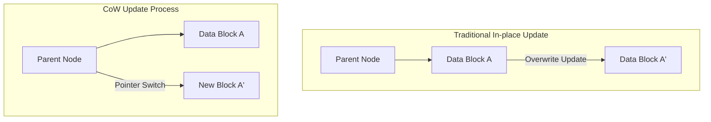
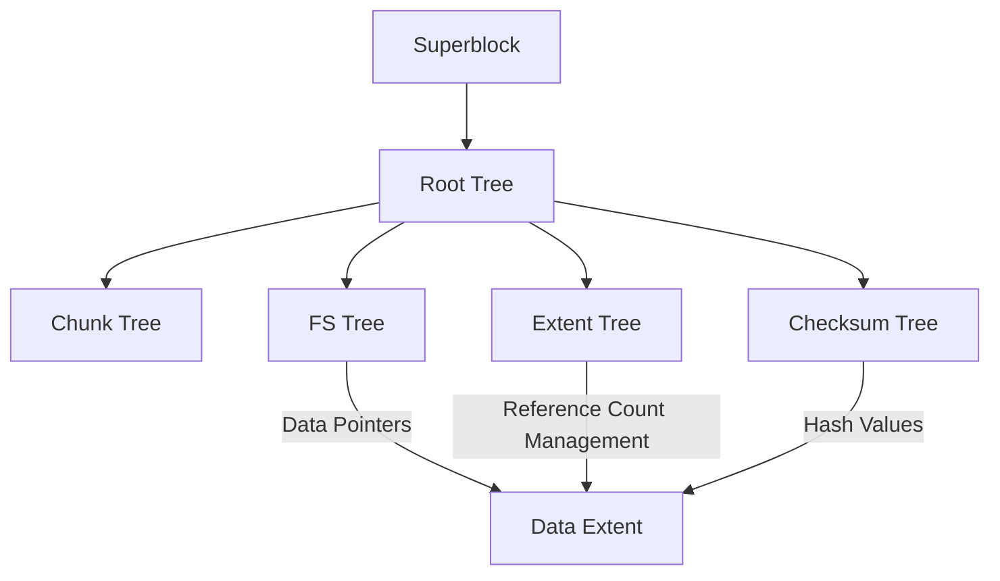

In the modern computing environment, the "filesystem", which ensures data persistence, is one of the most critical components at the core of operating systems. However, as storage capacities enter the petabyte and exabyte realms, and ultra-fast, high-capacity non-volatile memories like SSDs and NVMe become widespread, traditional filesystems inheriting design philosophies from decades ago are reaching their architectural limits.

This article thoroughly dissects the internal architectures of **ZFS** and **Btrfs**, the two titans of next-generation filesystems, from the perspectives of filesystem engineering, kernel storage, and distributed storage. We will unravel how the paradigm shift of Copy-on-Write (CoW) brings transactional consistency, how countermeasures against Silent Data Corruption using Merkle trees (hash trees) work, and how true self-healing storage is realized. Their profound mathematical structures and the mastery of system programming will be elucidated, incorporating concepts at the source code level.

---

## Chapter 1: Limitations of Traditional Filesystems (ext4/XFS) and Data Corruption

The standard Linux filesystems we use daily, such as ext4, and XFS, which boasts a strong track record in the enterprise sector, are extremely excellent and mature software. However, these filesystems adopt a classical data update model called "In-place update," which harbors fatal weaknesses in modern large-scale storage environments.

### 1.1 Limits of In-place Updates and Journaling

In-place update is a method where the original data blocks on the storage media are directly overwritten when modifying a file. This approach is advantageous for maintaining block locality, which helped minimize seek times during the HDD era.

The biggest issue with in-place updates is the collapse of "crash consistency" if a power failure or system crash occurs during an update. To prevent this, ext4 and XFS employ **Write-Ahead Logging (WAL) or Journaling**. Before updating data, the changes (metadata, or the data itself) are first written sequentially to a journal area, after which the actual filesystem tree is updated.

However, for performance reasons, typical filesystems only enable "metadata journaling," meaning updates to the data itself are not recorded in the journal. Consequently, during a crash, while the consistency of the file's metadata (size, timestamps, inodes, etc.) can be recovered, the file's content itself risks falling into a "Torn Write" state, where old and new data are mixed together.

### 1.2 Silent Data Corruption

Even more terrifying is **Silent Data Corruption**. This is a phenomenon where stored data silently changes without the OS noticing, due to bugs in storage device controller firmware, bit flips in memory caused by cosmic rays, cable degradation, or the attenuation of magnetism/charge over time.

Traditional filesystems lack mechanisms to verify if the read data is "correct". Although ECC (Error Correction Code) exists inside block storage (HDDs and SSDs), if the controller reads data from the wrong location (Misdirected Read) or if the write never occurred in the first place (Phantom Write), the storage hardware itself will report that it was "read successfully." The OS passes the corrupted data as-is to applications, which continue processing oblivious to the anomaly, and eventually, even backups are overwritten with the corrupted data.

### 1.3 The Demise of Hardware RAID and the "Write Hole" Problem

Hardware RAID (RAID 5 and RAID 6) has long been used to enhance data availability. However, since hardware RAID acts as a "mere block device" that does not understand the internal structure of the filesystem, it does not provide a fundamental solution.

Particularly fatal is the **RAID Write Hole problem**. In RAID 5, if a power loss occurs while updating data and parity blocks within a stripe, the consistency between data and parity in that stripe is broken. If this broken parity is used to restore data upon the next read, the data is silently destroyed. Furthermore, because there are no checksums on the filesystem side, the RAID controller has no logical way to determine "which disk's data is correct."

To shatter the limitations of the conventional storage stack—where the physical layer, block layer, and filesystem layer are fragmented—next-generation filesystems were born to manage the entire storage comprehensively.

---

## Chapter 2: Copy-on-Write (CoW) Paradigm Shift

The revolutionary approach adopted by ZFS and Btrfs is **Copy-on-Write (CoW)**. CoW is not merely a feature, but a paradigm shift in filesystem data structures and transaction management.

### 2.1 Elimination of In-place Updates

In CoW filesystems, existing data blocks are "never" overwritten. When updating data, the new data is always written to a "new free space" on the storage. Only after the write is completely finished is the pointer of the parent node (metadata) pointing to that data block atomically switched from the old block to the new block.

### 2.2 Transactional Consistency and Chains of Allocation Pointers

Filesystems manage data in tree structures. When a data block, which is a leaf node, is written to a new location, the contents of the parent node holding its pointer also change. Therefore, the parent node must also be written to a new location. This cascades all the way up to the root node.

At the end of this series of updates, the "Superblock" (called Uberblock in ZFS) at the apex of the entire tree is atomically updated. The moment this single atomic write completes, the transaction is finalized (committed). If a power failure occurs midway, the superblock still points to the old tree, so the system boots completely unharmed in its old state. Time-consuming repair operations like fsck (filesystem check) become theoretically unnecessary.

### 2.3 The Principle of Instantaneous Snapshot Creation

The greatest byproduct of CoW is ultra-fast snapshots executable in $O(1)$ time complexity.
Normally, copying a directory in a standard filesystem requires physically duplicating all the data. However, in CoW, a snapshot is completed simply by duplicating the pointer to the tree's root node and incrementing the "Reference Count" of each node.

When data is updated, blocks with a reference count of 2 or more are not overwritten but preserved, and only the updated portions are written to new blocks. This allows the state of the filesystem at any given moment to be instantly frozen and retained without consuming storage space.

---

## Chapter 3: ZFS Internal Architecture

Developed by Sun Microsystems (now Oracle), ZFS (Zettabyte File System) possesses an architecture so complete that it is often hailed as "the final word in filesystems." ZFS fuses the traditional volume manager, RAID controller, and filesystem into a single, unified layer.

### 3.1 Three-Tier Architecture: SPA, DMU, ZPL

The internals of ZFS are broadly divided into three components.

1. **SPA (Storage Pool Allocator)**
   Manages physical devices (vdevs: Virtual Devices) at the lowest level. It abstracts HDDs and SSDs as a pool and provides a single, massive virtual storage space to the upper layers. Redundancy like RAID-Z, data striping, and I/O for self-healing are handled by this layer. At the top of the SPA resides the **Uberblock**.
2. **DMU (Data Management Unit)**
   The heart of ZFS. It manages all data as "objects" and handles CoW transactions. The DMU is oblivious to data types (directories, files, attributes) and is solely responsible for atomically updating keys, values, and their associations to data blocks (dnodes).
3. **ZPL (ZFS POSIX Layer)**
   Built on top of the DMU's object system, providing a POSIX-compliant filesystem interface (open, read, write, stat, etc.) to the OS.

### 3.2 Uberblocks and Transaction Groups (TXG)

In ZFS, writes are not immediately reflected on disk; they are batched in memory as "Transaction Groups (TXG)". TXGs are flushed to disk collectively every few seconds (this is called transaction synchronization). At this time, the SPA writes the new data tree and finally atomically updates the Uberblock with the newest sequence number among the Uberblock array.

### 3.3 ZFS Intent Log (ZIL) and SLOG

While asynchronous writes are handled efficiently by TXGs, applications requiring "Synchronous Writes" via `fsync()`—like databases or virtual machines—cannot afford to wait for a TXG commit taking several seconds.
This is where the **ZIL (ZFS Intent Log)** comes in. Instead of performing a full tree update (CoW), the ZIL quickly writes a differential log of the modified data to disk. Upon a crash, this ZIL is read to reconstruct the in-memory TXG.

Furthermore, the feature of assigning dedicated devices such as NVDIMMs or fast NVMe SSDs as the write destination for the ZIL is called **SLOG (Separate Intent Log)**. This drastically improves the latency of synchronous writes, even on slow HDD pools.

### 3.4 ARC and L2ARC: The Ultimate Caching Algorithms

ZFS's read performance is underpinned by the **ARC (Adaptive Replacement Cache)**. While the traditional Linux kernel page cache primarily uses LRU (Least Recently Used), the ARC is based on the ARC algorithm proposed by Megiddo et al. at IBM.

ARC manages cache using the following four lists:
- **MRU (Most Recently Used)**: Recently accessed data
- **MFU (Most Frequently Used)**: Frequently accessed data
- **Ghost MRU**: A list keeping only metadata (indices) of data evicted from MRU
- **Ghost MFU**: A metadata list of data evicted from MFU

ARC monitors workloads; if a scan operation (like a backup) runs, it expands the MRU, and if steady DB access continues, it expands the MFU. If a hit occurs in a Ghost list, it determines "if this cache had remained, it would have been a hit," and dynamically adjusts the partition sizes of MRU and MFU.
Additionally, by configuring **L2ARC (Level 2 ARC)** to offload data evicted from ARC onto fast SSDs, a terabyte-class caching layer can be constructed.

---

## Chapter 4: Btrfs's B-tree of Trees Architecture

On the other hand, **Btrfs (B-tree file system)**, designed by Chris Mason at Oracle and others, is a Linux-native next-generation filesystem. While ZFS heavily reflects Solaris's philosophy (strict separation of layers), Btrfs takes an approach tightly integrated with Linux's VFS (Virtual File System).

### 4.1 A Mathematical Structure Representing Everything as B-trees

The most beautiful and complex feature of Btrfs is that "every piece of metadata and data management structure in the filesystem is composed of pure B-trees (strictly speaking, variants closer to B+ trees)." Btrfs is modeled as a massive "B-tree of trees."

The main trees are as follows:
1. **Root tree**: Holds the pointers and states of the root nodes of all other trees.
2. **Chunk tree**: Maps physical device blocks (physical addresses) to chunks in the logical address space. Software RAID features (striping, mirroring) are resolved at this tree's layer.
3. **FS tree (Filesystem tree)**: Holds the actual directory structures, filenames, inodes, and pointers to file data.
4. **Extent tree**: Manages the free space of the entire filesystem and back-references for in-use extents (contiguous blocks of data). This efficiently handles the complex incrementing and decrementing of reference counts caused by CoW.
5. **Checksum tree**: A tree that independently holds only the checksums of data blocks.

### 4.2 CoW Traversal and Update Algorithms in B-trees

When updating data in Btrfs, it traverses down the tree to find the target extent. While an in-place update would just overwrite the leaf node, Btrfs's CoW copies the leaf node to a new physical area and rewrites it. This invalidates the pointer in the parent node that pointed to that leaf, so the parent node is also copied and rewritten. This reaches all the way to the Root tree.
In this process, the B-tree needs to rebalance (split or merge nodes). To enhance concurrent access performance in multi-threaded environments, Btrfs implements advanced B-tree manipulation algorithms that minimize lock contention.

### 4.3 Subvolumes and Snapshots

A "subvolume" in Btrfs is an independent FS tree with its own Root node. From the user's perspective, it behaves like a directory, but internally within the filesystem, it is treated as a completely independent B-tree.
A snapshot in Btrfs is merely the operation of duplicating a subvolume's Root node and registering it as a new subvolume. Therefore, just like in ZFS, creating a snapshot is completed in an instant.

---

## Chapter 5: Merkle Tree Checksums and Self-Healing Functions

The feature that decisively separates ZFS and Btrfs from previous generation filesystems is "the guarantee of data integrity via cryptographic (or non-cryptographic) checksums based on Merkle trees (hash trees)" and the "Self-Healing" capabilities that utilize them.

### 5.1 Data Verification via Merkle Tree Architecture

Traditional filesystems and hardware RAIDs often embed error detection codes within the data blocks themselves. However, if data is written to the wrong location on disk (Misdirected Write), the block's own checksum will be evaluated as "consistent," and corruption cannot be detected.

To prevent this, ZFS and Btrfs adopt a **Merkle tree structure**.
In the case of ZFS, the checksum of a data block (SHA-256, fletcher4, etc.) is stored not in the block itself, but in "the parent node (its pointer structure) that points to that block." Furthermore, the parent node's checksum is stored in its parent, ultimately reaching the Uberblock.

Thus, the entire tree functions as a single giant hash chain. When the OS reads a data block, it retrieves the checksum from the parent node, calculates the hash value of the read data, and compares them. If the hash values do not match, it can detect with **absolute certainty** that the data has rotted on the disk or that a bit flip occurred in memory or cables along the path.

### 5.2 Overcoming the Write Hole Problem and Self-Healing in RAID-Z

ZFS's RAID-Z (RAID-Z1/Z2/Z3) completely eliminates the Write Hole problem plagued by traditional RAID 5/6 by combining it with CoW.

In RAID 5, the stripe width is fixed (e.g., 3 data blocks + 1 parity block), posing a risk of inconsistency when updating only some blocks (Read-Modify-Write).
In RAID-Z, the **stripe width dynamically changes** according to the size of the data being written (Variable Stripe Width). Every write is always a "Full-Stripe Write to a new location," so even if a crash occurs mid-update, the old stripe remains intact, the new stripe is simply discarded, and parity inconsistencies absolutely never occur.

Parity calculations in RAID-Z2/Z3 are performed through Reed-Solomon encoding using mathematics over a finite field (Galois Field: GF(2^8)). Through complex matrix operations, Z3 can restore data from simultaneous failures of any 3 disks.

The self-healing process is as follows:
1. An application requests data, and ZFS reads the block from Disk A.
2. It verifies the checksum and detects a mismatch (corruption).
3. ZFS discards the data from Disk A and reads the data from RAID-Z parity or a mirrored Disk B (or restores it via calculation).
4. It verifies the checksum of the restored data, and if correct, returns the data to the application.
5. **In the background, it automatically writes the correct data to a new block on Disk A (healing) and updates the metadata.**

Without intervention from system administrators, the storage detects its own corruption and autonomously performs repairs.

### 5.3 Internal Workings of the Scrub Process

If healing only occurs upon reading data, infrequently accessed cold data could be left unread for long periods, risking becoming unrecoverable due to simultaneous multiple disk failures (accumulation of Bit Rot).
To prevent this, there is the **Scrub** process. When a scrub is executed, the filesystem traverses the tree structure from the root, reads all metadata and data blocks on the disk, recalculates checksums, and verifies them. If anomalies are found, it immediately executes repairs. This is similar to a hardware RAID parity check (Patrol Read), but because it verifies up to the logical structure of the metadata at the filesystem level, the reliability is overwhelmingly higher.

---

## Chapter 6: Thorough Comparison of ZFS vs Btrfs and the Future of Storage

There are distinct differences based on design philosophies and historical backgrounds between ZFS and Btrfs, competing for supremacy as next-generation filesystems. System architects must choose them appropriately according to requirements.

### 6.1 Memory Consumption and Performance Characteristics

- **ZFS**: As mentioned earlier, because it implements the unique ARC, it consumes memory very aggressively. Its design philosophy is "use as much memory as available," and it is recommended to allocate at least several GBs, or tens to hundreds of GBs of RAM for ARC in enterprise use cases. With ample memory, it boasts unrivaled performance.
- **Btrfs**: Closely integrated with the Linux kernel's standard page cache (VFS layer). Therefore, its memory footprint is kept comparable to ext4 and XFS, allowing it to operate stably on resource-constrained edge devices, embedded systems, and small-scale VPSs.

### 6.2 Licensing Issues: CDDL vs GPL

The biggest reason ZFS hasn't been merged into the Linux kernel mainline (standard tree) is not technical, but due to license incompatibility. ZFS's CDDL (Common Development and Distribution License) and the Linux kernel's GPLv2 are considered legally incompatible. Therefore, using ZFS on Linux takes the form of separately compiling and loading a kernel module (OpenZFS).
In contrast, Btrfs is developed under pure GPL and comes standard with the Linux kernel. Major Linux distributions (SUSE, Fedora, etc.) have adopted it as their default filesystem.

### 6.3 Use Cases and Adoption Examples

**The Realm of ZFS (OpenZFS)**:
It has gained immense support in storage appliances like TrueNAS, hypervisor infrastructures like Proxmox VE and LXD, and enterprise backup servers where data loss is absolutely unacceptable. It has also reigned as the standard filesystem in FreeBSD for many years.

**The Realm of Btrfs**:
It is widely popular for its flexible volume management and snapshot capabilities, serving as the root filesystem for millions of Linux servers in Facebook (Meta)'s infrastructure, consumer/SMB NAS devices like Synology, gaming OSs like Steam Deck, and as the default for Fedora Workstation.

### 6.4 Towards the Storage Foundation of the Cloud-Native Era

With the spread of container technologies (Docker/Kubernetes), storage is required to have "millisecond-level snapshot creation and destruction" and "efficiency in container image layering." The CoW features of ZFS and Btrfs are extremely compatible as container storage drivers (as alternatives or backends to overlayfs).

Furthermore, with the emergence of next-generation hardware like CXL (Compute Express Link) and NVMe-oF driving storage disaggregation (separation and sharing), as well as computational storage, filesystems are evolving from mere "data receptacles" into integrated "data control planes" governing data protection, encryption, compression, and deduplication.

The paradigm of "CoW and Self-Healing" pioneered by ZFS and Btrfs is the ultimate shield for protecting humanity's intellectual property from physical decay in an era where data is the source of all value. We are now witnessing the demise of traditional storage architectures and the dawn of intelligent, autonomous next-generation filesystems.
