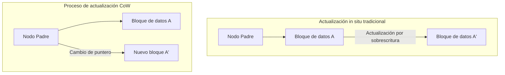
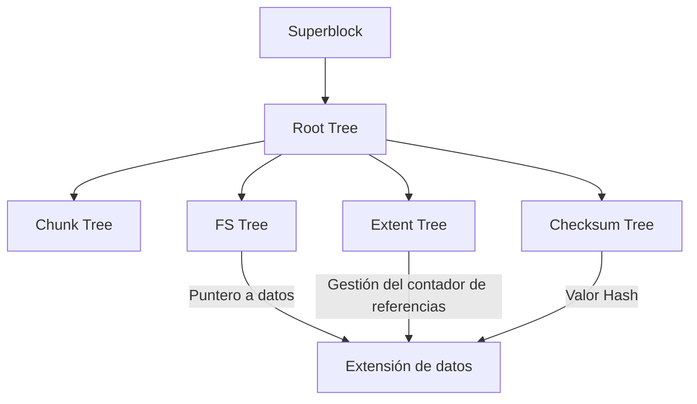

En el entorno informático moderno, el "sistema de archivos" que garantiza la persistencia de los datos es uno de los componentes más importantes que conforman el núcleo del sistema operativo. Sin embargo, a medida que la capacidad de almacenamiento entra en los reinos de los petabytes y exabytes, y se popularizan memorias no volátiles de ultra alta velocidad y gran capacidad como SSD y NVMe, los sistemas de archivos tradicionales que heredan filosofías de diseño de hace décadas están alcanzando sus límites arquitectónicos.

En este artículo, desde las perspectivas de la ingeniería de sistemas de archivos, el almacenamiento del kernel y el almacenamiento distribuido, diseccionaremos a fondo la arquitectura interna de **ZFS** y **Btrfs**, que constituyen los pilares de los sistemas de archivos de próxima generación. Analizaremos cómo se logran la consistencia transaccional producida por el cambio de paradigma de Copy-on-Write (CoW), las contramedidas contra la corrupción silenciosa de datos (Silent Data Corruption) utilizando árboles de Merkle (árboles hash) y el verdadero almacenamiento de autorreparación. Desentrañaremos su profunda estructura matemática y la maestría de la programación de sistemas, intercalando conceptos a nivel de código fuente.

---

## Capítulo 1: Los límites de los sistemas de archivos tradicionales (ext4/XFS) y la corrupción de datos

ext4, el sistema de archivos estándar de Linux que utilizamos a diario, y XFS, que cuenta con un alto historial comprobado en el ámbito empresarial, son software extremadamente excelentes y maduros. Sin embargo, estos sistemas de archivos emplean un modelo clásico de actualización de datos llamado "actualización in situ" (In-place update), lo que presenta una vulnerabilidad fatal en los entornos de almacenamiento a gran escala modernos.

### 1.1 Los límites de la actualización in situ y el journaling

La actualización in situ es un método donde los bloques de datos originales en el medio de almacenamiento se sobrescriben directamente al realizar cambios en un archivo. Este método tiende a preservar la localidad de los bloques, lo que era ventajoso para minimizar el tiempo de búsqueda en la era de los HDD.

El mayor problema con la actualización in situ es el colapso de la "consistencia en caso de fallo" (crash consistency) si ocurre un corte de energía o un bloqueo del sistema durante una actualización. Para evitar esto, ext4 y XFS emplean **journaling (Write-Ahead Logging; WAL)**. Antes de actualizar los datos, primero se escriben los cambios (metadatos, o los datos mismos) secuencialmente en el área del journal, y luego se actualiza el árbol real del sistema de archivos.

Sin embargo, por razones de rendimiento, los sistemas de archivos generales solo habilitan el "journaling de metadatos", y las actualizaciones de los datos en sí no se registran en el journal. Como resultado, en caso de un fallo, la consistencia de los metadatos del archivo (tamaño, marca de tiempo, inode, etc.) se puede recuperar, pero el contenido del archivo en sí conlleva el riesgo de quedar en un estado de "Torn Write" (escritura rasgada), donde se mezclan datos antiguos y nuevos.

### 1.2 Corrupción silenciosa de datos (Silent Data Corruption)

Aún más aterrador es la **corrupción silenciosa de datos (Silent Data Corruption)**. Es un fenómeno en el que los datos almacenados cambian silenciosamente sin que el sistema operativo lo perciba, debido a errores en el firmware del controlador del dispositivo de almacenamiento, inversiones de bits (Bit Flips) en la memoria por rayos cósmicos, degradación de los cables, o la atenuación magnética/de carga debida al envejecimiento.

Los sistemas de archivos tradicionales carecen de un mecanismo para verificar si los datos leídos son "correctos". Aunque existe ECC (Código de Corrección de Errores) dentro del almacenamiento de bloques (HDD y SSD), si el controlador lee datos desde una ubicación incorrecta (Misdirected Read) o si la escritura no se realizó en absoluto (Phantom Write), el hardware de almacenamiento informará que "la lectura fue exitosa". El sistema operativo pasa los datos corruptos tal cual a la aplicación, la aplicación continúa procesando sin darse cuenta de la anomalía y, finalmente, incluso las copias de seguridad son sobrescritas con datos corruptos.

### 1.3 El fin del RAID por hardware y el problema del "Write Hole"

El RAID por hardware (RAID 5 y RAID 6) se ha utilizado durante muchos años para aumentar la disponibilidad de los datos. Sin embargo, dado que el RAID por hardware también se comporta como un "simple dispositivo de bloques" que no entiende la estructura interna del sistema de archivos, no ofrece una solución fundamental.

Especialmente letal es el problema del **"Write Hole" (agujero de escritura) en RAID**. En RAID 5, si ocurre un corte de energía durante la actualización de los bloques de datos y paridad, se rompe la consistencia entre los datos y la paridad dentro de la banda (stripe). En la próxima lectura, si se utilizan estas paridades rotas para restaurar los datos, los datos se destruirán de manera silenciosa. Además, debido a que no existen sumas de comprobación en el lado del sistema de archivos, el controlador RAID no tiene forma de determinar lógicamente "qué datos del disco son correctos".

Para romper con estas limitaciones de la pila de almacenamiento convencional, donde las capas física, de bloques y de sistema de archivos estaban fragmentadas, nacieron los sistemas de archivos de próxima generación que gestionan de forma integrada todo el almacenamiento.

---

## Capítulo 2: El cambio de paradigma de Copy-on-Write (CoW)

El enfoque revolucionario adoptado por ZFS y Btrfs es **Copy-on-Write (CoW)**. CoW no es solo una característica, sino un cambio de paradigma para la estructura de datos y la gestión de transacciones del sistema de archivos.

### 2.1 Eliminación de la actualización in situ

En un sistema de archivos CoW, los bloques de datos existentes "nunca" se sobrescriben. Al actualizar datos, siempre se escriben en una "nueva área libre" en el almacenamiento. Solo después de que la escritura se haya completado por completo, el puntero del nodo padre (metadatos) que señala a ese bloque de datos se cambia de manera atómica del bloque antiguo al bloque nuevo.

### 2.2 Consistencia transaccional y la cadena de punteros de asignación

El sistema de archivos gestiona los datos mediante una estructura de árbol. Cuando un bloque de datos, que es un nodo hoja (leaf node), se escribe en una nueva ubicación, el contenido de su nodo padre, que contiene el puntero, también cambia. Por lo tanto, el nodo padre también debe escribirse en una nueva ubicación. Esto se propaga en cascada hasta el nodo raíz (root node).

Al final de esta serie de actualizaciones, el "superbloque" (llamado Uberblock en ZFS), ubicado en la cima de todo el árbol, se actualiza de manera atómica. En el momento en que se completa esta única escritura atómica, la transacción se confirma (commit). Si ocurre un corte de energía en medio del proceso, el sistema arranca en su estado antiguo completamente intacto, ya que el superbloque sigue apuntando al árbol antiguo. El trabajo prolongado de reparación con fsck (file system check) es innecesario en principio.

### 2.3 El principio de la creación instantánea de instantáneas (snapshots)

El mayor subproducto de CoW es la instantánea (snapshot) ultrarrápida que se puede ejecutar con una complejidad computacional $O(1)$.
En un sistema de archivos normal, al copiar un directorio, es necesario duplicar físicamente todos los datos. Sin embargo, con CoW, la instantánea se completa simplemente duplicando el puntero del nodo raíz del árbol e incrementando el "contador de referencias (Reference Count)" de cada nodo.

Al actualizar los datos, los bloques cuyo contador de referencias es 2 o más no se sobrescriben sino que se conservan, y solo la parte actualizada se escribe en un bloque nuevo. Esto permite congelar y preservar instantáneamente el estado del sistema de archivos en cualquier punto en el tiempo sin consumir capacidad de almacenamiento adicional.

---

## Capítulo 3: La arquitectura interna de ZFS

Desarrollado por Sun Microsystems (ahora Oracle), ZFS (Zettabyte File System) tiene una arquitectura tan perfeccionada que ha sido apodada "la última palabra en sistemas de archivos". ZFS ha fusionado los gestores de volúmenes tradicionales, los controladores RAID y los sistemas de archivos en una sola capa integrada.

### 3.1 La estructura de 3 capas de SPA, DMU y ZPL

El interior de ZFS se divide principalmente en tres componentes:

1. **SPA (Storage Pool Allocator)**
   Gestiona los dispositivos físicos (vdev: Virtual Device) en la capa más baja. Abstrae los HDD y SSD en pools y proporciona a las capas superiores un único y masivo espacio de almacenamiento virtual. Esta capa es responsable de la redundancia como RAID-Z, la fragmentación de datos (striping) y la E/S (I/O) para la autorreparación. En la cima de la SPA se encuentra el **Uberblock**.
2. **DMU (Data Management Unit)**
   El corazón de ZFS. Gestiona todos los datos como "objetos" y procesa las transacciones CoW. La DMU no es consciente del tipo de datos (directorios, archivos, atributos), sino que simplemente asume la responsabilidad de actualizar de forma atómica la asociación (dnode) entre claves, valores y bloques de datos.
3. **ZPL (ZFS POSIX Layer)**
   Construido sobre el sistema de objetos de la DMU, proporciona al sistema operativo interfaces de sistema de archivos compatibles con POSIX (open, read, write, stat, etc.).

### 3.2 Uberblock y el Grupo de Transacciones (TXG)

En ZFS, las escrituras no se reflejan inmediatamente en el disco, sino que se agrupan en lotes en la memoria como "Grupos de Transacciones (TXG)". Los TXG se vacían (flush) en bloque al disco cada pocos segundos (esto se conoce como sincronización de transacciones). Durante esto, la SPA escribe el nuevo árbol de datos y finalmente actualiza de manera atómica el Uberblock con el número de secuencia más reciente de su matriz.

### 3.3 ZFS Intent Log (ZIL) y SLOG

Aunque las escrituras asíncronas son manejadas de manera eficiente por el TXG, aplicaciones como bases de datos o máquinas virtuales que requieren "escrituras síncronas (Synchronous Write)" mediante `fsync()` no pueden permitirse esperar los varios segundos que tarda un commit del TXG.
Aquí es donde entra en juego el **ZIL (ZFS Intent Log)**. En lugar de realizar una actualización completa del árbol (CoW), el ZIL escribe rápidamente en disco los registros de diferencias de los datos modificados. En caso de fallo, el sistema lee este ZIL para reconstruir los TXG en la memoria.

Además, **SLOG (Separate Intent Log)** es la característica que permite asignar dispositivos dedicados, como NVDIMM o SSD NVMe de alta velocidad, como el destino de escritura del ZIL. Esto mejora drásticamente la latencia de las escrituras síncronas, incluso en pools con discos duros lentos.

### 3.4 ARC y L2ARC: El algoritmo de caché definitivo

El pilar que sustenta el rendimiento de lectura de ZFS es la **ARC (Adaptive Replacement Cache)**. A diferencia del caché de páginas convencional del kernel de Linux, que usa principalmente LRU (Least Recently Used: descarta lo que menos se ha utilizado recientemente), la ARC se basa en el algoritmo ARC propuesto por Megiddo y otros investigadores de IBM.

La ARC gestiona la caché mediante las siguientes cuatro listas:
- **MRU (Most Recently Used)**: Datos de acceso reciente
- **MFU (Most Frequently Used)**: Datos a los que se accede con frecuencia
- **Ghost MRU**: Lista que registra solo metadatos (índices) de datos que desbordaron de la MRU
- **Ghost MFU**: Lista de metadatos de datos que desbordaron de la MFU

La ARC monitorea la carga de trabajo; si se ejecuta un proceso de escaneo (como una copia de seguridad), expande la MRU, y si hay un acceso constante a una base de datos, expande la MFU. Si hay un acierto (hit) en las listas Ghost, deduce que "habría habido un acierto si esta caché hubiera permanecido", ajustando dinámicamente el tamaño de partición de la MRU y la MFU.
Además, configurando una **L2ARC (Level 2 ARC)**, que permite derivar los datos que desbordan de la ARC a SSDs rápidos, se puede construir una capa de caché del nivel de terabytes.

---

## Capítulo 4: La arquitectura "B-tree of trees" de Btrfs

Por otro lado, **Btrfs (B-tree file system)** fue diseñado por Chris Mason y otros en Oracle como un sistema de archivos nativo de Linux de próxima generación. Mientras que ZFS refleja fuertemente la filosofía de Solaris (una estricta separación de capas), Btrfs adopta un enfoque de estrecha colaboración con el VFS (Virtual File System) de Linux.

### 4.1 La estructura matemática que representa todo en árboles B

La característica más hermosa y a la vez más compleja de Btrfs es que "absolutamente todas las estructuras de gestión de datos y metadatos del sistema de archivos se construyen a partir de árboles B puros (estrictamente hablando, una variante cercana a los árboles B+)". Btrfs se modela como un masivo "B-tree of trees" (un árbol de árboles B).

Los árboles principales son los siguientes:
1. **Root tree (Raíz de los árboles)**: Contiene los punteros y estados de los nodos raíz de todos los demás árboles.
2. **Chunk tree**: Mapea los bloques del dispositivo físico (direcciones físicas) a chunks en el espacio de direcciones lógicas. Las funciones RAID por software (striping, mirroring) se resuelven en la capa de este árbol.
3. **FS tree (Árbol del sistema de archivos)**: Contiene la estructura de directorios real, nombres de archivos, inodes y punteros a los datos de los archivos.
4. **Extent tree**: Gestiona el espacio libre de todo el sistema de archivos y las referencias inversas (back-references) de las extensiones (bloques contiguos de datos) en uso. Esto permite procesar de forma eficiente los complejos incrementos y decrementos de los contadores de referencias causados por CoW.
5. **Checksum tree**: Un árbol independiente que contiene exclusivamente las sumas de comprobación de los bloques de datos.

### 4.2 Algoritmos de búsqueda y actualización CoW en árboles B

Al actualizar datos en Btrfs, se desciende por el árbol para localizar la extensión objetivo. En una actualización in situ normal, bastaría con reescribir el nodo hoja, pero con el modelo CoW de Btrfs, el nodo hoja se copia en una nueva área física y luego se reescribe. En consecuencia, debido a que el puntero del nodo padre hacia dicha hoja se vuelve inválido, el nodo padre también se copia y se reescribe. Esto llega hasta el Root tree.
Durante este proceso, el árbol B debe ser reequilibrado (división o fusión de nodos). Para mejorar el rendimiento de acceso concurrente en entornos multiproceso, Btrfs implementa algoritmos avanzados de manipulación de árboles B que minimizan la contención de bloqueos.

### 4.3 Subvolúmenes y Snapshots (instantáneas)

En Btrfs, un "subvolumen" es un FS tree independiente que posee su propio nodo raíz. Aunque a los ojos de los usuarios se comporta como un directorio normal, a nivel interno del sistema de archivos se trata como un árbol B completamente independiente.
Un snapshot en Btrfs es una operación que simplemente duplica el nodo raíz de un subvolumen y lo registra como un nuevo subvolumen. Por lo tanto, al igual que en ZFS, la creación de snapshots se completa en un instante.

---

## Capítulo 5: Sumas de comprobación de árbol de Merkle y capacidades de autorreparación

La característica que separa de manera decisiva a ZFS y Btrfs de los sistemas de archivos de generaciones pasadas es la "garantía de integridad de datos mediante sumas de comprobación criptográficas (o no criptográficas) basadas en árboles de Merkle (árboles hash)" y la "autorreparación (Self-Healing)" derivada de ello.

### 5.1 Verificación de datos mediante la arquitectura de árbol de Merkle

Los sistemas de archivos tradicionales o los RAID por hardware a menudo incrustan el código de detección de errores dentro de los bloques de datos. Sin embargo, si los datos se escriben en la ubicación incorrecta del disco (Misdirected Write), la suma de comprobación del bloque en sí se evaluará como "consistente", por lo que no se podrá detectar la corrupción.

Para prevenir esto, ZFS y Btrfs emplean una **estructura de árbol de Merkle**.
En el caso de ZFS, la suma de comprobación (checksum) del bloque de datos (como SHA-256 o fletcher4) no se almacena en el bloque mismo, sino en "el nodo padre (la estructura del puntero) que señala a ese bloque". Además, la suma de comprobación del nodo padre se almacena a su vez en su respectivo nodo padre, llegando finalmente hasta el Uberblock.

Gracias a esto, todo el árbol funciona como una inmensa cadena hash (hash chain). Cuando se lee un bloque de datos, el sistema operativo obtiene la suma de comprobación del nodo padre, calcula el valor hash de los datos leídos y los compara. Si los valores hash no coinciden, es posible **detectar con certeza absoluta** que los datos se han corrompido en el disco o que se ha producido una inversión de bits en la memoria o cables durante la transmisión.

### 5.2 Superación del problema del Write Hole en RAID-Z y autorreparación

El RAID-Z (RAID-Z1/Z2/Z3) de ZFS resuelve por completo el problema del Write Hole que afectaba al RAID 5/6 clásico, combinándolo con CoW.

En RAID 5, el ancho de la banda (stripe width) es fijo (por ejemplo, 3 bloques de datos + 1 bloque de paridad), y había riesgo de inconsistencia al actualizar solo una parte de los bloques (Read-Modify-Write).
En RAID-Z, el **ancho de la banda cambia dinámicamente** (Variable Stripe Width) de acuerdo al tamaño de los datos que se escriben. Dado que todas las escrituras son siempre "escrituras de banda completa en nuevas ubicaciones" (Full-Stripe Write), incluso si ocurre un fallo a mitad de la actualización, la banda antigua simplemente se conserva intacta y la nueva se descarta, haciendo que la inconsistencia de paridad jamás se produzca.

El cálculo de paridad en RAID-Z2/Z3 se lleva a cabo mediante la codificación Reed-Solomon utilizando matemáticas sobre campos finitos (Campo de Galois: GF(2^8)). Gracias a operaciones matriciales complejas, con Z3 es posible restaurar los datos ante el fallo de cualesquiera 3 discos al mismo tiempo.

El proceso de autorreparación funciona de la siguiente manera:
1. Una aplicación solicita datos y ZFS lee el bloque del Disco A.
2. Verifica la suma de comprobación y detecta una discrepancia (corrupción).
3. ZFS descarta los datos del Disco A y lee los datos a partir del Disco B que los tiene en espejo, o usando las paridades del RAID-Z (o los restaura calculando).
4. Verifica la suma de comprobación de los datos restaurados, y si son correctos, se los devuelve a la aplicación.
5. **En segundo plano y de manera automática, escribe los datos correctos en un nuevo bloque del Disco A (reparación) y actualiza los metadatos.**

Sin ninguna intervención de los administradores del sistema, el almacenamiento detecta su propia corrupción y realiza reparaciones de forma autónoma.

### 5.3 Operaciones internas del proceso de limpieza (Scrub)

Si las reparaciones solo se hicieran en el momento de la lectura de datos, los datos fríos (cold data) que rara vez se acceden se dejarían abandonados por largos periodos, con el riesgo de acumular fallos (Bit Rot) y volverse irreparables en caso de una avería simultánea en múltiples discos.
Para evitar esto se emplea la operación **Scrub** (limpieza o depuración). Al ejecutar Scrub, el sistema de archivos recorre exhaustivamente la estructura de árbol desde la raíz, lee todos los metadatos y bloques de datos en los discos, y recalcula y verifica las sumas de comprobación. Si encuentra alguna anomalía, realiza la reparación de inmediato. Esto es similar a la verificación de paridad del RAID por hardware (Patrol Read), pero como se verifica a nivel del sistema de archivos incluyendo la estructura lógica de los metadatos, su fiabilidad es abrumadoramente superior.

---

## Capítulo 6: Comparación exhaustiva entre ZFS y Btrfs y el futuro del almacenamiento

Existen diferencias claras entre ZFS y Btrfs, que se disputan la supremacía como sistemas de archivos de próxima generación, basadas en sus filosofías de diseño y antecedentes históricos. Los arquitectos de sistemas deben elegirlos de manera apropiada según sus requisitos.

### 6.1 Consumo de memoria y características de rendimiento

- **ZFS**: Como se mencionó anteriormente, al implementar su propia ARC, consume memoria de forma muy agresiva. Su filosofía de diseño es "usar tanta memoria como haya disponible", y se recomienda asignar desde un mínimo de varios GB hasta docenas o cientos de GB de RAM a la ARC para usos empresariales. Si tiene suficiente memoria disponible, cuenta con un rendimiento invencible.
- **Btrfs**: Está estrechamente integrado con el caché de páginas estándar del kernel de Linux (capa VFS). Por esta razón, la huella de memoria se mantiene al mismo nivel que ext4 o XFS, operando de manera estable incluso en dispositivos edge, sistemas embebidos, o pequeños VPS con recursos limitados.

### 6.2 Cuestiones de licencias: CDDL vs GPL

La mayor razón por la que ZFS no se fusiona en la línea principal del kernel de Linux no es técnica, sino una incompatibilidad de licencias. La CDDL (Common Development and Distribution License) de ZFS y la GPLv2 del kernel de Linux se consideran legalmente incompatibles. Por lo tanto, usar ZFS en Linux implica compilar y cargar el módulo del kernel por separado (OpenZFS).
En contraste, Btrfs ha sido desarrollado bajo GPL pura y está incluido de forma estándar en el kernel de Linux. Se adopta como el sistema de archivos por defecto en las principales distribuciones de Linux (como SUSE, Fedora, etc.).

### 6.3 Casos de uso y adopción

**El dominio de ZFS (OpenZFS)**:
Cuenta con un apoyo masivo en appliances de almacenamiento como TrueNAS, plataformas de hipervisor como Proxmox VE o LXD, y en servidores de respaldo empresariales donde es absolutamente inaceptable perder datos. Además, ha reinado como el sistema de archivos estándar en FreeBSD durante muchos años.

**El dominio de Btrfs**:
Aprovechando sus flexibles capacidades de gestión de volúmenes y snapshots, se ha popularizado ampliamente como el sistema de archivos raíz en los millones de servidores Linux en la infraestructura de Facebook (Meta), NAS dirigidos a consumidores/PYMEs como Synology, sistemas operativos de juegos como Steam Deck, y como predeterminado en Fedora Workstation.

### 6.4 Hacia una infraestructura de almacenamiento de la era Cloud Native

Con la difusión de las tecnologías de contenedores (Docker/Kubernetes), se le exige al almacenamiento la "creación y destrucción de snapshots en cuestión de milisegundos" y una "mayor eficiencia en la superposición de capas (layering) de imágenes de contenedores". Las características CoW de ZFS y Btrfs tienen una excelente compatibilidad como drivers de almacenamiento (alternativas a overlayfs o como backends) para contenedores.

Además, a medida que surgen hardwares de próxima generación, como la desagregación de almacenamiento (separación y uso compartido) mediante CXL (Compute Express Link) y NVMe-oF, y el almacenamiento computacional, los sistemas de archivos están evolucionando, pasando de ser simples "contenedores de datos" a un "plano de control de datos (data control plane)" que gestiona integralmente la protección de datos, encriptación, compresión y deduplicación.

El paradigma de "CoW y autorreparación" promovido por ZFS y Btrfs es el escudo más poderoso para proteger el tejido intelectual humano de su colapso físico en una era en la que los datos son la fuente de todo valor. Ahora mismo, somos testigos del fin de la arquitectura de almacenamiento tradicional y del amanecer de sistemas de archivos de próxima generación que son inteligentes y autónomos.
