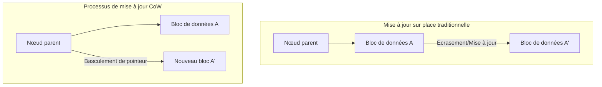
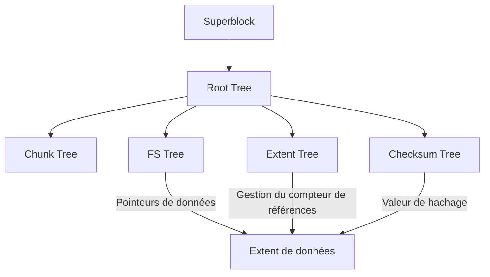

Dans l'environnement informatique moderne, le « système de fichiers », qui garantit la persistance des données, est l'un des composants les plus importants constituant le cœur du système d'exploitation. Cependant, alors que la capacité de stockage pénètre dans le domaine des pétaoctets et des exaoctets, et que les mémoires non volatiles ultra-rapides et de grande capacité telles que les SSD et NVMe se banalisent, les systèmes de fichiers traditionnels, héritiers de concepts de conception vieux de plusieurs décennies, atteignent leurs limites architecturales.

Dans cet article, du point de vue de l'ingénierie des systèmes de fichiers, du stockage noyau et du stockage distribué, nous disséquerons minutieusement l'architecture interne de **ZFS** et **Btrfs**, qui représentent les piliers des systèmes de fichiers de nouvelle génération. Nous révélerons comment la cohérence transactionnelle apportée par le changement de paradigme du Copy-on-Write (CoW), les contre-mesures contre la corruption silencieuse des données (silent data corruption) utilisant les arbres de Merkle (arbres de hachage) et un stockage véritablement auto-réparateur sont réalisés. Nous en dévoilerons la structure mathématique abyssale et les prouesses de la programmation système en y intégrant des concepts au niveau du code source.

---

## Chapitre 1 : Les limites des systèmes de fichiers traditionnels (ext4/XFS) et la corruption des données

ext4, le système de fichiers standard de Linux que nous utilisons quotidiennement, et XFS, qui bénéficie d'une solide réputation dans le domaine de l'entreprise, sont des logiciels extrêmement excellents et matures. Cependant, ces systèmes de fichiers adoptent un modèle classique de mise à jour des données appelé « mise à jour sur place (In-place update) », ce qui présente une faiblesse fatale dans les environnements de stockage à grande échelle modernes.

### 1.1 Les limites de la mise à jour sur place et de la journalisation

La mise à jour sur place est une méthode qui écrase directement le bloc de données original sur le support de stockage lors de la modification d'un fichier. Cette méthode permet de maintenir facilement la localité des blocs, ce qui était avantageux pour minimiser le temps de recherche (seek time) à l'ère des disques durs (HDD).

Le plus grand problème de la mise à jour sur place est la rupture de la « cohérence en cas de crash (crash consistency) » lorsqu'une coupure de courant ou un crash système survient pendant la mise à jour. Pour éviter cela, ext4 et XFS adoptent la **journalisation (Write-Ahead Logging ; WAL)**. Avant de mettre à jour les données, ils écrivent d'abord séquentiellement les détails de la modification (les métadonnées, ou les données elles-mêmes) dans une zone de journal, après quoi ils mettent à jour l'arbre réel du système de fichiers.

Cependant, les systèmes de fichiers généraux n'activent que la « journalisation des métadonnées » pour des raisons de performances, et les mises à jour des données elles-mêmes ne sont pas enregistrées dans le journal. Par conséquent, en cas de crash, bien que la cohérence des métadonnées du fichier (taille, horodatage, inode, etc.) puisse être restaurée, le contenu du fichier lui-même comporte le risque de se retrouver dans un état d'« écriture déchirée (Torn Write) » où anciennes et nouvelles données sont mélangées.

### 1.2 La corruption silencieuse des données (Silent Data Corruption)

Plus terrifiante encore est la **corruption silencieuse des données (Silent Data Corruption)**. C'est un phénomène où les données stockées changent silencieusement sans que l'OS ne s'en aperçoive, en raison de bugs dans le firmware du contrôleur du périphérique de stockage, d'inversions de bits (Bit Flip) en mémoire causées par des rayons cosmiques, de la dégradation des câbles, ou de l'atténuation magnétique/de charge due au vieillissement.

Les systèmes de fichiers traditionnels ne possèdent pas de mécanisme pour vérifier si les données lues sont « correctes ». Il existe des ECC (codes correcteurs d'erreurs) à l'intérieur du stockage en mode bloc (HDD ou SSD), mais si le contrôleur lit les données au mauvais endroit (Misdirected Read) ou si l'écriture n'a tout simplement pas eu lieu (Phantom Write), le matériel de stockage lui-même signalera qu'il a pu « lire normalement ». L'OS transmet alors les données corrompues telles quelles à l'application, l'application poursuit son traitement sans remarquer l'anomalie, et finalement, même les sauvegardes finissent par être écrasées avec des données corrompues.

### 1.3 La fin du RAID matériel et le problème du « trou d'écriture (Write Hole) »

Pour accroître la disponibilité des données, le RAID matériel (RAID 5 ou RAID 6) est utilisé depuis de nombreuses années. Cependant, le RAID matériel se comporte lui aussi comme un « simple périphérique bloc » qui ne comprend pas la structure interne du système de fichiers, ce qui n'offre pas de solution fondamentale.

Le problème le plus fatal est celui du **trou d'écriture RAID (Write Hole)**. Dans le RAID 5, si une coupure de courant se produit pendant la mise à jour d'un bloc de données et de son bloc de parité, la cohérence entre les données et la parité au sein de la bande (stripe) est rompue. Lors de la lecture suivante, si l'on utilise cette parité compromise pour restaurer les données, ces dernières seront détruites silencieusement. De plus, puisqu'il n'y a pas de somme de contrôle côté système de fichiers, le contrôleur RAID n'a aucun moyen de déterminer logiquement « quelles données de disque sont correctes ».

Pour briser les limites de cette pile de stockage conventionnelle où les couches physiques, de blocs et de systèmes de fichiers sont fragmentées, les systèmes de fichiers de nouvelle génération, qui gèrent le stockage de manière globale et intégrée, ont vu le jour.

---

## Chapitre 2 : Le changement de paradigme du Copy-on-Write (CoW)

L'approche révolutionnaire adoptée par ZFS et Btrfs est le **Copy-on-Write (CoW)**. Le CoW n'est pas simplement une fonctionnalité, c'est un changement de paradigme dans la structure des données et la gestion des transactions du système de fichiers.

### 2.1 L'élimination de la mise à jour sur place

Dans un système de fichiers CoW, un bloc de données existant n'est « absolument jamais » écrasé. Lors de la mise à jour de données, elles sont toujours écrites dans une « nouvelle zone libre » sur le stockage. Ce n'est qu'après l'achèvement complet de l'écriture que le pointeur du nœud parent (métadonnées) pointant vers ce bloc de données est basculé atomiquement de l'ancien bloc vers le nouveau.

### 2.2 Cohérence transactionnelle et chaîne de pointeurs d'allocation

Un système de fichiers gère les données avec une structure en arbre (tree). Lorsqu'un bloc de données, qui est un nœud feuille (leaf), est écrit à un nouvel emplacement, le contenu du nœud parent qui contient son pointeur change également. Par conséquent, le nœud parent doit aussi être écrit à un nouvel emplacement. Cela se propage en chaîne jusqu'au nœud racine (root node).

À la toute fin de cette série de mises à jour, le « superbloc » (appelé Uberblock dans ZFS) situé au sommet de tout l'arbre est mis à jour de manière atomique. Dès l'instant où cette écriture atomique unique est terminée, la transaction est validée (commit). Si une coupure de courant se produit en cours de route, comme le superbloc pointe toujours vers l'ancien arbre, le système redémarre dans l'ancien état, totalement intact. Les opérations de réparation fastidieuses via fsck (vérification du système de fichiers) deviennent par principe inutiles.

### 2.3 Le principe de création instantanée de snapshots

Le sous-produit majeur du CoW est le snapshot ultra-rapide, exécutable avec une complexité temporelle de $O(1)$.
Lorsqu'on copie un répertoire dans un système de fichiers normal, il faut dupliquer physiquement toutes les données. Mais avec le CoW, un snapshot est complété simplement en copiant le pointeur du nœud racine de l'arbre et en incrémentant le « compteur de références (Reference Count) » de chaque nœud.

Lors de la mise à jour des données, les blocs dont le compteur de références est de 2 ou plus ne sont pas écrasés et sont conservés, et seule la partie mise à jour est écrite dans un nouveau bloc. Cela permet de « figer » et de conserver instantanément l'état du système de fichiers à un instant T, sans consommer de capacité de stockage.

---

## Chapitre 3 : L'architecture interne de ZFS

Développé par Sun Microsystems (aujourd'hui Oracle), ZFS (Zettabyte File System) possède une architecture tellement accomplie qu'il est souvent qualifié de « dernier mot en matière de systèmes de fichiers ». ZFS a fusionné le gestionnaire de volumes traditionnel, le contrôleur RAID et le système de fichiers en une seule couche unifiée.

### 3.1 La structure en 3 couches : SPA, DMU et ZPL

L'intérieur de ZFS est divisé en trois composants principaux.

1. **SPA (Storage Pool Allocator)**
   Il gère les périphériques physiques (vdev: Virtual Device) à la couche la plus basse. Il fait abstraction des disques durs (HDD) et des SSD sous forme de pool et fournit un espace de stockage virtuel gigantesque et unique aux couches supérieures. Cette couche est responsable de la redondance comme le RAID-Z, du striping des données et des I/O pour l'auto-réparation. Au sommet du SPA se trouve l'**Uberblock**.
2. **DMU (Data Management Unit)**
   Le cœur de ZFS. Il gère toutes les données sous forme d'« objets » et traite les transactions CoW. Le DMU n'a pas conscience du type de données (répertoires, fichiers, attributs) et est simplement responsable de la mise à jour atomique des paires clé-valeur et des associations de blocs de données (dnode).
3. **ZPL (ZFS POSIX Layer)**
   Construit au-dessus du système d'objets du DMU, il fournit au système d'exploitation une interface de système de fichiers compatible POSIX (open, read, write, stat, etc.).

### 3.2 L'Uberblock et les groupes de transactions (TXG)

Dans ZFS, les écritures ne sont pas immédiatement répercutées sur le disque, mais sont regroupées en mémoire sous forme de « groupes de transactions (TXG) ». Les TXG sont vidés (flush) sur le disque toutes les quelques secondes (c'est ce qu'on appelle la synchronisation des transactions). À ce moment-là, le SPA écrit le nouvel arbre de données et, en dernier lieu, met à jour de manière atomique celui des Uberblocks du tableau possédant le numéro de séquence le plus élevé.

### 3.3 Le ZFS Intent Log (ZIL) et le SLOG

Bien que les écritures asynchrones soient traitées efficacement par les TXG, pour les applications qui exigent des « écritures synchrones (Synchronous Write) » via `fsync()`, comme les bases de données ou les machines virtuelles, il est inacceptable d'attendre les quelques secondes nécessaires au commit du TXG.
C'est là qu'intervient le **ZIL (ZFS Intent Log)**. Au lieu d'effectuer une mise à jour complète de l'arbre (CoW), le ZIL écrit rapidement sur le disque un journal différentiel des données modifiées. En cas de crash, ce ZIL est lu pour reconstruire le TXG en mémoire.

De plus, la fonctionnalité consistant à allouer un périphérique dédié, tel qu'un NVDIMM ou un SSD NVMe rapide, comme destination d'écriture pour le ZIL, s'appelle le **SLOG (Separate Intent Log)**. Grâce à cela, même avec un pool de disques durs lents, la latence des écritures synchrones peut être drastiquement améliorée.

### 3.4 ARC et L2ARC : L'algorithme de cache ultime

Ce qui sous-tend les performances de lecture de ZFS est l'**ARC (Adaptive Replacement Cache)**. Alors que le cache de pages du noyau Linux traditionnel utilise principalement le LRU (Least Recently Used : on jette ce qui n'a pas été utilisé récemment), l'ARC est basé sur l'algorithme ARC proposé par Megiddo et d'autres chez IBM.

L'ARC gère le cache avec les 4 listes suivantes :
- **MRU (Most Recently Used)** : Les données consultées récemment
- **MFU (Most Frequently Used)** : Les données consultées fréquemment
- **Ghost MRU** : Liste des éléments évincés du MRU, dont seules les métadonnées (index) sont conservées
- **Ghost MFU** : Liste des métadonnées des éléments évincés du MFU

L'ARC surveille la charge de travail (workload) : lorsqu'un processus de scan (comme une sauvegarde) est exécuté, il étend le MRU, et lorsque des accès continus à une base de données se produisent, il étend le MFU. En cas de hit sur une liste Ghost, il juge que « si ce cache était resté, il y aurait eu un hit », et ajuste dynamiquement la taille des partitions du MRU et du MFU.
De plus, en configurant un **L2ARC (Level 2 ARC)** qui déplace les données évincées de l'ARC vers un SSD rapide, on peut construire une couche de cache de l'ordre du téraoctet.

---

## Chapitre 4 : L'architecture B-tree of trees de Btrfs

D'autre part, **Btrfs (B-tree file system)** a été conçu par Chris Mason (aujourd'hui chez Oracle) et son équipe comme un système de fichiers de nouvelle génération natif à Linux. Alors que ZFS reflète fortement la philosophie de Solaris (séparation stricte des couches), Btrfs adopte une approche d'intégration étroite avec le VFS (Virtual File System) de Linux.

### 4.1 Une structure mathématique où tout est exprimé par des arbres B

La caractéristique la plus élégante, et en même temps la plus complexe, de Btrfs est que « absolument toutes les métadonnées et structures de gestion des données du système de fichiers sont constituées d'arbres B purs (plus exactement, une variante proche des arbres B+) ». Btrfs est modélisé comme un immense « B-tree of trees » (un arbre B d'arbres).

Les arbres principaux sont les suivants :
1. **Root tree (Arbre racine)** : Il conserve les pointeurs des nœuds racines et les états de tous les autres arbres.
2. **Chunk tree** : Il mappe les blocs (adresses physiques) des périphériques physiques aux chunks (blocs) de l'espace d'adressage logique. Les fonctionnalités RAID logiciel (striping, mirroring) sont gérées à la couche de cet arbre.
3. **FS tree (Arbre du système de fichiers)** : Il conserve la structure des répertoires réels, les noms de fichiers, les inodes et les pointeurs vers les données de fichiers.
4. **Extent tree** : Il gère l'espace libre de l'ensemble du système de fichiers et les références arrières (back-references) des extents (blocs contigus de données) en cours d'utilisation. Cela permet de traiter efficacement l'augmentation et la diminution complexes des compteurs de références dues au CoW.
5. **Checksum tree** : Un arbre qui conserve de manière indépendante uniquement les sommes de contrôle des blocs de données.

### 4.2 Recherche et algorithme de mise à jour CoW dans un arbre B

Lors de la mise à jour de données dans Btrfs, on descend dans l'arbre pour trouver l'extent cible. Dans une mise à jour sur place, il suffirait de réécrire le nœud feuille, mais avec le CoW de Btrfs, le nœud feuille est copié dans une nouvelle zone physique et réécrit. Par conséquent, le pointeur du nœud parent qui pointait vers cette feuille devient invalide, donc le nœud parent est également copié et réécrit. Cela se propage jusqu'au Root tree.
Au cours de ce processus, l'arbre B doit être rééquilibré (division ou fusion de nœuds). Pour améliorer les performances d'accès concurrentiel dans un environnement multi-thread, Btrfs implémente un algorithme sophistiqué de manipulation d'arbres B qui minimise les conflits de verrous (locks).

### 4.3 Sous-volumes et snapshots

Un « sous-volume » (subvolume) dans Btrfs est un FS tree indépendant avec son propre nœud Root. Du point de vue de l'utilisateur, il se comporte comme un répertoire, mais à l'intérieur du système de fichiers, il est traité comme un arbre B complètement indépendant.
Un snapshot dans Btrfs est une opération qui consiste simplement à dupliquer le nœud Root d'un sous-volume donné et à l'enregistrer comme un nouveau sous-volume. Pour cette raison, tout comme dans ZFS, la création d'un snapshot s'effectue en un instant.

---

## Chapitre 5 : Les sommes de contrôle de l'arbre de Merkle et la fonctionnalité d'auto-réparation

La fonctionnalité qui sépare de manière décisive ZFS et Btrfs des systèmes de fichiers de la génération précédente est « la garantie de l'intégrité des données au moyen de sommes de contrôle cryptographiques (ou non cryptographiques) basées sur un arbre de Merkle (arbre de hachage) » et l'« auto-réparation (Self-Healing) » qui les utilise.

### 5.1 Vérification des données par l'architecture en arbre de Merkle

Les systèmes de fichiers traditionnels ou les RAID matériels intègrent souvent le code de détection d'erreur directement dans le bloc de données lui-même. Cependant, si les données sont écrites au mauvais endroit sur le disque (Misdirected Write), la somme de contrôle du bloc lui-même sera jugée comme « cohérente », et la corruption ne pourra pas être détectée.

Pour éviter cela, ZFS et Btrfs adoptent une **structure en arbre de Merkle**.
Dans le cas de ZFS, la somme de contrôle d'un bloc de données (SHA-256, fletcher4, etc.) n'est pas stockée dans le bloc lui-même, mais dans « le nœud parent pointant vers ce bloc (dans la structure de son pointeur) ». De plus, la somme de contrôle du nœud parent est stockée dans son propre parent, et ainsi de suite jusqu'à l'Uberblock.

Grâce à cela, l'arbre entier fonctionne comme une gigantesque chaîne de hachage. Lors de la lecture d'un bloc de données, l'OS récupère la somme de contrôle depuis le nœud parent, calcule la valeur de hachage des données lues et les compare. Si les valeurs de hachage ne correspondent pas, l'OS peut détecter avec une **certitude absolue** que les données ont été corrompues sur le disque, ou qu'une inversion de bit s'est produite en mémoire ou dans le câble pendant le transfert.

### 5.2 Résolution du problème du trou d'écriture et auto-réparation dans RAID-Z

Le RAID-Z de ZFS (RAID-Z1/Z2/Z3) résout complètement le problème du trou d'écriture dont souffraient les traditionnels RAID 5/6, en le combinant avec le CoW.

Dans le RAID 5, la largeur de la bande (stripe width) est fixe (par exemple, 3 blocs de données + 1 bloc de parité), et il y avait un risque d'incohérence lors de la mise à jour d'une partie seulement des blocs (Read-Modify-Write).
Dans le RAID-Z, la **largeur de la bande change dynamiquement** (Variable Stripe Width) en fonction de la taille des données à écrire. Toutes les écritures deviennent systématiquement des « écritures de bande complète à un nouvel emplacement (Full-Stripe Write) ». Même si un crash survient en cours de mise à jour, l'ancienne bande reste telle quelle, la nouvelle est simplement abandonnée, et aucune incohérence de parité ne peut jamais se produire.

Le calcul de parité dans le RAID-Z2/Z3 s'effectue par codage Reed-Solomon utilisant les mathématiques sur les corps finis (Galois Field: GF(2^8)). Grâce à des opérations matricielles complexes, le Z3 peut restaurer les données à partir de la défaillance de 3 disques quelconques.

Le processus d'auto-réparation se déroule comme suit :
1. L'application demande des données, et ZFS lit le bloc à partir du disque A.
2. Il vérifie la somme de contrôle et détecte une discordance (corruption).
3. ZFS écarte les données du disque A et lit (ou reconstitue par calcul) les données à partir de la parité RAID-Z ou depuis le disque B mis en miroir.
4. Il vérifie la somme de contrôle des données restaurées, et si elle est correcte, renvoie les données à l'application.
5. **En arrière-plan, il écrit automatiquement les données correctes dans un nouveau bloc sur le disque A (réparation) et met à jour les métadonnées.**

Le stockage détecte sa propre corruption et s'auto-répare de manière autonome, sans aucune intervention de l'administrateur système.

### 5.3 Le fonctionnement interne du processus de Scrub

Si la réparation n'était effectuée qu'au moment de la lecture des données, il existerait un risque que les données froides, rarement consultées, soient laissées à l'abandon pendant de longues périodes, pour finalement devenir irrécupérables en raison de la défaillance simultanée de plusieurs disques (accumulation du Bit Rot).
C'est le rôle du **Scrub (nettoyage)** d'empêcher cela. Lors de l'exécution d'un Scrub, le système de fichiers parcourt la structure arborescente depuis la racine, lit toutes les métadonnées et blocs de données sur le disque, recalcule et vérifie leurs sommes de contrôle. Si une anomalie est détectée, la réparation est exécutée immédiatement. Cela ressemble à la vérification de parité d'un RAID matériel (Patrol Read), mais sa fiabilité est infiniment supérieure puisqu'il valide jusqu'à la structure logique des métadonnées au niveau du système de fichiers.

---

## Chapitre 6 : Comparaison détaillée ZFS vs Btrfs et l'avenir du stockage

Entre ZFS et Btrfs, qui se disputent la suprématie en tant que systèmes de fichiers de nouvelle génération, il existe des différences claires basées sur leurs philosophies de conception et leur contexte historique. Les architectes système doivent choisir l'un ou l'autre de manière appropriée en fonction de leurs exigences.

### 6.1 Consommation de mémoire et caractéristiques de performances

- **ZFS** : Comme mentionné précédemment, puisqu'il implémente son propre ARC, il consomme la mémoire de manière très agressive. Sa philosophie de conception est « d'utiliser toute la mémoire disponible », et il est recommandé d'allouer à l'ARC au minimum quelques Go, voire des dizaines ou centaines de Go pour un usage d'entreprise. S'il dispose de suffisamment de mémoire, il offre des performances imbattables.
- **Btrfs** : Il est étroitement intégré au cache de pages standard du noyau Linux (couche VFS). Par conséquent, son empreinte mémoire est contenue au même niveau que celle de ext4 ou XFS, et il fonctionne de manière stable même sur des périphériques Edge, des systèmes embarqués ou de petits VPS disposant de ressources limitées.

### 6.2 Le problème de la licence : CDDL vs GPL

La principale raison pour laquelle ZFS n'a pas été fusionné dans la ligne principale (l'arbre standard) du noyau Linux n'est pas d'ordre technique, mais tient à une incompatibilité de licences. La licence CDDL (Common Development and Distribution License) de ZFS et la licence GPLv2 du noyau Linux sont considérées comme légalement incompatibles. Par conséquent, pour utiliser ZFS sous Linux, il faut compiler et charger un module noyau séparément (OpenZFS).
En revanche, Btrfs est développé purement sous GPL et est intégré de base dans le noyau Linux. Il est adopté comme système de fichiers par défaut dans les principales distributions Linux (comme SUSE, Fedora).

### 6.3 Cas d'usage et exemples d'adoption

**Le domaine de ZFS (OpenZFS)** :
Il bénéficie d'un soutien écrasant dans les appliances de stockage comme TrueNAS, les plateformes d'hyperviseur comme Proxmox VE et LXD, et les serveurs de sauvegarde d'entreprise où il est absolument interdit de perdre des données. Par ailleurs, il règne en maître en tant que système de fichiers standard sous FreeBSD depuis de nombreuses années.

**Le domaine de Btrfs** :
Il est largement répandu grâce à sa flexibilité dans la gestion des volumes et ses fonctions de snapshot. Il est utilisé comme système de fichiers racine pour les millions de serveurs Linux dans l'infrastructure de Facebook (Meta), dans les NAS pour le grand public/PME comme Synology, dans des OS gaming comme celui du Steam Deck, et comme système par défaut pour Fedora Workstation.

### 6.4 Vers une base de stockage à l'ère Cloud Native

Avec la démocratisation de la technologie des conteneurs (Docker/Kubernetes), les stockages se doivent de créer et détruire des snapshots à la milliseconde près, et de rendre plus efficace le système de couches (layering) des images de conteneurs. Les fonctionnalités CoW de ZFS et de Btrfs sont extrêmement compatibles en tant que pilotes de stockage de conteneurs (comme alternative à overlayfs ou comme backend).

De plus, avec l'émergence des matériels de nouvelle génération tels que la désagrégation du stockage (séparation et partage) via CXL (Compute Express Link) ou NVMe-oF, et le stockage computationnel, le système de fichiers est en train d'évoluer. Il passe du statut de simple « conteneur de données » à celui de « Data Control Plane » qui orchestre de manière intégrée la protection des données, le chiffrement, la compression et la déduplication (Deduplication).

Le paradigme du « CoW et de l'auto-réparation » inauguré par ZFS et Btrfs est le bouclier ultime pour protéger la propriété intellectuelle de l'humanité de l'effondrement physique, à une époque moderne où les données sont la source de toute valeur. Nous sommes actuellement les témoins de la fin de l'architecture de stockage traditionnelle et de l'aube de systèmes de fichiers de nouvelle génération intelligents et autonomes.
