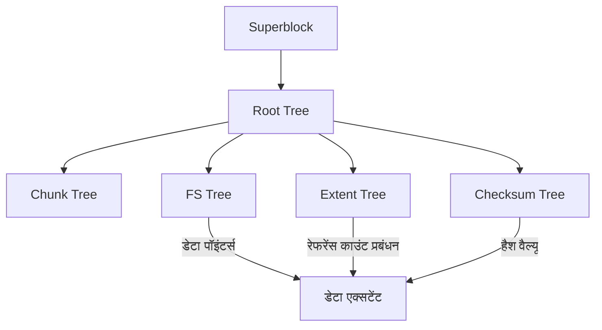

आधुनिक कंप्यूटिंग वातावरण में, डेटा की दृढ़ता (persistence) की गारंटी देने वाला "फ़ाइल सिस्टम" ऑपरेटिंग सिस्टम का सबसे महत्वपूर्ण मुख्य घटक है। हालाँकि, जैसे-जैसे स्टोरेज क्षमता पेटाबाइट और एक्साबाइट के क्षेत्र में प्रवेश कर रही है, और SSDs व NVMe जैसी अल्ट्रा-हाई-स्पीड, उच्च-क्षमता वाली नॉन-वोलाटाइल मेमोरी व्यापक हो रही है, दशकों पुरानी डिज़ाइन फिलॉसफी को विरासत में लेने वाले पारंपरिक फ़ाइल सिस्टम अपनी आर्किटेक्चरल सीमाओं तक पहुँच रहे हैं।

इस लेख में, हम फ़ाइल सिस्टम इंजीनियरिंग, कर्नेल स्टोरेज और डिस्ट्रिब्यूटेड स्टोरेज के दृष्टिकोण से अगली पीढ़ी के फ़ाइल सिस्टम के दो दिग्गजों, **ZFS** और **Btrfs** के आंतरिक आर्किटेक्चर का गहराई से विश्लेषण करेंगे। कॉपी-ऑन-राइट (CoW) के पैराडाइम शिफ्ट द्वारा लाई गई ट्रांजैक्शनल कंसिस्टेंसी, साइलेंट डेटा करप्शन (मौन डेटा भ्रष्टाचार) का मुकाबला करने के लिए Merkle ट्री (हैश ट्री) का उपयोग, और सही मायने में सेल्फ-हीलिंग (स्व-उपचार) स्टोरेज को कैसे साकार किया जाता है। हम इसके गहरे गणितीय ढांचे और सिस्टम प्रोग्रामिंग की कला को सोर्स कोड-स्तरीय अवधारणाओं के साथ उजागर करेंगे।

---

## अध्याय 1: पारंपरिक फ़ाइल सिस्टम (ext4/XFS) की सीमाएं और डेटा करप्शन

हम दैनिक आधार पर जिन लिनक्स मानक फ़ाइल सिस्टम का उपयोग करते हैं, जैसे ext4, और XFS जो एंटरप्राइज़ क्षेत्र में अत्यधिक सिद्ध है, बहुत ही उत्कृष्ट और परिपक्व सॉफ़्टवेयर हैं। हालाँकि, ये फ़ाइल सिस्टम "इन-प्लेस अपडेट (In-place update)" नामक क्लासिक डेटा अपडेट मॉडल का उपयोग करते हैं, जो आधुनिक बड़े पैमाने के स्टोरेज वातावरण में एक घातक कमजोरी रखता है।

### 1.1 इन-प्लेस अपडेट और जर्नलिंग की सीमाएं

इन-प्लेस अपडेट एक ऐसी विधि है जिसमें फ़ाइल में बदलाव करते समय स्टोरेज मीडिया पर मूल डेटा ब्लॉक को सीधे ओवरराइट किया जाता है। यह विधि ब्लॉक की लोकैलिटी को बनाए रखना आसान बनाती है और HDD युग में सीक टाइम को कम करने के लिए फायदेमंद थी।

इन-प्लेस अपडेट की सबसे बड़ी समस्या अपडेट के दौरान बिजली गुल होने या सिस्टम क्रैश होने पर "क्रैश कंसिस्टेंसी (Crash Consistency)" का टूटना है। इसे रोकने के लिए, ext4 और XFS **जर्नलिंग (Write-Ahead Logging; WAL)** का उपयोग करते हैं। डेटा को अपडेट करने से पहले, यह क्रमिक रूप से उन परिवर्तनों (मेटाडेटा, या स्वयं डेटा) को जर्नल क्षेत्र में लिखता है, और फिर वास्तविक फ़ाइल सिस्टम ट्री को अपडेट करता है।

हालाँकि, अधिकांश सामान्य फ़ाइल सिस्टम प्रदर्शन कारणों से केवल "मेटाडेटा जर्नलिंग" सक्षम करते हैं, और स्वयं डेटा के अपडेट जर्नल में रिकॉर्ड नहीं किए जाते हैं। नतीजतन, क्रैश की स्थिति में, फ़ाइल के मेटाडेटा (आकार, टाइमस्टैम्प, इनोड, आदि) की स्थिरता को बहाल किया जा सकता है, लेकिन स्वयं फ़ाइल की सामग्री पुराने और नए डेटा के मिश्रित होने के कारण "टॉर्न राइट (Torn Write)" अवस्था में होने का जोखिम उठाती है।

### 1.2 साइलेंट डेटा करप्शन (मौन डेटा भ्रष्टाचार)

इससे भी अधिक डरावना **साइलेंट डेटा करप्शन (Silent Data Corruption)** है। स्टोरेज डिवाइस के कंट्रोलर फ़र्मवेयर में बग, कॉस्मिक किरणों के कारण मेमोरी में बिट फ़्लिप (Bit Flip), केबल के ख़राब होने, या समय के साथ चुंबकीय/विद्युत आवेश के क्षय के कारण, संग्रहीत डेटा ओएस के ध्यान दिए बिना चुपचाप बदल जाता है।

पारंपरिक फ़ाइल सिस्टम में यह सत्यापित करने के लिए कोई तंत्र नहीं है कि पढ़ा गया डेटा "सही" है या नहीं। यद्यपि ब्लॉक स्टोरेज (HDD और SSD) के अंदर ECC (एरर करेक्शन कोड) होता है, यदि कंट्रोलर गलत स्थान से डेटा पढ़ता है (Misdirected Read) या यदि राइट कभी हुआ ही नहीं (Phantom Write), तो स्टोरेज हार्डवेयर स्वयं रिपोर्ट करेगा कि "सफलतापूर्वक पढ़ा गया"। OS करप्टेड डेटा को एप्लिकेशन को वैसे ही पास कर देता है, एप्लिकेशन बिना किसी असामान्यता को देखे प्रोसेसिंग जारी रखता है, और अंततः बैकअप भी करप्टेड डेटा से ओवरराइट हो जाता है।

### 1.3 हार्डवेयर RAID का अंत और "राइट होल" समस्या

डेटा उपलब्धता बढ़ाने के लिए कई वर्षों से हार्डवेयर RAID (RAID 5 और RAID 6) का उपयोग किया जा रहा है। हालाँकि, हार्डवेयर RAID भी "केवल एक ब्लॉक डिवाइस" के रूप में व्यवहार करता है जो फ़ाइल सिस्टम की आंतरिक संरचना को नहीं समझता है, इसलिए यह कोई मौलिक समाधान नहीं है।

विशेष रूप से घातक **RAID की राइट होल (Write Hole) समस्या** है। RAID 5 में, यदि डेटा ब्लॉक और पैरिटी ब्लॉक को अपडेट करते समय बिजली गुल हो जाती है, तो स्ट्राइप के भीतर डेटा और पैरिटी की स्थिरता टूट जाती है। अगली बार पढ़ते समय, यदि डेटा को इस टूटी हुई पैरिटी का उपयोग करके पुनर्स्थापित किया जाता है, तो डेटा चुपचाप नष्ट हो जाएगा। इसके अलावा, चूंकि फ़ाइल सिस्टम पक्ष पर कोई चेकसम नहीं है, इसलिए RAID कंट्रोलर के पास यह तार्किक रूप से निर्धारित करने का कोई तरीका नहीं है कि "किस डिस्क का डेटा सही है"।

इस पारंपरिक स्टोरेज स्टैक की सीमाओं को तोड़ने के लिए, जहां भौतिक परत, ब्लॉक परत और फ़ाइल सिस्टम परत विभाजित हैं, अगली पीढ़ी के फ़ाइल सिस्टम का जन्म हुआ जो पूरे स्टोरेज को एकीकृत रूप से प्रबंधित करते हैं।

---

## अध्याय 2: कॉपी-ऑन-राइट (CoW) पैराडाइम शिफ्ट

ZFS और Btrfs द्वारा अपनाया गया क्रांतिकारी दृष्टिकोण **कॉपी-ऑन-राइट (CoW: Copy-on-Write)** है। CoW केवल एक फीचर नहीं है, बल्कि फ़ाइल सिस्टम डेटा संरचनाओं और ट्रांज़ैक्शन प्रबंधन के लिए एक पैराडाइम शिफ्ट है।

### 2.1 इन-प्लेस अपडेट का उन्मूलन

CoW फ़ाइल सिस्टम में, मौजूदा डेटा ब्लॉक को "कभी नहीं" ओवरराइट किया जाता है। डेटा को अपडेट करते समय, डेटा हमेशा स्टोरेज पर "नए खाली स्थान" में लिखा जाता है। राइट पूरी तरह से समाप्त होने के बाद, डेटा ब्लॉक को इंगित करने वाले पैरेंट नोड (मेटाडेटा) के पॉइंटर को पुराने ब्लॉक से नए ब्लॉक में परमाणु रूप से (atomically) स्विच किया जाता है।

```mermaid
graph TD
    subgraph पारंपरिक इन-प्लेस अपडेट
    A1[पैरेंट नोड] --> B1[डेटा ब्लॉक A]
    B1 -- ओवरराइट अपडेट --> B1_new[डेटा ब्लॉक A']
    end

    subgraph CoW की अपडेट प्रक्रिया
    C1[पैरेंट नोड] --> D1[डेटा ब्लॉक A]
    C1 -- पॉइंटर स्विच --> D2[नया ब्लॉक A']
    end
```

### 2.2 ट्रांजैक्शनल कंसिस्टेंसी और एलोकेशन पॉइंटर्स की श्रृंखला

फ़ाइल सिस्टम ट्री स्ट्रक्चर में डेटा का प्रबंधन करता है। जब किसी लीफ नोड (डेटा ब्लॉक) को किसी नए स्थान पर लिखा जाता है, तो उस पॉइंटर वाले पैरेंट नोड की सामग्री भी बदल जाती है। इसलिए, पैरेंट नोड को भी नए स्थान पर लिखा जाना चाहिए। यह श्रृंखला प्रतिक्रिया के रूप में रूट नोड तक फैलता है।

अपडेट की इस श्रृंखला के अंत में, पूरे ट्री के शीर्ष पर "सुपरब्लॉक (ZFS में Uberblock कहा जाता है)" को परमाणु रूप से अपडेट किया जाता है। जिस क्षण यह एकल परमाणु राइट पूरा होता है, ट्रांज़ैक्शन प्रतिबद्ध (commit) हो जाता है। यदि बीच में बिजली गुल हो जाती है, तो सिस्टम पूरी तरह से बरकरार और पुरानी स्थिति में बूट होता है क्योंकि सुपरब्लॉक पुराने ट्री को इंगित कर रहा होता है। fsck (फ़ाइल सिस्टम चेक) द्वारा लंबी मरम्मत कार्य सिद्धांत रूप में अनावश्यक हो जाते हैं।

### 2.3 त्वरित स्नैपशॉट निर्माण का सिद्धांत

CoW का सबसे बड़ा उपोत्पाद अल्ट्रा-फास्ट स्नैपशॉट है जिसे $O(1)$ की कम्प्यूटेशनल कॉम्प्लेक्सिटी के साथ निष्पादित किया जा सकता है।
एक सामान्य फ़ाइल सिस्टम में, जब किसी डायरेक्टरी को कॉपी किया जाता है, outतो सभी डेटा को भौतिक रूप से कॉपी किया जाना चाहिए। हालाँकि, CoW में, ट्री के रूट नोड के पॉइंटर को डुप्लिकेट करके और प्रत्येक नोड के "रेफरेंस काउंट (Reference Count)" को बढ़ाकर स्नैपशॉट पूरा हो जाता है।

जब डेटा अपडेट किया जाता है, तो 2 या अधिक के रेफरेंस काउंट वाले ब्लॉक ओवरराइट नहीं किए जाते हैं बल्कि रखे जाते हैं, और केवल अपडेट किए गए हिस्से नए ब्लॉक में लिखे जाते हैं। यह स्टोरेज स्पेस की खपत किए बिना किसी भी समय फ़ाइल सिस्टम की स्थिति को तुरंत फ्रीज़ और बनाए रखना संभव बनाता है।

---

## अध्याय 3: ZFS का आंतरिक आर्किटेक्चर

सन माइक्रोसिस्टम्स (अब Oracle) द्वारा विकसित ZFS (Zettabyte File System) में एक आर्किटेक्चर है जो इतना परिपूर्ण है कि इसे "फ़ाइल सिस्टम में अंतिम शब्द" कहा जाता है। ZFS पारंपरिक वॉल्यूम मैनेजर, RAID कंट्रोलर और फ़ाइल सिस्टम को एक एकीकृत परत में मिलाता है।

### 3.1 SPA, DMU और ZPL की 3-स्तरीय संरचना

ZFS का आंतरिक भाग मोटे तौर पर तीन घटकों में विभाजित है।

1. **SPA (Storage Pool Allocator)**
   भौतिक उपकरणों (vdev: Virtual Device) को सबसे निचली परत पर प्रबंधित करता है। यह HDD और SSD को एक पूल के रूप में एब्स्ट्रैक्ट करता है और ऊपरी परतों को एक एकल विशाल वर्चुअल स्टोरेज स्पेस प्रदान करता है। RAID-Z जैसी रिडंडेंसी, डेटा स्ट्राइपिंग और सेल्फ-हीलिंग I/O को इस परत द्वारा नियंत्रित किया जाता है। SPA के शीर्ष पर **Uberblock** होता है।
2. **DMU (Data Management Unit)**
   ZFS का हृदय। यह सभी डेटा को "ऑब्जेक्ट" के रूप में प्रबंधित करता है और CoW ट्रांज़ैक्शन को प्रोसेस करता है। DMU डेटा के प्रकार (डायरेक्टरी, फ़ाइलें, विशेषताएँ) से अनजान है और केवल की-वैल्यू और डेटा ब्लॉक एसोसिएशन (dnode) को परमाणु रूप से अपडेट करने के लिए जिम्मेदार है।
3. **ZPL (ZFS POSIX Layer)**
   DMU के ऑब्जेक्ट सिस्टम के ऊपर बनाया गया, यह OS को एक POSIX-संगत फ़ाइल सिस्टम इंटरफ़ेस (open, read, write, stat, आदि) प्रदान करता है।

### 3.2 Uberblock और ट्रांजैक्शन ग्रुप (TXG)

ZFS में, राइट्स तुरंत डिस्क पर रिफ्लेक्ट नहीं होते हैं, बल्कि मेमोरी में बैच किए जाते हैं और "ट्रांज़ैक्शन ग्रुप्स (TXG)" में समूहीकृत किए जाते हैं। TXG को हर कुछ सेकंड में डिस्क पर फ्लश किया जाता है (इसे ट्रांज़ैक्शन सिंक्रोनाइज़ेशन कहा जाता है)। इस समय, SPA एक नया डेटा ट्री लिखता है, और अंत में Uberblock सरणी में से नवीनतम अनुक्रम संख्या वाले को परमाणु रूप से अपडेट करता है।

### 3.3 ZFS Intent Log (ZIL) और SLOG

एसिंक्रोनस राइट्स को TXG द्वारा कुशलता से नियंत्रित किया जाता है, लेकिन डेटाबेस या वर्चुअल मशीन जैसे एप्लिकेशन जिन्हें `fsync()` के माध्यम से "सिंक्रोनस राइट (Synchronous Write)" की आवश्यकता होती है, कुछ सेकंड के TXG कमिट की प्रतीक्षा नहीं कर सकते हैं।
यहीं **ZIL (ZFS Intent Log)** काम आता है। पूर्ण ट्री अपडेट (CoW) करने के बजाय, ZIL बदले हुए डेटा के डिफरेंशियल लॉग को उच्च गति पर डिस्क पर लिखता है। क्रैश होने की स्थिति में, इस ZIL को मेमोरी में TXG के पुनर्निर्माण के लिए पढ़ा जाता है।

इसके अलावा, ZIL के राइट डेस्टिनेशन के रूप में NVDIMM या उच्च गति वाले NVMe SSD जैसे समर्पित उपकरणों को असाइन करने का फीचर **SLOG (Separate Intent Log)** है। यह एक धीमी HDD पूल के साथ भी सिंक्रोनस राइट विलंबता (latency) में नाटकीय रूप से सुधार कर सकता है।

### 3.4 ARC और L2ARC: बेहतरीन कैशिंग एल्गोरिथम

**ARC (Adaptive Replacement Cache)** ZFS के रीड प्रदर्शन का समर्थन करता है। जबकि पारंपरिक लिनक्स कर्नेल का पेज कैश मुख्य रूप से LRU (Least Recently Used: जो हाल ही में उपयोग नहीं किए गए हैं उन्हें त्यागें) का उपयोग करता है, ARC IBM के Megiddo और अन्य द्वारा प्रस्तावित ARC एल्गोरिथम पर आधारित है।

ARC कैश को निम्नलिखित चार सूचियों में प्रबंधित करता है:
- **MRU (Most Recently Used)**: हाल ही में एक्सेस किया गया डेटा
- **MFU (Most Frequently Used)**: अक्सर एक्सेस किया जाने वाला डेटा
- **Ghost MRU**: एक सूची जो MRU से बाहर हो गई लेकिन केवल मेटाडेटा (इंडेक्स) रिकॉर्ड करती है
- **Ghost MFU**: MFU से बाहर हुई मेटाडेटा सूची

ARC वर्कलोड की निगरानी करता है, स्कैनिंग प्रक्रियाओं (जैसे बैकअप) के चलने पर MRU का विस्तार करता है, और निरंतर DB एक्सेस जारी रहने पर MFU का विस्तार करता है। यदि कोई घोस्ट सूची हिट होती है, तो यह तय करता है कि "यदि यह कैश रहा होता, तो यह एक हिट होता", और गतिशील रूप से MRU और MFU के विभाजन आकार को समायोजित करता है।
इसके अलावा, **L2ARC (Level 2 ARC)** को कॉन्फ़िगर करके, जो ARC से बाहर हुए डेटा को उच्च गति वाले SSD में स्थानांतरित करता है, एक टेराबाइट-क्लास कैश लेयर बनाई जा सकती है।

---

## अध्याय 4: Btrfs का B-tree of trees आर्किटेक्चर

दूसरी ओर, **Btrfs (B-tree file system)** Oracle के Chris Mason और अन्य द्वारा लिनक्स-नेटिव अगली पीढ़ी के फ़ाइल सिस्टम के रूप में डिज़ाइन किया गया था। जबकि ZFS दृढ़ता से सोलारिस फिलॉसफी (परतों का सख्त अलगाव) को दर्शाता है, Btrfs लिनक्स के VFS (वर्चुअल फ़ाइल सिस्टम) के साथ निकटता से जुड़ने का दृष्टिकोण अपनाता है।

### 4.1 एक गणितीय संरचना जो हर चीज को B-ट्री से दर्शाती है

Btrfs की सबसे सुंदर और जटिल विशेषता यह है कि "फ़ाइल सिस्टम के हर मेटाडेटा और डेटा प्रबंधन संरचना शुद्ध B-ट्री (सख्ती से कहें तो, B+ ट्री का एक व्युत्पन्न) से बने होते हैं।" Btrfs को एक विशाल "B-tree of trees (B-ट्री का ट्री)" के रूप में मॉडल किया गया है।

मुख्य ट्री इस प्रकार हैं:
1. **Root tree (ट्री की जड़)**: अन्य सभी ट्री के रूट नोड्स के पॉइंटर्स और अवस्थाओं को रखता है।
2. **Chunk tree**: भौतिक उपकरणों (भौतिक पते) के ब्लॉक को तार्किक पता स्थान के चंक में मैप करता है। सॉफ़्टवेयर RAID कार्य (स्ट्राइपिंग, मिररिंग) इस ट्री लेयर पर हल किए जाते हैं।
3. **FS tree (फ़ाइल सिस्टम ट्री)**: वास्तविक डायरेक्टरी संरचना, फ़ाइल नाम, इनोड और फ़ाइल डेटा के पॉइंटर्स रखता है।
4. **Extent tree**: पूरे फ़ाइल सिस्टम के खाली स्थान और उपयोग में आने वाले एक्सटेंट (डेटा के सन्निहित ब्लॉक) के बैक-रेफरेंस को प्रबंधित करता है। यह कुशलतापूर्वक CoW के कारण जटिल रेफरेंस काउंट वृद्धि और कमी को संभालता है।
5. **Checksum tree**: एक ट्री जो स्वतंत्र रूप से केवल डेटा ब्लॉक के चेकसम रखता है।



### 4.2 B-ट्री में CoW खोज और अद्यतन एल्गोरिथम

जब Btrfs में डेटा अपडेट किया जाता है, तो यह ट्री के नीचे जाता है और लक्ष्य एक्सटेंट को ढूंढता है। यदि यह एक इन-प्लेस अपडेट होता, तो यह केवल लीफ नोड को फिर से लिखता, लेकिन Btrfs का CoW लीफ नोड को एक नए भौतिक क्षेत्र में कॉपी करता है और इसे फिर से लिखता है। फिर, चूंकि उस लीफ को इंगित करने वाले पैरेंट नोड का पॉइंटर अमान्य हो जाता है, पैरेंट नोड को भी कॉपी किया जाता है और फिर से लिखा जाता है। यह रूट ट्री तक पहुंचता है।
इस प्रक्रिया में, B-ट्री को रिबैलेंस (नोड स्प्लिट और मर्ज) करने की आवश्यकता होती है। Btrfs एक उन्नत B-ट्री मैनिपुलेशन एल्गोरिथम लागू करता है जो मल्टी-थ्रेडेड वातावरण में समवर्ती (concurrent) पहुंच प्रदर्शन को बेहतर बनाने के लिए लॉक कंटेंशन को कम करता है।

### 4.3 सबवॉल्यूम और स्नैपशॉट

Btrfs में "सबवॉल्यूम" अपने स्वयं के रूट नोड के साथ एक स्वतंत्र FS ट्री है। यद्यपि यह उपयोगकर्ता के लिए एक डायरेक्टरी की तरह व्यवहार करता है, इसे फ़ाइल सिस्टम के भीतर पूरी तरह से स्वतंत्र B-ट्री के रूप হিসাবে माना जाता है।
Btrfs स्नैपशॉट एक सबवॉल्यूम के रूट नोड को डुप्लिकेट करने और इसे एक नए सबवॉल्यूम के रूप में पंजीकृत करने का एक सरल ऑपरेशन है। इसलिए, ZFS की तरह, स्नैपशॉट बनाना एक पल में पूरा हो जाता है।

---

## अध्याय 5: Merkle ट्री चेकसम और सेल्फ-हीलिंग फंक्शन

वह विशेषता जो निश्चित रूप से ZFS और Btrfs को पुरानी पीढ़ी के फ़ाइल सिस्टम से अलग करती है वह है "Merkle ट्री (हैश ट्री) के आधार पर क्रिप्टोग्राफ़िक (या गैर-क्रिप्टोग्राफ़िक) चेकसम द्वारा डेटा अखंडता की गारंटी" और इसका उपयोग करके "सेल्फ-हीलिंग (Self-Healing)"।

### 5.1 Merkle ट्री आर्किटेक्चर द्वारा डेटा सत्यापन

पारंपरिक फ़ाइल सिस्टम और हार्डवेयर RAID अक्सर स्वयं डेटा ब्लॉकों के भीतर त्रुटि का पता लगाने वाले कोड एम्बेड करते हैं। हालाँकि, यदि डेटा डिस्क पर गलत स्थान (Misdirected Write) पर लिखा गया है, तो ब्लॉक का चेकसम स्वयं "सुसंगत" होने के रूप में आंका जाएगा, और करप्शन का पता नहीं लगाया जा सकता है।

इसे रोकने के लिए, ZFS और Btrfs **Merkle ट्री संरचना** को अपनाते हैं।
ZFS के मामले में, डेटा ब्लॉक (SHA-256 या fletcher4, आदि) का चेकसम स्वयं उस ब्लॉक में संग्रहीत नहीं किया जाता है, बल्कि "पैरेंट नोड (के पॉइंटर स्ट्रक्चर) में जो उस ब्लॉक को इंगित करता है"। इसके अलावा, पैरेंट नोड का चेकसम उसके पैरेंट में संग्रहीत होता है, और अंततः Uberblock तक पहुँचता है।

परिणामस्वरूप, पूरा ट्री एक विशाल हैश चेन के रूप में कार्य करता है। जब किसी डेटा ब्लॉक को पढ़ा जाता है, तो OS पैरेंट नोड से चेकसम प्राप्त करता है, पढ़े गए डेटा के हैश वैल्यू की गणना करता है, और उनकी तुलना करता है। यदि हैश मान मेल नहीं खाते हैं, तो यह **पूर्ण निश्चितता के साथ पता लगाया जा सकता है** कि डेटा डिस्क पर करप्ट हो गया है, या रास्ते में मेमोरी या केबल में बिट फ्लिप हुआ है।

### 5.2 RAID-Z में राइट होल समस्या पर काबू पाना और सेल्फ-हीलिंग

ZFS का RAID-Z (RAID-Z1/Z2/Z3) CoW के साथ जोड़कर पारंपरिक RAID 5/6 के राइट होल समस्या को पूरी तरह से हल करता है।

RAID 5 में, स्ट्राइप की चौड़ाई (उदाहरण के लिए, 3 डेटा ब्लॉक + 1 पैरिटी ब्लॉक) निश्चित होती है, और केवल कुछ ब्लॉकों को अपडेट करते समय (Read-Modify-Write) विसंगतियों का जोखिम होता था।
RAID-Z में, लिखे जाने वाले डेटा के आकार के आधार पर **स्ट्राइप की चौड़ाई गतिशील रूप से बदलती है** (Variable Stripe Width)। चूंकि सभी राइट्स हमेशा "नए स्थानों पर फुल-स्ट्राइप राइट (Full-Stripe Write)" होते हैं, भले ही अपडेट के बीच में क्रैश हो जाए, पुरानी स्ट्राइप वैसे ही रहती है, और केवल नई स्ट्राइप हटा दी जाती है, इसलिए पैरिटी विसंगति कभी नहीं होती है।

RAID-Z2/Z3 में पैरिटी गणना सीमित क्षेत्र (Galois Field: GF(2^8)) पर गणित का उपयोग करके रीड-सोलोमन (Reed-Solomon) कोडिंग द्वारा की जाती है। जटिल मैट्रिक्स संचालन के माध्यम से, Z3 किसी भी 3 डिस्क विफलताओं से डेटा पुनर्स्थापित कर सकता है।

सेल्फ-हीलिंग प्रक्रिया इस प्रकार है:
1. एप्लिकेशन डेटा का अनुरोध करता है, और ZFS डिस्क A से ब्लॉक पढ़ता है।
2. चेकसम को सत्यापित करता है और बेमेल (करप्शन) का पता लगाता है।
3. ZFS डिस्क A के डेटा को छोड़ देता है और RAID-Z पैरिटी, या मिरर की गई डिस्क B से डेटा पढ़ता है (या गणना द्वारा इसे पुनर्स्थापित करता है)।
4. यह पुनर्स्थापित डेटा के चेकसम को सत्यापित करता है, और यदि यह सही है, तो डेटा एप्लिकेशन को वापस कर दिया जाता है।
5. **पर्दे के पीछे स्वचालित रूप से, सही डेटा डिस्क A के नए ब्लॉक में लिखा (हील्ड) जाता है, और मेटाडेटा अपडेट किया जाता है।**

सिस्टम एडमिनिस्ट्रेटर के हस्तक्षेप के बिना, स्टोरेज अपने स्वयं के भ्रष्टाचार का पता लगाता है और स्वायत्त रूप से मरम्मत करता है।

### 5.3 स्क्रब (Scrub) प्रक्रिया का आंतरिक कार्य

यदि डेटा पढ़ते समय ही मरम्मत की जाती है, तो एक जोखिम (Bit Rot का संचय) होता है कि शायद ही कभी एक्सेस किए गए कोल्ड डेटा को लंबे समय तक छोड़ दिया जाएगा और कई डिस्क के एक साथ विफल होने के कारण मरम्मत योग्य नहीं होगा।
**स्क्रब (Scrub)** इसे रोकता है। जब स्क्रब निष्पादित होता है, तो फ़ाइल सिस्टम रूट से ट्री स्ट्रक्चर को ट्रैवर्स करता है, डिस्क पर सभी मेटाडेटा और डेटा ब्लॉकों को पढ़ता है, और उन्हें सत्यापित करने के लिए चेकसम की पुनर्गणना करता है। यदि कोई असामान्यता पाई जाती है, तो मरम्मत तुरंत निष्पादित की जाती है। यह हार्डवेयर RAID के पैरिटी चेक (Patrol Read) के समान है, लेकिन विश्वसनीयता अत्यधिक उच्च है क्योंकि यह फ़ाइल सिस्टम स्तर पर मेटाडेटा की तार्किक संरचना सहित सत्यापित करता है।

---

## अध्याय 6: ZFS बनाम Btrfs गहन तुलना और स्टोरेज का भविष्य

अगली पीढ़ी के फ़ाइल सिस्टम के रूप में आधिपत्य के लिए होड़ करने वाले ZFS और Btrfs के बीच डिज़ाइन फिलॉसफी और ऐतिहासिक पृष्ठभूमि के आधार पर स्पष्ट अंतर हैं। सिस्टम आर्किटेक्ट्स को आवश्यकताओं के अनुसार इन्हें उचित रूप से चुनना चाहिए।

### 6.1 मेमोरी खपत और प्रदर्शन विशेषताएँ

- **ZFS**: जैसा कि ऊपर बताया गया है, चूंकि यह अपना स्वयं का ARC लागू करता है, यह मेमोरी का बहुत आक्रामक तरीके से उपभोग करता है। इसकी डिज़ाइन फिलॉसफी है "जितनी मेमोरी उपलब्ध हो उसका उपयोग करें", और कम से कम कई GB, और एंटरप्राइज़ उपयोग के लिए दसियों से सैकड़ों GB RAM ARC को आवंटित करने की अनुशंसा की जाती है। पर्याप्त मेमोरी के साथ, यह अजेय प्रदर्शन का दावा करता है।
- **Btrfs**: यह लिनक्स कर्नेल के मानक पेज कैश (VFS लेयर) के साथ कसकर एकीकृत है। इसलिए, इसका मेमोरी फुटप्रिंट ext4 और XFS जितना ही कम रखा गया है, और यह सीमित संसाधनों वाले एज डिवाइस और एम्बेडेड सिस्टम या छोटे पैमाने के VPS पर भी स्थिर रूप से काम करता है।

### 6.2 लाइसेंसिंग मुद्दे: CDDL बनाम GPL

ZFS को लिनक्स कर्नेल की मेनलाइन (मानक ट्री) में मर्ज न किए जाने का सबसे बड़ा कारण तकनीकी नहीं, बल्कि लाइसेंस की असंगतता है। ZFS का CDDL (Common Development and Distribution License) और लिनक्स कर्नेल का GPLv2 कानूनी रूप से असंगत माने जाते हैं। इसलिए, लिनक्स पर ZFS का उपयोग करते समय, कर्नेल मॉड्यूल को अलग से संकलित और लोड किया जाता है (OpenZFS)।
इसके विपरीत, Btrfs को शुद्ध GPL के रूप में विकसित किया गया है और इसे मानक के रूप में लिनक्स कर्नेल में शामिल किया गया है। इसे प्रमुख लिनक्स डिस्ट्रीब्यूशन (SUSE, Fedora, आदि) में डिफ़ॉल्ट फ़ाइल सिस्टम के रूप में अपनाया गया है।

### 6.3 उपयोग के मामले और अपनाने के उदाहरण

**ZFS (OpenZFS) का डोमेन**:
इसने स्टोरेज उपकरणों जैसे TrueNAS, हाइपरवाइज़र इंफ्रास्ट्रक्चर जैसे Proxmox VE और LXD, और एंटरप्राइज़ बैकअप सर्वर जहाँ डेटा हानि पूरी तरह से अस्वीकार्य है, में भारी समर्थन प्राप्त किया है। साथ ही, इसने कई वर्षों तक FreeBSD में मानक फ़ाइल सिस्टम के रूप में राज किया है।

**Btrfs का डोमेन**:
इसका व्यापक रूप से उपयोग किया जाता है, लचीले वॉल्यूम प्रबंधन और स्नैपशॉट सुविधाओं का लाभ उठाते हुए, फेसबुक (मेटा) के बुनियादी ढांचे में लाखों लिनक्स सर्वरों के लिए रूट फ़ाइल सिस्टम के रूप में, Synology जैसे कंज्यूमर/SMB NAS, Steam Deck जैसे गेमिंग OS, और Fedora Workstation के लिए डिफ़ॉल्ट के रूप में।

### 6.4 क्लाउड-नेटिव युग के स्टोरेज इंफ्रास्ट्रक्चर की ओर

कंटेनर तकनीक (Docker/Kubernetes) के प्रसार के साथ, स्टोरेज को "मिलीसेकंड में स्नैपशॉट बनाने और नष्ट करने" और "कंटेनर छवि लेयरिंग को सुव्यवस्थित करने" की आवश्यकता है। ZFS और Btrfs के CoW फीचर कंटेनर स्टोरेज ड्राइवरों (overlayfs के विकल्प या बैकएंड) के रूप में अत्यंत अनुकूल हैं।

इसके अलावा, CXL (Compute Express Link) और NVMe-oF के माध्यम से स्टोरेज डिसएग्रीगेशन (पृथक्करण और साझाकरण) और कंप्यूटेशनल स्टोरेज जैसे अगली पीढ़ी के हार्डवेयर के उद्भव के साथ, फ़ाइल सिस्टम केवल "डेटा कंटेनर" से विकसित हो रहे हैं और "डेटा कंट्रोल प्लेन" बन रहे हैं जो एकीकृत रूप से डेटा सुरक्षा, एन्क्रिप्शन, संपीड़न और डीडुप्लिकेशन (Deduplication) का प्रबंधन करते हैं।

ZFS और Btrfs द्वारा अग्रणी "CoW और सेल्फ-हीलिंग" प्रतिमान एक ऐसे युग में भौतिक पतन से मानव बौद्धिक संपदा की रक्षा करने के लिए सबसे मजबूत ढाल है जहां डेटा सभी मूल्य का स्रोत है। हम अब पारंपरिक स्टोरेज आर्किटेक्चर के अंत और बुद्धिमान, स्वायत्त अगली पीढ़ी के फ़ाइल सिस्टम की सुबह देख रहे हैं।
