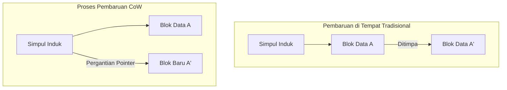
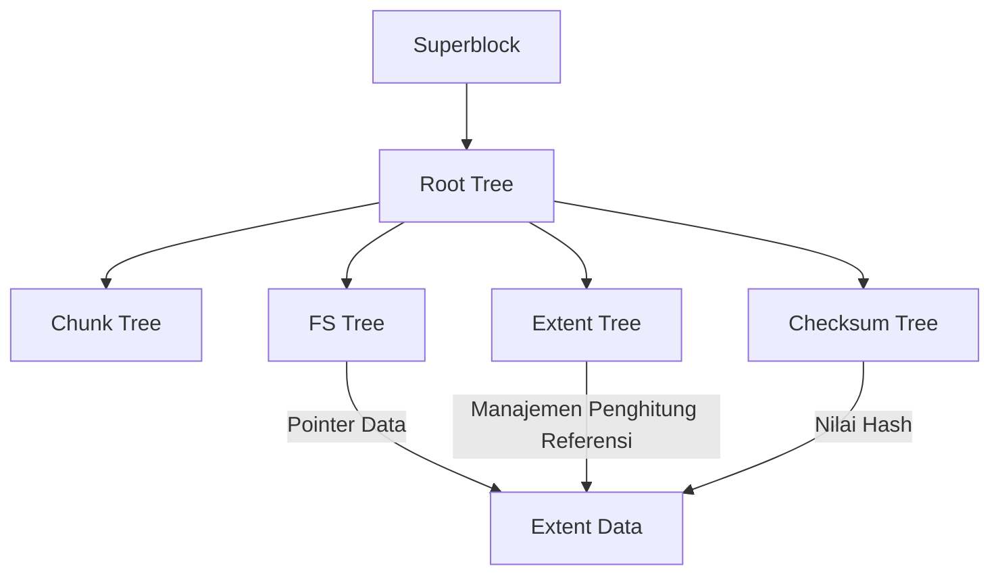

Dalam lingkungan komputasi modern, "sistem file" yang menjamin persistensi data adalah salah satu komponen inti terpenting dari sistem operasi. Namun, seiring dengan kapasitas penyimpanan yang memasuki ranah petabyte dan exabyte, serta mempopulernya memori non-volatil berkapasitas besar dan berkecepatan ultra tinggi seperti SSD dan NVMe, sistem file tradisional yang mewarisi filosofi desain dari beberapa dekade yang lalu mulai mencapai batas arsitekturnya.

Dalam artikel ini, dari perspektif rekayasa sistem file, penyimpanan kernel, dan penyimpanan terdistribusi, kita akan membedah secara menyeluruh arsitektur internal **ZFS** dan **Btrfs**, yang merupakan dua pilar sistem file generasi berikutnya. Bagaimana konsistensi transaksional yang dibawa oleh pergeseran paradigma Copy-on-Write (CoW), penanggulangan terhadap korupsi data senyap (silent data corruption) menggunakan pohon Merkle (pohon hash), dan penyimpanan pemulihan mandiri yang sesungguhnya diwujudkan? Kita akan mengungkap struktur matematisnya yang dalam dan keajaiban pemrograman sistem, sambil menyertakan konsep-konsep di tingkat kode sumber.

---

## Bab 1: Keterbatasan Sistem File Tradisional (ext4/XFS) dan Korupsi Data

Sistem file standar Linux yang kita gunakan sehari-hari, ext4, dan XFS yang membanggakan rekam jejak tinggi di ranah enterprise, adalah perangkat lunak yang sangat luar biasa dan matang. Namun, sistem file ini mengadopsi model pembaruan data klasik yang disebut "pembaruan di tempat (in-place update)", dan memiliki kelemahan fatal di lingkungan penyimpanan skala besar modern.

### 1.1 Keterbatasan Pembaruan di Tempat dan Jurnaling

Pembaruan di tempat adalah metode di mana saat mengubah file, blok data asli pada media penyimpanan langsung ditimpa (overwrite). Metode ini lebih mudah untuk mempertahankan lokalitas blok, yang menguntungkan dalam meminimalkan waktu pencarian (seek time) di era HDD.

Masalah terbesar pada pembaruan di tempat adalah rusaknya "konsistensi kerusakan (crash consistency)" ketika listrik padam atau sistem crash terjadi saat pembaruan berlangsung. Untuk mencegah hal ini, ext4 dan XFS mengadopsi **jurnaling (Write-Ahead Logging; WAL)**. Sebelum memperbarui data, perubahan (metadata atau data itu sendiri) pertama-tama ditulis secara berurutan ke area jurnal, setelah itu pohon sistem file aktual diperbarui.

Namun, sistem file umum hanya mengaktifkan "jurnaling metadata" untuk alasan kinerja, dan pembaruan pada data itu sendiri tidak dicatat dalam jurnal. Akibatnya, pada saat crash, meskipun konsistensi metadata file (ukuran, stempel waktu, inode, dll.) dapat dipulihkan, isi file itu sendiri berisiko menjadi campuran data lama dan baru dalam keadaan "Torn Write (penulisan robek)".

### 1.2 Korupsi Data Senyap (Silent Data Corruption)

Yang lebih mengerikan adalah **korupsi data senyap (Silent Data Corruption)**. Karena bug pada firmware pengontrol perangkat penyimpanan, pembalikan bit (Bit Flip) dalam memori akibat sinar kosmik, degradasi kabel, atau pelemahan magnetik/muatan karena penuaan usia, data yang disimpan diam-diam berubah tanpa terdeteksi oleh OS.

Sistem file tradisional tidak memiliki mekanisme untuk memverifikasi apakah data yang dibaca "benar". Walaupun penyimpanan blok (HDD atau SSD) memiliki ECC (kode koreksi kesalahan) di dalamnya, jika pengontrol membaca data dari lokasi yang salah (Misdirected Read), atau jika penulisan sama sekali tidak terjadi (Phantom Write), perangkat keras penyimpanan itu sendiri akan melaporkan bahwa data "berhasil dibaca dengan normal". OS meneruskan data yang rusak ke aplikasi apa adanya, aplikasi terus memproses tanpa menyadari kejanggalannya, dan akhirnya bahkan cadangan (backup) pun akan ditimpa dengan data yang rusak.

### 1.3 Akhir dari RAID Perangkat Keras dan Masalah "Write Hole"

RAID perangkat keras (RAID 5 dan RAID 6) telah lama digunakan untuk meningkatkan ketersediaan data. Namun, RAID perangkat keras juga bukan solusi mendasar karena hanya bertindak sebagai "perangkat blok biasa" yang tidak memahami struktur internal sistem file.

Yang paling fatal adalah **masalah lubang penulisan RAID (Write Hole)**. Pada RAID 5, jika listrik padam saat memperbarui blok data dan blok paritas, konsistensi antara data dan paritas di dalam stripe akan rusak. Pada pembacaan berikutnya, jika paritas yang rusak ini digunakan untuk memulihkan data, data tersebut akan hancur secara senyap. Selain itu, karena sistem file tidak memiliki checksum, pengontrol RAID tidak memiliki cara logis untuk menentukan "data di disk mana yang benar".

Untuk menerobos batas-batas tumpukan penyimpanan konvensional di mana lapisan fisik, lapisan blok, dan lapisan sistem file terpisah satu sama lain, sistem file generasi berikutnya lahir untuk mengelola keseluruhan penyimpanan secara terintegrasi.

---

## Bab 2: Pergeseran Paradigma Copy-on-Write (CoW)

Pendekatan revolusioner yang diadopsi oleh ZFS dan Btrfs adalah **Copy-on-Write (CoW)**. CoW bukan sekadar fitur, melainkan pergeseran paradigma untuk struktur data sistem file dan manajemen transaksi.

### 2.1 Menghilangkan Pembaruan di Tempat

Pada sistem file CoW, blok data yang sudah ada "sama sekali tidak" ditimpa. Saat memperbarui data, data selalu ditulis ke "ruang kosong baru" pada penyimpanan. Hanya setelah penulisan sepenuhnya selesai, pointer simpul induk (metadata) yang menunjuk ke blok data tersebut diganti secara atomik dari blok lama ke blok baru.

### 2.2 Konsistensi Transaksional dan Rantai Pointer Alokasi

Sistem file mengelola data dalam struktur pohon (tree). Saat blok data yang merupakan simpul daun (leaf node) ditulis di tempat baru, isi dari simpul induk yang memegang pointernya juga berubah. Oleh karena itu, simpul induk juga perlu ditulis ke lokasi baru. Ini menjalar terus seperti efek domino hingga ke simpul akar (root node).

Di akhir serangkaian pembaruan ini, "superblock" (disebut Uberblock di ZFS) di puncak seluruh pohon diperbarui secara atomik. Pada saat penulisan tunggal dan atomik ini selesai, transaksi dipastikan (dikomit). Jika listrik padam di tengah jalan, superblock masih menunjuk ke pohon lama, sehingga sistem melakukan boot dalam keadaan utuh tanpa kerusakan sama sekali. Upaya perbaikan yang memakan waktu menggunakan fsck (pemeriksaan sistem file) pada prinsipnya menjadi tidak diperlukan lagi.

### 2.3 Prinsip Pembuatan Snapshot Seketika

Produk sampingan terbesar dari CoW adalah snapshot super cepat yang dapat dieksekusi dengan kompleksitas $O(1)$.
Pada sistem file biasa, saat menyalin direktori, seluruh data harus diduplikasi secara fisik. Namun di CoW, snapshot diselesaikan hanya dengan menduplikasi pointer dari simpul akar pohon dan menambahkan (increment) "penghitung referensi (Reference Count)" dari setiap simpul.

Saat data diperbarui, blok dengan penghitung referensi 2 atau lebih dipertahankan tanpa ditimpa, dan hanya bagian yang diperbarui yang ditulis ke blok baru. Hal ini memungkinkan sistem untuk membekukan seketika status sistem file pada titik mana pun dalam waktu dan mempertahankannya secara terus-menerus tanpa menghabiskan kapasitas penyimpanan.

---

## Bab 3: Arsitektur Internal ZFS

Dikembangkan oleh Sun Microsystems (sekarang Oracle), ZFS (Zettabyte File System) memiliki arsitektur yang begitu sempurna sehingga dijuluki "kata terakhir dalam sistem file". ZFS menyatukan pengelola volume tradisional, pengontrol RAID, dan sistem file menjadi satu lapisan tunggal yang terintegrasi.

### 3.1 Struktur Tiga Lapis: SPA, DMU, ZPL

Internal ZFS secara garis besar terbagi menjadi 3 komponen.

1. **SPA (Storage Pool Allocator)**
   Mengelola perangkat fisik (vdev: Virtual Device) pada lapisan terbawah. Mengabstraksi HDD dan SSD sebagai sebuah pool, dan menyediakan ruang memori virtual tunggal yang besar ke lapisan atas. Redundansi seperti RAID-Z, striping data, dan I/O untuk pemulihan mandiri ditangani oleh lapisan ini. Di puncak SPA terdapat **Uberblock**.
2. **DMU (Data Management Unit)**
   Jantung dari ZFS. Mengelola semua data sebagai "objek" dan menangani transaksi CoW. DMU tidak memedulikan jenis data (direktori, file, atribut), dan hanya bertanggung jawab untuk memperbarui secara atomik kunci dan nilai, serta asosiasi blok data (dnode).
3. **ZPL (ZFS POSIX Layer)**
   Dibangun di atas sistem objek DMU, ini menyediakan antarmuka sistem file yang kompatibel dengan POSIX (open, read, write, stat, dll.) ke OS.

### 3.2 Uberblock dan Grup Transaksi (TXG)

Di ZFS, penulisan tidak langsung dipantulkan ke disk, melainkan di-batch dalam memori dan dikelompokkan sebagai "Grup Transaksi (TXG)". TXG dikosongkan (flush) ke disk secara bersamaan setiap beberapa detik (ini disebut sinkronisasi transaksi). Pada saat ini, SPA menulis pohon data baru, dan akhirnya memperbarui secara atomik salah satu array Uberblock yang memiliki nomor urut paling baru.

### 3.3 ZFS Intent Log (ZIL) dan SLOG

Penulisan asinkron ditangani secara efisien oleh TXG, namun aplikasi yang menuntut "penulisan sinkron (Synchronous Write)" menggunakan `fsync()`, seperti basis data atau mesin virtual, tidak dapat mentolerir jeda komit TXG selama beberapa detik.
Di sinilah peran **ZIL (ZFS Intent Log)**. Alih-alih melakukan pembaruan pohon secara penuh (CoW), ZIL menulis log perbedaan data yang diubah dengan kecepatan tinggi ke disk. Saat crash, ZIL ini dibaca untuk membangun kembali TXG di dalam memori.

Selain itu, fitur untuk mengalokasikan perangkat khusus, seperti NVDIMM atau SSD NVMe berkecepatan tinggi, sebagai tujuan penulisan ZIL disebut **SLOG (Separate Intent Log)**. Berkat ini, meskipun menggunakan pool HDD yang lambat, latensi dari penulisan sinkron dapat ditingkatkan secara dramatis.

### 3.4 ARC dan L2ARC: Algoritma Cache Pamungkas

Yang menopang kinerja baca ZFS adalah **ARC (Adaptive Replacement Cache)**. Sementara cache halaman kernel Linux tradisional terutama menggunakan LRU (Least Recently Used: membuang data yang paling lama tidak diakses), ARC didasarkan pada algoritma ARC yang diusulkan oleh Megiddo dkk. dari IBM.

ARC mengelola cache dalam 4 daftar berikut:
- **MRU (Most Recently Used)**: Data yang baru saja diakses
- **MFU (Most Frequently Used)**: Data yang sering diakses
- **Ghost MRU**: Daftar data yang keluar dari MRU, namun hanya menyimpan metadata (indeks) saja
- **Ghost MFU**: Daftar metadata dari data yang keluar dari MFU

ARC memantau beban kerja. Jika proses pemindaian (seperti cadangan) berjalan, ukuran MRU akan diperluas; sedangkan jika akses DB konstan berlanjut, MFU akan diperluas. Apabila ada temuan (hit) dalam daftar Ghost, ARC menganggap "seandainya cache ini masih ada, pasti akan hit", dan menyesuaikan ukuran partisi MRU dan MFU secara dinamis.
Selain itu, dengan menyusun **L2ARC (Level 2 ARC)** untuk memindahkan data yang meluap dari ARC ke SSD berkecepatan tinggi, lapisan cache berskala terabyte dapat dibangun.

---

## Bab 4: Arsitektur B-tree of trees pada Btrfs

Di sisi lain, **Btrfs (B-tree file system)** dirancang oleh Chris Mason dkk. dari Oracle sebagai sistem file generasi berikutnya asli Linux. Meskipun ZFS sangat merefleksikan filosofi Solaris (pemisahan lapisan yang ketat), Btrfs mengambil pendekatan integrasi erat dengan VFS (Virtual File System) di Linux.

### 4.1 Struktur Matematis yang Mengekspresikan Semuanya dengan B-tree

Fitur Btrfs yang paling indah sekaligus kompleks adalah bahwa "semua metadata dan struktur manajemen data sistem file murni dibentuk dari B-tree (tepatnya turunan yang mendekati B+ tree)". Btrfs dimodelkan sebagai "B-tree of trees" (Pohon B dari pohon-pohon) yang raksasa.

Pohon-pohon utama adalah sebagai berikut:
1. **Root tree (Akar dari pohon)**: Memegang status dan pointer dari semua simpul akar pohon lainnya.
2. **Chunk tree**: Memetakan blok fisik perangkat (alamat fisik) ke chunk dalam ruang alamat logis. Fungsionalitas RAID perangkat lunak (striping, mirroring) diselesaikan pada lapisan pohon ini.
3. **FS tree (Pohon Sistem File)**: Memegang struktur direktori yang sesungguhnya, nama file, inode, dan pointer ke data file.
4. **Extent tree**: Mengelola ruang kosong pada seluruh sistem file dan referensi balik (backreference) dari extent (blok data yang berurutan) yang sedang digunakan. Ini memungkinkan penanganan fluktuasi penghitung referensi kompleks dari CoW secara efisien.
5. **Checksum tree**: Pohon yang menyimpan checksum blok data secara terpisah.

### 4.2 Eksplorasi CoW dan Algoritma Pembaruan di B-tree

Saat memperbarui data pada Btrfs, sistem akan turun ke bawah pohon untuk mencari extent target. Jika pembaruan di tempat (in-place update), cukup tulis ulang simpul daun; tapi dalam CoW Btrfs, simpul daun disalin ke area fisik baru sebelum ditulis. Akibatnya, pointer dari simpul induk yang menunjuk daun tersebut menjadi tidak valid, sehingga simpul induk pun disalin dan ditulis ulang. Ini terus berlanjut ke atas hingga Root tree.
Dalam proses ini, B-tree perlu melakukan rebalancing (pemisahan atau penggabungan simpul). Btrfs mengimplementasikan algoritma manipulasi B-tree canggih untuk meminimalkan konflik kunci (lock contention), demi meningkatkan kinerja akses bersamaan (concurrent access) di lingkungan multithreading.

### 4.3 Subvolume dan Snapshot

"Subvolume" di Btrfs adalah FS tree independen yang memiliki simpul Root-nya sendiri. Dari perspektif pengguna ia berperilaku seperti direktori, tetapi diperlakukan sepenuhnya sebagai B-tree mandiri di dalam sistem file.
Snapshot pada Btrfs hanyalah operasi penggandaan simpul Root dari suatu subvolume, lalu didaftarkan sebagai subvolume baru. Dengan demikian, seperti halnya ZFS, pembuatan snapshot selesai dalam sekejap.

---

## Bab 5: Checksum Pohon Merkle dan Fitur Pemulihan Mandiri

Fitur yang benar-benar memisahkan ZFS dan Btrfs dari sistem file generasi sebelumnya adalah "Jaminan integritas data dengan checksum berbasis kriptografi (atau non-kriptografi) berdasarkan Pohon Merkle (pohon hash)" dan "Pemulihan Mandiri (Self-Healing)" yang menggunakannya.

### 5.1 Verifikasi Data Melalui Arsitektur Pohon Merkle

Sistem file konvensional dan RAID perangkat keras sering kali menanamkan kode deteksi kesalahan ke dalam blok data itu sendiri. Namun, jika data ditulis di lokasi disk yang salah (Misdirected Write), checksum dari blok itu sendiri akan dianggap "konsisten", sehingga korupsi tidak dapat terdeteksi.

Untuk mencegah hal ini, ZFS dan Btrfs mengadopsi **struktur pohon Merkle**.
Pada ZFS, checksum sebuah blok data (seperti SHA-256 atau fletcher4) tidak disimpan dalam blok tersebut, melainkan disimpan pada "simpul induk (struktur pointer) yang menunjuk ke blok tersebut". Selanjutnya, checksum dari simpul induk disimpan pada induknya lagi, dan akhirnya bermuara pada Uberblock.

Dengan ini, keseluruhan pohon berfungsi sebagai satu rantai hash raksasa. Saat membaca sebuah blok data, OS mengambil checksum dari simpul induk, menghitung nilai hash data yang dibaca, dan membandingkannya. Jika nilai hash tidak cocok, OS dapat mendeteksi **dengan tingkat kepastian mutlak** bahwa data telah membusuk di disk, atau terjadi pembalikan bit pada memori atau kabel di jalurnya.

### 5.2 Mengatasi Masalah Write Hole dan Pemulihan Mandiri pada RAID-Z

RAID-Z pada ZFS (RAID-Z1/Z2/Z3) sepenuhnya menghilangkan masalah write hole yang menjangkiti RAID 5/6 lawas, dengan menggabungkannya bersama CoW.

Pada RAID 5, lebar stripe adalah tetap (misalnya 3 blok data + 1 blok paritas), dan terdapat risiko inkonsistensi saat hanya memperbarui sebagian blok (Read-Modify-Write).
Pada RAID-Z, **lebar stripe berubah secara dinamis** (Variable Stripe Width) bergantung pada ukuran data yang ditulis. Semua penulisan selalu menjadi "penulisan penuh stripe (Full-Stripe Write) ke lokasi baru", sehingga jika terjadi crash di tengah penulisan, stripe lama tetap ada, sedangkan stripe baru hanya dibuang, dan inkonsistensi paritas tidak akan pernah terjadi.

Perhitungan paritas di RAID-Z2/Z3 dilakukan menggunakan pengkodean Reed-Solomon dengan matematika lapangan berhingga (Galois Field: GF(2^8)). Dengan perhitungan matriks yang kompleks, Z3 dapat memulihkan data dari kegagalan 3 disk mana pun sekaligus.

Proses pemulihan mandiri adalah sebagai berikut:
1. Aplikasi meminta data, dan ZFS membaca blok dari Disk A.
2. Memverifikasi checksum, lalu mendeteksi ketidakcocokan (korupsi).
3. ZFS membuang data dari Disk A, dan membaca data dari paritas RAID-Z, atau dari Disk B yang dicerminkan (mirroring) (atau memulihkannya lewat komputasi).
4. Memverifikasi checksum data yang telah dipulihkan, dan mengembalikannya ke aplikasi jika benar.
5. **Di belakang layar, ZFS secara otomatis menulis data yang benar ke blok baru di Disk A (pemulihan) dan memperbarui metadata.**

Tanpa intervensi dari administrator sistem, penyimpanan akan mendeteksi korupsinya sendiri dan memulihkan secara otonom.

### 5.3 Mekanisme Internal Pemrosesan Scrub

Jika perbaikan hanya dilakukan pada saat pembacaan data, data dingin (cold data) yang jarang diakses akan terabaikan dalam waktu lama, yang membawa risiko (akumulasi Bit Rot) data menjadi tidak dapat dipulihkan bila beberapa disk gagal bersamaan.
Untuk mencegah hal ini, dilakukan proses **Scrub**. Saat scrub dieksekusi, sistem file menyusuri struktur pohon dari akar layaknya memindai seluruhnya, lalu membaca semua metadata dan blok data di disk, lalu menghitung ulang dan memverifikasi checksum-nya. Jika menemukan anomali, sistem segera menjalankan pemulihan. Ini mirip dengan pemeriksaan paritas (Patrol Read) dari RAID perangkat keras, tetapi keandalannya jauh lebih tinggi karena memverifikasi struktur logika tingkat metadata dalam lingkup sistem file.

---

## Bab 6: Perbandingan Mendalam ZFS vs Btrfs dan Masa Depan Penyimpanan

ZFS dan Btrfs, yang bersaing menjadi yang terbaik sebagai sistem file generasi berikutnya, memiliki perbedaan yang jelas berdasarkan filosofi desain dan latar belakang historis. Arsitek sistem harus memilih dengan tepat sesuai kebutuhan mereka.

### 6.1 Karakteristik Konsumsi Memori dan Kinerja

- **ZFS**: Seperti yang telah disebutkan, karena mengimplementasikan ARC tersendiri, konsumsi memorinya sangat agresif. Filosofi desainnya adalah "menggunakan sebanyak mungkin memori yang ada", dan direkomendasikan untuk mengalokasikan RAM minimum beberapa GB, hingga puluhan atau ratusan GB ke ARC untuk penggunaan enterprise. Dengan memori yang cukup, kinerjanya tidak tertandingi.
- **Btrfs**: Sangat terintegrasi dengan cache halaman standar (lapisan VFS) dari kernel Linux. Oleh karena itu, jejak memori (memory footprint) dipertahankan setingkat dengan ext4 atau XFS, sehingga berjalan stabil bahkan di perangkat ujung (edge devices) dengan sumber daya terbatas, sistem terbenam (embedded), dan VPS berskala kecil.

### 6.2 Masalah Lisensi: CDDL vs GPL

Alasan terbesar mengapa ZFS belum digabung ke mainline (pohon standar) dari kernel Linux bukan karena masalah teknis, tetapi inkompatibilitas lisensi. CDDL (Common Development and Distribution License) dari ZFS dan GPLv2 dari kernel Linux secara hukum dianggap tidak sejalan. Oleh karena itu, jika menggunakan ZFS di Linux, harus memakai modul kernel yang dikompilasi dan dimuat secara terpisah (OpenZFS).
Sebaliknya, Btrfs murni dikembangkan di bawah lisensi GPL dan dimuat sebagai standar dalam kernel Linux. Btrfs telah diadopsi sebagai sistem file default pada distribusi Linux utama (SUSE, Fedora, dll.).

### 6.3 Contoh Kasus Penggunaan dan Adopsi

**Wilayah ZFS (OpenZFS)**:
Mendapatkan dukungan besar untuk peranti penyimpanan seperti TrueNAS, infrastruktur hypervisor seperti Proxmox VE dan LXD, serta server cadangan enterprise di mana data sama sekali tidak boleh hilang. Selain itu, ZFS sudah bertahun-tahun bertakhta sebagai sistem file standar FreeBSD.

**Wilayah Btrfs**:
Sistem file root (akar) untuk armada jutaan server Linux di infrastruktur Facebook (Meta), NAS konsumer/SMB dari Synology dan lainnya, OS gaming seperti Steam Deck, dan default di Fedora Workstation, di mana ia tersebar luas dengan memanfaatkan manajemen volume yang fleksibel dan kemampuan snapshot.

### 6.4 Menuju Infrastruktur Penyimpanan di Era Cloud-Native

Dengan populerisasi teknologi kontainer (Docker/Kubernetes), penyimpanan dituntut memiliki fungsionalitas untuk "membuat dan memusnahkan snapshot dalam hitungan milidetik" dan "meningkatkan efisiensi pelapisan gambar kontainer". Fitur CoW pada ZFS dan Btrfs memiliki sinergi yang luar biasa sebagai driver penyimpanan kontainer (sebagai alternatif atau backend overlayfs).

Selain itu, dengan munculnya perangkat keras generasi baru seperti disagregasi penyimpanan (pemisahan dan pembagian) lewat CXL (Compute Express Link) atau NVMe-oF, serta penyimpanan komputasional, sistem file berevolusi dari sekadar "wadah data" menjadi "pesawat kendali data (data control plane)" yang mengelola perlindungan data, enkripsi, kompresi, dan deduplikasi secara terpadu.

Paradigma "CoW dan Pemulihan Mandiri" yang dipelopori oleh ZFS dan Btrfs, pada masa kini di mana data adalah sumber dari segala nilai, menjadi tameng terkuat untuk melindungi properti intelektual umat manusia dari kehancuran fisik. Kita kini sedang menyaksikan akhir dari arsitektur penyimpanan tradisional dan awal dari fajar menyingsing untuk sistem file generasi berikutnya yang cerdas dan otonom.
