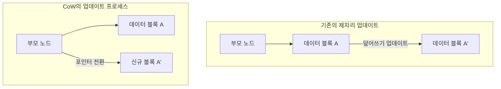
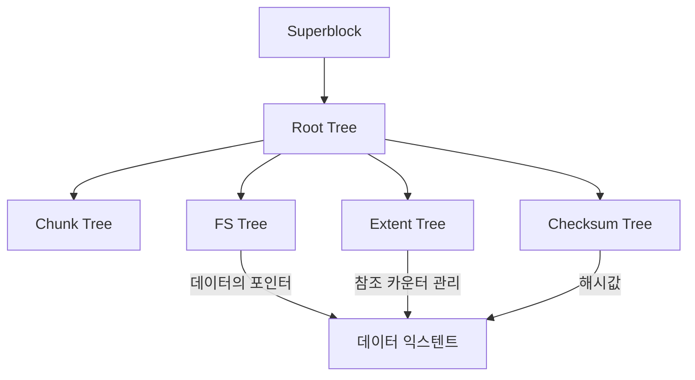

현대 컴퓨팅 환경에서 데이터의 영속성을 보장하는 "파일시스템"은 운영 체제의 핵심을 이루는 가장 중요한 구성 요소 중 하나이다. 그러나 스토리지 용량이 페타바이트, 엑사바이트 영역으로 진입하고, SSD나 NVMe와 같은 초고속, 대용량 비휘발성 메모리가 보급되면서 수십 년 전의 설계 사상을 이어받은 전통적인 파일시스템은 아키텍처 상의 한계에 직면하고 있다.

본고에서는 파일시스템 공학, 커널 스토리지, 그리고 분산 스토리지의 관점에서 차세대 파일시스템의 양대 산맥을 이루는 **ZFS**와 **Btrfs**의 내부 아키텍처를 철저히 해부한다. Copy-on-Write(CoW)라는 패러다임 전환이 가져온 트랜잭션적 일관성, Merkle 트리(해시 트리)를 활용한 조용한 데이터 부패(Silent Data Corruption)에 대한 대응 수단, 그리고 진정한 의미의 자가 복구 스토리지가 어떻게 구현되는지 알아본다. 그 심오한 수리 구조와 시스템 프로그래밍의 묘미를 소스 코드 수준의 개념과 함께 풀어낸다.

---

## 제1장: 전통적 파일시스템(ext4/XFS)의 한계와 데이터 부패

우리가 일상적으로 사용하는 Linux의 표준 파일시스템인 ext4나 엔터프라이즈 영역에서 높은 실적을 자랑하는 XFS는 매우 우수하고 성숙한 소프트웨어이다. 하지만 이러한 파일시스템은 "제자리 업데이트(In-place update)"라는 고전적인 데이터 업데이트 모델을 채택하고 있어, 현대의 대규모 스토리지 환경에서는 치명적인 약점을 안고 있다.

### 1.1 제자리 업데이트와 저널링의 한계

제자리 업데이트란 파일에 변경을 가할 때 스토리지 미디어상의 원래 데이터 블록을 직접 덮어쓰는 방식이다. 이 방식은 블록의 지역성(Locality)을 유지하기 쉬워 HDD 시대에는 탐색 시간(Seek Time)을 최소화하는 데 유리했다.

제자리 업데이트의 가장 큰 문제는 업데이트 중 전원 차단이나 시스템 크래시가 발생했을 때의 "크래시 일관성(Crash Consistency)" 붕괴이다. 이를 방지하기 위해 ext4나 XFS는 **저널링(Write-Ahead Logging; WAL)**을 채택하고 있다. 데이터를 업데이트하기 전에 먼저 그 변경 내용(메타데이터, 혹은 데이터 자체)을 저널 영역에 순차적으로 기록하고, 그 후에 실제 파일시스템 트리를 업데이트한다.

그러나 일반적인 파일시스템은 성능상의 이유로 "메타데이터 저널링"만을 활성화하고 있으며, 데이터 자체의 업데이트는 저널에 기록되지 않는다. 결과적으로 크래시 발생 시 파일의 메타데이터(크기, 타임스탬프, inode 등)의 일관성은 복구할 수 있지만, 파일의 내용 자체는 오래된 데이터와 새로운 데이터가 뒤섞인 "찢어진 쓰기(Torn Write)" 상태가 될 위험을 내포하고 있다.

### 1.2 조용한 데이터 부패(Silent Data Corruption)

더욱 무서운 것은 **조용한 데이터 부패(Silent Data Corruption)**이다. 스토리지 장치의 컨트롤러 펌웨어 버그, 우주선(Cosmic ray)에 의한 메모리 상의 비트 반전(Bit Flip), 케이블의 열화, 혹은 노후화로 인한 자기 및 전하의 감쇠 등으로 인해 저장된 데이터가 OS가 감지하지 못하는 사이에 조용히 변해버리는 현상이다.

전통적인 파일시스템은 읽어 들인 데이터가 "올바른지"를 검증하는 메커니즘을 가지고 있지 않다. 블록 스토리지(HDD나 SSD) 내부에는 ECC(오류 정정 부호)가 존재하지만, 컨트롤러가 잘못된 위치에서 데이터를 읽어 들인 경우(Misdirected Read)나 아예 쓰기가 이루어지지 않은 경우(Phantom Write)에는 스토리지 하드웨어 자체가 "정상적으로 읽었다"고 보고해 버린다. OS는 손상된 데이터를 그대로 애플리케이션에 전달하고, 애플리케이션은 이상을 눈치채지 못한 채 처리를 계속하며, 결국 백업조차도 손상된 데이터로 덮어씌워지게 되는 것이다.

### 1.3 하드웨어 RAID의 종언과 '쓰기 구멍(Write Hole)' 문제

데이터의 가용성을 높이기 위해 하드웨어 RAID(RAID 5나 RAID 6)가 오랫동안 사용되어 왔다. 하지만 하드웨어 RAID 역시 파일시스템의 내부 구조를 이해하지 못하는 "단순한 블록 디바이스"로 동작하기 때문에 근본적인 해결책이 되지 못한다.

특히 치명적인 것이 **RAID의 쓰기 구멍(Write Hole) 문제**이다. RAID 5에서 데이터 블록과 패리티 블록을 업데이트하는 중에 전원이 차단되면, 스트라이프 내의 데이터와 패리티의 일관성이 무너진다. 다음 읽기 시에 이 무너진 패리티를 사용하여 데이터를 복원해버리면 데이터가 조용히 파괴된다. 게다가 파일시스템 측에 체크섬이 없기 때문에 RAID 컨트롤러는 "어느 디스크의 데이터가 올바른가"를 논리적으로 판단할 방법이 없다.

이러한 물리 계층, 블록 계층, 파일시스템 계층이 분절된 기존 스토리지 스택의 한계를 타파하기 위해 탄생한 것이 스토리지 전체를 통합적으로 관리하는 차세대 파일시스템이다.

---

## 제2장: Copy-on-Write(CoW) 패러다임 전환

ZFS와 Btrfs가 채택한 혁명적인 접근 방식이 **Copy-on-Write(CoW: 카피 온 라이트)**이다. CoW는 단순한 기능이 아니라, 파일시스템의 데이터 구조와 트랜잭션 관리에 대한 패러다임 전환이다.

### 2.1 제자리 업데이트의 배제

CoW 파일시스템에서는 기존의 데이터 블록을 "절대" 덮어쓰지 않는다. 데이터를 업데이트할 경우 항상 스토리지 상의 "새로운 빈 공간"에 데이터를 기록한다. 쓰기가 완전히 종료된 후, 해당 데이터 블록을 가리키는 부모 노드(메타데이터)의 포인터를 기존 블록에서 새로운 블록으로 원자적(Atomic)으로 전환한다.

### 2.2 트랜잭션적 일관성과 할당 포인터의 연쇄

파일시스템은 트리 구조로 데이터를 관리한다. 단말(Leaf) 노드인 데이터 블록을 새로운 위치에 기록하면, 그 포인터를 가진 부모 노드의 내용도 변한다. 따라서 부모 노드 역시 새로운 위치에 기록해야 한다. 이것이 꼬리를 물고 루트 노드까지 전파된다.

이 일련의 업데이트의 마지막에 트리 전체의 꼭대기에 있는 "슈퍼블록(ZFS에서는 Uberblock이라 부름)"을 원자적으로 업데이트한다. 이 단일하고 원자적인 쓰기가 완료되는 순간 트랜잭션이 확정(커밋)된다. 만약 중간에 전원 차단이 발생하더라도 슈퍼블록은 오래된 트리를 가리키고 있으므로 시스템은 완전히 온전한 이전 상태 그대로 부팅된다. fsck(파일시스템 검사)를 통한 장시간의 복구 작업은 원리적으로 필요하지 않게 된다.

### 2.3 순식간에 스냅샷을 생성하는 원리

CoW의 가장 큰 부산물이 바로 계산 복잡도 $O(1)$로 실행 가능한 초고속 스냅샷이다.
일반적인 파일시스템에서 디렉터리를 복사하면 모든 데이터를 물리적으로 복제해야 한다. 하지만 CoW에서는 트리의 루트 노드 포인터를 복제하고 각 노드의 "참조 카운터(Reference Count)"를 증가시키기만 하면 스냅샷이 완성된다.

데이터가 업데이트될 때 참조 카운터가 2 이상인 블록은 덮어씌워지지 않고 보존되며, 업데이트된 부분만 새로운 블록에 기록된다. 이를 통해 스토리지 용량을 소비하지 않고도 임의의 시점의 파일시스템 상태를 순식간에 동결하고 계속 보존할 수 있다.

---

## 제3장: ZFS의 내부 아키텍처

Sun Microsystems(현 Oracle)가 개발한 ZFS(Zettabyte File System)는 "파일시스템에 관한 마지막 장"이라고 불릴 정도로 완성도 높은 아키텍처를 가지고 있다. ZFS는 기존의 볼륨 매니저, RAID 컨트롤러, 파일시스템을 단일 통합 레이어로 융합했다.

### 3.1 SPA, DMU, ZPL의 3계층 구조

ZFS의 내부는 크게 세 개의 컴포넌트로 나뉜다.

1. **SPA (Storage Pool Allocator)**
   최하위 계층에서 물리 디바이스(vdev: Virtual Device)를 관리한다. HDD나 SSD를 풀(Pool)로 추상화하여 상위 계층에 단일한 거대 가상 저장 공간을 제공한다. RAID-Z 등의 이중화나 데이터의 스트라이핑, 자가 복구를 위한 I/O를 이 계층이 담당한다. SPA의 정점에는 **Uberblock**이 존재한다.
2. **DMU (Data Management Unit)**
   ZFS의 심장부이다. 모든 데이터를 "객체"로 관리하고 CoW 트랜잭션을 처리한다. DMU는 데이터의 종류(디렉터리, 파일, 속성)를 의식하지 않고 단지 키와 값, 그리고 데이터 블록의 연관성(dnode)을 원자적으로 업데이트하는 책임을 진다.
3. **ZPL (ZFS POSIX Layer)**
   DMU의 객체 시스템 위에 구축되어 OS에 POSIX 호환 파일시스템 인터페이스(open, read, write, stat 등)를 제공한다.

### 3.2 Uberblock과 트랜잭션 그룹(TXG)

ZFS에서는 쓰기를 즉시 디스크에 반영하지 않고 메모리상에서 배치 처리하여 "트랜잭션 그룹(TXG)"으로 묶는다. TXG는 몇 초마다 한 번씩 묶어서 디스크에 플러시(Flush)된다(이를 트랜잭션 동기화라고 한다). 이때 SPA는 새로운 데이터 트리를 기록하고 마지막으로 Uberblock 배열 중 가장 최신의 시퀀스 번호를 가진 것을 원자적으로 업데이트한다.

### 3.3 ZFS Intent Log (ZIL) 와 SLOG

비동기 쓰기는 TXG에 의해 효율적으로 처리되지만, 데이터베이스나 가상 머신처럼 `fsync()`를 통한 "동기식 쓰기(Synchronous Write)"를 요구하는 애플리케이션에서는 몇 초의 TXG 커밋을 기다릴 수 없다.
이때 등장하는 것이 **ZIL (ZFS Intent Log)**이다. ZIL은 완전한 트리 업데이트(CoW)를 수행하는 대신, 변경된 데이터의 차분 로그를 고속으로 디스크에 기록한다. 크래시가 발생하면 이 ZIL을 읽어 들여 메모리상의 TXG를 재구성한다.

나아가 ZIL의 기록 대상으로 NVDIMM이나 고속 NVMe SSD 등 전용 디바이스를 할당하는 기능이 **SLOG (Separate Intent Log)**이다. 이를 통해 저속 HDD 풀이라도 동기식 쓰기의 지연 시간을 극적으로 개선할 수 있다.

### 3.4 ARC와 L2ARC: 궁극의 캐시 알고리즘

ZFS의 읽기 성능을 뒷받침하는 것이 **ARC (Adaptive Replacement Cache)**이다. 기존 Linux 커널의 페이지 캐시가 주로 LRU(Least Recently Used: 가장 오랫동안 사용되지 않은 것을 폐기)를 사용하는 반면, ARC는 IBM의 Megiddo 등이 제안한 ARC 알고리즘을 기반으로 한다.

ARC는 캐시를 다음 4개의 리스트로 관리한다:
- **MRU (Most Recently Used)**: 최근에 접근된 데이터
- **MFU (Most Frequently Used)**: 빈번하게 접근되는 데이터
- **Ghost MRU**: MRU에서 밀려났지만 메타데이터(인덱스)만 기록하고 있는 리스트
- **Ghost MFU**: MFU에서 밀려난 메타데이터 리스트

ARC는 워크로드를 감시하여 스캔 처리(백업 등)가 실행되면 MRU를 확장하고, 지속적인 DB 접근이 계속되면 MFU를 확장한다. Ghost 리스트에 히트할 경우 "이 캐시가 남아있었다면 히트했을 것"이라고 판단하여 동적으로 MRU와 MFU의 파티션 크기를 조정한다.
또한 ARC에서 넘쳐나는 데이터를 고속 SSD로 넘기는 **L2ARC (Level 2 ARC)**를 구성함으로써 테라바이트급의 캐시 계층을 구축할 수 있다.

---

## 제4장: Btrfs의 B-tree of trees 아키텍처

한편, Linux 네이티브 차세대 파일시스템으로서 Oracle의 Chris Mason 등이 설계한 것이 **Btrfs (B-tree file system)**이다. ZFS가 Solaris의 사상(계층의 엄격한 분리)을 짙게 반영하고 있는 반면, Btrfs는 Linux의 VFS(Virtual File System)와 긴밀하게 연계하는 방식을 취하고 있다.

### 4.1 모든 것을 B-트리로 표현하는 수리 구조

Btrfs의 가장 아름답고도 복잡한 특징은 "파일시스템의 모든 메타데이터와 데이터 관리 구조가 순수한 B-트리(엄밀히는 B+ 트리에 가까운 파생형)로 구성되어 있다"는 점이다. Btrfs는 거대한 "B-tree of trees(B-트리들의 트리)"로 모델링되어 있다.

주요 트리는 다음과 같다:
1. **Root tree (트리의 루트)**: 다른 모든 트리의 루트 노드 포인터와 상태를 유지한다.
2. **Chunk tree**: 물리 디바이스의 블록(물리 주소)을 논리 주소 공간의 청크에 매핑한다. 소프트웨어 RAID의 기능(스트라이핑, 미러링)은 이 트리 계층에서 해결된다.
3. **FS tree (파일시스템 트리)**: 실제 디렉터리 구조, 파일명, inode, 파일 데이터에 대한 포인터를 유지한다.
4. **Extent tree**: 파일시스템 전체의 여유 공간과 사용 중인 익스텐트(데이터의 연속된 블록)의 백레퍼런스(역참조)를 관리한다. 이를 통해 CoW에 의한 복잡한 참조 카운터 증감을 효율적으로 처리한다.
5. **Checksum tree**: 데이터 블록의 체크섬만을 독립적으로 유지하는 트리.

### 4.2 B-트리에서의 CoW 탐색 및 업데이트 알고리즘

Btrfs에서 데이터를 업데이트할 때, 트리를 타고 내려가 대상 익스텐트를 찾는다. 제자리 업데이트라면 단말(Leaf) 노드를 덮어쓰기만 하면 되지만, Btrfs의 CoW에서는 단말 노드를 새로운 물리 영역으로 복사하여 덮어쓴다. 그러면 그 단말을 가리키던 부모 노드의 포인터가 무효가 되므로 부모 노드 역시 복사하여 다시 쓴다. 이것이 Root tree까지 도달한다.
이 과정에서 B-트리는 리밸런싱(노드의 분할이나 결합)을 수행해야 한다. Btrfs는 멀티스레드 환경에서의 동시 접근 성능을 높이기 위해 락(Lock) 경합을 최소화하는 고도의 B-트리 조작 알고리즘을 구현하고 있다.

### 4.3 서브볼륨과 스냅샷

Btrfs에서 "서브볼륨"이란 고유의 Root 노드를 가지는 독립된 FS tree를 말한다. 사용자에게는 디렉터리처럼 동작하지만 파일시스템 내부에서는 완전히 독립된 B-트리로 취급된다.
Btrfs의 스냅샷은 어떤 서브볼륨의 Root 노드를 복제하여 새로운 서브볼륨으로 등록하는 단순한 작업이다. 따라서 ZFS와 마찬가지로 스냅샷 생성은 한순간에 완료된다.

---

## 제5장: Merkle 트리 체크섬과 자가 복구 기능

ZFS와 Btrfs를 구세대 파일시스템과 결정적으로 구분 짓는 기능이 "Merkle 트리(해시 트리) 기반의 암호학적(또는 비암호학적) 체크섬에 의한 데이터 무결성 보장"과 이를 이용한 "자가 복구(Self-Healing)"이다.

### 5.1 Merkle 트리 아키텍처를 통한 데이터 검증

기존 파일시스템이나 하드웨어 RAID는 데이터 블록 자체 내에 오류 검출 코드를 내장하는 경우가 많다. 그러나 데이터가 디스크의 잘못된 위치에 기록된 경우(Misdirected Write), 블록 자체의 체크섬은 "일관성이 맞다"고 판정되어 버려 손상을 감지할 수 없다.

이를 방지하기 위해 ZFS와 Btrfs는 **Merkle 트리 구조**를 채택하고 있다.
ZFS의 경우 데이터 블록의 체크섬(SHA-256이나 fletcher4 등)은 해당 블록 자신이 아니라 "그 블록을 가리키는 부모 노드(의 포인터 구조체)"에 저장된다. 나아가 부모 노드의 체크섬은 또 그 부모에 저장되며, 최종적으로 Uberblock에 이르게 된다.

이를 통해 트리 전체가 하나의 거대한 해시 체인으로 기능한다. 어떤 데이터 블록을 읽어 들일 때 OS는 부모 노드에서 체크섬을 가져오고, 읽어 들인 데이터의 해시값을 계산하여 비교한다. 만약 해시값이 일치하지 않으면 데이터가 디스크 상에서 부패했거나 혹은 경로상의 메모리나 케이블에서 비트 반전이 발생했음을 **절대적인 확실성으로 감지**할 수 있다.

### 5.2 RAID-Z에서의 쓰기 구멍 문제 극복과 자가 복구

ZFS의 RAID-Z(RAID-Z1/Z2/Z3)는 기존 RAID 5/6가 안고 있던 쓰기 구멍 문제를 CoW와 결합하여 완벽하게 해소하고 있다.

RAID 5에서는 스트라이프 폭(예: 데이터 3블록 + 패리티 1블록)이 고정되어 있어 일부 블록만을 업데이트할 때(Read-Modify-Write) 불일치의 위험이 있었다.
RAID-Z에서는 기록되는 데이터의 크기에 따라 **스트라이프 폭이 동적으로 변화**한다(Variable Stripe Width). 모든 쓰기는 항상 "새로운 장소에 대한 전체 스트라이프 쓰기(Full-Stripe Write)"가 되므로, 업데이트 도중 크래시가 발생하더라도 이전 스트라이프는 그대로 남고 새로운 스트라이프만 폐기될 뿐이며, 패리티의 불일치는 절대 발생하지 않는다.

RAID-Z2/Z3에서의 패리티 계산은 유한체(Galois Field: GF(2^8)) 수학을 이용한 리드 솔로몬(Reed-Solomon) 부호화를 통해 이루어진다. 복잡한 행렬 연산 덕분에 Z3라면 임의의 디스크 3대의 장애로부터 데이터를 복원할 수 있다.

자가 복구 프로세스는 다음과 같다:
1. 애플리케이션이 데이터를 요청하고, ZFS가 디스크 A에서 블록을 읽는다.
2. 체크섬을 검증하여 불일치(손상)를 감지한다.
3. ZFS는 디스크 A의 데이터를 폐기하고 RAID-Z의 패리티 또는 미러링된 디스크 B에서 데이터를 읽어 들인다(또는 계산을 통해 복원한다).
4. 복원한 데이터의 체크섬을 검증하고 올바르다면 애플리케이션에 데이터를 반환한다.
5. **백그라운드에서 자동으로 올바른 데이터를 디스크 A의 새로운 블록에 기록(복구)하고 메타데이터를 업데이트한다.**

시스템 관리자가 개입하지 않아도 스토리지는 스스로 부패를 감지하고 자율적으로 복구를 수행하는 것이다.

### 5.3 스크럽(Scrub) 처리의 내부 동작

데이터를 읽어 들일 때만 복구가 수행된다면, 접근 빈도가 낮은 콜드 데이터가 오랫동안 방치되어 여러 디스크의 동시 고장으로 인해 복구 불가능해질 위험(Bit Rot의 축적)이 있다.
이를 방지하는 것이 **스크럽(Scrub)**이다. 스크럽을 실행하면 파일시스템은 트리 구조를 루트부터 훑듯이 순회하며 디스크 상의 모든 메타데이터와 데이터 블록을 읽어 들이고, 체크섬을 재계산하여 검증한다. 이상이 발견되면 즉시 복구를 실행한다. 이는 하드웨어 RAID의 패리티 체크(Patrol Read)와 비슷하지만 파일시스템 계층에서 메타데이터의 논리적 구조까지 포함하여 검증하기 때문에 신뢰성이 압도적으로 높다.

---

## 제6장: ZFS vs Btrfs 철저 비교 및 미래의 스토리지

차세대 파일시스템으로서 패권을 다투는 ZFS와 Btrfs에는 설계 사상이나 역사적 배경에 따른 명확한 차이가 존재한다. 시스템 아키텍트는 요구사항에 맞게 이들을 적절히 선택해야 한다.

### 6.1 메모리 소비량과 성능 특성

- **ZFS**: 앞서 언급했듯 독자적인 ARC를 구현하고 있어 메모리를 매우 공격적으로 소비한다. "메모리는 있는 대로 쓴다"는 설계 사상이며, 최소 수 GB, 엔터프라이즈 용도로는 수십 GB에서 수백 GB의 RAM을 ARC에 할당하는 것이 권장된다. 메모리가 충분하다면 무적의 성능을 자랑한다.
- **Btrfs**: Linux 커널의 표준 페이지 캐시(VFS 계층)와 긴밀하게 통합되어 있다. 때문에 메모리 풋프린트는 ext4나 XFS와 동등한 수준으로 억제되어 있어, 리소스가 제한된 엣지 디바이스나 임베디드 시스템, 소규모 VPS에서도 안정적으로 동작한다.

### 6.2 라이선스 문제: CDDL vs GPL

ZFS가 Linux 커널의 메인라인(표준 트리)에 병합되지 않는 가장 큰 이유는 기술적인 것이 아니라 라이선스의 비호환성이다. ZFS의 CDDL(Common Development and Distribution License)과 Linux 커널의 GPLv2는 법적으로 양립할 수 없다고 여겨진다. 따라서 Linux에서 ZFS를 사용할 경우 커널 모듈을 별도로 컴파일하여 로드하는 방식(OpenZFS)을 취한다.
대조적으로 Btrfs는 순수 GPL로 개발되어 Linux 커널에 기본 탑재되어 있다. 주요 Linux 배포판(SUSE, Fedora 등)에서는 기본 파일시스템으로 채택되고 있다.

### 6.3 사용 사례 및 채택 사례

**ZFS(OpenZFS)의 영역**:
TrueNAS 등의 스토리지 어플라이언스, Proxmox VE나 LXD 등의 하이퍼바이저 기반, 그리고 절대 데이터를 잃어버려선 안 되는 엔터프라이즈 백업 서버 등에서 절대적인 지지를 얻고 있다. 또한 FreeBSD에서는 오랫동안 표준 파일시스템으로 군림하고 있다.

**Btrfs의 영역**:
Facebook(Meta) 인프라의 수백만 대 Linux 서버군의 루트 파일시스템, Synology 등 소비자/SMB용 NAS, Steam Deck 등의 게이밍 OS, 그리고 Fedora Workstation의 기본값으로서, 유연한 볼륨 관리와 스냅샷 기능을 활용하여 널리 보급되고 있다.

### 6.4 클라우드 네이티브 시대의 스토리지 기반으로

컨테이너 기술(Docker/Kubernetes)의 보급으로 스토리지에는 "밀리초 단위의 스냅샷 생성 및 파기"나 "컨테이너 이미지 레이어링의 효율화"가 요구되고 있다. ZFS나 Btrfs의 CoW 기능은 컨테이너의 스토리지 드라이버(overlayfs의 대체나 백엔드)로서 매우 상성이 좋다.

나아가 CXL(Compute Express Link)이나 NVMe-oF를 통한 스토리지의 디스어그리게이션(분리 및 공유화), 컴퓨테이셔널 스토리지 등 차세대 하드웨어가 등장함에 따라, 파일시스템은 단순한 "데이터 그릇"에서 데이터 보호, 암호화, 압축, 중복 제거(Deduplication)를 통합적으로 관장하는 "데이터 컨트롤 플레인"으로 진화하고 있다.

ZFS와 Btrfs가 개척한 "CoW와 자가 복구"라는 패러다임은 데이터가 모든 가치의 원천이 되는 현대에 인류의 지적 재산을 물리적인 붕괴로부터 지켜내기 위한 최강의 방패이다. 우리는 지금 전통적인 스토리지 아키텍처의 종말과 지성적이고 자율적인 차세대 파일시스템의 여명을 목격하고 있는 것이다.
