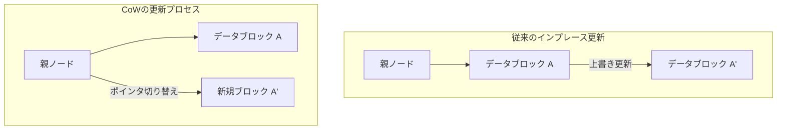
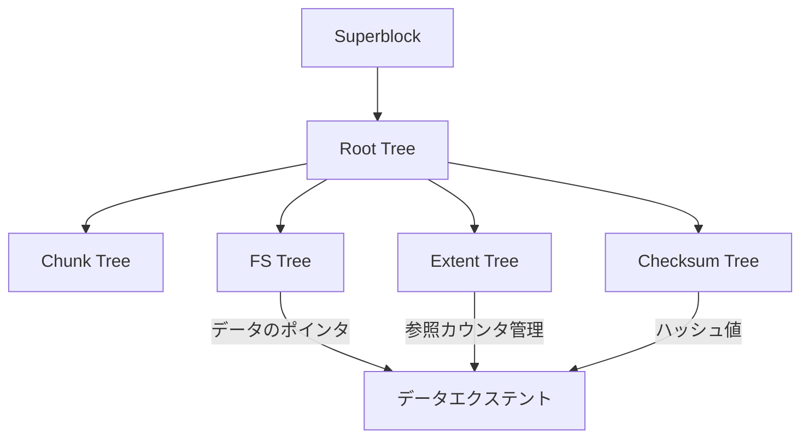

現代のコンピューティング環境において、データの永続性を担保する「ファイルシステム」は、オペレーティングシステムの中核を成す最も重要なコンポーネントの一つである。しかし、ストレージ容量がペタバイト、エクサバイトの領域へと突入し、SSDやNVMeといった超高速・大容量の不揮発性メモリが普及する中で、数十年前の設計思想を引き継ぐ伝統的なファイルシステムは、アーキテクチャ上の限界を迎えつつある。

本稿では、ファイルシステム工学、カーネルストレージ、そして分散ストレージの観点から、次世代ファイルシステムの双璧を成す**ZFS**と**Btrfs**の内部アーキテクチャを徹底的に解剖する。Copy-on-Write（CoW）というパラダイムシフトがもたらしたトランザクション的一貫性、Merkle木（ハッシュ木）を用いたサイレントデータコラプション（静かなるデータ腐敗）への対抗手段、そして真の意味での自己修復ストレージがどのように実現されているのか。その深淵なる数理構造とシステムプログラミングの妙技を、ソースコードレベルの概念を交えながら解き明かしていく。

---

## 第1章：伝統的ファイルシステム（ext4/XFS）の限界とデータ腐敗

我々が日常的に使用しているLinuxの標準ファイルシステムであるext4や、エンタープライズ領域で高い実績を誇るXFSは、極めて優秀で成熟したソフトウェアである。しかし、これらのファイルシステムは「インプレース更新（In-place update）」という古典的なデータ更新モデルを採用しており、現代の大規模ストレージ環境においては致命的な弱点を抱えている。

### 1.1 インプレース更新とジャーナリングの限界

インプレース更新とは、ファイルに変更を加える際、ストレージメディア上の元のデータブロックを直接上書きする方式である。この方式はブロックの局所性を保ちやすく、HDD時代においてはシークタイムを最小化する上で有利であった。

インプレース更新における最大の問題は、更新中に電源断やシステムクラッシュが発生した場合の「クラッシュ・コンシステンシ（一貫性）」の崩壊である。これを防ぐため、ext4やXFSは**ジャーナリング（Write-Ahead Logging; WAL）**を採用している。データの更新を行う前に、まずその変更内容（メタデータ、あるいはデータそのもの）をジャーナル領域にシーケンシャルに書き込み、その後に実際のファイルシステムツリーを更新する。

しかし、一般的なファイルシステムはパフォーマンス上の理由から「メタデータ・ジャーナリング」のみを有効にしており、データ自体の更新はジャーナルに記録されない。結果として、クラッシュ時にはファイルのメタデータ（サイズ、タイムスタンプ、inodeなど）の整合性は復旧できるが、ファイルの中身そのものは古いデータと新しいデータが混ざり合った「Torn Write（引き裂かれた書き込み）」状態になるリスクを孕んでいる。

### 1.2 サイレントデータコラプション（静かなるデータ腐敗）

さらに恐ろしいのが**サイレントデータコラプション（Silent Data Corruption）**である。ストレージデバイスのコントローラファームウェアのバグ、宇宙線によるメモリ上のビット反転（Bit Flip）、ケーブルの劣化、あるいは経年劣化による磁気・電荷の減衰などにより、保存されているデータがOSの感知しないところで静かに変化してしまう現象だ。

伝統的なファイルシステムは、読み出したデータが「正しいか」を検証するメカニズムを持たない。ブロックストレージ（HDDやSSD）の内部にはECC（エラー訂正符号）が存在するが、コントローラが誤った場所からデータを読み出した場合（Misdirected Read）や、書き込みがそもそも行われなかった場合（Phantom Write）には、ストレージハードウェア自身は「正常に読み出せた」と報告してしまう。OSは腐敗したデータをそのままアプリケーションに渡し、アプリケーションは異常に気づかないまま処理を継続し、やがてバックアップすらも腐敗したデータで上書きされてしまうのである。

### 1.3 ハードウェアRAIDの終焉と「ライトホール」問題

データの可用性を高めるためにハードウェアRAID（RAID 5やRAID 6）が長年用いられてきた。しかし、ハードウェアRAIDもファイルシステムの内部構造を理解していない「単なるブロックデバイス」として振る舞うため、根本的な解決にはならない。

特に致命的なのが**RAIDのライトホール（Write Hole）問題**である。RAID 5において、データブロックとパリティブロックの更新中に電源断が発生すると、ストライプ内のデータとパリティの整合性が崩れる。次回読み出し時に、この崩れたパリティを用いてデータを復元してしまうと、データがサイレントに破壊される。さらに、ファイルシステム側にチェックサムが存在しないため、RAIDコントローラは「どのディスクのデータが正しいのか」を論理的に判断する術を持たない。

こうした物理層・ブロック層・ファイルシステム層が分断された従来のストレージスタックの限界を打ち破るために誕生したのが、ストレージ全体を統合的に管理する次世代ファイルシステムである。

---

## 第2章：Copy-on-Write（CoW）パラダイムシフト

ZFSやBtrfsが採用した革命的なアプローチが**Copy-on-Write（CoW：コピー・オン・ライト）**である。CoWは、単なる機能ではなく、ファイルシステムのデータ構造とトランザクション管理に対するパラダイムシフトである。

### 2.1 インプレース更新の排除

CoWファイルシステムにおいては、既存のデータブロックを「絶対に」上書きしない。データを更新する場合、常にストレージ上の「新しい空き領域」にデータを書き込む。書き込みが完全に終了した後で、そのデータブロックを指し示す親ノード（メタデータ）のポインタを、古いブロックから新しいブロックへとアトミックに切り替える。

### 2.2 トランザクション的一貫性とアロケーション・ポインタの連鎖

ファイルシステムは木構造（ツリー）でデータを管理している。葉（リーフ）ノードであるデータブロックを新しい場所に書き込むと、そのポインタを持つ親ノードの内容も変化する。そのため、親ノードも新しい場所に書き込む必要がある。これが芋づる式にルートノードまで伝播していく。

この一連の更新の最後に、ツリー全体の頂点にある「スーパーブロック（ZFSではUberblockと呼ばれる）」をアトミックに更新する。この単一のアトミックな書き込みが完了した瞬間に、トランザクションが確定（コミット）する。もし途中で電源断が発生しても、スーパーブロックは古いツリーを指し示しているため、システムは完全に無傷の古い状態のまま起動する。fsck（ファイルシステムチェック）による長時間の修復作業は原理的に不要となる。

### 2.3 瞬時のスナップショット作成の原理

CoWの最大の副産物が、計算量 $O(1)$ で実行可能な超高速スナップショットである。
通常のファイルシステムでディレクトリをコピーすると、全てのデータを物理的に複製する必要がある。しかしCoWでは、ツリーのルートノードのポインタを複製し、各ノードの「参照カウンタ（Reference Count）」をインクリメントするだけでスナップショットが完成する。

データが更新される際、参照カウンタが2以上であるブロックは上書きされず保持され、更新分だけが新しいブロックに書き込まれる。これにより、ストレージ容量を消費することなく、任意の時点のファイルシステムの状態を瞬時にフリーズし、保持し続けることが可能となる。

---

## 第3章：ZFSの内部アーキテクチャ

Sun Microsystems（現Oracle）によって開発されたZFS（Zettabyte File System）は、「ファイルシステムにおける最後の言葉」と称されるほど完成されたアーキテクチャを持つ。ZFSは従来のボリュームマネージャ、RAIDコントローラ、ファイルシステムを単一の統合されたレイヤに融合した。

### 3.1 SPA、DMU、ZPLの3層レイヤ構造

ZFSの内部は、大きく3つのコンポーネントに分かれている。

1. **SPA (Storage Pool Allocator)**
   最下層で物理デバイス（vdev: Virtual Device）を管理する。HDDやSSDをプールとして抽象化し、上層に対して単一の巨大な仮想記憶空間を提供する。RAID-Zなどの冗長化やデータのストライピング、自己修復のためのI/Oはこの層が担当する。SPAの頂点には**Uberblock**が存在する。
2. **DMU (Data Management Unit)**
   ZFSの心臓部。全てのデータを「オブジェクト」として管理し、CoWのトランザクションを処理する。DMUはデータの種類（ディレクトリ、ファイル、属性）を意識せず、単にキーとバリュー、およびデータブロックの関連付け（dnode）をアトミックに更新する責任を負う。
3. **ZPL (ZFS POSIX Layer)**
   DMUのオブジェクトシステムの上に構築され、OSに対してPOSIX互換のファイルシステムインターフェース（open, read, write, statなど）を提供する。

### 3.2 Uberblockとトランザクション・グループ（TXG）

ZFSでは書き込みを即座にディスクに反映せず、メモリ上でバッチ化して「トランザクション・グループ（TXG）」としてまとめる。TXGは数秒ごとにまとめてディスクにフラッシュされる（これをトランザクションの同期という）。このとき、SPAは新しいデータツリーを書き込み、最後にUberblockの配列のうち最も新しいシーケンス番号を持つものをアトミックに更新する。

### 3.3 ZFS Intent Log (ZIL) と SLOG

非同期書き込みはTXGによって効率的に処理されるが、データベースや仮想マシンのように `fsync()` による「同期書き込み（Synchronous Write）」を要求するアプリケーションでは、数秒のTXGコミットを待つことは許されない。
ここで登場するのが**ZIL (ZFS Intent Log)** である。ZILは、完全なツリー更新（CoW）を行う代わりに、変更されたデータの差分ログを高速にディスクに書き込む。クラッシュ時には、このZILを読み出してメモリ上のTXGを再構築する。

さらに、ZILの書き込み先として、NVDIMMや高速なNVMe SSDなどの専用デバイスを割り当てる機能が**SLOG (Separate Intent Log)** である。これにより、低速なHDDプールであっても、同期書き込みのレイテンシを劇的に改善できる。

### 3.4 ARCとL2ARC：究極のキャッシュアルゴリズム

ZFSの読み込みパフォーマンスを支えるのが**ARC (Adaptive Replacement Cache)**である。従来のLinuxカーネルのページキャッシュが主にLRU（Least Recently Used：最近使われていないものを破棄）を用いているのに対し、ARCはIBMのMegiddoらによって提唱されたARCアルゴリズムをベースにしている。

ARCはキャッシュを以下の4つのリストで管理する：
- **MRU (Most Recently Used)**: 最近アクセスされたデータ
- **MFU (Most Frequently Used)**: 頻繁にアクセスされるデータ
- **Ghost MRU**: MRUから溢れたが、メタデータ（インデックス）のみ記録しているリスト
- **Ghost MFU**: MFUから溢れたメタデータリスト

ARCはワークロードを監視し、スキャン処理（バックアップなど）が走った場合はMRUを拡張し、定常的なDBアクセスが続く場合はMFUを拡張する。Ghostリストにヒットした場合、「このキャッシュが残っていればヒットしていた」と判断し、動的にMRUとMFUのパーティションサイズを調整する。
さらに、ARCから溢れたデータを高速なSSDに逃がす**L2ARC (Level 2 ARC)** を構成することで、テラバイト級のキャッシュ層を構築できる。

---

## 第4章：BtrfsのB-tree of treesアーキテクチャ

一方、Linuxネイティブな次世代ファイルシステムとしてOracleのChris Masonらによって設計されたのが**Btrfs (B-tree file system)**である。ZFSがSolarisの思想（層の厳格な分離）を色濃く反映しているのに対し、BtrfsはLinuxのVFS（Virtual File System）と緊密に連携するアプローチをとっている。

### 4.1 全てをB木で表現する数理構造

Btrfsの最も美しく、かつ複雑な特徴は「ファイルシステムのありとあらゆるメタデータとデータ管理構造が、純粋なB木（厳密にはB+木に近い派生型）で構成されている」ことである。Btrfsは巨大な「B-tree of trees（B木の木）」としてモデル化されている。

主要なツリーは以下の通りである：
1. **Root tree (ツリーの根)**: 全ての他のツリーのルートノードのポインタと状態を保持する。
2. **Chunk tree**: 物理デバイスのブロック（物理アドレス）を、論理アドレス空間のチャンクにマッピングする。ソフトウェアRAIDの機能（ストライピング、ミラーリング）はこのツリーのレイヤで解決される。
3. **FS tree (ファイルシステムツリー)**: 実際のディレクトリ構造、ファイル名、inode、ファイルデータへのポインタを保持する。
4. **Extent tree**: ファイルシステム全体の空き容量と、使用中のエクステント（データの連続したブロック）のバックリファレンス（逆参照）を管理する。これにより、CoWによる複雑な参照カウンタの増減を効率的に処理する。
5. **Checksum tree**: データブロックのチェックサムだけを独立して保持するツリー。

### 4.2 B木におけるCoWの探索と更新アルゴリズム

Btrfsでデータを更新する際、木を下って対象のエクステントを探し出す。インプレース更新であれば葉ノードを書き換えるだけだが、BtrfsのCoWでは葉ノードを新しい物理領域にコピーして書き換える。すると、その葉を指していた親ノードのポインタが無効になるため、親ノードもコピーして書き換える。これがRoot treeまで到達する。
このプロセスにおいて、B木はリバランス（ノードの分割や結合）を行う必要がある。Btrfsはマルチスレッド環境での並行アクセス性能を高めるため、ロックの競合を最小化する高度なB木操作アルゴリズムを実装している。

### 4.3 サブボリュームとスナップショット

Btrfsにおける「サブボリューム」とは、独自のRootノードを持つ独立したFS treeのことである。ユーザーから見ればディレクトリのように振る舞うが、ファイルシステム内部では完全に独立したB木として扱われる。
Btrfsのスナップショットは、あるサブボリュームのRootノードを複製し、新しいサブボリュームとして登録するだけの操作である。そのため、ZFSと同様にスナップショットの作成は一瞬で完了する。

---

## 第5章：Merkle木チェックサムと自己修復機能

ZFSとBtrfsを旧世代のファイルシステムから決定的に分かつ機能が、「Merkle木（ハッシュ木）に基づく暗号論的（または非暗号論的）チェックサムによるデータ完全性の保証」と、それを用いた「自己修復（Self-Healing）」である。

### 5.1 Merkle木アーキテクチャによるデータ検証

従来のファイルシステムやハードウェアRAIDは、データブロック自身の中にエラー検出コードを埋め込んでいることが多い。しかし、データがディスクの誤った場所に書き込まれた場合（Misdirected Write）、ブロックそのもののチェックサムは「整合性が取れている」と判定されてしまい、コラプションを検出できない。

これを防ぐため、ZFSとBtrfsは**Merkle木構造**を採用している。
ZFSの場合、データブロックのチェックサム（SHA-256やfletcher4など）は、そのブロック自身ではなく、「そのブロックを指し示す親ノード（のポインタ構造体）」に格納される。さらに親ノードのチェックサムは、そのまた親に格納され、最終的にUberblockに至る。

これにより、ツリー全体が一つの巨大なハッシュチェーンとして機能する。あるデータブロックを読み出す際、OSは親ノードからチェックサムを取得し、読み出したデータのハッシュ値を計算して比較する。もしハッシュ値が一致しなければ、データがディスク上で腐敗しているか、あるいは経路上のメモリやケーブルでビット反転が起きたことを、**絶対的な確度で検出**できる。

### 5.2 RAID-Zにおけるライトホール問題の克服と自己修復

ZFSのRAID-Z（RAID-Z1/Z2/Z3）は、従来のRAID 5/6が抱えていたライトホール問題を、CoWと組み合わせることで完全に解消している。

RAID 5ではストライプ幅（例えばデータ3ブロック＋パリティ1ブロック）が固定であり、一部のブロックだけを更新する際（Read-Modify-Write）に不整合のリスクがあった。
RAID-Zでは、書き込まれるデータのサイズに応じて**ストライプ幅が動的に変化**する（Variable Stripe Width）。全ての書き込みは常に「新しい場所へのフルストライプ書き込み（Full-Stripe Write）」となるため、更新途中にクラッシュしても、古いストライプはそのまま残り、新しいストライプは破棄されるだけであり、パリティの不整合は絶対に発生しない。

RAID-Z2/Z3におけるパリティ計算は、有限体（Galois Field: GF(2^8)）上の数学を用いたReed-Solomon符号化によって行われる。複雑な行列演算により、Z3であれば任意の3台のディスク障害からデータを復元可能である。

自己修復のプロセスは以下の通りである：
1. アプリケーションがデータを要求し、ZFSがディスクAからブロックを読み出す。
2. チェックサムを検証し、不一致（コラプション）を検出。
3. ZFSはディスクAのデータを破棄し、RAID-Zのパリティ、またはミラーリングされているディスクBからデータを読み出す（あるいは計算で復元する）。
4. 復元したデータのチェックサムを検証し、正しければアプリケーションにデータを返す。
5. **裏側で自動的に、正しいデータをディスクAの新しいブロックに書き込み（修復）、メタデータを更新する。**

システム管理者が介入することなく、ストレージは自己の腐敗を検知し、自律的に修復を行うのである。

### 5.3 スクラブ（Scrub）処理の内部動作

データの読み出し時にのみ修復が行われるのでは、アクセス頻度の低いコールドデータが長期間放置され、複数ディスクの同時故障によって修復不能になるリスク（Bit Rotの蓄積）がある。
これを防ぐのが**スクラブ（Scrub）**である。スクラブを実行すると、ファイルシステムは木構造をルートから舐めるようにトラバースし、ディスク上の全てのメタデータとデータブロックを読み出し、チェックサムを再計算して検証する。異常が見つかれば即座に修復を実行する。これはハードウェアRAIDのパリティチェック（Patrol Read）と似ているが、ファイルシステムレベルでメタデータの論理構造まで含めて検証するため、信頼性が圧倒的に高い。

---

## 第6章：ZFS vs Btrfs 徹底比較と未来のストレージ

次世代ファイルシステムとして覇権を争うZFSとBtrfsには、設計思想や歴史的背景に基づく明確な違いが存在する。システムアーキテクトは、要件に応じてこれらを適切に選択する必要がある。

### 6.1 メモリ消費量とパフォーマンス特性

- **ZFS**: 前述の通り独自のARCを実装しているため、メモリを非常にアグレッシブに消費する。「メモリはあればあるだけ使う」設計思想であり、最低でも数GB、エンタープライズ用途では数十GB〜数百GBのRAMをARCに割り当てることが推奨される。メモリが十分にあれば無敵のパフォーマンスを誇る。
- **Btrfs**: Linuxカーネルの標準的なページキャッシュ（VFSレイヤ）と密接に統合されている。そのため、メモリフットプリントはext4やXFSと同等に抑えられており、リソースの限られたエッジデバイスや組み込みシステム、小規模なVPSでも安定して動作する。

### 6.2 ライセンス問題：CDDL vs GPL

ZFSがLinuxカーネルのメインライン（標準ツリー）にマージされていない最大の理由は技術的なものではなく、ライセンスの非互換性である。ZFSのCDDL（Common Development and Distribution License）とLinuxカーネルのGPLv2は法的に両立しないとされている。そのため、LinuxでZFSを使用する場合はカーネルモジュールを別途コンパイルしてロードする形（OpenZFS）をとる。
対照的に、Btrfsは純粋なGPLとして開発されており、Linuxカーネルに標準搭載されている。主要なLinuxディストリビューション（SUSE、Fedoraなど）ではデフォルトのファイルシステムとして採用されている。

### 6.3 ユースケースと採用事例

**ZFS（OpenZFS）の領域**：
TrueNASなどのストレージアプライアンス、Proxmox VEやLXDなどのハイパーバイザ基盤、そして絶対にデータを失うことが許されないエンタープライズのバックアップサーバーなどで絶大な支持を得ている。また、FreeBSDでは長年標準ファイルシステムとして君臨している。

**Btrfsの領域**：
Facebook（Meta）のインフラストラクチャにおける数百万台のLinuxサーバー群のルートファイルシステム、Synologyなどのコンシューマ/SMB向けNAS、Steam DeckなどのゲーミングOS、そしてFedora Workstationのデフォルトとして、柔軟なボリューム管理とスナップショット機能を活かして広く普及している。

### 6.4 クラウドネイティブ時代のストレージ基盤へ

コンテナ技術（Docker/Kubernetes）の普及により、ストレージには「ミリ秒単位でのスナップショット作成・破棄」や「コンテナイメージのレイヤリングの効率化」が求められている。ZFSやBtrfsのCoW機能は、コンテナのストレージドライバ（overlayfsの代替やバックエンド）として極めて相性が良い。

さらに、CXL（Compute Express Link）やNVMe-oFによるストレージのディスアグリゲーション（分離・共有化）、コンピュテーショナル・ストレージといった次世代ハードウェアが登場する中で、ファイルシステムは単なる「データの入れ物」から、データ保護、暗号化、圧縮、重複排除（Deduplication）を統合的に司る「データコントロールプレーン」へと進化しつつある。

ZFSとBtrfsが開拓した「CoWと自己修復」というパラダイムは、データがあらゆる価値の源泉となる現代において、人類の知的財産を物理的な崩壊から守り抜くための最強の盾である。我々は今、伝統的なストレージアーキテクチャの終焉と、知性的で自律的な次世代ファイルシステムの黎明期を目撃しているのだ。
