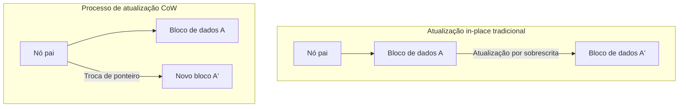
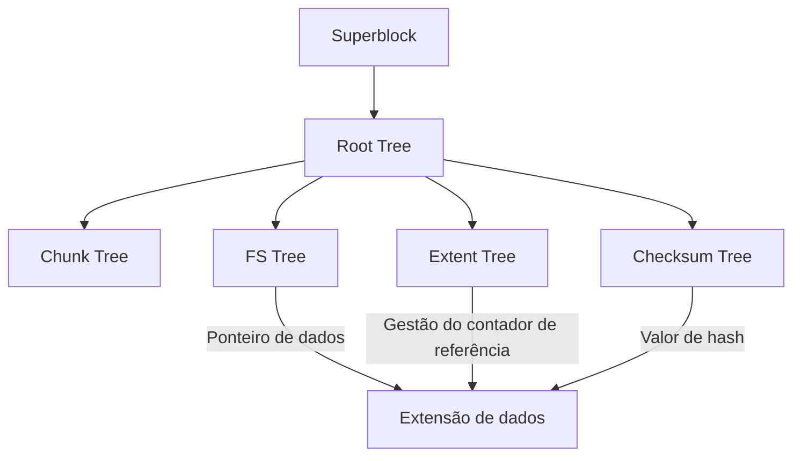

No ambiente de computação moderno, o "sistema de arquivos" que garante a persistência dos dados é um dos componentes mais importantes que constituem o núcleo do sistema operacional. No entanto, à medida que as capacidades de armazenamento entram nas áreas de petabytes e exabytes, e memórias não-voláteis de altíssima velocidade e grande capacidade, como SSDs e NVMe, se tornam comuns, os sistemas de arquivos tradicionais, que herdam a filosofia de design de décadas atrás, estão atingindo seus limites arquitetônicos.

Neste artigo, a partir das perspectivas da engenharia de sistemas de arquivos, armazenamento de kernel e armazenamento distribuído, faremos uma dissecação detalhada da arquitetura interna do **ZFS** e do **Btrfs**, que representam os pilares dos sistemas de arquivos de próxima geração. Como a mudança de paradigma do Copy-on-Write (CoW) trouxe consistência transacional, os meios para combater a corrupção silenciosa de dados (Silent Data Corruption) usando a árvore de Merkle (árvore de hash), e como um armazenamento verdadeiramente autorreparável (self-healing) é realizado. Desvendaremos essas estruturas matemáticas profundas e as maravilhas da programação de sistemas, intercalando com conceitos ao nível do código-fonte.

---

## Capítulo 1: Os Limites e a Corrupção de Dados dos Sistemas de Arquivos Tradicionais (ext4/XFS)

O ext4, sistema de arquivos padrão do Linux que usamos diariamente, e o XFS, que possui um alto histórico de sucesso na área corporativa, são softwares extremamente excelentes e maduros. No entanto, esses sistemas de arquivos adotam o modelo clássico de atualização de dados chamado "atualização in-place (In-place update)", e carregam uma fraqueza fatal em ambientes de armazenamento em larga escala modernos.

### 1.1 Os Limites da Atualização In-Place e do Journaling

A atualização in-place é um método no qual os blocos de dados originais na mídia de armazenamento são sobrescritos diretamente quando são feitas alterações em um arquivo. Esse método facilita a manutenção da localidade dos blocos e foi vantajoso para minimizar o tempo de busca (seek time) na era dos HDDs.

O maior problema da atualização in-place é o colapso da "consistência em caso de falha (crash consistency)" quando ocorre uma queda de energia ou falha do sistema durante uma atualização. Para evitar isso, ext4 e XFS adotam o **Journaling (Write-Ahead Logging; WAL)**. Antes de atualizar os dados, as alterações (metadados ou os próprios dados) são primeiro gravadas sequencialmente na área de journal e, em seguida, a árvore do sistema de arquivos real é atualizada.

No entanto, por razões de desempenho, os sistemas de arquivos comuns habilitam apenas o "journaling de metadados", e as atualizações dos dados em si não são registradas no journal. Como resultado, em caso de falha, embora a consistência dos metadados do arquivo (tamanho, timestamps, inode, etc.) possa ser restaurada, o conteúdo do próprio arquivo corre o risco de ficar num estado de "Torn Write (gravação rasgada)", onde dados antigos e novos estão misturados.

### 1.2 Corrupção Silenciosa de Dados (Silent Data Corruption)

Ainda mais assustadora é a **Corrupção Silenciosa de Dados (Silent Data Corruption)**. É um fenômeno no qual os dados armazenados mudam silenciosamente, sem que o SO perceba, devido a bugs no firmware do controlador do dispositivo de armazenamento, inversão de bits na memória (Bit Flip) causada por raios cósmicos, degradação de cabos ou atenuação magnética/carga elétrica devido ao envelhecimento.

Os sistemas de arquivos tradicionais não possuem um mecanismo para verificar se os dados lidos estão "corretos". Embora exista um ECC (Código de Correção de Erros) dentro do armazenamento de blocos (HDD ou SSD), se o controlador ler os dados do local errado (Misdirected Read) ou se a gravação sequer tiver sido realizada (Phantom Write), o próprio hardware de armazenamento reportará que "foi lido com sucesso". O SO repassa os dados corrompidos como estão para a aplicação, a aplicação continua o processamento sem notar a anomalia e, eventualmente, até mesmo os backups acabam sendo sobrescritos com dados corrompidos.

### 1.3 O Fim do RAID de Hardware e o Problema do "Write Hole"

O RAID de hardware (RAID 5 e RAID 6) tem sido usado por muitos anos para aumentar a disponibilidade dos dados. No entanto, o RAID de hardware também se comporta como um "mero dispositivo de bloco" que não entende a estrutura interna do sistema de arquivos, de modo que não é uma solução fundamental.

Particularmente fatal é o **problema do Write Hole (Buraco de Gravação) do RAID**. No RAID 5, se ocorrer uma queda de energia durante a atualização de blocos de dados e blocos de paridade, a consistência entre os dados e a paridade dentro da faixa (stripe) é quebrada. Na próxima vez que for lido, se esses dados forem restaurados usando essa paridade quebrada, os dados serão destruídos silenciosamente. Além disso, como não há checksums no lado do sistema de arquivos, o controlador RAID não tem como determinar logicamente "quais dados do disco estão corretos".

O que nasceu para superar as limitações dessa pilha de armazenamento tradicional dividida entre a camada física, camada de blocos e camada de sistema de arquivos, foram os sistemas de arquivos de próxima geração que gerenciam integralmente todo o armazenamento.

---

## Capítulo 2: A Mudança de Paradigma do Copy-on-Write (CoW)

A abordagem revolucionária adotada pelo ZFS e Btrfs é o **Copy-on-Write (CoW: Cópia na Gravação)**. O CoW não é apenas uma funcionalidade, mas uma mudança de paradigma na estrutura de dados do sistema de arquivos e no gerenciamento de transações.

### 2.1 A Eliminação da Atualização In-Place

Em um sistema de arquivos CoW, os blocos de dados existentes "absolutamente nunca" são sobrescritos. Quando os dados são atualizados, eles são sempre gravados em uma "nova área livre" no armazenamento. Somente depois que a gravação estiver totalmente concluída é que o ponteiro do nó pai (metadado) que aponta para esse bloco de dados é atomicamente trocado do bloco antigo para o novo bloco.

### 2.2 Consistência Transacional e a Cadeia de Ponteiros de Alocação

O sistema de arquivos gerencia os dados em uma estrutura de árvore (tree). Quando um bloco de dados, que é um nó folha (leaf node), é gravado em um novo local, o conteúdo de seu nó pai que contém o ponteiro também muda. Portanto, o nó pai também precisa ser gravado num novo local. Isso se propaga em cadeia até o nó raiz (root node).

No final desta série de atualizações, o "superbloco (chamado de Uberblock no ZFS)" no topo de toda a árvore é atualizado atomicamente. No instante em que essa gravação atômica única é concluída, a transação é confirmada (commit). Se ocorrer uma queda de energia no meio do processo, como o superbloco aponta para a árvore antiga, o sistema inicializa em seu estado antigo, completamente intacto. Em princípio, elimina-se a necessidade de longos processos de reparação usando o fsck (file system check).

### 2.3 O Princípio da Criação Instantânea de Snapshots

O maior subproduto do CoW é o snapshot ultrarrápido, que pode ser executado em tempo $O(1)$.
Quando você copia um diretório em um sistema de arquivos normal, todos os dados devem ser duplicados fisicamente. No entanto, com o CoW, um snapshot é concluído simplesmente duplicando o ponteiro do nó raiz da árvore e incrementando o "contador de referências (Reference Count)" de cada nó.

Quando os dados são atualizados, os blocos com um contador de referência de 2 ou mais não são sobrescritos, mas preservados, e apenas a parte atualizada é gravada em novos blocos. Isso permite que você congele e mantenha instantaneamente o estado do sistema de arquivos em qualquer momento sem consumir capacidade de armazenamento.

---

## Capítulo 3: A Arquitetura Interna do ZFS

O ZFS (Zettabyte File System), desenvolvido pela Sun Microsystems (agora Oracle), tem uma arquitetura tão completa que é frequentemente chamado de "a última palavra em sistemas de arquivos". O ZFS fundiu o tradicional gerenciador de volumes, controlador RAID e sistema de arquivos em uma única camada integrada.

### 3.1 A Estrutura de Três Camadas: SPA, DMU, ZPL

O interior do ZFS é amplamente dividido em três componentes.

1. **SPA (Storage Pool Allocator)**
   A camada mais baixa que gerencia os dispositivos físicos (vdev: Virtual Device). Ele abstrai HDDs e SSDs como um pool e fornece um único espaço de armazenamento virtual gigantesco para a camada superior. Redundância como RAID-Z, striping de dados e I/O para autocorreção são tratados por esta camada. No topo do SPA está o **Uberblock**.
2. **DMU (Data Management Unit)**
   O coração do ZFS. Gerencia todos os dados como "objetos" e processa transações CoW. O DMU não tem conhecimento dos tipos de dados (diretórios, arquivos, atributos), ele simplesmente assume a responsabilidade de atualizar atomicamente as chaves, valores e a associação de blocos de dados (dnode).
3. **ZPL (ZFS POSIX Layer)**
   Construído sobre o sistema de objetos do DMU, ele fornece uma interface de sistema de arquivos compatível com POSIX (open, read, write, stat, etc.) para o SO.

### 3.2 O Uberblock e os Grupos de Transações (TXG)

No ZFS, as gravações não são refletidas imediatamente no disco, mas são agrupadas na memória como um "Grupo de Transação (TXG - Transaction Group)". Os TXGs são descarregados (flush) para o disco em lotes a cada poucos segundos (isso é chamado de sincronização de transações). Nesse momento, o SPA grava a nova árvore de dados e, por último, o Uberblock da matriz que tem o número de sequência mais recente é atualizado atomicamente.

### 3.3 ZFS Intent Log (ZIL) e SLOG

A gravação assíncrona é processada eficientemente pelos TXGs, mas em aplicações que exigem "gravações síncronas (Synchronous Write)" através do `fsync()`, como bancos de dados ou máquinas virtuais, não é permitido esperar o commit de um TXG que leva vários segundos.
Aqui entra o **ZIL (ZFS Intent Log)**. Em vez de realizar uma atualização completa da árvore (CoW), o ZIL grava um log delta dos dados alterados no disco em alta velocidade. Em caso de falha, este ZIL é lido para reconstruir o TXG na memória.

Além disso, o **SLOG (Separate Intent Log)** é um recurso que atribui dispositivos dedicados, como NVDIMMs ou SSDs NVMe rápidos, como destino de gravação do ZIL. Isso melhora drasticamente a latência das gravações síncronas, mesmo em pools de HDDs lentos.

### 3.4 ARC e L2ARC: O Algoritmo Final de Cache

O desempenho de leitura do ZFS é sustentado pelo **ARC (Adaptive Replacement Cache)**. Enquanto o cache de página tradicional do kernel Linux usa principalmente LRU (Least Recently Used: descarta o que não foi usado recentemente), o ARC é baseado no algoritmo ARC proposto por Megiddo da IBM e outros.

O ARC gerencia o cache com as quatro listas a seguir:
- **MRU (Most Recently Used)**: Dados acessados recentemente
- **MFU (Most Frequently Used)**: Dados acessados com frequência
- **Ghost MRU**: Lista que transbordou do MRU, mas registra apenas os metadados (índice)
- **Ghost MFU**: Lista de metadados que transbordou do MFU

O ARC monitora a carga de trabalho; se um processo de varredura (como um backup) for executado, ele expande o MRU, e se os acessos consistentes a um banco de dados continuarem, ele expande o MFU. Se houver um acerto (hit) nas listas Ghost, ele conclui "isso teria sido um acerto se este cache tivesse sido mantido" e ajusta dinamicamente os tamanhos das partições MRU e MFU.
Além disso, configurando o **L2ARC (Level 2 ARC)** para liberar dados que transbordam do ARC para SSDs rápidos, uma camada de cache da ordem de terabytes pode ser construída.

---

## Capítulo 4: A Arquitetura B-tree of trees do Btrfs

Por outro lado, o **Btrfs (B-tree file system)** foi projetado por Chris Mason da Oracle e outros como um sistema de arquivos de próxima geração nativo do Linux. Enquanto o ZFS reflete fortemente a filosofia do Solaris (separação estrita de camadas), o Btrfs adota uma abordagem intimamente integrada com o VFS (Virtual File System) do Linux.

### 4.1 Uma Estrutura Matemática que Expressa Tudo com Árvores-B

A característica mais bela e complexa do Btrfs é que "todo e qualquer metadado e estrutura de gerenciamento de dados do sistema de arquivos é composto por árvores-B puras (estritamente falando, uma variante próxima da árvore-B+)". O Btrfs é modelado como uma gigantesca "B-tree of trees (árvore B de árvores)".

As árvores principais são as seguintes:
1. **Root tree (Árvore raiz)**: Mantém os ponteiros do nó raiz e o estado de todas as outras árvores.
2. **Chunk tree**: Mapeia os blocos físicos (endereços físicos) dos dispositivos em blocos no espaço de endereço lógico (chunks). Funções de RAID de software (striping, mirroring) são resolvidas nesta camada da árvore.
3. **FS tree (Árvore do sistema de arquivos)**: Mantém a estrutura de diretórios real, nomes de arquivos, inodes e ponteiros para os dados dos arquivos.
4. **Extent tree**: Gerencia o espaço livre de todo o sistema de arquivos e as referências reversas (back-references) das extensões em uso (blocos contínuos de dados). Com isso, processa eficientemente os incrementos e decrementos dos complexos contadores de referência causados pelo CoW.
5. **Checksum tree**: Uma árvore que mantém apenas os checksums dos blocos de dados, de forma independente.

### 4.2 Busca de CoW e Algoritmo de Atualização na Árvore-B

Ao atualizar dados no Btrfs, ele desce na árvore e procura a extensão de destino. Se fosse uma atualização in-place, ele simplesmente reescreveria o nó folha, mas no CoW do Btrfs, o nó folha é copiado para uma nova área física e reescrito. Então, o ponteiro do nó pai que apontava para aquela folha se torna inválido, então o nó pai também é copiado e reescrito. Isso alcança até a Root tree.
Neste processo, a árvore-B precisa realizar rebalanceamentos (divisão e fusão de nós). Para melhorar o desempenho de acesso concorrente em um ambiente multithread, o Btrfs implementa algoritmos avançados de operação em árvore-B que minimizam as contenções de bloqueio (lock).

### 4.3 Subvolumes e Snapshots

No Btrfs, um "subvolume" é uma FS tree independente com seu próprio nó Root. Do ponto de vista do usuário, comporta-se como um diretório, mas dentro do sistema de arquivos é tratado como uma árvore-B completamente independente.
Um snapshot no Btrfs é uma operação de meramente duplicar o nó Root de um determinado subvolume e registrá-lo como um novo subvolume. Portanto, assim como no ZFS, a criação de snapshots é concluída em um instante.

---

## Capítulo 5: Checksums de Árvore de Merkle e Funcionalidade de Autocorreção

O recurso que separa decisivamente o ZFS e o Btrfs dos sistemas de arquivos da geração anterior é a "garantia da integridade dos dados usando checksums criptográficos (ou não-criptográficos) baseados na Árvore de Merkle (árvore de hash)" e o uso disso para "Autocorreção (Self-Healing)".

### 5.1 Verificação de Dados pela Arquitetura da Árvore de Merkle

Os sistemas de arquivos tradicionais e os RAIDs de hardware geralmente incorporam códigos de detecção de erro dentro do próprio bloco de dados. No entanto, se os dados forem gravados no local errado do disco (Misdirected Write), o próprio checksum do bloco será avaliado como "consistente" e a corrupção não poderá ser detectada.

Para evitar isso, o ZFS e o Btrfs adotam a **estrutura de Árvore de Merkle**.
No caso do ZFS, o checksum do bloco de dados (como SHA-256 ou fletcher4) não é armazenado no próprio bloco, mas sim no "nó pai que aponta para esse bloco (em sua estrutura de ponteiro)". Além disso, o checksum do nó pai é armazenado em seu pai, chegando finalmente ao Uberblock.

Com isso, a árvore inteira atua como uma gigantesca cadeia de hashes. Ao ler um bloco de dados, o SO obtém o checksum do nó pai, calcula o valor do hash dos dados lidos e os compara. Se os valores do hash não corresponderem, ele pode detectar com **certeza absoluta** que os dados estão corrompidos no disco ou que ocorreu uma inversão de bits na memória ou nos cabos ao longo do caminho.

### 5.2 Superando o Problema do Write Hole e Autocorreção no RAID-Z

O RAID-Z do ZFS (RAID-Z1/Z2/Z3) resolveu completamente o problema do write hole que atormentava os RAIDs 5/6 tradicionais, combinando-o com o CoW.

No RAID 5, a largura da faixa (stripe) (por exemplo, 3 blocos de dados + 1 bloco de paridade) é fixa, havendo o risco de inconsistência ao atualizar apenas uma parte dos blocos (Read-Modify-Write).
No RAID-Z, a **largura da faixa muda dinamicamente** de acordo com o tamanho dos dados a serem gravados (Variable Stripe Width). Como toda gravação é sempre uma "gravação de faixa completa em um novo local (Full-Stripe Write)", mesmo que ocorra uma falha durante a atualização, a faixa antiga permanece como está, a nova faixa é simplesmente descartada e a inconsistência de paridade absolutamente não ocorre.

O cálculo de paridade no RAID-Z2/Z3 é realizado através da codificação de Reed-Solomon, usando a matemática em um Corpo Finito (Galois Field: GF(2^8)). Com operações matemáticas de matriz complexas, o Z3 pode restaurar os dados de qualquer falha de 3 discos.

O processo de autocorreção é o seguinte:
1. A aplicação solicita os dados e o ZFS lê o bloco do disco A.
2. Verifica o checksum e detecta uma incompatibilidade (corrupção).
3. O ZFS descarta os dados no disco A e lê os dados da paridade do RAID-Z ou de um disco espelhado B (ou os restaura através de cálculo).
4. Verifica o checksum dos dados restaurados e, se estiver correto, retorna os dados à aplicação.
5. **Nos bastidores, grava automaticamente os dados corretos em um novo bloco no disco A (reparação) e atualiza os metadados.**

Sem a intervenção de administradores de sistemas, o armazenamento detecta sua própria corrupção e realiza a reparação de forma autônoma.

### 5.3 O Funcionamento Interno do Processo de Scrub

Se a reparação fosse feita apenas na leitura dos dados, haveria o risco de que os dados frios (cold data), raramente acessados, fossem deixados de lado por muito tempo e se tornassem irrecuperáveis (acúmulo de Bit Rot) devido a falhas simultâneas em vários discos.
O que previne isso é o **Scrub (Esfregar/Varredura)**. Quando o Scrub é executado, o sistema de arquivos percorre a estrutura da árvore desde a raiz, lê todos os metadados e blocos de dados no disco e recalcula os checksums para verificação. Se uma anomalia for encontrada, o reparo é executado imediatamente. Isso é semelhante à verificação de paridade (Patrol Read) em um RAID de hardware, mas como verifica até mesmo a estrutura lógica dos metadados no nível do sistema de arquivos, a confiabilidade é esmagadoramente maior.

---

## Capítulo 6: ZFS vs Btrfs - Comparação Abrangente e o Futuro do Armazenamento

Entre o ZFS e o Btrfs, que disputam a supremacia como o sistema de arquivos de próxima geração, existem diferenças claras com base em suas filosofias de design e contexto histórico. Arquitetos de sistemas precisam escolhê-los adequadamente de acordo com os requisitos.

### 6.1 Consumo de Memória e Características de Desempenho

- **ZFS**: Como implementa seu próprio ARC, como mencionado acima, ele consome memória de forma muito agressiva. A filosofia de design é "usar quanta memória houver", e é recomendado alocar no mínimo alguns GBs e, para uso corporativo, de dezenas a centenas de GBs de RAM para o ARC. Se houver memória suficiente, ostenta um desempenho imbatível.
- **Btrfs**: Está intimamente integrado com o cache de páginas padrão do kernel Linux (camada VFS). Portanto, o consumo de memória (footprint) é mantido equivalente ao do ext4 ou XFS, operando de forma estável até mesmo em dispositivos de borda (edge devices) com recursos limitados, sistemas embarcados ou pequenos VPS.

### 6.2 O Problema do Licenciamento: CDDL vs GPL

O maior motivo pelo qual o ZFS não foi mesclado na linha principal (árvore padrão) do kernel Linux não é técnico, mas de incompatibilidade de licenciamento. Diz-se que a CDDL (Common Development and Distribution License) do ZFS e a GPLv2 do kernel do Linux são legalmente incompatíveis. Portanto, ao usar o ZFS no Linux, você adota a abordagem de compilar e carregar o módulo do kernel separadamente (OpenZFS).
Em contraste, o Btrfs é desenvolvido puramente como GPL e vem integrado como padrão no kernel Linux. Nas principais distribuições do Linux (SUSE, Fedora, etc.), é adotado como o sistema de arquivos padrão.

### 6.3 Casos de Uso e Exemplos de Adoção

**O Domínio do ZFS (OpenZFS)**:
Obtém apoio massivo em appliances de armazenamento, como TrueNAS, plataformas de hipervisor, como Proxmox VE e LXD, e servidores de backup corporativos onde os dados não podem ser perdidos sob hipótese alguma. Além disso, reina como o sistema de arquivos padrão no FreeBSD há muitos anos.

**O Domínio do Btrfs**:
Com sua gestão de volumes flexível e recurso de snapshots, difundiu-se amplamente sendo o sistema de arquivos raiz para milhões de servidores Linux na infraestrutura do Facebook (Meta), em NAS para consumidores/PMEs como os da Synology, em SOs de jogos como no Steam Deck e como o padrão do Fedora Workstation.

### 6.4 Rumo a uma Infraestrutura de Armazenamento da Era Cloud-Native

Com a popularização da tecnologia de contêineres (Docker/Kubernetes), exige-se do armazenamento "a criação e destruição de snapshots na faixa de milissegundos" e a "eficiência na disposição em camadas (layering) de imagens de contêiner". Os recursos de CoW do ZFS e Btrfs são extremamente compatíveis como drivers de armazenamento de contêiner (alternativas ao overlayfs e back-ends).

Além disso, com o surgimento de hardwares de próxima geração, como a desagregação de armazenamento (separação e compartilhamento) via CXL (Compute Express Link) ou NVMe-oF, e o Computational Storage, os sistemas de arquivos estão evoluindo de meros "recipientes de dados" para um "Plano de Controle de Dados (Data Control Plane)" que integra proteção, criptografia, compressão e desduplicação (Deduplication) de dados.

O paradigma de "CoW e Autocorreção" pioneiro do ZFS e Btrfs é o escudo mais forte para proteger a propriedade intelectual da humanidade contra o colapso físico, em uma era moderna em que os dados são a fonte de todo o valor. Hoje, somos testemunhas do fim da arquitetura de armazenamento tradicional e do alvorecer de um sistema de arquivos de próxima geração inteligente e autônomo.
