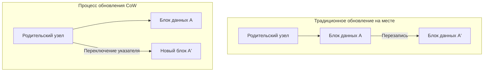
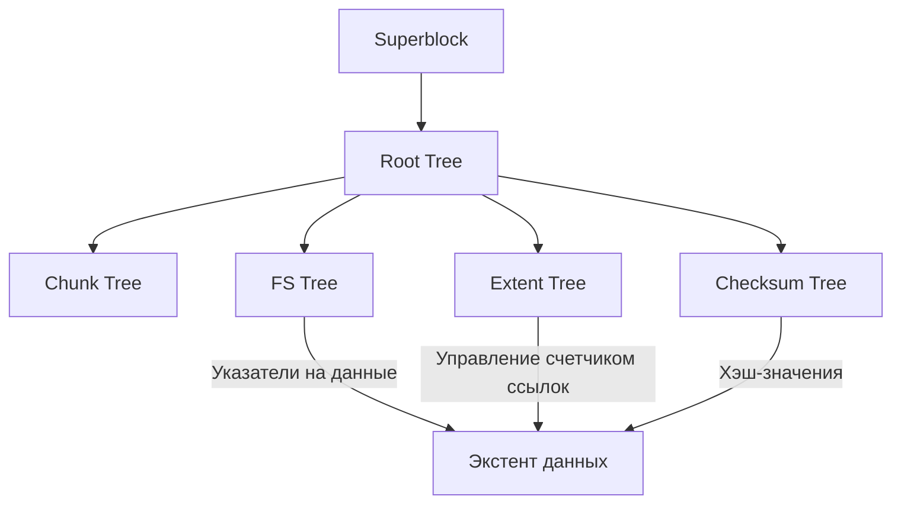

В современных вычислительных средах «файловая система», обеспечивающая долговечность данных, является одним из важнейших компонентов, составляющих ядро операционной системы. Однако, по мере того как емкость хранилищ достигает петабайтов и эксабайтов, а сверхбыстрая и емкая энергонезависимая память, такая как SSD и NVMe, получает широкое распространение, традиционные файловые системы, унаследовавшие концепции проектирования десятилетней давности, приближаются к пределам своих архитектурных возможностей.

В этой статье мы подробно разберем внутреннюю архитектуру **ZFS** и **Btrfs**, которые образуют два столпа файловых систем следующего поколения, с точки зрения инженерии файловых систем, хранилищ уровня ядра и распределенных хранилищ. Транзакционная согласованность, обеспечиваемая сменой парадигмы Copy-on-Write (CoW), средства противодействия скрытому повреждению данных (silent data corruption) с использованием деревьев Меркла (хеш-деревьев), и то, как реализуется истинно самовосстанавливающееся хранилище. Мы раскроем эту глубокую математическую структуру и чудеса системного программирования, попутно обращаясь к концепциям на уровне исходного кода.

---

## Глава 1: Ограничения традиционных файловых систем (ext4/XFS) и разрушение данных

Стандартные файловые системы Linux, такие как ext4, которые мы используем ежедневно, и XFS, имеющая высокую репутацию в корпоративном секторе, являются чрезвычайно превосходным и зрелым программным обеспечением. Однако эти файловые системы используют классическую модель обновления данных, называемую «обновлением на месте» (In-place update), которая имеет фатальные слабости в современных крупномасштабных средах хранения.

### 1.1 Ограничения обновления на месте и журналирования

Обновление на месте (In-place update) — это метод, при котором при внесении изменений в файл исходный блок данных на носителе напрямую перезаписывается. Этот метод позволяет легко сохранять локальность блоков и в эпоху HDD был выгоден для минимизации времени позиционирования (seek time).

Самой большой проблемой обновления на месте является нарушение «целостности при сбоях» (crash consistency), если во время обновления происходит отключение питания или сбой системы. Чтобы предотвратить это, ext4 и XFS используют **журналирование (Write-Ahead Logging; WAL)**. Перед обновлением данных изменения (метаданные или сами данные) сначала последовательно записываются в область журнала, и только затем обновляется само дерево файловой системы.

Однако по причинам производительности обычные файловые системы включают только «журналирование метаданных», а само обновление данных в журнале не фиксируется. В результате при сбое можно восстановить целостность метаданных файла (размер, временные метки, inode и т.д.), но содержимое самого файла может оказаться в состоянии «разорванной записи» (Torn Write), когда старые и новые данные смешиваются, что несет в себе риск.

### 1.2 Скрытое повреждение данных (Silent Data Corruption)

Еще более пугающим является **скрытое повреждение данных (Silent Data Corruption)**. Это явление, когда сохраненные данные тихо изменяются без ведома ОС из-за ошибок в прошивке контроллера устройства хранения, инверсии битов (Bit Flip) в памяти из-за космических лучей, износа кабелей или затухания магнитного или электрического заряда со временем.

Традиционные файловые системы не имеют механизма проверки того, «правильны» ли прочитанные данные. Внутри блочных хранилищ (HDD или SSD) существует ECC (код исправления ошибок), но если контроллер считывает данные из неправильного места (Misdirected Read) или если запись вообще не была произведена (Phantom Write), само оборудование хранения отчитывается, что оно «успешно прочитало» данные. ОС передает поврежденные данные приложению как есть, приложение продолжает обработку, не замечая аномалии, и в конечном итоге даже резервные копии перезаписываются поврежденными данными.

### 1.3 Конец аппаратных RAID и проблема «write hole»

Для повышения доступности данных в течение многих лет использовались аппаратные RAID (RAID 5 и RAID 6). Однако аппаратные RAID также действуют как «просто блочные устройства», не понимая внутренней структуры файловой системы, поэтому это не является фундаментальным решением.

Особенно фатальной является **проблема «write hole» (дыра записи) в RAID**. В RAID 5, если при обновлении блока данных и блока четности происходит сбой питания, целостность между данными и четностью в пределах страйпа нарушается. Если при следующем чтении эта нарушенная четность используется для восстановления данных, данные будут незаметно уничтожены. Кроме того, поскольку на уровне файловой системы нет контрольных сумм, RAID-контроллер не имеет возможности логически определить, «на каком диске данные правильные».

Чтобы преодолеть эти ограничения традиционного стека хранения, где физический, блочный уровень и уровень файловой системы разделены, были созданы файловые системы следующего поколения, которые интегрированно управляют всем хранилищем.

---

## Глава 2: Сдвиг парадигмы Copy-on-Write (CoW)

Революционным подходом, принятым в ZFS и Btrfs, является **Copy-on-Write (CoW: копирование при записи)**. CoW — это не просто функция, а сдвиг парадигмы структуры данных файловой системы и управления транзакциями.

### 2.1 Устранение обновления на месте

В файловых системах CoW существующие блоки данных «никогда» не перезаписываются. При обновлении данных они всегда записываются в «новую свободную область» на хранилище. Только после полного завершения записи указатель родительского узла (метаданных), указывающий на этот блок данных, атомарно переключается со старого блока на новый.

### 2.2 Транзакционная согласованность и цепочка указателей распределения

Файловая система управляет данными в виде древовидной структуры. Когда листовой (leaf) узел, являющийся блоком данных, записывается в новое место, содержимое родительского узла, хранящего его указатель, также изменяется. Поэтому родительский узел также должен быть записан в новое место. Это каскадно распространяется до корневого узла.

В конце этой серии обновлений «суперблок» (в ZFS он называется Uberblock), находящийся на вершине всего дерева, атомарно обновляется. В тот момент, когда завершается эта единичная атомарная запись, транзакция фиксируется (совершается коммит). Если по пути произойдет отключение питания, суперблок по-прежнему указывает на старое дерево, поэтому система загрузится в совершенно нетронутом старом состоянии. Длительные процессы восстановления с помощью fsck (проверки файловой системы) становятся принципиально не нужны.

### 2.3 Принцип мгновенного создания снапшотов

Самым большим побочным продуктом CoW являются сверхбыстрые снапшоты, которые могут быть выполнены с вычислительной сложностью $O(1)$.
При копировании каталога в обычной файловой системе необходимо физически дублировать все данные. Однако в CoW снапшот завершается простым копированием указателя корневого узла дерева и увеличением «счетчика ссылок» (Reference Count) каждого узла.

При обновлении данных блоки со счетчиком ссылок 2 и более сохраняются без перезаписи, а в новый блок записываются только обновленные части. Это позволяет мгновенно заморозить состояние файловой системы в любой момент времени и сохранять его, не потребляя лишнего дискового пространства.

---

## Глава 3: Внутренняя архитектура ZFS

Разработанная Sun Microsystems (ныне Oracle) файловая система ZFS (Zettabyte File System) обладает настолько совершенной архитектурой, что её называют «последним словом в файловых системах». ZFS объединила традиционный менеджер томов, RAID-контроллер и файловую систему в единый интегрированный уровень.

### 3.1 Трехуровневая структура: SPA, DMU, ZPL

Внутри ZFS состоит из трех основных компонентов.

1. **SPA (Storage Pool Allocator)**
   Управляет физическими устройствами (vdev: Virtual Device) на самом низком уровне. Он абстрагирует HDD и SSD в пулы и предоставляет верхним уровням единое гигантское виртуальное пространство хранения. Этот уровень отвечает за избыточность, такую как RAID-Z, чередование данных (striping) и ввод-вывод для самовосстановления. На вершине SPA находится **Uberblock**.
2. **DMU (Data Management Unit)**
   Сердце ZFS. Он управляет всеми данными как «объектами» и обрабатывает транзакции CoW. DMU не заботится о типе данных (каталог, файл, атрибут), а просто несет ответственность за атомарное обновление ассоциации (dnode) ключей, значений и блоков данных.
3. **ZPL (ZFS POSIX Layer)**
   Построен поверх системы объектов DMU и предоставляет ОС POSIX-совместимый интерфейс файловой системы (open, read, write, stat и т.д.).

### 3.2 Uberblock и группы транзакций (TXG)

В ZFS записи не сразу отражаются на диске, а группируются в памяти в «группы транзакций (TXG)». TXG сбрасываются на диск каждые несколько секунд (это называется синхронизацией транзакций). При этом SPA записывает новое дерево данных и, наконец, атомарно обновляет тот Uberblock из массива, который имеет новейший порядковый номер (sequence number).

### 3.3 ZFS Intent Log (ZIL) и SLOG

Асинхронные записи эффективно обрабатываются TXG, но приложения, такие как базы данных и виртуальные машины, которые требуют «синхронной записи (Synchronous Write)» с помощью `fsync()`, не могут позволить себе ждать фиксации TXG в течение нескольких секунд.
Здесь на помощь приходит **ZIL (ZFS Intent Log)**. ZIL вместо полного обновления дерева (CoW) быстро записывает на диск журнал различий измененных данных. В случае сбоя этот ZIL считывается для восстановления TXG в памяти.

Кроме того, функция выделения специального устройства, такого как NVDIMM или высокоскоростной NVMe SSD, в качестве цели записи для ZIL, называется **SLOG (Separate Intent Log)**. Это может радикально улучшить задержку (latency) синхронных записей даже в пуле с медленными HDD.

### 3.4 ARC и L2ARC: Алгоритмы идеального кэширования

Производительность чтения в ZFS обеспечивается **ARC (Adaptive Replacement Cache)**. В то время как традиционный кэш страниц ядра Linux использует в основном LRU (Least Recently Used: удаление наименее используемого), ARC основан на алгоритме ARC, предложенном Нир Мегиддо (Megiddo) и другими исследователями из IBM.

ARC управляет кэшем в четырех следующих списках:
- **MRU (Most Recently Used)**: Недавно использовавшиеся данные
- **MFU (Most Frequently Used)**: Часто используемые данные
- **Ghost MRU**: Список, содержащий только метаданные (индексы) данных, вытесненных из MRU
- **Ghost MFU**: Список метаданных, вытесненных из MFU

ARC отслеживает рабочую нагрузку: если запускается процесс сканирования (например, резервное копирование), он расширяет MRU, а если продолжается постоянный доступ к БД, он расширяет MFU. При попадании в список Ghost (призрачный список) система решает, что «если бы этот кэш остался, было бы попадание», и динамически регулирует размеры разделов MRU и MFU.
Кроме того, настройка **L2ARC (Level 2 ARC)**, который сбрасывает данные, не поместившиеся в ARC, на высокоскоростные SSD, позволяет создать уровень кэша терабайтного класса.

---

## Глава 4: Архитектура «B-tree of trees» в Btrfs

С другой стороны, **Btrfs (B-tree file system)** была разработана Крисом Мейсоном (Chris Mason) и другими из Oracle как родная (native) файловая система следующего поколения для Linux. Если ZFS сильно отражает философию Solaris (строгое разделение слоев), то Btrfs применяет подход тесной интеграции с VFS (Virtual File System) Linux.

### 4.1 Математическая структура, выражающая всё в B-деревьях

Самая красивая и сложная особенность Btrfs заключается в том, что «все метаданные и структуры управления данными файловой системы состоят из чистых B-деревьев (строго говоря, производных, близких к B+ деревьям)». Btrfs смоделирована как гигантское «дерево B-деревьев» (B-tree of trees).

Основные деревья:
1. **Root tree (Дерево корней)**: Хранит указатели и состояния корневых узлов всех других деревьев.
2. **Chunk tree**: Отображает физические блоки устройств (физические адреса) в чанки логического адресного пространства. Функции программного RAID (чередование, зеркалирование) решаются на этом уровне дерева.
3. **FS tree (Дерево файловой системы)**: Хранит фактическую структуру каталогов, имена файлов, inode и указатели на данные файлов.
4. **Extent tree**: Управляет общим свободным пространством файловой системы и обратными ссылками (backreferences) используемых экстентов (непрерывных блоков данных). Это позволяет эффективно обрабатывать сложные увеличения и уменьшения счетчиков ссылок, вызванные CoW.
5. **Checksum tree**: Дерево, которое независимо хранит только контрольные суммы блоков данных.

### 4.2 Алгоритм поиска и обновления CoW в B-деревьях

При обновлении данных в Btrfs система спускается по дереву, чтобы найти целевой экстент. Если бы это было обновление на месте, переписывался бы только листовой узел, но в CoW Btrfs листовой узел копируется в новую физическую область и переписывается там. В результате указатель родительского узла, указывавший на этот лист, становится недействительным, поэтому родительский узел также копируется и переписывается. Это достигает дерева Root tree.
В этом процессе B-дерево должно выполнять перебалансировку (разделение или объединение узлов). Чтобы повысить производительность параллельного доступа в многопоточных средах, Btrfs реализует сложные алгоритмы управления B-деревьями, минимизирующие конфликты блокировок.

### 4.3 Подтома (Subvolumes) и снапшоты

В Btrfs «подтом» (subvolume) — это независимое дерево FS tree, имеющее собственный корневой (Root) узел. Для пользователя он ведет себя как каталог, но внутри файловой системы он рассматривается как полностью независимое B-дерево.
Снапшот в Btrfs — это просто операция копирования корневого узла одного подтома и регистрации его как нового подтома. Поэтому, как и в ZFS, создание снапшота завершается мгновенно.

---

## Глава 5: Контрольные суммы дерева Меркла и функция самовосстановления

Функция, которая решительно отделяет ZFS и Btrfs от файловых систем предыдущего поколения, — это «гарантия целостности данных с помощью криптографических (или некриптографических) контрольных сумм на основе деревьев Меркла (хеш-деревьев)» и «самовосстановление (Self-Healing)» с их использованием.

### 5.1 Проверка данных с помощью архитектуры дерева Меркла

В традиционных файловых системах и аппаратных RAID коды обнаружения ошибок часто встраиваются внутрь самого блока данных. Однако, если данные записываются не в то место на диске (Misdirected Write), контрольная сумма самого блока будет считаться «согласованной», и повреждение не будет обнаружено.

Чтобы предотвратить это, ZFS и Btrfs используют **структуру дерева Меркла**.
В случае ZFS контрольная сумма блока данных (SHA-256, fletcher4 и т.д.) сохраняется не в самом этом блоке, а в «родительском узле (в структуре указателя), который указывает на этот блок». Кроме того, контрольная сумма родительского узла сохраняется в его родителе и так далее, пока в конечном итоге не достигнет Uberblock.

Благодаря этому все дерево функционирует как одна гигантская хэш-цепочка. При чтении определенного блока данных ОС извлекает контрольную сумму из родительского узла, вычисляет хэш-значение прочитанных данных и сравнивает их. Если значения хэша не совпадают, можно с **абсолютной уверенностью обнаружить**, что данные на диске повреждены или что произошла инверсия бита в памяти или кабеле на пути.

### 5.2 Преодоление проблемы write hole в RAID-Z и самовосстановление

RAID-Z (RAID-Z1/Z2/Z3) в ZFS полностью решает проблему «write hole», от которой страдали традиционные RAID 5/6, комбинируя ее с CoW.

В RAID 5 ширина страйпа (например, 3 блока данных + 1 блок четности) фиксирована, что создавало риск рассогласования при обновлении только части блоков (Read-Modify-Write).
В RAID-Z **ширина страйпа динамически изменяется** (Variable Stripe Width) в зависимости от размера записываемых данных. Все записи всегда являются «записью полного страйпа в новое место» (Full-Stripe Write), поэтому даже если во время обновления произойдет сбой, старый страйп останется как есть, а новый страйп будет просто удален, и рассогласование четности никогда не возникнет.

Расчет четности в RAID-Z2/Z3 выполняется с помощью кодирования Рида-Соломона (Reed-Solomon), использующего математику конечных полей (Galois Field: GF(2^8)). Благодаря сложным матричным операциям Z3 может восстановить данные при сбое любых 3 дисков.

Процесс самовосстановления выглядит следующим образом:
1. Приложение запрашивает данные, и ZFS считывает блок с диска A.
2. Проверяется контрольная сумма, обнаруживается несовпадение (повреждение).
3. ZFS отбрасывает данные диска A и считывает данные (или восстанавливает их путем расчета) из четности RAID-Z или зеркального диска B.
4. Проверяется контрольная сумма восстановленных данных, и если она верна, данные возвращаются приложению.
5. **В фоновом режиме правильные данные автоматически записываются в новый блок на диске A (восстановление), и метаданные обновляются.**

Без вмешательства системного администратора хранилище само обнаруживает свое повреждение и автономно выполняет восстановление.

### 5.3 Внутренняя работа процесса очистки (Scrub)

Если восстановление выполняется только при чтении данных, существует риск (накопление Bit Rot), что «холодные» данные (cold data), к которым редко обращаются, будут оставлены на долгое время и станут невосстановимыми из-за одновременного отказа нескольких дисков.
Чтобы предотвратить это, используется **очистка (Scrub)**. При выполнении scrub файловая система проходит по древовидной структуре, начиная с корня, считывает все метаданные и блоки данных на диске, пересчитывает и проверяет контрольные суммы. Если обнаруживается аномалия, немедленно выполняется восстановление. Это похоже на проверку четности (Patrol Read) в аппаратном RAID, но надежность в подавляющем большинстве выше, поскольку она проверяет вплоть до логической структуры метаданных на уровне файловой системы.

---

## Глава 6: Детальное сравнение ZFS и Btrfs, а также будущее хранилищ

Между ZFS и Btrfs, которые борются за гегемонию в качестве файловых систем следующего поколения, существуют явные различия, основанные на их концепциях проектирования и историческом фоне. Системным архитекторам необходимо выбирать их надлежащим образом в зависимости от требований.

### 6.1 Потребление памяти и характеристики производительности

- **ZFS**: Как упоминалось выше, она реализует собственный ARC, поэтому очень агрессивно потребляет память. Философия дизайна — «использовать столько памяти, сколько есть», и рекомендуется выделять для ARC как минимум несколько ГБ, а в корпоративных приложениях от десятков до сотен ГБ RAM. Если памяти достаточно, она может похвастаться непревзойденной производительностью.
- **Btrfs**: Тесно интегрирована со стандартным кэшем страниц ядра Linux (уровень VFS). Поэтому объем занимаемой памяти поддерживается на том же уровне, что и у ext4 и XFS, и она стабильно работает даже на периферийных (edge) устройствах с ограниченными ресурсами, встроенных системах и небольших VPS.

### 6.2 Проблема лицензирования: CDDL против GPL

Самая большая причина, по которой ZFS не объединена в основную ветку ядра Linux (mainline) — не техническая, а лицензионная несовместимость. Считается, что CDDL (Common Development and Distribution License) ZFS юридически несовместима с GPLv2 ядра Linux. Поэтому при использовании ZFS в Linux модуль ядра компилируется и загружается отдельно (OpenZFS).
В отличие от этого, Btrfs разрабатывалась как чисто GPL и включена в ядро Linux по умолчанию. Она принята в качестве файловой системы по умолчанию в основных дистрибутивах Linux (SUSE, Fedora и др.).

### 6.3 Варианты использования (Use cases) и примеры внедрения

**Область применения ZFS (OpenZFS)**:
Она пользуется огромной поддержкой в устройствах хранения данных (storage appliances), таких как TrueNAS, инфраструктурах гипервизоров, таких как Proxmox VE и LXD, и серверах резервного копирования на уровне предприятий, где потеря данных абсолютно недопустима. Кроме того, она уже много лет является стандартной файловой системой во FreeBSD.

**Область применения Btrfs**:
Широко используется благодаря своим гибким функциям управления томами и снапшотов: в качестве корневой файловой системы для миллионов Linux-серверов в инфраструктуре Facebook (Meta), на потребительских/SMB NAS устройствах, таких как Synology, в игровых ОС, таких как Steam Deck, и по умолчанию в Fedora Workstation.

### 6.4 К инфраструктуре хранения данных в эпоху Cloud-Native

С популяризацией контейнерных технологий (Docker/Kubernetes) от хранилищ требуются «создание и удаление снапшотов на миллисекундном уровне» и «повышение эффективности наслаивания (layering) образов контейнеров». Функции CoW в ZFS и Btrfs чрезвычайно хорошо подходят в качестве драйверов хранилища контейнеров (альтернатива или бэкенд для overlayfs).

Кроме того, с появлением аппаратного обеспечения следующего поколения, такого как дезагрегация (разделение и совместное использование) хранилищ с помощью CXL (Compute Express Link) и NVMe-oF, а также вычислительных хранилищ (computational storage), файловые системы эволюционируют из простого «вместилища данных» в «управляющую плоскость данных» (data control plane), которая комплексно управляет защитой данных, шифрованием, сжатием и дедупликацией (Deduplication).

Парадигма «CoW и самовосстановление», созданная ZFS и Btrfs, является сильнейшим щитом для защиты интеллектуальной собственности человечества от физического разрушения в современную эпоху, когда данные являются источником любой ценности. Сейчас мы становимся свидетелями конца традиционной архитектуры хранения данных и зарождения интеллектуальных и автономных файловых систем следующего поколения.
