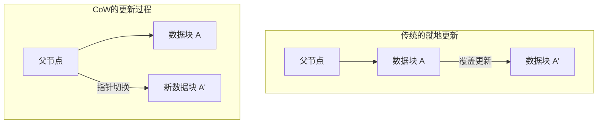
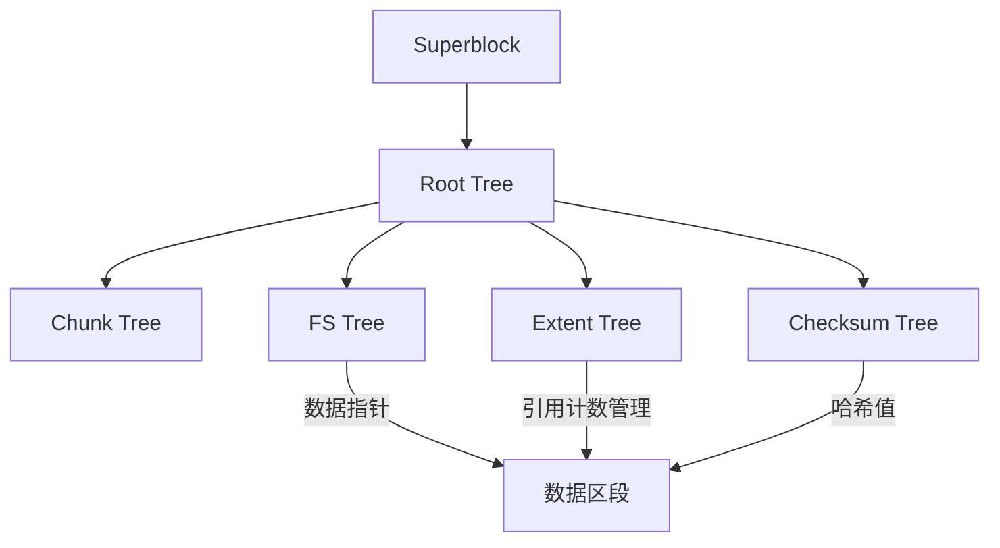

在现代计算环境中，确保数据持久性的“文件系统”是构成操作系统核心的最重要组件之一。然而，随着存储容量迈入PB（Petabyte）、EB（Exabyte）领域，以及SSD和NVMe等超高速、大容量非易失性内存的普及，继承了几十年前设计理念的传统文件系统正逐渐逼近其架构上的极限。

本文将从文件系统工程、内核存储以及分布式存储的角度，深度解剖作为次世代文件系统双璧的**ZFS**与**Btrfs**的内部架构。由写时复制（Copy-on-Write, CoW）这一范式转变所带来的事务一致性、使用Merkle树（哈希树）对抗静默数据损坏（Silent Data Corruption）的手段，以及真正意义上的自我修复存储是如何实现的。我们将结合源代码级别的概念，揭示其深邃的数学结构与系统编程的巧妙技艺。

---

## 第1章：传统文件系统（ext4/XFS）的局限与数据损坏

我们日常使用的Linux标准文件系统ext4，以及在企业级领域拥有极高声誉的XFS，都是极其优秀且成熟的软件。但是，这些文件系统采用了“就地更新（In-place update）”这一古典的数据更新模型，在现代大规模存储环境中存在着致命的弱点。

### 1.1 就地更新与日志记录的局限

就地更新是指在对文件进行修改时，直接覆盖存储介质上原有数据块的方式。这种方式容易保持块的局部性，在HDD时代有利于最小化寻道时间。

就地更新最大的问题在于，如果在更新过程中发生断电或系统崩溃，“崩溃一致性（Crash Consistency）”将被破坏。为了防止这种情况，ext4和XFS采用了**日志记录（Write-Ahead Logging; WAL）**技术。在更新数据之前，首先将更改内容（元数据，或者数据本身）顺序写入日志区域，然后再更新实际的文件系统树。

然而，出于性能原因，一般的文件系统仅启用“元数据日志（Metadata Journaling）”，数据本身的更新并不会被记录在日志中。结果就是，在发生崩溃时，虽然能够恢复文件元数据（大小、时间戳、inode等）的一致性，但文件内容本身却面临着新老数据混合在一起的“撕裂写入（Torn Write）”风险。

### 1.2 静默数据损坏（Silent Data Corruption）

更可怕的是**静默数据损坏（Silent Data Corruption）**。由于存储设备控制器固件的Bug、宇宙射线导致的内存位翻转（Bit Flip）、线缆老化，或者随时间推移而发生的磁性/电荷衰减等原因，保存的数据在操作系统毫无察觉的情况下悄然发生改变的现象。

传统文件系统缺乏验证读取的数据是否“正确”的机制。虽然块存储（HDD或SSD）内部存在ECC（纠错码），但当控制器从错误的位置读取数据（Misdirected Read），或者写入操作根本没有执行（Phantom Write）时，存储硬件自身仍然会报告“读取正常”。操作系统会将损坏的数据直接传递给应用程序，应用程序在未察觉异常的情况下继续处理，最终连备份也会被损坏的数据所覆盖。

### 1.3 硬件RAID的终结与“写入漏洞”问题

为了提高数据的可用性，长久以来人们一直使用硬件RAID（RAID 5或RAID 6）。但是，硬件RAID作为一个不理解文件系统内部结构的“纯粹的块设备”来运行，无法从根本上解决问题。

尤其致命的是**RAID的写入漏洞（Write Hole）问题**。在RAID 5中，如果数据块和校验块在更新过程中发生断电，条带（Stripe）内数据和校验的对应关系就会被破坏。在下一次读取时，如果使用这个损坏的校验信息来恢复数据，数据就会被静默破坏。此外，由于文件系统层面不存在校验和，RAID控制器没有方法通过逻辑判断“哪块磁盘的数据才是正确的”。

为了打破这种物理层、块层、文件系统层相互割裂的传统存储栈的局限性，对整个存储进行统一管理的次世代文件系统应运而生。

---

## 第2章：写时复制（CoW）范式转变

ZFS和Btrfs所采用的革命性方法是**写时复制（Copy-on-Write, CoW）**。CoW不仅仅是一个功能，更是对文件系统数据结构和事务管理的一次范式转变。

### 2.1 消除就地更新

在CoW文件系统中，“绝对”不会覆盖现有的数据块。当更新数据时，总是将数据写入存储上的“新空闲区域”。在写入完全结束之后，才将指向该数据块的父节点（元数据）指针，以原子操作（Atomic）的方式从旧块切换到新块。

### 2.2 事务一致性与分配指针的连锁反应

文件系统通过树状结构（Tree）来管理数据。当作为叶子（Leaf）节点的数据块被写入到新位置时，拥有该指针的父节点的内容也会发生变化。因此，父节点也需要被写入到新的位置。这种改变会像顺藤摸瓜一样，一直传播到根（Root）节点。

在这一系列更新的最后，系统会以原子操作更新位于整个树状结构顶点的“超级块（Superblock，在ZFS中称为Uberblock）”。就在这单次原子写入完成的瞬间，事务被确认（Commit）。如果在此过程中发生断电，由于超级块依然指向旧的树，系统启动时将完全保持无损的旧状态。原理上，不再需要通过fsck（文件系统检查）进行长时间的修复操作。

### 2.3 瞬间创建快照的原理

CoW最大的副产物是能在计算复杂度 $O(1)$ 下执行的超高速快照。
在普通文件系统中复制目录时，需要物理复制所有数据。但在CoW中，只需复制树的根节点指针，并递增各节点的“引用计数（Reference Count）”，快照就完成了。

当数据被更新时，引用计数大于等于2的块不会被覆盖而是被保留，只有更新的部分才会被写入新块。这使得系统能够在不消耗存储容量的情况下，瞬间冻结并持续保留文件系统在任意时间点的状态。

---

## 第3章：ZFS的内部架构

由Sun Microsystems（现Oracle）开发的ZFS（Zettabyte File System），拥有被称为“文件系统领域的终极形态”的完善架构。ZFS将传统的卷管理器、RAID控制器和文件系统融合为了单一的统一层。

### 3.1 SPA、DMU、ZPL的三层架构

ZFS的内部主要分为三个组件。

1. **SPA (Storage Pool Allocator)**
   在最底层管理物理设备（vdev: Virtual Device）。将HDD和SSD抽象为存储池，向上层提供单一的巨大虚拟存储空间。RAID-Z等冗余机制、数据条带化（Striping）以及用于自我修复的I/O都由这一层负责。在SPA的顶端存在着**Uberblock**。
2. **DMU (Data Management Unit)**
   ZFS的心脏。将所有数据作为“对象”进行管理，处理CoW的事务。DMU不关心数据的类型（目录、文件、属性），只负责原子地更新键值对以及数据块的关联（dnode）。
3. **ZPL (ZFS POSIX Layer)**
   建立在DMU的对象系统之上，向操作系统提供POSIX兼容的文件系统接口（open、read、write、stat等）。

### 3.2 Uberblock与事务组（TXG）

在ZFS中，写入操作不会立即反映到磁盘，而是先在内存中进行批处理，组成“事务组（Transaction Group, TXG）”。TXG每隔几秒钟被批量刷入磁盘（这被称为事务的同步）。此时，SPA会写入新的数据树，最后原子性地更新Uberblock数组中拥有最新序列号的那个块。

### 3.3 ZFS意图日志（ZIL）与 SLOG

异步写入由TXG高效处理，但在诸如数据库或虚拟机等要求通过 `fsync()` 进行“同步写入（Synchronous Write）”的应用程序中，等待几秒钟的TXG提交是不可接受的。
此时登场的是**ZIL (ZFS Intent Log)**。ZIL不进行完整的树更新（CoW），而是将变更数据的差异日志高速写入磁盘。在崩溃时，通过读取ZIL来重建内存中的TXG。

此外，将NVDIMM或高速NVMe SSD等专用设备分配作为ZIL写入目标的功能称为**SLOG (Separate Intent Log)**。借此，即使是低速的HDD池，也能极大地改善同步写入的延迟。

### 3.4 ARC与L2ARC：极致的缓存算法

支撑ZFS读取性能的是**ARC (Adaptive Replacement Cache)**。与传统Linux内核的页面缓存主要采用LRU（Least Recently Used，淘汰最近最少使用的内容）不同，ARC基于IBM的Megiddo等人提出的ARC算法。

ARC使用以下四个列表来管理缓存：
- **MRU (Most Recently Used)**: 最近访问的数据
- **MFU (Most Frequently Used)**: 频繁访问的数据
- **Ghost MRU**: 从MRU中溢出，但仅记录元数据（索引）的列表
- **Ghost MFU**: 从MFU中溢出的元数据列表

ARC监控工作负载，当运行扫描操作（如备份）时，它会扩展MRU；当持续进行常规数据库访问时，它会扩展MFU。如果命中Ghost列表，它会判断“如果这个缓存保留下来就会命中”，从而动态调整MRU和MFU的分区大小。
此外，通过配置**L2ARC (Level 2 ARC)**将溢出ARC的数据转移到高速SSD，可以构建出TB级别的缓存层。

---

## 第4章：Btrfs的B-tree of trees架构

另一方面，作为Linux原生的次世代文件系统，由Oracle的Chris Mason等人设计的是**Btrfs (B-tree file system)**。与ZFS深受Solaris思想（严格分层）影响不同，Btrfs采取了与Linux的VFS（Virtual File System）紧密结合的方法。

### 4.1 用B树表示一切的数学结构

Btrfs最美丽且复杂的特征在于“文件系统所有类型的元数据和数据管理结构，都由纯粹的B树（严格来说是类似于B+树的派生型）构成”。Btrfs被建模为一个巨大的“B-tree of trees（B树之树）”。

主要的树包括以下几种：
1. **Root tree (根树)**: 保存所有其他树的根节点指针与状态。
2. **Chunk tree**: 将物理设备的块（物理地址）映射到逻辑地址空间的块（Chunk）上。软件RAID的功能（条带化、镜像）在此树的抽象层中得到解决。
3. **FS tree (文件系统树)**: 保存实际的目录结构、文件名、inode以及指向文件数据的指针。
4. **Extent tree**: 管理整个文件系统的空闲空间，以及使用中区段（连续的数据块，Extent）的反向引用（Back Reference）。借此，能够高效处理CoW带来的复杂引用计数的增减。
5. **Checksum tree**: 独立保存数据块校验和的树。

### 4.2 B树中CoW的搜索与更新算法

在Btrfs中更新数据时，会沿着树向下寻找目标区段。如果是就地更新，只需重写叶子节点，但在Btrfs的CoW中，需要将叶子节点复制到新的物理区域进行重写。这样一来，指向该叶子节点的父节点指针就会失效，因此父节点也必须被复制并重写。这一过程将一直到达Root tree。
在这个过程中，B树需要进行再平衡（节点的拆分或合并）。为了提升多线程环境下的并发访问性能，Btrfs实现了一种高度优化的B树操作算法，以最小化锁的竞争。

### 4.3 子卷与快照

Btrfs中的“子卷（Subvolume）”是指拥有自己的Root节点的独立的FS tree。虽然从用户角度看它表现得像一个目录，但在文件系统内部，它被当作一棵完全独立的B树来处理。
Btrfs的快照只是将某个子卷的Root节点进行复制，并作为新的子卷注册而已。因此，和ZFS一样，快照的创建可以在瞬间完成。

---

## 第5章：Merkle树校验和与自我修复功能

将ZFS和Btrfs与旧一代文件系统决定性区分开来的功能，是“基于Merkle树（哈希树）的加密（或非加密）校验和所提供的数据完整性保证”，以及利用它实现的“自我修复（Self-Healing）”。

### 5.1 基于Merkle树架构的数据验证

传统文件系统或硬件RAID通常会将错误检测代码直接嵌入数据块内部。然而，如果数据被写入到磁盘的错误位置（Misdirected Write），数据块本身的校验和仍会被判定为“一致”，从而无法检测出数据损坏。

为了防止这种情况，ZFS和Btrfs采用了**Merkle树结构**。
在ZFS中，数据块的校验和（如SHA-256或fletcher4等）并未存储在该块本身，而是存储在“指向该块的父节点（的指针结构体）”中。并且父节点的校验和又存储在它的父节点中，最终一路上溯至Uberblock。

借此，整个树结构充当了一个巨大的哈希链。当操作系统读取某个数据块时，会从父节点获取校验和，并与读取数据的哈希值进行计算比较。如果哈希值不匹配，系统就能以**绝对的准确率检测出**数据在磁盘上已经损坏，或者在传输路径上的内存、线缆中发生了位翻转。

### 5.2 克服RAID-Z中的写入漏洞问题与自我修复

ZFS的RAID-Z（RAID-Z1/Z2/Z3）通过与CoW结合，彻底消除了传统RAID 5/6中存在的写入漏洞问题。

在RAID 5中，条带宽度（例如3个数据块+1个校验块）是固定的，在仅更新部分块（Read-Modify-Write）时存在不一致的风险。
在RAID-Z中，根据写入数据的大小，**条带宽度会动态变化**（Variable Stripe Width）。所有的写入始终是“到新位置的完整条带写入（Full-Stripe Write）”，因此即使在更新中途崩溃，旧的条带依然原样保留，新的条带只会被丢弃，绝对不会发生校验和不一致的情况。

RAID-Z2/Z3中的校验计算使用了基于有限域（Galois Field: GF(2^8)）数学的Reed-Solomon编码。通过复杂的矩阵运算，如果是Z3，甚至可以从任意3块磁盘的故障中恢复数据。

自我修复的过程如下：
1. 应用程序请求数据，ZFS从磁盘A读取块。
2. 验证校验和，发现不匹配（损坏）。
3. ZFS丢弃磁盘A的数据，通过RAID-Z的校验数据，或从做镜像的磁盘B中读取数据（或通过计算恢复）。
4. 验证恢复数据的校验和，如果正确则将数据返回给应用程序。
5. **在后台自动将正确的数据写入磁盘A的新数据块中（修复），并更新元数据。**

无需系统管理员介入，存储系统会自动检测自身的损坏，并进行自治的修复。

### 5.3 擦洗（Scrub）处理的内部操作

如果仅仅在读取数据时才进行修复，那么访问频率较低的冷数据（Cold Data）就会被长期搁置，存在多块磁盘同时发生故障导致无法修复的风险（Bit Rot积累）。
为了防止这种情况，引入了**擦洗（Scrub）**机制。执行擦洗时，文件系统会从根节点开始遍历整个树结构，读取磁盘上所有的元数据和数据块，重新计算并验证校验和。一旦发现异常，会立即执行修复。这类似于硬件RAID的奇偶校验（Patrol Read），但由于是在文件系统层面连同元数据的逻辑结构一起进行验证，其可靠性具有压倒性的优势。

---

## 第6章：ZFS与Btrfs深度对比及未来的存储

作为争夺次世代文件系统霸权的ZFS和Btrfs，基于其设计理念和历史背景，存在着明确的差异。系统架构师需要根据需求，对它们进行恰当的选择。

### 6.1 内存消耗与性能特征

- **ZFS**: 如前所述，由于实现了独特的ARC，其消耗内存非常激进。它采用了“有多少内存就用多少内存”的设计思想，建议至少分配几GB，而在企业级用途中则推荐分配数十GB到数百GB的RAM给ARC。在拥有充足内存的情况下，它拥有无敌的性能。
- **Btrfs**: 与Linux内核标准的页面缓存（VFS层）紧密集成。因此，它的内存占用量与ext4或XFS保持在同等水平，即使在资源有限的边缘设备、嵌入式系统或小型VPS上也能稳定运行。

### 6.2 许可证问题：CDDL vs GPL

ZFS未能合并到Linux内核主线（标准树）的最大原因并非技术问题，而是许可证的不兼容。ZFS的CDDL（Common Development and Distribution License）被认为在法律上与Linux内核的GPLv2是不相容的。因此，在Linux上使用ZFS时，通常需要单独编译和加载内核模块（OpenZFS）。
相比之下，Btrfs作为纯粹的GPL协议开发，已被标准包含在Linux内核中。在主要的Linux发行版（如SUSE、Fedora等）中被采用作为默认的文件系统。

### 6.3 用例与采用实例

**ZFS（OpenZFS）的领域**：
在如TrueNAS等存储设备、Proxmox VE和LXD等虚拟机管理程序（Hypervisor）基础设施，以及绝对不允许丢失数据的企业备份服务器中，获得了极大的支持。此外，多年来它一直作为FreeBSD的标准文件系统而确立着地位。

**Btrfs的领域**：
作为Facebook（Meta）基础设施中数百万台Linux服务器集群的根文件系统、Synology等面向消费者/SMB的NAS、Steam Deck等游戏操作系统，以及作为Fedora Workstation的默认选项，它凭借灵活的卷管理和快照功能而得到了广泛普及。

### 6.4 走向云原生时代的存储基石

随着容器技术（Docker/Kubernetes）的普及，存储系统被要求能够“在毫秒级创建与销毁快照”以及“实现容器镜像分层的高效化”。ZFS和Btrfs的CoW功能与容器的存储驱动程序（作为overlayfs的替代或后端）有着极高的契合度。

此外，随着CXL（Compute Express Link）和NVMe-oF等存储解耦（分离与共享化）、计算存储等次世代硬件的出现，文件系统正在从单纯的“数据容器”，进化为统一管理数据保护、加密、压缩、重复数据删除（Deduplication）的“数据控制平面”。

ZFS和Btrfs所开创的“CoW与自我修复”这一范式，在数据成为一切价值源泉的今天，是保护人类知识产权免受物理破坏的最强护盾。我们现在正在见证传统存储架构的终结，以及智能化、自治化的次世代文件系统黎明期的到来。
