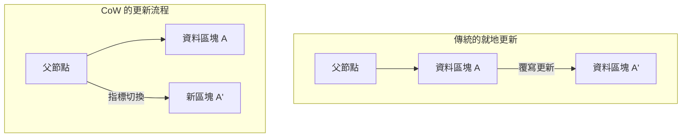
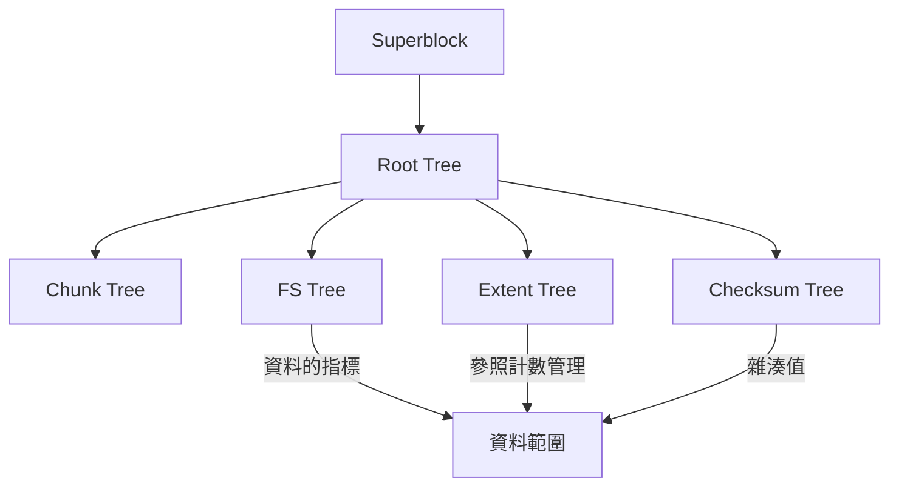

現代的運算環境中，確保資料持久性的「檔案系統」，是構成作業系統核心最為重要的元件之一。然而，隨著儲存容量邁入 PB (Petabyte)、EB (Exabyte) 領域，且 SSD 與 NVMe 等超高速、大容量的非揮發性記憶體逐漸普及，繼承自數十年前設計理念的傳統檔案系統，正逐漸面臨其架構上的極限。

本文將從檔案系統工程、核心儲存 (kernel storage) 以及分散式儲存的觀點，徹底剖析作為次世代檔案系統雙璧的 **ZFS** 與 **Btrfs** 的內部架構。Copy-on-Write (CoW) 這種典範轉移所帶來的交易一致性、使用 Merkle 樹 (雜湊樹) 來對抗靜態資料損壞 (Silent Data Corruption) 的手段，以及真正意義上的自我修復儲存是如何實現的。我們將交織原始碼層級的概念，解開其深淵般的數學結構與系統程式設計的奧妙。

---

## 第 1 章：傳統檔案系統 (ext4/XFS) 的極限與資料損壞

我們日常使用的 Linux 標準檔案系統 ext4，以及在企業級領域擁有極高實績的 XFS，都是極為優秀且成熟的軟體。然而，這些檔案系統採用了「就地更新 (In-place update)」這種古典的資料更新模型，在現代的大規模儲存環境中抱有致命的弱點。

### 1.1 就地更新與日誌紀錄的極限

就地更新是指在對檔案進行更改時，直接覆寫儲存媒體上原有資料區塊的方式。這種方式容易保持區塊的局部性，在 HDD 時代對於最小化尋軌時間 (seek time) 是有利的。

就地更新最大的問題在於，更新過程中若發生斷電或系統崩潰，會導致「崩潰一致性 (Crash Consistency)」的瓦解。為了防止這種情況，ext4 與 XFS 採用了 **日誌紀錄 (Write-Ahead Logging; WAL)**。在進行資料更新之前，首先會將變更內容 (元資料，或資料本身) 循序寫入日誌區域，然後再更新實際的檔案系統樹。

然而，一般的檔案系統基於效能考量，僅啟用「元資料日誌紀錄 (metadata journaling)」，資料本身的更新並不會記錄在日誌中。結果，在發生崩潰時，雖然可以恢復檔案的元資料 (大小、時間戳記、inode 等) 的一致性，但檔案內容本身卻伴隨著新舊資料混合的「撕裂寫入 (Torn Write)」風險。

### 1.2 靜態資料損壞 (Silent Data Corruption)

更為可怕的是 **靜態資料損壞 (Silent Data Corruption)**。由於儲存裝置控制器韌體的錯誤、宇宙射線導致記憶體上的位元反轉 (Bit Flip)、線材老化，或是因經年劣化導致的磁性/電荷衰減等原因，保存的資料在 OS 無法感知的情況下悄悄發生改變的現象。

傳統的檔案系統不具備驗證讀出資料「是否正確」的機制。雖然區塊儲存 (HDD 或 SSD) 內部存在 ECC (錯誤更正碼)，但如果控制器從錯誤的位置讀取資料 (Misdirected Read)，或是根本沒有進行寫入 (Phantom Write) 時，儲存硬體本身依然會回報「已正常讀出」。OS 會將損壞的資料原封不動地交給應用程式，應用程式在未察覺異常的情況下繼續處理，最終連備份也會被損壞的資料所覆寫。

### 1.3 硬體 RAID 的終結與「寫入漏洞 (Write Hole)」問題

長久以來，為提高資料的可用性，經常使用硬體 RAID (RAID 5 或 RAID 6)。然而，硬體 RAID 僅表現為一個不了解檔案系統內部結構的「單純區塊裝置」，因此並不能從根本上解決問題。

尤其致命的是 **RAID 的寫入漏洞 (Write Hole) 問題**。在 RAID 5 中，如果資料區塊與同位元區塊 (parity block) 更新期間發生斷電，條帶 (stripe) 內的資料與同位元一致性就會瓦解。下次讀取時，若使用這個瓦解的同位元來復原資料，資料就會被靜靜地破壞。此外，由於檔案系統側不存在校驗和，RAID 控制器無法從邏輯上判斷「哪顆硬碟的資料才是正確的」。

為了打破這種實體層、區塊層、檔案系統層相互割裂的傳統儲存堆疊的極限，統籌管理整體儲存的次世代檔案系統應運而生。

---

## 第 2 章：Copy-on-Write (CoW) 典範轉移

ZFS 與 Btrfs 所採用的革命性方法即為 **Copy-on-Write (CoW：寫入時複製)**。CoW 不僅僅是一項功能，更是對檔案系統資料結構與交易管理的典範轉移。

### 2.1 排除就地更新

在 CoW 檔案系統中，「絕對不會」覆寫現有的資料區塊。當要更新資料時，永遠會將資料寫入儲存媒體上的「新可用空間」。在寫入完全結束後，才會將指向該資料區塊的父節點 (元資料) 指標，以不可分割 (atomic) 的方式從舊區塊切換到新區塊。

### 2.2 交易一致性與配置指標的連鎖反應

檔案系統是以樹狀結構 (tree) 來管理資料的。如果將作為葉 (leaf) 節點的資料區塊寫入新位置，擁有該指標的父節點內容也會隨之改變。因此，父節點也必須寫入到新位置。這會一路連鎖傳播到根節點 (root node)。

在這一連串更新的最後，會以不可分割的方式更新位於整棵樹頂點的「超級區塊 (Superblock，在 ZFS 中稱為 Uberblock)」。就在這個單一不可分割的寫入完成的瞬間，交易便告確立 (commit)。如果在途中發生斷電，因為超級區塊仍指向舊的樹，系統會以完全無損的舊狀態啟動。原則上不再需要透過 fsck (檔案系統檢查) 進行漫長的修復作業。

### 2.3 瞬間建立快照的原理

CoW 最大的副產物，是運算複雜度為 $O(1)$ 的超高速快照 (snapshot)。
在一般的檔案系統中，若要複製目錄，必須在物理上複製所有的資料。但在 CoW 中，只需複製樹的根節點指標，並將各個節點的「參照計數器 (Reference Count)」遞增，快照便完成了。

當資料更新時，參照計數大於等於 2 的區塊不會被覆寫並會被保留下來，只有更新的部分會寫入到新區塊。藉由這種機制，幾乎不消耗儲存空間，就能瞬間凍結並持續保留檔案系統在任意時間點的狀態。

---

## 第 3 章：ZFS 的內部架構

由 Sun Microsystems (現 Oracle) 開發的 ZFS (Zettabyte File System)，擁有被譽為「檔案系統的最終答案」的完美架構。ZFS 將傳統的磁碟區管理員、RAID 控制器與檔案系統融合成了單一且統一的層級。

### 3.1 SPA、DMU、ZPL 的三層式架構

ZFS 的內部大致分為三個元件：

1. **SPA (Storage Pool Allocator)**
   位於最底層，負責管理實體裝置 (vdev: Virtual Device)。將 HDD 或 SSD 抽象化為儲存池 (pool)，向上層提供單一巨大的虛擬記憶體空間。RAID-Z 等備援機制、資料的條帶化 (striping) 以及用於自我修復的 I/O 都由這一層負責。SPA 的頂點存在著 **Uberblock**。
2. **DMU (Data Management Unit)**
   ZFS 的心臟部位。將所有資料視為「物件」來管理，並處理 CoW 的交易。DMU 不區分資料的種類 (目錄、檔案、屬性)，單純負責以不可分割的方式更新鍵值對以及資料區塊的關聯性 (dnode)。
3. **ZPL (ZFS POSIX Layer)**
   建構在 DMU 的物件系統之上，對 OS 提供相容 POSIX 的檔案系統介面 (open, read, write, stat 等)。

### 3.2 Uberblock 與交易群組 (TXG)

在 ZFS 中，寫入操作不會立即反映到磁碟上，而是在記憶體中進行批次處理，匯整為「交易群組 (Transaction Group, TXG)」。TXG 每隔數秒會一併排空 (flush) 到磁碟上 (這稱為交易同步)。此時，SPA 會寫入新的資料樹，最後以不可分割的方式更新 Uberblock 陣列中序號最新的那個。

### 3.3 ZFS Intent Log (ZIL) 與 SLOG

非同步寫入雖然能透過 TXG 高效處理，但對於像資料庫或虛擬機器這類要求利用 `fsync()` 進行「同步寫入 (Synchronous Write)」的應用程式而言，等待數秒的 TXG commit 是無法接受的。
這裡登場的便是 **ZIL (ZFS Intent Log)**。與其進行完整的樹狀更新 (CoW)，ZIL 選擇將變更資料的差異日誌高速寫入磁碟。在系統崩潰時，會讀出這個 ZIL 並在記憶體中重建 TXG。

此外，將 NVDIMM 或高速 NVMe SSD 等專用裝置分配為 ZIL 寫入目標的功能，即是 **SLOG (Separate Intent Log)**。藉此，即使是低速的 HDD 儲存池，也能戲劇性地改善同步寫入的延遲。

### 3.4 ARC 與 L2ARC：究極的快取演算法

支撐 ZFS 讀取效能的是 **ARC (Adaptive Replacement Cache)**。相較於傳統 Linux 核心的頁面快取主要採用 LRU (Least Recently Used：捨棄最久未使用的資料)，ARC 則是基於 IBM 的 Megiddo 等人所提出的 ARC 演算法。

ARC 透過以下四個列表來管理快取：
- **MRU (Most Recently Used)**: 最近被存取的資料
- **MFU (Most Frequently Used)**: 頻繁被存取的資料
- **Ghost MRU**: 從 MRU 溢出，但僅記錄元資料 (索引) 的列表
- **Ghost MFU**: 從 MFU 溢出的元資料列表

ARC 會監控工作負載，當執行掃描處理 (如備份) 時擴展 MRU，而當持續有常態的資料庫存取時則擴展 MFU。如果命中 Ghost 列表，便會判斷為「如果這個快取還留著就會命中」，進而動態調整 MRU 與 MFU 的分區大小。
此外，透過設定 **L2ARC (Level 2 ARC)** 將從 ARC 溢出的資料轉移到高速 SSD，可以建構出 TB 級別的快取層。

---

## 第 4 章：Btrfs 的 B-tree of trees 架構

另一方面，由 Oracle 的 Chris Mason 等人設計出的 Linux 原生次世代檔案系統便是 **Btrfs (B-tree file system)**。相對於 ZFS 濃厚地反映了 Solaris 的理念 (層級的嚴格分離)，Btrfs 則採取了與 Linux 的 VFS (Virtual File System) 緊密協作的途徑。

### 4.1 以 B 樹表現一切的數學結構

Btrfs 最優美且複雜的特徵在於「檔案系統的所有元資料與資料管理結構，都是由純粹的 B 樹 (嚴格來說是接近 B+ 樹的衍生型) 所構成」。Btrfs 被塑造成一個巨大的「B-tree of trees (B 樹的樹)」。

主要的樹有以下幾種：
1. **Root tree (樹的根)**: 保持所有其他樹的根節點指標與狀態。
2. **Chunk tree**: 將實體裝置的區塊 (實體位址) 對應至邏輯位址空間的區塊 (chunk)。軟體 RAID 的功能 (條帶化、鏡像) 會在這個樹的層級被解析。
3. **FS tree (檔案系統樹)**: 保持實際的目錄結構、檔名、inode 以及指向檔案資料的指標。
4. **Extent tree**: 管理整個檔案系統的可用空間，以及使用中範圍 (連續資料區塊) 的反向參照 (back reference)。藉此高效地處理因 CoW 而產生之複雜的參照計數增減。
5. **Checksum tree**: 獨立保存資料區塊校驗和的樹。

### 4.2 B 樹中的 CoW 探索與更新演算法

在 Btrfs 中更新資料時，會順著樹向下尋找目標的資料範圍 (extent)。若是就地更新，只需改寫葉節點即可；但在 Btrfs 的 CoW 中，會將葉節點複製到新的實體區域並改寫。接著，指向該葉的父節點指標會失效，因此也必須複製並改寫父節點。這會一路傳達至 Root tree。
在這個過程中，B 樹需要進行再平衡 (節點的分割或合併)。為提高在多執行緒環境下的並行存取效能，Btrfs 實作了將鎖定競爭 (lock contention) 降至最低的高階 B 樹操作演算法。

### 4.3 子磁碟區 (Subvolume) 與快照

Btrfs 中的「子磁碟區」是指擁有自己 Root 節點之獨立的 FS tree。在使用者看來它的行為如同目錄，但在檔案系統內部則被當成完全獨立的 B 樹來處理。
Btrfs 的快照只不過是複製某個子磁碟區的 Root 節點，並將其登錄為新的子磁碟區而已。因此，與 ZFS 相同，快照的建立能在瞬間完成。

---

## 第 5 章：Merkle 樹校驗和與自我修復功能

將 ZFS 與 Btrfs 和舊世代檔案系統做出決定性區分的功能，是「基於 Merkle 樹 (雜湊樹) 的加密演算法 (或非加密演算法) 校驗和以保證資料完整性」，以及利用此機制進行的「自我修復 (Self-Healing)」。

### 5.1 透過 Merkle 樹架構進行資料驗證

傳統檔案系統或硬體 RAID 多半將錯誤偵測碼內嵌在資料區塊自身當中。然而，如果資料被寫入到磁碟的錯誤位置 (Misdirected Write)，區塊本身的校驗和會被判定為「具備一致性」，從而無法偵測到損壞。

為了防止這種情況，ZFS 與 Btrfs 採用了 **Merkle 樹結構**。
以 ZFS 為例，資料區塊的校驗和 (如 SHA-256 或 fletcher4 等) 並非存儲在該區塊自身中，而是儲存在「指向該區塊的父節點 (的指標結構)」中。而父節點的校驗和又會存儲在其父節點中，並最終一路追溯至 Uberblock。

藉此，整棵樹將運作為一條巨大的雜湊鏈。當要讀取某個資料區塊時，OS 會從父節點取得校驗和，並與讀出資料所計算出的雜湊值進行比較。如果雜湊值不符，便能以 **絕對的準確度偵測** 出資料在磁碟上已經損壞，或者在傳輸路徑的記憶體或線材中發生了位元反轉。

### 5.2 克服 RAID-Z 中的寫入漏洞問題與自我修復

ZFS 的 RAID-Z (RAID-Z1/Z2/Z3) 藉由結合 CoW，徹底消除了傳統 RAID 5/6 所面臨的寫入漏洞問題。

在 RAID 5 中，條帶寬度是固定的 (例如：3 個資料區塊 + 1 個同位元區塊)，當只更新部分區塊時 (Read-Modify-Write) 便存在著不一致的風險。
在 RAID-Z 中，**條帶寬度會根據寫入資料的大小動態改變** (Variable Stripe Width)。所有的寫入必定是「寫入到新位置的完整條帶寫入 (Full-Stripe Write)」，因此即使在更新途中發生崩潰，舊條帶會原封不動地保留，新條帶則會被丟棄，絕對不會發生同位元不一致的狀況。

RAID-Z2/Z3 中的同位元計算，是透過利用有限體 (Galois Field: GF(2^8)) 數學的 Reed-Solomon 編碼來進行的。憑藉複雜的矩陣運算，若是 Z3，便能從任意 3 顆磁碟故障中復原資料。

自我修復的流程如下：
1. 應用程式請求資料，ZFS 從磁碟 A 讀出區塊。
2. 驗證校驗和，偵測出不符 (資料損壞)。
3. ZFS 捨棄磁碟 A 的資料，並利用 RAID-Z 的同位元，或從正在做鏡像的磁碟 B 讀出資料 (或是透過計算還原)。
4. 驗證還原資料的校驗和，若正確則將資料回傳給應用程式。
5. **在背景自動將正確的資料寫入磁碟 A 的新區塊中 (修復)，並更新元資料。**

在不需要系統管理員介入的情況下，儲存系統便能偵測到自身的損壞，並自發性地進行修復。

### 5.3 擦洗 (Scrub) 處理的內部運作

若只有在讀取資料時才進行修復，存取頻率低的冷資料若被長期閒置，便會有因多顆磁碟同時故障而無法修復的風險 (Bit Rot 的累積)。
防範這種情況的便是 **擦洗 (Scrub)**。當執行擦洗時，檔案系統會像是從根節點往下舔舐一般走訪樹狀結構，讀出磁碟上所有的元資料與資料區塊，並重新計算與驗證校驗和。一旦發現異常，會立刻執行修復。這與硬體 RAID 的同位元檢查 (Patrol Read) 類似，但由於是在檔案系統層級，連同元資料的邏輯結構一起驗證，因此可靠度壓倒性地高。

---

## 第 6 章：ZFS vs Btrfs 徹底比較與未來的儲存技術

作為爭奪次世代檔案系統霸權的 ZFS 與 Btrfs，基於其設計理念與歷史背景存在著明確的差異。系統架構師必須根據需求適當地在兩者間做選擇。

### 6.1 記憶體消耗量與效能特性

- **ZFS**: 如前所述，由於實作了獨有的 ARC，因此會非常積極地消耗記憶體。其設計理念是「記憶體有多少就用多少」，建議最少分配數 GB，而在企業級應用上更是建議分配數十 GB 到數百 GB 的 RAM 給 ARC。只要記憶體充足，便能發揮無敵的效能。
- **Btrfs**: 與 Linux 核心標準的頁面快取 (VFS 層) 緊密整合。因此其記憶體佔用量 (memory footprint) 被抑制在與 ext4 或 XFS 相當的程度，即使在資源有限的邊緣裝置、嵌入式系統，或是小規模的 VPS 上也能穩定運作。

### 6.2 授權問題：CDDL vs GPL

ZFS 遲遲未被合併到 Linux 核心主線 (標準樹) 的最大原因並非技術問題，而是授權上的不相容。ZFS 的 CDDL (Common Development and Distribution License) 授權與 Linux 核心的 GPLv2 在法律上被認為是互斥的。因此，在 Linux 上使用 ZFS 時，會採取另外編譯核心模組並載入的形式 (OpenZFS)。
相對地，Btrfs 則是作為純粹的 GPL 專案進行開發，並標準內建於 Linux 核心中。在主流的 Linux 發行版 (如 SUSE、Fedora 等) 均被採用為預設檔案系統。

### 6.3 使用案例與採用實例

**ZFS (OpenZFS) 的領域**：
在 TrueNAS 等儲存設備 (storage appliance)、Proxmox VE 或 LXD 等 Hypervisor 基建，以及絕對不允許丟失資料的企業級備份伺服器中獲得了壓倒性的支持。此外，在 FreeBSD 系統中長年雄踞標準檔案系統的寶座。

**Btrfs 的領域**：
Facebook (Meta) 基礎設施中數百萬台 Linux 伺服器叢集的根檔案系統、Synology 等消費級/SMB 用 NAS、Steam Deck 等遊戲 OS，以及做為 Fedora Workstation 的預設選項，Btrfs 靈活運用其磁碟區管理與快照功能，獲得了廣泛的普及。

### 6.4 迎向雲端原生時代的儲存基建

隨著容器技術 (Docker/Kubernetes) 的普及，對儲存系統提出了「毫秒級的快照建立與銷毀」以及「高效率的容器映像檔分層 (layering)」等需求。ZFS 與 Btrfs 的 CoW 功能，與容器的儲存驅動程式 (作為 overlayfs 的替代方案或後端) 搭配起來有著極佳的相容性。

更進一步，隨著 CXL (Compute Express Link) 或 NVMe-oF 所帶來的儲存解聚 (分離與共享化)、運算型儲存 (Computational Storage) 等次世代硬體的出現，檔案系統正逐漸從單純的「資料容器」，進化為統籌資料保護、加密、壓縮以及重複資料刪除 (Deduplication) 的「資料控制平面 (Data Control Plane)」。

在資料成為所有價值源泉的現代，ZFS 與 Btrfs 所開創的「CoW 與自我修復」典範，是守護人類智慧財產免於實體崩壞的最強護盾。我們如今正見證著傳統儲存架構的終結，以及知性且自主的次世代檔案系統的黎明。
