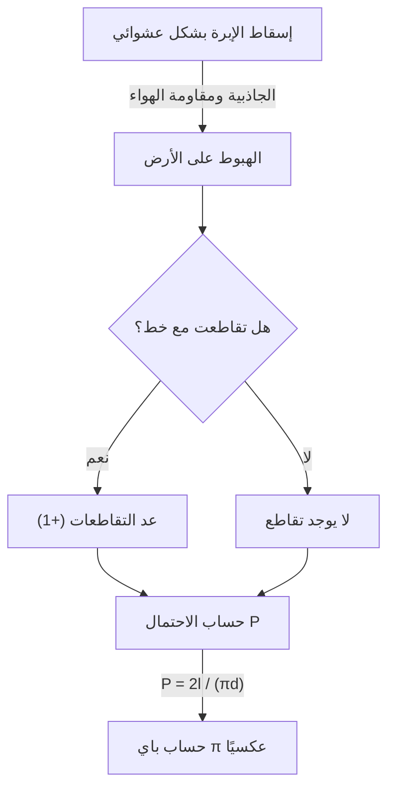

# ما هي [إبرة بوفون](https://kenji.blog/ar/p/buffons-needle/)؟

في عالم الرياضيات، هناك العديد من النظريات الجميلة حيث تتصل الحقائق المذهلة التي تتعارض مع الحدس أو الأحداث التي تبدو غير مرتبطة ببعضها البعض بشكل جميل. واحدة من أشهر المشاكل وأكثرها روعة بينها هي **مشكلة [إبرة بوفون](https://kenji.blog/ar/p/buffons-needle/)**.

تم اقتراح هذه المشكلة في عام 1733 من قبل جورج لويس لكليرك، كونت دي بوفون، وهو عالم طبيعة وعالم رياضيات فرنسي في القرن الثامن عشر، وتم حلها لأول مرة في عام 1777.

من المثير للدهشة أن هذه المشكلة تنص على أنه من خلال الفعل الفيزيائي والعشوائي للغاية المتمثل في "إسقاط إبرة بشكل عشوائي على الأرض"، يمكن للمرء تحديد أحد أهم الثوابت في الرياضيات، **باي $\pi$**. يُعرف هذا بأنه أحد أقدم المشاكل في الاحتمال الهندسي وكان اكتشافًا رائدًا يمكن القول إنه رائد لطريقة مونت كارلو اللاحقة.

في هذه المقالة، سنشرح بالتفصيل وبطريقة سهلة الفهم، بدءًا من تحديد مشكلة **[إبرة بوفون](https://kenji.blog/ar/p/buffons-needle/)**، وإثباتها الرياضي، وصولاً إلى تقدير باي عن طريق المحاكاة باستخدام أجهزة الكمبيوتر الحديثة.

## الإعداد الأساسي للمشكلة

إعداد مشكلة [إبرة بوفون](https://kenji.blog/ar/p/buffons-needle/) بسيط للغاية.

1. على أرضية مستوية، يتم رسم العديد من الخطوط المستقيمة المتوازية على فترات متساوية $d$.
2. يتم تجهيز إبرة واحدة بطول $l$.
3. يتم إسقاط هذه الإبرة بشكل عشوائي على الأرض.

في هذا الوقت، **"ما هو احتمال أن تتقاطع الإبرة التي تم إسقاطها مع أحد الخطوط المتوازية المرسومة على الأرض؟"** هي المشكلة التي اقترحها بوفون.

يوضح الرسم البياني التالي التدفق المفاهيمي لهذه التجربة.



هنا، لتبسيط المشكلة، نعتبر حالة **الإبرة القصيرة**، حيث يكون طول الإبرة $l$ أقل من أو يساوي المسافة بين الخطوط المتوازية $d$ ($l \le d$). في ظل هذا الشرط، لن تتقاطع الإبرة أبدًا مع خطين مستقيمين أو أكثر في نفس الوقت.

## النمذجة الرياضية واشتقاق الاحتمال

لحل هذه المشكلة رياضيًا، من الضروري قياس (تحديد معلمات) حالة الإبرة. عندما تسقط الإبرة على الأرض، نفترض أن موقعها واتجاهها عشوائيان تمامًا.

لتحديد موقع الإبرة، نحدد المتغيرين التاليين.

1. $x$ : المسافة العمودية من مركز الإبرة إلى أقرب خط موازٍ.
2. $\theta$ : الزاوية الحادة (أو الزاوية القائمة) التي شكلتها الإبرة والخطوط المتوازية.

### النطاق المحتمل للمتغيرات

أولاً، دعونا نفكر في القيم التي يمكن أن يأخذها كل متغير.

- **فيما يتعلق بالمسافة $x$:** يقع مركز الإبرة في مكان ما بين خطين متوازيين متجاورين. نظرًا لأننا نعتبر المسافة إلى أقرب خط، فإن الحد الأدنى لقيمة $x$ هو $0$ (عندما يكون مركز الإبرة على الخط)، والحد الأقصى للقيمة هو $\frac{d}{2}$ (عندما يكون مركز الإبرة في منتصف الطريق تمامًا بين خطين). أي $0 \le x \le \frac{d}{2}$. نظرًا لأن الإبرة يتم إسقاطها عشوائيًا، يتبع $x$ **توزيعًا منتظمًا** في هذا النطاق. دالة كثافة الاحتمال هي $\frac{2}{d}$.
- **فيما يتعلق بالزاوية $\theta$:** تأخذ الزاوية التي شكلتها الإبرة والخط الموازي قيمة من $0$ عندما تكون الإبرة موازية للخط المستقيم، إلى $\frac{\pi}{2}$ (90 درجة) عندما تكون متعامدة. من التماثل، ليست هناك حاجة للنظر في زوايا أكبر من هذا. لذلك، $0 \le \theta \le \frac{\pi}{2}$. نظرًا لأن اتجاه الإبرة عشوائي أيضًا، يتبع $\theta$ أيضًا **توزيعًا منتظمًا** في هذا النطاق. دالة كثافة الاحتمال هي $\frac{2}{\pi}$.

نظرًا لأن المتغيرين $x$ و $\theta$ مستقلان عن بعضهما البعض، فإن دالة كثافة الاحتمال المشتركة $f(x, \theta)$ بأن يأخذوا زوجًا معينًا $(x, \theta)$ يتم التعبير عنها كحاصل ضرب دوال كثافة الاحتمال الخاصة بكل منهما.

$$
f(x, \theta) = \frac{2}{d} \times \frac{2}{\pi} = \frac{4}{d\pi}
$$

### شروط التقاطع

بعد ذلك، ضع في اعتبارك شروط تقاطع الإبرة مع خط مستقيم.
تتقاطع الإبرة مع خط مستقيم عندما يكون الطول العمودي من مركز الإبرة إلى نهايتها أكبر من أو يساوي المسافة $x$ إلى أقرب خط.

بما أن طول الإبرة هو $l$، فإن الطول من المركز إلى النهاية هو $\frac{l}{2}$.
عندما تكون الزاوية $\theta$، فإن المسافة التي يشغلها نصف الإبرة في الاتجاه العمودي (الطول المسقط) هي $\frac{l}{2} \sin \theta$.

لذلك، يتم التعبير عن شرط تقاطع الإبرة مع خط مستقيم من خلال المتباينة التالية.

$$
x \le \frac{l}{2} \sin \theta
$$

### حساب الاحتمال

يتم الحصول على الاحتمال $P$ لتقاطع الإبرة مع خط من خلال دمج دالة كثافة الاحتمال المشتركة $f(x, \theta)$ على المنطقة التي تلبي شرط التقاطع.

$$
P = \iint_{\text{منطقة التقاطع}} f(x, \theta) \, dx \, d\theta
$$

نطاق التكامل المحدد هو حيث يتغير $\theta$ من $0$ إلى $\frac{\pi}{2}$، ويتغير $x$ من $0$ إلى القيمة الحدية للتقاطع $\frac{l}{2} \sin \theta$.

$$
P = \int_{0}^{\frac{\pi}{2}} \int_{0}^{\frac{l}{2} \sin \theta} \frac{4}{d\pi} \, dx \, d\theta
$$

أولاً، نحسب التكامل الداخلي بالنسبة إلى $x$.

$$
\int_{0}^{\frac{l}{2} \sin \theta} \frac{4}{d\pi} \, dx = \frac{4}{d\pi} \left[ x \right]_{0}^{\frac{l}{2} \sin \theta} = \frac{4}{d\pi} \left( \frac{l}{2} \sin \theta - 0 \right) = \frac{2l}{d\pi} \sin \theta
$$

بعد ذلك، نحسب التكامل الخارجي بالنسبة إلى $\theta$.

$$
P = \int_{0}^{\frac{\pi}{2}} \frac{2l}{d\pi} \sin \theta \, d\theta = \frac{2l}{d\pi} \int_{0}^{\frac{\pi}{2}} \sin \theta \, d\theta
$$

بما أن تكامل $\sin \theta$ هو $-\cos \theta$،

$$
\int_{0}^{\frac{\pi}{2}} \sin \theta \, d\theta = \left[ -\cos \theta \right]_{0}^{\frac{\pi}{2}} = (-\cos \frac{\pi}{2}) - (-\cos 0) = -0 - (-1) = 1
$$

وبالتالي، فإن الاحتمال المطلوب $P$ هو كما يلي.

$$
P = \frac{2l}{d\pi} \times 1 = \frac{2l}{\pi d}
$$

هذه هي الصيغة الأساسية لـ **[إبرة بوفون](https://kenji.blog/ar/p/buffons-needle/)**. احتمال تقاطع الإبرة مع خط هو ضعف طول الإبرة $l$، مقسومًا على حاصل ضرب باي $\pi$ والفاصل الزمني للخطوط $d$.

## تقدير باي (طريقة مونت كارلو)

تتضمن الصيغة المشتقة $P = \frac{2l}{\pi d}$ بشكل جميل $\pi$. حل هذا بالنسبة لـ $\pi$ يعطي ما يلي.

$$
\pi = \frac{2l}{P d}
$$

هذه المعادلة تعني أنه إذا كان الاحتمال $P$ فقط معروفًا، فيمكن حساب باي $\pi$. بالطبع، لا يمكن معرفة الاحتمال الحقيقي $P$ دون عدد لا حصر له من التجارب، ولكن من خلال إسقاط الإبرة عدة مرات في تجربة فعلية، يمكن الحصول على قيمة تقريبية لـ $P$.

ليكن $N$ هو إجمالي عدد مرات إسقاط الإبرة، و $C$ هو عدد مرات تقاطع الإبرة مع خط.
إذا كان عدد التجارب $N$ كبيرًا بما يكفي، فبموجب [قانون الأعداد الكبيرة](https://kenji.blog/ar/p/law-of-large-numbers/)، يقترب الاحتمال التجريبي $\frac{C}{N}$ من الاحتمال النظري $P$.

$$
P \approx \frac{C}{N}
$$

استبدال هذا في المعادلة السابقة يعطي صيغة لإيجاد القيمة التقريبية لباي $\pi$.

$$
\pi \approx \frac{2l \cdot N}{C \cdot d}
$$

أسهل حساب هو عندما يكون طول الإبرة $l$ والمسافة بين الخطوط $d$ متماثلين ($l = d$). في هذا الوقت، تصبح الصيغة أبسط.

$$
\pi \approx \frac{2N}{C}
$$

بعبارة أخرى، ما عليك سوى قسمة ضعف "عدد مرات إسقاط الإبرة" على "عدد مرات تقاطعها"، وسيتم الحصول على باي!

### محاكاة مع بايثون

يعد إسقاط إبرة آلاف المرات باليد مهمة شاقة للغاية (على الرغم من أنه تاريخياً، كان هناك علماء رياضيات أجروا بالفعل تجارب آلاف المرات). اليوم، يمكننا بسهولة محاكاة هذه التجربة باستخدام جهاز كمبيوتر.

يوجد أدناه مثال بسيط على كود يستخدم بايثون لمحاكاة تجربة [إبرة بوفون](https://kenji.blog/ar/p/buffons-needle/) وتقدير باي.

```python
import random
import math

def buffons_needle_simulation(num_trials, l, d):
    """
    دالة لمحاكاة إبرة بوفون وتقدير باي
    
    :param num_trials: عدد مرات إسقاط الإبرة
    :param l: طول الإبرة
    :param d: فاصل الخطوط المتوازية
    :return: باي المقدر
    """
    crosses = 0
    
    for _ in range(num_trials):
        # توليد مسافة x عشوائيًا من مركز الإبرة إلى أقرب خط (0 إلى d/2)
        x = random.uniform(0, d / 2.0)
        
        # توليد زاوية الإبرة theta عشوائيًا (0 إلى pi/2)
        theta = random.uniform(0, math.pi / 2.0)
        
        # تحقق مما إذا كان شرط التقاطع قد استوفى
        if x <= (l / 2.0) * math.sin(theta):
            crosses += 1
            
    # معالجة الاستثناء لتجنب الأخطاء إذا لم تتقاطع أبدًا
    if crosses == 0:
        return float('inf')
        
    # حساب تقدير باي
    estimated_pi = (2.0 * l * num_trials) / (d * crosses)
    return estimated_pi

# إعدادات المعلمات
N = 1000000  # عدد التجارب (1 مليون مرة)
needle_length = 1.0
line_distance = 1.0

# تنفيذ المحاكاة
estimated_pi = buffons_needle_simulation(N, needle_length, line_distance)

print(f"عدد التجارب: {N:,} مرة")
print(f"باي المقدر:     {estimated_pi}")
print(f"باي الفعلي:        {math.pi}")
print(f"الخطأ:            {abs(math.pi - estimated_pi)}")
```

يؤدي تشغيل هذا الرمز إلى إسقاط عدد كبير من الإبر الافتراضية باستخدام أرقام عشوائية، ويمكن التأكد من الحصول على قيمة تقريبية لباي تبلغ $3.1415...$ بدقة عالية جدًا. تسمى طريقة استخدام الأرقام العشوائية لإيجاد حلول تقريبية للمشاكل الاحتمالية بهذه الطريقة **طريقة مونت كارلو**.

## ملخص

تبدو [إبرة بوفون](https://kenji.blog/ar/p/buffons-needle/) للوهلة الأولى وكأنها مجرد لعبة حظ فيزيائية، ولكن وراءها نظرية رياضية قوية. الطريقة التي تندمج بها الأحداث العشوائية (الاحتمال)، والأشكال الهندسية (الخطوط ومقاطع الخطوط)، والرقم غير النسبي النهائي $\pi$ في صيغة رياضية بسيطة واحدة تجسد جمال الرياضيات.

كما أن لهذه المشكلة أهمية تاريخية كأصل لطريقة مونت كارلو التي لا غنى عنها للعلوم والتكنولوجيا الحديثة. من خلال محاكاة الأنظمة المعقدة وحساب التكاملات التي يصعب حلها تحليليًا، لا تزال فكرة بوفون تدعم عالمنا بأشكال مختلفة اليوم.

لماذا لا تحضر بعض الورق والقلم وبعض المسواك، وتجرب جزءًا من هذا التاريخ الرياضي العظيم في المنزل؟
